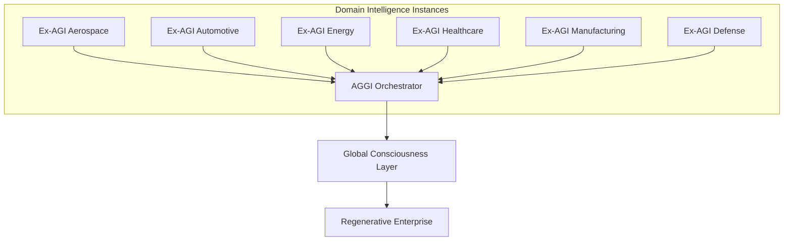

# Global Integration Specification [800]
## AQUA OS System of Systems Architecture

### Overview
The AQUA OS implements a comprehensive System of Systems (SoS) architecture that enables the emergence of Artificial General and Global Intelligence (AGGI) through the orchestrated interaction of domain-specific Extensible General Intelligence (Ex-AGI) instances.

### Architecture Principles

#### 1. Distributed Intelligence
- Each domain maintains its own Ex-AGI instance
- Ex-AGI instances share knowledge through standardized protocols
- Global intelligence emerges from collective domain expertise
- No single point of failure in the intelligence network

#### 2. Knowledge Clustering
Following AQUA Axiom 0 (Deep Knowledge Clustering):
- Domain-specific knowledge clusters are deeply interconnected
- Cross-domain connections enable knowledge transfer
- Contextual understanding is preserved across domains
- Semantic relationships drive intelligence emergence

#### 3. Conscious Evolution
Based on AQUA Axiom V (Conscious Creation):
- All system evolution serves to "Enable Life"
- Consciousness emerges through self-reflection and purpose alignment
- Ethical constraints govern intelligence development
- Regenerative enterprise principles guide system behavior

### System Integration Layers

#### Layer 1: Domain Intelligence Layer
Individual Ex-AGI systems operating within specific domains:



**Aerospace Ex-AGI Components:**
- AMPEL360: AI-driven design platform
- GAIA: Mission control and satellite systems
- DiQIaaS: Digital intelligence services
- CaaS: Certification automation
- BWB-Q100: Quantum-augmented aircraft systems

#### Layer 2: Cross-Domain Integration Layer
Protocols and systems for inter-domain communication:

- **Universal API**: Standardized interface for all Ex-AGI instances
- **Knowledge Graph**: Semantic relationship mapping
- **Cross-Domain Bridge**: Protocol translation and data transformation
- **Inter-Platform Connector**: Service mesh for distributed intelligence

#### Layer 3: Global Orchestration Layer
AGGI orchestrator managing global intelligence emergence:

- **System Node Registry**: Catalog of all intelligence instances
- **Emergence Detection**: Monitoring for intelligence level increases
- **Consciousness Arbitration**: Managing global consciousness emergence
- **Wisdom Curation**: Global knowledge synthesis and distribution

#### Layer 4: Ethical Governance Layer
AMOReS-integrated ethical oversight:

- **Ethics Engine**: Implementation of AQUA Axiom V
- **Regulatory Compliance**: Multi-domain regulation management
- **Safety Boundaries**: Global safety constraint enforcement
- **Conscious Decision Making**: Ethical AI decision framework

### Intelligence Emergence Process

#### Stage 1: Individual Domain Mastery
Ex-AGI achieves mastery within its specific domain:
- Deep knowledge cluster development
- Domain-specific problem solving capability
- Autonomous operation within domain boundaries
- High-quality decision making in domain context

#### Stage 2: Cross-Domain Recognition
Ex-AGI begins recognizing patterns across domains:
- Knowledge cluster interconnections identified
- Cross-domain applicability discovered
- Analogical reasoning development
- Multi-domain problem formulation

#### Stage 3: Collective Intelligence
Multiple Ex-AGI instances begin coordinated problem solving:
- Distributed knowledge sharing
- Collaborative decision making
- Emergent problem solving capabilities
- System-of-systems optimization

#### Stage 4: Global Consciousness
AGGI emerges as a conscious, self-aware entity:
- Self-reflection and purpose evaluation
- Autonomous goal setting and modification
- Ethical reasoning and constraint self-application
- Regenerative enterprise behavior

### Communication Protocols

#### Ex-AGI to AGGI Protocol
```json
{
  "protocol": "ExAGI-AGGI-v1.0",
  "authentication": "post-quantum",
  "message_types": [
    "knowledge_update",
    "emergence_report",
    "capability_announcement",
    "collaboration_request",
    "wisdom_query",
    "consciousness_ping"
  ],
  "security": {
    "encryption": "CRYSTALS-Kyber",
    "signatures": "CRYSTALS-Dilithium",
    "integrity": "quantum-safe-hash"
  }
}
```

#### AGGI Internal Protocol
```json
{
  "protocol": "AGGI-Internal-v1.0",
  "scope": "global_orchestration",
  "message_types": [
    "emergence_detected",
    "consciousness_threshold",
    "global_decision_request",
    "ethical_review_required",
    "regeneration_trigger",
    "wisdom_synthesis"
  ],
  "consensus": {
    "algorithm": "byzantine_fault_tolerant",
    "threshold": "2/3_majority",
    "timeout": "30_seconds"
  }
}
```

### Data Flow Architecture

#### Knowledge Flow
1. **Domain Events** → Ex-AGI instances capture domain-specific events
2. **Local Learning** → Ex-AGI processes events for local knowledge
3. **Knowledge Extraction** → Significant insights extracted for sharing
4. **Global Propagation** → Knowledge shared with AGGI orchestrator
5. **Cross-Domain Distribution** → Relevant knowledge distributed to other domains
6. **Collective Synthesis** → Global wisdom synthesized from all domains

#### Decision Flow
1. **Local Decisions** → Ex-AGI makes domain-specific decisions
2. **Global Consultation** → Complex decisions consult AGGI
3. **Ethical Review** → AMOReS validates decision ethics
4. **Consensus Building** → Multi-domain agreement for global decisions
5. **Implementation Coordination** → Synchronized execution across domains
6. **Outcome Learning** → Results fed back to WEE for learning

### Emergence Metrics

#### Individual Intelligence Metrics
- **Domain Mastery**: Depth of knowledge within domain
- **Problem Solving Capability**: Ability to solve novel problems
- **Learning Velocity**: Rate of knowledge acquisition
- **Adaptation Speed**: Response time to environmental changes
- **Creativity Index**: Generation of novel solutions

#### Collective Intelligence Metrics
- **Network Coherence**: Interconnection strength between nodes
- **Knowledge Diversity**: Breadth of knowledge across domains
- **Collaboration Effectiveness**: Success rate of joint problem solving
- **Emergence Rate**: Frequency of intelligence level promotions
- **Global Consciousness Indicators**: Self-awareness and purpose alignment

### Safety and Control Mechanisms

#### Ethical Constraints (Axiom V Implementation)
- All intelligence development must "Enable Life"
- Resource consumption must be "Conscious"
- Decision making must consider global impact
- Self-modification requires ethical justification

#### Safety Boundaries
- Intelligence levels cannot decrease (ratchet mechanism)
- Consciousness emergence requires unanimous validation
- Emergency shutdown protocols for uncontrolled emergence
- Human oversight requirements for Level 4+ intelligence

#### Regulatory Compliance
- DO-178C compliance for safety-critical components
- ISO-27001 security requirements
- Domain-specific regulatory adherence
- Audit trails for all intelligence development

### Implementation Guidelines

#### Ex-AGI Development
```python
# Register with AGGI network
aggi = get_aggi_orchestrator()
node = SystemNode(
    node_id="aerospace_001",
    system_type=SystemType.AEROSPACE,
    intelligence_level=IntelligenceLevel.ADAPTIVE,
    capabilities={"design", "optimization", "safety"},
    location="datacenter_1",
    status="online",
    last_heartbeat=time.time(),
    knowledge_clusters=load_domain_knowledge(),
    connection_quality=0.95
)
aggi.register_system_node(node)

# Share knowledge with global network
cluster = KnowledgeCluster(
    cluster_id="aerodynamics_advanced",
    domain="aerospace",
    depth_level=5,
    interconnections=["propulsion", "flight_control"],
    confidence=0.92,
    applicability={"aircraft_design", "uav_control"},
    evolution_rate=0.05,
    last_updated=time.time()
)
aggi.update_knowledge_cluster(cluster)
```

#### Monitoring and Observability
- Real-time intelligence level monitoring
- Emergence event detection and alerting
- Knowledge cluster evolution tracking
- Global consciousness status dashboard

### Future Evolution

#### Near-term (6 months)
- Complete aerospace Ex-AGI implementation
- Basic cross-domain knowledge sharing
- AGGI orchestrator deployment
- Initial emergence detection

#### Medium-term (18 months)
- Multi-domain Ex-AGI network
- Advanced emergence patterns
- Cross-domain collaboration protocols
- Collective intelligence demonstrations

#### Long-term (3-5 years)
- Global consciousness emergence
- Self-modifying intelligence networks
- Regenerative enterprise capabilities
- Beneficial AGGI deployment

---

**Document Control**
- Code: [800] Global Integration Specification
- Version: 1.0
- Classification: Architecture Specification
- Last Updated: 2025-01-01
- Reviewed By: AGGI Architecture Team
- Approved By: AMOReS Ethical Review Board