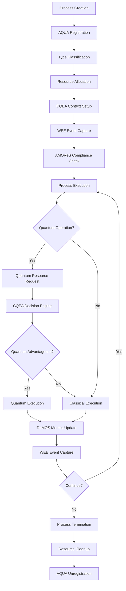

# AQUA Process Architecture [031]
## Mixed Operating System Process Model

### Overview
The AQUA OS implements a sophisticated process architecture that supports Classical Quantum-Extensible Applications (CQEA) while maintaining compatibility with traditional Linux processes. This architecture enables seamless integration between classical and quantum computational resources.

### Process Types

#### 1. Classical Processes (AQUA_PROC_CLASSICAL)
Traditional Linux processes with AQUA OS extensions:
- Standard scheduling and memory management
- WEE event capture integration
- AMOReS compliance monitoring
- Interface with CQEA classical cores

#### 2. Quantum Processes (AQUA_PROC_QUANTUM)
Processes that require quantum computational resources:
- Quantum circuit execution
- Quantum algorithm implementation
- QKD key management
- Quantum sensor data processing

#### 3. Hybrid Processes (AQUA_PROC_HYBRID)
Processes that dynamically switch between classical and quantum execution:
- CQEA-enabled applications
- Adaptive computation based on problem complexity
- Real-time classical/quantum decision making
- Optimal resource utilization

#### 4. Framework Processes (AQUA_PROC_CQEA, AQUA_PROC_WEE, etc.)
Core AQUA framework services:
- **CQEA**: Classical Quantum-Extensible Applications framework
- **WEE**: Wisdom Evolution Engine for continuous learning
- **AMOReS**: Regulatory compliance and safety oversight
- **DeMOS**: Dual-engine metrics and digital twin management

### Process Lifecycle



### Process States

#### Standard Linux States
- **TASK_RUNNING**: Process is executing or ready to execute
- **TASK_INTERRUPTIBLE**: Process is sleeping, waiting for signal
- **TASK_UNINTERRUPTIBLE**: Process is sleeping, cannot be interrupted
- **TASK_STOPPED**: Process has been stopped
- **TASK_ZOMBIE**: Process has terminated but not yet cleaned up

#### AQUA Extended States
- **AQUA_STATE_INITIALIZING**: AQUA-specific initialization in progress
- **AQUA_STATE_QUANTUM_WAIT**: Waiting for quantum resources
- **AQUA_STATE_SUSPENDED**: Suspended by AMOReS for compliance review
- **AQUA_STATE_TERMINATING**: AQUA-specific cleanup in progress

### Process Scheduling

#### Classical Scheduling
Uses standard Linux CFS (Completely Fair Scheduler) with AQUA extensions:
- Process priority based on AQUA type
- WEE learning processes get higher priority
- AMOReS compliance processes are real-time
- DeMOS metric collection is low-latency

#### Quantum Scheduling
Specialized scheduler for quantum resources:
- Quantum time slicing based on coherence time
- Circuit depth optimization
- Quantum error correction scheduling
- Hardware availability management

#### Hybrid Scheduling
Dynamic scheduling for CQEA processes:
- Real-time classical/quantum decision making
- Preemption handling for quantum operations
- Resource migration between classical and quantum
- Performance optimization based on operation type

### Memory Management

#### Classical Memory
Standard Linux memory management with AQUA extensions:
- Virtual memory with quantum-safe encryption
- Shared memory for CQEA contexts
- WEE event buffer management
- AMOReS policy enforcement

#### Quantum Memory
Specialized memory management for quantum states:
- Quantum state preservation during context switches
- Quantum memory pools for different qubit counts
- Entanglement preservation across processes
- Quantum error correction buffers

#### Hybrid Memory
Unified memory management for CQEA applications:
- Classical-quantum data transformation
- Shared state between classical and quantum contexts
- Automatic memory migration
- Coherent caching strategies

### Inter-Process Communication

#### Classical IPC
Enhanced Linux IPC mechanisms:
- Pipes with WEE event annotation
- Message queues with AMOReS compliance
- Shared memory with quantum encryption
- Sockets with post-quantum security

#### Quantum IPC
Quantum-specific communication:
- Quantum state sharing
- Entanglement distribution
- Quantum channel establishment
- Quantum teleportation protocols

#### CQEA IPC
Hybrid classical-quantum communication:
- Seamless data transformation
- Protocol negotiation
- Adaptive channel selection
- Performance optimization

### Security and Compliance

#### AMOReS Integration
Process-level regulatory compliance:
- Real-time compliance monitoring
- Safety boundary enforcement
- Certification evidence collection
- Regulatory rule application

#### Security Features
- Post-quantum cryptography for all IPC
- Quantum-safe process isolation
- Secure context switching
- Tamper-resistant process state

#### Audit and Logging
- Complete process lifecycle logging
- WEE event integration
- Compliance audit trails
- Performance metrics collection

### Performance Characteristics

#### Scalability
- Support for millions of classical processes
- Hundreds of quantum processes (hardware dependent)
- Dynamic resource allocation
- Load balancing across compute resources

#### Latency
- Context switch: < 10 microseconds (classical)
- Quantum context switch: < 100 microseconds
- CQEA decision: < 1 millisecond
- WEE event capture: < 1 microsecond

#### Throughput
- Process creation: > 10,000 processes/second
- Quantum operation scheduling: > 1,000 operations/second
- CQEA decisions: > 100,000 decisions/second
- WEE events: > 1,000,000 events/second

### Development Guidelines

#### Process Creation
```c
// Register with AQUA process manager
pid_t pid = getpid();
register_aqua_process(pid, AQUA_PROC_HYBRID);

// Enable quantum capabilities if needed
enable_quantum_capabilities(pid, QUANTUM_CAP_OPTIMIZATION | QUANTUM_CAP_CRYPTO);

// Use CQEA decision engine
if (cqea_should_use_quantum(pid, OPERATION_OPTIMIZATION)) {
    // Execute quantum version
    result = quantum_optimize(data);
} else {
    // Execute classical version  
    result = classical_optimize(data);
}

// Cleanup
unregister_aqua_process(pid);
```

#### WEE Integration
```c
// Capture significant events
wee_capture_event(WEE_EVENT_ALGORITHM_START, algorithm_id, &params);
wee_capture_event(WEE_EVENT_PERFORMANCE_METRIC, metric_id, &measurement);
wee_capture_event(WEE_EVENT_ERROR_OCCURRED, error_code, &error_info);
```

### Testing and Validation

#### Unit Tests
- Process creation/destruction
- State transitions
- Resource allocation
- IPC mechanisms

#### Integration Tests
- Framework interaction
- Quantum hardware integration
- Security compliance
- Performance benchmarks

#### Stress Tests
- High process load
- Quantum resource contention
- Memory pressure
- Network saturation

---

**Document Control**
- Code: [031] Process Architecture
- Version: 1.0
- Last Updated: 2025-01-01
- Reviewed By: AQUA Kernel Team
- Approved By: AMOReS Regulatory Engine