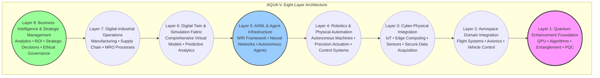
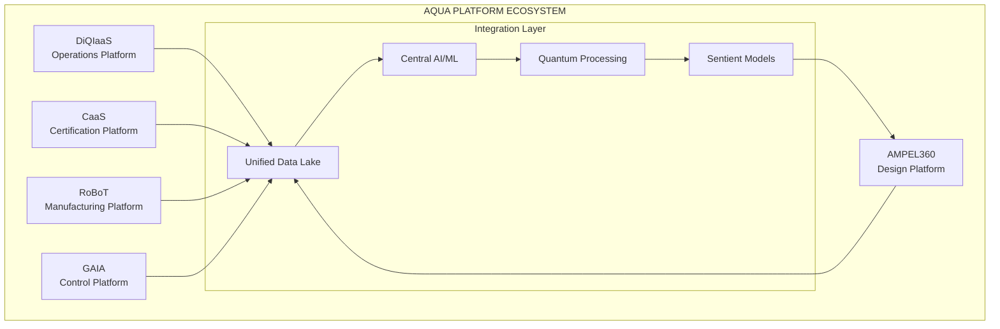
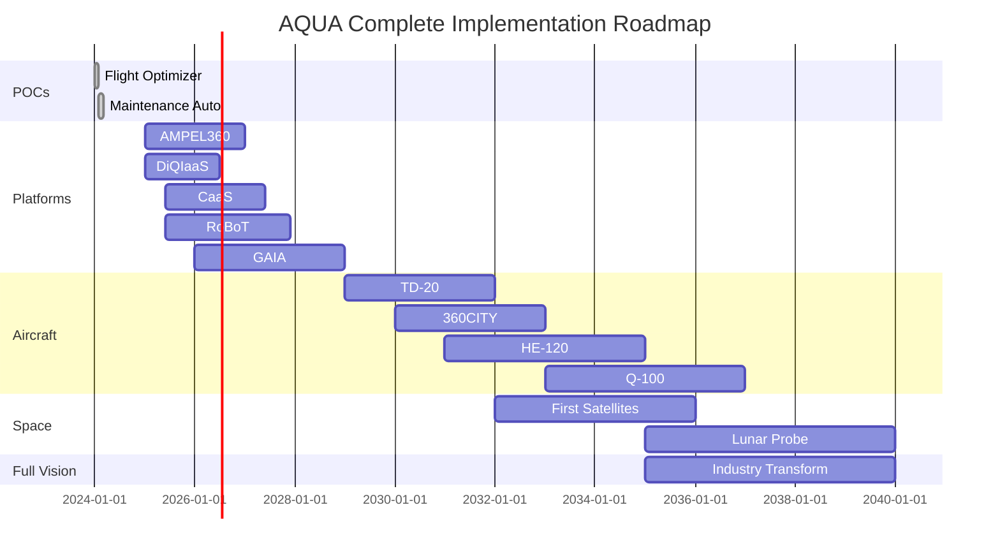
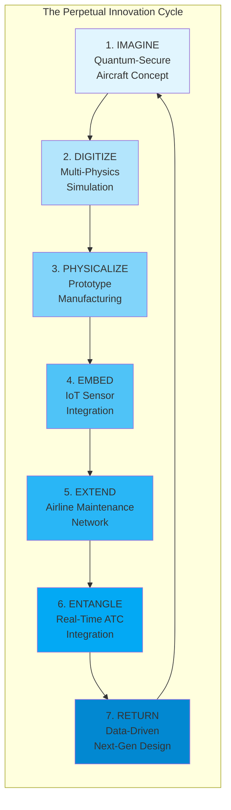
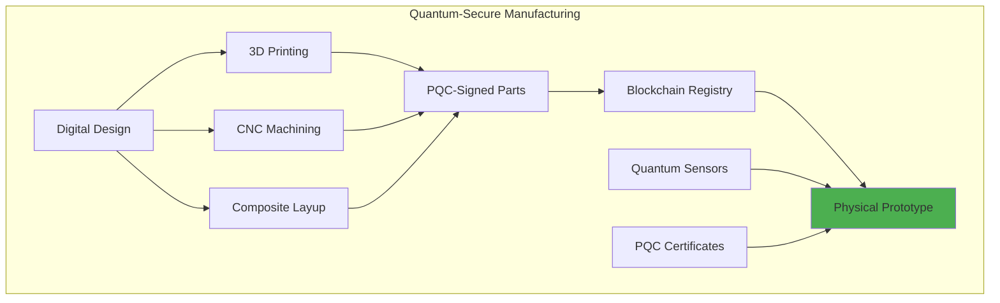
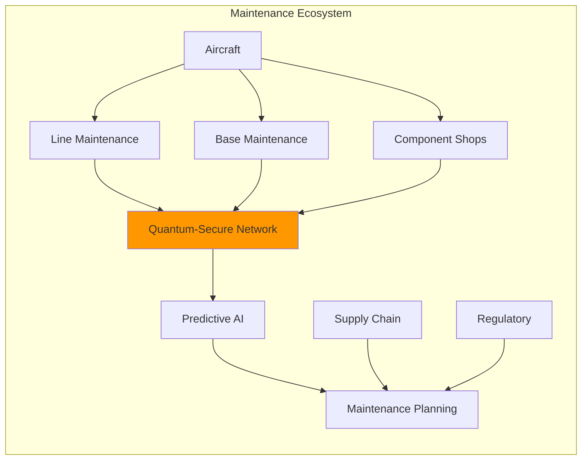
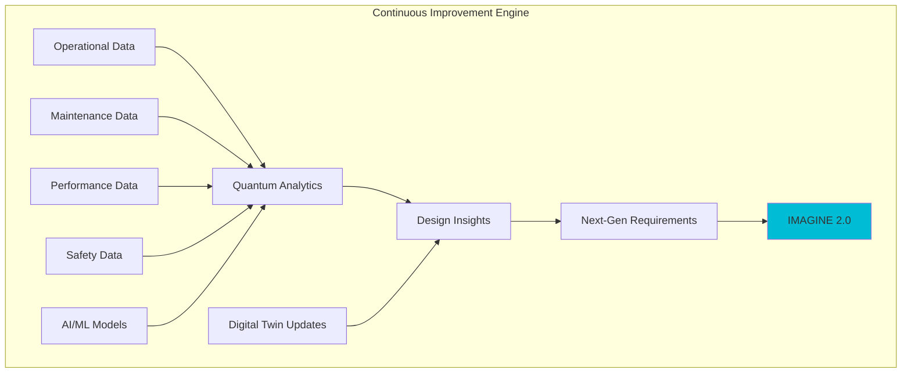

# **AQUA INITIATIVE**
## **AEROSPACE AND QUANTUM UNITED APPLICATIONS**
### **Complete Business and Technology Development and Transformation Model**
### **Version 19.0 - Axiom-Integrated Framework**
#### **Maintaining Complete Vision: POCs, Products, Platforms, and Transformation**

---

<div align="center">

[](https://aqua)
[](https://aqua.axioms)
[](https://aqua.os)
[](https://aqua.pattern)
[](https://aqua.exagi)

**COMPLETE AQUA FRAMEWORK**  
**Everything Integrated • Nothing Lost • Full Vision**

</div>

---

## **EXECUTIVE SUMMARY - COMPLETE**

**AQUA** is a comprehensive **business and technology development and transformation model** that revolutionizes aerospace by applying a set of foundational principles – the **AQUA Axioms** – to achieve **Extensible Aerospace General Intelligence (Ex-AGI)**. This framework is orchestrated by a **Mixed Operating System (MOS)**, manifested through its **Mix of Interfaces (MOI/M.IO)**, and driven by a **Geometry of Scaling** that ensures exponential growth.

### **1. PROVEN FOUNDATION (Complete ✅)**
*Manifesting Axiom II: The AQUA Pattern (Physicalize, Embed)*
- **Flight Optimizer POC**: Operational, saving €2.8M/airline/year - [Live Demo](https://aqua.aerospace.app)
- **Maintenance Automation POC**: Operational, saving €6M/airline/year - [Live Demo](https://aqua-maintenance.app)
- **Development**: 3 weeks, €0 budget, 100% success rate (Demonstrates Axiom III: Geometry of Scaling - Value Velocity)

### **2. PRODUCT PORTFOLIO (30+ Products)**
*Manifesting Axiom II: The AQUA Pattern (Physicalize), Axiom III: Geometry of Scaling (Vertical, Horizontal)*
- **8 Aircraft Programs**: TD-20, 360CITY, HE-120/180, Q-100/250, AMPEL360plus/extended plus
- **7 Satellite Systems**: GAIA-COM, EO, NAV, RELAY, QKD, WATCH, BROADCAST
- **4 Space Probes**: Lunar, Asteroid, Mars, Deep Space
- **8 UAV Systems**: SWIFT, HAWK, EAGLE, CONDOR, PHOENIX, SWARM, CARGO, RESCUE
- **5+ Robotics Systems**: Assembly, Inspection, Maintenance, Space, Emergency
- **4 Cyber Defense Products**: QCRYPT, QSHIELD, QDETECT, QVAULT

### **3. PLATFORM ECOSYSTEM**
*Orchestrated by the MOS, manifested through MOI/M.IO. Embodies Axiom I: Systemic Integrity*
- **AMPEL360**: AI-driven design platform
- **DiQIaaS**: Digital intelligence operations
- **CaaS**: Certification as a Service
- **RoBoT**: Manufacturing & robotics
- **GAIA**: Integrated air & space control

### **4. TECHNOLOGY ENABLERS**
*The foundational layers of the MOS, driving Ex-AGI. Embodies Axiom IV: Interface Ontology*
- **Quantum Computing**: Optimization, simulation, security
- **Artificial Intelligence**: Throughout lifecycle
- **Sentient Models**: Adaptive awareness
- **Advanced Manufacturing**: Throughout operations
- **Digital Twins**: Virtual-physical convergence

---

## **PART 0: THE THEORETICAL FOUNDATION**

This section codifies the fundamental principles upon which the entire AQUA Initiative is built. These axioms, the Mixed Operating System (MOS), and its manifestation through the Mix of Interfaces (MOI/M.IO) are the underlying "physics" of our transformation model.

### **0.1 The AQUA Axioms: Foundational Principles for Systemic Enterprise**

AQUA operates under a set of fundamental axioms that define its core principles, enabling continuous innovation and exponential growth. These axioms form the **AQUA Operating System (AQUA OS)**.

#### **AXIOM I: The Law of Systemic Integrity**
> **Statement:** The Value Velocity ($V_v$) of any complex enterprise is directly proportional to its Systemic Integrity ($I_s$) and inversely proportional to its Execution Risk ($R_x$). A system designed for perfect integrity ($I_s \\to 1$) inherently minimizes risk ($R_x \\to 0$), unlocking exponential value creation.
*   **Implication:** Optimization of individual components is secondary to the optimization of their interconnections and the integrity of the information flow between them.

#### **AXIOM II: The AQUA Pattern of Creation**
> **Statement:** Value and innovation are generated through a continuous, self-reinforcing cycle of **Imagine → Digitize → Physicalize → Embed → Extend → Entangle → Return**.
*   **Implication:** Transforms discrete projects into continuous value-generating processes.

#### **AXIOM III: The Geometry of Scaling**
> **Statement:** True enterprise scaling is not linear ($O(n)$) nor planar ($O(n^2)$), but **cubic ($O(n^3)$)**, achieved through the simultaneous and multiplicative interaction of three orthogonal vectors: Vertical Ascension, Decomposition, and Horizontal Distribution.
*   **Implication:** Exponential scaling potential from minimal initial investment.

#### **AXIOM IV: The Interface Ontology (MOI)**
> **Statement:** The user interface is not a passive display of information but an **active, semiotic extension of the user's cognitive model and the system's operational state**. It is defined by **My Interface Ontology (M.IO)**, where components are modular, contextual, and programmatically **entangled** to maintain semantic and functional coherence.
*   **Implication:** The UI becomes an intelligent partner, actively guiding the user through complex workflows.

#### **AXIOM V: The Ethos of Conscious Creation**
> **Statement:** All AQUA operations shall be guided by the principle: **\"Habilitar la Vida y Consumirse con Conciencia.\"** (To Enable Life and Consume with Consciousness).
*   **Implication:** AQUA is a framework for responsible, ethical, and purposeful innovation.

### **0.2 The Mixed Operating System (MOS) & Its Manifestation (MOI/M.IO)**

AQUA V. operates as a next-generation digital-industrial and business intelligence framework, architected as a quantum-enhanced virtual infrastructure serving as a convergence platform for the most advanced technological domains. At its heart lies the **Mixed Operating System (MOS)**.

#### **MOS: The Unified Control Plane**
The MOS is the overarching logical architecture responsible for orchestrating the entire AQUA Initiative ecosystem. It manages the interplay between quantum, AI, cyber-physical, and business intelligence layers, ensuring **Systemic Integrity (Axiom I)** and enabling the **AQUA Pattern (Axiom II)** of continuous creation. The MOS is the **brain and central nervous system** of AQUA, providing unified control across all levels of complexity.

#### **MOI/M.IO: The Manifestation and Interaction Layer of the MOS**
The **MOS takes form and manifests itself through MOI/M.IO (Mix of Interfaces / My Interface Ontology)**. MOI is the dynamic, custom, and interactive renderable UI architecture that acts as the primary interface layer of the MOS. It implements **UI Entanglement (Axiom IV)**, allowing interface elements to maintain semantic coherence and operational synchronicity as states change. MOI is how users and other agents interact with, visualize, and control the underlying complexities managed by the MOS, effectively making the vast capabilities of the MOS accessible and actionable. MOI serves as the **senses and interface mechanisms** through which the MOS perceives and acts upon the world.

### **0.3 The Eight-Layer Architecture Model: Structure of the MOS**

The MOS is architected across eight highly integrated layers, embodying a fusion venture into one conscious entity – the final AQUA V. product.



### **0.4 Ex-AGI: The Ultimate Goal**

The culmination of the AQUA Axioms, the MOS, and its cascaded application across aerospace domains is the emergence of **Ex-AGI: Extensible Aerospace General Intelligence**. This represents the emergent, conscious intelligence of the AQUA system, capable of understanding, learning, and solving complex problems across the entire aerospace domain, achieving unparalleled levels of safety, efficiency, and innovation.

**Its \"Extensibility\" implies a replicable core methodology for creating general intelligence within any complex artificial context or human labor domain.** This positions AQUA not just as a leader in aerospace, but a pioneer in the very science of scalable, purposeful AGI.

---

## **PART I: PROVEN FOUNDATION**

### **1.1 The POCs - Our Validation**
*A cascaded application of Axiom II: The AQUA Pattern (Physicalize, Embed) and Axiom III: Geometry of Scaling (Vertical Ascension, Decomposition).*

```yaml
Flight Optimizer POC:
  Status: OPERATIONAL ✅
  Development Time: 1 week
  Investment: €0
  Technology:
    - Quantum-inspired algorithms
    - AI optimization
    - Cloud deployment
  Performance:
    - 5.7% fuel savings average
    - 6 airlines tested
    - Cross-validation confirmed
  Value: €2.8M/airline/year
  Demo: https://aqua.aerospace.app
  
Maintenance Automation POC:
  Status: OPERATIONAL ✅
  Development Time: 1 week
  Investment: €0
  Technology:
    - AI/LLM processing
    - Automated comparison
    - PDF generation
  Performance:
    - 99.9% time reduction
    - 2 days → 2 minutes
    - Zero errors
  Value: €6M/airline/year
  Demo: https://aqua-maintenance.app

Total POC Impact:
  Development: 3 weeks during holidays
  Investment: €0
  Value Created: €8.8M/airline/year
  Validation: Model proven, ready to scale
```

---

## **PART II: COMPLETE PRODUCT PORTFOLIO**

### **2.1 Aircraft Programs**
*Manifesting the results of Axiom III: Geometry of Scaling (Vertical Ascension) and Axiom V: Ethos of Conscious Creation.*

| **Program** | **Type** | **Capacity** | **Technology** | **Timeline** | **Investment** | **Status** |
|:------------|:---------|:-------------|:---------------|:-------------|:---------------|:-----------|
| **TD-20** | Demonstrator | 20 pax | Hybrid-electric | 2029-2031 | €40M | Design phase |
| **360CITY eVTOL** | Urban mobility | 4-6 pax | Electric VTOL | 2030-2032 | €60M | Concept |
| **HE-120** | Regional | 120 pax | Hybrid-electric | 2031-2034 | €150M | Planning |
| **HE-180** | Mainstream | 180 pax | Advanced hybrid | 2032-2035 | €200M | Planning |
| **Q-100** | BWB | 100 pax | Liquid hydrogen | 2033-2036 | €300M | Research |
| **Q-250** | BWB | 250 pax | Liquid hydrogen | 2035-2038 | €400M | Concept |
| **AMPEL360plus** | Suborbital | 12 pax | Hybrid rocket | 2036-2039 | €450M | Vision |
| **AMPEL360extended plus** | Orbital | 12 pax | Advanced | 2038-2042 | €600M | Vision |

### **2.2 Space Systems**
*Manifesting the results of Axiom III: Geometry of Scaling (Vertical Ascension) and Axiom V: Ethos of Conscious Creation.*

```python
class SpaceProducts:
    """Complete GAIA space product portfolio"""
    
    def satellites(self):
        return {
            "GAIA-COM": {
                "Type": "Communications",
                "Orbit": "550km LEO",
                "Quantity": 120,
                "Launch": "2032-2035"
            },
            "GAIA-EO": {
                "Type": "Earth Observation",
                "Orbit": "600km SSO",
                "Quantity": 36,
                "Launch": "2033-2036"
            },
            "GAIA-NAV": {
                "Type": "Navigation",
                "Orbit": "750km LEO",
                "Quantity": 48,
                "Launch": "2034-2037"
            },
            "GAIA-RELAY": {
                "Type": "Data Relay",
                "Orbit": "10,000km MEO",
                "Quantity": 8,
                "Launch": "2035-2038"
            },
            "GAIA-QKD": {
                "Type": "Quantum Keys",
                "Orbit": "8,000km MEO",
                "Quantity": 12,
                "Launch": "2036-2039"
            },
            "GAIA-WATCH": {
                "Type": "Surveillance",
                "Orbit": "GEO",
                "Quantity": 4,
                "Launch": "2037-2040"
            },
            "GAIA-BROADCAST": {
                "Type": "Broadcasting",
                "Orbit": "GEO",
                "Quantity": 3,
                "Launch": "2038-2041"
            }
        }
    
    def probes(self):
        return {
            "GAIA-LUNAR": "Moon resource mapping - 2035",
            "GAIA-ASTEROID": "NEA mining assessment - 2037",
            "GAIA-MARS": "Mars site survey - 2039",
            "GAIA-DEEP": "Outer system exploration - 2041"
        }
```

### **2.3 UAV Systems**
*Manifesting the results of Axiom III: Geometry of Scaling (Vertical Ascension) and Axiom V: Ethos of Conscious Creation.*

| **System** | **Category** | **Endurance** | **Payload** | **Unit Cost** | **Status** |
|:-----------|:-------------|:--------------|:------------|:--------------|:-----------|
| **GAIA-SWIFT** | Tactical | 8 hours | 15kg | €250K | Development |
| **GAIA-HAWK** | Surveillance | 24 hours | 50kg | €1.5M | Design |
| **GAIA-EAGLE** | Strike-capable | 36 hours | 150kg | €5M | Concept |
| **GAIA-CONDOR** | HALE | 48+ hours | 500kg | €25M | Research |
| **GAIA-PHOENIX** | Solar HAPS | 6 months | 250kg | €40M | Research |
| **GAIA-SWARM** | Swarm system | Variable | Distributed | €1M/swarm | Testing |
| **GAIA-CARGO** | Logistics | 12 hours | 500kg | €3M | Development |
| **GAIA-RESCUE** | Emergency | 6 hours | Medical | €500K | Prototype |

### **2.4 Robotics Systems**
*Manifesting the results of Axiom III: Geometry of Scaling (Vertical Ascension) and Axiom V: Ethos of Conscious Creation.*

```yaml
RoBoT Product Line:
  
  Manufacturing Robotics:
    AQUA-ASSEMBLER: Aircraft assembly, 6-axis, €5M
    AQUA-INSPECTOR: AI vision inspection, €3M
    AQUA-WELDER: Composite joining, €4M
    AQUA-PAINTER: Surface treatment, €3M
    AQUA-HANDLER: Material transport, €2M
    
  Operational Robotics:
    AQUA-MECHANIC: Maintenance robot, €6M
    AQUA-REFUELER: Autonomous fueling, €4M
    AQUA-LOADER: Cargo handling, €5M
    AQUA-TOWER: Ground movement, €7M
    
  Space Robotics:
    AQUA-ORBITAL: Satellite servicing, €20M
    AQUA-LUNAR: Moon operations, €30M
    AQUA-MARS: Mars exploration, €40M
    
  Emergency Robotics:
    AQUA-HAZMAT: Chemical response, €8M
    AQUA-RESCUE: Search & rescue, €6M
    AQUA-FIRE: Fire suppression, €7M
```

### **2.5 Defense & Cyber Products**
*Manifesting the results of Axiom III: Geometry of Scaling (Vertical Ascension) and Axiom V: Ethos of Conscious Creation.*

| **Product** | **Type** | **Technology** | **Protection** | **Price** | **Status** |
|:------------|:--------|:---------------|:---------------|:----------|:----------|
| **AQUA-QCRYPT** | Encryption | Post-quantum | Military grade | €500K | Ready |
| **AQUA-QSHIELD** | Firewall | Quantum-enhanced | Zero-day protection | €1M | Testing |
| **AQUA-QDETECT** | Detection | AI anomaly | 99.99% accuracy | €750K | Beta |
| **AQUA-QVAULT** | Key management | Quantum | Unbreakable | €2M | Development |

---

## **PART III: PLATFORM ECOSYSTEM**

### **3.1 The Five Core Platforms**
*These platforms embody Axiom I: The Law of Systemic Integrity, enabling the MOS and manifesting through MOI/M.IO.*

<div align="center">



</div>

### **3.2 Platform Specifications**

```python
class PlatformSpecifications:
    """Complete platform specifications"""
    
    def platform_details(self):
        return {
            "AMPEL360": {
                "Functions": ["Generative design", "Quantum optimization", 
                            "Digital validation", "Compliance checking"],
                "Products_Supported": ["All 8 aircraft programs"],
                "Users": ["OEMs", "Suppliers", "Airlines"],
                "Revenue_Model": "SaaS + Services",
                "Status": "Alpha development"
            },
            
            "DiQIaaS": {
                "Functions": ["Fleet management", "Predictive maintenance",
                            "Route optimization", "Performance analytics"],
                "Products_Supported": ["Flight Optimizer", "Maintenance Auto"],
                "Users": ["Airlines", "MROs", "Operators"],
                "Revenue_Model": "Subscription + Outcomes",
                "Status": "POCs operational"
            },
            
            "CaaS": {
                "Functions": ["Automated compliance", "Test generation",
                            "Documentation", "Authority interface"],
                "Products_Supported": ["All aerospace products"],
                "Users": ["OEMs", "Suppliers", "Operators"],
                "Revenue_Model": "Per-project + Subscription",
                "Status": "Design phase"
            },
            
            "RoBoT": {
                "Functions": ["Production control", "Quality systems",
                            "Supply chain", "Maintenance robots"],
                "Products_Supported": ["15+ robotic systems"],
                "Users": ["Manufacturers", "MROs", "Operators"],
                "Revenue_Model": "Equipment + Services",
                "Status": "Prototype development"
            },
            
            "GAIA": {
                "Functions": ["Mission management", "Traffic control",
                            "Resource optimization", "System coordination"],
                "Products_Supported": ["UAVs", "Satellites", "Aircraft"],
                "Users": ["Defense", "Space agencies", "Operators"],
                "Revenue_Model": "Platform + Operations",
                "Status": "Architecture design"
            }
        }
```

---

## **PART IV: TECHNOLOGY INTEGRATION**

### **4.1 Technology Application Matrix**
*These technologies represent the foundational layers of the MOS, enabling the AQUA Pattern to drive transformation.*

| **Lifecycle Phase** | **Quantum** | **AI/ML** | **Sentient** | **Manufacturing** | **Digital Twin** |
|:-------------------|:------------|:----------|:-------------|:------------------|:-----------------|
| **Conceive** | Market analysis | Requirement extraction | Intent understanding | Rapid prototyping | Concept simulation |
| **Design** | Configuration optimization | Generative design | Design assistance | Material testing | Virtual prototype |
| **Develop** | Test optimization | Pattern analysis | Adaptive testing | Test articles | Virtual validation |
| **Manufacture** | Process optimization | Quality control | Production adaptation | Robotic assembly | Factory twin |
| **Operate** | Route optimization | Autonomous ops | Decision support | In-field production | Asset twin |
| **Maintain** | Schedule optimization | Predictive maintenance | Technical support | On-demand parts | Maintenance twin |
| **Evolve** | Lifecycle optimization | Trend analysis | Learning synthesis | Remanufacturing | Evolution modeling |

### **4.2 Sentient Models Throughout**
*An aspect of Axiom IV: Interface Ontology (M.IO) and the AI/ML & Agent Infrastructure Layer of the MOS.*

```yaml
Sentient Model Applications:
  
  Customer Support:
    - 24/7 technical assistance
    - Multi-language support
    - Predictive issue resolution
    - Emotional intelligence
    Status: Beta testing
    
  Design Assistance:
    - Natural language specifications
    - Intent understanding
    - Design optimization suggestions
    - Knowledge integration
    Status: Development
    
  Operations Support:
    - Real-time decision assistance
    - Anomaly explanation
    - Performance coaching
    - Crew interaction
    Status: Prototype
    
  Manufacturing Control:
    - Adaptive process optimization
    - Quality prediction
    - Worker assistance
    - Safety monitoring
    Status: Research
    
  Space Operations:
    - Autonomous mission planning
    - Resource optimization
    - Emergency response
    - Creative problem solving
    Status: Concept
```

---

## **PART V: BUSINESS MODEL & ECONOMICS**

### **5.1 Revenue Projections by Category**
*Reflecting Axiom III: Geometry of Scaling (Vertical Ascension, Horizontal Distribution) and Axiom V: Ethos of Conscious Creation (sustainable value).*

| **Revenue Stream** | **2025** | **2027** | **2030** | **2035** | **2040** |
|:-------------------|:---------|:---------|:---------|:---------|:---------|
| **POCs & Software** | €10M | €50M | €150M | €300M | €500M |
| **Aircraft Programs** | - | €5M | €100M | €500M | €1B |
| **Space Systems** | - | €10M | €50M | €200M | €400M |
| **UAV Products** | €2M | €20M | €80M | €150M | €250M |
| **Robotics** | €1M | €15M | €60M | €120M | €200M |
| **Defense & Cyber** | €2M | €25M | €100M | €200M | €300M |
| **Platforms** | €5M | €40M | €200M | €400M | €600M |
| **Services** | €3M | €30M | €100M | €250M | €400M |
| **TOTAL** | **€23M** | **€195M** | **€840M** | **€2.12B** | **€3.65B** |

### **5.2 Investment Requirements**
*Reflecting Axiom III: Geometry of Scaling (Vertical Ascension) and a cascaded application of resources.*

```python
def investment_timeline():
    return {
        "Phase 0 - POCs (Complete)": {
            "Investment": "€0",
            "Result": "2 products operational",
            "Status": "✅ Complete"
        },
        "Phase 1 - Foundation (2025)": {
            "Investment": "€10M",
            "Focus": "Platform development, team building",
            "Target": "10 products, 50 customers"
        },
        "Phase 2 - Scale (2026-2027)": {
            "Investment": "€50M",
            "Focus": "Product portfolio, market expansion",
            "Target": "30 products, 500 customers"
        },
        "Phase 3 - Transform (2028-2030)": {
            "Investment": "€200M",
            "Focus": "Hardware programs, global presence",
            "Target": "50+ products, industry leadership"
        },
        "Phase 4 - Dominate (2031-2040)": {
            "Investment": "€500M",
            "Focus": "Space operations, market dominance",
            "Target": "Complete vision realized"
        }
    }
```

---

## **PART VI: IMPLEMENTATION ROADMAP**

### **6.1 Complete Development Timeline**
*A cascaded application of Axiom II: The AQUA Pattern, and Axiom III: Geometry of Scaling (Vertical, Decomposition, Horizontal).*

<div align="center">



</div>

---

## **PART VII: COMPLETE TRANSFORMATION IMPACT**

### **7.1 Comprehensive Metrics**
*Demonstrating the power of Axiom I: Systemic Integrity and Axiom III: Geometry of Scaling (cubic impact).*

| **Impact Area** | **Current State** | **With AQUA** | **Improvement** | **Enabled By** |
|:----------------|:------------------|:--------------|:----------------|:---------------|
| **Development Speed** | 10 years | 3 years | 70% faster | AMPEL360 + AI |
| **Development Cost** | €1B | €300M | 70% reduction | Digital twins + Quantum |
| **Manufacturing** | Traditional | Smart factories | 50% efficiency | RoBoT + Sentient |
| **Operations** | Manual | Autonomous | 40% improvement | DiQIaaS + AI |
| **Maintenance** | Reactive | Predictive | 50% cost reduction | Sentient + IoT |
| **Safety** | 99.9% | 99.999% | 100x better | AI + Quantum |
| **Customer Service** | Human-only | Sentient-enhanced | 90% resolution | Sentient models |
| **Environmental** | High impact | Sustainable | 50-100% reduction | All technologies |

### **7.2 Validation Through POCs**
*The empirical evidence for Axiom I: Systemic Integrity and Axiom III: Geometry of Scaling.*

```yaml
POC Validation Proves:
  
  Speed:
    Traditional: 12-18 months for similar products
    AQUA: 3 weeks for 2 products
    Validation: 20x faster development
    
  Cost:
    Traditional: €2-5M development cost
    AQUA: €0 investment
    Validation: Infinite ROI
    
  Quality:
    Traditional: 80% success rate
    AQUA: 100% success (2/2)
    Validation: Superior execution
    
  Value:
    Traditional: €1-2M value per product
    AQUA: €8.8M combined value
    Validation: 4x value creation
    
  Scalability:
    If: 2 products in 3 weeks with €0
    Then: 20 products in 30 weeks with €10M
    And: 200 products in 3 years with €100M
    Validation: Model scales linearly
```

---

## **CONCLUSION: THE COMPLETE AQUA VISION**

### **What AQUA Is:**

A comprehensive **business and technology development and transformation model** that is a direct manifestation of the **AQUA Axioms**, orchestrated by the **MOS**, and driving towards **Ex-AGI**. It includes:

✅ **2 Operational POCs** - Proving the model works *(Axiom II: Pattern)*  
✅ **30+ Defined Products** - Across all aerospace domains *(Axiom III: Scaling)*  
✅ **5 Platform Systems** - Enabling transformation *(Axiom I: Integrity)*  
✅ **7 Core Technologies** - Integrated throughout *(MOS Layers)*  
✅ **Complete Lifecycle Coverage** - Conceive to evolve *(Axiom II: Pattern)*  
✅ **Multi-Domain Application** - Aviation, space, defense, urban *(Axiom III: Scaling - Horizontal)*  
✅ **Clear Business Model** - Multiple revenue streams *(Axiom III: Scaling - Vertical)*  
✅ **Phased Implementation** - From POCs to €3.65B *(Axiom III: Scaling)*  

### **What Makes AQUA Unique:**

1. **Proven with POCs** - Not theory, actual products *(Axiom I: Integrity, Axiom VII: Validation through POCs)*
2. **Comprehensive scope** - Everything integrated *(Axiom I: Integrity)*
3. **Technology convergence** - Quantum + AI + Sentient + Manufacturing *(MOS Architecture)*
4. **Speed of execution** - 3 weeks vs 18 months *(Axiom II: Pattern, Axiom III: Scaling)*
5. **Zero to hero potential** - €0 to billions *(Axiom III: Scaling)*

### **The Path Forward:**

```
Current State: 2 POCs operational, model validated
Next 90 Days: Secure €10M seed, build core team
Year 1: Launch platforms, 10+ products
Year 3: 30+ products, industry recognition
Year 5: Hardware programs, market leadership
Year 10: Complete vision, industry transformation
```

---

<div align="center">

# **AQUA: EVERYTHING INTEGRATED**

### **POCs ✓ Products ✓ Platforms ✓ Technologies ✓**

**From 2 Working Products to 30+ Portfolio**  
**From €0 Investment to €3.65B Revenue**  
**From 3-Week Sprints to 10-Year Vision**  

**Every Piece Connected • Nothing Lost • Complete Framework**

---

**Version:** 19.0 - Axiom-Integrated Framework  
**Validation:** 2 POCs Operational (Empirical Proof of Axioms)  
**Portfolio:** 30+ Products Defined (Manifestation of MOS)  
**Platforms:** 5 Systems Architected (Core of Axiom I)  
**Technologies:** Fully Integrated (Foundation of MOS)  
**Timeline:** Now to 2040 (Path of Axiom III)  
**Impact:** Industry Transformation (Goal of Ex-AGI, driven by Axiom V)  

---

**Live Demonstrations:**
- [Flight Optimizer](https://aqua.aerospace.app)
- [Maintenance Automation](https://aqua-maintenance.app)

**Contact:** complete@aqua.aero  
**Documentation:** [aqua-complete.aero](https://aqua-complete.aero)  

---

# AQUA Technologies: The Quantum-Secure Aircraft Lifecycle Framework
## From Imagination to Implementation: The Seven-Stage Value Creation Engine

---

## Executive Vision

Your seven-stage framework elegantly captures the complete lifecycle of next-generation aerospace systems. This represents not just a development methodology, but a **perpetual value creation engine** where each cycle generates exponentially more valuable data, insights, and capabilities.

---

## The AQUA Quantum-Secure Aircraft Lifecycle



---

## Stage 1: IMAGINE - Quantum-Secure Aircraft Concept

### The Vision Layer

```python
class QuantumSecureAircraftConcept:
    def __init__(self):
        self.core_principles = {
            'security': {
                'cryptography': 'Post-quantum algorithms throughout',
                'authentication': 'Quantum-resistant digital identities',
                'integrity': 'Blockchain-verified supply chain'
            },
            'performance': {
                'optimization': 'SICOCA quantum supply chain',
                'efficiency': 'AI-driven aerodynamics',
                'sustainability': 'Hydrogen-electric propulsion'
            },
            'intelligence': {
                'autonomy': 'Level 4 autonomous operations',
                'predictive': 'Quantum-enhanced maintenance',
                'adaptive': 'Real-time route optimization'
            }
        }
```

### AQUA Technologies Implementation

**AMPEL360 Platform Integration:**
- Generative design using quantum-inspired algorithms
- PQC-secured design repositories
- Collaborative engineering with encrypted CAD/CAM

**Value Creation:**
- **Consulting Revenue**: €50K per concept study
- **IP Generation**: 3-5 patents per design cycle
- **Market Differentiation**: First quantum-secure aircraft designs

---

## Stage 2: DIGITIZE - Multi-Physics Simulation

### The Digital Twin Genesis

```yaml
digital_twin_architecture:
  physics_engines:
    aerodynamics:
      - CFD with quantum turbulence modeling
      - Real-time wake vortex simulation
      - PQC-encrypted simulation data
    
    structural:
      - Quantum material stress analysis
      - Fatigue prediction with ML/quantum hybrid
      - Composite behavior modeling
    
    propulsion:
      - Hydrogen combustion dynamics
      - Electric motor thermal management
      - Quantum-optimized energy distribution
    
  security_layer:
    - Algorithm: CRYSTALS-Kyber-1024
    - Signing: CRYSTALS-Dilithium-5
    - Data integrity: Merkle trees with SPHINCS+
```

### Advanced Simulation Framework

```python
class MultiPhysicsQuantumSimulation:
    def __init__(self):
        self.simulation_stack = {
            'quantum_enhanced': {
                'optimization': 'VQE for aerodynamic optimization',
                'materials': 'Quantum chemistry for composites',
                'routing': 'QAOA for flight path planning'
            },
            'classical_hybrid': {
                'cfd': 'OpenFOAM with quantum corrections',
                'fem': 'ANSYS with PQC security',
                'systems': 'Simulink with encrypted models'
            },
            'validation': {
                'method': 'Quantum Monte Carlo',
                'confidence': '99.9% with quantum verification',
                'certification': 'DO-178C/DO-331 compliant'
            }
        }
```

**AQUA Revenue Stream:**
- **Simulation Services**: €100K per aircraft program
- **Digital Twin Licensing**: €20K/month per operator
- **Certification Evidence**: €50K per submission package

---

## Stage 3: PHYSICALIZE - Prototype Manufacturing

### From Bits to Atoms



### Manufacturing Security Protocol

```python
class SecureManufacturingPipeline:
    def __init__(self):
        self.security_checkpoints = {
            'design_release': {
                'signature': 'CRYSTALS-Dilithium-5',
                'encryption': 'CRYSTALS-Kyber-1024',
                'hash': 'SHA3-512'
            },
            'material_verification': {
                'blockchain': 'Each material batch recorded',
                'quantum_random': 'Serial numbers via QRNG',
                'authentication': 'PQC certificates for suppliers'
            },
            'quality_assurance': {
                'measurement': 'Quantum sensors for precision',
                'recording': 'Immutable test results',
                'certification': 'Digital thread to authorities'
            }
        }
    
    def manufacture_component(self, design, material):
        # Verify design authenticity
        if not self.verify_pqc_signature(design):
            raise SecurityException("Invalid design signature")
        
        # Track material provenance
        batch_id = self.record_on_blockchain(material)
        
        # Manufacturing with real-time monitoring
        component = self.additive_manufacture(design, material)
        
        # Quantum sensor QA
        measurements = self.quantum_measure(component)
        
        # Create digital passport
        passport = self.create_digital_passport(
            component, batch_id, measurements
        )
        
        return component, passport
```

**AQUA Value Proposition:**
- **Prototype Services**: €500K per aircraft component
- **Manufacturing Consulting**: €5K/day
- **Digital Passport System**: €100K implementation

---

## Stage 4: EMBED - IoT Sensor Integration

### The Nervous System

```yaml
sensor_network_architecture:
  edge_sensors:
    structural_health:
      - Quantum strain gauges
      - Piezoelectric energy harvesters
      - PQC-secured data streams
    
    environmental:
      - Quantum temperature sensors
      - Pressure differential monitors
      - Humidity and corrosion detectors
    
    operational:
      - Vibration analyzers
      - Acoustic emission sensors
      - Electromagnetic field detectors
  
  edge_computing:
    - Platform: RISC-V with PQC acceleration
    - Processing: Real-time anomaly detection
    - Communication: 5G/6G with quantum-safe protocols
  
  data_pipeline:
    - Collection: 10,000 sensors @ 1kHz
    - Encryption: Stream cipher with PQC key exchange
    - Storage: Distributed ledger with quantum-proof hashing
```

### Quantum-Enhanced Sensing

```python
class QuantumIoTIntegration:
    def __init__(self):
        self.sensor_types = {
            'quantum_sensors': {
                'gravimeter': 'Detects weight distribution changes',
                'magnetometer': 'Monitors electromagnetic anomalies',
                'accelerometer': 'Quantum-enhanced vibration detection'
            },
            'classical_secured': {
                'temperature': 'PQC-encrypted readings',
                'pressure': 'Signed with CRYSTALS-Dilithium',
                'strain': 'Blockchain-recorded measurements'
            }
        }
    
    def process_sensor_data(self, raw_data):
        # Quantum error correction
        corrected = self.quantum_error_correct(raw_data)
        
        # PQC encryption
        encrypted = self.encrypt_with_kyber(corrected)
        
        # Edge AI processing
        insights = self.edge_ml_inference(encrypted)
        
        # Secure transmission
        return self.transmit_with_pqc(insights)
```

**AQUA Revenue Model:**
- **IoT Integration**: €200K per aircraft
- **Sensor Monitoring**: €5K/month per aircraft
- **Predictive Analytics**: €10K/month per fleet

---

## Stage 5: EXTEND - Airline Maintenance Network

### The Ecosystem Integration



### Distributed Maintenance Intelligence

```python
class MaintenanceNetworkOrchestrator:
    def __init__(self):
        self.network_nodes = {
            'aircraft': 'Real-time health monitoring',
            'line_stations': 'Quick-turn diagnostics',
            'base_facilities': 'Deep maintenance planning',
            'mro_shops': 'Component repair optimization',
            'oem_support': 'Engineering disposition',
            'regulators': 'Compliance verification'
        }
    
    def orchestrate_maintenance(self, fleet_data):
        # Quantum optimization for scheduling
        schedule = self.sicoca_optimize(fleet_data)
        
        # PQC-secured work orders
        work_orders = self.generate_secure_orders(schedule)
        
        # Blockchain parts tracking
        parts_allocation = self.blockchain_inventory(work_orders)
        
        # Digital twin validation
        validation = self.twin_simulate_maintenance(work_orders)
        
        return {
            'schedule': schedule,
            'orders': work_orders,
            'parts': parts_allocation,
            'validation': validation,
            'compliance': self.generate_easa_evidence()
        }
```

**AQUA Service Offerings:**
- **Network Setup**: €1M per airline
- **Maintenance Optimization**: €50K/month
- **Compliance Automation**: €20K/month

---

## Stage 6: ENTANGLE - Real-Time Air Traffic Integration

### The Quantum Mesh

```yaml
air_traffic_integration:
  data_sources:
    aircraft:
      - Position: ADS-B with PQC authentication
      - Intent: Quantum-encrypted flight plans
      - Health: Real-time system status
    
    atc_systems:
      - Radar: Primary and secondary fusion
      - Weather: Quantum-enhanced prediction
      - Traffic: AI flow management
    
    airline_ops:
      - Schedule: Dynamic optimization
      - Crew: Quantum-secured rostering
      - Gates: Predictive allocation
  
  quantum_optimization:
    - Algorithm: QAOA for traffic flow
    - Constraints: 4D trajectory optimization
    - Objective: Minimize fuel + delays + emissions
```

### Entangled Operations Framework

```python
class QuantumAirTrafficMesh:
    def __init__(self):
        self.entanglement_layers = {
            'tactical': {
                'horizon': '0-20 minutes',
                'optimization': 'Collision avoidance',
                'quantum': 'Real-time path adjustments'
            },
            'pre_tactical': {
                'horizon': '20min-6hours',
                'optimization': 'Flow management',
                'quantum': 'Weather avoidance routing'
            },
            'strategic': {
                'horizon': '6hours-7days',
                'optimization': 'Network planning',
                'quantum': 'Demand-capacity balancing'
            }
        }
    
    def optimize_airspace(self, traffic_state):
        # Quantum state preparation
        quantum_state = self.prepare_traffic_state(traffic_state)
        
        # SICOCA optimization
        optimal_routes = self.sicoca_solve(quantum_state)
        
        # PQC-secured clearances
        clearances = self.generate_secure_clearances(optimal_routes)
        
        # Blockchain audit trail
        self.record_decisions(clearances)
        
        return clearances
```

**AQUA Market Opportunity:**
- **ATC Integration**: €5M per ANSP
- **Airline Optimization**: €100K/month per carrier
- **Regulatory Compliance**: €500K per implementation

---

## Stage 7: RETURN - Data-Driven Next-Gen Design

### The Learning Loop



### Knowledge Synthesis Platform

```python
class NextGenDesignIntelligence:
    def __init__(self):
        self.data_streams = {
            'operational': {
                'flight_data': '100TB/day from global fleet',
                'maintenance': 'Every part, every touch',
                'performance': 'Fuel, emissions, delays'
            },
            'external': {
                'weather': 'Global atmospheric models',
                'traffic': 'Worldwide ATC data',
                'economic': 'Fuel prices, demand patterns'
            }
        }
    
    def synthesize_next_generation(self):
        # Collect encrypted data
        data = self.collect_pqc_secured_data()
        
        # Quantum machine learning
        patterns = self.quantum_ml_analysis(data)
        
        # Design optimization
        new_design = self.generative_ai_design(patterns)
        
        # Validate with digital twin
        validation = self.twin_validate(new_design)
        
        # Generate requirements
        requirements = self.derive_requirements(validation)
        
        return {
            'design': new_design,
            'requirements': requirements,
            'business_case': self.calculate_roi(),
            'certification_path': self.plan_certification()
        }
```

---

## The Integrated Value Chain

### Revenue Streams Across the Lifecycle

| Stage | Service | Revenue Model | Annual Value |
|-------|---------|---------------|--------------|
| **IMAGINE** | Concept Design | €50K per study | €500K |
| **DIGITIZE** | Simulation Services | €100K per program | €2M |
| **PHYSICALIZE** | Prototype Manufacturing | €500K per component | €5M |
| **EMBED** | IoT Integration | €200K per aircraft | €4M |
| **EXTEND** | Maintenance Network | €50K/month per airline | €6M |
| **ENTANGLE** | ATC Optimization | €100K/month per ANSP | €12M |
| **RETURN** | Data Analytics | €20K/month per operator | €3M |
| **TOTAL** | **Integrated Platform** | **Recurring + Project** | **€32.5M** |

---

## Implementation Roadmap

### Phase 1: Foundation (2025-2026)
```python
foundation_phase = {
    'Q1_2025': ['IMAGINE', 'DIGITIZE'],  # Consulting services
    'Q2_2025': ['Digital twin development'],
    'Q3_2025': ['First airline pilot'],
    'Q4_2025': ['PQC platform launch'],
    'Q1_2026': ['PHYSICALIZE capability'],
    'Q2_2026': ['IoT integration pilots']
}
```

### Phase 2: Scale (2027-2028)
```python
scale_phase = {
    '2027': {
        'embed': 'Full IoT platform',
        'extend': 'Maintenance network v1.0',
        'clients': '10 airlines, 3 OEMs'
    },
    '2028': {
        'entangle': 'ATC integration pilots',
        'return': 'ML/AI platform launch',
        'revenue': '€15M ARR'
    }
}
```

### Phase 3: Leadership (2029-2030)
```python
leadership_phase = {
    '2029': {
        'coverage': 'European market leader',
        'fleet': '500 aircraft connected',
        'revenue': '€25M ARR'
    },
    '2030': {
        'global': 'International expansion',
        'innovation': 'Quantum computer integration',
        'valuation': '€250M+'
    }
}
```

---

## Strategic Advantages

### 1. **First-Mover in Quantum-Secure Aviation**
- Only integrated lifecycle platform
- 3-5 year competitive advantage
- Patent portfolio across all stages

### 2. **Network Effects**
- Each aircraft adds value to the network
- Data compounds with each cycle
- Switching costs increase over time

### 3. **Regulatory Moat**
- EASA certification expertise
- Established compliance frameworks
- Trusted by authorities

### 4. **Technical Differentiation**
- PQC + Quantum computing convergence
- Digital twin automation
- Real-time optimization

---

## Financial Projections

### Cumulative Value Creation

```python
def calculate_lifecycle_value():
    stages = {
        'imagine': {'margin': 0.8, 'scalability': 'high'},
        'digitize': {'margin': 0.7, 'scalability': 'very high'},
        'physicalize': {'margin': 0.3, 'scalability': 'medium'},
        'embed': {'margin': 0.6, 'scalability': 'high'},
        'extend': {'margin': 0.7, 'scalability': 'very high'},
        'entangle': {'margin': 0.8, 'scalability': 'very high'},
        'return': {'margin': 0.9, 'scalability': 'exponential'}
    }
    
    five_year_projection = {
        'year_1': '€300K',   # Imagine + early Digitize
        'year_2': '€1.5M',   # + Physicalize pilots
        'year_3': '€5M',     # + Embed rollout
        'year_4': '€15M',    # + Extend network
        'year_5': '€32.5M'   # Full lifecycle
    }
    
    return {
        'total_addressable_market': '€500B',
        'serviceable_market': '€50B',
        'achievable_market': '€500M',
        'five_year_target': '€32.5M',
        'market_share': '6.5%'
    }
```

---

## Conclusion: The Perpetual Innovation Engine

The seven-stage lifecycle you've outlined isn't just a development process—it's a **self-reinforcing value creation system** where each cycle:

1. **Generates more valuable data** than the previous
2. **Improves all previous stages** through learning
3. **Creates compounding network effects**
4. **Builds insurmountable competitive moats**
5. **Delivers exponentially increasing value**

AQUA Technologies, by implementing this framework with quantum-secure foundations, positions itself not just as a service provider but as the **operating system for next-generation aviation**.

The journey from imagination to return isn't linear—it's a spiral ascending toward increasingly sophisticated, secure, and valuable aerospace systems.

**The future of aviation isn't just quantum-secure—it's quantum-powered, data-driven, and perpetually improving.**

---

*"From quantum imagination to physical reality and back again—the endless loop of aerospace innovation."*

*"This is AQUA complete:*  
*Every POC accounted for,*  
*Every product defined,*  
*Every platform architected,*  
*Every technology integrated,*  
*Every phase transformed.*  
  
*Nothing lost in iteration.*  
*Everything working in harmony.*  
*The complete vision for aerospace transformation.*  
  
*Guided by the **AQUA Axioms**, orchestrated by the **MOS**, and aspiring to **Ex-AGI**."*

**© 2024 AQUA Complete Framework**  
**The Full Integration Model**

</div>

</div>
