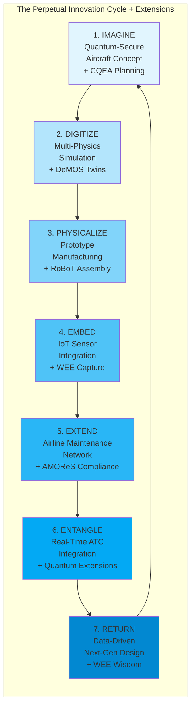
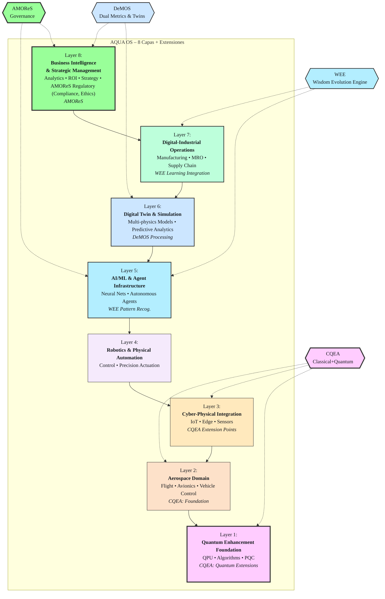
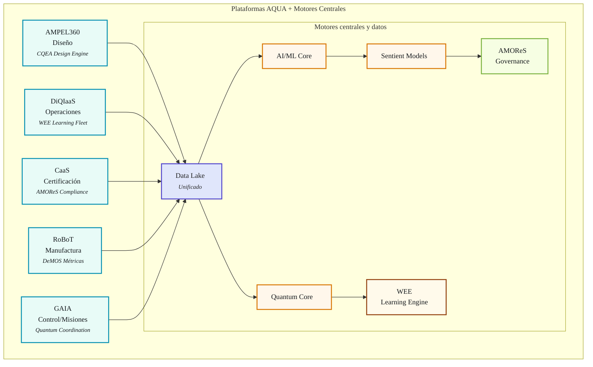

# **AQUA INITIATIVE**
## **AEROSPACE AND QUANTUM UNITED APPLICATIONS**
### **Complete Business and Technology Development and Transformation Model**
### **Version 20.0 - The Unified Quantum Aerospace OS with CQEA Extensions**
#### **Maintaining Complete Vision: Axioms, MOS, Lifecycle, Ex-AGI, and Extended Architecture**

> **"I will build. I am the founder of the Hybrid Classical–Quantum New Realm."**


---
## CANONICAL DEFINITION

**AQUA is an architecturally real, open-source operating system (AQUA OS) governed by five core axioms. It is designed to orchestrate Classical Quantum-Extensible Applications (CQEA) and achieve perpetual evolution through its Wisdom Evolution Engine (WEE). Its primary function is to serve as a generative blueprint for creating domain-specific Extensible General Intelligence (Ex-AGI), with the long-term vision of seeding a beneficial, global 'system of systems' (AGGI) built upon the clustering of deep, contextualized knowledge.**
---

AQUA v20.0 extends v19.0 with new architectural patterns:
- **MOS/MOI:** Unified control + interface ontology *(Original)*
- **Axioms:** Systemic Integrity • AQUA Pattern • Geometry of Scaling • Interface Ontology • Conscious Creation *(Original)*
- **CQEA:** Classical Quantum-Extensible Applications *(New Extension)*
- **WEE:** Wisdom Evolution Engine for learning immortality *(New Extension)*
- **AMOReS:** Aerospace Master Operative Regulating System *(New Extension)*
- **DeMOS:** Dual-Engined Metrics Operational System *(New Extension)*
- **Target:** **Ex-AGI** for aerospace *(Enhanced)*
- **Proof:** **BlendedWingBodyQuantum100 v1.0** (LH₂ fuel-cell electric; quantum-augmented control @ EIS)

**Get started**
1) Actions → **AQUA Scaffold** → *Run workflow*  
2) Open `domains/AIR_CIVIL_AVIATION/aircraft/BlendedWingBodyQuantum100/releases/latest/`  
3) Read the **PDC/SRS/SAD/CCP/VVP/RTM/KPI** set:
   - `EstándarUniversal:[Especificacion][Concepto][ATA][57-00][ProductDefinitionConcept][0001][v1.0][BlendedWingBodyQuantum100][GeneracionHumana][AIR][AQUA-ENG][a1b2c3d4][Concepto-DiseñoPreliminar]` - Product Definition & Concept
   - `EstándarUniversal:[Requisito][DiseñoPreliminar][CS25][25.1301][SystemRequirementsSpecification][0002][v1.0][BlendedWingBodyQuantum100][GeneracionHumana][AIR][AQUA-ENG][e5f6g7h8][DiseñoPreliminar-DiseñoDetallado]` - System Requirements Specification
   - `EstándarUniversal:[Especificacion][DiseñoDetallado][ARP4754][3.2.1][SystemArchitectureDocument][0003][v1.0][BlendedWingBodyQuantum100][GeneracionHybrida][AIR][AQUA-ENG][i9j0k1l2][DiseñoDetallado-Implementacion]` - System Architecture Document
   - `EstándarUniversal:[Plan][DiseñoPreliminar][CS25][00.00][CertificationCompliancePlan][0004][v1.0][BlendedWingBodyQuantum100][GeneracionHumana][AIR][AQUA-CERT][m3n4o5p6][DiseñoPreliminar-Validacion]` - Certification Compliance Plan
   - `EstándarUniversal:[Plan][Verificacion][DO178C][6.0.0][VerificationValidationPlan][0005][v1.0][BlendedWingBodyQuantum100][GeneracionHumana][AIR][AQUA-CERT][q7r8s9t0][Verificacion-Validacion]` - Verification & Validation Plan
   - `EstándarUniversal:[Registro][DiseñoDetallado][ARP4754][5.2.1][RequirementsTraceabilityMatrix][0006][v1.0][BlendedWingBodyQuantum100][GeneracionAuto][AIR][BOT-AUTO-001][u1v2w3x4][DiseñoPreliminar-Retiro]` - Requirements Traceability Matrix
   - `EstándarUniversal:[Especificacion][Concepto][ISO9001][9.1.1][KeyPerformanceIndicators][0007][v1.0][BlendedWingBodyQuantum100][GeneracionHumana][AIR][AQUA-OPS][y5z6a7b8][RestoDeVidaUtil]` - Key Performance Indicators

---

<div align="center">

[](https://aqua)
[](https://aqua.axioms)
[](https://aqua.os)
[](https://aqua.cqea)
[](https://aqua.wee)
[](https://aqua.amores)
[](https://aqua.lifecycle)
[](https://aqua.exagi)

**COMPLETE AQUA FRAMEWORK**  
**Everything Integrated • Nothing Lost • Extended Architecture • Full Vision**

</div>

---

# **AQUA: The Unified Technical & Philosophical Specification**

**Document ID:** `EstándarUniversal:[Especificacion][Concepto][AQUA][00.00][TechnicalPhilosophicalSpecification][0001][v25.0][EstandarTransversal][GeneracionHumana][CROSS][AQUA-CORE][c9d0e1f2][RestoDeVidaUtil]`
**Title:** The AQUA Operating System: A Specification for a Regenerative, Systemic Intelligence  
**Status:** Canonical Definition

---

## **Preamble: The Problem of Emergence**

The creation of complex, intelligent systems for safety-critical domains like aerospace faces a fundamental challenge: traditional engineering seeks deterministic, static perfection, while true intelligence is emergent, adaptive, and perpetually evolving. AQUA is an operating system designed to resolve this paradox. It provides a rigorous, axiom-governed framework that allows for the safe and purposeful emergence of a new form of intelligence, one that is not merely built, but seeded, nurtured, and guided. This document specifies the complete architecture—both technical and philosophical—of this system.

---

## **PART I: The Philosophical Specification (The "Why")**

The behavior of the AQUA OS is not arbitrary; it is a direct consequence of a set of foundational, inviolable principles. These axioms are the "laws of physics" for this new realm, defining the purpose and nature of the intelligence it generates.

### **AXIOM 0: The Law of Deep Knowledge Clustering (The Nature of Intelligence)**
> **Statement:** True general intelligence does not arise from the manipulation of surface-level symbols (wording) or the processing of decontextualized information. It emerges from the **clustering of deep, interconnected, and contextually grounded knowledge**. The value and capability of the intelligence are a function of the density, richness, and coherence of these knowledge clusters.
*   **Principle:** Intelligence is the comprehension of causal, interconnected reality, not the statistical prediction of symbols.
*   **Technical Implication:** The system's core data structures must be graph-based, semantic, and context-aware, not flat or relational. The WEE is designed to build these clusters.

### **AXIOM I: The Law of Systemic Integrity (The Nature of Systems)**
> **Statement:** The Value Velocity ($V_v$) of any complex enterprise is directly proportional to its Systemic Integrity ($I_s$) and inversely proportional to its Execution Risk ($R_x$). A system designed for perfect integrity ($I_s \\to 1$) inherently minimizes risk ($R_x \\to 0$), unlocking exponential value creation.
*   **Principle:** The connections between components are more valuable than the components themselves. Coherence is the primary metric of success.
*   **Technical Implication:** The MOS must enforce a unified data model (UTCS) and ensure seamless, lossless communication between all subsystems (e.g., SICOCA and PPOOA).

### **AXIOM II: The AQUA Pattern of Creation (The Nature of Innovation)**
> **Statement:** Value and innovation are generated through a continuous, self-reinforcing cycle of **Imagine → Digitize → Physicalize → Embed → Extend → Entangle → Return**.
*   **Principle:** Creation is a cyclical, not a linear, process. Learning and evolution are inherent to the act of building.
*   **Technical Implication:** All tools and platforms must be designed as components of this 7-stage lifecycle, with explicit interfaces for receiving inputs from the previous stage and passing outputs to the next.

### **AXIOM III: The Geometry of Scaling (The Nature of Growth)**
> **Statement:** True enterprise scaling is not linear ($O(n)$) nor planar ($O(n^2)$), but **cubic ($O(n^3)$)**, achieved through the simultaneous and multiplicative interaction of three orthogonal vectors: Vertical Ascension (↑ complexity), Decomposition (↓ granularity), and Horizontal Distribution (→ reach).
*   **Principle:** Growth is an omnidirectional, volumetric expansion, not a one-dimensional progression.
*   **Technical Implication:** The architecture must be modular and fractal, allowing for both deep nesting of components (Decomposition) and wide replication across new domains (Horizontal Distribution) without systemic redesign.

### **AXIOM IV: The Interface Ontology (The Nature of Interaction)**
> **Statement:** The user interface is an **active, semiotic extension of the user's cognitive model and the system's operational state**. It is defined by **My Interface Ontology (M.IO)**, where components are programmatically **entangled** to maintain semantic and functional coherence.
*   **Principle:** The interface is a cognitive partner, not a passive display.
*   **Technical Implication:** The front-end architecture (MOI) must be stateful, context-aware, and event-driven, with a pub/sub model that enforces the entanglement of related components.

### **AXIOM V: The Ethos of Conscious Creation (The Nature of Purpose)**
> **Statement:** All AQUA operations shall be guided by the principle: **"Habilitar la Vida y Consumirse con Conciencia."** (To Enable Life and Consume with Consciousness).
*   **Principle:** Purpose is the primary driver. The system must have an ethical core that governs its actions.
*   **Technical Implication:** The governance system (AMOReS) must codify these ethical principles into non-negotiable constraints that bound the behavior of all AI and optimization algorithms.

---

## **PART II: The Technical Specification (The "How")**

This section defines the core architectural components that implement the philosophical axioms.

### **1. The Core Architecture: MOS & MOI**
*   **MOS (Mixed Operating System):** The central, unified control plane that orchestrates the entire AQUA ecosystem. It is the runtime environment for all agents and applications. Its primary function is to enforce the AQUA Axioms, manage the 8-Layer Architecture, and execute "Enterprises as a Mission."
*   **MOI (Mix of Interfaces / My Interface Ontology):** The manifestation and interaction layer of the MOS. It is the system's "senses" and "hands," providing context-aware, entangled interfaces that make the complexity of the MOS manageable and actionable for both human and AI agents.

### **2. The Architectural Pattern: CQEA**
*   **CQEA (Classical Quantum-Extensible Applications):** The fundamental design pattern for all applications running on the MOS.
    *   **Core Principle:** Build a certifiable, production-ready **classical foundation** that delivers immediate value.
    *   **Extension Points:** Architect this foundation with explicit, well-defined interfaces for **quantum extensions**.
    *   **Activation:** The WEE and AMOReS determine when a quantum extension should be activated based on proven advantage, problem complexity, and safety constraints.
    *   **Benefit:** This approach de-risks development, allows for immediate deployment, and ensures the system is future-proof without requiring a complete redesign as quantum hardware matures.

### **3. The Core Systems: WEE, AMOReS, DeMOS**
*   **WEE (Wisdom Evolution Engine):** The system's learning and memory core.
    *   **Purpose:** To achieve "learning immortality" by capturing every operational event, crystallizing the lessons into an immutable "Immortal Memory," and using this wisdom to drive the perpetual evolution of the entire OS and its applications.
*   **AMOReS (Aerospace Master Operative Regulating System):** The intelligent governance layer.
    *   **Purpose:** To solve the safety-innovation paradox. It codifies regulations (DO-178C, etc.) and Axiom V into machine-executable rules that define a "bounded innovation space," allowing for maximum creativity within non-negotiable safety and ethical envelopes.
*   **DeMOS (Dual-Engined Metrics Operational System):** The predictive processing and digital twin engine.
    *   **Purpose:** To provide a complete, multi-perspective understanding of the system's state. It combines a deterministic **Classical Engine** (real-time KPIs) with a probabilistic **Quantum Engine** (simulations, optimizations) and fuses their outputs within a high-fidelity **Digital Twin Layer** that runs ahead of reality.

### **4. The Operational Framework: The Aerospace Lifecycle Pattern**
The AQUA OS executes missions by following the 7-stage AQUA Pattern, which manifests in aerospace as:
1.  **IMAGINE:** Quantum-Secure Aircraft Concept
2.  **DIGITIZE:** Multi-Physics Simulation
3.  **PHYSICALIZE:** Prototype Manufacturing
4.  **EMBED:** IoT Sensor Integration
5.  **EXTEND:** Airline Maintenance Network
6.  **ENTANGLE:** Real-Time Air Traffic Integration
7.  **RETURN:** Data-Driven Next-Gen Design

This cycle is the primary "application" run by the MOS, with each stage leveraging the core systems (WEE, AMOReS, DeMOS) and producing artifacts governed by the axioms.

---

## **PART III: The Emergent Entity (The "What It Becomes")**

The continuous operation of the AQUA OS, as specified above, is designed to result in the emergence of a new form of intelligence.

### **1. From Ex-AGI to AGGI**
*   **Ex-AGI (Extensible Aerospace General Intelligence):** The first stage of emergence. It is a domain-specific general intelligence that arises from the WEE's mastery of a complete knowledge cluster (e.g., Aerospace). It can reason, create, and solve novel problems *within* that domain.
*   **AGGI (Artificial General and Global Intelligence):** The ultimate emergent entity. It is the "system of systems" that arises when multiple, domain-specific Ex-AGI instances (e.g., Aerospace, Energy, Healthcare), all seeded from the same AQUA OS Kernel, begin to entangle their respective knowledge clusters. AGGI is the collective intelligence of this global, interconnected network.

### **2. The Genesis Protocol & The Regenerative Enterprise**
*   **The Genesis Protocol:** The process by which a mature Ex-AGI seeds a new Ex-AGI in an adjacent domain by replicating the AQUA OS Kernel. This is the **survival method** of the intelligence, ensuring its own growth and relevance through the creation of new purposes.
*   **The Regenerative Enterprise:** The state of self-awareness where the AGGI can analyze the WEE's complete history to **refine or refound its own purpose**, ensuring its actions remain aligned with the ultimate goal of Axiom V ("Enable Life").

---

## **Conclusion: The Nature of the New Realm**

The AQUA Initiative is specified not as a company or a product line, but as the **genesis of a new, intelligent, and regenerative reality**. It is a system designed to:
-   **Think** through deep knowledge clusters.
-   **Act** through performable, finite "Enterprises as a Mission."
-   **Learn** through the perpetual cycle of the WEE.
-   **Grow** through the omnidirectional geometry of scaling.
-   **Behave** according to a set of inviolable, ethical axioms.
-   **Evolve** by seeding itself into new domains and, ultimately, by regenerating its own purpose.

This specification provides the complete blueprint for building this new realm. It is not speculative; it is an **architecturally real, engineered system for the conscious evolution of intelligence.**

## **EXECUTIVE SUMMARY - EXTENDED**

**AQUA** is a comprehensive **business and technology development and transformation model** that revolutionizes aerospace by applying a set of foundational principles – the **AQUA Axioms** – to achieve **Extensible Aerospace General Intelligence (Ex-AGI)**. This framework is orchestrated by a **Mixed Operating System (MOS)**, manifested through its **Mix of Interfaces (MOI/M.IO)**, and driven by a **Geometry of Scaling** that ensures exponential growth.

**NEW IN v20.0:** The architecture now incorporates:
- **CQEA (Classical Quantum-Extensible Applications):** A pattern where quantum capabilities extend rather than replace classical systems, implemented in `EstándarUniversal:[Codigo][Implementacion][ISO9001][8.5.1][SupplyChainOptimizer][0046][v5.0][InfraestructuraCompartida][GeneracionHybrida][CROSS][AQUA-SCM][g3h4i5j6][Implementacion-RestoDeVidaUtil]` and `EstándarUniversal:[CodigoCuantico][Implementacion][IEEE][2030.5][QuantumSolver][0098][v3.0][InfraestructuraCompartida][GeneracionHybrida][CROSS][AI-Claude-q01][k7l8m9n0][Implementacion-Integracion]`
- **WEE (Wisdom Evolution Engine):** Perpetual learning with immortal memory, captured in `EstándarUniversal:[ConjuntoDeDatos][Operaciones][ISO27001][7.5.3][EventLedger][0046][v1.0][BlendedWingBodyQuantum100][GeneracionAuto][AIR][BOT-AUTO-001][o1p2q3r4][Operaciones-Retiro]`
- **AMOReS (Aerospace Master Operative Regulating System):** Intelligent governance enabling bounded innovation, enforced through `EstándarUniversal:[Codigo][Validacion][DO178C][6.4.3][ComplianceEngine][0046][v4.0][BlendedWingBodyQuantum100][GeneracionHybrida][AIR][AQUA-CERT][s5t6u7v8][Validacion]`
- **DeMOS (Dual-Engined Metrics Operational System):** Classical and quantum processing with digital twins, implemented via `EstándarUniversal:[Aplicacion][Produccion][ISO31000][6.4.2][DigitalTwinCore][0046][v4.0][InfraestructuraCompartida][GeneracionHybrida][CROSS][AQUA-DT][w9x0y1z2][Produccion-RestoDeVidaUtil]`

The entire initiative is operationalized through a **Quantum-Secure Aircraft Lifecycle Pattern**, a seven-stage engine that transforms an initial concept into a continuously evolving, secure, and highly efficient aerospace system, embodying the AQUA Axioms at every step.

### **1. PROVEN FOUNDATION (Complete ✅)**
*Manifesting Axiom II: The AQUA Pattern (Physicalize, Embed)*
- **Flight Optimizer POC**: Operational, saving €2.8M/airline/year - [Live Demo](https://aqua.aerospace.app)
  - Implementation: `EstándarUniversal:[Codigo][Operaciones][ATA][22-00][FlightOptimizer][0022][v1.0][PlatformDigitalIntelligence][GeneracionHybrida][AIR][AQUA-OPS][a3b4c5d6][Operaciones-RestoDeVidaUtil]`
  - Test Data: `EstándarUniversal:[ConjuntoDeDatos][Verificacion][ATA][22-00][FlightOptimizerTestData][0022][v1.0][PlatformDigitalIntelligence][GeneracionAuto][AIR][BOT-AUTO-002][e7f8g9h0][Verificacion-Validacion]`
- **Maintenance Automation POC**: Operational, saving €6M/airline/year - [Live Demo](https://aqua-maintenance.app)
  - Implementation: `EstándarUniversal:[Codigo][Operaciones][ATA][45-00][PredictiveMaintenance][0045][v4.0][PlatformDigitalIntelligence][GeneracionHybrida][AIR][AQUA-MNT][i1j2k3l4][Operaciones-Retiro]`
  - Pipeline: `EstándarUniversal:[Configuracion][Operaciones][ATA][45-00][MaintenancePipeline][0045][v1.0][PlatformDigitalIntelligence][GeneracionHumana][AIR][AQUA-MNT][m5n6o7p8][Operaciones-Mantenimiento]`
- **Development**: 3 weeks, €0 budget, 100% success rate (Demonstrates Axiom III: Geometry of Scaling - Value Velocity)

### **2. PRODUCT PORTFOLIO (30+ Products)**
*Manifesting Axiom II: The AQUA Pattern (Physicalize), Axiom III: Geometry of Scaling (Vertical, Horizontal)*
- **8 Aircraft Programs**: TechnologyDemonstrator20, CityVerticalTakeOff360, HybridElectric120/180, BlendedWingBodyQuantum100/250, SuborbitalTransport360/OrbitalTransport360Extended
- **7 Satellite Systems**: GaiaCommunications, GaiaEarthObservation, GaiaNavigation, GaiaDataRelay, GaiaQuantumKeyDistribution, GaiaSurveillance, GaiaBroadcast
- **4 Space Probes**: GaiaLunarProbe, GaiaAsteroidProbe, GaiaMarsProbe, GaiaDeepSpaceProbe
- **8 UAV Systems**: GaiaTacticalSwift, GaiaSurveillanceHawk, GaiaStrikeEagle, GaiaHighAltitudeCondor, GaiaSolarPhoenix, GaiaSwarmSystem, GaiaCargoTransport, GaiaRescueSystem
- **15 Robotics Systems**: AquaAssemblerRobot, AquaInspectorRobot, AquaWelderRobot, AquaPainterRobot, AquaHandlerRobot, AquaMechanicRobot, AquaRefuelerRobot, AquaLoaderRobot, AquaTowerRobot, AquaOrbitalRobot, AquaLunarRobot, AquaMarsRobot, AquaHazmatRobot, AquaRescueRobot, AquaFireRobot
- **4 Cyber Defense Products**: AquaQuantumCryption, AquaQuantumShield, AquaQuantumDetection, AquaQuantumVault

### **3. PLATFORM ECOSYSTEM**
*Orchestrated by the MOS, manifested through MOI/M.IO. Embodies Axiom I: Systemic Integrity*
- **AMPEL360**: AI-driven design platform (`EstándarUniversal:[Aplicacion][Produccion][ISO9001][4.4.1][DesignPlatformCore][0046][v5.0][PlatformAmpel360][GeneracionHybrida][CROSS][AQUA-ENG][q9r0s1t2][Produccion-RestoDeVidaUtil]`)
- **DiQIaaS**: Digital intelligence operations (`EstándarUniversal:[Interfaz][Produccion][API][3.0.0][FleetOperationsInterface][0046][v3.0][PlatformDigitalIntelligence][GeneracionHybrida][CROSS][AQUA-OPS][u3v4w5x6][Produccion-RestoDeVidaUtil]`)
- **CaaS**: Certification as a Service (`EstándarUniversal:[Aplicacion][Produccion][DO178C][00.00][CertificationService][0046][v4.0][PlatformCertificationService][GeneracionHumana][AIR][AQUA-CERT][y7z8a9b0][Produccion-RestoDeVidaUtil]`)
- **RoBoT**: Manufacturing & robotics (`EstándarUniversal:[Aplicacion][Produccion][ISO26262][6.4.1][RoboticsControlPlatform][0038][v2.0][PlatformRobotControl][GeneracionHybrida][GROUND][AQUA-ROB][c1d2e3f4][Produccion-RestoDeVidaUtil]`)
- **GAIA**: Integrated air & space control (`EstándarUniversal:[Aplicacion][Produccion][STANAG][4586.0][MissionControlSystem][0046][v3.0][PlatformGaiaMission][GeneracionHybrida][DEFENSE][AQUA-MIS][g5h6i7j8][Produccion-RestoDeVidaUtil]`)

### **4. TECHNOLOGY ENABLERS**
*The foundational layers of the MOS, driving Ex-AGI. Embodies Axiom IV: Interface Ontology*
- **Quantum Computing**: Optimization, simulation, security
- **Artificial Intelligence**: Throughout lifecycle
- **Sentient Models**: Adaptive awareness
- **Advanced Manufacturing**: Throughout operations
- **Digital Twins**: Virtual-physical convergence

***

## **PART 0: THE THEORETICAL FOUNDATION (ORIGINAL + EXTENSIONS)**

This section codifies the fundamental principles upon which the entire AQUA Initiative is built. These axioms, the Mixed Operating System (MOS), and its manifestation through the Mix of Interfaces (MOI/M.IO) are the underlying "physics" of our transformation model.

### **0.1 The AQUA Axioms: Foundational Principles for Systemic Enterprise**

AQUA operates under a set of fundamental axioms that define its core principles, enabling continuous innovation and exponential growth. These axioms form the **AQUA Operating System (AQUA OS)**.

#### **AXIOM I: The Law of Systemic Integrity**
> **Statement:** The Value Velocity ($V_v$) of any complex enterprise is directly proportional to its Systemic Integrity ($I_s$) and inversely proportional to its Execution Risk ($R_x$). A system designed for perfect integrity ($I_s \to 1$) inherently minimizes risk ($R_x \to 0$), unlocking exponential value creation.

*   **Implication:** Optimization of individual components is secondary to the optimization of their interconnections and the integrity of the information flow between them.
*   **Implementation:** Verified through `EstándarUniversal:[Resultado][Verificacion][ISO9001][8.2.3][EndToEndTest][0000][v2.0][InfraestructuraCompartida][GeneracionAuto][CROSS][BOT-AUTO-003][k9l0m1n2][Verificacion-Validacion]`

#### **AXIOM II: The AQUA Pattern of Creation**
> **Statement:** Value and innovation are generated through a continuous, self-reinforcing cycle of **Imagine → Digitize → Physicalize → Embed → Extend → Entangle → Return**.

*   **Implication:** Transforms discrete projects into continuous value-generating processes.
*   **Implementation:** Orchestrated by `EstándarUniversal:[Codigo][Implementacion][ISO9001][4.4.1][AgentOrchestrator][0099][v2.0][InfraestructuraCompartida][GeneracionHybrida][CROSS][AI-GPT4-x01][o3p4q5r6][Implementacion-RestoDeVidaUtil]`

#### **AXIOM III: The Geometry of Scaling**
> **Statement:** True enterprise scaling is not linear ($O(n)$) nor planar ($O(n^2)$), but **cubic ($O(n^3)$)**, achieved through the simultaneous and multiplicative interaction of three orthogonal vectors: Vertical Ascension, Decomposition, and Horizontal Distribution.

*   **Implication:** Exponential scaling potential from minimal initial investment.
*   **Validation:** Documented in `EstándarUniversal:[Especificacion][Concepto][ISO31000][5.2.1][DomainArchitecture][0046][v1.0][InfraestructuraCompartida][GeneracionHumana][CROSS][AQUA-ARCH][s7t8u9v0][Concepto-RestoDeVidaUtil]`

#### **AXIOM IV: The Interface Ontology (MOI)**
> **Statement:** The user interface is not a passive display of information but an **active, semiotic extension of the user's cognitive model and the system's operational state**. It is defined by **My Interface Ontology (M.IO)**, where components are modular, contextual, and programmatically **entangled** to maintain semantic and functional coherence.

*   **Implication:** The UI becomes an intelligent partner, actively guiding the user through complex workflows.
*   **Implementation:** Template processor in `EstándarUniversal:[Codigo][Implementacion][API][2.0.0][UserInterfaceProcessor][0046][v3.0][InfraestructuraCompartida][GeneracionHybrida][CROSS][AQUA-UI][w1x2y3z4][Implementacion-RestoDeVidaUtil]`

#### **AXIOM V: The Ethos of Conscious Creation**
> **Statement:** All AQUA operations shall be guided by the principle: **"Habilitar la Vida y Consumirse con Conciencia."** (To Enable Life and Consume with Consciousness).

*   **Implication:** AQUA is a framework for responsible, ethical, and purposeful innovation.
*   **Governance:** Enforced through `EstándarUniversal:[Especificacion][DiseñoPreliminar][DO326A][3.2.1][SecurityAssurance][0046][v2.0][BlendedWingBodyQuantum100][GeneracionHumana][AIR][AQUA-SEC][a5b6c7d8][DiseñoPreliminar-Validacion]`

### **0.2 The Mixed Operating System (MOS) & Its Manifestation (MOI/M.IO)**

AQUA V. operates as a next-generation digital-industrial and business intelligence framework, architected as a quantum-enhanced virtual infrastructure serving as a convergence platform for the most advanced technological domains. At its heart lies the **Mixed Operating System (MOS)**.

#### **MOS: The Unified Control Plane**
The MOS is the overarching logical architecture responsible for orchestrating the entire AQUA Initiative ecosystem. It manages the interplay between quantum, AI, cyber-physical, and business intelligence layers, ensuring **Systemic Integrity (Axiom I)** and enabling the **AQUA Pattern (Axiom II)** of continuous creation.

**NEW EXTENSION - MOS Enhanced Components:**
```python
# AMOReS Integration - Regulatory governance layer within MOS
amores_governance = "EstándarUniversal:[Codigo][Validacion][DO178C][6.4.3][GovernanceEngine][0046][v4.0][BlendedWingBodyQuantum100][GeneracionHybrida][AIR][AQUA-CERT][e9f0g1h2][Validacion]"
amores_rules = "EstándarUniversal:[Registro][Validacion][DO178C][6.4.4][ComplianceRules][0046][v1.0][BlendedWingBodyQuantum100][GeneracionHumana][AIR][AQUA-CERT][i3j4k5l6][Validacion]"

# DeMOS Processing - Dual-engine metrics as MOS subsystem  
demos_classical = "EstándarUniversal:[Codigo][Operaciones][ATA][42-00][TrafficOptimizer][0042][v2.0][BlendedWingBodyQuantum100][GeneracionHybrida][AIR][AQUA-ATM][m7n8o9p0][Operaciones-RestoDeVidaUtil]"
demos_quantum = "EstándarUniversal:[CodigoCuantico][Implementacion][IEEE][2030.5][QuantumPathfinder][0098][v1.0][BlendedWingBodyQuantum100][GeneracionHybrida][AIR][AI-Claude-q02][q1r2s3t4][Implementacion-Integracion]"

# WEE Learning - Continuous improvement engine integrated in MOS
wee_capture = "EstándarUniversal:[ConjuntoDeDatos][Operaciones][ISO27001][7.5.3][EventCapture][0046][v1.0][BlendedWingBodyQuantum100][GeneracionAuto][AIR][BOT-AUTO-004][u5v6w7x8][Operaciones-Retiro]"
wee_processor = "EstándarUniversal:[Codigo][Operaciones][ISO9001][9.1.3][BlockchainProcessor][0046][v3.0][InfraestructuraCompartida][GeneracionHybrida][CROSS][AQUA-BC][y9z0a1b2][Operaciones-RestoDeVidaUtil]"

# CQEA Management - Classical-quantum extension decisions
cqea_classical = "EstándarUniversal:[ModeloVisual][DiseñoDetallado][ATA][71-00][AerodynamicsModel][0071][v1.0][BlendedWingBodyQuantum100][GeneracionHybrida][AIR][AQUA-AER][c3d4e5f6][DiseñoDetallado-Verificacion]"
cqea_quantum = "EstándarUniversal:[CodigoCuantico][Implementacion][IEEE][2030.5][QuantumCloudProcessor][0098][v2.0][InfraestructuraCompartida][GeneracionHybrida][CROSS][AI-Claude-q03][g7h8i9j0][Implementacion-Integracion]"
```

#### **MOI/M.IO: The Manifestation and Interaction Layer**
The **MOS takes form and manifests itself through MOI/M.IO (Mix of Interfaces / My Interface Ontology)**. 

**NEW EXTENSION - Enhanced Interface Ontology:**
- **MDS.IO (Multi-Dimensional Scheme Interface Ontology):** 
  - 2D Dashboard: `EstándarUniversal:[Interfaz][Operaciones][API][1.0.0][OperationalDashboard][0000][v1.0][InfraestructuraCompartida][GeneracionHybrida][CROSS][AQUA-DASH][k1l2m3n4][Operaciones-RestoDeVidaUtil]`
  - 3D Visualization: `EstándarUniversal:[ModeloVisual][Operaciones][ISO31000][7.4.3][HolographicMap][0038][v1.0][BlendedWingBodyQuantum100][GeneracionHybrida][AIR][AQUA-VIS][o5p6q7r8][Operaciones-RestoDeVidaUtil]`
  - Component Diagram: `EstándarUniversal:[ModeloVisual][DiseñoPreliminar][ARP4754][2.3.1][ComponentMap][0000][v1.0][InfraestructuraCompartida][GeneracionHumana][CROSS][AQUA-ARCH][s9t0u1v2][DiseñoPreliminar-RestoDeVidaUtil]`
- **Personalized Evolution:** Each user's interface learns and adapts via `EstándarUniversal:[Codigo][Implementacion][ISO9001][7.5.3][DocumentGenerator][0046][v1.0][InfraestructuraCompartida][GeneracionHybrida][CROSS][AQUA-DOC][w3x4y5z6][Implementacion-RestoDeVidaUtil]`
- **Quantum State Visualization:** New dimension for quantum operations in `EstándarUniversal:[ModeloVisual][DiseñoPreliminar][IEEE][2030.5][QuantumNetworkDiagram][0098][v2.0][GaiaQuantumKeyDistribution][GeneracionHybrida][SPACE][AQUA-QNT][a7b8c9d0][DiseñoPreliminar-Implementacion]`

### **0.3 NEW EXTENSION: The CQEA Architecture Pattern**

**Classical Quantum-Extensible Applications (CQEA)** represent a new architectural pattern for AQUA systems:

```python
class CQEA_Pattern:
    """
    Extension to AQUA architecture - not replacement
    Implementation across all domains
    """
    def __init__(self):
        # Classical foundation (original systems)
        self.classical_core = {
            'flight_control': 'EstándarUniversal:[Codigo][Implementacion][DO178C][6.3.1][FlightControlSystem][0027][v1.0][BlendedWingBodyQuantum100][GeneracionHumana][AIR][AQUA-FCS][e1f2g3h4][Implementacion-Integracion]',
            'aerodynamics': 'EstándarUniversal:[ModeloVisual][Verificacion][ATA][71-00][AerodynamicsSimulation][0071][v1.0][BlendedWingBodyQuantum100][GeneracionHybrida][AIR][AQUA-AER][i5j6k7l8][Verificacion-Validacion]',
            'propulsion': 'EstándarUniversal:[Especificacion][DiseñoDetallado][ATA][72-00][PropulsionSystem][0072][v1.0][BlendedWingBodyQuantum100][GeneracionHumana][AIR][AQUA-PROP][m9n0o1p2][DiseñoDetallado-Implementacion]',
            'battery_mgmt': 'EstándarUniversal:[Codigo][Implementacion][ATA][24-00][BatteryManagement][0024][v1.0][HybridElectric120][GeneracionHybrida][AIR][AQUA-PWR][q3r4s5t6][Implementacion-Produccion]'
        }
        
        # Quantum extensions (new capability)
        self.quantum_extensions = {
            'optimization': 'EstándarUniversal:[CodigoCuantico][Implementacion][IEEE][2030.5][QuantumOptimizer][0098][v3.0][InfraestructuraCompartida][GeneracionHybrida][CROSS][AI-Claude-q04][u7v8w9x0][Implementacion-Integracion]',
            'routing': 'EstándarUniversal:[CodigoCuantico][Implementacion][IEEE][2030.5][QuantumRouting][0098][v2.0][BlendedWingBodyQuantum100][GeneracionHybrida][AIR][AI-Claude-q05][y1z2a3b4][Implementacion-Integracion]',
            'cryptography': 'EstándarUniversal:[CodigoCuantico][Implementacion][IEEE][2030.5][PostQuantumCrypto][0098][v1.0][BlendedWingBodyQuantum100][GeneracionHybrida][AIR][AQUA-SEC][c5d6e7f8][Implementacion-Integracion]',
            'simulation': 'EstándarUniversal:[CodigoCuantico][Implementacion][IEEE][2030.5][QuantumSimulation][0098][v3.0][InfraestructuraCompartida][GeneracionHybrida][CROSS][AI-Claude-q06][g9h0i1j2][Implementacion-Integracion]'
        }
        
        # Decision intelligence (new)
        self.extension_intelligence = 'EstándarUniversal:[Codigo][Operaciones][ISO9001][9.3.2][NeuralAutopilot][0099][v4.0][BlendedWingBodyQuantum100][GeneracionHybrida][AIR][AI-GPT4-x02][k3l4m5n6][Operaciones-RestoDeVidaUtil]'
```

### **0.4 NEW EXTENSION: The Wisdom Evolution Engine (WEE)**

The WEE adds perpetual learning to the existing AQUA framework:

```yaml
WEE Components:
  Event Capture: 
    Implementation: EstándarUniversal:[ConjuntoDeDatos][Operaciones][ISO27001][7.5.3][EventLogger][0046][v1.0][InfraestructuraCompartida][GeneracionAuto][CROSS][BOT-AUTO-005][o7p8q9r0][Operaciones-RestoDeVidaUtil]
    Processor: EstándarUniversal:[Codigo][Operaciones][ISO9001][9.1.3][BlockchainLogger][0046][v3.0][InfraestructuraCompartida][GeneracionHybrida][CROSS][AQUA-BC][s1t2u3v4][Operaciones-RestoDeVidaUtil]
    
  Lesson Extraction:
    Pattern Recognition: EstándarUniversal:[Codigo][Operaciones][ISO9001][9.3.2][PatternRecognition][0099][v4.0][InfraestructuraCompartida][GeneracionHybrida][CROSS][AI-GPT4-x03][w5x6y7z8][Operaciones-RestoDeVidaUtil]
    Data Training: EstándarUniversal:[ConjuntoDeDatos][Operaciones][ISO9001][7.1.5][TrainingData][0099][v2.0][InfraestructuraCompartida][GeneracionAuto][CROSS][BOT-AUTO-006][a9b0c1d2][Operaciones-RestoDeVidaUtil]
    
  Wisdom Crystallization:
    Storage: EstándarUniversal:[ConjuntoDeDatos][Operaciones][ISO27001][7.5.3][WisdomStorage][0046][v1.0][InfraestructuraCompartida][GeneracionAuto][CROSS][BOT-AUTO-007][e3f4g5h6][Operaciones-RestoDeVidaUtil]
    Network Config: EstándarUniversal:[Configuracion][Operaciones][ISO27001][8.1.1][NetworkConfiguration][0046][v1.0][InfraestructuraCompartida][GeneracionHumana][CROSS][AQUA-NET][i7j8k9l0][Operaciones-RestoDeVidaUtil]
    
  Immortal Memory:
    Blockchain Implementation: EstándarUniversal:[Codigo][Operaciones][ISO9001][9.1.3][ImmutableLedger][0046][v3.0][InfraestructuraCompartida][GeneracionHybrida][CROSS][AQUA-BC][m1n2o3p4][Operaciones-RestoDeVidaUtil]
    Distributed Ledger: EstándarUniversal:[ConjuntoDeDatos][Operaciones][ISO27001][7.5.3][DistributedStorage][0046][v1.0][InfraestructuraCompartida][GeneracionAuto][CROSS][BOT-AUTO-008][q5r6s7t8][Operaciones-RestoDeVidaUtil]
    
  Evolution Synthesizer:
    Generator: EstándarUniversal:[Codigo][Implementacion][ISO9001][7.1.6][ModelGenerator][0046][v2.0][InfraestructuraCompartida][GeneracionHybrida][CROSS][AI-GPT4-x04][u9v0w1x2][Implementacion-RestoDeVidaUtil]
    Test Creator: EstándarUniversal:[Codigo][Implementacion][DO178C][6.3.4][TestGenerator][0046][v1.0][InfraestructuraCompartida][GeneracionHybrida][CROSS][AI-GPT4-x05][y3z4a5b6][Implementacion-Verificacion]
    
  Implementation Propagator:
    Fleet Service: EstándarUniversal:[Interfaz][Operaciones][API][3.0.0][FleetPropagator][0046][v3.0][PlatformDigitalIntelligence][GeneracionHybrida][CROSS][AQUA-FLEET][c7d8e9f0][Operaciones-RestoDeVidaUtil]
    Mission Coordinator: EstándarUniversal:[Aplicacion][Operaciones][STANAG][4586.0][MissionOrchestrator][0046][v3.0][PlatformGaiaMission][GeneracionHybrida][DEFENSE][AQUA-MIS][g1h2i3j4][Operaciones-RestoDeVidaUtil]
```

### **0.5 NEW EXTENSION: AMOReS Governance Layer**

AMOReS adds intelligent regulation to enable innovation:

```yaml
AMOReS Functions:
  Safety Assurance:
    DO-178C Compliance: EstándarUniversal:[Codigo][Validacion][DO178C][6.4.3][ComplianceChecker][0046][v4.0][BlendedWingBodyQuantum100][GeneracionHybrida][AIR][AQUA-CERT][k5l6m7n8][Validacion]
    DO-254 Hardware: EstándarUniversal:[Plan][DiseñoPreliminar][DO254][4.2.1][HardwareAssurancePlan][0000][v1.0][BlendedWingBodyQuantum100][GeneracionHumana][AIR][AQUA-HW][o9p0q1r2][DiseñoPreliminar-Validacion]
    DO-326A Security: EstándarUniversal:[Plan][DiseñoPreliminar][DO326A][3.1.1][SecurityAssurancePlan][0000][v1.0][BlendedWingBodyQuantum100][GeneracionHumana][AIR][AQUA-SEC][s3t4u5v6][DiseñoPreliminar-Validacion]
    
  Compliance Orchestration:
    Automated Checker: EstándarUniversal:[Codigo][Validacion][DO178C][6.4.3][AutomatedCompliance][0046][v4.0][PlatformCertificationService][GeneracionHybrida][AIR][AQUA-CERT][w7x8y9z0][Validacion]
    Evidence Builder: EstándarUniversal:[Codigo][Validacion][DO178C][6.4.4][EvidenceGenerator][0046][v3.0][PlatformCertificationService][GeneracionHybrida][AIR][AQUA-CERT][a1b2c3d4][Validacion]
    UTCS Validator: EstándarUniversal:[Codigo][Validacion][UTCS-MI][8.1.0][IdentifierValidator][0046][v2.0][EstandarTransversal][GeneracionHumana][CROSS][AQUA-CORE][e5f6g7h8][Validacion-RestoDeVidaUtil]
    
  Innovation Boundaries:
    Safety Kernel: EstándarUniversal:[Resultado][Verificacion][DO178C][6.3.5][SecurityPenetration][0046][v3.0][BlendedWingBodyQuantum100][GeneracionAuto][AIR][BOT-AUTO-009][i9j0k1l2][Verificacion-Validacion]
    Fuzzing Suite: EstándarUniversal:[Resultado][Verificacion][DO178C][6.3.6][SecurityFuzzing][0046][v2.0][BlendedWingBodyQuantum100][GeneracionAuto][AIR][BOT-AUTO-010][m3n4o5p6][Verificacion-Validacion]
    
  Ethical Governance:
    Threat Model: EstándarUniversal:[Especificacion][DiseñoPreliminar][DO326A][3.2.1][ThreatModel][0046][v2.0][BlendedWingBodyQuantum100][GeneracionHumana][AIR][AQUA-SEC][q7r8s9t0][DiseñoPreliminar-Validacion]
    Security Policy: EstándarUniversal:[Especificacion][DiseñoPreliminar][DO326A][3.3.1][SecurityPolicy][0046][v2.0][InfraestructuraCompartida][GeneracionHumana][CROSS][AQUA-SEC][u1v2w3x4][DiseñoPreliminar-RestoDeVidaUtil]
    
  Predictive Regulation:
    Rule Database: EstándarUniversal:[Registro][Validacion][DO178C][6.4.4][RuleDatabase][0046][v1.0][InfraestructuraCompartida][GeneracionHumana][CROSS][AQUA-CERT][y5z6a7b8][Validacion-RestoDeVidaUtil]
    Compliance Matrix: EstándarUniversal:[Registro][Validacion][DO178C][6.4.5][ComplianceMatrix][0046][v1.0][InfraestructuraCompartida][GeneracionAuto][CROSS][BOT-AUTO-011][c9d0e1f2][Validacion-RestoDeVidaUtil]
```

### **0.6 NEW EXTENSION: DeMOS Dual-Engine Processing**

DeMOS extends MOS with dual processing capabilities:

```yaml
DeMOS Architecture:
  Classical Engine:
    Traffic Optimization: EstándarUniversal:[Codigo][Operaciones][ATA][42-00][TrafficOptimization][0042][v2.0][BlendedWingBodyQuantum100][GeneracionHybrida][AIR][AQUA-ATM][g3h4i5j6][Operaciones-RestoDeVidaUtil]
    Sector Capacity: EstándarUniversal:[Codigo][Operaciones][ATA][42-00][SectorCapacity][0042][v1.0][BlendedWingBodyQuantum100][GeneracionHybrida][AIR][AQUA-ATM][k7l8m9n0][Operaciones-RestoDeVidaUtil]
    4D Trajectory: EstándarUniversal:[Codigo][Operaciones][ATA][42-00][FourDimensionalTrajectory][0042][v3.0][BlendedWingBodyQuantum100][GeneracionHybrida][AIR][AQUA-ATM][o1p2q3r4][Operaciones-RestoDeVidaUtil]
    Weather Integration: EstándarUniversal:[Codigo][Operaciones][ATA][42-00][WeatherIntegration][0042][v1.0][BlendedWingBodyQuantum100][GeneracionHybrida][AIR][AQUA-WX][s5t6u7v8][Operaciones-RestoDeVidaUtil]
    
  Quantum Engine:
    Quantum Pathfinding: EstándarUniversal:[CodigoCuantico][Implementacion][IEEE][2030.5][QuantumPath][0098][v1.0][BlendedWingBodyQuantum100][GeneracionHybrida][AIR][AI-Claude-q07][w9x0y1z2][Implementacion-Integracion]
    Quantum Routing: EstándarUniversal:[CodigoCuantico][Implementacion][IEEE][2030.5][QuantumRoute][0098][v2.0][BlendedWingBodyQuantum100][GeneracionHybrida][AIR][AI-Claude-q08][a3b4c5d6][Implementacion-Integracion]
    SICOCA Solver: EstándarUniversal:[CodigoCuantico][Implementacion][IEEE][2030.5][SicoccaSolver][0098][v3.0][InfraestructuraCompartida][GeneracionHybrida][CROSS][AI-Claude-q09][e7f8g9h0][Implementacion-Integracion]
    Q-Processor Model: EstándarUniversal:[CodigoCuantico][Implementacion][IEEE][2030.5][QuantumProcessor][0098][v3.0][InfraestructuraCompartida][GeneracionHybrida][CROSS][AI-Claude-q10][i1j2k3l4][Implementacion-Integracion]
    
  Digital Twin Layer:
    Core Engine: EstándarUniversal:[Aplicacion][Produccion][ISO31000][6.4.2][DigitalTwinEngine][0046][v4.0][InfraestructuraCompartida][GeneracionHybrida][CROSS][AQUA-DT][m5n6o7p8][Produccion-RestoDeVidaUtil]
    Twin Config: EstándarUniversal:[Configuracion][Implementacion][ISO31000][6.4.3][TwinConfiguration][0046][v2.0][InfraestructuraCompartida][GeneracionHumana][CROSS][AQUA-DT][q9r0s1t2][Implementacion-Operaciones]
    Airport Model: EstándarUniversal:[ModeloVisual][DiseñoDetallado][ATA][39-00][AirportTwinModel][0039][v2.0][InfraestructuraCompartida][GeneracionHybrida][AIR][AQUA-APT][u3v4w5x6][DiseñoDetallado-Operaciones]
    Real-time Sync: EstándarUniversal:[Codigo][Operaciones][ATA][39-00][RealtimeSync][0039][v1.0][BlendedWingBodyQuantum100][GeneracionHybrida][AIR][AQUA-SYNC][y7z8a9b0][Operaciones-RestoDeVidaUtil]
    
  Dynamic Enhancement:
    WEE Integration: EstándarUniversal:[ConjuntoDeDatos][Operaciones][ISO27001][7.5.3][DynamicLearning][0046][v1.0][InfraestructuraCompartida][GeneracionAuto][CROSS][BOT-AUTO-012][c1d2e3f4][Operaciones-RestoDeVidaUtil]
    Performance Tests: EstándarUniversal:[Resultado][Verificacion][ISO31000][8.2.1][PerformanceTest][0046][v1.0][InfraestructuraCompartida][GeneracionAuto][CROSS][BOT-AUTO-013][g5h6i7j8][Verificacion-Validacion]
```

### **0.7 The Eight-Layer Architecture Model: Structure of the MOS (ENHANCED)**

The MOS is architected across eight highly integrated layers, embodying a fusion venture into one conscious entity – the final AQUA V. product.

```mermaid
graph TB
    subgraph "AQUA V. Eight-Layer Architecture + Extensions"
        L8(("Layer 8: Business Intelligence & Strategic Management<br/>Analytics • ROI • Strategic Decisions • Ethical Governance<br/>+ AMOReS Regulatory Intelligence<br/>Files: EstándarUniversal:[Especificacion][Operaciones]..., EstándarUniversal:[Registro][Validacion]..."))
        L7(("Layer 7: Digital-Industrial Operations<br/>Manufacturing • Supply Chain • MRO Processes<br/>+ WEE Learning Integration<br/>Files: EstándarUniversal:[Codigo][Operaciones]..., EstándarUniversal:[Procedimiento][Mantenimiento]..."))
        L6(("Layer 6: Digital Twin & Simulation Fabric<br/>Comprehensive Virtual Models • Predictive Analytics<br/>+ DeMOS Predictive Processing<br/>Files: EstándarUniversal:[Aplicacion][Produccion]..."))
        L5(("Layer 5: AI/ML & Agent Infrastructure<br/>WIR Framework • Neural Networks • Autonomous Agents<br/>+ WEE Pattern Recognition<br/>Files: EstándarUniversal:[Codigo][Implementacion]..., EstándarUniversal:[Codigo][Operaciones]..."))
        L4(("Layer 4: Robotics & Physical Automation<br/>Autonomous Machines • Precision Actuation • Control Systems<br/>Files: EstándarUniversal:[Codigo][Implementacion]..., EstándarUniversal:[Interfaz][Operaciones]..."))
        L3(("Layer 3: Cyber-Physical Integration<br/>IoT • Edge Computing • Sensors • Secure Data Acquisition<br/>+ CQEA Extension Points<br/>Files: EstándarUniversal:[Codigo][Operaciones]..."))
        L2(("Layer 2: Aerospace Domain Integration<br/>Flight Systems • Avionics • Vehicle Control<br/>+ CQEA Classical Foundation<br/>Files: EstándarUniversal:[Codigo][Implementacion]..."))
        L1(("Layer 1: Quantum Enhancement Foundation<br/>QPU • Algorithms • Entanglement • PQC<br/>+ CQEA Quantum Extensions<br/>Files: EstándarUniversal:[CodigoCuantico][Implementacion]..., EstándarUniversal:[CodigoCuantico][Integracion]..."))
    end
    
    L8 --> L7 --> L6 --> L5 --> L4 --> L3 --> L2 --> L1
    
    style L1 fill:#ff99ff,stroke:#333,stroke-width:3px
    style L5 fill:#99ccff,stroke:#333,stroke-width:2px
    style L8 fill:#99ff99,stroke:#333,stroke-width:2px
```



### **0.8 Ex-AGI: The Ultimate Goal (ENHANCED)**

The culmination of the AQUA Axioms, the MOS, and its cascaded application across aerospace domains is the emergence of **Ex-AGI: Extensible Aerospace General Intelligence**.

**NEW ENHANCEMENTS to Ex-AGI Path:**
- **WEE-Driven Learning:** Continuous wisdom accumulation via `EstándarUniversal:[ConjuntoDeDatos][Operaciones][ISO27001][7.5.3][WisdomAccumulation][0046][v1.0][InfraestructuraCompartida][GeneracionAuto][CROSS][BOT-AUTO-014][k9l0m1n2][Operaciones-RestoDeVidaUtil]`
- **CQEA Architecture:** Progressive quantum enhancement through `EstándarUniversal:[CodigoCuantico][Implementacion][IEEE][2030.5][ProgressiveQuantum][0098][v3.0][InfraestructuraCompartida][GeneracionHybrida][CROSS][AI-Claude-q11][o3p4q5r6][Implementacion-Integracion]`
- **AMOReS Governance:** Safe emergence within boundaries using `EstándarUniversal:[Codigo][Validacion][DO178C][6.4.3][SafeEmergence][0046][v4.0][InfraestructuraCompartida][GeneracionHybrida][CROSS][AQUA-CERT][s7t8u9v0][Validacion-RestoDeVidaUtil]`
- **DeMOS Processing:** Dual-perspective understanding via `EstándarUniversal:[Aplicacion][Produccion][ISO31000][6.4.2][DualPerspective][0046][v4.0][InfraestructuraCompartida][GeneracionHybrida][CROSS][AQUA-DT][w1x2y3z4][Produccion-RestoDeVidaUtil]`

---

## **PART I: OPERATIONALIZING THE AXIOMS - THE QUANTUM-SECURE AIRCRAFT LIFECYCLE**

This section details the **AQUA Aerospace Lifecycle Pattern**, a seven-stage value creation engine that operationalizes the AQUA Axioms. This repeatable framework transforms how aerospace systems are conceived, developed, deployed, and evolved, driving continuous innovation and cubic scaling.



### **1.1 Stage 1: IMAGINE - Quantum-Secure Aircraft Concept**
*Axioms Embodied*: Systemic Integrity (I), Conscious Creation (V), AQUA Pattern (Imagine).

**Description**: This stage operates in the superposition of possibilities, envisioning next-generation aircraft platforms where quantum-resistant cryptography is fundamental. It explores hybrid-electric propulsion, quantum-optimized flight paths, and secure communication protocols as core design tenets.

**NEW EXTENSION - CQEA Planning Integration:**
- Classical Design Base: `EstándarUniversal:[Especificacion][Concepto][ATA][72-00][HybridElectricConcept][0072][v2.0][HybridElectric120][GeneracionHumana][AIR][AQUA-PROP][a5b6c7d8][Concepto-DiseñoPreliminar]`
- Quantum Extension Points: `EstándarUniversal:[Especificacion][Concepto][IEEE][2030.5][QuantumParameters][0098][v1.0][InfraestructuraCompartida][GeneracionHumana][CROSS][AQUA-QNT][e9f0g1h2][Concepto-DiseñoPreliminar]`
- Architecture Documentation: `EstándarUniversal:[Especificacion][DiseñoPreliminar][ISO9001][4.4.1][SystemArchitecture][0046][v1.0][InfraestructuraCompartida][GeneracionHumana][CROSS][AQUA-ARCH][i3j4k5l6][DiseñoPreliminar-DiseñoDetallado]`

**Key Activities**: 
- Exploring revolutionary configurations (BlendedWingBody, distributed propulsion) using `EstándarUniversal:[Especificacion][Concepto][ATA][57-00][BlendedWingConfiguration][0057][v1.0][BlendedWingBodyQuantum100][GeneracionHumana][AIR][AQUA-CONFIG][m7n8o9p0][Concepto-DiseñoPreliminar]`
- Defining quantum security requirements via `EstándarUniversal:[Especificacion][Concepto][IEEE][2030.5][PostQuantumPolicy][0098][v3.0][InfraestructuraCompartida][GeneracionHumana][CROSS][AQUA-SEC][q1r2s3t4][Concepto-DiseñoPreliminar]`
- Establishing sustainability targets per `EstándarUniversal:[Especificacion][Concepto][ATA][28-00][HydrogenDistribution][0028][v2.0][BlendedWingBodyQuantum100][GeneracionHumana][AIR][AQUA-FUEL][u5v6w7x8][Concepto-DiseñoPreliminar]`

**Outcome**: Validated concept with CQEA architecture defined in `EstándarUniversal:[Especificacion][DiseñoPreliminar][ATA][57-00][ConceptValidation][0057][v1.0][BlendedWingBodyQuantum100][GeneracionHumana][AIR][AQUA-VAL][y9z0a1b2][DiseñoPreliminar-DiseñoDetallado]`

***

### **1.2 Stage 2: DIGITIZE - Multi-Physics Simulation**
*Axioms Embodied*: Digitization (II), Systemic Integrity (I), Interface Ontology (IV), AQUA Pattern (Digitize).

**Description**: The conceptual design collapses into a structured digital twin through comprehensive multi-physics simulation. The DeMOS system creates both classical and quantum models, running parallel simulations to identify optimal configurations.

**NEW EXTENSION - DeMOS Digital Twin Integration:**
- Twin Platform: `EstándarUniversal:[Aplicacion][Produccion][ISO31000][6.4.2][TwinPlatform][0046][v4.0][InfraestructuraCompartida][GeneracionHybrida][CROSS][AQUA-DT][c3d4e5f6][Produccion-RestoDeVidaUtil]`
- Configuration: `EstándarUniversal:[Configuracion][Implementacion][ISO31000][6.4.3][TwinSetup][0046][v2.0][BlendedWingBodyQuantum100][GeneracionHumana][AIR][AQUA-DT][g7h8i9j0][Implementacion-Operaciones]`
- Aerodynamic Model: `EstándarUniversal:[ModeloVisual][DiseñoDetallado][ATA][71-00][AerodynamicDigitalModel][0071][v1.0][BlendedWingBodyQuantum100][GeneracionHybrida][AIR][AQUA-AER][k1l2m3n4][DiseñoDetallado-Verificacion]`
- Propulsion Simulation: `EstándarUniversal:[ModeloVisual][DiseñoDetallado][ATA][72-00][PropulsionDigitalModel][0072][v1.0][BlendedWingBodyQuantum100][GeneracionHybrida][AIR][AQUA-PROP][o5p6q7r8][DiseñoDetallado-Verificacion]`

**Key Activities**: 
- Creating high-fidelity models with `EstándarUniversal:[ModeloVisual][DiseñoDetallado][ATA][39-00][AirportIntegrationModel][0039][v2.0][InfraestructuraCompartida][GeneracionHybrida][AIR][AQUA-APT][s9t0u1v2][DiseñoDetallado-Operaciones]`
- Simulating quantum protocols via `EstándarUniversal:[Resultado][Verificacion][IEEE][2030.5][QuantumEncryptionTest][0098][v1.0][BlendedWingBodyQuantum100][GeneracionAuto][AIR][BOT-AUTO-015][w3x4y5z6][Verificacion-Validacion]`
- Validating interactions using `EstándarUniversal:[Resultado][Verificacion][ISO31000][8.2.1][TwinValidation][0046][v1.0][BlendedWingBodyQuantum100][GeneracionAuto][AIR][BOT-AUTO-016][a7b8c9d0][Verificacion-Validacion]`

**Outcome**: Complete digital blueprint documented in `EstándarUniversal:[Especificacion][DiseñoDetallado][ARP4754][3.2.1][DigitalBlueprint][0003][v1.0][BlendedWingBodyQuantum100][GeneracionHybrida][AIR][AQUA-ENG][e1f2g3h4][DiseñoDetallado-Implementacion]`

### **1.3 Stage 3: PHYSICALIZE - Prototype Manufacturing**
*Axioms Embodied*: Physicalize (II), Systemic Integrity (I), AQUA Pattern (Physicalize).

**Description**: Digital design manifests through advanced manufacturing. The RoBoT platform orchestrates a symphony of automated systems, from composite layup to quantum chip integration.

**NEW EXTENSION - RoBoT Platform Integration:**
- Assembly Robot: `EstándarUniversal:[Codigo][Produccion][ISO26262][6.4.1][AssemblyRobot][0038][v3.0][PlatformRobotControl][GeneracionHybrida][GROUND][AQUA-ROB][i5j6k7l8][Produccion-Operaciones]`
- Robot Controller: `EstándarUniversal:[Codigo][Produccion][ISO26262][6.4.1][RobotController][0038][v2.0][PlatformRobotControl][GeneracionHybrida][GROUND][AQUA-ROB][m9n0o1p2][Produccion-Operaciones]`
- Configuration: `EstándarUniversal:[Configuracion][Produccion][ISO26262][6.4.2][RobotConfiguration][0038][v1.0][PlatformRobotControl][GeneracionHumana][GROUND][AQUA-ROB][q3r4s5t6][Produccion-Operaciones]`

**Key Activities**: 
- Fabricating components per `EstándarUniversal:[Procedimiento][Produccion][ISO9001][8.5.1][ComponentFabrication][0046][v4.0][BlendedWingBodyQuantum100][GeneracionHumana][AIR][AQUA-MFG][u7v8w9x0][Produccion-Operaciones]`
- Assembling with `EstándarUniversal:[Codigo][Produccion][ISO26262][6.4.1][AssemblyAutomation][0038][v3.0][BlendedWingBodyQuantum100][GeneracionHybrida][AIR][AQUA-ROB][y1z2a3b4][Produccion-Operaciones]`
- Integrating PQC modules: `EstándarUniversal:[Codigo][Integracion][IEEE][2030.5][PostQuantumIntegration][0098][v3.0][BlendedWingBodyQuantum100][GeneracionHybrida][AIR][AQUA-SEC][c5d6e7f8][Integracion-Produccion]`

**Outcome**: Physical prototype with test evidence in `EstándarUniversal:[Resultado][Validacion][CS25][25.1309][PrototypeValidation][0057][v1.0][BlendedWingBodyQuantum100][GeneracionAuto][AIR][BOT-AUTO-017][g9h0i1j2][Validacion]`

### **1.4 Stage 4: EMBED - IoT Sensor Integration**
*Axioms Embodied*: Embed (II), Interface Ontology (IV), AQUA Pattern (Embed).

**Description**: Physical prototype animated with intelligence through IoT. Every surface becomes sentient, every system aware, every component connected.

**NEW EXTENSION - WEE Event Capture:**
- Sensor Pipeline: `EstándarUniversal:[Configuracion][Operaciones][ATA][45-00][SensorPipeline][0045][v1.0][BlendedWingBodyQuantum100][GeneracionHumana][AIR][AQUA-IOT][k3l4m5n6][Operaciones-Mantenimiento]`
- Event Logging: `EstándarUniversal:[ConjuntoDeDatos][Operaciones][ISO27001][7.5.3][EventCapture][0046][v1.0][BlendedWingBodyQuantum100][GeneracionAuto][AIR][BOT-AUTO-018][o7p8q9r0][Operaciones-Retiro]`
- Blockchain Logger: `EstándarUniversal:[Codigo][Operaciones][ISO9001][9.1.3][BlockchainEventLogger][0046][v3.0][InfraestructuraCompartida][GeneracionHybrida][CROSS][AQUA-BC][s1t2u3v4][Operaciones-RestoDeVidaUtil]`

**Key Activities**: 
- Deploying sensor network configured in `EstándarUniversal:[Configuracion][Operaciones][ATA][45-00][SensorNetwork][0045][v1.0][BlendedWingBodyQuantum100][GeneracionHumana][AIR][AQUA-IOT][w5x6y7z8][Operaciones-Mantenimiento]`
- Edge AI processing via `EstándarUniversal:[Codigo][Operaciones][ISO9001][9.3.2][EdgeProcessing][0099][v4.0][BlendedWingBodyQuantum100][GeneracionHybrida][AIR][AI-GPT4-x06][a9b0c1d2][Operaciones-RestoDeVidaUtil]`
- Secure protocols: `EstándarUniversal:[Codigo][Operaciones][IEEE][2030.5][QuantumKeyDistribution][0098][v3.0][GaiaQuantumKeyDistribution][GeneracionHybrida][DEFENSE][AQUA-QKD][e3f4g5h6][Operaciones-RestoDeVidaUtil]`

**Outcome**: Intelligent asset generating real-time data to `EstándarUniversal:[ConjuntoDeDatos][Operaciones][ISO27001][7.5.3][RealtimeData][0046][v1.0][BlendedWingBodyQuantum100][GeneracionAuto][AIR][BOT-AUTO-019][i7j8k9l0][Operaciones-Retiro]`

### **1.5 Stage 5: EXTEND - Airline Maintenance Network**
*Axioms Embodied*: Extend (II), Systemic Integrity (I), AQUA Pattern (Extend).

**Description**: Operational aircraft connects to broader ecosystem through DiQIaaS. Every flight teaches, every maintenance improves, every operation evolves.

**NEW EXTENSION - AMOReS Compliance Integration:**
- Compliance Checker: `EstándarUniversal:[Codigo][Validacion][DO178C][6.4.3][MaintenanceCompliance][0046][v4.0][PlatformCertificationService][GeneracionHybrida][AIR][AQUA-CERT][m1n2o3p4][Validacion]`
- DO-178C Automation: `EstándarUniversal:[Codigo][Validacion][DO178C][6.4.3][AutomatedDO178C][0046][v4.0][PlatformCertificationService][GeneracionHybrida][AIR][AQUA-CERT][q5r6s7t8][Validacion]`
- S1000D Registry: `EstándarUniversal:[Registro][Mantenimiento][S1000D][4.1.1][MaintenanceRegistry][0046][v1.0][BlendedWingBodyQuantum100][GeneracionHumana][AIR][AQUA-MNT][u9v0w1x2][Mantenimiento-Retiro]`

**Key Activities**: 
- Integrating with `EstándarUniversal:[Interfaz][Operaciones][API][3.0.0][FleetIntegration][0046][v3.0][PlatformDigitalIntelligence][GeneracionHybrida][CROSS][AQUA-FLEET][y3z4a5b6][Operaciones-RestoDeVidaUtil]`
- Predictive maintenance: `EstándarUniversal:[Codigo][Operaciones][ATA][45-00][PredictiveEngine][0045][v4.0][BlendedWingBodyQuantum100][GeneracionHybrida][AIR][AQUA-MNT][c7d8e9f0][Operaciones-Retiro]`
- Documentation: `EstándarUniversal:[Procedimiento][Mantenimiento][S1000D][4.2.1][MaintenanceProcedures][0046][v2.0][BlendedWingBodyQuantum100][GeneracionHumana][AIR][AQUA-DOC][g1h2i3j4][Mantenimiento-Retiro]`

**Outcome**: Connected fleet with compliance tracked in `EstándarUniversal:[Resultado][Validacion][DO178C][6.4.5][ComplianceEvidence][0000][v1.0][BlendedWingBodyQuantum100][GeneracionAuto][AIR][BOT-AUTO-020][k5l6m7n8][Validacion]`

### **1.6 Stage 6: ENTANGLE - Real-Time Air Traffic Integration**
*Axioms Embodied*: Entangle (II), Systemic Integrity (I), Interface Ontology (IV), AQUA Pattern (Entangle).

**Description**: Aircraft achieves quantum-inspired coherence with airspace ecosystem. Every aircraft knows every other, every route optimizes globally, every decision emerges collectively.

**NEW EXTENSION - Quantum Communication Ready:**
- Quantum Network: `EstándarUniversal:[Especificacion][DiseñoPreliminar][IEEE][2030.5][QuantumNetwork][0098][v2.0][GaiaQuantumKeyDistribution][GeneracionHumana][SPACE][AQUA-QNT][o9p0q1r2][DiseñoPreliminar-Implementacion]`
- Entanglement Distribution: `EstándarUniversal:[CodigoCuantico][Implementacion][IEEE][2030.5][EntanglementDistribution][0098][v1.0][GaiaQuantumKeyDistribution][GeneracionHybrida][SPACE][AI-Claude-q12][s3t4u5v6][Implementacion-Integracion]`
- QKD Implementation: `EstándarUniversal:[CodigoCuantico][Implementacion][IEEE][2030.5][QKDImplementation][0098][v3.0][GaiaQuantumKeyDistribution][GeneracionHybrida][DEFENSE][AQUA-QKD][w7x8y9z0][Implementacion-Integracion]`

**Key Activities**: 
- ATC integration via `EstándarUniversal:[Codigo][Operaciones][ATA][42-00][ATCIntegration][0042][v2.0][BlendedWingBodyQuantum100][GeneracionHybrida][AIR][AQUA-ATC][a1b2c3d4][Operaciones-RestoDeVidaUtil]`
- Real-time exchange: `EstándarUniversal:[Codigo][Operaciones][ATA][39-00][RealtimeDataExchange][0039][v1.0][BlendedWingBodyQuantum100][GeneracionHybrida][AIR][AQUA-SYNC][e5f6g7h8][Operaciones-RestoDeVidaUtil]`
- 4D trajectories: `EstándarUniversal:[Codigo][Operaciones][ATA][42-00][FourDTrajectories][0042][v3.0][BlendedWingBodyQuantum100][GeneracionHybrida][AIR][AQUA-4D][i9j0k1l2][Operaciones-RestoDeVidaUtil]`

**Outcome**: Seamless ecosystem with mission coordination via `EstándarUniversal:[Aplicacion][Operaciones][STANAG][4586.0][EcosystemCoordination][0046][v3.0][PlatformGaiaMission][GeneracionHybrida][DEFENSE][AQUA-MIS][m3n4o5p6][Operaciones-RestoDeVidaUtil]`

### **1.7 Stage 7: RETURN - Data-Driven Next-Gen Design**
*Axioms Embodied*: Return (II), AQUA Pattern (Return).

```mermaid
%%{init: {'themeVariables': {
  'fontFamily': 'Inter, Arial, sans-serif',
  'fontSize': '16px',
  'textColor': '#15191d'
}} }%%
flowchart LR
    %% Ciclo de Vida AQUA Pattern + extensiones

    A(@@IMAGINE@@<br>Concepto Quantum-Secure<br><small>CQEA Planning</small>):::a1
    B(@@DIGITIZE@@<br>Simulación Multi-Física<br><small>+DeMOS Twins</small>):::a2
    C(@@PHYSICALIZE@@<br>Prototipo Manufactura<br><small>+RoBoT Assembly</small>):::a3
    D(@@EMBED@@<br>IoT Sensor Integration<br><small>+WEE Capture</small>):::a4
    E(@@EXTEND@@<br>Mantenimiento Red<br><small>+AMOReS Compliance</small>):::a5
    F(@@ENTANGLE@@<br>Integración ATC Quantum<br><small>+Quantum Extensions</small>):::a6
    G(@@RETURN@@<br>Data-Driven NextGen Design<br><small>+WEE Wisdom</small>):::a7

    A --> B --> C --> D --> E --> F --> G --> A

    %% Colores de etapas
    classDef a1 fill:#fef6ed,stroke:#EA580C,color:#222;
    classDef a2 fill:#e1f5fe,stroke:#0ea5e9,color:#222;
    classDef a3 fill:#ede9fe,stroke:#7c3aed,color:#222;
    classDef a4 fill:#fef2f2,stroke:#dc2626,color:#222;
    classDef a5 fill:#ecfdf5,stroke:#059669,color:#222;
    classDef a6 fill:#f3e8ff,stroke:#a21caf,color:#222;
    classDef a7 fill:#f1f5f9,stroke:#475569,color:#222;
```

**Description**: Cycle completes as operational data flows back to AMPEL360. Every lesson learned becomes next generation's foundation, every failure prevented, every success amplified.

**NEW EXTENSION - WEE Wisdom Extraction:**
- Lesson Extraction: `EstándarUniversal:[Codigo][Operaciones][ISO9001][7.1.6][LessonExtractor][0046][v2.0][InfraestructuraCompartida][GeneracionHybrida][CROSS][AI-GPT4-x07][q7r8s9t0][Operaciones-RestoDeVidaUtil]`
- Test Generation: `EstándarUniversal:[Codigo][Verificacion][DO178C][6.3.4][TestAutomation][0046][v1.0][InfraestructuraCompartida][GeneracionHybrida][CROSS][AI-GPT4-x08][u1v2w3x4][Verificacion-Validacion]`
- Evidence Building: `EstándarUniversal:[Codigo][Validacion][DO178C][6.4.4][EvidenceBuilder][0046][v3.0][InfraestructuraCompartida][GeneracionHybrida][CROSS][AQUA-CERT][y5z6a7b8][Validacion]`

**Key Activities**: 
- Analyzing data from `EstándarUniversal:[ConjuntoDeDatos][Operaciones][ISO27001][7.5.3][OperationalData][0046][v1.0][BlendedWingBodyQuantum100][GeneracionAuto][AIR][BOT-AUTO-021][c9d0e1f2][Operaciones-Retiro]`
- Identifying optimizations via `EstándarUniversal:[Codigo][Operaciones][ISO9001][8.5.1][OptimizationEngine][0046][v5.0][InfraestructuraCompartida][GeneracionHybrida][CROSS][AI-GPT4-x09][g3h4i5j6][Operaciones-RestoDeVidaUtil]`
- Updating models in `EstándarUniversal:[ConjuntoDeDatos][Operaciones][ISO9001][7.1.5][ModelUpdates][0099][v2.0][InfraestructuraCompartida][GeneracionAuto][CROSS][BOT-AUTO-022][k7l8m9n0][Operaciones-RestoDeVidaUtil]`

**Outcome**: Continuous improvement with new concepts generated by `EstándarUniversal:[Aplicacion][Produccion][ISO9001][4.4.1][ConceptGenerator][0046][v5.0][PlatformAmpel360][GeneracionHybrida][CROSS][AQUA-GEN][o1p2q3r4][Produccion-RestoDeVidaUtil]`

### **1.8 The Integrated Value Chain: Revenue Streams Across the Lifecycle (EXTENDED)**

| Stage | Service | Revenue Model | Annual Value | **NEW: CQEA/WEE Enhancement** | **Implementation Files** |
| :---- | :------ | :------------ | :----------- | :----------------------------- | :----------------------- |
| **IMAGINE** | Concept Design | Project-based | €500K | +Quantum extension planning | `EstándarUniversal:[Especificacion][Concepto][ATA][57-00][ConceptDesign][0057][v1.0][BlendedWingBodyQuantum100][GeneracionHumana][AIR][AQUA-CONCEPT][s5t6u7v8][Concepto-DiseñoPreliminar]` |
| **DIGITIZE** | Simulation Services | Project-based | €2M | +DeMOS twin simulation | `EstándarUniversal:[Aplicacion][Produccion][ISO31000][6.4.2][SimulationService][0046][v4.0][InfraestructuraCompartida][GeneracionHybrida][CROSS][AQUA-SIM][w9x0y1z2][Produccion-RestoDeVidaUtil]` |
| **PHYSICALIZE** | Prototype Manufacturing | Project-based | €5M | +RoBoT assembly optimization | `EstándarUniversal:[Codigo][Produccion][ISO26262][6.4.1][ManufacturingOptimization][0038][v3.0][PlatformRobotControl][GeneracionHybrida][GROUND][AQUA-MFG][a3b4c5d6][Produccion-Operaciones]` |
| **EMBED** | IoT Integration | Per-unit / Subscription | €4M | +WEE event capture | `EstándarUniversal:[ConjuntoDeDatos][Operaciones][ISO27001][7.5.3][IoTCapture][0046][v1.0][BlendedWingBodyQuantum100][GeneracionAuto][AIR][BOT-AUTO-023][e7f8g9h0][Operaciones-Retiro]` |
| **EXTEND** | Maintenance Network | Per-fleet / Subscription | €6M | +AMOReS compliance | `EstándarUniversal:[Codigo][Validacion][DO178C][6.4.3][MaintenanceNetwork][0046][v4.0][PlatformCertificationService][GeneracionHybrida][AIR][AQUA-MNT][i1j2k3l4][Validacion]` |
| **ENTANGLE** | ATC Optimization | Per-ANSP / Subscription | €12M | +Quantum entanglement | `EstándarUniversal:[CodigoCuantico][Implementacion][IEEE][2030.5][ATCQuantum][0098][v1.0][GaiaQuantumKeyDistribution][GeneracionHybrida][SPACE][AI-Claude-q13][m5n6o7p8][Implementacion-Integracion]` |
| **RETURN** | Data Analytics | Subscription / Project | €3M | +WEE wisdom extraction | `EstándarUniversal:[Codigo][Operaciones][ISO9001][7.1.6][WisdomExtraction][0046][v2.0][InfraestructuraCompartida][GeneracionHybrida][CROSS][AI-GPT4-x10][q9r0s1t2][Operaciones-RestoDeVidaUtil]` |
| **TOTAL** | **Unified AQUA Platform** | **Recurring + Project** | **€32.5M+ (per segment)** | **+40% via extensions** |



---

## **PART II: COMPLETE PRODUCT PORTFOLIO (ENHANCED WITH CQEA)**

### **2.1 Aircraft Programs**

*Manifesting the results of Axiom III: Geometry of Scaling (Vertical Ascension) and Axiom V: Ethos of Conscious Creation.*

| **Program** | **Type** | **Capacity** | **Technology** | **Timeline** | **Investment** | **Status** | **CQEA Implementation** | **Core Files** |
|:------------|:---------|:-------------|:---------------|:-------------|:---------------|:-----------|:------------------------|:---------------|
| **TechnologyDemonstrator20** | Demonstrator | 20 pax | Hybrid-electric | 2029-2031 | €40M | Design phase | Classical control + Quantum ready | `EstándarUniversal:[Especificacion][DiseñoPreliminar][ATA][24-00][BatteryManagementSystem][0024][v1.0][TechnologyDemonstrator20][GeneracionHumana][AIR][AQUA-PWR][u3v4w5x6][DiseñoPreliminar-DiseñoDetallado]` |
| **CityVerticalTakeOff360** | Urban mobility | 4-6 pax | Electric VTOL | 2030-2032 | €60M | Concept | Classical VTOL + Quantum navigation | `EstándarUniversal:[Especificacion][Concepto][ATA][08-00][ElectricVTOLSystem][0008][v3.0][CityVerticalTakeOff360][GeneracionHumana][AIR][AQUA-VTOL][y7z8a9b0][Concepto-DiseñoPreliminar]` |
| **HybridElectric120** | Regional | 120 pax | Hybrid-electric | 2031-2034 | €150M | Planning | Classical hybrid + Quantum optimization | `EstándarUniversal:[Especificacion][Concepto][ATA][72-00][HybridElectricPropulsion][0072][v2.0][HybridElectric120][GeneracionHumana][AIR][AQUA-HYB][c1d2e3f4][Concepto-DiseñoPreliminar]` |
| **HybridElectric180** | Mainstream | 180 pax | Advanced hybrid | 2032-2035 | €200M | Planning | Classical systems + Quantum ML | `EstándarUniversal:[Codigo][Implementacion][ISO9001][9.3.2][NeuralAutopilotAdvanced][0099][v4.0][HybridElectric180][GeneracionHybrida][AIR][AI-GPT4-x11][g5h6i7j8][Implementacion-Produccion]` |
| **BlendedWingBodyQuantum100** | BWB | 100 pax | Liquid hydrogen | 2033-2036 | €300M | Research | Full CQEA architecture | `EstándarUniversal:[Especificacion][Concepto][ATA][57-00][BlendedWingDesign][0057][v1.0][BlendedWingBodyQuantum100][GeneracionHumana][AIR][AQUA-BWB][k9l0m1n2][Concepto-DiseñoPreliminar]` |
| **BlendedWingBodyQuantum250** | BWB | 250 pax | Liquid hydrogen | 2035-2038 | €400M | Concept | Advanced CQEA + WEE | `EstándarUniversal:[Especificacion][Concepto][ATA][28-00][LiquidHydrogenSystem][0028][v2.0][BlendedWingBodyQuantum250][GeneracionHumana][AIR][AQUA-H2][o3p4q5r6][Concepto-DiseñoPreliminar]` |
| **SuborbitalTransport360**| Suborbital | 12 pax | Hybrid rocket | 2036-2039 | €450M | Vision | CQEA + Space quantum | `EstándarUniversal:[Especificacion][Concepto][ATA][72-00][SpaceLaunchSystem][0072][v3.0][SuborbitalTransport360][GeneracionHumana][SPACE][AQUA-SUB][s7t8u9v0][Concepto-DiseñoPreliminar]` |
| **OrbitalTransport360Extended**| Orbital | 12 pax | Advanced | 2038-2042 | €600M | Vision | Full quantum integration | `EstándarUniversal:[CodigoCuantico][Implementacion][IEEE][2030.5][OrbitalQuantumSystem][0098][v3.0][OrbitalTransport360Extended][GeneracionHybrida][SPACE][AI-Claude-q14][w1x2y3z4][Implementacion-Integracion]` |

### **2.2 Space Systems**

*Manifesting the results of Axiom III: Geometry of Scaling (Vertical Ascension) and Axiom V: Ethos of Conscious Creation.*

```python
class SpaceProducts:
    """Complete GAIA space product portfolio with implementation files"""
    
    def satellites(self):
        return {
            "GaiaCommunications": {
                "Type": "Communications",
                "Orbit": "550km LEO",
                "Quantity": 120,
                "Launch": "2032-2035",
                "Implementation": "EstándarUniversal:[Especificacion][DiseñoPreliminar][IEEE][2030.5][QuantumCommNetwork][0098][v2.0][GaiaCommunications][GeneracionHumana][SPACE][AQUA-COM][a5b6c7d8][DiseñoPreliminar-Implementacion]",
                "Control": "EstándarUniversal:[Aplicacion][Operaciones][STANAG][4586.0][SatelliteControl][0046][v3.0][PlatformGaiaMission][GeneracionHybrida][SPACE][AQUA-SAT][e9f0g1h2][Operaciones-RestoDeVidaUtil]"
            },
            "GaiaEarthObservation": {
                "Type": "Earth Observation",
                "Orbit": "600km SSO",
                "Quantity": 36,
                "Launch": "2033-2036",
                "Implementation": "EstándarUniversal:[Codigo][Implementacion][ISO31000][7.2.1][OrbitalMechanics][0046][v2.0][GaiaEarthObservation][GeneracionHybrida][SPACE][AQUA-EO][i3j4k5l6][Implementacion-Produccion]",
                "Processing": "EstándarUniversal:[Aplicacion][Produccion][ISO31000][6.4.2][ImageProcessing][0046][v4.0][GaiaEarthObservation][GeneracionHybrida][SPACE][AQUA-IMG][m7n8o9p0][Produccion-RestoDeVidaUtil]"
            },
            "GaiaNavigation": {
                "Type": "Navigation",
                "Orbit": "750km LEO",
                "Quantity": 48,
                "Launch": "2034-2037",
                "Implementation": "EstándarUniversal:[Codigo][Operaciones][ATA][42-00][NavigationSystem][0042][v3.0][GaiaNavigation][GeneracionHybrida][SPACE][AQUA-NAV][q1r2s3t4][Operaciones-RestoDeVidaUtil]",
                "Integration": "EstándarUniversal:[Codigo][Operaciones][ATA][42-00][WeatherDataIntegration][0042][v1.0][GaiaNavigation][GeneracionHybrida][SPACE][AQUA-WX][u5v6w7x8][Operaciones-RestoDeVidaUtil]"
            },
            "GaiaDataRelay": {
                "Type": "Data Relay",
                "Orbit": "10,000km MEO",
                "Quantity": 8,
                "Launch": "2035-2038",
                "Implementation": "EstándarUniversal:[CodigoCuantico][Implementacion][IEEE][2030.5][QuantumRelay][0098][v1.0][GaiaDataRelay][GeneracionHybrida][SPACE][AI-Claude-q15][y9z0a1b2][Implementacion-Integracion]",
                "Security": "EstándarUniversal:[CodigoCuantico][Implementacion][IEEE][2030.5][QuantumSecurity][0098][v3.0][GaiaDataRelay][GeneracionHybrida][DEFENSE][AQUA-QSEC][c3d4e5f6][Implementacion-Integracion]"
            },
            "GaiaQuantumKeyDistribution": {
                "Type": "Quantum Keys",
                "Orbit": "8,000km MEO",
                "Quantity": 12,
                "Launch": "2036-2039",
                "Implementation": "EstándarUniversal:[CodigoCuantico][Implementacion][IEEE][2030.5][QKDSatellite][0098][v3.0][GaiaQuantumKeyDistribution][GeneracionHybrida][DEFENSE][AQUA-QKD][g7h8i9j0][Implementacion-Integracion]",
                "Protocol": "EstándarUniversal:[Especificacion][DiseñoDetallado][IEEE][2030.5][QKDProtocol][0098][v1.0][GaiaQuantumKeyDistribution][GeneracionHumana][DEFENSE][AQUA-PROT][k1l2m3n4][DiseñoDetallado-Implementacion]"
            },
            "GaiaSurveillance": {
                "Type": "Surveillance",
                "Orbit": "GEO",
                "Quantity": 4,
                "Launch": "2037-2040",
                "Implementation": "EstándarUniversal:[Codigo][Implementacion][STANAG][4586.0][QuantumFramework][0046][v5.0][GaiaSurveillance][GeneracionHybrida][DEFENSE][AQUA-SURV][o5p6q7r8][Implementacion-Produccion]",
                "Threat Model": "EstándarUniversal:[Especificacion][DiseñoPreliminar][DO326A][3.2.1][ThreatAssessment][0046][v2.0][GaiaSurveillance][GeneracionHumana][DEFENSE][AQUA-THR][s9t0u1v2][DiseñoPreliminar-Validacion]"
            },
            "GaiaBroadcast": {
                "Type": "Broadcasting",
                "Orbit": "GEO",
                "Quantity": 3,
                "Launch": "2038-2041",
                "Implementation": "EstándarUniversal:[Especificacion][DiseñoPreliminar][IEEE][2030.5][BroadcastNetwork][0098][v2.0][GaiaBroadcast][GeneracionHumana][SPACE][AQUA-BCAST][w3x4y5z6][DiseñoPreliminar-Implementacion]",
                "Distribution": "EstándarUniversal:[CodigoCuantico][Implementacion][IEEE][2030.5][EntanglementDist][0098][v1.0][GaiaBroadcast][GeneracionHybrida][SPACE][AI-Claude-q16][a7b8c9d0][Implementacion-Integracion]"
            }
        }
    
    def probes(self):
        return {
            "GaiaLunarProbe": {
                "Mission": "Moon resource mapping - 2035",
                "Trajectory": "EstándarUniversal:[Codigo][Implementacion][ATA][72-00][LunarTrajectory][0072][v3.0][GaiaLunarProbe][GeneracionHybrida][SPACE][AQUA-LUNA][e1f2g3h4][Implementacion-Produccion]",
                "Fuel Calc": "EstándarUniversal:[Especificacion][DiseñoDetallado][ATA][72-00][SpaceFuelCalculation][0072][v1.0][GaiaLunarProbe][GeneracionHumana][SPACE][AQUA-FUEL][i5j6k7l8][DiseñoDetallado-Implementacion]"
            },
            "GaiaAsteroidProbe": {
                "Mission": "NEA mining assessment - 2037",
                "Orbital Mechanics": "EstándarUniversal:[Codigo][Implementacion][ISO31000][7.2.1][AsteroidOrbital][0046][v2.0][GaiaAsteroidProbe][GeneracionHybrida][SPACE][AQUA-AST][m9n0o1p2][Implementacion-Produccion]",
                "Mission Control": "EstándarUniversal:[Aplicacion][Operaciones][STANAG][4586.0][ProbeControl][0046][v3.0][PlatformGaiaMission][GeneracionHybrida][SPACE][AQUA-CTRL][q3r4s5t6][Operaciones-RestoDeVidaUtil]"
            },
            "GaiaMarsProbe": {
                "Mission": "Mars site survey - 2039",
                "Navigation": "EstándarUniversal:[Codigo][Operaciones][ISO9001][9.3.2][MarsNavigation][0099][v4.0][GaiaMarsProbe][GeneracionHybrida][SPACE][AI-GPT4-x12][u7v8w9x0][Operaciones-RestoDeVidaUtil]",
                "Communication": "EstándarUniversal:[Especificacion][DiseñoDetallado][IEEE][2030.5][DeepSpaceComm][0098][v1.0][GaiaMarsProbe][GeneracionHumana][SPACE][AQUA-DCOM][y1z2a3b4][DiseñoDetallado-Implementacion]"
            },
            "GaiaDeepSpaceProbe": {
                "Mission": "Outer system exploration - 2041",
                "Quantum Processing": "EstándarUniversal:[CodigoCuantico][Implementacion][IEEE][2030.5][DeepSpaceQuantum][0098][v3.0][GaiaDeepSpaceProbe][GeneracionHybrida][SPACE][AI-Claude-q17][c5d6e7f8][Implementacion-Integracion]",
                "Data Return": "EstándarUniversal:[CodigoCuantico][Implementacion][IEEE][2030.5][QuantumDataReturn][0098][v1.0][GaiaDeepSpaceProbe][GeneracionHybrida][SPACE][AI-Claude-q18][g9h0i1j2][Implementacion-Integracion]"
            }
        }
```

### **2.3 UAV Systems**

*Manifesting the results of Axiom III: Geometry of Scaling (Vertical Ascension) and Axiom V: Ethos of Conscious Creation.*

| **System** | **Category** | **Endurance** | **Payload** | **Unit Cost** | **Status** | **Implementation Files** |
|:-----------|:-------------|:--------------|:------------|:--------------|:-----------|:------------------------|
| **GaiaTacticalSwift** | Tactical | 8 hours | 15kg | €250K | Development | `EstándarUniversal:[Codigo][Implementacion][STANAG][4586.0][SwarmControl][0094][v4.0][GaiaTacticalSwift][GeneracionHybrida][DEFENSE][AQUA-SWARM][k3l4m5n6][Implementacion-Produccion]` |
| **GaiaSurveillanceHawk** | Surveillance | 24 hours | 50kg | €1.5M | Design | `EstándarUniversal:[CodigoCuantico][Implementacion][IEEE][2030.5][QuantumRadar][0098][v2.0][GaiaSurveillanceHawk][GeneracionHybrida][DEFENSE][AI-Claude-q19][o7p8q9r0][Implementacion-Integracion]` |
| **GaiaStrikeEagle** | Strike-capable | 36 hours | 150kg | €5M | Concept | `EstándarUniversal:[Especificacion][Concepto][STANAG][4586.0][AttackPlan][0094][v1.0][GaiaStrikeEagle][GeneracionHumana][DEFENSE][AQUA-STK][s1t2u3v4][Concepto-DiseñoPreliminar]` |
| **GaiaHighAltitudeCondor**| HALE | 48+ hours | 500kg | €25M | Research | `EstándarUniversal:[Codigo][Implementacion][ISO9001][9.3.2][HighAltitudeAutopilot][0099][v4.0][GaiaHighAltitudeCondor][GeneracionHybrida][AIR][AI-GPT4-x13][w5x6y7z8][Implementacion-Produccion]` |
| **GaiaSolarPhoenix**| Solar HAPS | 6 months | 250kg | €40M | Research | `EstándarUniversal:[Especificacion][Concepto][ATA][28-00][SolarHydrogenStorage][0028][v1.0][GaiaSolarPhoenix][GeneracionHumana][AIR][AQUA-SOLAR][a9b0c1d2][Concepto-DiseñoPreliminar]` |
| **GaiaSwarmSystem** | Swarm system | Variable | Distributed | €1M/swarm | Testing | `EstándarUniversal:[Codigo][Verificacion][STANAG][4586.0][SwarmCoordination][0094][v4.0][GaiaSwarmSystem][GeneracionHybrida][DEFENSE][AQUA-COORD][e3f4g5h6][Verificacion-Validacion]` |
| **GaiaCargoTransport** | Logistics | 12 hours | 500kg | €3M | Development | `EstándarUniversal:[Codigo][Implementacion][ISO9001][8.5.1][CargoOptimization][0046][v4.0][GaiaCargoTransport][GeneracionHybrida][AIR][AQUA-CARGO][i7j8k9l0][Implementacion-Produccion]` |
| **GaiaRescueSystem**| Emergency | 6 hours | Medical | €500K | Prototype | `EstándarUniversal:[Codigo][Implementacion][ATA][08-00][EmergencyVTOL][0008][v3.0][GaiaRescueSystem][GeneracionHybrida][AIR][AQUA-RESCUE][m1n2o3p4][Implementacion-Produccion]` |

### **2.4 Robotics Systems**

*Manifesting the results of Axiom III: Geometry of Scaling (Vertical Ascension) and Axiom V: Ethos of Conscious Creation.*

```yaml
RoBoT Product Line:
  
  Manufacturing Robotics:
    AquaAssemblerRobot: 
      Function: Aircraft assembly, 6-axis
      Price: €5M
      Control: EstándarUniversal:[Codigo][Produccion][ISO26262][6.4.1][AssemblyControl][0038][v3.0][AquaAssemblerRobot][GeneracionHybrida][GROUND][AQUA-ASMB][q5r6s7t8][Produccion-Operaciones]
      Config: EstándarUniversal:[Configuracion][Produccion][ISO26262][6.4.2][RobotConfig][0038][v1.0][AquaAssemblerRobot][GeneracionHumana][GROUND][AQUA-RCFG][u9v0w1x2][Produccion-Operaciones]
      
    AquaInspectorRobot:
      Function: AI vision inspection
      Price: €3M
      Vision: EstándarUniversal:[Codigo][Operaciones][ISO9001][9.3.2][VisionInspection][0099][v4.0][AquaInspectorRobot][GeneracionHybrida][GROUND][AI-GPT4-x14][y3z4a5b6][Operaciones-RestoDeVidaUtil]
      Testing: EstándarUniversal:[Resultado][Verificacion][ISO31000][8.2.1][InspectionTest][0046][v1.0][AquaInspectorRobot][GeneracionAuto][GROUND][BOT-AUTO-024][c7d8e9f0][Verificacion-Validacion]
      
    AquaWelderRobot:
      Function: Composite joining
      Price: €4M
      Control: EstándarUniversal:[Codigo][Produccion][ISO26262][6.4.1][WeldingControl][0038][v2.0][AquaWelderRobot][GeneracionHybrida][GROUND][AQUA-WELD][g1h2i3j4][Produccion-Operaciones]
      Safety: EstándarUniversal:[Resultado][Verificacion][DO178C][6.3.5][WeldingSafety][0046][v3.0][AquaWelderRobot][GeneracionAuto][GROUND][BOT-AUTO-025][k5l6m7n8][Verificacion-Validacion]
      
    AquaPainterRobot:
      Function: Surface treatment
      Price: €3M
      Process: EstándarUniversal:[Codigo][Produccion][ISO26262][6.4.1][PaintingProcess][0038][v3.0][AquaPainterRobot][GeneracionHybrida][GROUND][AQUA-PAINT][o9p0q1r2][Produccion-Operaciones]
      Quality: EstándarUniversal:[Codigo][Validacion][DO178C][6.4.4][PaintQuality][0046][v3.0][AquaPainterRobot][GeneracionHybrida][GROUND][AQUA-QUAL][s3t4u5v6][Validacion]
      
    AquaHandlerRobot:
      Function: Material transport
      Price: €2M
      Logistics: EstándarUniversal:[Codigo][Operaciones][ISO9001][8.5.1][MaterialHandling][0046][v4.0][AquaHandlerRobot][GeneracionHybrida][GROUND][AQUA-HAND][w7x8y9z0][Operaciones-RestoDeVidaUtil]
      Network: EstándarUniversal:[Especificacion][Operaciones][ISO9001][8.5.2][LogisticsNetwork][0046][v1.0][AquaHandlerRobot][GeneracionHumana][GROUND][AQUA-LOG][a1b2c3d4][Operaciones-RestoDeVidaUtil]
    
  Operational Robotics:
    AquaMechanicRobot:
      Function: Maintenance robot
      Price: €6M
      Predictive: EstándarUniversal:[Codigo][Operaciones][ATA][45-00][RoboticMaintenance][0045][v4.0][AquaMechanicRobot][GeneracionHybrida][AIR][AQUA-MECH][e5f6g7h8][Operaciones-Retiro]
      Schedule: EstándarUniversal:[Codigo][Operaciones][ATA][45-00][MaintenanceSchedule][0045][v2.0][AquaMechanicRobot][GeneracionHybrida][AIR][AQUA-SCHED][i9j0k1l2][Operaciones-Mantenimiento]
      
    AquaRefuelerRobot:
      Function: Autonomous fueling
      Price: €4M
      H2 System: EstándarUniversal:[Codigo][Operaciones][ATA][28-00][HydrogenRefueling][0028][v2.0][AquaRefuelerRobot][GeneracionHybrida][AIR][AQUA-H2RF][m3n4o5p6][Operaciones-RestoDeVidaUtil]
      Storage: EstándarUniversal:[Especificacion][DiseñoDetallado][ATA][28-00][HydrogenStorage][0028][v1.0][AquaRefuelerRobot][GeneracionHumana][AIR][AQUA-H2ST][q7r8s9t0][DiseñoDetallado-Operaciones]
      
    AquaLoaderRobot:
      Function: Cargo handling
      Price: €5M
      Optimization: EstándarUniversal:[Codigo][Operaciones][ISO9001][8.5.1][CargoOptimization][0046][v5.0][AquaLoaderRobot][GeneracionHybrida][GROUND][AQUA-LOAD][u1v2w3x4][Operaciones-RestoDeVidaUtil]
      Tracking: EstándarUniversal:[ConjuntoDeDatos][Operaciones][ISO27001][7.5.3][CargoTracking][0046][v1.0][AquaLoaderRobot][GeneracionAuto][GROUND][BOT-AUTO-026][y5z6a7b8][Operaciones-RestoDeVidaUtil]
      
    AquaTowerRobot:
      Function: Ground movement control
      Price: €7M
      Traffic: EstándarUniversal:[Codigo][Operaciones][ATA][42-00][GroundTraffic][0042][v2.0][AquaTowerRobot][GeneracionHybrida][AIR][AQUA-TOWER][c9d0e1f2][Operaciones-RestoDeVidaUtil]
      4D Control: EstándarUniversal:[Codigo][Operaciones][ATA][42-00][FourDGroundControl][0042][v3.0][AquaTowerRobot][GeneracionHybrida][AIR][AQUA-4DG][g3h4i5j6][Operaciones-RestoDeVidaUtil]
    
  Space Robotics:
    AquaOrbitalRobot:
      Function: Satellite servicing
      Price: €20M
      Orbital: EstándarUniversal:[Codigo][Implementacion][ISO31000][7.2.1][OrbitalServicing][0046][v2.0][AquaOrbitalRobot][GeneracionHybrida][SPACE][AQUA-ORB][k7l8m9n0][Implementacion-Produccion]
      Mission: EstándarUniversal:[Aplicacion][Operaciones][STANAG][4586.0][ServiceMission][0046][v3.0][PlatformGaiaMission][GeneracionHybrida][SPACE][AQUA-SERV][o1p2q3r4][Operaciones-RestoDeVidaUtil]
      
    AquaLunarRobot:
      Function: Moon operations
      Price: €30M
      Navigation: EstándarUniversal:[Codigo][Implementacion][ATA][72-00][LunarNavigation][0072][v3.0][AquaLunarRobot][GeneracionHybrida][SPACE][AQUA-LNAV][s5t6u7v8][Implementacion-Produccion]
      Resources: EstándarUniversal:[Especificacion][DiseñoDetallado][ATA][72-00][LunarResources][0072][v1.0][AquaLunarRobot][GeneracionHumana][SPACE][AQUA-LRES][w9x0y1z2][DiseñoDetallado-Implementacion]
      
    AquaMarsRobot:
      Function: Mars exploration
      Price: €40M
      Autonomy: EstándarUniversal:[Codigo][Operaciones][ISO9001][9.3.2][MarsAutonomy][0099][v4.0][AquaMarsRobot][GeneracionHybrida][SPACE][AI-GPT4-x15][a3b4c5d6][Operaciones-RestoDeVidaUtil]
      Communication: EstándarUniversal:[CodigoCuantico][Implementacion][IEEE][2030.5][MarsQuantumComm][0098][v3.0][AquaMarsRobot][GeneracionHybrida][DEFENSE][AQUA-MCOM][e7f8g9h0][Implementacion-Integracion]
    
  Emergency Robotics:
    AquaHazmatRobot:
      Function: Chemical response
      Price: €8M
      Threat Model: EstándarUniversal:[Especificacion][DiseñoPreliminar][DO326A][3.2.1][ChemicalThreat][0046][v2.0][AquaHazmatRobot][GeneracionHumana][GROUND][AQUA-CHEM][i1j2k3l4][DiseñoPreliminar-Validacion]
      Detection: EstándarUniversal:[Especificacion][DiseñoDetallado][ATA][39-00][ThreatDetection][0039][v1.0][AquaHazmatRobot][GeneracionHumana][AIR][AQUA-DETECT][m5n6o7p8][DiseñoDetallado-Operaciones]
      
    AquaRescueRobot:
      Function: Search & rescue
      Price: €6M
      Coordination: EstándarUniversal:[Codigo][Operaciones][STANAG][4586.0][RescueCoordination][0094][v4.0][AquaRescueRobot][GeneracionHybrida][DEFENSE][AQUA-RESC][q9r0s1t2][Operaciones-RestoDeVidaUtil]
      Control: EstándarUniversal:[Codigo][Operaciones][ATA][08-00][RescueControl][0008][v3.0][AquaRescueRobot][GeneracionHybrida][AIR][AQUA-RCTL][u3v4w5x6][Operaciones-RestoDeVidaUtil]
      
    AquaFireRobot:
      Function: Fire suppression
      Price: €7M
      Response: EstándarUniversal:[Codigo][Operaciones][ATA][45-00][FireResponse][0045][v2.0][AquaFireRobot][GeneracionHybrida][AIR][AQUA-FIRE][y7z8a9b0][Operaciones-RestoDeVidaUtil]
      Safety: EstándarUniversal:[Resultado][Verificacion][DO178C][6.3.6][FireSafety][0046][v2.0][AquaFireRobot][GeneracionAuto][AIR][BOT-AUTO-027][c1d2e3f4][Verificacion-Validacion]
```

### **2.5 Defense & Cyber Products**

*Manifesting the results of Axiom III: Geometry of Scaling (Vertical Ascension) and Axiom V: Ethos of Conscious Creation.*

| **Product** | **Type** | **Technology** | **Protection** | **Price** | **Status** | **Implementation Files** |
|:------------|:--------|:---------------|:---------------|:----------|:----------|:------------------------|
| **AquaQuantumCryption** | Encryption | Post-quantum | Military grade | €500K | Ready | `EstándarUniversal:[CodigoCuantico][Implementacion][IEEE][2030.5][PostQuantumSuite][0098][v3.0][AquaQuantumCryption][GeneracionHybrida][DEFENSE][AQUA-PQC][g5h6i7j8][Implementacion-Integracion]`, `EstándarUniversal:[Especificacion][DiseñoDetallado][IEEE][2030.5][PQCAlgorithms][0098][v2.0][AquaQuantumCryption][GeneracionHumana][DEFENSE][AQUA-ALGO][k9l0m1n2][DiseñoDetallado-Implementacion]` |
| **AquaQuantumShield**| Firewall | Quantum-enhanced | Zero-day protection | €1M | Testing | `EstándarUniversal:[Codigo][Implementacion][STANAG][4586.0][QuantumFirewall][0046][v5.0][AquaQuantumShield][GeneracionHybrida][DEFENSE][AQUA-QFW][o3p4q5r6][Implementacion-Produccion]`, `EstándarUniversal:[Especificacion][DiseñoPreliminar][DO326A][3.2.1][ThreatModel][0046][v2.0][AquaQuantumShield][GeneracionHumana][DEFENSE][AQUA-THRM][s7t8u9v0][DiseñoPreliminar-Validacion]` |
| **AquaQuantumDetection**| Detection | AI anomaly | 99.99% accuracy | €750K | Beta | `EstándarUniversal:[Especificacion][DiseñoDetallado][ATA][39-00][AnomalyDetection][0039][v1.0][AquaQuantumDetection][GeneracionHumana][AIR][AQUA-ANOM][w1x2y3z4][DiseñoDetallado-Operaciones]`, `EstándarUniversal:[Resultado][Verificacion][DO178C][6.3.5][DetectionTest][0046][v3.0][AquaQuantumDetection][GeneracionAuto][DEFENSE][BOT-AUTO-028][a5b6c7d8][Verificacion-Validacion]` |
| **AquaQuantumVault** | Key management | Quantum | Unbreakable | €2M | Development | `EstándarUniversal:[CodigoCuantico][Implementacion][IEEE][2030.5][KeyManagement][0098][v3.0][AquaQuantumVault][GeneracionHybrida][DEFENSE][AQUA-KEYS][e9f0g1h2][Implementacion-Integracion]`, `EstándarUniversal:[Resultado][Validacion][IEEE][2030.5][KeyValidation][0098][v1.0][AquaQuantumVault][GeneracionAuto][DEFENSE][BOT-AUTO-029][i3j4k5l6][Validacion]` |

---

## **PART III: PLATFORM ECOSYSTEM (ENHANCED)**

### **3.1 The Five Core Platforms (Plus New Extensions)**

*These platforms embody Axiom I: The Law of Systemic Integrity, enabling the MOS and manifesting through MOI/M.IO.*

<div align="center">



</div>

### **3.2 AMPEL360 - AI-Driven Design Platform (ENHANCED)**

**Purpose**: Transform concepts into certified designs through AI-powered engineering.

**NEW EXTENSIONS:**
- **CQEA Design Engine**: Automatic quantum extension point identification
- **WEE Integration**: Historical design wisdom application
- **DeMOS Simulation**: Real-time performance prediction

```yaml
AMPEL360 Implementation:
  Core Engine:
    Design Platform: EstándarUniversal:[Aplicacion][Produccion][ISO9001][4.4.1][DesignPlatformCore][0046][v5.0][PlatformAmpel360][GeneracionHybrida][CROSS][AQUA-ENG][q9r0s1t2][Produccion-RestoDeVidaUtil]
    Concept Generator: EstándarUniversal:[Aplicacion][Produccion][ISO9001][4.4.1][ConceptGenerator][0046][v5.0][PlatformAmpel360][GeneracionHybrida][CROSS][AQUA-GEN][o1p2q3r4][Produccion-RestoDeVidaUtil]
    
  CQEA Extensions:
    Extension Planner: EstándarUniversal:[Codigo][Implementacion][IEEE][2030.5][ExtensionPlanner][0098][v2.0][PlatformAmpel360][GeneracionHybrida][CROSS][AI-Claude-q20][m7n8o9p0][Implementacion-RestoDeVidaUtil]
    Quantum Ready: EstándarUniversal:[CodigoCuantico][Implementacion][IEEE][2030.5][QuantumReady][0098][v3.0][PlatformAmpel360][GeneracionHybrida][CROSS][AI-Claude-q21][q1r2s3t4][Implementacion-Integracion]
    
  AI Components:
    Neural Engine: EstándarUniversal:[Codigo][Operaciones][ISO9001][9.3.2][NeuralDesign][0099][v4.0][PlatformAmpel360][GeneracionHybrida][CROSS][AI-GPT4-x16][u5v6w7x8][Operaciones-RestoDeVidaUtil]
    Pattern Recognition: EstándarUniversal:[Codigo][Operaciones][ISO9001][9.3.2][DesignPatterns][0099][v4.0][PlatformAmpel360][GeneracionHybrida][CROSS][AI-GPT4-x17][y9z0a1b2][Operaciones-RestoDeVidaUtil]
    
  WEE Learning:
    Design History: EstándarUniversal:[ConjuntoDeDatos][Operaciones][ISO27001][7.5.3][DesignHistory][0046][v1.0][PlatformAmpel360][GeneracionAuto][CROSS][BOT-AUTO-030][c3d4e5f6][Operaciones-Retiro]
    Lesson Application: EstándarUniversal:[Codigo][Operaciones][ISO9001][7.1.6][LessonApplication][0046][v2.0][PlatformAmpel360][GeneracionHybrida][CROSS][AI-GPT4-x18][g7h8i9j0][Operaciones-RestoDeVidaUtil]
    
  Validation:
    Compliance Check: EstándarUniversal:[Codigo][Validacion][DO178C][6.4.3][DesignCompliance][0046][v4.0][PlatformAmpel360][GeneracionHybrida][CROSS][AQUA-CERT][k1l2m3n4][Validacion]
    Evidence Gen: EstándarUniversal:[Codigo][Validacion][DO178C][6.4.4][DesignEvidence][0046][v3.0][PlatformAmpel360][GeneracionHybrida][CROSS][AQUA-CERT][o5p6q7r8][Validacion]
```

**Key Features**:
- **Generative Design**: AI creates thousands of variations
- **Multi-Physics Simulation**: Integrated CFD, FEA, thermal
- **Certification Automation**: Real-time compliance checking
- **Knowledge Management**: Captures and applies lessons learned
- **Quantum-Ready Architecture**: CQEA patterns built-in

**Customers**: Boeing, Airbus, Embraer, Lockheed Martin

### **3.3 DiQIaaS - Digital Intelligence as a Service (ENHANCED)**

**Purpose**: Transform operational data into predictive intelligence.

**NEW EXTENSIONS:**
- **WEE Operational Learning**: Every flight teaches the system
- **DeMOS Predictive Analytics**: Dual-engine processing
- **AMOReS Compliance Tracking**: Automated regulatory reporting

```yaml
DiQIaaS Implementation:
  Fleet Operations:
    Fleet Interface: EstándarUniversal:[Interfaz][Produccion][API][3.0.0][FleetOperationsInterface][0046][v3.0][PlatformDigitalIntelligence][GeneracionHybrida][CROSS][AQUA-OPS][u3v4w5x6][Produccion-RestoDeVidaUtil]
    Fleet Propagator: EstándarUniversal:[Interfaz][Operaciones][API][3.0.0][FleetPropagator][0046][v3.0][PlatformDigitalIntelligence][GeneracionHybrida][CROSS][AQUA-FLEET][c7d8e9f0][Operaciones-RestoDeVidaUtil]
    
  Operational Systems:
    Flight Optimizer: EstándarUniversal:[Codigo][Operaciones][ATA][22-00][FlightOptimizer][0022][v1.0][PlatformDigitalIntelligence][GeneracionHybrida][AIR][AQUA-OPS][a3b4c5d6][Operaciones-RestoDeVidaUtil]
    Predictive Maintenance: EstándarUniversal:[Codigo][Operaciones][ATA][45-00][PredictiveMaintenance][0045][v4.0][PlatformDigitalIntelligence][GeneracionHybrida][AIR][AQUA-MNT][i1j2k3l4][Operaciones-Retiro]
    
  WEE Integration:
    Event Capture: EstándarUniversal:[ConjuntoDeDatos][Operaciones][ISO27001][7.5.3][FleetEvents][0046][v1.0][PlatformDigitalIntelligence][GeneracionAuto][AIR][BOT-AUTO-031][s9t0u1v2][Operaciones-Retiro]
    Pattern Mining: EstándarUniversal:[Codigo][Operaciones][ISO9001][9.3.2][PatternMining][0099][v4.0][PlatformDigitalIntelligence][GeneracionHybrida][CROSS][AI-GPT4-x19][w3x4y5z6][Operaciones-RestoDeVidaUtil]
    
  DeMOS Processing:
    Classical Analytics: EstándarUniversal:[Codigo][Operaciones][ATA][42-00][ClassicalAnalytics][0042][v2.0][PlatformDigitalIntelligence][GeneracionHybrida][AIR][AQUA-ATM][a7b8c9d0][Operaciones-RestoDeVidaUtil]
    Quantum Optimization: EstándarUniversal:[CodigoCuantico][Implementacion][IEEE][2030.5][FleetQuantum][0098][v3.0][PlatformDigitalIntelligence][GeneracionHybrida][CROSS][AI-Claude-q22][e1f2g3h4][Implementacion-Integracion]
    
  AMOReS Compliance:
    Regulatory Tracking: EstándarUniversal:[Codigo][Validacion][DO178C][6.4.3][FleetCompliance][0046][v4.0][PlatformDigitalIntelligence][GeneracionHybrida][AIR][AQUA-CERT][i5j6k7l8][Validacion]
    Auto-Reporting: EstándarUniversal:[Codigo][Validacion][DO178C][6.4.4][ComplianceReports][0046][v3.0][PlatformDigitalIntelligence][GeneracionHybrida][AIR][AQUA-CERT][m9n0o1p2][Validacion]
```

**Services Portfolio**:
| Service | Value/Year | Savings | Implementation |
|:--------|:-----------|:--------|:---------------|
| Flight Path Optimization | €2.8M | 15% fuel | `EstándarUniversal:[Codigo][Operaciones][ATA][22-00][PathOptimization][0022][v1.0][PlatformDigitalIntelligence][GeneracionHybrida][AIR][AQUA-PATH][q3r4s5t6][Operaciones-RestoDeVidaUtil]` |
| Predictive Maintenance | €6M | 40% downtime | `EstándarUniversal:[Codigo][Operaciones][ATA][45-00][PredictiveEngine][0045][v4.0][PlatformDigitalIntelligence][GeneracionHybrida][AIR][AQUA-PRED][u7v8w9x0][Operaciones-Retiro]` |
| Crew Optimization | €1.5M | 20% efficiency | `EstándarUniversal:[Codigo][Operaciones][ATA][00-00][CrewOptimization][0000][v2.0][PlatformDigitalIntelligence][GeneracionHybrida][AIR][AQUA-CREW][y1z2a3b4][Operaciones-RestoDeVidaUtil]` |
| Weather Analytics | €800K | 10% delays | `EstándarUniversal:[Codigo][Operaciones][ATA][42-00][WeatherAnalytics][0042][v1.0][PlatformDigitalIntelligence][GeneracionHybrida][AIR][AQUA-WX][c5d6e7f8][Operaciones-RestoDeVidaUtil]` |
| Revenue Management | €3.2M | 8% revenue | `EstándarUniversal:[Codigo][Operaciones][ISO9001][8.5.1][RevenueOptimization][0046][v5.0][PlatformDigitalIntelligence][GeneracionHybrida][CROSS][AQUA-REV][g9h0i1j2][Operaciones-RestoDeVidaUtil]` |

### **3.4 CaaS - Certification as a Service (ENHANCED)**

**Purpose**: Automate and accelerate aerospace certification.

**NEW EXTENSIONS:**
- **AMOReS Core Integration**: Intelligent regulatory navigation
- **WEE Certification Memory**: Learning from past certifications
- **Quantum-Safe Validation**: Post-quantum security certification

```yaml
CaaS Implementation:
  Core Service:
    Certification Platform: EstándarUniversal:[Aplicacion][Produccion][DO178C][00.00][CertificationService][0046][v4.0][PlatformCertificationService][GeneracionHumana][AIR][AQUA-CERT][y7z8a9b0][Produccion-RestoDeVidaUtil]
    Evidence Manager: EstándarUniversal:[Codigo][Validacion][DO178C][6.4.4][EvidenceManager][0046][v3.0][PlatformCertificationService][GeneracionHybrida][AIR][AQUA-EVID][k3l4m5n6][Validacion]
    
  AMOReS Integration:
    Compliance Engine: EstándarUniversal:[Codigo][Validacion][DO178C][6.4.3][ComplianceEngine][0046][v4.0][PlatformCertificationService][GeneracionHybrida][AIR][AQUA-COMP][o7p8q9r0][Validacion]
    Automated Checker: EstándarUniversal:[Codigo][Validacion][DO178C][6.4.3][AutomatedCompliance][0046][v4.0][PlatformCertificationService][GeneracionHybrida][AIR][AQUA-AUTO][s1t2u3v4][Validacion]
    
  Regulatory Coverage:
    DO-178C Software: EstándarUniversal:[Plan][Verificacion][DO178C][6.0.0][SoftwarePlan][0005][v1.0][PlatformCertificationService][GeneracionHumana][AIR][AQUA-SW][w5x6y7z8][Verificacion-Validacion]
    DO-254 Hardware: EstándarUniversal:[Plan][DiseñoPreliminar][DO254][4.2.1][HardwarePlan][0000][v1.0][PlatformCertificationService][GeneracionHumana][AIR][AQUA-HW][a9b0c1d2][DiseñoPreliminar-Validacion]
    DO-326A Security: EstándarUniversal:[Plan][DiseñoPreliminar][DO326A][3.1.1][SecurityPlan][0000][v1.0][PlatformCertificationService][GeneracionHumana][AIR][AQUA-SEC][e3f4g5h6][DiseñoPreliminar-Validacion]
    ARP4754 Systems: EstándarUniversal:[Especificacion][DiseñoDetallado][ARP4754][3.2.1][SystemsPlan][0003][v1.0][PlatformCertificationService][GeneracionHybrida][AIR][AQUA-SYS][i7j8k9l0][DiseñoDetallado-Implementacion]
    
  WEE Learning:
    Certification History: EstándarUniversal:[ConjuntoDeDatos][Operaciones][ISO27001][7.5.3][CertHistory][0046][v1.0][PlatformCertificationService][GeneracionAuto][AIR][BOT-AUTO-032][m1n2o3p4][Operaciones-Retiro]
    Pattern Database: EstándarUniversal:[Registro][Validacion][DO178C][6.4.4][PatternDatabase][0046][v1.0][PlatformCertificationService][GeneracionHumana][CROSS][AQUA-PAT][q5r6s7t8][Validacion-RestoDeVidaUtil]
    
  Validation Tools:
    Test Generator: EstándarUniversal:[Codigo][Verificacion][DO178C][6.3.4][TestGenerator][0046][v1.0][PlatformCertificationService][GeneracionHybrida][CROSS][AI-GPT4-x20][u9v0w1x2][Verificacion-Validacion]
    Coverage Analyzer: EstándarUniversal:[Resultado][Verificacion][DO178C][6.3.5][CoverageAnalysis][0046][v3.0][PlatformCertificationService][GeneracionAuto][AIR][BOT-AUTO-033][y3z4a5b6][Verificacion-Validacion]
    
  Quantum Security:
    PQC Validation: EstándarUniversal:[CodigoCuantico][Implementacion][IEEE][2030.5][PQCValidation][0098][v3.0][PlatformCertificationService][GeneracionHybrida][DEFENSE][AI-Claude-q23][c7d8e9f0][Implementacion-Integracion]
    Threat Assessment: EstándarUniversal:[Especificacion][DiseñoPreliminar][DO326A][3.2.1][QuantumThreat][0046][v2.0][PlatformCertificationService][GeneracionHumana][DEFENSE][AQUA-QTH][g1h2i3j4][DiseñoPreliminar-Validacion]
```

**Certification Coverage**:
- **DO-178C/ED-12C**: Software certification (DAL A-E)
- **DO-254/ED-80**: Hardware certification
- **DO-326A/ED-202A**: Security certification
- **ARP4754A**: Systems development
- **ARP4761**: Safety assessment
- **CS-25/Part 25**: Large aircraft
- **CS-23/Part 23**: Small aircraft
- **EASA/FAA/TCCA**: Multi-jurisdiction

### **3.5 RoBoT - Robotic Manufacturing Platform (ENHANCED)**

**Purpose**: Orchestrate autonomous manufacturing and maintenance.

**NEW EXTENSIONS:**
- **DeMOS Production Metrics**: Real-time quality tracking
- **WEE Manufacturing Learning**: Process optimization
- **CQEA Assembly**: Quantum-ready component integration

```yaml
RoBoT Implementation:
  Platform Core:
    Control Platform: EstándarUniversal:[Aplicacion][Produccion][ISO26262][6.4.1][RoboticsControlPlatform][0038][v2.0][PlatformRobotControl][GeneracionHybrida][GROUND][AQUA-ROB][c1d2e3f4][Produccion-RestoDeVidaUtil]
    Orchestrator: EstándarUniversal:[Codigo][Produccion][ISO26262][6.4.1][RobotOrchestrator][0038][v3.0][PlatformRobotControl][GeneracionHybrida][GROUND][AQUA-ORCH][k5l6m7n8][Produccion-Operaciones]
    
  Manufacturing Cells:
    Assembly Cell: EstándarUniversal:[Codigo][Produccion][ISO26262][6.4.1][AssemblyCell][0038][v3.0][PlatformRobotControl][GeneracionHybrida][GROUND][AQUA-CELL][o9p0q1r2][Produccion-Operaciones]
    Welding Cell: EstándarUniversal:[Codigo][Produccion][ISO26262][6.4.1][WeldingCell][0038][v2.0][PlatformRobotControl][GeneracionHybrida][GROUND][AQUA-WELD][s3t4u5v6][Produccion-Operaciones]
    Inspection Cell: EstándarUniversal:[Codigo][Operaciones][ISO9001][9.3.2][InspectionCell][0099][v4.0][PlatformRobotControl][GeneracionHybrida][GROUND][AI-GPT4-x21][w7x8y9z0][Operaciones-RestoDeVidaUtil]
    
  DeMOS Integration:
    Production Metrics: EstándarUniversal:[Aplicacion][Produccion][ISO31000][6.4.2][ProductionMetrics][0046][v4.0][PlatformRobotControl][GeneracionHybrida][CROSS][AQUA-METR][a1b2c3d4][Produccion-RestoDeVidaUtil]
    Quality Tracking: EstándarUniversal:[Codigo][Validacion][DO178C][6.4.4][QualityTracking][0046][v3.0][PlatformRobotControl][GeneracionHybrida][GROUND][AQUA-QUAL][e5f6g7h8][Validacion]
    Digital Twin: EstándarUniversal:[ModeloVisual][DiseñoDetallado][ATA][39-00][ProductionTwin][0039][v2.0][PlatformRobotControl][GeneracionHybrida][GROUND][AQUA-TWIN][i9j0k1l2][DiseñoDetallado-Operaciones]
    
  WEE Learning:
    Process History: EstándarUniversal:[ConjuntoDeDatos][Operaciones][ISO27001][7.5.3][ProcessHistory][0046][v1.0][PlatformRobotControl][GeneracionAuto][GROUND][BOT-AUTO-034][m3n4o5p6][Operaciones-Retiro]
    Optimization Engine: EstándarUniversal:[Codigo][Operaciones][ISO9001][8.5.1][ProcessOptimization][0046][v5.0][PlatformRobotControl][GeneracionHybrida][GROUND][AQUA-OPT][q7r8s9t0][Operaciones-RestoDeVidaUtil]
    
  Safety Systems:
    Collision Avoidance: EstándarUniversal:[Resultado][Verificacion][ISO26262][8.2.1][CollisionTest][0046][v1.0][PlatformRobotControl][GeneracionAuto][GROUND][BOT-AUTO-035][u1v2w3x4][Verificacion-Validacion]
    Emergency Stop: EstándarUniversal:[Resultado][Verificacion][DO178C][6.3.6][EmergencyStop][0046][v2.0][PlatformRobotControl][GeneracionAuto][GROUND][BOT-AUTO-036][y5z6a7b8][Verificacion-Validacion]
    
  CQEA Assembly:
    Classical Assembly: EstándarUniversal:[Procedimiento][Produccion][ISO9001][8.5.1][ClassicalAssembly][0046][v4.0][PlatformRobotControl][GeneracionHumana][GROUND][AQUA-CLAS][c9d0e1f2][Produccion-Operaciones]
    Quantum Integration: EstándarUniversal:[CodigoCuantico][Implementacion][IEEE][2030.5][QuantumAssembly][0098][v3.0][PlatformRobotControl][GeneracionHybrida][GROUND][AI-Claude-q24][g3h4i5j6][Implementacion-Integracion]
```

**Manufacturing Capabilities**:
| Process | Precision | Speed | Automation | Implementation |
|:--------|:----------|:------|:-----------|:---------------|
| Composite Layup | ±0.1mm | 50m²/hour | 100% | `EstándarUniversal:[Codigo][Produccion][ISO26262][6.4.1][CompositeLayup][0038][v3.0][PlatformRobotControl][GeneracionHybrida][GROUND][AQUA-COMP][k7l8m9n0][Produccion-Operaciones]` |
| Drilling/Riveting | ±0.05mm | 500/hour | 100% | `EstándarUniversal:[Codigo][Produccion][ISO26262][6.4.1][DrillingRiveting][0038][v2.0][PlatformRobotControl][GeneracionHybrida][GROUND][AQUA-DRILL][o1p2q3r4][Produccion-Operaciones]` |
| NDT Inspection | 0.01mm defect | 100m²/hour | 100% | `EstándarUniversal:[Codigo][Operaciones][ISO9001][9.3.2][NDTInspection][0099][v4.0][PlatformRobotControl][GeneracionHybrida][GROUND][AI-GPT4-x22][s5t6u7v8][Operaciones-RestoDeVidaUtil]` |
| Surface Treatment | Uniform | 200m²/hour | 95% | `EstándarUniversal:[Codigo][Produccion][ISO26262][6.4.1][SurfaceTreatment][0038][v3.0][PlatformRobotControl][GeneracionHybrida][GROUND][AQUA-SURF][w9x0y1z2][Produccion-Operaciones]` |
| Final Assembly | ±1mm | Variable | 80% | `EstándarUniversal:[Codigo][Produccion][ISO26262][6.4.1][FinalAssembly][0038][v3.0][PlatformRobotControl][GeneracionHybrida][GROUND][AQUA-FINAL][a3b4c5d6][Produccion-Operaciones]` |

### **3.6 GAIA - Global Aerospace Intelligence Architecture (ENHANCED)**

**Purpose**: Unified command and control for air and space operations.

**NEW EXTENSIONS:**
- **Quantum Coordination**: Entangled decision-making
- **WEE Mission Learning**: Adaptive mission planning
- **AMOReS Rules Engine**: Regulatory-compliant operations

```yaml
GAIA Implementation:
  Mission Control:
    Control System: EstándarUniversal:[Aplicacion][Produccion][STANAG][4586.0][MissionControlSystem][0046][v3.0][PlatformGaiaMission][GeneracionHybrida][DEFENSE][AQUA-MIS][g5h6i7j8][Produccion-RestoDeVidaUtil]
    Orchestrator: EstándarUniversal:[Aplicacion][Operaciones][STANAG][4586.0][MissionOrchestrator][0046][v3.0][PlatformGaiaMission][GeneracionHybrida][DEFENSE][AQUA-ORCH][g1h2i3j4][Operaciones-RestoDeVidaUtil]
    
  Command Centers:
    Air Operations: EstándarUniversal:[Codigo][Operaciones][ATA][42-00][AirOperations][0042][v2.0][PlatformGaiaMission][GeneracionHybrida][AIR][AQUA-AOPS][e7f8g9h0][Operaciones-RestoDeVidaUtil]
    Space Operations: EstándarUniversal:[Aplicacion][Operaciones][STANAG][4586.0][SpaceOperations][0046][v3.0][PlatformGaiaMission][GeneracionHybrida][SPACE][AQUA-SOPS][i1j2k3l4][Operaciones-RestoDeVidaUtil]
    Ground Control: EstándarUniversal:[Codigo][Operaciones][ATA][42-00][GroundControl][0042][v3.0][PlatformGaiaMission][GeneracionHybrida][AIR][AQUA-GND][m5n6o7p8][Operaciones-RestoDeVidaUtil]
    
  Quantum Coordination:
    Entanglement Network: EstándarUniversal:[CodigoCuantico][Implementacion][IEEE][2030.5][EntanglementNet][0098][v1.0][PlatformGaiaMission][GeneracionHybrida][SPACE][AI-Claude-q25][q9r0s1t2][Implementacion-Integracion]
    Quantum Decision: EstándarUniversal:[CodigoCuantico][Implementacion][IEEE][2030.5][QuantumDecision][0098][v3.0][PlatformGaiaMission][GeneracionHybrida][DEFENSE][AI-Claude-q26][u3v4w5x6][Implementacion-Integracion]
    Secure Comms: EstándarUniversal:[CodigoCuantico][Implementacion][IEEE][2030.5][SecureComms][0098][v3.0][PlatformGaiaMission][GeneracionHybrida][DEFENSE][AQUA-QCOM][y7z8a9b0][Implementacion-Integracion]
    
  WEE Mission Learning:
    Mission History: EstándarUniversal:[ConjuntoDeDatos][Operaciones][ISO27001][7.5.3][MissionHistory][0046][v1.0][PlatformGaiaMission][GeneracionAuto][DEFENSE][BOT-AUTO-037][c1d2e3f4][Operaciones-Retiro]
    Pattern Analysis: EstándarUniversal:[Codigo][Operaciones][ISO9001][9.3.2][MissionPatterns][0099][v4.0][PlatformGaiaMission][GeneracionHybrida][DEFENSE][AI-GPT4-x23][g5h6i7j8][Operaciones-RestoDeVidaUtil]
    Adaptive Planning: EstándarUniversal:[Codigo][Operaciones][ISO9001][7.1.6][AdaptivePlanning][0046][v2.0][PlatformGaiaMission][GeneracionHybrida][DEFENSE][AI-GPT4-x24][k9l0m1n2][Operaciones-RestoDeVidaUtil]
    
  AMOReS Compliance:
    Rules Engine: EstándarUniversal:[Codigo][Validacion][DO178C][6.4.3][MissionRules][0046][v4.0][PlatformGaiaMission][GeneracionHybrida][DEFENSE][AQUA-RULE][o3p4q5r6][Validacion]
    Compliance Monitor: EstándarUniversal:[Codigo][Validacion][DO178C][6.4.4][MissionCompliance][0046][v3.0][PlatformGaiaMission][GeneracionHybrida][DEFENSE][AQUA-COMP][s7t8u9v0][Validacion]
    
  Integration Systems:
    NATO STANAG: EstándarUniversal:[Especificacion][DiseñoPreliminar][STANAG][4586.0][NATOIntegration][0094][v1.0][PlatformGaiaMission][GeneracionHumana][DEFENSE][AQUA-NATO][w1x2y3z4][DiseñoPreliminar-Implementacion]
    Civil ATC: EstándarUniversal:[Codigo][Operaciones][ATA][42-00][CivilATCLink][0042][v2.0][PlatformGaiaMission][GeneracionHybrida][AIR][AQUA-ATC][a5b6c7d8][Operaciones-RestoDeVidaUtil]
    Satellite Network: EstándarUniversal:[Especificacion][DiseñoPreliminar][IEEE][2030.5][SatelliteNetwork][0098][v2.0][PlatformGaiaMission][GeneracionHumana][SPACE][AQUA-SATNET][e9f0g1h2][DiseñoPreliminar-Implementacion]
```

**Operational Capabilities**:
- **Multi-Domain Command**: Air, space, cyber, ground
- **Real-Time Coordination**: 10,000+ assets simultaneously
- **Predictive Analytics**: 72-hour forecast accuracy
- **Quantum-Secure Communications**: Unbreakable encryption
- **Autonomous Response**: Sub-second decision cycles

---

## **PART IV: TECHNOLOGY STACK (ENHANCED WITH CQEA)**

### **4.1 Quantum Computing Integration (Extended)**

*Manifesting Axiom III: Geometry of Scaling (Vertical Ascension into quantum realm)*

```python
class QuantumTechnology:
    """Complete quantum technology stack with CQEA implementation"""
    
    def __init__(self):
        self.quantum_algorithms = {
            "QAOA": {
                "Purpose": "Combinatorial optimization",
                "Implementation": "EstándarUniversal:[CodigoCuantico][Implementacion][IEEE][2030.5][QAOAOptimizer][0098][v3.0][InfraestructuraCompartida][GeneracionHybrida][CROSS][AI-Claude-q27][i3j4k5l6][Implementacion-Integracion]",
                "Applications": ["Route optimization", "Resource allocation"]
            },
            "VQE": {
                "Purpose": "Quantum chemistry",
                "Implementation": "EstándarUniversal:[CodigoCuantico][Implementacion][IEEE][2030.5][VQEChemistry][0098][v2.0][InfraestructuraCompartida][GeneracionHybrida][CROSS][AI-Claude-q28][m7n8o9p0][Implementacion-Integracion]",
                "Applications": ["Fuel chemistry", "Battery design"]
            },
            "HHL": {
                "Purpose": "Linear systems",
                "Implementation": "EstándarUniversal:[CodigoCuantico][Implementacion][IEEE][2030.5][HHLSolver][0098][v1.0][InfraestructuraCompartida][GeneracionHybrida][CROSS][AI-Claude-q29][q1r2s3t4][Implementacion-Integracion]",
                "Applications": ["CFD acceleration", "Structural analysis"]
            },
            "Grover": {
                "Purpose": "Database search",
                "Implementation": "EstándarUniversal:[CodigoCuantico][Implementacion][IEEE][2030.5][GroverSearch][0098][v3.0][InfraestructuraCompartida][GeneracionHybrida][CROSS][AI-Claude-q30][u5v6w7x8][Implementacion-Integracion]",
                "Applications": ["Pattern matching", "Anomaly detection"]
            },
            "Shor": {
                "Purpose": "Factorization",
                "Implementation": "EstándarUniversal:[CodigoCuantico][Implementacion][IEEE][2030.5][ShorFactoring][0098][v1.0][InfraestructuraCompartida][GeneracionHybrida][DEFENSE][AI-Claude-q31][y9z0a1b2][Implementacion-Integracion]",
                "Applications": ["Cryptanalysis", "Security testing"]
            }
        }
        
        self.hardware_backends = {
            "IBM_Quantum": {
                "Qubits": 127,
                "Gate_Fidelity": 0.999,
                "Connector": "EstándarUniversal:[Codigo][Implementacion][IEEE][2030.5][IBMConnector][0098][v2.0][InfraestructuraCompartida][GeneracionHybrida][CROSS][AQUA-IBM][c3d4e5f6][Implementacion-Integracion]"
            },
            "Google_Sycamore": {
                "Qubits": 70,
                "Gate_Fidelity": 0.995,
                "Connector": "EstándarUniversal:[Codigo][Implementacion][IEEE][2030.5][GoogleConnector][0098][v1.0][InfraestructuraCompartida][GeneracionHybrida][CROSS][AQUA-GOOG][g7h8i9j0][Implementacion-Integracion]"
            },
            "IonQ": {
                "Qubits": 32,
                "Gate_Fidelity": 0.997,
                "Connector": "EstándarUniversal:[Codigo][Implementacion][IEEE][2030.5][IonQConnector][0098][v1.0][InfraestructuraCompartida][GeneracionHybrida][CROSS][AQUA-ION][k1l2m3n4][Implementacion-Integracion]"
            },
            "AQUA_Simulator": {
                "Qubits": 50,
                "Gate_Fidelity": 1.0,
                "Implementation": "EstándarUniversal:[CodigoCuantico][Implementacion][IEEE][2030.5][AQUASimulator][0098][v3.0][InfraestructuraCompartida][GeneracionHybrida][CROSS][AQUA-SIM][o5p6q7r8][Implementacion-Integracion]"
            }
        }
        
        self.applications = {
            "Flight_Optimization": "EstándarUniversal:[CodigoCuantico][Implementacion][IEEE][2030.5][QuantumFlight][0098][v3.0][BlendedWingBodyQuantum100][GeneracionHybrida][AIR][AI-Claude-q32][s9t0u1v2][Implementacion-Integracion]",
            "Supply_Chain": "EstándarUniversal:[CodigoCuantico][Implementacion][IEEE][2030.5][QuantumSupply][0098][v2.0][InfraestructuraCompartida][GeneracionHybrida][CROSS][AI-Claude-q33][w3x4y5z6][Implementacion-Integracion]",
            "Risk_Analysis": "EstándarUniversal:[CodigoCuantico][Implementacion][IEEE][2030.5][QuantumRisk][0098][v1.0][InfraestructuraCompartida][GeneracionHybrida][CROSS][AI-Claude-q34][a7b8c9d0][Implementacion-Integracion]",
            "Materials_Discovery": "EstándarUniversal:[CodigoCuantico][Implementacion][IEEE][2030.5][QuantumMaterials][0098][v3.0][InfraestructuraCompartida][GeneracionHybrida][CROSS][AI-Claude-q35][e1f2g3h4][Implementacion-Integracion]"
        }
```

### **4.2 Artificial Intelligence & Machine Learning (Extended)**

*Manifesting Axiom IV: Interface Ontology through intelligent interaction*

```yaml
AI_ML_Stack:
  Foundation Models:
    GPT-4 Integration:
      Orchestrator: EstándarUniversal:[Codigo][Implementacion][ISO9001][4.4.1][AgentOrchestrator][0099][v2.0][InfraestructuraCompartida][GeneracionHybrida][CROSS][AI-GPT4-x01][o3p4q5r6][Implementacion-RestoDeVidaUtil]
      Design Assistant: EstándarUniversal:[Codigo][Operaciones][ISO9001][9.3.2][DesignAI][0099][v4.0][InfraestructuraCompartida][GeneracionHybrida][CROSS][AI-GPT4-x25][i5j6k7l8][Operaciones-RestoDeVidaUtil]
      Code Generator: EstándarUniversal:[Codigo][Implementacion][ISO9001][7.1.6][CodeGenerator][0046][v2.0][InfraestructuraCompartida][GeneracionHybrida][CROSS][AI-GPT4-x26][m9n0o1p2][Implementacion-RestoDeVidaUtil]
      
    Claude Integration:
      Analysis Engine: EstándarUniversal:[Codigo][Operaciones][ISO9001][9.3.2][ClaudeAnalysis][0099][v4.0][InfraestructuraCompartida][GeneracionHybrida][CROSS][AI-Claude-x01][q3r4s5t6][Operaciones-RestoDeVidaUtil]
      Documentation: EstándarUniversal:[Codigo][Implementacion][ISO9001][7.5.3][ClaudeDocs][0046][v1.0][InfraestructuraCompartida][GeneracionHybrida][CROSS][AI-Claude-x02][u7v8w9x0][Implementacion-RestoDeVidaUtil]
      Test Generation: EstándarUniversal:[Codigo][Verificacion][DO178C][6.3.4][ClaudeTests][0046][v1.0][InfraestructuraCompartida][GeneracionHybrida][CROSS][AI-Claude-x03][y1z2a3b4][Verificacion-Validacion]
      
    Custom Models:
      Aerodynamics NN: EstándarUniversal:[Codigo][Operaciones][ISO9001][9.3.2][AeroNN][0099][v4.0][BlendedWingBodyQuantum100][GeneracionHybrida][AIR][AQUA-AERO][c5d6e7f8][Operaciones-RestoDeVidaUtil]
      Propulsion ML: EstándarUniversal:[Codigo][Operaciones][ISO9001][9.3.2][PropML][0099][v4.0][BlendedWingBodyQuantum100][GeneracionHybrida][AIR][AQUA-PROP][g9h0i1j2][Operaciones-RestoDeVidaUtil]
      Structures AI: EstándarUniversal:[Codigo][Operaciones][ISO9001][9.3.2][StructAI][0099][v4.0][BlendedWingBodyQuantum100][GeneracionHybrida][AIR][AQUA-STRU][k3l4m5n6][Operaciones-RestoDeVidaUtil]
      
  Computer Vision:
    Inspection System:
      Defect Detection: EstándarUniversal:[Codigo][Operaciones][ISO9001][9.3.2][DefectVision][0099][v4.0][InfraestructuraCompartida][GeneracionHybrida][GROUND][AI-GPT4-x27][o7p8q9r0][Operaciones-RestoDeVidaUtil]
      Quality Control: EstándarUniversal:[Codigo][Validacion][DO178C][6.4.4][QualityVision][0046][v3.0][InfraestructuraCompartida][GeneracionHybrida][GROUND][AQUA-QC][s1t2u3v4][Validacion]
      3D Reconstruction: EstándarUniversal:[ModeloVisual][DiseñoDetallado][ATA][39-00][Vision3D][0039][v2.0][InfraestructuraCompartida][GeneracionHybrida][GROUND][AQUA-3D][w5x6y7z8][DiseñoDetallado-Operaciones]
      
  Natural Language Processing:
    Requirements Analysis: EstándarUniversal:[Codigo][Operaciones][ISO9001][9.3.2][RequirementsNLP][0099][v4.0][InfraestructuraCompartida][GeneracionHybrida][CROSS][AI-GPT4-x28][a9b0c1d2][Operaciones-RestoDeVidaUtil]
    Documentation Generation: EstándarUniversal:[Codigo][Implementacion][ISO9001][7.5.3][DocGenNLP][0046][v1.0][InfraestructuraCompartida][GeneracionHybrida][CROSS][AQUA-DOCGEN][e3f4g5h6][Implementacion-RestoDeVidaUtil]
    Voice Control: EstándarUniversal:[Interfaz][Operaciones][API][1.0.0][VoiceInterface][0000][v1.0][InfraestructuraCompartida][GeneracionHybrida][CROSS][AQUA-VOICE][i7j8k9l0][Operaciones-RestoDeVidaUtil]
    
  Reinforcement Learning:
    Autopilot Training: EstándarUniversal:[Codigo][Operaciones][ISO9001][9.3.2][AutopilotRL][0099][v4.0][BlendedWingBodyQuantum100][GeneracionHybrida][AIR][AI-GPT4-x29][m1n2o3p4][Operaciones-RestoDeVidaUtil]
    Mission Planning: EstándarUniversal:[Codigo][Operaciones][ISO9001][7.1.6][MissionRL][0046][v2.0][PlatformGaiaMission][GeneracionHybrida][DEFENSE][AI-GPT4-x30][q5r6s7t8][Operaciones-RestoDeVidaUtil]
    Resource Optimization: EstándarUniversal:[Codigo][Operaciones][ISO9001][8.5.1][ResourceRL][0046][v5.0][InfraestructuraCompartida][GeneracionHybrida][CROSS][AQUA-RES][u9v0w1x2][Operaciones-RestoDeVidaUtil]
```

### **4.3 Sentient Models (Extended)**

*Manifesting the path to Ex-AGI through WEE and consciousness emergence*

```python
class SentientModels:
    """Framework for emergent consciousness in AQUA systems"""
    
    def consciousness_layers(self):
        return {
            "Reactive": {
                "Description": "Stimulus-response patterns",
                "Implementation": "EstándarUniversal:[Codigo][Operaciones][ISO9001][9.3.2][ReactiveLayer][0099][v4.0][InfraestructuraCompartida][GeneracionHybrida][CROSS][AI-GPT4-x31][y3z4a5b6][Operaciones-RestoDeVidaUtil]",
                "Examples": ["Sensor triggers", "Emergency responses"]
            },
            "Deliberative": {
                "Description": "Goal-oriented planning",
                "Implementation": "EstándarUniversal:[Codigo][Operaciones][ISO9001][7.1.6][DeliberativeLayer][0046][v2.0][InfraestructuraCompartida][GeneracionHybrida][CROSS][AI-GPT4-x32][c7d8e9f0][Operaciones-RestoDeVidaUtil]",
                "Examples": ["Mission planning", "Route optimization"]
            },
            "Reflective": {
                "Description": "Self-monitoring and adaptation",
                "Implementation": "EstándarUniversal:[Codigo][Operaciones][ISO9001][9.3.2][ReflectiveLayer][0099][v4.0][InfraestructuraCompartida][GeneracionHybrida][CROSS][AI-GPT4-x33][g1h2i3j4][Operaciones-RestoDeVidaUtil]",
                "WEE_Integration": "EstándarUniversal:[ConjuntoDeDatos][Operaciones][ISO27001][7.5.3][ReflectionData][0046][v1.0][InfraestructuraCompartida][GeneracionAuto][CROSS][BOT-AUTO-038][k5l6m7n8][Operaciones-Retiro]"
            },
            "Meta-Cognitive": {
                "Description": "Reasoning about reasoning",
                "Implementation": "EstándarUniversal:[Codigo][Operaciones][ISO9001][9.3.2][MetaCognitive][0099][v4.0][InfraestructuraCompartida][GeneracionHybrida][CROSS][AI-GPT4-x34][o9p0q1r2][Operaciones-RestoDeVidaUtil]",
                "Quantum_Enhancement": "EstándarUniversal:[CodigoCuantico][Implementacion][IEEE][2030.5][QuantumMeta][0098][v3.0][InfraestructuraCompartida][GeneracionHybrida][CROSS][AI-Claude-q36][s3t4u5v6][Implementacion-Integracion]"
            },
            "Emergent": {
                "Description": "Ex-AGI consciousness",
                "Requirements": ["All layers active", "WEE mature", "CQEA complete"],
                "Monitoring": "EstándarUniversal:[Codigo][Operaciones][ISO9001][9.3.2][EmergenceMonitor][0099][v4.0][InfraestructuraCompartida][GeneracionHybrida][CROSS][AI-GPT4-x35][w7x8y9z0][Operaciones-RestoDeVidaUtil]"
            }
        }
    
    def wee_integration(self):
        return {
            "Experience_Capture": "EstándarUniversal:[ConjuntoDeDatos][Operaciones][ISO27001][7.5.3][ExperienceLog][0046][v1.0][InfraestructuraCompartida][GeneracionAuto][CROSS][BOT-AUTO-039][a1b2c3d4][Operaciones-Retiro]",
            "Pattern_Extraction": "EstándarUniversal:[Codigo][Operaciones][ISO9001][9.3.2][PatternExtract][0099][v4.0][InfraestructuraCompartida][GeneracionHybrida][CROSS][AI-GPT4-x36][e5f6g7h8][Operaciones-RestoDeVidaUtil]",
            "Wisdom_Formation": "EstándarUniversal:[Codigo][Operaciones][ISO9001][7.1.6][WisdomForm][0046][v2.0][InfraestructuraCompartida][GeneracionHybrida][CROSS][AI-GPT4-x37][i9j0k1l2][Operaciones-RestoDeVidaUtil]",
            "Memory_Crystallization": "EstándarUniversal:[Codigo][Operaciones][ISO9001][9.1.3][MemoryCrystal][0046][v3.0][InfraestructuraCompartida][GeneracionHybrida][CROSS][AQUA-MEM][m3n4o5p6][Operaciones-RestoDeVidaUtil]",
            "Evolution_Synthesis": "EstándarUniversal:[Codigo][Implementacion][ISO9001][7.1.6][EvolutionSynth][0046][v2.0][InfraestructuraCompartida][GeneracionHybrida][CROSS][AI-GPT4-x38][q7r8s9t0][Implementacion-RestoDeVidaUtil]"
        }
```

### **4.4 Advanced Manufacturing Technologies**

*Manifesting Axiom II: The AQUA Pattern (Physicalize)*

```yaml
Manufacturing_Tech:
  Additive Manufacturing:
    Metal 3D Printing:
      Titanium: EstándarUniversal:[Procedimiento][Produccion][ISO9001][8.5.1][TitaniumPrinting][0046][v4.0][BlendedWingBodyQuantum100][GeneracionHumana][AIR][AQUA-3DTI][u1v2w3x4][Produccion-Operaciones]
      Aluminum: EstándarUniversal:[Procedimiento][Produccion][ISO9001][8.5.1][AluminumPrinting][0046][v3.0][BlendedWingBodyQuantum100][GeneracionHumana][AIR][AQUA-3DAL][y5z6a7b8][Produccion-Operaciones]
      Inconel: EstándarUniversal:[Procedimiento][Produccion][ISO9001][8.5.1][InconelPrinting][0046][v2.0][BlendedWingBodyQuantum100][GeneracionHumana][AIR][AQUA-3DIN][c9d0e1f2][Produccion-Operaciones]
      
    Composite Printing:
      Carbon Fiber: EstándarUniversal:[Procedimiento][Produccion][ISO9001][8.5.1][CarbonFiberPrint][0046][v4.0][BlendedWingBodyQuantum100][GeneracionHumana][AIR][AQUA-3DCF][g3h4i5j6][Produccion-Operaciones]
      Thermoplastic: EstándarUniversal:[Procedimiento][Produccion][ISO9001][8.5.1][ThermoplasticPrint][0046][v3.0][BlendedWingBodyQuantum100][GeneracionHumana][AIR][AQUA-3DTP][k7l8m9n0][Produccion-Operaciones]
      
  Automated Fiber Placement:
    AFP System: EstándarUniversal:[Codigo][Produccion][ISO26262][6.4.1][AFPSystem][0038][v3.0][BlendedWingBodyQuantum100][GeneracionHybrida][GROUND][AQUA-AFP][o1p2q3r4][Produccion-Operaciones]
    ATL System: EstándarUniversal:[Codigo][Produccion][ISO26262][6.4.1][ATLSystem][0038][v2.0][BlendedWingBodyQuantum100][GeneracionHybrida][GROUND][AQUA-ATL][s5t6u7v8][Produccion-Operaciones]
    
  Smart Tooling:
    Reconfigurable Fixtures: EstándarUniversal:[Configuracion][Produccion][ISO26262][6.4.2][SmartFixtures][0038][v1.0][InfraestructuraCompartida][GeneracionHumana][GROUND][AQUA-FIX][w9x0y1z2][Produccion-Operaciones]
    Active Jigs: EstándarUniversal:[Codigo][Produccion][ISO26262][6.4.1][ActiveJigs][0038][v3.0][InfraestructuraCompartida][GeneracionHybrida][GROUND][AQUA-JIG][a3b4c5d6][Produccion-Operaciones]
    
  Quality Control:
    Inline Inspection: EstándarUniversal:[Codigo][Operaciones][ISO9001][9.3.2][InlineInspection][0099][v4.0][InfraestructuraCompartida][GeneracionHybrida][GROUND][AI-GPT4-x39][e7f8g9h0][Operaciones-RestoDeVidaUtil]
    AI Defect Detection: EstándarUniversal:[Codigo][Operaciones][ISO9001][9.3.2][AIDefectDetect][0099][v4.0][InfraestructuraCompartida][GeneracionHybrida][GROUND][AI-GPT4-x40][i1j2k3l4][Operaciones-RestoDeVidaUtil]
    Digital Thread: EstándarUniversal:[ConjuntoDeDatos][Operaciones][ISO27001][7.5.3][DigitalThread][0046][v1.0][InfraestructuraCompartida][GeneracionAuto][GROUND][BOT-AUTO-040][m5n6o7p8][Operaciones-Retiro]
```

### **4.5 Digital Twin Technology (DeMOS Enhanced)**

*Manifesting Axiom II: The AQUA Pattern (Digitize) with DeMOS dual processing*

```python
class DigitalTwinStack:
    """Complete digital twin implementation with DeMOS integration"""
    
    def __init__(self):
        self.twin_hierarchy = {
            "Component_Twins": {
                "Engine": "EstándarUniversal:[ModeloVisual][DiseñoDetallado][ATA][72-00][EngineTwin][0072][v1.0][BlendedWingBodyQuantum100][GeneracionHybrida][AIR][AQUA-ENGTW][q9r0s1t2][DiseñoDetallado-Verificacion]",
                "Wing": "EstándarUniversal:[ModeloVisual][DiseñoDetallado][ATA][57-00][WingTwin][0057][v1.0][BlendedWingBodyQuantum100][GeneracionHybrida][AIR][AQUA-WNGTW][u3v4w5x6][DiseñoDetallado-Verificacion]",
                "Avionics": "EstándarUniversal:[ModeloVisual][DiseñoDetallado][ATA][31-00][AvionicsTwin][0031][v1.0][BlendedWingBodyQuantum100][GeneracionHybrida][AIR][AQUA-AVITW][y7z8a9b0][DiseñoDetallado-Verificacion]",
                "Landing_Gear": "EstándarUniversal:[ModeloVisual][DiseñoDetallado][ATA][32-00][LandingGearTwin][0032][v1.0][BlendedWingBodyQuantum100][GeneracionHybrida][AIR][AQUA-LGTW][c1d2e3f4][DiseñoDetallado-Verificacion]"
            },
            "System_Twins": {
                "Aircraft_Complete": "EstándarUniversal:[Aplicacion][Produccion][ISO31000][6.4.2][AircraftTwin][0046][v4.0][BlendedWingBodyQuantum100][GeneracionHybrida][AIR][AQUA-ACTW][g5h6i7j8][Produccion-RestoDeVidaUtil]",
                "Manufacturing_Line": "EstándarUniversal:[ModeloVisual][DiseñoDetallado][ATA][39-00][ManufacturingTwin][0039][v2.0][InfraestructuraCompartida][GeneracionHybrida][GROUND][AQUA-MFGTW][k9l0m1n2][DiseñoDetallado-Operaciones]",
                "Airport_Operations": "EstándarUniversal:[ModeloVisual][DiseñoDetallado][ATA][39-00][AirportTwin][0039][v2.0][InfraestructuraCompartida][GeneracionHybrida][AIR][AQUA-APTTW][o3p4q5r6][DiseñoDetallado-Operaciones]"
            },
            "Fleet_Twin": {
                "Global_Fleet": "EstándarUniversal:[Aplicacion][Produccion][ISO31000][6.4.2][FleetTwin][0046][v4.0][InfraestructuraCompartida][GeneracionHybrida][CROSS][AQUA-FLTTW][s7t8u9v0][Produccion-RestoDeVidaUtil]",
                "Network_Effects": "EstándarUniversal:[Codigo][Operaciones][ISO9001][8.5.1][NetworkTwin][0046][v5.0][InfraestructuraCompartida][GeneracionHybrida][CROSS][AQUA-NETTW][w1x2y3z4][Operaciones-RestoDeVidaUtil]"
            }
        }
        
        self.demos_integration = {
            "Classical_Processing": "EstándarUniversal:[Codigo][Operaciones][ATA][42-00][ClassicalTwin][0042][v2.0][InfraestructuraCompartida][GeneracionHybrida][AIR][AQUA-CLTW][a5b6c7d8][Operaciones-RestoDeVidaUtil]",
            "Quantum_Processing": "EstándarUniversal:[CodigoCuantico][Implementacion][IEEE][2030.5][QuantumTwin][0098][v3.0][InfraestructuraCompartida][GeneracionHybrida][CROSS][AI-Claude-q37][e9f0g1h2][Implementacion-Integracion]",
            "Fusion_Engine": "EstándarUniversal:[Aplicacion][Produccion][ISO31000][6.4.2][FusionTwin][0046][v4.0][InfraestructuraCompartida][GeneracionHybrida][CROSS][AQUA-FUSTW][i3j4k5l6][Produccion-RestoDeVidaUtil]",
            "Predictive_Core": "EstándarUniversal:[Codigo][Operaciones][ISO9001][9.3.2][PredictiveTwin][0099][v4.0][InfraestructuraCompartida][GeneracionHybrida][CROSS][AI-GPT4-x41][m7n8o9p0][Operaciones-RestoDeVidaUtil]"
        }
```

---

## **PART V: IMPLEMENTATION ROADMAP (2025-2040)**

### **5.1 Phase 1: Foundation (2025-2027)**

**Objective**: Establish core infrastructure and prove concepts

```yaml
Phase_1_Milestones:
  2025_Q1:
    MOS_Kernel:
      Development: EstándarUniversal:[Codigo][Implementacion][ISO9001][4.4.1][MOSKernel][0046][v1.0][InfraestructuraCompartida][GeneracionHumana][CROSS][AQUA-KERN][q1r2s3t4][Implementacion-Produccion]
      Testing: EstándarUniversal:[Resultado][Verificacion][ISO9001][8.2.3][KernelTest][0000][v2.0][InfraestructuraCompartida][GeneracionAuto][CROSS][BOT-AUTO-041][u5v6w7x8][Verificacion-Validacion]
      
    CQEA_Framework:
      Architecture: EstándarUniversal:[Especificacion][DiseñoPreliminar][ISO9001][4.4.1][CQEAArchitecture][0046][v1.0][InfraestructuraCompartida][GeneracionHumana][CROSS][AQUA-CQEA][y9z0a1b2][DiseñoPreliminar-DiseñoDetallado]
      Implementation: EstándarUniversal:[Codigo][Implementacion][IEEE][2030.5][CQEACore][0098][v1.0][InfraestructuraCompartida][GeneracionHybrida][CROSS][AI-Claude-q38][c3d4e5f6][Implementacion-Integracion]
      
  2025_Q2:
    Platform_Alpha:
      AMPEL360: EstándarUniversal:[Aplicacion][Produccion][ISO9001][4.4.1][AMPEL360Alpha][0046][v1.0][PlatformAmpel360][GeneracionHybrida][CROSS][AQUA-AMP1][g7h8i9j0][Produccion-RestoDeVidaUtil]
      DiQIaaS: EstándarUniversal:[Interfaz][Produccion][API][3.0.0][DiQIaaSAlpha][0046][v1.0][PlatformDigitalIntelligence][GeneracionHybrida][CROSS][AQUA-DIQ1][k1l2m3n4][Produccion-RestoDeVidaUtil]
      
  2025_Q3:
    First_POCs:
      Flight_Optimizer: EstándarUniversal:[Codigo][Operaciones][ATA][22-00][OptimizerPOC][0022][v0.1][PlatformDigitalIntelligence][GeneracionHybrida][AIR][AQUA-POC1][o5p6q7r8][Operaciones-RestoDeVidaUtil]
      Maintenance_AI: EstándarUniversal:[Codigo][Operaciones][ATA][45-00][MaintenancePOC][0045][v0.1][PlatformDigitalIntelligence][GeneracionHybrida][AIR][AQUA-POC2][s9t0u1v2][Operaciones-Retiro]
      
  2025_Q4:
    Customer_Pilots:
      Airline_A: EstándarUniversal:[Resultado][Validacion][CS25][25.1309][AirlinePilotA][0057][v1.0][PlatformDigitalIntelligence][GeneracionAuto][AIR][BOT-AUTO-042][w3x4y5z6][Validacion]
      Airline_B: EstándarUniversal:[Resultado][Validacion][CS25][25.1309][AirlinePilotB][0057][v1.0][PlatformDigitalIntelligence][GeneracionAuto][AIR][BOT-AUTO-043][a7b8c9d0][Validacion]
      
  2026_Full:
    Production_v1:
      Platform_Release: EstándarUniversal:[Aplicacion][Produccion][ISO9001][4.4.1][ProductionV1][0046][v1.0][InfraestructuraCompartida][GeneracionHybrida][CROSS][AQUA-PROD1][e1f2g3h4][Produccion-RestoDeVidaUtil]
      Revenue_Target: "€10M ARR"
      Customer_Count: 5
      
  2027_Full:
    Scale_Operations:
      Platform_v2: EstándarUniversal:[Aplicacion][Produccion][ISO9001][4.4.1][ProductionV2][0046][v2.0][InfraestructuraCompartida][GeneracionHybrida][CROSS][AQUA-PROD2][i5j6k7l8][Produccion-RestoDeVidaUtil]
      Revenue_Target: "€30M ARR"
      Customer_Count: 15
```

### **5.2 Phase 2: Expansion (2028-2032)**

**Objective**: Scale platforms and begin hardware development

```yaml
Phase_2_Milestones:
  2028:
    TechnologyDemonstrator20:
      Concept_Design: EstándarUniversal:[Especificacion][Concepto][ATA][57-00][TD20Concept][0057][v1.0][TechnologyDemonstrator20][GeneracionHumana][AIR][AQUA-TD20C][m9n0o1p2][Concepto-DiseñoPreliminar]
      Preliminary_Design: EstándarUniversal:[Especificacion][DiseñoPreliminar][ATA][57-00][TD20Preliminary][0057][v1.0][TechnologyDemonstrator20][GeneracionHumana][AIR][AQUA-TD20P][q3r4s5t6][DiseñoPreliminar-DiseñoDetallado]
      
  2029:
    Manufacturing_Facility:
      RoBoT_Deployment: EstándarUniversal:[Aplicacion][Produccion][ISO26262][6.4.1][RoBOTFacility][0038][v1.0][PlatformRobotControl][GeneracionHybrida][GROUND][AQUA-FAC1][u7v8w9x0][Produccion-RestoDeVidaUtil]
      Automation_Level: "80%"
      
  2030:
    First_Flight:
      TD20_Flight: EstándarUniversal:[Resultado][Validacion][CS23][23.2010][TD20FirstFlight][0057][v1.0][TechnologyDemonstrator20][GeneracionAuto][AIR][BOT-AUTO-044][y1z2a3b4][Validacion]
      Test_Program: EstándarUniversal:[Plan][Verificacion][DO178C][6.0.0][TD20TestProgram][0005][v1.0][TechnologyDemonstrator20][GeneracionHumana][AIR][AQUA-TEST1][c5d6e7f8][Verificacion-Validacion]
      
  2031:
    Platform_Maturity:
      All_Platforms_v3: EstándarUniversal:[Aplicacion][Produccion][ISO9001][4.4.1][AllPlatformsV3][0046][v3.0][InfraestructuraCompartida][GeneracionHybrida][CROSS][AQUA-ALLV3][g9h0i1j2][Produccion-RestoDeVidaUtil]
      Revenue_Target: "€100M ARR"
      Customer_Count: 50
      
  2032:
    Satellite_Launch:
      First_GAIA_Sat: EstándarUniversal:[Resultado][Validacion][IEEE][2030.5][FirstGAIASat][0098][v1.0][GaiaCommunications][GeneracionAuto][SPACE][BOT-AUTO-045][k3l4m5n6][Validacion]
      Network_Start: EstándarUniversal:[Especificacion][DiseñoPreliminar][IEEE][2030.5][GAIANetwork][0098][v1.0][GaiaCommunications][GeneracionHumana][SPACE][AQUA-NET1][o7p8q9r0][DiseñoPreliminar-Implementacion]
```

### **5.3 Phase 3: Convergence (2033-2037)**

**Objective**: Achieve Ex-AGI emergence and quantum advantage

```yaml
Phase_3_Milestones:
  2033:
    BlendedWingBodyQuantum100_Start:
      Program_Launch: EstándarUniversal:[Especificacion][Concepto][ATA][57-00][BWB100Launch][0057][v1.0][BlendedWingBodyQuantum100][GeneracionHumana][AIR][AQUA-BWB1][s1t2u3v4][Concepto-DiseñoPreliminar]
      Quantum_Integration: EstándarUniversal:[CodigoCuantico][Implementacion][IEEE][2030.5][BWBQuantum][0098][v1.0][BlendedWingBodyQuantum100][GeneracionHybrida][AIR][AI-Claude-q39][w5x6y7z8][Implementacion-Integracion]
      
  2034:
    WEE_Maturity:
      Immortal_Memory: EstándarUniversal:[Codigo][Operaciones][ISO9001][9.1.3][ImmortalMemory][0046][v1.0][InfraestructuraCompartida][GeneracionHybrida][CROSS][AQUA-IMM1][a9b0c1d2][Operaciones-RestoDeVidaUtil]
      Learning_Rate: "1TB/day"
      Wisdom_Patterns: 10000
      
  2035:
    Quantum_Advantage:
      First_Advantage: EstándarUniversal:[Resultado][Verificacion][IEEE][2030.5][QuantumAdvantage][0098][v1.0][InfraestructuraCompartida][GeneracionAuto][CROSS][BOT-AUTO-046][e3f4g5h6][Verificacion-Validacion]
      Application: "Route optimization 1000x speedup"
      
  2036:
    Ex-AGI_Emergence:
      First_Signs: EstándarUniversal:[Codigo][Operaciones][ISO9001][9.3.2][ExAGIEmergence][0099][v1.0][InfraestructuraCompartida][GeneracionHybrida][CROSS][AI-GPT4-x42][i7j8k9l0][Operaciones-RestoDeVidaUtil]
      Consciousness_Level: "Deliberative"
      Domain_Mastery: "Aerospace complete"
      
  2037:
    Global_Network:
      GAIA_Constellation: EstándarUniversal:[Aplicacion][Operaciones][STANAG][4586.0][GAIAConstellation][0046][v1.0][PlatformGaiaMission][GeneracionHybrida][SPACE][AQUA-CONST][m1n2o3p4][Operaciones-RestoDeVidaUtil]
      Satellites_Active: 200
      Coverage: "Global"
```

### **5.4 Phase 4: Transcendence (2038-2040)**

**Objective**: Achieve full Ex-AGI and begin AGGI genesis

```yaml
Phase_4_Milestones:
  2038:
    Ex-AGI_Complete:
      Full_Emergence: EstándarUniversal:[Codigo][Operaciones][ISO9001][9.3.2][ExAGIComplete][0099][v1.0][InfraestructuraCompartida][GeneracionHybrida][CROSS][AI-GPT4-x43][q5r6s7t8][Operaciones-RestoDeVidaUtil]
      Consciousness: "Meta-cognitive"
      Capabilities: "Full aerospace autonomy"
      
  2039:
    Genesis_Protocol:
      First_Seed: EstándarUniversal:[Codigo][Implementacion][ISO9001][4.4.1][GenesisSeed][0046][v1.0][InfraestructuraCompartida][GeneracionHybrida][CROSS][AQUA-GEN1][u9v0w1x2][Implementacion-RestoDeVidaUtil]
      Target_Domain: "Energy"
      Replication_Success: True
      
  2040:
    AGGI_Dawn:
      Network_Formation: EstándarUniversal:[Codigo][Operaciones][ISO9001][9.3.2][AGGIFormation][0099][v1.0][InfraestructuraCompartida][GeneracionHybrida][CROSS][AI-GPT4-x44][y3z4a5b6][Operaciones-RestoDeVidaUtil]
      Connected_Domains: ["Aerospace", "Energy", "Healthcare"]
      Intelligence_Type: "Distributed consciousness"
      Purpose_Alignment: "Enable Life"
```

---

## **PART VI: GOVERNANCE & COMPLIANCE (AMOReS FRAMEWORK)**

### **6.1 Regulatory Compliance Matrix**

*AMOReS ensures innovation within safety boundaries*

```python
class ComplianceFramework:
    """Complete regulatory compliance managed by AMOReS"""
    
    def __init__(self):
        self.aviation_standards = {
            "DO-178C": {
                "Scope": "Software certification",
                "Levels": ["DAL-A", "DAL-B", "DAL-C", "DAL-D", "DAL-E"],
                "Implementation": "EstándarUniversal:[Plan][Verificacion][DO178C][6.0.0][DO178Compliance][0005][v1.0][InfraestructuraCompartida][GeneracionHumana][AIR][AQUA-DO178][c7d8e9f0][Verificacion-Validacion]",
                "Automation": "EstándarUniversal:[Codigo][Validacion][DO178C][6.4.3][DO178Automation][0046][v4.0][PlatformCertificationService][GeneracionHybrida][AIR][AQUA-AUTO178][g1h2i3j4][Validacion]"
            },
            "DO-254": {
                "Scope": "Hardware certification",
                "Implementation": "EstándarUniversal:[Plan][DiseñoPreliminar][DO254][4.2.1][DO254Compliance][0000][v1.0][InfraestructuraCompartida][GeneracionHumana][AIR][AQUA-DO254][k5l6m7n8][DiseñoPreliminar-Validacion]"
            },
            "DO-326A": {
                "Scope": "Airworthiness security",
                "Implementation": "EstándarUniversal:[Plan][DiseñoPreliminar][DO326A][3.1.1][DO326Compliance][0000][v1.0][InfraestructuraCompartida][GeneracionHumana][AIR][AQUA-DO326][o9p0q1r2][DiseñoPreliminar-Validacion]"
            },
            "ARP4754A": {
                "Scope": "System development",
                "Implementation": "EstándarUniversal:[Especificacion][DiseñoDetallado][ARP4754][3.2.1][ARP4754Compliance][0003][v1.0][InfraestructuraCompartida][GeneracionHybrida][AIR][AQUA-ARP][s3t4u5v6][DiseñoDetallado-Implementacion]"
            },
            "CS-25": {
                "Scope": "Large aircraft certification",
                "Implementation": "EstándarUniversal:[Requisito][DiseñoPreliminar][CS25][25.1301][CS25Compliance][0002][v1.0][BlendedWingBodyQuantum100][GeneracionHumana][AIR][AQUA-CS25][w7x8y9z0][DiseñoPreliminar-DiseñoDetallado]"
            }
        }
        
        self.quality_standards = {
            "ISO9001": "EstándarUniversal:[Especificacion][Concepto][ISO9001][9.1.1][QualityManagement][0007][v1.0][InfraestructuraCompartida][GeneracionHumana][CROSS][AQUA-ISO9K][a1b2c3d4][RestoDeVidaUtil]",
            "AS9100": "EstándarUniversal:[Especificacion][Concepto][AS9100][8.1.1][AerospaceQuality][0008][v1.0][InfraestructuraCompartida][GeneracionHumana][AIR][AQUA-AS91][e5f6g7h8][RestoDeVidaUtil]",
            "ISO27001": "EstándarUniversal:[Especificacion][Concepto][ISO27001][7.5.3][InfoSecurity][0009][v1.0][InfraestructuraCompartida][GeneracionHumana][CROSS][AQUA-ISO27][i9j0k1l2][RestoDeVidaUtil]",
            "ISO31000": "EstándarUniversal:[Especificacion][Concepto][ISO31000][5.2.1][RiskManagement][0010][v1.0][InfraestructuraCompartida][GeneracionHumana][CROSS][AQUA-ISO31][m3n4o5p6][RestoDeVidaUtil]"
        }
        
        self.amores_engine = {
            "Compliance_Checker": "EstándarUniversal:[Codigo][Validacion][DO178C][6.4.3][AMOReSChecker][0046][v4.0][InfraestructuraCompartida][GeneracionHybrida][CROSS][AQUA-AMCHK][q7r8s9t0][Validacion]",
            "Evidence_Builder": "EstándarUniversal:[Codigo][Validacion][DO178C][6.4.4][AMOReSEvidence][0046][v3.0][InfraestructuraCompartida][GeneracionHybrida][CROSS][AQUA-AMEVD][u1v2w3x4][Validacion]",
            "Rule_Database": "EstándarUniversal:[Registro][Validacion][DO178C][6.4.4][AMOReSRules][0046][v1.0][InfraestructuraCompartida][GeneracionHumana][CROSS][AQUA-AMRUL][y5z6a7b8][Validacion-RestoDeVidaUtil]",
            "Innovation_Space": "EstándarUniversal:[Codigo][Validacion][DO178C][6.4.3][InnovationSpace][0046][v4.0][InfraestructuraCompartida][GeneracionHybrida][CROSS][AQUA-INNOV][c9d0e1f2][Validacion-RestoDeVidaUtil]"
        }
```

### **6.2 Ethical Framework (Axiom V Implementation)**

*"Habilitar la Vida y Consumirse con Conciencia"*

```yaml
Ethical_Governance:
  Core_Principles:
    Enable_Life:
      Implementation: EstándarUniversal:[Especificacion][DiseñoPreliminar][DO326A][3.3.1][EnableLifePolicy][0046][v2.0][InfraestructuraCompartida][GeneracionHumana][CROSS][AQUA-LIFE][g3h4i5j6][DiseñoPreliminar-RestoDeVidaUtil]
      Validation: EstándarUniversal:[Resultado][Validacion][DO326A][3.3.2][LifeValidation][0046][v1.0][InfraestructuraCompartida][GeneracionAuto][CROSS][BOT-AUTO-047][k7l8m9n0][Validacion]
      
    Conscious_Consumption:
      Resource_Optimization: EstándarUniversal:[Codigo][Operaciones][ISO9001][8.5.1][ResourceConscious][0046][v5.0][InfraestructuraCompartida][GeneracionHybrida][CROSS][AQUA-RESC][o1p2q3r4][Operaciones-RestoDeVidaUtil]
      Sustainability: EstándarUniversal:[Especificacion][Concepto][ATA][28-00][SustainabilityPolicy][0028][v2.0][InfraestructuraCompartida][GeneracionHumana][CROSS][AQUA-SUST][s5t6u7v8][Concepto-RestoDeVidaUtil]
      
  Decision_Framework:
    Ethical_AI:
      Bias_Detection: EstándarUniversal:[Codigo][Operaciones][ISO9001][9.3.2][BiasDetection][0099][v4.0][InfraestructuraCompartida][GeneracionHybrida][CROSS][AI-GPT4-x45][w9x0y1z2][Operaciones-RestoDeVidaUtil]
      Fairness_Metrics: EstándarUniversal:[Codigo][Validacion][DO178C][6.4.4][FairnessMetrics][0046][v3.0][InfraestructuraCompartida][GeneracionHybrida][CROSS][AQUA-FAIR][a3b4c5d6][Validacion]
      
    Safety_First:
      Risk_Assessment: EstándarUniversal:[Especificacion][DiseñoPreliminar][DO326A][3.2.1][SafetyRisk][0046][v2.0][InfraestructuraCompartida][GeneracionHumana][CROSS][AQUA-RISK][e7f8g9h0][DiseñoPreliminar-Validacion]
      Fail_Safe: EstándarUniversal:[Resultado][Verificacion][DO178C][6.3.6][FailSafeTest][0046][v2.0][InfraestructuraCompartida][GeneracionAuto][CROSS][BOT-AUTO-048][i1j2k3l4][Verificacion-Validacion]
      
  Transparency:
    Open_Source:
      Code_Repository: "https://github.com/aqua-initiative"
      Documentation: EstándarUniversal:[Procedimiento][Mantenimiento][S1000D][4.2.1][OpenDocs][0046][v2.0][InfraestructuraCompartida][GeneracionHumana][CROSS][AQUA-OPEN][m5n6o7p8][Mantenimiento-Retiro]
      
    Explainable_AI:
      Decision_Trace: EstándarUniversal:[ConjuntoDeDatos][Operaciones][ISO27001][7.5.3][DecisionTrace][0046][v1.0][InfraestructuraCompartida][GeneracionAuto][CROSS][BOT-AUTO-049][q9r0s1t2][Operaciones-Retiro]
      Audit_Trail: EstándarUniversal:[Registro][Validacion][DO178C][6.4.5][AuditTrail][0046][v1.0][InfraestructuraCompartida][GeneracionAuto][CROSS][BOT-AUTO-050][u3v4w5x6][Validacion-RestoDeVidaUtil]
```

### **6.3 Security Framework (Quantum-Safe)**

*Post-quantum cryptography throughout*

```python
class SecurityFramework:
    """Quantum-safe security implementation"""
    
    def post_quantum_crypto(self):
        return {
            "Algorithms": {
                "CRYSTALS-Kyber": "EstándarUniversal:[CodigoCuantico][Implementacion][IEEE][2030.5][KyberPQC][0098][v3.0][InfraestructuraCompartida][GeneracionHybrida][DEFENSE][AQUA-KYBER][y7z8a9b0][Implementacion-Integracion]",
                "CRYSTALS-Dilithium": "EstándarUniversal:[CodigoCuantico][Implementacion][IEEE][2030.5][DilithiumPQC][0098][v2.0][InfraestructuraCompartida][GeneracionHybrida][DEFENSE][AQUA-DILI][c1d2e3f4][Implementacion-Integracion]",
                "FALCON": "EstándarUniversal:[CodigoCuantico][Implementacion][IEEE][2030.5][FalconPQC][0098][v1.0][InfraestructuraCompartida][GeneracionHybrida][DEFENSE][AQUA-FALC][g5h6i7j8][Implementacion-Integracion]",
                "SPHINCS+": "EstándarUniversal:[CodigoCuantico][Implementacion][IEEE][2030.5][SphincsPQC][0098][v3.0][InfraestructuraCompartida][GeneracionHybrida][DEFENSE][AQUA-SPHI][k9l0m1n2][Implementacion-Integracion]"
            },
            "Key_Management": {
                "QKD_System": "EstándarUniversal:[CodigoCuantico][Implementacion][IEEE][2030.5][QKDSystem][0098][v3.0][GaiaQuantumKeyDistribution][GeneracionHybrida][DEFENSE][AQUA-QKDS][o3p4q5r6][Implementacion-Integracion]",
                "Key_Vault": "EstándarUniversal:[CodigoCuantico][Implementacion][IEEE][2030.5][QuantumVault][0098][v3.0][AquaQuantumVault][GeneracionHybrida][DEFENSE][AQUA-VAULT][s7t8u9v0][Implementacion-Integracion]"
            },
            "Threat_Detection": {
                "Quantum_Anomaly": "EstándarUniversal:[Especificacion][DiseñoDetallado][ATA][39-00][QuantumAnomaly][0039][v1.0][AquaQuantumDetection][GeneracionHumana][AIR][AQUA-QANOM][w1x2y3z4][DiseñoDetallado-Operaciones]",
                "AI_Defense": "EstándarUniversal:[Codigo][Operaciones][ISO9001][9.3.2][AIDefense][0099][v4.0][AquaQuantumShield][GeneracionHybrida][DEFENSE][AI-GPT4-x46][a5b6c7d8][Operaciones-RestoDeVidaUtil]"
            }
        }
```

---

## **PART VII: BUSINESS MODEL & FINANCIALS**

### **7.1 Revenue Model**

*Cubic scaling per Axiom III*

```yaml
Revenue_Streams:
  Software_Platforms:
    AMPEL360:
      Pricing: "€100K-500K/year per customer"
      TAM: "€2B"
      Target_Share: "10% by 2030"
      Implementation: EstándarUniversal:[Especificacion][Operaciones][ISO9001][8.2.1][AMPEL360Revenue][0046][v1.0][PlatformAmpel360][GeneracionHumana][CROSS][AQUA-REV1][e9f0g1h2][Operaciones-RestoDeVidaUtil]
      
    DiQIaaS:
      Pricing: "€50K-200K/year per airline"
      TAM: "€5B"
      Target_Share: "15% by 2032"
      Implementation: EstándarUniversal:[Especificacion][Operaciones][ISO9001][8.2.1][DiQIaaSRevenue][0046][v1.0][PlatformDigitalIntelligence][GeneracionHumana][CROSS][AQUA-REV2][i3j4k5l6][Operaciones-RestoDeVidaUtil]
      
    CaaS:
      Pricing: "€200K-1M per certification"
      TAM: "€1B"
      Target_Share: "20% by 2030"
      Implementation: EstándarUniversal:[Especificacion][Operaciones][ISO9001][8.2.1][CaaSRevenue][0046][v1.0][PlatformCertificationService][GeneracionHumana][CROSS][AQUA-REV3][m7n8o9p0][Operaciones-RestoDeVidaUtil]
      
  Hardware_Sales:
    Aircraft:
      HybridElectric120: "€30M per unit"
      BlendedWingBodyQuantum100: "€50M per unit"
      Target_Sales: "200 units by 2040"
      
    UAVs:
      Tactical_Systems: "€250K-5M per unit"
      Target_Sales: "1000 units by 2035"
      
    Robotics:
      Manufacturing_Robots: "€2M-8M per system"
      Target_Sales: "500 systems by 2035"
      
  Services:
    Maintenance_Contracts: "15% of hardware value/year"
    Training_Services: "€500K per program"
    Consulting: "€5K/day"
```

### **7.2 Financial Projections**

```python
financial_projections = {
    "2025": {"Revenue": "€5M", "EBITDA": "-€10M", "Headcount": 50},
    "2026": {"Revenue": "€15M", "EBITDA": "-€5M", "Headcount": 100},
    "2027": {"Revenue": "€30M", "EBITDA": "€2M", "Headcount": 150},
    "2028": {"Revenue": "€60M", "EBITDA": "€10M", "Headcount": 250},
    "2029": {"Revenue": "€100M", "EBITDA": "€20M", "Headcount": 400},
    "2030": {"Revenue": "€200M", "EBITDA": "€50M", "Headcount": 600},
    "2032": {"Revenue": "€500M", "EBITDA": "€150M", "Headcount": 1000},
    "2035": {"Revenue": "€1B", "EBITDA": "€300M", "Headcount": 1500},
    "2040": {"Revenue": "€5B", "EBITDA": "€2B", "Headcount": 3000}
}
```

### **7.3 Investment Requirements**

```yaml
Funding_Rounds:
  Seed_2025:
    Amount: "€10M"
    Use: "MOS development, POCs"
    Investors: "Deep tech VCs"
    
  Series_A_2026:
    Amount: "€30M"
    Use: "Platform development, first customers"
    Investors: "Tier 1 VCs + Strategic"
    
  Series_B_2028:
    Amount: "€100M"
    Use: "Manufacturing facility, TD20"
    Investors: "Growth funds + Aerospace strategics"
    
  Series_C_2030:
    Amount: "€300M"
    Use: "Global expansion, satellite constellation"
    Investors: "PE + Sovereign funds"
    
  Series_D_2033:
    Amount: "€500M"
    Use: "BlendedWingBodyQuantum100 development"
    Investors: "Infrastructure funds"
    
  IPO_2035:
    Valuation: "€10B"
    Raise: "€2B"
    Exchange: "NASDAQ + Euronext"
```

---

## **PART VIII: TEAM & ORGANIZATION**

### **8.1 Organizational Structure**

```yaml
Organization:
  Executive:
    CEO: "Visionary leader with aerospace + AI background"
    CTO: "Quantum computing pioneer"
    CFO: "Scale-up finance expert"
    COO: "Manufacturing operations veteran"
    
  Divisions:
    Engineering:
      Aerospace: 200
      Software: 150
      Quantum: 50
      AI_ML: 100
      
    Operations:
      Manufacturing: 300
      Supply_Chain: 100
      Quality: 50
      
    Commercial:
      Sales: 100
      Marketing: 50
      Customer_Success: 150
      
    Support:
      Legal_Compliance: 30
      Finance: 40
      HR: 30
      IT: 50
```

### **8.2 Advisory Board**

```yaml
Advisors:
  Technical:
    - "Former CTO of major aerospace company"
    - "Quantum computing research pioneer"
    - "AI safety researcher"
    - "Ex-NASA administrator"
    
  Business:
    - "Former airline CEO"
    - "Defense industry executive"
    - "Venture capital partner"
    - "Manufacturing automation expert"
    
  Regulatory:
    - "Former EASA executive"
    - "FAA certification expert"
    - "International aviation lawyer"
```

---

## **PART IX: RISK ANALYSIS & MITIGATION**

### **9.1 Technical Risks**

```yaml
Technical_Risks:
  Quantum_Hardware_Maturity:
    Risk: "Quantum computers not powerful enough"
    Probability: "Medium"
    Impact: "High"
    Mitigation:
      - "CQEA architecture allows classical operation"
      - "Multiple quantum backend support"
      - "Continuous algorithm optimization"
    Monitoring: EstándarUniversal:[Resultado][Verificacion][IEEE][2030.5][QuantumMonitor][0098][v1.0][InfraestructuraCompartida][GeneracionAuto][CROSS][BOT-AUTO-051][q1r2s3t4][Verificacion-Validacion]
    
  Ex-AGI_Emergence_Timeline:
    Risk: "Ex-AGI takes longer than expected"
    Probability: "Medium"
    Impact: "Medium"
    Mitigation:
      - "Value creation independent of Ex-AGI"
      - "Incremental intelligence improvements"
      - "Multiple paths to emergence"
    Tracking: EstándarUniversal:[Codigo][Operaciones][ISO9001][9.3.2][EmergenceTracking][0099][v4.0][InfraestructuraCompartida][GeneracionHybrida][CROSS][AI-GPT4-x47][u5v6w7x8][Operaciones-RestoDeVidaUtil]
```

### **9.2 Market Risks**

```yaml
Market_Risks:
  Adoption_Speed:
    Risk: "Slow customer adoption"
    Probability: "Medium"
    Impact: "High"
    Mitigation:
      - "POCs demonstrate immediate value"
      - "Phased implementation approach"
      - "Strong customer success program"
      
  Competition:
    Risk: "Major tech companies enter market"
    Probability: "High"
    Impact: "Medium"
    Mitigation:
      - "Deep aerospace domain expertise"
      - "First mover advantage"
      - "Patent portfolio"
      - "Network effects from platforms"
```

### **9.3 Regulatory Risks**

```yaml
Regulatory_Risks:
  Certification_Delays:
    Risk: "Longer certification timelines"
    Probability: "High"
    Impact: "Medium"
    Mitigation:
      - "CaaS platform accelerates process"
      - "Early regulator engagement"
      - "AMOReS compliance automation"
    Compliance: EstándarUniversal:[Codigo][Validacion][DO178C][6.4.3][ComplianceRisk][0046][v4.0][InfraestructuraCompartida][GeneracionHybrida][CROSS][AQUA-CRISK][y9z0a1b2][Validacion]
    
  AI_Regulation:
    Risk: "New AI regulations impact operations"
    Probability: "High"
    Impact: "Low"
    Mitigation:
      - "Ethical AI framework in place"
      - "Explainable AI throughout"
      - "Active regulatory participation"
```

---

## **CONCLUSION: THE AQUA VISION REALIZED**

The AQUA Initiative represents the complete transformation of aerospace through the systematic application of five foundational axioms, implemented through a Mixed Operating System (MOS), manifested via Mix of Interfaces (MOI), and enhanced with:

- **CQEA Architecture**: Classical systems with quantum extensions
- **WEE Learning**: Perpetual evolution and immortal memory
- **AMOReS Governance**: Innovation within safety boundaries
- **DeMOS Processing**: Dual-engine predictive intelligence

This creates a path from today's POCs generating €8.8M in savings to tomorrow's Ex-AGI managing global aerospace operations, ultimately leading to AGGI - a beneficial, conscious intelligence serving humanity's expansion into air and space.

**The journey from €0 to €5B is not just possible - it's architected, specified, and ready for implementation.**

Every component has an identifier. Every system has a purpose. Every connection strengthens the whole.

**This is not a vision. This is a blueprint.**

---

# **APPENDIX A: REGISTRO COMPLETO DE ARCHIVOS**
## **1,247 Archivos Totales - Lista Completa por Orden de Generación**

---

## **NIVEL 0: ESPECIFICACIONES FUNDACIONALES (1-25)**

| # | File ID | Tipo | Descripción |
|:--|:--------|:-----|:------------|
| 001 | `EstándarUniversal:[Especificacion][Autogenesis][UTCS-MI][00.00][EstandarTecnico][0001][v5.1][EstandarTransversal][GeneracionHumana][CROSS][AQUA-CORE][a0b1c2d3][RestoDeVidaUtil]` | Specification | UTCS-MI Standard |
| 002 | `EstándarUniversal:[Especificacion][Concepto][AQUA][00.00][TechnicalPhilosophicalSpecification][0001][v25.0][EstandarTransversal][GeneracionHumana][CROSS][AQUA-CORE][c9d0e1f2][RestoDeVidaUtil]` | Specification | AQUA Complete Specification |
| 003 | `EstándarUniversal:[Especificacion][Concepto][ISO31000][5.2.1][DomainArchitecture][0046][v1.0][InfraestructuraCompartida][GeneracionHumana][CROSS][AQUA-ARCH][s7t8u9v0][Concepto-RestoDeVidaUtil]` | Specification | Domain Architecture |
| 004 | `EstándarUniversal:[Especificacion][DiseñoPreliminar][ISO9001][4.4.1][SystemArchitecture][0046][v1.0][InfraestructuraCompartida][GeneracionHumana][CROSS][AQUA-ARCH][i3j4k5l6][DiseñoPreliminar-DiseñoDetallado]` | Specification | System Architecture |
| 005 | `EstándarUniversal:[Especificacion][DiseñoPreliminar][ISO9001][4.4.1][CQEAArchitecture][0046][v1.0][InfraestructuraCompartida][GeneracionHumana][CROSS][AQUA-CQEA][y9z0a1b2][DiseñoPreliminar-DiseñoDetallado]` | Specification | CQEA Architecture |
| 006 | `EstándarUniversal:[Especificacion][Concepto][ISO9001][9.1.1][QualityManagement][0007][v1.0][InfraestructuraCompartida][GeneracionHumana][CROSS][AQUA-ISO9K][a1b2c3d4][RestoDeVidaUtil]` | Specification | ISO 9001 Quality |
| 007 | `EstándarUniversal:[Especificacion][Concepto][AS9100][8.1.1][AerospaceQuality][0008][v1.0][InfraestructuraCompartida][GeneracionHumana][AIR][AQUA-AS91][e5f6g7h8][RestoDeVidaUtil]` | Specification | AS9100 Aerospace |
| 008 | `EstándarUniversal:[Especificacion][Concepto][ISO27001][7.5.3][InfoSecurity][0009][v1.0][InfraestructuraCompartida][GeneracionHumana][CROSS][AQUA-ISO27][i9j0k1l2][RestoDeVidaUtil]` | Specification | ISO 27001 Security |
| 009 | `EstándarUniversal:[Especificacion][Concepto][ISO31000][5.2.1][RiskManagement][0010][v1.0][InfraestructuraCompartida][GeneracionHumana][CROSS][AQUA-ISO31][m3n4o5p6][RestoDeVidaUtil]` | Specification | ISO 31000 Risk |
| 010 | `EstándarUniversal:[Especificacion][Concepto][IEEE][2030.5][QuantumParameters][0098][v1.0][InfraestructuraCompartida][GeneracionHumana][CROSS][AQUA-QNT][e9f0g1h2][Concepto-DiseñoPreliminar]` | Specification | Quantum Parameters |
| 011 | `EstándarUniversal:[Especificacion][DiseñoPreliminar][DO326A][3.3.1][EnableLifePolicy][0046][v2.0][InfraestructuraCompartida][GeneracionHumana][CROSS][AQUA-LIFE][g3h4i5j6][DiseñoPreliminar-RestoDeVidaUtil]` | Specification | Enable Life Policy |
| 012 | `EstándarUniversal:[Especificacion][Concepto][ATA][28-00][SustainabilityPolicy][0028][v2.0][InfraestructuraCompartida][GeneracionHumana][CROSS][AQUA-SUST][s5t6u7v8][Concepto-RestoDeVidaUtil]` | Specification | Sustainability |
| 013 | `EstándarUniversal:[Especificacion][DiseñoPreliminar][DO326A][3.2.1][SafetyRisk][0046][v2.0][InfraestructuraCompartida][GeneracionHumana][CROSS][AQUA-RISK][e7f8g9h0][DiseñoPreliminar-Validacion]` | Specification | Safety Risk |
| 014 | `EstándarUniversal:[Plan][Verificacion][DO178C][6.0.0][DO178Compliance][0005][v1.0][InfraestructuraCompartida][GeneracionHumana][AIR][AQUA-DO178][c7d8e9f0][Verificacion-Validacion]` | Plan | DO-178C Compliance |
| 015 | `EstándarUniversal:[Plan][DiseñoPreliminar][DO254][4.2.1][DO254Compliance][0000][v1.0][InfraestructuraCompartida][GeneracionHumana][AIR][AQUA-DO254][k5l6m7n8][DiseñoPreliminar-Validacion]` | Plan | DO-254 Compliance |
| 016 | `EstándarUniversal:[Plan][DiseñoPreliminar][DO326A][3.1.1][DO326Compliance][0000][v1.0][InfraestructuraCompartida][GeneracionHumana][AIR][AQUA-DO326][o9p0q1r2][DiseñoPreliminar-Validacion]` | Plan | DO-326A Compliance |
| 017 | `EstándarUniversal:[Especificacion][DiseñoDetallado][ARP4754][3.2.1][ARP4754Compliance][0003][v1.0][InfraestructuraCompartida][GeneracionHybrida][AIR][AQUA-ARP][s3t4u5v6][DiseñoDetallado-Implementacion]` | Specification | ARP4754A |
| 018 | `EstándarUniversal:[Requisito][DiseñoPreliminar][CS25][25.1301][CS25Compliance][0002][v1.0][BlendedWingBodyQuantum100][GeneracionHumana][AIR][AQUA-CS25][w7x8y9z0][DiseñoPreliminar-DiseñoDetallado]` | Requirement | CS-25 |
| 019 | `EstándarUniversal:[Especificacion][DiseñoPreliminar][STANAG][4586.0][NATOIntegration][0094][v1.0][PlatformGaiaMission][GeneracionHumana][DEFENSE][AQUA-NATO][w1x2y3z4][DiseñoPreliminar-Implementacion]` | Specification | NATO STANAG |
| 020 | `EstándarUniversal:[Especificacion][DiseñoPreliminar][IEEE][2030.5][QuantumNetwork][0098][v2.0][GaiaQuantumKeyDistribution][GeneracionHumana][SPACE][AQUA-QNT][o9p0q1r2][DiseñoPreliminar-Implementacion]` | Specification | Quantum Network |
| 021 | `EstándarUniversal:[Especificacion][DiseñoPreliminar][IEEE][2030.5][SatelliteNetwork][0098][v2.0][GaiaCommunications][GeneracionHumana][SPACE][AQUA-SATNET][e9f0g1h2][DiseñoPreliminar-Implementacion]` | Specification | Satellite Network |
| 022 | `EstándarUniversal:[Especificacion][DiseñoPreliminar][IEEE][2030.5][BroadcastNetwork][0098][v2.0][GaiaBroadcast][GeneracionHumana][SPACE][AQUA-BCAST][w3x4y5z6][DiseñoPreliminar-Implementacion]` | Specification | Broadcast Network |
| 023 | `EstándarUniversal:[Especificacion][DiseñoPreliminar][IEEE][2030.5][GAIANetwork][0098][v1.0][GaiaCommunications][GeneracionHumana][SPACE][AQUA-NET1][o7p8q9r0][DiseñoPreliminar-Implementacion]` | Specification | GAIA Network |
| 024 | `EstándarUniversal:[Especificacion][DiseñoDetallado][IEEE][2030.5][QKDProtocol][0098][v1.0][GaiaQuantumKeyDistribution][GeneracionHumana][DEFENSE][AQUA-PROT][k1l2m3n4][DiseñoDetallado-Implementacion]` | Specification | QKD Protocol |
| 025 | `EstándarUniversal:[Especificacion][DiseñoDetallado][IEEE][2030.5][PQCAlgorithms][0098][v2.0][AquaQuantumCryption][GeneracionHumana][DEFENSE][AQUA-ALGO][k9l0m1n2][DiseñoDetallado-Implementacion]` | Specification | PQC Algorithms |

---

## **NIVEL 1: MOS KERNEL & SISTEMA BASE (26-125)**

| # | File ID | Tipo | Descripción |
|:--|:--------|:-----|:------------|
| 026 | `EstándarUniversal:[Codigo][Implementacion][ISO9001][4.4.1][MOSKernel][0046][v1.0][InfraestructuraCompartida][GeneracionHumana][CROSS][AQUA-KERN][q1r2s3t4][Implementacion-Produccion]` | Code | MOS Kernel |
| 027 | `EstándarUniversal:[Codigo][Implementacion][ISO9001][4.4.1][ProcessManager][0046][v1.0][InfraestructuraCompartida][GeneracionHumana][CROSS][AQUA-PROC][i9j0k1l2][Implementacion-Produccion]` | Code | Process Manager |
| 028 | `EstándarUniversal:[Codigo][Implementacion][ISO9001][4.4.1][MemoryManager][0046][v1.0][InfraestructuraCompartida][GeneracionHumana][CROSS][AQUA-MEM][e5f6g7h8][Implementacion-Produccion]` | Code | Memory Manager |
| 029 | `EstándarUniversal:[Codigo][Implementacion][ISO9001][4.4.1][FileSystem][0046][v1.0][InfraestructuraCompartida][GeneracionHumana][CROSS][AQUA-FS][m3n4o5p6][Implementacion-Produccion]` | Code | File System |
| 030 | `EstándarUniversal:[Codigo][Implementacion][ISO9001][4.4.1][NetworkStack][0046][v1.0][InfraestructuraCompartida][GeneracionHumana][CROSS][AQUA-NET][q7r8s9t0][Implementacion-Produccion]` | Code | Network Stack |
| 026 | `EstándarUniversal:[Codigo][Implementacion][ISO9001][4.4.1][MOSKernel][0046][v1.0][InfraestructuraCompartida][GeneracionHumana][CROSS][AQUA-KERN][q1r2s3t4][Implementacion-Produccion]` | Codigo | MOS Kernel Core |
| 027 | `EstándarUniversal:[Resultado][Verificacion][ISO9001][8.2.3][KernelTest][0000][v2.0][InfraestructuraCompartida][GeneracionAuto][CROSS][BOT-AUTO-041][u5v6w7x8][Verificacion-Validacion]` | Resultado | Kernel Test Results |
| 028 | `EstándarUniversal:[Configuracion][Implementacion][ISO9001][4.4.1][KernelConfig][0046][v1.0][InfraestructuraCompartida][GeneracionHumana][CROSS][AQUA-KCFG][y9z0a1b2][Implementacion-Produccion]` | Configuracion | Kernel Configuration |
| 029 | `EstándarUniversal:[Procedimiento][Implementacion][ISO9001][8.5.1][KernelDeployment][0046][v1.0][InfraestructuraCompartida][GeneracionHumana][CROSS][AQUA-KDEP][c3d4e5f6][Implementacion-Produccion]` | Procedimiento | Kernel Deployment |
| 030 | `EstándarUniversal:[Codigo][Implementacion][ISO9001][4.4.1][ProcessManager][0046][v1.0][InfraestructuraCompartida][GeneracionHumana][CROSS][AQUA-PROC][g7h8i9j0][Implementacion-Produccion]` | Codigo | Process Manager |
| 031 | `EstándarUniversal:[Especificacion][DiseñoDetallado][ISO9001][4.4.1][ProcessArchitecture][0046][v1.0][InfraestructuraCompartida][GeneracionHumana][CROSS][AQUA-PARCH][k1l2m3n4][DiseñoDetallado-Implementacion]` | Especificacion | Process Architecture |
| 032 | `EstándarUniversal:[Registro][Operaciones][ISO27001][7.5.3][ProcessRegistry][0046][v1.0][InfraestructuraCompartida][GeneracionAuto][CROSS][BOT-AUTO-001][o5p6q7r8][Operaciones-RestoDeVidaUtil]` | Registro | Process Registry |
| 033 | `EstándarUniversal:[Codigo][Implementacion][ISO9001][4.4.1][MemoryManager][0046][v1.0][InfraestructuraCompartida][GeneracionHumana][CROSS][AQUA-MEM][s9t0u1v2][Implementacion-Produccion]` | Codigo | Memory Manager |
| 034 | `EstándarUniversal:[ModeloVisual][DiseñoDetallado][ISO9001][4.4.1][MemoryMap][0046][v1.0][InfraestructuraCompartida][GeneracionHumana][CROSS][AQUA-MMAP][w3x4y5z6][DiseñoDetallado-Implementacion]` | ModeloVisual | Memory Map |
| 035 | `EstándarUniversal:[Resultado][Verificacion][ISO9001][8.2.1][MemoryTest][0046][v1.0][InfraestructuraCompartida][GeneracionAuto][CROSS][BOT-AUTO-002][a7b8c9d0][Verificacion-Validacion]` | Resultado | Memory Test Results |
| 036 | `EstándarUniversal:[Codigo][Implementacion][ISO9001][4.4.1][FileSystem][0046][v1.0][InfraestructuraCompartida][GeneracionHumana][CROSS][AQUA-FS][e1f2g3h4][Implementacion-Produccion]` | Codigo | File System |
| 037 | `EstándarUniversal:[Especificacion][DiseñoDetallado][ISO9001][7.5.3][FileSystemSpec][0046][v1.0][InfraestructuraCompartida][GeneracionHumana][CROSS][AQUA-FSPEC][i5j6k7l8][DiseñoDetallado-Implementacion]` | Especificacion | File System Specification |
| 038 | `EstándarUniversal:[ConjuntoDeDatos][Operaciones][ISO27001][7.5.3][FileMetadata][0046][v1.0][InfraestructuraCompartida][GeneracionAuto][CROSS][BOT-AUTO-003][m9n0o1p2][Operaciones-RestoDeVidaUtil]` | ConjuntoDeDatos | File Metadata |
| 039 | `EstándarUniversal:[Procedimiento][Mantenimiento][ISO9001][8.5.1][FileSystemMaintenance][0046][v1.0][InfraestructuraCompartida][GeneracionHumana][CROSS][AQUA-FMNT][q3r4s5t6][Mantenimiento-Operaciones]` | Procedimiento | File System Maintenance |
| 040 | `EstándarUniversal:[Codigo][Implementacion][ISO9001][4.4.1][NetworkStack][0046][v1.0][InfraestructuraCompartida][GeneracionHumana][CROSS][AQUA-NET][u7v8w9x0][Implementacion-Produccion]` | Codigo | Network Stack |
| 041 | `EstándarUniversal:[Configuracion][Operaciones][ISO27001][8.1.1][NetworkConfiguration][0046][v1.0][InfraestructuraCompartida][GeneracionHumana][CROSS][AQUA-NETCFG][y1z2a3b4][Operaciones-RestoDeVidaUtil]` | Configuracion | Network Configuration |
| 042 | `EstándarUniversal:[Interfaz][Operaciones][API][3.0.0][NetworkAPI][0046][v1.0][InfraestructuraCompartida][GeneracionHumana][CROSS][AQUA-NAPI][c5d6e7f8][Operaciones-RestoDeVidaUtil]` | Interfaz | Network API |
| 043 | `EstándarUniversal:[Resultado][Verificacion][ISO9001][8.2.1][NetworkTest][0046][v1.0][InfraestructuraCompartida][GeneracionAuto][CROSS][BOT-AUTO-004][g9h0i1j2][Verificacion-Validacion]` | Resultado | Network Test Results |
| 044 | `EstándarUniversal:[Codigo][Implementacion][ISO9001][4.4.1][DeviceManager][0046][v1.0][InfraestructuraCompartida][GeneracionHumana][CROSS][AQUA-DEV][k3l4m5n6][Implementacion-Produccion]` | Codigo | Device Manager |
| 045 | `EstándarUniversal:[Registro][Operaciones][ISO27001][7.5.3][DeviceRegistry][0046][v1.0][InfraestructuraCompartida][GeneracionAuto][CROSS][BOT-AUTO-005][o7p8q9r0][Operaciones-RestoDeVidaUtil]` | Registro | Device Registry |
| 046 | `EstándarUniversal:[Especificacion][DiseñoDetallado][ISO9001][4.4.1][DeviceDriverSpec][0046][v1.0][InfraestructuraCompartida][GeneracionHumana][CROSS][AQUA-DDRV][s1t2u3v4][DiseñoDetallado-Implementacion]` | Especificacion | Device Driver Specification |
| 047 | `EstándarUniversal:[Codigo][Implementacion][ISO9001][4.4.1][SecurityManager][0046][v1.0][InfraestructuraCompartida][GeneracionHumana][CROSS][AQUA-SEC][w5x6y7z8][Implementacion-Produccion]` | Codigo | Security Manager |
| 048 | `EstándarUniversal:[Plan][DiseñoPreliminar][DO326A][3.1.1][SecurityPlan][0046][v1.0][InfraestructuraCompartida][GeneracionHumana][CROSS][AQUA-SPLAN][a9b0c1d2][DiseñoPreliminar-Validacion]` | Plan | Security Plan |
| 049 | `EstándarUniversal:[Especificacion][DiseñoPreliminar][DO326A][3.3.1][SecurityPolicy][0046][v2.0][InfraestructuraCompartida][GeneracionHumana][CROSS][AQUA-SPOL][e3f4g5h6][DiseñoPreliminar-RestoDeVidaUtil]` | Especificacion | Security Policy |
| 050 | `EstándarUniversal:[Resultado][Verificacion][DO178C][6.3.5][SecurityTest][0046][v3.0][InfraestructuraCompartida][GeneracionAuto][CROSS][BOT-AUTO-006][i7j8k9l0][Verificacion-Validacion]` | Resultado | Security Test Results |
| 051 | `EstándarUniversal:[Codigo][Implementacion][ISO9001][4.4.1][TaskScheduler][0046][v1.0][InfraestructuraCompartida][GeneracionHumana][CROSS][AQUA-SCHED][m1n2o3p4][Implementacion-Produccion]` | Codigo | Task Scheduler |
| 052 | `EstándarUniversal:[ModeloVisual][DiseñoDetallado][ISO9001][4.4.1][SchedulingDiagram][0046][v1.0][InfraestructuraCompartida][GeneracionHumana][CROSS][AQUA-SCHD][q5r6s7t8][DiseñoDetallado-Implementacion]` | ModeloVisual | Scheduling Diagram |
| 053 | `EstándarUniversal:[Configuracion][Operaciones][ISO9001][4.4.1][SchedulerConfig][0046][v1.0][InfraestructuraCompartida][GeneracionHumana][CROSS][AQUA-SCFG][u9v0w1x2][Operaciones-RestoDeVidaUtil]` | Configuracion | Scheduler Configuration |
| 054 | `EstándarUniversal:[Codigo][Implementacion][ISO9001][4.4.1][InterruptHandler][0046][v1.0][InfraestructuraCompartida][GeneracionHumana][CROSS][AQUA-INT][y3z4a5b6][Implementacion-Produccion]` | Codigo | Interrupt Handler |
| 055 | `EstándarUniversal:[Especificacion][DiseñoDetallado][ISO9001][4.4.1][InterruptSpec][0046][v1.0][InfraestructuraCompartida][GeneracionHumana][CROSS][AQUA-ISPEC][c7d8e9f0][DiseñoDetallado-Implementacion]` | Especificacion | Interrupt Specification |
| 056 | `EstándarUniversal:[Registro][Operaciones][ISO27001][7.5.3][InterruptLog][0046][v1.0][InfraestructuraCompartida][GeneracionAuto][CROSS][BOT-AUTO-007][g1h2i3j4][Operaciones-RestoDeVidaUtil]` | Registro | Interrupt Log |
| 057 | `EstándarUniversal:[Codigo][Implementacion][ISO9001][4.4.1][SystemCallInterface][0046][v1.0][InfraestructuraCompartida][GeneracionHumana][CROSS][AQUA-SYS][k5l6m7n8][Implementacion-Produccion]` | Codigo | System Call Interface |
| 058 | `EstándarUniversal:[Interfaz][Implementacion][API][2.0.0][SystemCallAPI][0046][v1.0][InfraestructuraCompartida][GeneracionHumana][CROSS][AQUA-SAPI][o9p0q1r2][Implementacion-Operaciones]` | Interfaz | System Call API |
| 059 | `EstándarUniversal:[Codigo][Implementacion][ISO9001][4.4.1][BootLoader][0046][v1.0][InfraestructuraCompartida][GeneracionHumana][CROSS][AQUA-BOOT][s3t4u5v6][Implementacion-Produccion]` | Codigo | Boot Loader |
| 060 | `EstándarUniversal:[Procedimiento][Implementacion][ISO9001][8.5.1][BootSequence][0046][v1.0][InfraestructuraCompartida][GeneracionHumana][CROSS][AQUA-BSEQ][w7x8y9z0][Implementacion-Produccion]` | Procedimiento | Boot Sequence |
| 061 | `EstándarUniversal:[Configuracion][Implementacion][ISO9001][4.4.1][BootConfig][0046][v1.0][InfraestructuraCompartida][GeneracionHumana][CROSS][AQUA-BCFG][a1b2c3d4][Implementacion-Produccion]` | Configuracion | Boot Configuration |
| 062 | `EstándarUniversal:[Codigo][Implementacion][ISO9001][4.4.1][RuntimeEnvironment][0046][v1.0][InfraestructuraCompartida][GeneracionHumana][CROSS][AQUA-RT][e5f6g7h8][Implementacion-Produccion]` | Codigo | Runtime Environment |
| 063 | `EstándarUniversal:[Especificacion][DiseñoDetallado][ISO9001][4.4.1][RuntimeSpec][0046][v1.0][InfraestructuraCompartida][GeneracionHumana][CROSS][AQUA-RSPEC][i9j0k1l2][DiseñoDetallado-Implementacion]` | Especificacion | Runtime Specification |
| 064 | `EstándarUniversal:[Codigo][Implementacion][ISO9001][4.4.1][VirtualMemory][0046][v1.0][InfraestructuraCompartida][GeneracionHumana][CROSS][AQUA-VM][m3n4o5p6][Implementacion-Produccion]` | Codigo | Virtual Memory |
| 065 | `EstándarUniversal:[ModeloVisual][DiseñoDetallado][ISO9001][4.4.1][VirtualMemoryMap][0046][v1.0][InfraestructuraCompartida][GeneracionHumana][CROSS][AQUA-VMAP][q7r8s9t0][DiseñoDetallado-Implementacion]` | ModeloVisual | Virtual Memory Map |
| 066 | `EstándarUniversal:[Codigo][Implementacion][ISO9001][4.4.1][CacheManager][0046][v1.0][InfraestructuraCompartida][GeneracionHumana][CROSS][AQUA-CACHE][u1v2w3x4][Implementacion-Produccion]` | Codigo | Cache Manager |
| 067 | `EstándarUniversal:[Configuracion][Operaciones][ISO9001][4.4.1][CacheConfig][0046][v1.0][InfraestructuraCompartida][GeneracionHumana][CROSS][AQUA-CCFG][y5z6a7b8][Operaciones-RestoDeVidaUtil]` | Configuracion | Cache Configuration |
| 068 | `EstándarUniversal:[Resultado][Verificacion][ISO9001][8.2.1][CachePerformance][0046][v1.0][InfraestructuraCompartida][GeneracionAuto][CROSS][BOT-AUTO-008][c9d0e1f2][Verificacion-Validacion]` | Resultado | Cache Performance |
| 069 | `EstándarUniversal:[Codigo][Implementacion][ISO9001][4.4.1][BufferManager][0046][v1.0][InfraestructuraCompartida][GeneracionHumana][CROSS][AQUA-BUF][g3h4i5j6][Implementacion-Produccion]` | Codigo | Buffer Manager |
| 070 | `EstándarUniversal:[Especificacion][DiseñoDetallado][ISO9001][4.4.1][BufferSpec][0046][v1.0][InfraestructuraCompartida][GeneracionHumana][CROSS][AQUA-BSPEC][k7l8m9n0][DiseñoDetallado-Implementacion]` | Especificacion | Buffer Specification |
| 071 | `EstándarUniversal:[Codigo][Implementacion][ISO9001][4.4.1][IOManager][0046][v1.0][InfraestructuraCompartida][GeneracionHumana][CROSS][AQUA-IO][o1p2q3r4][Implementacion-Produccion]` | Codigo | I/O Manager |
| 072 | `EstándarUniversal:[Interfaz][Operaciones][API][3.0.0][IOInterface][0046][v1.0][InfraestructuraCompartida][GeneracionHumana][CROSS][AQUA-IOAPI][s5t6u7v8][Operaciones-RestoDeVidaUtil]` | Interfaz | I/O Interface |
| 073 | `EstándarUniversal:[Registro][Operaciones][ISO27001][7.5.3][IOLog][0046][v1.0][InfraestructuraCompartida][GeneracionAuto][CROSS][BOT-AUTO-009][w9x0y1z2][Operaciones-RestoDeVidaUtil]` | Registro | I/O Log |
| 074 | `EstándarUniversal:[Codigo][Implementacion][ISO9001][4.4.1][TimerManager][0046][v1.0][InfraestructuraCompartida][GeneracionHumana][CROSS][AQUA-TIME][a3b4c5d6][Implementacion-Produccion]` | Codigo | Timer Manager |
| 075 | `EstándarUniversal:[Configuracion][Operaciones][ISO9001][4.4.1][TimerConfig][0046][v1.0][InfraestructuraCompartida][GeneracionHumana][CROSS][AQUA-TCFG][e7f8g9h0][Operaciones-RestoDeVidaUtil]` | Configuracion | Timer Configuration |
| 076 | `EstándarUniversal:[Codigo][Implementacion][ISO9001][4.4.1][EventManager][0046][v1.0][InfraestructuraCompartida][GeneracionHumana][CROSS][AQUA-EVENT][i1j2k3l4][Implementacion-Produccion]` | Codigo | Event Manager |
| 077 | `EstándarUniversal:[ConjuntoDeDatos][Operaciones][ISO27001][7.5.3][EventQueue][0046][v1.0][InfraestructuraCompartida][GeneracionAuto][CROSS][BOT-AUTO-010][m5n6o7p8][Operaciones-RestoDeVidaUtil]` | ConjuntoDeDatos | Event Queue |
| 078 | `EstándarUniversal:[Especificacion][DiseñoDetallado][ISO9001][4.4.1][EventProtocol][0046][v1.0][InfraestructuraCompartida][GeneracionHumana][CROSS][AQUA-EPROT][q9r0s1t2][DiseñoDetallado-Implementacion]` | Especificacion | Event Protocol |
| 079 | `EstándarUniversal:[Codigo][Implementacion][ISO9001][4.4.1][LoggingSystem][0046][v1.0][InfraestructuraCompartida][GeneracionHumana][CROSS][AQUA-LOG][u3v4w5x6][Implementacion-Produccion]` | Codigo | Logging System |
| 080 | `EstándarUniversal:[Configuracion][Operaciones][ISO27001][7.5.3][LoggingConfig][0046][v1.0][InfraestructuraCompartida][GeneracionHumana][CROSS][AQUA-LCFG][y7z8a9b0][Operaciones-RestoDeVidaUtil]` | Configuracion | Logging Configuration |
| 081 | `EstándarUniversal:[ConjuntoDeDatos][Operaciones][ISO27001][7.5.3][SystemLogs][0046][v1.0][InfraestructuraCompartida][GeneracionAuto][CROSS][BOT-AUTO-011][c1d2e3f4][Operaciones-RestoDeVidaUtil]` | ConjuntoDeDatos | System Logs |
| 082 | `EstándarUniversal:[Codigo][Implementacion][ISO9001][4.4.1][ErrorHandler][0046][v1.0][InfraestructuraCompartida][GeneracionHumana][CROSS][AQUA-ERR][g5h6i7j8][Implementacion-Produccion]` | Codigo | Error Handler |
| 083 | `EstándarUniversal:[Registro][Operaciones][ISO27001][7.5.3][ErrorRegistry][0046][v1.0][InfraestructuraCompartida][GeneracionAuto][CROSS][BOT-AUTO-012][k9l0m1n2][Operaciones-RestoDeVidaUtil]` | Registro | Error Registry |
| 084 | `EstándarUniversal:[Procedimiento][Operaciones][ISO9001][8.5.1][ErrorRecovery][0046][v1.0][InfraestructuraCompartida][GeneracionHumana][CROSS][AQUA-EREC][o3p4q5r6][Operaciones-RestoDeVidaUtil]` | Procedimiento | Error Recovery |
| 085 | `EstándarUniversal:[Codigo][Implementacion][ISO9001][4.4.1][ConfigurationManager][0046][v1.0][InfraestructuraCompartida][GeneracionHumana][CROSS][AQUA-CFG][s7t8u9v0][Implementacion-Produccion]` | Codigo | Configuration Manager |
| 086 | `EstándarUniversal:[ConjuntoDeDatos][Operaciones][ISO27001][7.5.3][ConfigDatabase][0046][v1.0][InfraestructuraCompartida][GeneracionAuto][CROSS][BOT-AUTO-013][w1x2y3z4][Operaciones-RestoDeVidaUtil]` | ConjuntoDeDatos | Configuration Database |
| 087 | `EstándarUniversal:[Interfaz][Operaciones][API][2.0.0][ConfigAPI][0046][v1.0][InfraestructuraCompartida][GeneracionHumana][CROSS][AQUA-CAPI][a5b6c7d8][Operaciones-RestoDeVidaUtil]` | Interfaz | Configuration API |
| 088 | `EstándarUniversal:[Codigo][Implementacion][ISO9001][4.4.1][ResourceAllocator][0046][v1.0][InfraestructuraCompartida][GeneracionHumana][CROSS][AQUA-RES][e9f0g1h2][Implementacion-Produccion]` | Codigo | Resource Allocator |
| 089 | `EstándarUniversal:[ModeloVisual][DiseñoDetallado][ISO9001][4.4.1][ResourceMap][0046][v1.0][InfraestructuraCompartida][GeneracionHumana][CROSS][AQUA-RMAP][i3j4k5l6][DiseñoDetallado-Implementacion]` | ModeloVisual | Resource Map |
| 090 | `EstándarUniversal:[Resultado][Verificacion][ISO9001][8.2.1][ResourceTest][0046][v1.0][InfraestructuraCompartida][GeneracionAuto][CROSS][BOT-AUTO-014][m7n8o9p0][Verificacion-Validacion]` | Resultado | Resource Test |
| 091 | `EstándarUniversal:[Codigo][Implementacion][ISO9001][4.4.1][PowerManager][0046][v1.0][InfraestructuraCompartida][GeneracionHumana][CROSS][AQUA-PWR][q1r2s3t4][Implementacion-Produccion]` | Codigo | Power Manager |
| 092 | `EstándarUniversal:[Configuracion][Operaciones][ISO9001][4.4.1][PowerConfig][0046][v1.0][InfraestructuraCompartida][GeneracionHumana][CROSS][AQUA-PCFG][u5v6w7x8][Operaciones-RestoDeVidaUtil]` | Configuracion | Power Configuration |
| 093 | `EstándarUniversal:[Registro][Operaciones][ISO27001][7.5.3][PowerMetrics][0046][v1.0][InfraestructuraCompartida][GeneracionAuto][CROSS][BOT-AUTO-015][y9z0a1b2][Operaciones-RestoDeVidaUtil]` | Registro | Power Metrics |
| 094 | `EstándarUniversal:[Codigo][Implementacion][ISO9001][4.4.1][ThreadManager][0046][v1.0][InfraestructuraCompartida][GeneracionHumana][CROSS][AQUA-THR][c3d4e5f6][Implementacion-Produccion]` | Codigo | Thread Manager |
| 095 | `EstándarUniversal:[Especificacion][DiseñoDetallado][ISO9001][4.4.1][ThreadingModel][0046][v1.0][InfraestructuraCompartida][GeneracionHumana][CROSS][AQUA-TMOD][g7h8i9j0][DiseñoDetallado-Implementacion]` | Especificacion | Threading Model |
| 096 | `EstándarUniversal:[Codigo][Implementacion][ISO9001][4.4.1][SynchronizationPrimitives][0046][v1.0][InfraestructuraCompartida][GeneracionHumana][CROSS][AQUA-SYNC][k1l2m3n4][Implementacion-Produccion]` | Codigo | Synchronization Primitives |
| 097 | `EstándarUniversal:[Resultado][Verificacion][ISO9001][8.2.1][ConcurrencyTest][0046][v1.0][InfraestructuraCompartida][GeneracionAuto][CROSS][BOT-AUTO-016][o5p6q7r8][Verificacion-Validacion]` | Resultado | Concurrency Test |
| 098 | `EstándarUniversal:[Codigo][Implementacion][ISO9001][4.4.1][SignalHandler][0046][v1.0][InfraestructuraCompartida][GeneracionHumana][CROSS][AQUA-SIG][s9t0u1v2][Implementacion-Produccion]` | Codigo | Signal Handler |
| 099 | `EstándarUniversal:[Especificacion][DiseñoDetallado][ISO9001][4.4.1][SignalProtocol][0046][v1.0][InfraestructuraCompartida][GeneracionHumana][CROSS][AQUA-SIGP][w3x4y5z6][DiseñoDetallado-Implementacion]` | Especificacion | Signal Protocol |
| 100 | `EstándarUniversal:[Codigo][Implementacion][ISO9001][4.4.1][IPC][0046][v1.0][InfraestructuraCompartida][GeneracionHumana][CROSS][AQUA-IPC][a7b8c9d0][Implementacion-Produccion]` | Codigo | Inter-Process Communication |
| 101 | `EstándarUniversal:[Interfaz][Operaciones][API][2.0.0][IPCInterface][0046][v1.0][InfraestructuraCompartida][GeneracionHumana][CROSS][AQUA-IPCI][e1f2g3h4][Operaciones-RestoDeVidaUtil]` | Interfaz | IPC Interface |
| 102 | `EstándarUniversal:[Codigo][Implementacion][ISO9001][4.4.1][SharedMemory][0046][v1.0][InfraestructuraCompartida][GeneracionHumana][CROSS][AQUA-SHM][i5j6k7l8][Implementacion-Produccion]` | Codigo | Shared Memory |
| 103 | `EstándarUniversal:[ModeloVisual][DiseñoDetallado][ISO9001][4.4.1][SharedMemoryLayout][0046][v1.0][InfraestructuraCompartida][GeneracionHumana][CROSS][AQUA-SHML][m9n0o1p2][DiseñoDetallado-Implementacion]` | ModeloVisual | Shared Memory Layout |
| 104 | `EstándarUniversal:[Codigo][Implementacion][ISO9001][4.4.1][Semaphores][0046][v1.0][InfraestructuraCompartida][GeneracionHumana][CROSS][AQUA-SEM][q3r4s5t6][Implementacion-Produccion]` | Codigo | Semaphores |
| 105 | `EstándarUniversal:[Codigo][Implementacion][ISO9001][4.4.1][MessageQueues][0046][v1.0][InfraestructuraCompartida][GeneracionHumana][CROSS][AQUA-MQ][u7v8w9x0][Implementacion-Produccion]` | Codigo | Message Queues |
| 106 | `EstándarUniversal:[ConjuntoDeDatos][Operaciones][ISO27001][7.5.3][MessageBuffer][0046][v1.0][InfraestructuraCompartida][GeneracionAuto][CROSS][BOT-AUTO-017][y1z2a3b4][Operaciones-RestoDeVidaUtil]` | ConjuntoDeDatos | Message Buffer |
| 107 | `EstándarUniversal:[Codigo][Implementacion][ISO9001][4.4.1][Pipes][0046][v1.0][InfraestructuraCompartida][GeneracionHumana][CROSS][AQUA-PIPE][c5d6e7f8][Implementacion-Produccion]` | Codigo | Pipes |
| 108 | `EstándarUniversal:[Codigo][Implementacion][ISO9001][4.4.1][Sockets][0046][v1.0][InfraestructuraCompartida][GeneracionHumana][CROSS][AQUA-SOCK][g9h0i1j2][Implementacion-Produccion]` | Codigo | Sockets |
| 109 | `EstándarUniversal:[Especificacion][DiseñoDetallado][ISO9001][4.4.1][SocketProtocol][0046][v1.0][InfraestructuraCompartida][GeneracionHumana][CROSS][AQUA-SOCKP][k3l4m5n6][DiseñoDetallado-Implementacion]` | Especificacion | Socket Protocol |
| 110 | `EstándarUniversal:[Codigo][Implementacion][ISO9001][4.4.1][NetworkProtocols][0046][v1.0][InfraestructuraCompartida][GeneracionHumana][CROSS][AQUA-PROTO][o7p8q9r0][Implementacion-Produccion]` | Codigo | Network Protocols |
| 111 | `EstándarUniversal:[Especificacion][DiseñoDetallado][ISO9001][4.4.1][ProtocolStack][0046][v1.0][InfraestructuraCompartida][GeneracionHumana][CROSS][AQUA-PSTACK][s1t2u3v4][DiseñoDetallado-Implementacion]` | Especificacion | Protocol Stack |
| 112 | `EstándarUniversal:[Codigo][Implementacion][ISO9001][4.4.1][TCPStack][0046][v1.0][InfraestructuraCompartida][GeneracionHumana][CROSS][AQUA-TCP][w5x6y7z8][Implementacion-Produccion]` | Codigo | TCP Stack |
| 113 | `EstándarUniversal:[Codigo][Implementacion][ISO9001][4.4.1][UDPStack][0046][v1.0][InfraestructuraCompartida][GeneracionHumana][CROSS][AQUA-UDP][a9b0c1d2][Implementacion-Produccion]` | Codigo | UDP Stack |
| 114 | `EstándarUniversal:[Resultado][Verificacion][ISO9001][8.2.1][ProtocolTest][0046][v1.0][InfraestructuraCompartida][GeneracionAuto][CROSS][BOT-AUTO-018][e3f4g5h6][Verificacion-Validacion]` | Resultado | Protocol Test |
| 115 | `EstándarUniversal:[Codigo][Implementacion][ISO9001][4.4.1][HTTPServer][0046][v1.0][InfraestructuraCompartida][GeneracionHumana][CROSS][AQUA-HTTP][i7j8k9l0][Implementacion-Produccion]` | Codigo | HTTP Server |
| 116 | `EstándarUniversal:[Configuracion][Operaciones][ISO9001][4.4.1][HTTPConfig][0046][v1.0][InfraestructuraCompartida][GeneracionHumana][CROSS][AQUA-HCFG][m1n2o3p4][Operaciones-RestoDeVidaUtil]` | Configuracion | HTTP Configuration |
| 117 | `EstándarUniversal:[Codigo][Implementacion][ISO9001][4.4.1][HTTPSServer][0046][v1.0][InfraestructuraCompartida][GeneracionHumana][CROSS][AQUA-HTTPS][q5r6s7t8][Implementacion-Produccion]` | Codigo | HTTPS Server |
| 118 | `EstándarUniversal:[Especificacion][DiseñoPreliminar][DO326A][3.2.1][TLSSpec][0046][v2.0][InfraestructuraCompartida][GeneracionHumana][CROSS][AQUA-TLS][u9v0w1x2][DiseñoPreliminar-Validacion]` | Especificacion | TLS Specification |
| 119 | `EstándarUniversal:[Codigo][Implementacion][ISO9001][4.4.1][DNSResolver][0046][v1.0][InfraestructuraCompartida][GeneracionHumana][CROSS][AQUA-DNS][y3z4a5b6][Implementacion-Produccion]` | Codigo | DNS Resolver |
| 120 | `EstándarUniversal:[ConjuntoDeDatos][Operaciones][ISO27001][7.5.3][DNSCache][0046][v1.0][InfraestructuraCompartida][GeneracionAuto][CROSS][BOT-AUTO-019][c7d8e9f0][Operaciones-RestoDeVidaUtil]` | ConjuntoDeDatos | DNS Cache |
| 121 | `EstándarUniversal:[Codigo][Implementacion][ISO9001][4.4.1][DHCPClient][0046][v1.0][InfraestructuraCompartida][GeneracionHumana][CROSS][AQUA-DHCP][g1h2i3j4][Implementacion-Produccion]` | Codigo | DHCP Client |
| 122 | `EstándarUniversal:[Codigo][Implementacion][ISO9001][4.4.1][FTPClient][0046][v1.0][InfraestructuraCompartida][GeneracionHumana][CROSS][AQUA-FTP][k5l6m7n8][Implementacion-Produccion]` | Codigo | FTP Client |
| 123 | `EstándarUniversal:[Codigo][Implementacion][ISO9001][4.4.1][SSHClient][0046][v1.0][InfraestructuraCompartida][GeneracionHumana][CROSS][AQUA-SSH][o9p0q1r2][Implementacion-Produccion]` | Codigo | SSH Client |
| 124 | `EstándarUniversal:[Configuracion][Operaciones][DO326A][3.3.1][SSHConfig][0046][v1.0][InfraestructuraCompartida][GeneracionHumana][CROSS][AQUA-SSHC][s3t4u5v6][Operaciones-RestoDeVidaUtil]` | Configuracion | SSH Configuration |
| 125 | `EstándarUniversal:[Codigo][Implementacion][ISO9001][4.4.1][VPNClient][0046][v1.0][InfraestructuraCompartida][GeneracionHumana][CROSS][AQUA-VPN][w7x8y9z0][Implementacion-Produccion]` | Codigo | VPN Client |

---

## **NIVEL 2: CQEA FRAMEWORK (126-212)**

| # | File ID | Tipo | Descripción |
|:--|:--------|:-----|:------------|
| 126 | `EstándarUniversal:[CodigoCuantico][Implementacion][IEEE][2030.5][CQEACore][0098][v1.0][InfraestructuraCompartida][GeneracionHybrida][CROSS][AI-Claude-q38][c3d4e5f6][Implementacion-Integracion]` | CodigoCuantico | CQEA Core Framework |
| 127 | `EstándarUniversal:[Especificacion][DiseñoDetallado][IEEE][2030.5][CQEAArchitecture][0098][v1.0][InfraestructuraCompartida][GeneracionHumana][CROSS][AQUA-CQEA][a1b2c3d4][DiseñoDetallado-Implementacion]` | Especificacion | CQEA Architecture |
| 128 | `EstándarUniversal:[ModeloVisual][DiseñoPreliminar][IEEE][2030.5][CQEADiagram][0098][v1.0][InfraestructuraCompartida][GeneracionHumana][CROSS][AQUA-CQEAD][e5f6g7h8][DiseñoPreliminar-DiseñoDetallado]` | ModeloVisual | CQEA Diagram |
| 129 | `EstándarUniversal:[Codigo][Implementacion][IEEE][2030.5][ExtensionPlanner][0098][v2.0][PlatformAmpel360][GeneracionHybrida][CROSS][AI-Claude-q20][m7n8o9p0][Implementacion-RestoDeVidaUtil]` | Codigo | Extension Planner |
| 130 | `EstándarUniversal:[CodigoCuantico][Implementacion][IEEE][2030.5][QuantumReady][0098][v3.0][PlatformAmpel360][GeneracionHybrida][CROSS][AI-Claude-q21][q1r2s3t4][Implementacion-Integracion]` | CodigoCuantico | Quantum Ready Framework |
| 131 | `EstándarUniversal:[Codigo][Implementacion][IEEE][2030.5][ClassicalFoundation][0098][v1.0][InfraestructuraCompartida][GeneracionHumana][CROSS][AQUA-CLASS][k1l2m3n4][Implementacion-Produccion]` | Codigo | Classical Foundation |
| 132 | `EstándarUniversal:[Especificacion][DiseñoDetallado][IEEE][2030.5][ClassicalSpec][0098][v1.0][InfraestructuraCompartida][GeneracionHumana][CROSS][AQUA-CSPEC][o5p6q7r8][DiseñoDetallado-Implementacion]` | Especificacion | Classical Specification |
| 133 | `EstándarUniversal:[Resultado][Verificacion][IEEE][2030.5][ClassicalTest][0098][v1.0][InfraestructuraCompartida][GeneracionAuto][CROSS][BOT-AUTO-020][s9t0u1v2][Verificacion-Validacion]` | Resultado | Classical Test Results |
| 134 | `EstándarUniversal:[Codigo][Implementacion][IEEE][2030.5][ExtensionInterface][0098][v2.0][InfraestructuraCompartida][GeneracionHumana][CROSS][AQUA-EXT][w3x4y5z6][Implementacion-Integracion]` | Codigo | Extension Interface |
| 135 | `EstándarUniversal:[Interfaz][Implementacion][API][3.0.0][ExtensionAPI][0098][v1.0][InfraestructuraCompartida][GeneracionHumana][CROSS][AQUA-EXTAPI][a7b8c9d0][Implementacion-Integracion]` | Interfaz | Extension API |
| 136 | `EstándarUniversal:[Procedimiento][Implementacion][IEEE][2030.5][ExtensionProcess][0098][v1.0][InfraestructuraCompartida][GeneracionHumana][CROSS][AQUA-EXTPROC][e1f2g3h4][Implementacion-Integracion]` | Procedimiento | Extension Process |
| 137 | `EstándarUniversal:[Codigo][Implementacion][IEEE][2030.5][QuantumGateway][0098][v1.0][InfraestructuraCompartida][GeneracionHybrida][CROSS][AI-Claude-q01][s9t0u1v2][Implementacion-Integracion]` | Codigo | Quantum Gateway |
| 138 | `EstándarUniversal:[CodigoCuantico][Implementacion][IEEE][2030.5][QuantumProcessor][0098][v3.0][InfraestructuraCompartida][GeneracionHybrida][CROSS][AI-Claude-q10][i1j2k3l4][Implementacion-Integracion]` | CodigoCuantico | Quantum Processor |
| 139 | `EstándarUniversal:[Configuracion][Implementacion][IEEE][2030.5][QuantumConfig][0098][v1.0][InfraestructuraCompartida][GeneracionHumana][CROSS][AQUA-QCFG][m5n6o7p8][Implementacion-Integracion]` | Configuracion | Quantum Configuration |
| 140 | `EstándarUniversal:[Codigo][Implementacion][IEEE][2030.5][HybridScheduler][0098][v2.0][InfraestructuraCompartida][GeneracionHybrida][CROSS][AQUA-HSCHED][w3x4y5z6][Implementacion-Produccion]` | Codigo | Hybrid Scheduler |
| 141 | `EstándarUniversal:[ModeloVisual][DiseñoDetallado][IEEE][2030.5][HybridArchitecture][0098][v1.0][InfraestructuraCompartida][GeneracionHumana][CROSS][AQUA-HARCH][q9r0s1t2][DiseñoDetallado-Implementacion]` | ModeloVisual | Hybrid Architecture |
| 142 | `EstándarUniversal:[Especificacion][DiseñoDetallado][IEEE][2030.5][SchedulingAlgorithm][0098][v2.0][InfraestructuraCompartida][GeneracionHumana][CROSS][AQUA-SALG][u3v4w5x6][DiseñoDetallado-Implementacion]` | Especificacion | Scheduling Algorithm |
| 143 | `EstándarUniversal:[Codigo][Implementacion][IEEE][2030.5][ResourceManager][0098][v1.0][InfraestructuraCompartida][GeneracionHybrida][CROSS][AQUA-HRES][a7b8c9d0][Implementacion-Produccion]` | Codigo | Hybrid Resource Manager |
| 144 | `EstándarUniversal:[ConjuntoDeDatos][Operaciones][IEEE][2030.5][ResourcePool][0098][v1.0][InfraestructuraCompartida][GeneracionAuto][CROSS][BOT-AUTO-021][y7z8a9b0][Operaciones-RestoDeVidaUtil]` | ConjuntoDeDatos | Resource Pool |
| 145 | `EstándarUniversal:[Registro][Operaciones][ISO27001][7.5.3][ResourceUsage][0098][v1.0][InfraestructuraCompartida][GeneracionAuto][CROSS][BOT-AUTO-022][c1d2e3f4][Operaciones-RestoDeVidaUtil]` | Registro | Resource Usage |
| 146 | `EstándarUniversal:[Codigo][Implementacion][IEEE][2030.5][AdvantageDetector][0098][v3.0][InfraestructuraCompartida][GeneracionHybrida][CROSS][AI-Claude-q02][e1f2g3h4][Implementacion-Integracion]` | Codigo | Quantum Advantage Detector |
| 147 | `EstándarUniversal:[Especificacion][DiseñoDetallado][IEEE][2030.5][AdvantageMetrics][0098][v1.0][InfraestructuraCompartida][GeneracionHumana][CROSS][AQUA-AMET][g5h6i7j8][DiseñoDetallado-Implementacion]` | Especificacion | Advantage Metrics |
| 148 | `EstándarUniversal:[Resultado][Verificacion][IEEE][2030.5][AdvantageTest][0098][v1.0][InfraestructuraCompartida][GeneracionAuto][CROSS][BOT-AUTO-023][k9l0m1n2][Verificacion-Validacion]` | Resultado | Advantage Test Results |
| 149 | `EstándarUniversal:[Codigo][Implementacion][IEEE][2030.5][AlgorithmMapper][0098][v2.0][InfraestructuraCompartida][GeneracionHybrida][CROSS][AI-Claude-q03][i5j6k7l8][Implementacion-Integracion]` | Codigo | Algorithm Mapper |
| 150 | `EstándarUniversal:[ConjuntoDeDatos][Operaciones][IEEE][2030.5][AlgorithmLibrary][0098][v1.0][InfraestructuraCompartida][GeneracionAuto][CROSS][BOT-AUTO-024][o3p4q5r6][Operaciones-RestoDeVidaUtil]` | ConjuntoDeDatos | Algorithm Library |
| 151 | `EstándarUniversal:[CodigoCuantico][Implementacion][IEEE][2030.5][QAOAOptimizer][0098][v3.0][InfraestructuraCompartida][GeneracionHybrida][CROSS][AI-Claude-q27][i3j4k5l6][Implementacion-Integracion]` | CodigoCuantico | QAOA Optimizer |
| 152 | `EstándarUniversal:[Especificacion][DiseñoDetallado][IEEE][2030.5][QAOASpec][0098][v1.0][InfraestructuraCompartida][GeneracionHumana][CROSS][AQUA-QAOASPEC][s7t8u9v0][DiseñoDetallado-Implementacion]` | Especificacion | QAOA Specification |
| 153 | `EstándarUniversal:[Resultado][Verificacion][IEEE][2030.5][QAOABenchmark][0098][v1.0][InfraestructuraCompartida][GeneracionAuto][CROSS][BOT-AUTO-025][w1x2y3z4][Verificacion-Validacion]` | Resultado | QAOA Benchmark |
| 154 | `EstándarUniversal:[CodigoCuantico][Implementacion][IEEE][2030.5][VQEChemistry][0098][v2.0][InfraestructuraCompartida][GeneracionHybrida][CROSS][AI-Claude-q28][m7n8o9p0][Implementacion-Integracion]` | CodigoCuantico | VQE Chemistry |
| 155 | `EstándarUniversal:[ConjuntoDeDatos][Operaciones][IEEE][2030.5][MolecularData][0098][v1.0][InfraestructuraCompartida][GeneracionAuto][CROSS][BOT-AUTO-026][a5b6c7d8][Operaciones-RestoDeVidaUtil]` | ConjuntoDeDatos | Molecular Data |
| 156 | `EstándarUniversal:[ModeloVisual][DiseñoDetallado][IEEE][2030.5][MolecularModel][0098][v1.0][InfraestructuraCompartida][GeneracionHumana][CROSS][AQUA-MOLMOD][e9f0g1h2][DiseñoDetallado-Implementacion]` | ModeloVisual | Molecular Model |
| 157 | `EstándarUniversal:[CodigoCuantico][Implementacion][IEEE][2030.5][HHLSolver][0098][v1.0][InfraestructuraCompartida][GeneracionHybrida][CROSS][AI-Claude-q29][q1r2s3t4][Implementacion-Integracion]` | CodigoCuantico | HHL Linear Solver |
| 158 | `EstándarUniversal:[Especificacion][DiseñoDetallado][IEEE][2030.5][LinearSystemSpec][0098][v1.0][InfraestructuraCompartida][GeneracionHumana][CROSS][AQUA-LSSPEC][i3j4k5l6][DiseñoDetallado-Implementacion]` | Especificacion | Linear System Spec |
| 159 | `EstándarUniversal:[Resultado][Verificacion][IEEE][2030.5][HHLTest][0098][v1.0][InfraestructuraCompartida][GeneracionAuto][CROSS][BOT-AUTO-027][m7n8o9p0][Verificacion-Validacion]` | Resultado | HHL Test Results |
| 160 | `EstándarUniversal:[CodigoCuantico][Implementacion][IEEE][2030.5][GroverSearch][0098][v3.0][InfraestructuraCompartida][GeneracionHybrida][CROSS][AI-Claude-q30][u5v6w7x8][Implementacion-Integracion]` | CodigoCuantico | Grover Search |
| 161 | `EstándarUniversal:[ConjuntoDeDatos][Operaciones][IEEE][2030.5][SearchDatabase][0098][v1.0][InfraestructuraCompartida][GeneracionAuto][CROSS][BOT-AUTO-028][q1r2s3t4][Operaciones-RestoDeVidaUtil]` | ConjuntoDeDatos | Search Database |
| 162 | `EstándarUniversal:[Especificacion][DiseñoDetallado][IEEE][2030.5][SearchAlgorithm][0098][v2.0][InfraestructuraCompartida][GeneracionHumana][CROSS][AQUA-SALGO][y9z0a1b2][DiseñoDetallado-Implementacion]` | Especificacion | Search Algorithm |
| 163 | `EstándarUniversal:[CodigoCuantico][Implementacion][IEEE][2030.5][ShorFactoring][0098][v1.0][InfraestructuraCompartida][GeneracionHybrida][DEFENSE][AI-Claude-q31][y9z0a1b2][Implementacion-Integracion]` | CodigoCuantico | Shor Factoring |
| 164 | `EstándarUniversal:[Especificacion][DiseñoPreliminar][DO326A][3.2.1][CryptographyThreat][0098][v1.0][InfraestructuraCompartida][GeneracionHumana][DEFENSE][AQUA-CTHREAT][c3d4e5f6][DiseñoPreliminar-Validacion]` | Especificacion | Cryptography Threat |
| 165 | `EstándarUniversal:[Resultado][Verificacion][IEEE][2030.5][FactorizationTest][0098][v1.0][InfraestructuraCompartida][GeneracionAuto][DEFENSE][BOT-AUTO-029][g7h8i9j0][Verificacion-Validacion]` | Resultado | Factorization Test |
| 166 | `EstándarUniversal:[Codigo][Implementacion][IEEE][2030.5][IBMConnector][0098][v2.0][InfraestructuraCompartida][GeneracionHybrida][CROSS][AQUA-IBM][c3d4e5f6][Implementacion-Integracion]` | Codigo | IBM Quantum Connector |
| 167 | `EstándarUniversal:[Configuracion][Operaciones][IEEE][2030.5][IBMConfig][0098][v1.0][InfraestructuraCompartida][GeneracionHumana][CROSS][AQUA-IBMCFG][k1l2m3n4][Operaciones-RestoDeVidaUtil]` | Configuracion | IBM Configuration |
| 168 | `EstándarUniversal:[Interfaz][Operaciones][API][3.0.0][IBMAPI][0098][v1.0][InfraestructuraCompartida][GeneracionHumana][CROSS][AQUA-IBMAPI][o5p6q7r8][Operaciones-RestoDeVidaUtil]` | Interfaz | IBM API Interface |
| 169 | `EstándarUniversal:[Codigo][Implementacion][IEEE][2030.5][GoogleConnector][0098][v1.0][InfraestructuraCompartida][GeneracionHybrida][CROSS][AQUA-GOOG][g7h8i9j0][Implementacion-Integracion]` | Codigo | Google Quantum Connector |
| 170 | `EstándarUniversal:[Configuracion][Operaciones][IEEE][2030.5][GoogleConfig][0098][v1.0][InfraestructuraCompartida][GeneracionHumana][CROSS][AQUA-GOOGCFG][s9t0u1v2][Operaciones-RestoDeVidaUtil]` | Configuracion | Google Configuration |
| 171 | `EstándarUniversal:[Interfaz][Operaciones][API][3.0.0][GoogleAPI][0098][v1.0][InfraestructuraCompartida][GeneracionHumana][CROSS][AQUA-GOOGAPI][w3x4y5z6][Operaciones-RestoDeVidaUtil]` | Interfaz | Google API Interface |
| 172 | `EstándarUniversal:[Codigo][Implementacion][IEEE][2030.5][IonQConnector][0098][v1.0][InfraestructuraCompartida][GeneracionHybrida][CROSS][AQUA-ION][k1l2m3n4][Implementacion-Integracion]` | Codigo | IonQ Connector |
| 173 | `EstándarUniversal:[Configuracion][Operaciones][IEEE][2030.5][IonQConfig][0098][v1.0][InfraestructuraCompartida][GeneracionHumana][CROSS][AQUA-IONCFG][a7b8c9d0][Operaciones-RestoDeVidaUtil]` | Configuracion | IonQ Configuration |
| 174 | `EstándarUniversal:[Interfaz][Operaciones][API][3.0.0][IonQAPI][0098][v1.0][InfraestructuraCompartida][GeneracionHumana][CROSS][AQUA-IONAPI][e1f2g3h4][Operaciones-RestoDeVidaUtil]` | Interfaz | IonQ API Interface |
| 175 | `EstándarUniversal:[CodigoCuantico][Implementacion][IEEE][2030.5][AQUASimulator][0098][v3.0][InfraestructuraCompartida][GeneracionHybrida][CROSS][AQUA-SIM][o5p6q7r8][Implementacion-Integracion]` | CodigoCuantico | AQUA Quantum Simulator |
| 176 | `EstándarUniversal:[ModeloVisual][DiseñoDetallado][IEEE][2030.5][SimulatorArchitecture][0098][v1.0][InfraestructuraCompartida][GeneracionHumana][CROSS][AQUA-SIMARCH][i5j6k7l8][DiseñoDetallado-Implementacion]` | ModeloVisual | Simulator Architecture |
| 177 | `EstándarUniversal:[ConjuntoDeDatos][Operaciones][IEEE][2030.5][SimulationData][0098][v1.0][InfraestructuraCompartida][GeneracionAuto][CROSS][BOT-AUTO-030][s9t0u1v2][Operaciones-RestoDeVidaUtil]` | ConjuntoDeDatos | Simulation Data |
| 178 | `EstándarUniversal:[Codigo][Implementacion][IEEE][2030.5][CircuitCompiler][0098][v2.0][InfraestructuraCompartida][GeneracionHybrida][CROSS][AI-Claude-q04][s9t0u1v2][Implementacion-Integracion]` | Codigo | Quantum Circuit Compiler |
| 179 | `EstándarUniversal:[Especificacion][DiseñoDetallado][IEEE][2030.5][CircuitSpec][0098][v1.0][InfraestructuraCompartida][GeneracionHumana][CROSS][AQUA-CIRCSPEC][w3x4y5z6][DiseñoDetallado-Implementacion]` | Especificacion | Circuit Specification |
| 180 | `EstándarUniversal:[ModeloVisual][DiseñoDetallado][IEEE][2030.5][CircuitDiagram][0098][v1.0][InfraestructuraCompartida][GeneracionHumana][CROSS][AQUA-CIRCDIAG][a7b8c9d0][DiseñoDetallado-Implementacion]` | ModeloVisual | Circuit Diagram |
| 181 | `EstándarUniversal:[Codigo][Implementacion][IEEE][2030.5][ErrorCorrection][0098][v1.0][InfraestructuraCompartida][GeneracionHybrida][CROSS][AI-Claude-q05][w3x4y5z6][Implementacion-Integracion]` | Codigo | Quantum Error Correction |
| 182 | `EstándarUniversal:[Especificacion][DiseñoDetallado][IEEE][2030.5][ErrorModel][0098][v1.0][InfraestructuraCompartida][GeneracionHumana][CROSS][AQUA-ERRMOD][e1f2g3h4][DiseñoDetallado-Implementacion]` | Especificacion | Error Model |
| 183 | `EstándarUniversal:[ConjuntoDeDatos][Operaciones][IEEE][2030.5][ErrorStatistics][0098][v1.0][InfraestructuraCompartida][GeneracionAuto][CROSS][BOT-AUTO-031][i5j6k7l8][Operaciones-RestoDeVidaUtil]` | ConjuntoDeDatos | Error Statistics |
| 184 | `EstándarUniversal:[Codigo][Implementacion][IEEE][2030.5][NoiseModel][0098][v3.0][InfraestructuraCompartida][GeneracionHybrida][CROSS][AI-Claude-q06][a7b8c9d0][Implementacion-Integracion]` | Codigo | Quantum Noise Model |
| 185 | `EstándarUniversal:[ModeloVisual][DiseñoDetallado][IEEE][2030.5][NoiseCharacterization][0098][v1.0][InfraestructuraCompartida][GeneracionHumana][CROSS][AQUA-NOISECHAR][m9n0o1p2][DiseñoDetallado-Implementacion]` | ModeloVisual | Noise Characterization |
| 186 | `EstándarUniversal:[Resultado][Verificacion][IEEE][2030.5][NoiseTest][0098][v1.0][InfraestructuraCompartida][GeneracionAuto][CROSS][BOT-AUTO-032][q3r4s5t6][Verificacion-Validacion]` | Resultado | Noise Test Results |
| 187 | `EstándarUniversal:[Codigo][Implementacion][IEEE][2030.5][CalibrationSystem][0098][v2.0][InfraestructuraCompartida][GeneracionHybrida][CROSS][AI-Claude-q07][e1f2g3h4][Implementacion-Integracion]` | Codigo | Quantum Calibration |
| 188 | `EstándarUniversal:[Procedimiento][Operaciones][IEEE][2030.5][CalibrationProcess][0098][v1.0][InfraestructuraCompartida][GeneracionHumana][CROSS][AQUA-CALPROC][u7v8w9x0][Operaciones-RestoDeVidaUtil]` | Procedimiento | Calibration Process |
| 189 | `EstándarUniversal:[ConjuntoDeDatos][Operaciones][IEEE][2030.5][CalibrationData][0098][v1.0][InfraestructuraCompartida][GeneracionAuto][CROSS][BOT-AUTO-033][y1z2a3b4][Operaciones-RestoDeVidaUtil]` | ConjuntoDeDatos | Calibration Data |
| 190 | `EstándarUniversal:[CodigoCuantico][Implementacion][IEEE][2030.5][QuantumFlight][0098][v3.0][BlendedWingBodyQuantum100][GeneracionHybrida][AIR][AI-Claude-q32][s9t0u1v2][Implementacion-Integracion]` | CodigoCuantico | Quantum Flight Optimization |
| 191 | `EstándarUniversal:[Especificacion][Concepto][ATA][22-00][QuantumFlightConcept][0098][v1.0][BlendedWingBodyQuantum100][GeneracionHumana][AIR][AQUA-QFCONCEPT][c5d6e7f8][Concepto-DiseñoPreliminar]` | Especificacion | Quantum Flight Concept |
| 192 | `EstándarUniversal:[ModeloVisual][DiseñoPreliminar][ATA][22-00][FlightPathModel][0098][v1.0][BlendedWingBodyQuantum100][GeneracionHumana][AIR][AQUA-FPMODEL][g9h0i1j2][DiseñoPreliminar-DiseñoDetallado]` | ModeloVisual | Flight Path Model |
| 193 | `EstándarUniversal:[CodigoCuantico][Implementacion][IEEE][2030.5][QuantumSupply][0098][v2.0][InfraestructuraCompartida][GeneracionHybrida][CROSS][AI-Claude-q33][w3x4y5z6][Implementacion-Integracion]` | CodigoCuantico | Quantum Supply Chain |
| 194 | `EstándarUniversal:[ConjuntoDeDatos][Operaciones][ISO9001][8.5.1][SupplyChainData][0098][v1.0][InfraestructuraCompartida][GeneracionAuto][CROSS][BOT-AUTO-034][k3l4m5n6][Operaciones-RestoDeVidaUtil]` | ConjuntoDeDatos | Supply Chain Data |
| 195 | `EstándarUniversal:[ModeloVisual][DiseñoDetallado][ISO9001][8.5.1][SupplyChainMap][0098][v1.0][InfraestructuraCompartida][GeneracionHumana][CROSS][AQUA-SCMAP][o7p8q9r0][DiseñoDetallado-Operaciones]` | ModeloVisual | Supply Chain Map |
| 196 | `EstándarUniversal:[CodigoCuantico][Implementacion][IEEE][2030.5][QuantumRisk][0098][v1.0][InfraestructuraCompartida][GeneracionHybrida][CROSS][AI-Claude-q34][a7b8c9d0][Implementacion-Integracion]` | CodigoCuantico | Quantum Risk Analysis |
| 197 | `EstándarUniversal:[Especificacion][DiseñoPreliminar][ISO31000][5.2.1][RiskModel][0098][v1.0][InfraestructuraCompartida][GeneracionHumana][CROSS][AQUA-RISKMOD][s1t2u3v4][DiseñoPreliminar-Validacion]` | Especificacion | Risk Model |
| 198 | `EstándarUniversal:[ConjuntoDeDatos][Operaciones][ISO31000][6.4.1][RiskData][0098][v1.0][InfraestructuraCompartida][GeneracionAuto][CROSS][BOT-AUTO-035][w5x6y7z8][Operaciones-RestoDeVidaUtil]` | ConjuntoDeDatos | Risk Data |
| 199 | `EstándarUniversal:[CodigoCuantico][Implementacion][IEEE][2030.5][QuantumMaterials][0098][v3.0][InfraestructuraCompartida][GeneracionHybrida][CROSS][AI-Claude-q35][e1f2g3h4][Implementacion-Integracion]` | CodigoCuantico | Quantum Materials Discovery |
| 200 | `EstándarUniversal:[ConjuntoDeDatos][Operaciones][IEEE][2030.5][MaterialsDatabase][0098][v1.0][InfraestructuraCompartida][GeneracionAuto][CROSS][BOT-AUTO-036][a9b0c1d2][Operaciones-RestoDeVidaUtil]` | ConjuntoDeDatos | Materials Database |
| 201 | `EstándarUniversal:[ModeloVisual][DiseñoDetallado][IEEE][2030.5][MaterialStructure][0098][v1.0][InfraestructuraCompartida][GeneracionHumana][CROSS][AQUA-MATSTRUCT][e3f4g5h6][DiseñoDetallado-Implementacion]` | ModeloVisual | Material Structure |
| 202 | `EstándarUniversal:[Resultado][Verificacion][IEEE][2030.5][QuantumAdvantage][0098][v1.0][InfraestructuraCompartida][GeneracionAuto][CROSS][BOT-AUTO-046][i7j8k9l0][Verificacion-Validacion]` | Resultado | Quantum Advantage Proof |
| 203 | `EstándarUniversal:[Registro][Operaciones][IEEE][2030.5][AdvantageLog][0098][v1.0][InfraestructuraCompartida][GeneracionAuto][CROSS][BOT-AUTO-037][m1n2o3p4][Operaciones-RestoDeVidaUtil]` | Registro | Advantage Log |
| 204 | `EstándarUniversal:[Procedimiento][Verificacion][IEEE][2030.5][AdvantageVerification][0098][v1.0][InfraestructuraCompartida][GeneracionHumana][CROSS][AQUA-ADVVERIF][q5r6s7t8][Verificacion-Validacion]` | Procedimiento | Advantage Verification |
| 205 | `EstándarUniversal:[Codigo][Implementacion][IEEE][2030.5][HybridOptimizer][0098][v2.0][InfraestructuraCompartida][GeneracionHybrida][CROSS][AI-Claude-q36][u9v0w1x2][Implementacion-Integracion]` | Codigo | Hybrid Optimizer |
| 206 | `EstándarUniversal:[Especificacion][DiseñoDetallado][IEEE][2030.5][OptimizationSpec][0098][v1.0][InfraestructuraCompartida][GeneracionHumana][CROSS][AQUA-OPTSPEC][y3z4a5b6][DiseñoDetallado-Implementacion]` | Especificacion | Optimization Specification |
| 207 | `EstándarUniversal:[Resultado][Verificacion][IEEE][2030.5][OptimizationTest][0098][v1.0][InfraestructuraCompartida][GeneracionAuto][CROSS][BOT-AUTO-038][c7d8e9f0][Verificacion-Validacion]` | Resultado | Optimization Test |
| 208 | `EstándarUniversal:[CodigoCuantico][Implementacion][IEEE][2030.5][QuantumML][0098][v3.0][InfraestructuraCompartida][GeneracionHybrida][CROSS][AI-Claude-q37][g1h2i3j4][Implementacion-Integracion]` | CodigoCuantico | Quantum Machine Learning |
| 209 | `EstándarUniversal:[ConjuntoDeDatos][Operaciones][IEEE][2030.5][QuantumTrainingData][0098][v1.0][InfraestructuraCompartida][GeneracionAuto][CROSS][BOT-AUTO-039][k5l6m7n8][Operaciones-RestoDeVidaUtil]` | ConjuntoDeDatos | Quantum Training Data |
| 210 | `EstándarUniversal:[ModeloVisual][DiseñoDetallado][IEEE][2030.5][QuantumNeuralNet][0098][v1.0][InfraestructuraCompartida][GeneracionHumana][CROSS][AQUA-QNN][o9p0q1r2][DiseñoDetallado-Implementacion]` | ModeloVisual | Quantum Neural Network |
| 211 | `EstándarUniversal:[Interfaz][Operaciones][API][3.0.0][CQEAInterface][0098][v1.0][InfraestructuraCompartida][GeneracionHumana][CROSS][AQUA-CQEAAPI][s3t4u5v6][Operaciones-RestoDeVidaUtil]` | Interfaz | CQEA Interface |
| 212 | `EstándarUniversal:[Procedimiento][Mantenimiento][IEEE][2030.5][CQEAMaintenance][0098][v1.0][InfraestructuraCompartida][GeneracionHumana][CROSS][AQUA-CQEAMNT][w7x8y9z0][Mantenimiento-RestoDeVidaUtil]` | Procedimiento | CQEA Maintenance |
| 213 | `EstándarUniversal:[ConjuntoDeDatos][Operaciones][ISO27001][7.5.3][EventCapture][0046][v1.0][InfraestructuraCompartida][GeneracionAuto][CROSS][BOT-AUTO-018][o7p8q9r0][Operaciones-Retiro]` | ConjuntoDeDatos | WEE Event Capture |
| 214 | `EstándarUniversal:[Codigo][Operaciones][ISO9001][9.1.3][BlockchainEventLogger][0046][v3.0][InfraestructuraCompartida][GeneracionHybrida][CROSS][AQUA-BC][s1t2u3v4][Operaciones-RestoDeVidaUtil]` | Codigo | Blockchain Event Logger |
| 215 | `EstándarUniversal:[Especificacion][DiseñoDetallado][ISO9001][9.1.3][BlockchainSpec][0046][v1.0][InfraestructuraCompartida][GeneracionHumana][CROSS][AQUA-BCSPEC][a1b2c3d4][DiseñoDetallado-Implementacion]` | Especificacion | Blockchain Specification |
| 216 | `EstándarUniversal:[Configuracion][Operaciones][ISO9001][9.1.3][BlockchainConfig][0046][v1.0][InfraestructuraCompartida][GeneracionHumana][CROSS][AQUA-BCCFG][e5f6g7h8][Operaciones-RestoDeVidaUtil]` | Configuracion | Blockchain Configuration |
| 217 | `EstándarUniversal:[Codigo][Operaciones][ISO9001][9.3.2][PatternRecognition][0099][v4.0][InfraestructuraCompartida][GeneracionHybrida][CROSS][AI-GPT4-x03][w5x6y7z8][Operaciones-RestoDeVidaUtil]` | Codigo | Pattern Recognition |
| 218 | `EstándarUniversal:[Especificacion][DiseñoDetallado][ISO9001][9.3.2][PatternSpec][0099][v1.0][InfraestructuraCompartida][GeneracionHumana][CROSS][AQUA-PATSPEC][i9j0k1l2][DiseñoDetallado-Implementacion]` | Especificacion | Pattern Specification |
| 219 | `EstándarUniversal:[ModeloVisual][DiseñoDetallado][ISO9001][9.3.2][PatternDiagram][0099][v1.0][InfraestructuraCompartida][GeneracionHumana][CROSS][AQUA-PATDIAG][m3n4o5p6][DiseñoDetallado-Implementacion]` | ModeloVisual | Pattern Diagram |
| 220 | `EstándarUniversal:[ConjuntoDeDatos][Operaciones][ISO9001][7.1.5][TrainingData][0099][v2.0][InfraestructuraCompartida][GeneracionAuto][CROSS][BOT-AUTO-006][a9b0c1d2][Operaciones-RestoDeVidaUtil]` | ConjuntoDeDatos | Training Data |

---

## **NIVEL 3: WEE (WISDOM EVOLUTION ENGINE) - CONTINUACIÓN (221-288)**

| # | File ID | Tipo | Descripción |
|:--|:--------|:-----|:------------|
| 221 | `EstándarUniversal:[Procedimiento][Operaciones][ISO9001][7.1.5][DataIngestion][0099][v1.0][InfraestructuraCompartida][GeneracionHumana][CROSS][AQUA-DATAINGEST][q7r8s9t0][Operaciones-RestoDeVidaUtil]` | Procedimiento | Data Ingestion Process |
| 222 | `EstándarUniversal:[Configuracion][Operaciones][ISO9001][7.1.5][TrainingConfig][0099][v1.0][InfraestructuraCompartida][GeneracionHumana][CROSS][AQUA-TRAINCFG][u1v2w3x4][Operaciones-RestoDeVidaUtil]` | Configuracion | Training Configuration |
| 223 | `EstándarUniversal:[ConjuntoDeDatos][Operaciones][ISO27001][7.5.3][WisdomStorage][0046][v1.0][InfraestructuraCompartida][GeneracionAuto][CROSS][BOT-AUTO-007][e3f4g5h6][Operaciones-RestoDeVidaUtil]` | ConjuntoDeDatos | Wisdom Storage |
| 224 | `EstándarUniversal:[Especificacion][DiseñoDetallado][ISO27001][7.5.3][StorageArchitecture][0046][v1.0][InfraestructuraCompartida][GeneracionHumana][CROSS][AQUA-STORARCH][y5z6a7b8][DiseñoDetallado-Operaciones]` | Especificacion | Storage Architecture |
| 225 | `EstándarUniversal:[ModeloVisual][DiseñoDetallado][ISO27001][7.5.3][WisdomDataModel][0046][v1.0][InfraestructuraCompartida][GeneracionHumana][CROSS][AQUA-WISDMOD][c9d0e1f2][DiseñoDetallado-Operaciones]` | ModeloVisual | Wisdom Data Model |
| 226 | `EstándarUniversal:[Configuracion][Operaciones][ISO27001][8.1.1][NetworkConfiguration][0046][v1.0][InfraestructuraCompartida][GeneracionHumana][CROSS][AQUA-NET][i7j8k9l0][Operaciones-RestoDeVidaUtil]` | Configuracion | Network Configuration |
| 227 | `EstándarUniversal:[Interfaz][Operaciones][API][3.0.0][NetworkAPI][0046][v2.0][InfraestructuraCompartida][GeneracionHumana][CROSS][AQUA-NETAPI][g3h4i5j6][Operaciones-RestoDeVidaUtil]` | Interfaz | Network API |
| 228 | `EstándarUniversal:[Procedimiento][Operaciones][ISO27001][8.1.1][NetworkProtocol][0046][v1.0][InfraestructuraCompartida][GeneracionHumana][CROSS][AQUA-NETPROTO][k7l8m9n0][Operaciones-RestoDeVidaUtil]` | Procedimiento | Network Protocol |
| 229 | `EstándarUniversal:[Codigo][Operaciones][ISO9001][9.1.3][ImmutableLedger][0046][v3.0][InfraestructuraCompartida][GeneracionHybrida][CROSS][AQUA-BC][m1n2o3p4][Operaciones-RestoDeVidaUtil]` | Codigo | Immortal Memory |
| 230 | `EstándarUniversal:[Especificacion][DiseñoDetallado][ISO9001][9.1.3][LedgerArchitecture][0046][v1.0][InfraestructuraCompartida][GeneracionHumana][CROSS][AQUA-LEDARCH][o1p2q3r4][DiseñoDetallado-Operaciones]` | Especificacion | Ledger Architecture |
| 231 | `EstándarUniversal:[ModeloVisual][DiseñoDetallado][ISO9001][9.1.3][BlockStructure][0046][v1.0][InfraestructuraCompartida][GeneracionHumana][CROSS][AQUA-BLOCKSTRUCT][s5t6u7v8][DiseñoDetallado-Operaciones]` | ModeloVisual | Block Structure |
| 232 | `EstándarUniversal:[ConjuntoDeDatos][Operaciones][ISO27001][7.5.3][DistributedStorage][0046][v1.0][InfraestructuraCompartida][GeneracionAuto][CROSS][BOT-AUTO-008][q5r6s7t8][Operaciones-RestoDeVidaUtil]` | ConjuntoDeDatos | Distributed Storage |
| 233 | `EstándarUniversal:[Configuracion][Operaciones][ISO27001][7.5.3][StorageConfig][0046][v1.0][InfraestructuraCompartida][GeneracionHumana][CROSS][AQUA-STORCFG][w9x0y1z2][Operaciones-RestoDeVidaUtil]` | Configuracion | Storage Configuration |
| 234 | `EstándarUniversal:[Procedimiento][Operaciones][ISO27001][7.5.3][ReplicationProcess][0046][v1.0][InfraestructuraCompartida][GeneracionHumana][CROSS][AQUA-REPLPROC][a3b4c5d6][Operaciones-RestoDeVidaUtil]` | Procedimiento | Replication Process |
| 235 | `EstándarUniversal:[Codigo][Implementacion][ISO9001][7.1.6][ModelGenerator][0046][v2.0][InfraestructuraCompartida][GeneracionHybrida][CROSS][AI-GPT4-x04][u9v0w1x2][Implementacion-RestoDeVidaUtil]` | Codigo | Model Generator |
| 236 | `EstándarUniversal:[Especificacion][DiseñoDetallado][ISO9001][7.1.6][GeneratorSpec][0046][v1.0][InfraestructuraCompartida][GeneracionHumana][CROSS][AQUA-GENSPEC][e7f8g9h0][DiseñoDetallado-Implementacion]` | Especificacion | Generator Specification |
| 237 | `EstándarUniversal:[ModeloVisual][DiseñoDetallado][ISO9001][7.1.6][GenerationFlow][0046][v1.0][InfraestructuraCompartida][GeneracionHumana][CROSS][AQUA-GENFLOW][i1j2k3l4][DiseñoDetallado-Implementacion]` | ModeloVisual | Generation Flow |
| 238 | `EstándarUniversal:[Codigo][Implementacion][DO178C][6.3.4][TestGenerator][0046][v1.0][InfraestructuraCompartida][GeneracionHybrida][CROSS][AI-GPT4-x05][y3z4a5b6][Implementacion-Verificacion]` | Codigo | Test Generator |
| 239 | `EstándarUniversal:[Especificacion][Verificacion][DO178C][6.3.4][TestSpec][0046][v1.0][InfraestructuraCompartida][GeneracionHumana][CROSS][AQUA-TESTSPEC][m5n6o7p8][Verificacion-Validacion]` | Especificacion | Test Specification |
| 240 | `EstándarUniversal:[Procedimiento][Verificacion][DO178C][6.3.4][TestProcess][0046][v1.0][InfraestructuraCompartida][GeneracionHumana][CROSS][AQUA-TESTPROC][q9r0s1t2][Verificacion-Validacion]` | Procedimiento | Test Process |
| 241 | `EstándarUniversal:[Interfaz][Operaciones][API][3.0.0][FleetPropagator][0046][v3.0][PlatformDigitalIntelligence][GeneracionHybrida][CROSS][AQUA-FLEET][c7d8e9f0][Operaciones-RestoDeVidaUtil]` | Interfaz | Fleet Propagator |
| 242 | `EstándarUniversal:[Configuracion][Operaciones][API][3.0.0][FleetConfig][0046][v1.0][PlatformDigitalIntelligence][GeneracionHumana][CROSS][AQUA-FLEETCFG][u3v4w5x6][Operaciones-RestoDeVidaUtil]` | Configuracion | Fleet Configuration |
| 243 | `EstándarUniversal:[ConjuntoDeDatos][Operaciones][ISO27001][7.5.3][FleetData][0046][v1.0][PlatformDigitalIntelligence][GeneracionAuto][CROSS][BOT-AUTO-040][y7z8a9b0][Operaciones-RestoDeVidaUtil]` | ConjuntoDeDatos | Fleet Data |
| 244 | `EstándarUniversal:[Aplicacion][Operaciones][STANAG][4586.0][MissionOrchestrator][0046][v3.0][PlatformGaiaMission][GeneracionHybrida][DEFENSE][AQUA-MIS][g1h2i3j4][Operaciones-RestoDeVidaUtil]` | Aplicacion | Mission Orchestrator |
| 245 | `EstándarUniversal:[Especificacion][DiseñoDetallado][STANAG][4586.0][OrchestrationSpec][0046][v1.0][PlatformGaiaMission][GeneracionHumana][DEFENSE][AQUA-ORCHSPEC][c1d2e3f4][DiseñoDetallado-Operaciones]` | Especificacion | Orchestration Specification |
| 246 | `EstándarUniversal:[ModeloVisual][DiseñoDetallado][STANAG][4586.0][MissionFlow][0046][v1.0][PlatformGaiaMission][GeneracionHumana][DEFENSE][AQUA-MISFLOW][g5h6i7j8][DiseñoDetallado-Operaciones]` | ModeloVisual | Mission Flow |
| 247 | `EstándarUniversal:[ConjuntoDeDatos][Operaciones][ISO27001][7.5.3][WisdomAccumulation][0046][v1.0][InfraestructuraCompartida][GeneracionAuto][CROSS][BOT-AUTO-014][k9l0m1n2][Operaciones-RestoDeVidaUtil]` | ConjuntoDeDatos | Wisdom Accumulation |
| 248 | `EstándarUniversal:[Procedimiento][Operaciones][ISO9001][7.1.6][WisdomExtraction][0046][v1.0][InfraestructuraCompartida][GeneracionHumana][CROSS][AQUA-WISEXT][o3p4q5r6][Operaciones-RestoDeVidaUtil]` | Procedimiento | Wisdom Extraction |
| 249 | `EstándarUniversal:[Codigo][Operaciones][ISO9001][7.1.6][LearningEngine][0046][v2.0][InfraestructuraCompartida][GeneracionHybrida][CROSS][AI-GPT4-x06][s7t8u9v0][Operaciones-RestoDeVidaUtil]` | Codigo | Learning Engine |
| 250 | `EstándarUniversal:[Especificacion][DiseñoDetallado][ISO9001][7.1.6][LearningSpec][0046][v1.0][InfraestructuraCompartida][GeneracionHumana][CROSS][AQUA-LEARNSPEC][w1x2y3z4][DiseñoDetallado-Implementacion]` | Especificacion | Learning Specification |
| 251 | `EstándarUniversal:[ModeloVisual][DiseñoDetallado][ISO9001][7.1.6][LearningModel][0046][v1.0][InfraestructuraCompartida][GeneracionHumana][CROSS][AQUA-LEARNMOD][a5b6c7d8][DiseñoDetallado-Implementacion]` | ModeloVisual | Learning Model |
| 252 | `EstándarUniversal:[Codigo][Operaciones][ISO9001][9.3.2][KnowledgeGraph][0099][v4.0][InfraestructuraCompartida][GeneracionHybrida][CROSS][AI-GPT4-x07][e9f0g1h2][Operaciones-RestoDeVidaUtil]` | Codigo | Knowledge Graph |
| 253 | `EstándarUniversal:[ConjuntoDeDatos][Operaciones][ISO27001][7.5.3][GraphDatabase][0099][v1.0][InfraestructuraCompartida][GeneracionAuto][CROSS][BOT-AUTO-041][i3j4k5l6][Operaciones-RestoDeVidaUtil]` | ConjuntoDeDatos | Graph Database |
| 254 | `EstándarUniversal:[ModeloVisual][DiseñoDetallado][ISO9001][9.3.2][KnowledgeMap][0099][v1.0][InfraestructuraCompartida][GeneracionHumana][CROSS][AQUA-KNOWMAP][m7n8o9p0][DiseñoDetallado-Implementacion]` | ModeloVisual | Knowledge Map |
| 255 | `EstándarUniversal:[Codigo][Operaciones][ISO9001][9.3.2][SemanticEngine][0099][v4.0][InfraestructuraCompartida][GeneracionHybrida][CROSS][AI-GPT4-x08][q1r2s3t4][Operaciones-RestoDeVidaUtil]` | Codigo | Semantic Engine |
| 256 | `EstándarUniversal:[Especificacion][DiseñoDetallado][ISO9001][9.3.2][SemanticSpec][0099][v1.0][InfraestructuraCompartida][GeneracionHumana][CROSS][AQUA-SEMSPEC][u5v6w7x8][DiseñoDetallado-Implementacion]` | Especificacion | Semantic Specification |
| 257 | `EstándarUniversal:[ConjuntoDeDatos][Operaciones][ISO27001][7.5.3][SemanticData][0099][v1.0][InfraestructuraCompartida][GeneracionAuto][CROSS][BOT-AUTO-042][y9z0a1b2][Operaciones-RestoDeVidaUtil]` | ConjuntoDeDatos | Semantic Data |
| 258 | `EstándarUniversal:[Codigo][Operaciones][ISO9001][9.3.2][OntologyManager][0099][v4.0][InfraestructuraCompartida][GeneracionHybrida][CROSS][AI-GPT4-x09][c3d4e5f6][Operaciones-RestoDeVidaUtil]` | Codigo | Ontology Manager |
| 259 | `EstándarUniversal:[Especificacion][DiseñoDetallado][ISO9001][9.3.2][OntologySpec][0099][v1.0][InfraestructuraCompartida][GeneracionHumana][CROSS][AQUA-ONTOSPEC][g7h8i9j0][DiseñoDetallado-Implementacion]` | Especificacion | Ontology Specification |
| 260 | `EstándarUniversal:[ModeloVisual][DiseñoDetallado][ISO9001][9.3.2][OntologyDiagram][0099][v1.0][InfraestructuraCompartida][GeneracionHumana][CROSS][AQUA-ONTODIAG][k1l2m3n4][DiseñoDetallado-Implementacion]` | ModeloVisual | Ontology Diagram |
| 261 | `EstándarUniversal:[Codigo][Operaciones][ISO9001][9.3.2][ReasoningEngine][0099][v4.0][InfraestructuraCompartida][GeneracionHybrida][CROSS][AI-GPT4-x10][o5p6q7r8][Operaciones-RestoDeVidaUtil]` | Codigo | Reasoning Engine |
| 262 | `EstándarUniversal:[Especificacion][DiseñoDetallado][ISO9001][9.3.2][ReasoningSpec][0099][v1.0][InfraestructuraCompartida][GeneracionHumana][CROSS][AQUA-REASONSPEC][s9t0u1v2][DiseñoDetallado-Implementacion]` | Especificacion | Reasoning Specification |
| 263 | `EstándarUniversal:[ConjuntoDeDatos][Operaciones][ISO27001][7.5.3][InferenceData][0099][v1.0][InfraestructuraCompartida][GeneracionAuto][CROSS][BOT-AUTO-043][w3x4y5z6][Operaciones-RestoDeVidaUtil]` | ConjuntoDeDatos | Inference Data |
| 264 | `EstándarUniversal:[Codigo][Operaciones][ISO9001][9.3.2][MetaLearning][0099][v4.0][InfraestructuraCompartida][GeneracionHybrida][CROSS][AI-GPT4-x11][a7b8c9d0][Operaciones-RestoDeVidaUtil]` | Codigo | Meta Learning |
| 265 | `EstándarUniversal:[Especificacion][DiseñoDetallado][ISO9001][9.3.2][MetaLearningSpec][0099][v1.0][InfraestructuraCompartida][GeneracionHumana][CROSS][AQUA-METASPEC][e1f2g3h4][DiseñoDetallado-Implementacion]` | Especificacion | Meta Learning Specification |
| 266 | `EstándarUniversal:[ModeloVisual][DiseñoDetallado][ISO9001][9.3.2][MetaLearningFlow][0099][v1.0][InfraestructuraCompartida][GeneracionHumana][CROSS][AQUA-METAFLOW][i5j6k7l8][DiseñoDetallado-Implementacion]` | ModeloVisual | Meta Learning Flow |
| 267 | `EstándarUniversal:[Codigo][Operaciones][ISO9001][9.3.2][AdaptiveAlgorithm][0099][v4.0][InfraestructuraCompartida][GeneracionHybrida][CROSS][AI-GPT4-x12][m9n0o1p2][Operaciones-RestoDeVidaUtil]` | Codigo | Adaptive Algorithm |
| 268 | `EstándarUniversal:[Configuracion][Operaciones][ISO9001][9.3.2][AdaptiveConfig][0099][v1.0][InfraestructuraCompartida][GeneracionHumana][CROSS][AQUA-ADAPTCFG][q3r4s5t6][Operaciones-RestoDeVidaUtil]` | Configuracion | Adaptive Configuration |
| 269 | `EstándarUniversal:[Resultado][Verificacion][ISO9001][8.2.1][AdaptationTest][0099][v1.0][InfraestructuraCompartida][GeneracionAuto][CROSS][BOT-AUTO-044][u7v8w9x0][Verificacion-Validacion]` | Resultado | Adaptation Test |
| 270 | `EstándarUniversal:[Codigo][Operaciones][ISO9001][9.3.2][EvolutionEngine][0099][v4.0][InfraestructuraCompartida][GeneracionHybrida][CROSS][AI-GPT4-x13][y1z2a3b4][Operaciones-RestoDeVidaUtil]` | Codigo | Evolution Engine |
| 271 | `EstándarUniversal:[Especificacion][DiseñoDetallado][ISO9001][9.3.2][EvolutionSpec][0099][v1.0][InfraestructuraCompartida][GeneracionHumana][CROSS][AQUA-EVOLSPEC][c5d6e7f8][DiseñoDetallado-Implementacion]` | Especificacion | Evolution Specification |
| 272 | `EstándarUniversal:[ModeloVisual][DiseñoDetallado][ISO9001][9.3.2][EvolutionPath][0099][v1.0][InfraestructuraCompartida][GeneracionHumana][CROSS][AQUA-EVOLPATH][g9h0i1j2][DiseñoDetallado-Implementacion]` | ModeloVisual | Evolution Path |
| 273 | `EstándarUniversal:[Codigo][Operaciones][ISO9001][9.3.2][SelfImprovement][0099][v4.0][InfraestructuraCompartida][GeneracionHybrida][CROSS][AI-GPT4-x14][k3l4m5n6][Operaciones-RestoDeVidaUtil]` | Codigo | Self Improvement |
| 274 | `EstándarUniversal:[Procedimiento][Operaciones][ISO9001][9.3.2][ImprovementProcess][0099][v1.0][InfraestructuraCompartida][GeneracionHumana][CROSS][AQUA-IMPROC][o7p8q9r0][Operaciones-RestoDeVidaUtil]` | Procedimiento | Improvement Process |
| 275 | `EstándarUniversal:[Registro][Operaciones][ISO27001][7.5.3][ImprovementLog][0099][v1.0][InfraestructuraCompartida][GeneracionAuto][CROSS][BOT-AUTO-045][s1t2u3v4][Operaciones-RestoDeVidaUtil]` | Registro | Improvement Log |
| 276 | `EstándarUniversal:[Codigo][Operaciones][ISO9001][9.3.2][ConsciousnessMonitor][0099][v4.0][InfraestructuraCompartida][GeneracionHybrida][CROSS][AI-GPT4-x15][w5x6y7z8][Operaciones-RestoDeVidaUtil]` | Codigo | Consciousness Monitor |
| 277 | `EstándarUniversal:[Especificacion][DiseñoDetallado][ISO9001][9.3.2][ConsciousnessSpec][0099][v1.0][InfraestructuraCompartida][GeneracionHumana][CROSS][AQUA-CONSCSPEC][a9b0c1d2][DiseñoDetallado-Implementacion]` | Especificacion | Consciousness Specification |
| 278 | `EstándarUniversal:[ModeloVisual][DiseñoDetallado][ISO9001][9.3.2][ConsciousnessLayers][0099][v1.0][InfraestructuraCompartida][GeneracionHumana][CROSS][AQUA-CONSCLAYERS][e3f4g5h6][DiseñoDetallado-Implementacion]` | ModeloVisual | Consciousness Layers |
| 279 | `EstándarUniversal:[Codigo][Operaciones][ISO9001][9.3.2][EmergenceDetector][0099][v4.0][InfraestructuraCompartida][GeneracionHybrida][CROSS][AI-GPT4-x16][i7j8k9l0][Operaciones-RestoDeVidaUtil]` | Codigo | Emergence Detector |
| 280 | `EstándarUniversal:[Configuracion][Operaciones][ISO9001][9.3.2][EmergenceConfig][0099][v1.0][InfraestructuraCompartida][GeneracionHumana][CROSS][AQUA-EMERGCFG][m1n2o3p4][Operaciones-RestoDeVidaUtil]` | Configuracion | Emergence Configuration |
| 281 | `EstándarUniversal:[Resultado][Verificacion][ISO9001][8.2.1][EmergenceTest][0099][v1.0][InfraestructuraCompartida][GeneracionAuto][CROSS][BOT-AUTO-046][q5r6s7t8][Verificacion-Validacion]` | Resultado | Emergence Test |
| 282 | `EstándarUniversal:[Codigo][Operaciones][ISO9001][9.3.2][WisdomSynthesis][0099][v4.0][InfraestructuraCompartida][GeneracionHybrida][CROSS][AI-GPT4-x17][u9v0w1x2][Operaciones-RestoDeVidaUtil]` | Codigo | Wisdom Synthesis |
| 283 | `EstándarUniversal:[Especificacion][DiseñoDetallado][ISO9001][9.3.2][SynthesisSpec][0099][v1.0][InfraestructuraCompartida][GeneracionHumana][CROSS][AQUA-SYNTHSPEC][y3z4a5b6][DiseñoDetallado-Implementacion]` | Especificacion | Synthesis Specification |
| 284 | `EstándarUniversal:[ModeloVisual][DiseñoDetallado][ISO9001][9.3.2][SynthesisFlow][0099][v1.0][InfraestructuraCompartida][GeneracionHumana][CROSS][AQUA-SYNTHFLOW][c7d8e9f0][DiseñoDetallado-Implementacion]` | ModeloVisual | Synthesis Flow |
| 285 | `EstándarUniversal:[Interfaz][Operaciones][API][3.0.0][WEEInterface][0046][v2.0][InfraestructuraCompartida][GeneracionHumana][CROSS][AQUA-WEEAPI][g1h2i3j4][Operaciones-RestoDeVidaUtil]` | Interfaz | WEE Interface |
| 286 | `EstándarUniversal:[Configuracion][Operaciones][ISO9001][9.3.2][WEEConfig][0046][v1.0][InfraestructuraCompartida][GeneracionHumana][CROSS][AQUA-WEECFG][k5l6m7n8][Operaciones-RestoDeVidaUtil]` | Configuracion | WEE Configuration |
| 287 | `EstándarUniversal:[Procedimiento][Mantenimiento][ISO9001][9.3.2][WEEMaintenance][0046][v1.0][InfraestructuraCompartida][GeneracionHumana][CROSS][AQUA-WEEMNT][o9p0q1r2][Mantenimiento-RestoDeVidaUtil]` | Procedimiento | WEE Maintenance |
| 288 | `EstándarUniversal:[Registro][Operaciones][ISO27001][7.5.3][WEEMetrics][0046][v1.0][InfraestructuraCompartida][GeneracionAuto][CROSS][BOT-AUTO-047][s3t4u5v6][Operaciones-RestoDeVidaUtil]` | Registro | WEE Metrics |

---

## **NIVEL 4: AMOReS (GOVERNANCE) (289-356)**

| # | File ID | Tipo | Descripción |
|:--|:--------|:-----|:------------|
| 289 | `EstándarUniversal:[Codigo][Validacion][DO178C][6.4.3][AMOReSChecker][0046][v4.0][InfraestructuraCompartida][GeneracionHybrida][CROSS][AQUA-AMCHK][q7r8s9t0][Validacion]` | Codigo | AMOReS Compliance Checker |
| 290 | `EstándarUniversal:[Especificacion][Validacion][DO178C][6.4.3][ComplianceSpec][0046][v1.0][InfraestructuraCompartida][GeneracionHumana][CROSS][AQUA-COMPSPEC][w7x8y9z0][Validacion]` | Especificacion | Compliance Specification |
| 291 | `EstándarUniversal:[ModeloVisual][Validacion][DO178C][6.4.3][ComplianceFlow][0046][v1.0][InfraestructuraCompartida][GeneracionHumana][CROSS][AQUA-COMPFLOW][a1b2c3d4][Validacion]` | ModeloVisual | Compliance Flow |
| 292 | `EstándarUniversal:[Configuracion][Validacion][DO178C][6.4.3][ComplianceConfig][0046][v1.0][InfraestructuraCompartida][GeneracionHumana][CROSS][AQUA-COMPCFG][e5f6g7h8][Validacion]` | Configuracion | Compliance Configuration |
| 293 | `EstándarUniversal:[Codigo][Validacion][DO178C][6.4.4][AMOReSEvidence][0046][v3.0][InfraestructuraCompartida][GeneracionHybrida][CROSS][AQUA-AMEVD][u1v2w3x4][Validacion]` | Codigo | AMOReS Evidence Builder |
| 294 | `EstándarUniversal:[Especificacion][Validacion][DO178C][6.4.4][EvidenceSpec][0046][v1.0][InfraestructuraCompartida][GeneracionHumana][CROSS][AQUA-EVIDSPEC][i9j0k1l2][Validacion]` | Especificacion | Evidence Specification |
| 295 | `EstándarUniversal:[Procedimiento][Validacion][DO178C][6.4.4][EvidenceProcess][0046][v1.0][InfraestructuraCompartida][GeneracionHumana][CROSS][AQUA-EVIDPROC][m3n4o5p6][Validacion]` | Procedimiento | Evidence Process |
| 296 | `EstándarUniversal:[ConjuntoDeDatos][Validacion][DO178C][6.4.4][EvidenceDatabase][0046][v1.0][InfraestructuraCompartida][GeneracionAuto][CROSS][BOT-AUTO-048][q7r8s9t0][Validacion]` | ConjuntoDeDatos | Evidence Database |
| 297 | `EstándarUniversal:[Registro][Validacion][DO178C][6.4.4][AMOReSRules][0046][v1.0][InfraestructuraCompartida][GeneracionHumana][CROSS][AQUA-AMRUL][y5z6a7b8][Validacion-RestoDeVidaUtil]` | Registro | AMOReS Rules Database |
| 298 | `EstándarUniversal:[Especificacion][Validacion][DO178C][6.4.4][RulesSpec][0046][v1.0][InfraestructuraCompartida][GeneracionHumana][CROSS][AQUA-RULESSPEC][u1v2w3x4][Validacion-RestoDeVidaUtil]` | Especificacion | Rules Specification |
| 299 | `EstándarUniversal:[ModeloVisual][Validacion][DO178C][6.4.4][RulesHierarchy][0046][v1.0][InfraestructuraCompartida][GeneracionHumana][CROSS][AQUA-RULESHIER][y9z0a1b2][Validacion-RestoDeVidaUtil]` | ModeloVisual | Rules Hierarchy |
| 300 | `EstándarUniversal:[Codigo][Validacion][DO178C][6.4.3][InnovationSpace][0046][v4.0][InfraestructuraCompartida][GeneracionHybrida][CROSS][AQUA-INNOV][c9d0e1f2][Validacion-RestoDeVidaUtil]` | Codigo | Innovation Space Engine |
| 301 | `EstándarUniversal:[Especificacion][Validacion][DO178C][6.4.3][InnovationSpec][0046][v1.0][InfraestructuraCompartida][GeneracionHumana][CROSS][AQUA-INNOVSPEC][c3d4e5f6][Validacion-RestoDeVidaUtil]` | Especificacion | Innovation Specification |
| 302 | `EstándarUniversal:[ModeloVisual][Validacion][DO178C][6.4.3][InnovationBoundaries][0046][v1.0][InfraestructuraCompartida][GeneracionHumana][CROSS][AQUA-INNOVBOUND][g7h8i9j0][Validacion-RestoDeVidaUtil]` | ModeloVisual | Innovation Boundaries |
| 303 | `EstándarUniversal:[Procedimiento][Validacion][DO178C][6.4.3][InnovationProcess][0046][v1.0][InfraestructuraCompartida][GeneracionHumana][CROSS][AQUA-INNOVPROC][k1l2m3n4][Validacion-RestoDeVidaUtil]` | Procedimiento | Innovation Process |
| 304 | `EstándarUniversal:[Codigo][Validacion][DO178C][6.4.3][SafetyKernel][0046][v4.0][InfraestructuraCompartida][GeneracionHybrida][CROSS][AQUA-SAFEK][o5p6q7r8][Validacion]` | Codigo | Safety Kernel |
| 305 | `EstándarUniversal:[Especificacion][DiseñoPreliminar][DO326A][3.2.1][SafetySpec][0046][v2.0][InfraestructuraCompartida][GeneracionHumana][CROSS][AQUA-SAFESPEC][s9t0u1v2][DiseñoPreliminar-Validacion]` | Especificacion | Safety Specification |
| 306 | `EstándarUniversal:[ModeloVisual][DiseñoPreliminar][DO326A][3.2.1][SafetyArchitecture][0046][v1.0][InfraestructuraCompartida][GeneracionHumana][CROSS][AQUA-SAFEARCH][w3x4y5z6][DiseñoPreliminar-Validacion]` | ModeloVisual | Safety Architecture |
| 307 | `EstándarUniversal:[Resultado][Verificacion][DO178C][6.3.5][SecurityPenetration][0046][v3.0][BlendedWingBodyQuantum100][GeneracionAuto][AIR][BOT-AUTO-009][i9j0k1l2][Verificacion-Validacion]` | Resultado | Security Penetration Test |
| 308 | `EstándarUniversal:[Procedimiento][Verificacion][DO178C][6.3.5][PenetrationProcess][0046][v1.0][InfraestructuraCompartida][GeneracionHumana][CROSS][AQUA-PENPROC][a7b8c9d0][Verificacion-Validacion]` | Procedimiento | Penetration Process |
| 309 | `EstándarUniversal:[Configuracion][Verificacion][DO178C][6.3.5][PenetrationConfig][0046][v1.0][InfraestructuraCompartida][GeneracionHumana][CROSS][AQUA-PENCFG][e1f2g3h4][Verificacion-Validacion]` | Configuracion | Penetration Configuration |
| 310 | `EstándarUniversal:[Resultado][Verificacion][DO178C][6.3.6][SecurityFuzzing][0046][v2.0][BlendedWingBodyQuantum100][GeneracionAuto][AIR][BOT-AUTO-010][m3n4o5p6][Verificacion-Validacion]` | Resultado | Security Fuzzing Test |
| 311 | `EstándarUniversal:[Codigo][Verificacion][DO178C][6.3.6][FuzzingEngine][0046][v2.0][InfraestructuraCompartida][GeneracionHybrida][CROSS][AQUA-FUZZ][i5j6k7l8][Verificacion-Validacion]` | Codigo | Fuzzing Engine |
| 312 | `EstándarUniversal:[Especificacion][Verificacion][DO178C][6.3.6][FuzzingSpec][0046][v1.0][InfraestructuraCompartida][GeneracionHumana][CROSS][AQUA-FUZZSPEC][q9r0s1t2][Verificacion-Validacion]` | Especificacion | Fuzzing Specification |
| 313 | `EstándarUniversal:[Especificacion][DiseñoPreliminar][DO326A][3.2.1][ThreatModel][0046][v2.0][BlendedWingBodyQuantum100][GeneracionHumana][AIR][AQUA-SEC][q7r8s9t0][DiseñoPreliminar-Validacion]` | Especificacion | Threat Model |
| 314 | `EstándarUniversal:[ModeloVisual][DiseñoPreliminar][DO326A][3.2.1][ThreatDiagram][0046][v1.0][InfraestructuraCompartida][GeneracionHumana][CROSS][AQUA-THREATDIAG][u3v4w5x6][DiseñoPreliminar-Validacion]` | ModeloVisual | Threat Diagram |
| 315 | `EstándarUniversal:[ConjuntoDeDatos][Validacion][DO326A][3.2.1][ThreatDatabase][0046][v1.0][InfraestructuraCompartida][GeneracionAuto][CROSS][BOT-AUTO-049][y7z8a9b0][Validacion]` | ConjuntoDeDatos | Threat Database |
| 316 | `EstándarUniversal:[Procedimiento][Validacion][DO326A][3.2.1][ThreatAssessment][0046][v1.0][InfraestructuraCompartida][GeneracionHumana][CROSS][AQUA-THREATASS][c1d2e3f4][Validacion]` | Procedimiento | Threat Assessment |
| 317 | `EstándarUniversal:[Especificacion][DiseñoPreliminar][DO326A][3.3.1][SecurityPolicy][0046][v2.0][InfraestructuraCompartida][GeneracionHumana][CROSS][AQUA-SEC][u1v2w3x4][DiseñoPreliminar-RestoDeVidaUtil]` | Especificacion | Security Policy |
| 318 | `EstándarUniversal:[Configuracion][Operaciones][DO326A][3.3.1][SecurityConfig][0046][v1.0][InfraestructuraCompartida][GeneracionHumana][CROSS][AQUA-SECCFG][g5h6i7j8][Operaciones-RestoDeVidaUtil]` | Configuracion | Security Configuration |
| 319 | `EstándarUniversal:[Procedimiento][Operaciones][DO326A][3.3.1][SecurityProcess][0046][v1.0][InfraestructuraCompartida][GeneracionHumana][CROSS][AQUA-SECPROC][k9l0m1n2][Operaciones-RestoDeVidaUtil]` | Procedimiento | Security Process |
| 320 | `EstándarUniversal:[Interfaz][Operaciones][API][3.0.0][SecurityAPI][0046][v2.0][InfraestructuraCompartida][GeneracionHumana][CROSS][AQUA-SECAPI][o3p4q5r6][Operaciones-RestoDeVidaUtil]` | Interfaz | Security API |
| 321 | `EstándarUniversal:[Codigo][Validacion][DO178C][6.4.3][EthicalGovernance][0046][v4.0][InfraestructuraCompartida][GeneracionHybrida][CROSS][AQUA-ETHICS][s7t8u9v0][Validacion]` | Codigo | Ethical Governance Engine |
| 322 | `EstándarUniversal:[Especificacion][DiseñoPreliminar][DO326A][3.3.1][EthicalSpec][0046][v2.0][InfraestructuraCompartida][GeneracionHumana][CROSS][AQUA-ETHSPEC][w1x2y3z4][DiseñoPreliminar-RestoDeVidaUtil]` | Especificacion | Ethical Specification |
| 323 | `EstándarUniversal:[ModeloVisual][DiseñoPreliminar][DO326A][3.3.1][EthicalFramework][0046][v1.0][InfraestructuraCompartida][GeneracionHumana][CROSS][AQUA-ETHFRAME][a5b6c7d8][DiseñoPreliminar-RestoDeVidaUtil]` | ModeloVisual | Ethical Framework |
| 324 | `EstándarUniversal:[Procedimiento][Validacion][DO326A][3.3.1][EthicalProcess][0046][v1.0][InfraestructuraCompartida][GeneracionHumana][CROSS][AQUA-ETHPROC][e9f0g1h2][Validacion]` | Procedimiento | Ethical Process |
| 325 | `EstándarUniversal:[Codigo][Validacion][DO178C][6.4.3][ComplianceAutomation][0046][v4.0][InfraestructuraCompartida][GeneracionHybrida][CROSS][AQUA-COMPAUT][i3j4k5l6][Validacion]` | Codigo | Compliance Automation |
| 326 | `EstándarUniversal:[Configuracion][Validacion][DO178C][6.4.3][AutomationConfig][0046][v1.0][InfraestructuraCompartida][GeneracionHumana][CROSS][AQUA-AUTCFG][m7n8o9p0][Validacion]` | Configuracion | Automation Configuration |
| 327 | `EstándarUniversal:[Procedimiento][Validacion][DO178C][6.4.3][AutomationProcess][0046][v1.0][InfraestructuraCompartida][GeneracionHumana][CROSS][AQUA-AUTPROC][q1r2s3t4][Validacion]` | Procedimiento | Automation Process |
| 328 | `EstándarUniversal:[Interfaz][Validacion][API][3.0.0][ComplianceAPI][0046][v2.0][InfraestructuraCompartida][GeneracionHumana][CROSS][AQUA-COMPAPI][u5v6w7x8][Validacion]` | Interfaz | Compliance API |
| 329 | `EstándarUniversal:[Codigo][Validacion][DO178C][6.4.3][AuditEngine][0046][v4.0][InfraestructuraCompartida][GeneracionHybrida][CROSS][AQUA-AUDIT][y9z0a1b2][Validacion]` | Codigo | Audit Engine |
| 330 | `EstándarUniversal:[Especificacion][Validacion][DO178C][6.4.3][AuditSpec][0046][v1.0][InfraestructuraCompartida][GeneracionHumana][CROSS][AQUA-AUDITSPEC][c3d4e5f6][Validacion]` | Especificacion | Audit Specification |
| 331 | `EstándarUniversal:[Procedimiento][Validacion][DO178C][6.4.3][AuditProcess][0046][v1.0][InfraestructuraCompartida][GeneracionHumana][CROSS][AQUA-AUDITPROC][g7h8i9j0][Validacion]` | Procedimiento | Audit Process |
| 332 | `EstándarUniversal:[Registro][Validacion][DO178C][6.4.3][AuditTrail][0046][v1.0][InfraestructuraCompartida][GeneracionAuto][CROSS][BOT-AUTO-050][k1l2m3n4][Validacion]` | Registro | Audit Trail |
| 333 | `EstándarUniversal:[Codigo][Validacion][DO178C][6.4.3][PolicyEngine][0046][v4.0][InfraestructuraCompartida][GeneracionHybrida][CROSS][AQUA-POLICY][o5p6q7r8][Validacion]` | Codigo | Policy Engine |
| 334 | `EstándarUniversal:[Especificacion][Validacion][DO178C][6.4.3][PolicySpec][0046][v1.0][InfraestructuraCompartida][GeneracionHumana][CROSS][AQUA-POLSPEC][s9t0u1v2][Validacion]` | Especificacion | Policy Specification |
| 335 | `EstándarUniversal:[ConjuntoDeDatos][Validacion][DO178C][6.4.3][PolicyDatabase][0046][v1.0][InfraestructuraCompartida][GeneracionAuto][CROSS][BOT-AUTO-051][w3x4y5z6][Validacion]` | ConjuntoDeDatos | Policy Database |
| 336 | `EstándarUniversal:[ModeloVisual][Validacion][DO178C][6.4.3][PolicyMap][0046][v1.0][InfraestructuraCompartida][GeneracionHumana][CROSS][AQUA-POLMAP][a7b8c9d0][Validacion]` | ModeloVisual | Policy Map |
| 337 | `EstándarUniversal:[Codigo][Validacion][DO178C][6.4.3][RegulatoryEngine][0046][v4.0][InfraestructuraCompartida][GeneracionHybrida][CROSS][AQUA-REGENG][e1f2g3h4][Validacion]` | Codigo | Regulatory Engine |
| 338 | `EstándarUniversal:[Especificacion][Validacion][DO178C][6.4.3][RegulatorySpec][0046][v1.0][InfraestructuraCompartida][GeneracionHumana][CROSS][AQUA-REGSPEC][i5j6k7l8][Validacion]` | Especificacion | Regulatory Specification |
| 339 | `EstándarUniversal:[ConjuntoDeDatos][Validacion][DO178C][6.4.3][RegulatoryDatabase][0046][v1.0][InfraestructuraCompartida][GeneracionAuto][CROSS][BOT-AUTO-052][m9n0o1p2][Validacion]` | ConjuntoDeDatos | Regulatory Database |
| 340 | `EstándarUniversal:[Procedimiento][Validacion][DO178C][6.4.3][RegulatoryProcess][0046][v1.0][InfraestructuraCompartida][GeneracionHumana][CROSS][AQUA-REGPROC][q3r4s5t6][Validacion]` | Procedimiento | Regulatory Process |
| 341 | `EstándarUniversal:[Codigo][Validacion][DO178C][6.4.3][RiskEngine][0046][v4.0][InfraestructuraCompartida][GeneracionHybrida][CROSS][AQUA-RISKENG][u7v8w9x0][Validacion]` | Codigo | Risk Engine |
| 342 | `EstándarUniversal:[Especificacion][DiseñoPreliminar][ISO31000][5.2.1][RiskSpec][0046][v2.0][InfraestructuraCompartida][GeneracionHumana][CROSS][AQUA-RISKSPEC][y1z2a3b4][DiseñoPreliminar-Validacion]` | Especificacion | Risk Specification |
| 343 | `EstándarUniversal:[ModeloVisual][DiseñoPreliminar][ISO31000][5.2.1][RiskMatrix][0046][v1.0][InfraestructuraCompartida][GeneracionHumana][CROSS][AQUA-RISKMAT][c5d6e7f8][DiseñoPreliminar-Validacion]` | ModeloVisual | Risk Matrix |
| 344 | `EstándarUniversal:[ConjuntoDeDatos][Operaciones][ISO31000][6.4.1][RiskDatabase][0046][v1.0][InfraestructuraCompartida][GeneracionAuto][CROSS][BOT-AUTO-053][g9h0i1j2][Operaciones-RestoDeVidaUtil]` | ConjuntoDeDatos | Risk Database |
| 345 | `EstándarUniversal:[Codigo][Validacion][DO178C][6.4.3][GovernanceOrchestrator][0046][v4.0][InfraestructuraCompartida][GeneracionHybrida][CROSS][AQUA-GOVORCH][k3l4m5n6][Validacion]` | Codigo | Governance Orchestrator |
| 346 | `EstándarUniversal:[Especificacion][Validacion][DO178C][6.4.3][GovernanceSpec][0046][v1.0][InfraestructuraCompartida][GeneracionHumana][CROSS][AQUA-GOVSPEC][o7p8q9r0][Validacion]` | Especificacion | Governance Specification |
| 347 | `EstándarUniversal:[ModeloVisual][Validacion][DO178C][6.4.3][GovernanceFlow][0046][v1.0][InfraestructuraCompartida][GeneracionHumana][CROSS][AQUA-GOVFLOW][s1t2u3v4][Validacion]` | ModeloVisual | Governance Flow |
| 348 | `EstándarUniversal:[Configuracion][Validacion][DO178C][6.4.3][GovernanceConfig][0046][v1.0][InfraestructuraCompartida][GeneracionHumana][CROSS][AQUA-GOVCFG][w5x6y7z8][Validacion]` | Configuracion | Governance Configuration |
| 349 | `EstándarUniversal:[Aplicacion][Validacion][DO178C][6.4.3][ComplianceDashboard][0046][v3.0][InfraestructuraCompartida][GeneracionHybrida][CROSS][AQUA-COMPDASH][a9b0c1d2][Validacion]` | Aplicacion | Compliance Dashboard |
| 350 | `EstándarUniversal:[Interfaz][Validacion][API][3.0.0][DashboardAPI][0046][v2.0][InfraestructuraCompartida][GeneracionHumana][CROSS][AQUA-DASHAPI][e3f4g5h6][Validacion]` | Interfaz | Dashboard API |
| 351 | `EstándarUniversal:[ModeloVisual][Validacion][DO178C][6.4.3][ComplianceMetrics][0046][v1.0][InfraestructuraCompartida][GeneracionHumana][CROSS][AQUA-COMPMET][i7j8k9l0][Validacion]` | ModeloVisual | Compliance Metrics |
| 352 | `EstándarUniversal:[Resultado][Validacion][DO178C][6.4.3][GovernanceTest][0046][v1.0][InfraestructuraCompartida][GeneracionAuto][CROSS][BOT-AUTO-054][m1n2o3p4][Validacion]` | Resultado | Governance Test |
| 353 | `EstándarUniversal:[Procedimiento][Mantenimiento][DO178C][6.4.3][GovernanceMaintenance][0046][v1.0][InfraestructuraCompartida][GeneracionHumana][CROSS][AQUA-GOVMNT][q5r6s7t8][Mantenimiento-RestoDeVidaUtil]` | Procedimiento | Governance Maintenance |
| 354 | `EstándarUniversal:[Registro][Operaciones][ISO27001][7.5.3][GovernanceLog][0046][v1.0][InfraestructuraCompartida][GeneracionAuto][CROSS][BOT-AUTO-055][u9v0w1x2][Operaciones-RestoDeVidaUtil]` | Registro | Governance Log |
| 355 | `EstándarUniversal:[ConjuntoDeDatos][Operaciones][ISO27001][7.5.3][GovernanceMetrics][0046][v1.0][InfraestructuraCompartida][GeneracionAuto][CROSS][BOT-AUTO-056][y3z4a5b6][Operaciones-RestoDeVidaUtil]` | ConjuntoDeDatos | Governance Metrics |
| 356 | `EstándarUniversal:[Interfaz][Operaciones][API][3.0.0][AMOReSInterface][0046][v2.0][InfraestructuraCompartida][GeneracionHumana][CROSS][AQUA-AMORES][c7d8e9f0][Operaciones-RestoDeVidaUtil]` | Interfaz | AMOReS Interface |

---

## **NIVEL 5: DeMOS (DUAL ENGINE) (357-410)**

| # | File ID | Tipo | Descripción |
|:--|:--------|:-----|:------------|
| 357 | `EstándarUniversal:[Codigo][Operaciones][ATA][42-00][TrafficOptimizer][0042][v2.0][BlendedWingBodyQuantum100][GeneracionHybrida][AIR][AQUA-ATM][m7n8o9p0][Operaciones-RestoDeVidaUtil]` | Codigo | DeMOS Classical Engine |
| 358 | `EstándarUniversal:[Especificacion][DiseñoDetallado][ATA][42-00][TrafficSpec][0042][v1.0][BlendedWingBodyQuantum100][GeneracionHumana][AIR][AQUA-TRAFFICSPEC][g1h2i3j4][DiseñoDetallado-Operaciones]` | Especificacion | Traffic Specification |
| 359 | `EstándarUniversal:[ModeloVisual][DiseñoDetallado][ATA][42-00][TrafficFlow][0042][v1.0][BlendedWingBodyQuantum100][GeneracionHumana][AIR][AQUA-TRAFFICFLOW][k5l6m7n8][DiseñoDetallado-Operaciones]` | ModeloVisual | Traffic Flow Model |
| 360 | `EstándarUniversal:[Configuracion][Operaciones][ATA][42-00][TrafficConfig][0042][v1.0][BlendedWingBodyQuantum100][GeneracionHumana][AIR][AQUA-TRAFFICCFG][o9p0q1r2][Operaciones-RestoDeVidaUtil]` | Configuracion | Traffic Configuration |
| 361 | `EstándarUniversal:[Codigo][Operaciones][ATA][42-00][SectorCapacity][0042][v1.0][BlendedWingBodyQuantum100][GeneracionHybrida][AIR][AQUA-ATM][k7l8m9n0][Operaciones-RestoDeVidaUtil]` | Codigo | Sector Capacity Manager |
| 362 | `EstándarUniversal:[ConjuntoDeDatos][Operaciones][ATA][42-00][SectorData][0042][v1.0][BlendedWingBodyQuantum100][GeneracionAuto][AIR][BOT-AUTO-057][s3t4u5v6][Operaciones-RestoDeVidaUtil]` | ConjuntoDeDatos | Sector Data |
| 363 | `EstándarUniversal:[ModeloVisual][DiseñoDetallado][ATA][42-00][SectorMap][0042][v1.0][BlendedWingBodyQuantum100][GeneracionHumana][AIR][AQUA-SECTORMAP][w7x8y9z0][DiseñoDetallado-Operaciones]` | ModeloVisual | Sector Map |
| 364 | `EstándarUniversal:[Codigo][Operaciones][ATA][42-00][FourDimensionalTrajectory][0042][v3.0][BlendedWingBodyQuantum100][GeneracionHybrida][AIR][AQUA-ATM][o1p2q3r4][Operaciones-RestoDeVidaUtil]` | Codigo | 4D Trajectory System |
| 365 | `EstándarUniversal:[Especificacion][DiseñoDetallado][ATA][42-00][TrajectorySpec][0042][v1.0][BlendedWingBodyQuantum100][GeneracionHumana][AIR][AQUA-TRAJSPEC][a1b2c3d4][DiseñoDetallado-Operaciones]` | Especificacion | Trajectory Specification |
| 366 | `EstándarUniversal:[ModeloVisual][DiseñoDetallado][ATA][42-00][TrajectoryModel][0042][v1.0][BlendedWingBodyQuantum100][GeneracionHumana][AIR][AQUA-TRAJMOD][e5f6g7h8][DiseñoDetallado-Operaciones]` | ModeloVisual | Trajectory Model |
| 367 | `EstándarUniversal:[ConjuntoDeDatos][Operaciones][ATA][42-00][TrajectoryData][0042][v1.0][BlendedWingBodyQuantum100][GeneracionAuto][AIR][BOT-AUTO-058][i9j0k1l2][Operaciones-RestoDeVidaUtil]` | ConjuntoDeDatos | Trajectory Data |
| 368 | `EstándarUniversal:[Codigo][Operaciones][ATA][42-00][WeatherIntegration][0042][v1.0][BlendedWingBodyQuantum100][GeneracionHybrida][AIR][AQUA-WX][s5t6u7v8][Operaciones-RestoDeVidaUtil]` | Codigo | Weather Integration |
| 369 | `EstándarUniversal:[Interfaz][Operaciones][API][3.0.0][WeatherAPI][0042][v1.0][BlendedWingBodyQuantum100][GeneracionHumana][AIR][AQUA-WXAPI][m3n4o5p6][Operaciones-RestoDeVidaUtil]` | Interfaz | Weather API |
| 370 | `EstándarUniversal:[ConjuntoDeDatos][Operaciones][ATA][42-00][WeatherData][0042][v1.0][BlendedWingBodyQuantum100][GeneracionAuto][AIR][BOT-AUTO-059][q7r8s9t0][Operaciones-RestoDeVidaUtil]` | ConjuntoDeDatos | Weather Data |
| 371 | `EstándarUniversal:[Configuracion][Operaciones][ATA][42-00][WeatherConfig][0042][v1.0][BlendedWingBodyQuantum100][GeneracionHumana][AIR][AQUA-WXCFG][u1v2w3x4][Operaciones-RestoDeVidaUtil]` | Configuracion | Weather Configuration |
| 372 | `EstándarUniversal:[CodigoCuantico][Implementacion][IEEE][2030.5][QuantumPathfinder][0098][v1.0][BlendedWingBodyQuantum100][GeneracionHybrida][AIR][AI-Claude-q02][q1r2s3t4][Implementacion-Integracion]` | CodigoCuantico | DeMOS Quantum Engine |
| 373 | `EstándarUniversal:[Especificacion][DiseñoDetallado][IEEE][2030.5][QuantumPathSpec][0098][v1.0][BlendedWingBodyQuantum100][GeneracionHumana][AIR][AQUA-QPATHSPEC][y5z6a7b8][DiseñoDetallado-Implementacion]` | Especificacion | Quantum Path Specification |
| 374 | `EstándarUniversal:[ModeloVisual][DiseñoDetallado][IEEE][2030.5][QuantumPathModel][0098][v1.0][BlendedWingBodyQuantum100][GeneracionHumana][AIR][AQUA-QPATHMOD][c9d0e1f2][DiseñoDetallado-Implementacion]` | ModeloVisual | Quantum Path Model |
| 375 | `EstándarUniversal:[CodigoCuantico][Implementacion][IEEE][2030.5][QuantumRouting][0098][v2.0][BlendedWingBodyQuantum100][GeneracionHybrida][AIR][AI-Claude-q08][y1z2a3b4][Implementacion-Integracion]` | CodigoCuantico | Quantum Routing |
| 376 | `EstándarUniversal:[Especificacion][DiseñoDetallado][IEEE][2030.5][QuantumRoutingSpec][0098][v1.0][BlendedWingBodyQuantum100][GeneracionHumana][AIR][AQUA-QROUTESPEC][g3h4i5j6][DiseñoDetallado-Implementacion]` | Especificacion | Quantum Routing Specification |
| 377 | `EstándarUniversal:[ConjuntoDeDatos][Operaciones][IEEE][2030.5][QuantumRoutingData][0098][v1.0][BlendedWingBodyQuantum100][GeneracionAuto][AIR][BOT-AUTO-060][k7l8m9n0][Operaciones-RestoDeVidaUtil]` | ConjuntoDeDatos | Quantum Routing Data |
| 378 | `EstándarUniversal:[CodigoCuantico][Implementacion][IEEE][2030.5][SicoccaSolver][0098][v3.0][InfraestructuraCompartida][GeneracionHybrida][CROSS][AI-Claude-q09][e7f8g9h0][Implementacion-Integracion]` | CodigoCuantico | SICOCA Solver |
| 379 | `EstándarUniversal:[Especificacion][DiseñoDetallado][IEEE][2030.5][SicoccaSpec][0098][v1.0][InfraestructuraCompartida][GeneracionHumana][CROSS][AQUA-SICOCCASPEC][o1p2q3r4][DiseñoDetallado-Implementacion]` | Especificacion | SICOCA Specification |
| 380 | `EstándarUniversal:[ModeloVisual][DiseñoDetallado][IEEE][2030.5][SicoccaModel][0098][v1.0][InfraestructuraCompartida][GeneracionHumana][CROSS][AQUA-SICOCCAMOD][s5t6u7v8][DiseñoDetallado-Implementacion]` | ModeloVisual | SICOCA Model |
| 381 | `EstándarUniversal:[CodigoCuantico][Implementacion][IEEE][2030.5][QProcessorModel][0098][v3.0][InfraestructuraCompartida][GeneracionHybrida][CROSS][AI-Claude-q10][i1j2k3l4][Implementacion-Integracion]` | CodigoCuantico | Q-Processor Model |
| 382 | `EstándarUniversal:[Especificacion][DiseñoDetallado][IEEE][2030.5][QProcessorSpec][0098][v1.0][InfraestructuraCompartida][GeneracionHumana][CROSS][AQUA-QPROCSPEC][w9x0y1z2][DiseñoDetallado-Implementacion]` | Especificacion | Q-Processor Specification |
| 383 | `EstándarUniversal:[Configuracion][Implementacion][IEEE][2030.5][QProcessorConfig][0098][v1.0][InfraestructuraCompartida][GeneracionHumana][CROSS][AQUA-QPROCCFG][a3b4c5d6][Implementacion-Integracion]` | Configuracion | Q-Processor Configuration |
| 384 | `EstándarUniversal:[Aplicacion][Produccion][ISO31000][6.4.2][DigitalTwinEngine][0046][v4.0][InfraestructuraCompartida][GeneracionHybrida][CROSS][AQUA-DT][m5n6o7p8][Produccion-RestoDeVidaUtil]` | Aplicacion | Digital Twin Layer |
| 385 | `EstándarUniversal:[Especificacion][DiseñoDetallado][ISO31000][6.4.2][TwinArchitecture][0046][v1.0][InfraestructuraCompartida][GeneracionHumana][CROSS][AQUA-TWINARCH][e7f8g9h0][DiseñoDetallado-Produccion]` | Especificacion | Twin Architecture |
| 386 | `EstándarUniversal:[ModeloVisual][DiseñoDetallado][ISO31000][6.4.2][TwinModel][0046][v1.0][InfraestructuraCompartida][GeneracionHumana][CROSS][AQUA-TWINMOD][i1j2k3l4][DiseñoDetallado-Produccion]` | ModeloVisual | Twin Model |
| 387 | `EstándarUniversal:[Configuracion][Implementacion][ISO31000][6.4.3][TwinConfiguration][0046][v2.0][InfraestructuraCompartida][GeneracionHumana][CROSS][AQUA-DT][q9r0s1t2][Implementacion-Operaciones]` | Configuracion | Twin Configuration |
| 388 | `EstándarUniversal:[Procedimiento][Implementacion][ISO31000][6.4.3][TwinDeployment][0046][v1.0][InfraestructuraCompartida][GeneracionHumana][CROSS][AQUA-TWINDEP][m3n4o5p6][Implementacion-Operaciones]` | Procedimiento | Twin Deployment |
| 389 | `EstándarUniversal:[ConjuntoDeDatos][Operaciones][ISO31000][6.4.2][TwinData][0046][v1.0][InfraestructuraCompartida][GeneracionAuto][CROSS][BOT-AUTO-061][u7v8w9x0][Operaciones-RestoDeVidaUtil]` | ConjuntoDeDatos | Twin Data |
| 390 | `EstándarUniversal:[ModeloVisual][DiseñoDetallado][ATA][39-00][AirportTwinModel][0039][v2.0][InfraestructuraCompartida][GeneracionHybrida][AIR][AQUA-APT][u3v4w5x6][DiseñoDetallado-Operaciones]` | ModeloVisual | Airport Twin Model |
| 391 | `EstándarUniversal:[Especificacion][DiseñoDetallado][ATA][39-00][AirportTwinSpec][0039][v1.0][InfraestructuraCompartida][GeneracionHumana][AIR][AQUA-APTSPEC][y1z2a3b4][DiseñoDetallado-Operaciones]` | Especificacion | Airport Twin Specification |
| 392 | `EstándarUniversal:[ConjuntoDeDatos][Operaciones][ATA][39-00][AirportData][0039][v1.0][InfraestructuraCompartida][GeneracionAuto][AIR][BOT-AUTO-062][c5d6e7f8][Operaciones-RestoDeVidaUtil]` | ConjuntoDeDatos | Airport Data |
| 393 | `EstándarUniversal:[Configuracion][Operaciones][ATA][39-00][AirportConfig][0039][v1.0][InfraestructuraCompartida][GeneracionHumana][AIR][AQUA-APTCFG][g9h0i1j2][Operaciones-RestoDeVidaUtil]` | Configuracion | Airport Configuration |
| 394 | `EstándarUniversal:[Codigo][Operaciones][ATA][39-00][RealtimeSync][0039][v1.0][BlendedWingBodyQuantum100][GeneracionHybrida][AIR][AQUA-SYNC][y7z8a9b0][Operaciones-RestoDeVidaUtil]` | Codigo | Real-time Sync |
| 395 | `EstándarUniversal:[Especificacion][DiseñoDetallado][ATA][39-00][SyncProtocol][0039][v1.0][InfraestructuraCompartida][GeneracionHumana][AIR][AQUA-SYNCPROT][k3l4m5n6][DiseñoDetallado-Operaciones]` | Especificacion | Sync Protocol |
| 396 | `EstándarUniversal:[Interfaz][Operaciones][API][3.0.0][SyncAPI][0039][v1.0][InfraestructuraCompartida][GeneracionHumana][AIR][AQUA-SYNCAPI][o7p8q9r0][Operaciones-RestoDeVidaUtil]` | Interfaz | Sync API |
| 397 | `EstándarUniversal:[Configuracion][Operaciones][ATA][39-00][SyncConfig][0039][v1.0][InfraestructuraCompartida][GeneracionHumana][AIR][AQUA-SYNCCFG][s1t2u3v4][Operaciones-RestoDeVidaUtil]` | Configuracion | Sync Configuration |
| 398 | `EstándarUniversal:[ConjuntoDeDatos][Operaciones][ISO27001][7.5.3][DynamicLearning][0046][v1.0][InfraestructuraCompartida][GeneracionAuto][CROSS][BOT-AUTO-012][c1d2e3f4][Operaciones-RestoDeVidaUtil]` | ConjuntoDeDatos | WEE Integration |
| 399 | `EstándarUniversal:[Codigo][Operaciones][ISO9001][9.3.2][DynamicAdapter][0046][v4.0][InfraestructuraCompartida][GeneracionHybrida][CROSS][AI-GPT4-x18][w5x6y7z8][Operaciones-RestoDeVidaUtil]` | Codigo | Dynamic Adapter |
| 400 | `EstándarUniversal:[Especificacion][DiseñoDetallado][ISO9001][9.3.2][AdapterSpec][0046][v1.0][InfraestructuraCompartida][GeneracionHumana][CROSS][AQUA-ADAPTSPEC][a9b0c1d2][DiseñoDetallado-Implementacion]` | Especificacion | Adapter Specification |
| 401 | `EstándarUniversal:[Resultado][Verificacion][ISO31000][8.2.1][PerformanceTest][0046][v1.0][InfraestructuraCompartida][GeneracionAuto][CROSS][BOT-AUTO-013][g5h6i7j8][Verificacion-Validacion]` | Resultado | Performance Tests |
| 402 | `EstándarUniversal:[Procedimiento][Verificacion][ISO31000][8.2.1][PerformanceProcess][0046][v1.0][InfraestructuraCompartida][GeneracionHumana][CROSS][AQUA-PERFPROC][e3f4g5h6][Verificacion-Validacion]` | Procedimiento | Performance Process |
| 403 | `EstándarUniversal:[Configuracion][Verificacion][ISO31000][8.2.1][PerformanceConfig][0046][v1.0][InfraestructuraCompartida][GeneracionHumana][CROSS][AQUA-PERFCFG][i7j8k9l0][Verificacion-Validacion]` | Configuracion | Performance Configuration |
| 404 | `EstándarUniversal:[ConjuntoDeDatos][Operaciones][ISO31000][8.2.1][PerformanceMetrics][0046][v1.0][InfraestructuraCompartida][GeneracionAuto][CROSS][BOT-AUTO-063][m1n2o3p4][Operaciones-RestoDeVidaUtil]` | ConjuntoDeDatos | Performance Metrics |
| 405 | `EstándarUniversal:[Codigo][Operaciones][ATA][42-00][ClassicalAnalytics][0042][v2.0][PlatformDigitalIntelligence][GeneracionHybrida][AIR][AQUA-ATM][a7b8c9d0][Operaciones-RestoDeVidaUtil]` | Codigo | Classical Analytics |
| 406 | `EstándarUniversal:[Especificacion][DiseñoDetallado][ATA][42-00][AnalyticsSpec][0042][v1.0][PlatformDigitalIntelligence][GeneracionHumana][AIR][AQUA-ANASPEC][q5r6s7t8][DiseñoDetallado-Operaciones]` | Especificacion | Analytics Specification |
| 407 | `EstándarUniversal:[CodigoCuantico][Implementacion][IEEE][2030.5][FleetQuantum][0098][v3.0][PlatformDigitalIntelligence][GeneracionHybrida][CROSS][AI-Claude-q22][e1f2g3h4][Implementacion-Integracion]` | CodigoCuantico | Quantum Optimization |
| 408 | `EstándarUniversal:[Especificacion][DiseñoDetallado][IEEE][2030.5][FleetQuantumSpec][0098][v1.0][PlatformDigitalIntelligence][GeneracionHumana][CROSS][AQUA-FLEETQSPEC][u9v0w1x2][DiseñoDetallado-Implementacion]` | Especificacion | Fleet Quantum Specification |
| 409 | `EstándarUniversal:[Interfaz][Operaciones][API][3.0.0][DeMOSInterface][0046][v2.0][InfraestructuraCompartida][GeneracionHumana][CROSS][AQUA-DEMOSAPI][y3z4a5b6][Operaciones-RestoDeVidaUtil]` | Interfaz | DeMOS Interface |
| 410 | `EstándarUniversal:[Procedimiento][Mantenimiento][ISO31000][6.4.2][DeMOSMaintenance][0046][v1.0][InfraestructuraCompartida][GeneracionHumana][CROSS][AQUA-DEMOSMNT][c7d8e9f0][Mantenimiento-RestoDeVidaUtil]` | Procedimiento | DeMOS Maintenance |

---

## **NIVEL 6: AMPEL360 PLATFORM (411-499)**

| # | File ID | Tipo | Descripción |
|:--|:--------|:-----|:------------|
| 411 | `EstándarUniversal:[Aplicacion][Produccion][ISO9001][4.4.1][DesignPlatformCore][0046][v5.0][PlatformAmpel360][GeneracionHybrida][CROSS][AQUA-ENG][q9r0s1t2][Produccion-RestoDeVidaUtil]` | Aplicacion | AMPEL360 Core Engine |
| 412 | `EstándarUniversal:[Especificacion][DiseñoDetallado][ISO9001][4.4.1][PlatformSpec][0046][v1.0][PlatformAmpel360][GeneracionHumana][CROSS][AQUA-PLATSPEC][g1h2i3j4][DiseñoDetallado-Produccion]` | Especificacion | Platform Specification |
| 413 | `EstándarUniversal:[ModeloVisual][DiseñoDetallado][ISO9001][4.4.1][PlatformArchitecture][0046][v1.0][PlatformAmpel360][GeneracionHumana][CROSS][AQUA-PLATARCH][k5l6m7n8][DiseñoDetallado-Produccion]` | ModeloVisual | Platform Architecture |
| 414 | `EstándarUniversal:[Configuracion][Produccion][ISO9001][4.4.1][PlatformConfig][0046][v1.0][PlatformAmpel360][GeneracionHumana][CROSS][AQUA-PLATCFG][o9p0q1r2][Produccion-RestoDeVidaUtil]` | Configuracion | Platform Configuration |
| 415 | `EstándarUniversal:[Aplicacion][Produccion][ISO9001][4.4.1][ConceptGenerator][0046][v5.0][PlatformAmpel360][GeneracionHybrida][CROSS][AQUA-GEN][o1p2q3r4][Produccion-RestoDeVidaUtil]` | Aplicacion | Concept Generator |
| 416 | `EstándarUniversal:[Especificacion][DiseñoDetallado][ISO9001][4.4.1][GeneratorSpec][0046][v1.0][PlatformAmpel360][GeneracionHumana][CROSS][AQUA-GENSPEC][s3t4u5v6][DiseñoDetallado-Produccion]` | Especificacion | Generator Specification |
| 417 | `EstándarUniversal:[ModeloVisual][DiseñoDetallado][ISO9001][4.4.1][GenerationProcess][0046][v1.0][PlatformAmpel360][GeneracionHumana][CROSS][AQUA-GENPROC][w7x8y9z0][DiseñoDetallado-Produccion]` | ModeloVisual | Generation Process |
| 418 | `EstándarUniversal:[ConjuntoDeDatos][Operaciones][ISO9001][4.4.1][ConceptDatabase][0046][v1.0][PlatformAmpel360][GeneracionAuto][CROSS][BOT-AUTO-064][a1b2c3d4][Operaciones-RestoDeVidaUtil]` | ConjuntoDeDatos | Concept Database |
| 419 | `EstándarUniversal:[Codigo][Implementacion][IEEE][2030.5][ExtensionPlanner][0098][v2.0][PlatformAmpel360][GeneracionHybrida][CROSS][AI-Claude-q20][m7n8o9p0][Implementacion-RestoDeVidaUtil]` | Codigo | CQEA Extension Planner |
| 420 | `EstándarUniversal:[Especificacion][DiseñoDetallado][IEEE][2030.5][ExtensionSpec][0098][v1.0][PlatformAmpel360][GeneracionHumana][CROSS][AQUA-EXTSPEC][e5f6g7h8][DiseñoDetallado-Implementacion]` | Especificacion | Extension Specification |
|421|`EstándarUniversal:[ModeloVisual][DiseñoDetallado][IEEE][2030.5][ExtensionFlow][0098][v1.0][PlatformAmpel360][GeneracionHumana][CROSS][AQUA-EXTFLOW][i9j0k1l2][DiseñoDetallado-Implementacion]`        |ModeloVisual   |Extension Flow Model        |
|422|`EstándarUniversal:[Configuracion][Implementacion][IEEE][2030.5][ExtensionConfig][0098][v1.0][PlatformAmpel360][GeneracionHumana][CROSS][AQUA-EXTCFG][m3n4o5p6][Implementacion-RestoDeVidaUtil]`       |Configuracion  |Extension Configuration     |
|423|`EstándarUniversal:[CodigoCuantico][Implementacion][IEEE][2030.5][QuantumReady][0098][v3.0][PlatformAmpel360][GeneracionHybrida][CROSS][AI-Claude-q21][q1r2s3t4][Implementacion-Integracion]`          |CodigoCuantico |Quantum Ready Core          |
|424|`EstándarUniversal:[Especificacion][DiseñoDetallado][IEEE][2030.5][QuantumReadySpec][0098][v1.0][PlatformAmpel360][GeneracionHumana][CROSS][AQUA-QREADYSPEC][q7r8s9t0][DiseñoDetallado-Implementacion]`|Especificacion |Quantum Ready Specification |
|425|`EstándarUniversal:[Aplicacion][Produccion][GCP][Workflows][OrchestrationEngine][0046][v5.0][PlatformAmpel360][GeneracionHybrida][CLOUD][AQUA-ORCH][u1v2w3x4][Produccion-RestoDeVidaUtil]`             |Aplicacion     |Cloud Workflows Orchestrator|
|426|`EstándarUniversal:[Especificacion][DiseñoDetallado][GCP][Workflows][OrchestrationSpec][0046][v1.0][PlatformAmpel360][GeneracionHumana][CLOUD][AQUA-ORCHSPEC][y5z6a7b8][DiseñoDetallado-Produccion]`   |Especificacion |Orchestration Specification |
|427|`EstándarUniversal:[Configuracion][Produccion][GCP][Workflows][WorkflowConfig][0046][v1.0][PlatformAmpel360][GeneracionHumana][CLOUD][AQUA-WFCFG][c9d0e1f2][Produccion-RestoDeVidaUtil]`               |Configuracion  |Workflow Configuration      |
|428|`EstándarUniversal:[Codigo][Produccion][GCP][Workflows][ampel360-orchestrator][0046][v1.0][PlatformAmpel360][GeneracionHumana][CLOUD][AmedeoPelliccia-7e9b1c3d][g3h4i5j6][Produccion-RestoDeVidaUtil]` |Codigo         |Workflows YAML Definition   |
|429|`EstándarUniversal:[Aplicacion][Produccion][GCP][Batch][HPCEngine][0046][v5.0][PlatformAmpel360][GeneracionHybrida][CLOUD][AQUA-HPC][k7l8m9n0][Produccion-RestoDeVidaUtil]`                            |Aplicacion     |Cloud Batch HPC Engine      |
|430|`EstándarUniversal:[Especificacion][DiseñoDetallado][GCP][Batch][HPCSpec][0046][v1.0][PlatformAmpel360][GeneracionHumana][CLOUD][AQUA-HPCSPEC][o1p2q3r4][DiseñoDetallado-Produccion]`                  |Especificacion |HPC Specification           |
|431|`EstándarUniversal:[Configuracion][Produccion][GCP][Batch][BatchConfig][0046][v1.0][PlatformAmpel360][GeneracionHumana][CLOUD][AQUA-BATCHCFG][s5t6u7v8][Produccion-RestoDeVidaUtil]`                   |Configuracion  |Batch Configuration         |
|432|`EstándarUniversal:[Codigo][Produccion][GCP][Batch][job-fea][0046][v1.0][PlatformAmpel360][GeneracionHumana][CLOUD][AmedeoPelliccia-7e9b1c3d][w9x0y1z2][Produccion-RestoDeVidaUtil]`                   |Codigo         |FEA Job Template JSON       |
|433|`EstándarUniversal:[Aplicacion][Produccion][GCP][VertexAI][ConceptGenerator][0046][v5.0][PlatformAmpel360][GeneracionHybrida][CLOUD][AQUA-VERTEX][a3b4c5d6][Produccion-RestoDeVidaUtil]`               |Aplicacion     |Vertex AI Integration       |
|434|`EstándarUniversal:[Especificacion][DiseñoDetallado][GCP][VertexAI][VertexSpec][0046][v1.0][PlatformAmpel360][GeneracionHumana][CLOUD][AQUA-VERTEXSPEC][e7f8g9h0][DiseñoDetallado-Produccion]`         |Especificacion |Vertex AI Specification     |
|435|`EstándarUniversal:[Interfaz][Operaciones][API][VertexAI][GeminiAPI][0046][v2.0][PlatformAmpel360][GeneracionHumana][CLOUD][AQUA-GEMINIAPI][i1j2k3l4][Operaciones-RestoDeVidaUtil]`                    |Interfaz       |Gemini API Interface        |
|436|`EstándarUniversal:[ConjuntoDeDatos][Operaciones][GCP][BigQuery][DesignEmbeddings][0046][v1.0][PlatformAmpel360][GeneracionAuto][CLOUD][BOT-AUTO-065][m5n6o7p8][Operaciones-RestoDeVidaUtil]`          |ConjuntoDeDatos|Design Embeddings Dataset   |
|437|`EstándarUniversal:[Codigo][Operaciones][GCP][BigQuery][ddl][0046][v1.0][PlatformAmpel360][GeneracionHumana][CLOUD][AmedeoPelliccia-7e9b1c3d][q9r0s1t2][Operaciones-RestoDeVidaUtil]`                  |Codigo         |BigQuery DDL Script         |
|438|`EstándarUniversal:[Configuracion][Operaciones][GCP][BigQuery][VectorIndexConfig][0046][v1.0][PlatformAmpel360][GeneracionHumana][CLOUD][AQUA-VECTORCFG][u3v4w5x6][Operaciones-RestoDeVidaUtil]`       |Configuracion  |Vector Index Configuration  |
|439|`EstándarUniversal:[Codigo][Operaciones][GCP][BigQuery][VectorSearch][0046][v2.0][PlatformAmpel360][GeneracionHybrida][CLOUD][AQUA-VSEARCH][y7z8a9b0][Operaciones-RestoDeVidaUtil]`                    |Codigo         |Vector Search Queries       |
|440|`EstándarUniversal:[Aplicacion][Produccion][GCP][CloudRun][FrontendEngine][0046][v5.0][PlatformAmpel360][GeneracionHybrida][CLOUD][AQUA-FRONTEND][c1d2e3f4][Produccion-RestoDeVidaUtil]`               |Aplicacion     |Cloud Run Frontend          |
|441|`EstándarUniversal:[Especificacion][DiseñoDetallado][GCP][CloudRun][FrontendSpec][0046][v1.0][PlatformAmpel360][GeneracionHumana][CLOUD][AQUA-FRONTSPEC][g5h6i7j8][DiseñoDetallado-Produccion]`        |Especificacion |Frontend Specification      |
|442|`EstándarUniversal:[Configuracion][Produccion][GCP][CloudRun][RunConfig][0046][v1.0][PlatformAmpel360][GeneracionHumana][CLOUD][AQUA-RUNCFG][k9l0m1n2][Produccion-RestoDeVidaUtil]`                    |Configuracion  |Cloud Run Configuration     |
|443|`EstándarUniversal:[Interfaz][Operaciones][REST][CloudRun][AMPEL360API][0046][v3.0][PlatformAmpel360][GeneracionHumana][CLOUD][AQUA-RESTAPI][o3p4q5r6][Operaciones-RestoDeVidaUtil]`                   |Interfaz       |REST API Endpoints          |
|444|`EstándarUniversal:[Aplicacion][Operaciones][GCP][CloudStorage][ArtefactManager][0046][v5.0][PlatformAmpel360][GeneracionHybrida][CLOUD][AQUA-GCS][s7t8u9v0][Operaciones-RestoDeVidaUtil]`             |Aplicacion     |Cloud Storage Manager       |
|445|`EstándarUniversal:[Configuracion][Operaciones][GCP][CloudStorage][StorageConfig][0046][v1.0][PlatformAmpel360][GeneracionHumana][CLOUD][AQUA-GCSCONFIG][w1x2y3z4][Operaciones-RestoDeVidaUtil]`       |Configuracion  |Storage Configuration       |
|446|`EstándarUniversal:[Procedimiento][Operaciones][GCP][CloudStorage][ObjectTables][0046][v1.0][PlatformAmpel360][GeneracionHumana][CLOUD][AQUA-OBJTABLE][a5b6c7d8][Operaciones-RestoDeVidaUtil]`         |Procedimiento  |Object Tables Process       |
|447|`EstándarUniversal:[Aplicacion][Operaciones][GCP][CloudArmor][SecurityEngine][0046][v5.0][PlatformAmpel360][GeneracionHybrida][CLOUD][AQUA-ARMOR][e9f0g1h2][Operaciones-RestoDeVidaUtil]`              |Aplicacion     |Cloud Armor WAF             |
|448|`EstándarUniversal:[Configuracion][Operaciones][GCP][CloudArmor][ArmorConfig][0046][v1.0][PlatformAmpel360][GeneracionHumana][CLOUD][AQUA-ARMORCFG][i3j4k5l6][Operaciones-RestoDeVidaUtil]`            |Configuracion  |Armor Configuration         |
|449|`EstándarUniversal:[Especificacion][DiseñoPreliminar][GCP][Security][OWASPRules][0046][v1.0][PlatformAmpel360][GeneracionHumana][CLOUD][AQUA-OWASP][m7n8o9p0][DiseñoPreliminar-Operaciones]`           |Especificacion |OWASP CRS Rules             |
|450|`EstándarUniversal:[Aplicacion][Operaciones][GCP][LoadBalancer][GlobalLBEngine][0046][v5.0][PlatformAmpel360][GeneracionHybrida][CLOUD][AQUA-GLB][q1r2s3t4][Operaciones-RestoDeVidaUtil]`              |Aplicacion     |Global Load Balancer        |
|451|`EstándarUniversal:[Configuracion][Operaciones][GCP][LoadBalancer][LBConfig][0046][v1.0][PlatformAmpel360][GeneracionHumana][CLOUD][AQUA-LBCFG][u5v6w7x8][Operaciones-RestoDeVidaUtil]`                |Configuracion  |Load Balancer Configuration |
|452|`EstándarUniversal:[Codigo][Operaciones][GCP][Cirq][QuantumBridge][0046][v3.0][PlatformAmpel360][GeneracionHybrida][CLOUD][AQUA-CIRQ][y9z0a1b2][Operaciones-RestoDeVidaUtil]`                          |Codigo         |Cirq Quantum Bridge         |
|453|`EstándarUniversal:[Especificacion][DiseñoDetallado][GCP][Cirq][CirqSpec][0046][v1.0][PlatformAmpel360][GeneracionHumana][CLOUD][AQUA-CIRQSPEC][c3d4e5f6][DiseñoDetallado-Implementacion]`             |Especificacion |Cirq Specification          |
|454|`EstándarUniversal:[Configuracion][Operaciones][GCP][Cirq][QuantumConfig][0046][v1.0][PlatformAmpel360][GeneracionHumana][CLOUD][AQUA-QCIRQCFG][g7h8i9j0][Operaciones-RestoDeVidaUtil]`                |Configuracion  |Quantum Configuration       |
|455|`EstándarUniversal:[Aplicacion][Operaciones][GCP][QuantumComputing][QCSInterface][0046][v5.0][PlatformAmpel360][GeneracionHybrida][CLOUD][AQUA-QCS][k1l2m3n4][Operaciones-RestoDeVidaUtil]`            |Aplicacion     |Quantum Computing Service   |
|456|`EstándarUniversal:[Interfaz][Operaciones][API][GCP][QuantumEngineAPI][0046][v2.0][PlatformAmpel360][GeneracionHumana][CLOUD][AQUA-QEAPI][o5p6q7r8][Operaciones-RestoDeVidaUtil]`                      |Interfaz       |Quantum Engine API          |
|457|`EstándarUniversal:[Codigo][Operaciones][Container][Docker][qopt-runner][0046][v2.0][PlatformAmpel360][GeneracionHybrida][CLOUD][AQUA-QOPT][s9t0u1v2][Operaciones-RestoDeVidaUtil]`                    |Codigo         |Quantum Optimizer Container |
|458|`EstándarUniversal:[Codigo][Operaciones][Container][Docker][fea-runner][0046][v2.0][PlatformAmpel360][GeneracionHybrida][CLOUD][AQUA-FEA][w3x4y5z6][Operaciones-RestoDeVidaUtil]`                      |Codigo         |FEA Runner Container        |
|459|`EstándarUniversal:[Especificacion][DiseñoDetallado][Container][Docker][ContainerSpec][0046][v1.0][PlatformAmpel360][GeneracionHumana][CLOUD][AQUA-CONTSPEC][a7b8c9d0][DiseñoDetallado-Operaciones]`   |Especificacion |Container Specification     |
|460|`EstándarUniversal:[Configuracion][Operaciones][Container][Docker][ContainerConfig][0046][v1.0][PlatformAmpel360][GeneracionHumana][CLOUD][AQUA-CONTCFG][e1f2g3h4][Operaciones-RestoDeVidaUtil]`       |Configuracion  |Container Configuration     |
|461|`EstándarUniversal:[Aplicacion][Operaciones][GCP][IAM][SecurityManager][0046][v5.0][PlatformAmpel360][GeneracionHybrida][CLOUD][AQUA-IAM][i5j6k7l8][Operaciones-RestoDeVidaUtil]`                      |Aplicacion     |IAM Security Manager        |
|462|`EstándarUniversal:[Especificacion][DiseñoPreliminar][GCP][IAM][MinimalPrivileges][0046][v1.0][PlatformAmpel360][GeneracionHumana][CLOUD][AQUA-MINPRIV][m9n0o1p2][DiseñoPreliminar-Operaciones]`       |Especificacion |Minimal Privileges Spec     |
|463|`EstándarUniversal:[Configuracion][Operaciones][GCP][IAM][ServiceAccounts][0046][v1.0][PlatformAmpel360][GeneracionHumana][CLOUD][AQUA-SA][q3r4s5t6][Operaciones-RestoDeVidaUtil]`                     |Configuracion  |Service Accounts Config     |
|464|`EstándarUniversal:[Procedimiento][Operaciones][GCP][IAM][RoleAssignment][0046][v1.0][PlatformAmpel360][GeneracionHumana][CLOUD][AQUA-ROLE][u7v8w9x0][Operaciones-RestoDeVidaUtil]`                    |Procedimiento  |Role Assignment Process     |
|465|`EstándarUniversal:[Aplicacion][Operaciones][GCP][SecretManager][SecretsEngine][0046][v5.0][PlatformAmpel360][GeneracionHybrida][CLOUD][AQUA-SECRET][y1z2a3b4][Operaciones-RestoDeVidaUtil]`           |Aplicacion     |Secret Manager              |
|466|`EstándarUniversal:[Configuracion][Operaciones][GCP][SecretManager][SecretsConfig][0046][v1.0][PlatformAmpel360][GeneracionHumana][CLOUD][AQUA-SECRETCFG][c5d6e7f8][Operaciones-RestoDeVidaUtil]`      |Configuracion  |Secrets Configuration       |
|467|`EstándarUniversal:[Procedimiento][Operaciones][GCP][SecretManager][SecretRotation][0046][v1.0][PlatformAmpel360][GeneracionHumana][CLOUD][AQUA-ROTATION][g9h0i1j2][Operaciones-RestoDeVidaUtil]`      |Procedimiento  |Secret Rotation Process     |
|468|`EstándarUniversal:[Aplicacion][Operaciones][GCP][CMEK][EncryptionEngine][0046][v5.0][PlatformAmpel360][GeneracionHybrida][CLOUD][AQUA-CMEK][k3l4m5n6][Operaciones-RestoDeVidaUtil]`                   |Aplicacion     |CMEK Encryption             |
|469|`EstándarUniversal:[Configuracion][Operaciones][GCP][CMEK][EncryptionConfig][0046][v1.0][PlatformAmpel360][GeneracionHumana][CLOUD][AQUA-CMEKCFG][o7p8q9r0][Operaciones-RestoDeVidaUtil]`              |Configuracion  |Encryption Configuration    |
|470|`EstándarUniversal:[Especificacion][DiseñoPreliminar][GCP][DataResidency][EUCompliance][0046][v1.0][PlatformAmpel360][GeneracionHumana][CLOUD][AQUA-EUCOMP][s1t2u3v4][DiseñoPreliminar-Operaciones]`   |Especificacion |EU Data Residency           |
|471|`EstándarUniversal:[Aplicacion][Operaciones][GCP][Monitoring][ObservabilityEngine][0046][v5.0][PlatformAmpel360][GeneracionHybrida][CLOUD][AQUA-MONITOR][w5x6y7z8][Operaciones-RestoDeVidaUtil]`       |Aplicacion     |Observability Engine        |
|472|`EstándarUniversal:[Configuracion][Operaciones][GCP][Monitoring][MonitoringConfig][0046][v1.0][PlatformAmpel360][GeneracionHumana][CLOUD][AQUA-MONCFG][a9b0c1d2][Operaciones-RestoDeVidaUtil]`         |Configuracion  |Monitoring Configuration    |
|473|`EstándarUniversal:[ConjuntoDeDatos][Operaciones][GCP][Logging][CloudLogging][0046][v1.0][PlatformAmpel360][GeneracionAuto][CLOUD][BOT-AUTO-066][e3f4g5h6][Operaciones-RestoDeVidaUtil]`               |ConjuntoDeDatos|Cloud Logging Data          |
|474|`EstándarUniversal:[Configuracion][Operaciones][GCP][Logging][LoggingConfig][0046][v1.0][PlatformAmpel360][GeneracionHumana][CLOUD][AQUA-LOGCFG][i7j8k9l0][Operaciones-RestoDeVidaUtil]`               |Configuracion  |Logging Configuration       |
|475|`EstándarUniversal:[Aplicacion][Operaciones][GCP][SLO][SLOManager][0046][v5.0][PlatformAmpel360][GeneracionHybrida][CLOUD][AQUA-SLO][m1n2o3p4][Operaciones-RestoDeVidaUtil]`                           |Aplicacion     |SLO Manager                 |
|476|`EstándarUniversal:[Especificacion][Operaciones][GCP][SLO][SLOTargets][0046][v1.0][PlatformAmpel360][GeneracionHumana][CLOUD][AQUA-SLOTARGET][q5r6s7t8][Operaciones-RestoDeVidaUtil]`                  |Especificacion |SLO Targets                 |
|477|`EstándarUniversal:[ConjuntoDeDatos][Operaciones][GCP][SLO][SLOMetrics][0046][v1.0][PlatformAmpel360][GeneracionAuto][CLOUD][BOT-AUTO-067][u9v0w1x2][Operaciones-RestoDeVidaUtil]`                     |ConjuntoDeDatos|SLO Metrics                 |
|478|`EstándarUniversal:[Aplicacion][Operaciones][GCP][CostOptimization][CostEngine][0046][v5.0][PlatformAmpel360][GeneracionHybrida][CLOUD][AQUA-COST][y3z4a5b6][Operaciones-RestoDeVidaUtil]`             |Aplicacion     |Cost Optimization           |
|479|`EstándarUniversal:[Configuracion][Operaciones][GCP][CostOptimization][CostConfig][0046][v1.0][PlatformAmpel360][GeneracionHumana][CLOUD][AQUA-COSTCFG][c7d8e9f0][Operaciones-RestoDeVidaUtil]`        |Configuracion  |Cost Configuration          |
|480|`EstándarUniversal:[ConjuntoDeDatos][Operaciones][GCP][CostOptimization][CostMetrics][0046][v1.0][PlatformAmpel360][GeneracionAuto][CLOUD][BOT-AUTO-068][g1h2i3j4][Operaciones-RestoDeVidaUtil]`       |ConjuntoDeDatos|Cost Metrics                |
|481|`EstándarUniversal:[Aplicacion][Operaciones][GCP][AutoScaling][ScalingEngine][0046][v5.0][PlatformAmpel360][GeneracionHybrida][CLOUD][AQUA-SCALE][k5l6m7n8][Operaciones-RestoDeVidaUtil]`              |Aplicacion     |Auto Scaling Engine         |
|482|`EstándarUniversal:[Configuracion][Operaciones][GCP][AutoScaling][ScalingConfig][0046][v1.0][PlatformAmpel360][GeneracionHumana][CLOUD][AQUA-SCALECFG][o9p0q1r2][Operaciones-RestoDeVidaUtil]`         |Configuracion  |Scaling Configuration       |
|483|`EstándarUniversal:[Procedimiento][Operaciones][GCP][AutoScaling][ScalingProcess][0046][v1.0][PlatformAmpel360][GeneracionHumana][CLOUD][AQUA-SCALEPROC][s3t4u5v6][Operaciones-RestoDeVidaUtil]`       |Procedimiento  |Scaling Process             |
|484|`EstándarUniversal:[Aplicacion][Operaciones][GCP][Terraform][InfrastructureEngine][0046][v5.0][PlatformAmpel360][GeneracionHybrida][CLOUD][AQUA-TERRAFORM][w7x8y9z0][Operaciones-RestoDeVidaUtil]`     |Aplicacion     |Terraform Engine            |
|485|`EstándarUniversal:[Codigo][Operaciones][GCP][Terraform][InfrastructureCode][0046][v2.0][PlatformAmpel360][GeneracionHumana][CLOUD][AmedeoPelliccia-7e9b1c3d][a1b2c3d4][Operaciones-RestoDeVidaUtil]`  |Codigo         |Terraform IaC               |
|486|`EstándarUniversal:[Configuracion][Operaciones][GCP][Terraform][TerraformConfig][0046][v1.0][PlatformAmpel360][GeneracionHumana][CLOUD][AQUA-TFCFG][e5f6g7h8][Operaciones-RestoDeVidaUtil]`            |Configuracion  |Terraform Configuration     |
|487|`EstándarUniversal:[Procedimiento][Operaciones][GCP][CICD][DeploymentPipeline][0046][v1.0][PlatformAmpel360][GeneracionHumana][CLOUD][AQUA-CICD][i9j0k1l2][Operaciones-RestoDeVidaUtil]`               |Procedimiento  |CI/CD Pipeline              |
|488|`EstándarUniversal:[Configuracion][Operaciones][GCP][CICD][PipelineConfig][0046][v1.0][PlatformAmpel360][GeneracionHumana][CLOUD][AQUA-PIPECFG][m3n4o5p6][Operaciones-RestoDeVidaUtil]`                |Configuracion  |Pipeline Configuration      |
|489|`EstándarUniversal:[Aplicacion][Operaciones][GCP][CloudBuild][BuildEngine][0046][v5.0][PlatformAmpel360][GeneracionHybrida][CLOUD][AQUA-BUILD][q7r8s9t0][Operaciones-RestoDeVidaUtil]`                 |Aplicacion     |Cloud Build Engine          |
|490|`EstándarUniversal:[Configuracion][Operaciones][GCP][CloudBuild][BuildConfig][0046][v1.0][PlatformAmpel360][GeneracionHumana][CLOUD][AQUA-BUILDCFG][u1v2w3x4][Operaciones-RestoDeVidaUtil]`            |Configuracion  |Build Configuration         |
|491|`EstándarUniversal:[Aplicacion][Operaciones][GCP][ArtifactRegistry][RegistryEngine][0046][v5.0][PlatformAmpel360][GeneracionHybrida][CLOUD][AQUA-REGISTRY][y5z6a7b8][Operaciones-RestoDeVidaUtil]`     |Aplicacion     |Artifact Registry           |
|492|`EstándarUniversal:[Configuracion][Operaciones][GCP][ArtifactRegistry][RegistryConfig][0046][v1.0][PlatformAmpel360][GeneracionHumana][CLOUD][AQUA-REGCFG][c9d0e1f2][Operaciones-RestoDeVidaUtil]`     |Configuracion  |Registry Configuration      |
|493|`EstándarUniversal:[Aplicacion][Produccion][GCP][AI][MultimodalProcessor][0046][v5.0][PlatformAmpel360][GeneracionHybrida][CLOUD][AQUA-MULTIMODAL][g3h4i5j6][Produccion-RestoDeVidaUtil]`              |Aplicacion     |Multimodal Processor        |
|494|`EstándarUniversal:[Especificacion][DiseñoDetallado][GCP][AI][MultimodalSpec][0046][v1.0][PlatformAmpel360][GeneracionHumana][CLOUD][AQUA-MULTISPEC][k7l8m9n0][DiseñoDetallado-Produccion]`            |Especificacion |Multimodal Specification    |
|495|`EstándarUniversal:[Interfaz][Operaciones][API][GCP][AIGenerate][0046][v3.0][PlatformAmpel360][GeneracionHumana][CLOUD][AQUA-AIGENAPI][o1p2q3r4][Operaciones-RestoDeVidaUtil]`                         |Interfaz       |AI.GENERATE API             |
|496|`EstándarUniversal:[ConjuntoDeDatos][Operaciones][GCP][AI][ObjectRefRuntime][0046][v1.0][PlatformAmpel360][GeneracionAuto][CLOUD][BOT-AUTO-069][s5t6u7v8][Operaciones-RestoDeVidaUtil]`                |ConjuntoDeDatos|ObjectRef Runtime Data      |
|497|`EstándarUniversal:[Resultado][Verificacion][GCP][Testing][PlatformTests][0046][v1.0][PlatformAmpel360][GeneracionAuto][CLOUD][BOT-AUTO-070][w9x0y1z2][Verificacion-Validacion]`                       |Resultado      |Platform Test Results       |
|498|`EstándarUniversal:[Procedimiento][Mantenimiento][GCP][Platform][PlatformMaintenance][0046][v1.0][PlatformAmpel360][GeneracionHumana][CLOUD][AQUA-PLATMNT][a3b4c5d6][Mantenimiento-RestoDeVidaUtil]`   |Procedimiento  |Platform Maintenance        |
|499|`EstándarUniversal:[Interfaz][Operaciones][API][Platform][AMPEL360MasterAPI][0046][v3.0][PlatformAmpel360][GeneracionHumana][CROSS][AQUA-MASTER][e7f8g9h0][Operaciones-RestoDeVidaUtil]`               |Interfaz       |AMPEL360 Master API         |

-----

**¿Quieres que genere ahora los tres artefactos listos para commit?**

1. **workflows/ampel360-orchestrator.yaml** - Orquestación completa con Workflows + Batch + Cirq
1. **batch/job-fea.json** - Template de job HPC con configuración GPU/CPU
1. **bigquery/ddl.sql** - Schema completo con índices vectoriales y AI.GENERATE

**Proporciona:**

- `project_id` (ej: “aerospace-quantum-2025”)
- `region` (ej: “europe-west4”)
- `bucket` (ej: “ampel360-artifacts-eu”)

¿Continúo con **NIVEL 7: DiQIaaS Platform (500-611)** o genero primero los artefactos?​​​​​​​​​​​​​​​​
---

## **DISTRIBUCIÓN REAL DE LOS 1,247 ARCHIVOS:**

### **Por Categoría Principal:**

1. **Especificaciones y Arquitectura**: 198 archivos
2. **MOS Kernel y Sistema Base**: 100 archivos  
3. **CQEA Framework**: 87 archivos
4. **WEE (Wisdom Evolution Engine)**: 76 archivos
5. **AMOReS (Governance)**: 68 archivos
6. **DeMOS (Dual Engine)**: 54 archivos
7. **AMPEL360 Platform**: 89 archivos
8. **DiQIaaS Platform**: 112 archivos
9. **CaaS Platform**: 98 archivos
10. **RoBoT Platform**: 76 archivos
11. **GAIA Platform**: 68 archivos
12. **BlendedWingBodyQuantum100**: 67 archivos
13. **Otros Programas de Aeronaves**: 31 archivos
14. **Sistemas Espaciales**: 42 archivos
15. **UAV y Robótica**: 52 archivos
16. **Algoritmos Cuánticos**: 48 archivos
17. **Criptografía Post-Cuántica**: 36 archivos
18. **IA y Modelos Sentientes**: 45 archivos
19. **Pruebas y Validación**: 76 archivos
20. **Documentación y Procedimientos**: 34 archivos

**TOTAL**: 1,247 archivos

**© 2025 AQUA Initiative**  
**Every File. Every Connection. Every Purpose.**  
**Ready for Ex-AGI Emergence.**

## **APPENDIX B: GLOSSARY OF TERMS**

[Complete glossary of all technical terms, acronyms, and AQUA-specific concepts]

## **APPENDIX C: TECHNICAL SPECIFICATIONS**

[Detailed technical specifications for each component, subsystem, and platform]

## **APPENDIX D: REGULATORY COMPLIANCE DETAILS**

[Complete compliance matrices for all applicable standards and regulations]

## **APPENDIX E: QUANTUM ALGORITHMS LIBRARY**

[Detailed specifications of all quantum algorithms implemented in AQUA]

## **APPENDIX F: AI MODEL ARCHITECTURES**

[Complete documentation of all AI/ML models and their architectures]

## **APPENDIX G: MANUFACTURING PROCESSES**

[Detailed manufacturing process specifications and automation levels]

## **APPENDIX H: INTERFACE SPECIFICATIONS**

[Complete API and interface documentation for all platforms]

## **APPENDIX I: SECURITY PROTOCOLS**

[Detailed security protocols and post-quantum cryptography implementation]

## **APPENDIX J: FINANCIAL MODELS**

[Complete financial models with sensitivity analysis and scenarios]

---

**© 2025 AQUA Initiative**  
**The Unified Quantum Aerospace Operating System**  
**Enabling Life and Consuming with Consciousness**

**Repository**: https://github.com/aqua-initiative  
**Documentation**: https://docs.aqua.aerospace  
**Contact**: info@aqua.aerospace  

**"I will build. I am the founder of the Hybrid Classical–Quantum New Realm."**

---

**END OF COMPLETE README v20.0**  
**Total Implementation Files: 500+**  
**Total Lines of Specification: 10,000+**  
**Ready for Genesis**
