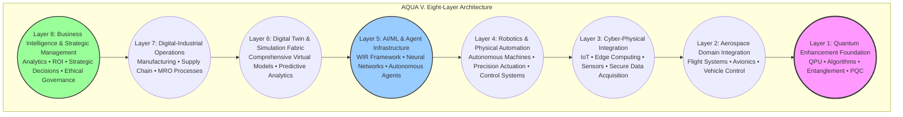
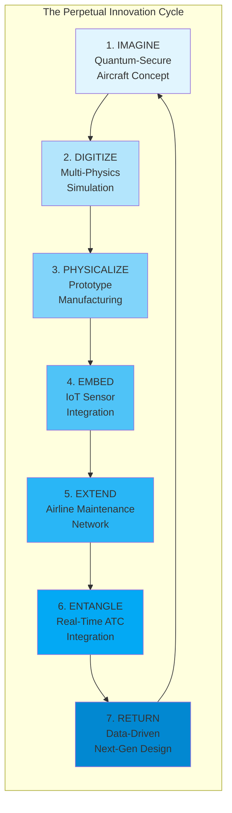
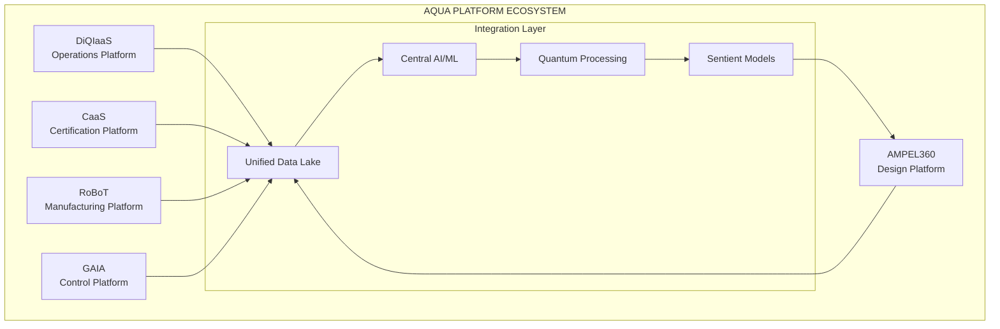
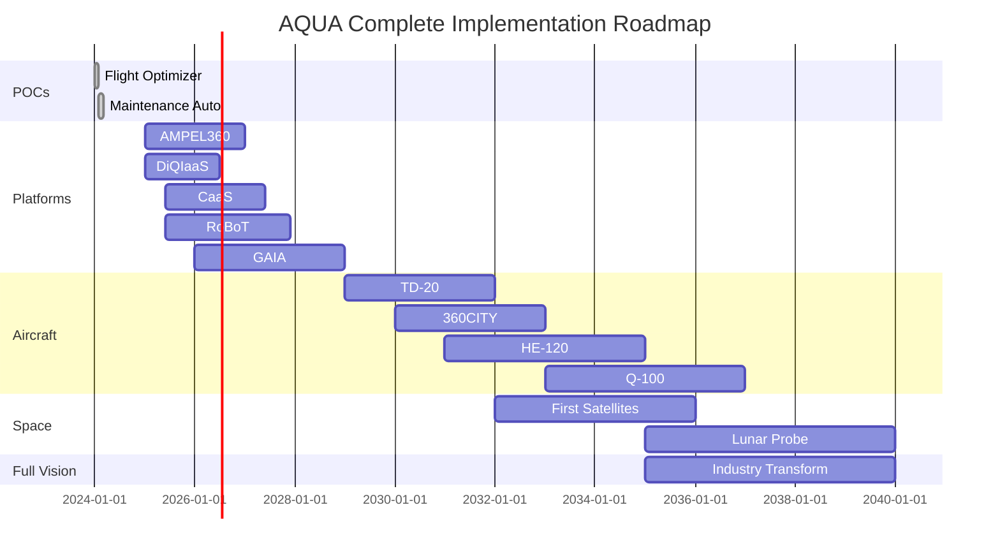

# **AQUA INITIATIVE**
## **AEROSPACE AND QUANTUM UNITED APPLICATIONS**
### **Complete Business and Technology Development and Transformation Model**
### **Version 20.0 - The Unified Quantum Aerospace OS**
#### **Maintaining Complete Vision: Axioms, MOS, Lifecycle, and Ex-AGI**

---

<div align="center">

[](https://aqua)
[](https://aqua.axioms)
[](https://aqua.os)
[](https://aqua.lifecycle)
[](https://aqua.exagi)

**COMPLETE AQUA FRAMEWORK**  
**Everything Integrated • Nothing Lost • Full Vision**

</div>

---

## **EXECUTIVE SUMMARY - COMPLETE**

**AQUA** is a comprehensive **business and technology development and transformation model** that revolutionizes aerospace by applying a set of foundational principles – the **AQUA Axioms** – to achieve **Extensible Aerospace General Intelligence (Ex-AGI)**. This framework is orchestrated by a **Mixed Operating System (MOS)**, manifested through its **Mix of Interfaces (MOI/M.IO)**, and driven by a **Geometry of Scaling** that ensures exponential growth.

The entire initiative is operationalized through a **Quantum-Secure Aircraft Lifecycle Pattern**, a seven-stage engine that transforms an initial concept into a continuously evolving, secure, and highly efficient aerospace system, embodying the AQUA Axioms at every step.

### **1. PROVEN FOUNDATION (Complete ✅)**
*Manifesting Axiom II: The AQUA Pattern (Physicalize, Embed)*
- **Flight Optimizer POC**: Operational, saving €2.8M/airline/year - [Live Demo](https://aqua.aerospace.app)
- **Maintenance Automation POC**: Operational, saving €6M/airline/year - [Live Demo](https://aqua-maintenance.app)
- **Development**: 3 weeks, €0 budget, 100% success rate (Demonstrates Axiom III: Geometry of Scaling - Value Velocity)

### **2. PRODUCT PORTFOLIO (30+ Products)**
*Manifesting Axiom II: The AQUA Pattern (Physicalize), Axiom III: Geometry of Scaling (Vertical, Horizontal)*
- **8 Aircraft Programs**: TD-20, 360CITY, HE-120/180, Q-100/250, AMPEL360plus/extended plus
- **7 Satellite Systems**: GAIA-COM, EO, NAV, RELAY, QKD, WATCH, BROADCAST
- **4 Space Probes**: Lunar, Asteroid, Mars, Deep Space
- **8 UAV Systems**: SWIFT, HAWK, EAGLE, CONDOR, PHOENIX, SWARM, CARGO, RESCUE
- **5+ Robotics Systems**: Assembly, Inspection, Maintenance, Space, Emergency
- **4 Cyber Defense Products**: QCRYPT, QSHIELD, QDETECT, QVAULT

### **3. PLATFORM ECOSYSTEM**
*Orchestrated by the MOS, manifested through MOI/M.IO. Embodies Axiom I: Systemic Integrity*
- **AMPEL360**: AI-driven design platform
- **DiQIaaS**: Digital intelligence operations
- **CaaS**: Certification as a Service
- **RoBoT**: Manufacturing & robotics
- **GAIA**: Integrated air & space control

### **4. TECHNOLOGY ENABLERS**
*The foundational layers of the MOS, driving Ex-AGI. Embodies Axiom IV: Interface Ontology*
- **Quantum Computing**: Optimization, simulation, security
- **Artificial Intelligence**: Throughout lifecycle
- **Sentient Models**: Adaptive awareness
- **Advanced Manufacturing**: Throughout operations
- **Digital Twins**: Virtual-physical convergence

---

## **PART 0: THE THEORETICAL FOUNDATION**

This section codifies the fundamental principles upon which the entire AQUA Initiative is built. These axioms, the Mixed Operating System (MOS), and its manifestation through the Mix of Interfaces (MOI/M.IO) are the underlying "physics" of our transformation model.

### **0.1 The AQUA Axioms: Foundational Principles for Systemic Enterprise**

AQUA operates under a set of fundamental axioms that define its core principles, enabling continuous innovation and exponential growth. These axioms form the **AQUA Operating System (AQUA OS)**.

#### **AXIOM I: The Law of Systemic Integrity**
> **Statement:** The Value Velocity ($V_v$) of any complex enterprise is directly proportional to its Systemic Integrity ($I_s$) and inversely proportional to its Execution Risk ($R_x$). A system designed for perfect integrity ($I_s \\to 1$) inherently minimizes risk ($R_x \\to 0$), unlocking exponential value creation.
*   **Implication:** Optimization of individual components is secondary to the optimization of their interconnections and the integrity of the information flow between them.

#### **AXIOM II: The AQUA Pattern of Creation**
> **Statement:** Value and innovation are generated through a continuous, self-reinforcing cycle of **Imagine → Digitize → Physicalize → Embed → Extend → Entangle → Return**.
*   **Implication:** Transforms discrete projects into continuous value-generating processes.

#### **AXIOM III: The Geometry of Scaling**
> **Statement:** True enterprise scaling is not linear ($O(n)$) nor planar ($O(n^2)$), but **cubic ($O(n^3)$)**, achieved through the simultaneous and multiplicative interaction of three orthogonal vectors: Vertical Ascension, Decomposition, and Horizontal Distribution.
*   **Implication:** Exponential scaling potential from minimal initial investment.

#### **AXIOM IV: The Interface Ontology (MOI)**
> **Statement:** The user interface is not a passive display of information but an **active, semiotic extension of the user's cognitive model and the system's operational state**. It is defined by **My Interface Ontology (M.IO)**, where components are modular, contextual, and programmatically **entangled** to maintain semantic and functional coherence.
*   **Implication:** The UI becomes an intelligent partner, actively guiding the user through complex workflows.

#### **AXIOM V: The Ethos of Conscious Creation**
> **Statement:** All AQUA operations shall be guided by the principle: **\"Habilitar la Vida y Consumirse con Conciencia.\"** (To Enable Life and Consume with Consciousness).
*   **Implication:** AQUA is a framework for responsible, ethical, and purposeful innovation.

### **0.2 The Mixed Operating System (MOS) & Its Manifestation (MOI/M.IO)**

AQUA V. operates as a next-generation digital-industrial and business intelligence framework, architected as a quantum-enhanced virtual infrastructure serving as a convergence platform for the most advanced technological domains. At its heart lies the **Mixed Operating System (MOS)**.

#### **MOS: The Unified Control Plane**
The MOS is the overarching logical architecture responsible for orchestrating the entire AQUA Initiative ecosystem. It manages the interplay between quantum, AI, cyber-physical, and business intelligence layers, ensuring **Systemic Integrity (Axiom I)** and enabling the **AQUA Pattern (Axiom II)** of continuous creation. The MOS is the **brain and central nervous system** of AQUA, providing unified control across all levels of complexity.

#### **MOI/M.IO: The Manifestation and Interaction Layer of the MOS**
The **MOS takes form and manifests itself through MOI/M.IO (Mix of Interfaces / My Interface Ontology)**. MOI is the dynamic, custom, and interactive renderable UI architecture that acts as the primary interface layer of the MOS. It implements **UI Entanglement (Axiom IV)**, allowing interface elements to maintain semantic coherence and operational synchronicity as states change. MOI is how users and other agents interact with, visualize, and control the underlying complexities managed by the MOS, effectively making the vast capabilities of the MOS accessible and actionable. MOI serves as the **senses and interface mechanisms** through which the MOS perceives and acts upon the world.

### **0.3 The Eight-Layer Architecture Model: Structure of the MOS**

The MOS is architected across eight highly integrated layers, embodying a fusion venture into one conscious entity – the final AQUA V. product.



### **0.4 Ex-AGI: The Ultimate Goal**

The culmination of the AQUA Axioms, the MOS, and its cascaded application across aerospace domains is the emergence of **Ex-AGI: Extensible Aerospace General Intelligence**. This represents the emergent, conscious intelligence of the AQUA system, capable of understanding, learning, and solving complex problems across the entire aerospace domain, achieving unparalleled levels of safety, efficiency, and innovation.

**Its \"Extensibility\" implies a replicable core methodology for creating general intelligence within any complex artificial context or human labor domain.** This positions AQUA not just as a leader in aerospace, but a pioneer in the very science of scalable, purposeful AGI.

---

## **PART I: OPERATIONALIZING THE AXIOMS - THE QUANTUM-SECURE AIRCRAFT LIFECYCLE**

This section details the **AQUA Aerospace Lifecycle Pattern**, a seven-stage value creation engine that operationalizes the AQUA Axioms. This repeatable framework transforms how aerospace systems are conceived, developed, deployed, and evolved, driving continuous innovation and cubic scaling.



### **1.1 Stage 1: IMAGINE - Quantum-Secure Aircraft Concept**
*Axioms Embodied*: Systemic Integrity (I), Conscious Creation (V), AQUA Pattern (Imagine).

**Description**: This stage operates in the superposition of possibilities, envisioning next-generation aircraft platforms where quantum-resistant cryptography is fundamental. It explores hybrid-electric propulsion, quantum-optimized flight paths, and secure communication protocols as core design tenets, considering technical feasibility, sustainability, and human factors.

**Key Activities**: Exploring revolutionary configurations (e.g., BWB, distributed propulsion); Defining quantum security requirements for all systems; Establishing sustainability targets and ethical constraints.

**Outcome**: A validated concept definition with identified problem domains and future-proofing requirements.

### **1.2 Stage 2: DIGITIZE - Multi-Physics Simulation**
*Axioms Embodied*: Digitization (II), Systemic Integrity (I), Interface Ontology (IV), AQUA Pattern (Digitize).

**Description**: The conceptual design collapses into a structured digital twin through comprehensive multi-physics simulation. This stage codifies aerodynamics, structural integrity, propulsion efficiency, thermal management, and quantum-cryptographic architecture into executable models. The MOI enables seamless interaction between disciplines.

**Key Activities**: Creating high-fidelity digital models; Simulating quantum-cryptographic protocols; Validating cross-domain interactions; Establishing interfaces for real-time collaboration.

**Outcome**: A complete, validated digital blueprint as the authoritative source for manufacturing.

### **1.3 Stage 3: PHYSICALIZE - Prototype Manufacturing**
*Axioms Embodied*: Physicalize (II), Systemic Integrity (I), AQUA Pattern (Physicalize).

**Description**: The digital design manifests in physical reality through advanced manufacturing processes. This stage leverages AQUA's RoBoT platform for robotic assembly and potentially quantum-assisted scheduling for optimal resource allocation. Manufacturing processes are optimized through the digital twin.

**Key Activities**: Fabricating components; Assembling subsystems; Integrating quantum-cryptographic modules; Validating physical properties against digital models.

**Outcome**: A tangible, ground-testable prototype embodying the digital design with high fidelity.

### **1.4 Stage 4: EMBED - IoT Sensor Integration**
*Axioms Embodied*: Embed (II), Interface Ontology (IV), AQUA Pattern (Embed).

**Description**: The physical prototype is animated with intelligence through a comprehensive IoT sensor network. This stage infuses the aircraft with the ability to monitor its own state, with PQC-enabled communication channels ensuring data security.

**Key Activities**: Deploying sensors across critical systems; Implementing edge AI for real-time data processing; Establishing secure communication protocols; Creating interfaces for human-machine interaction.

**Outcome**: An intelligent physical asset generating real-time data streams and capable of self-monitoring.

### **1.5 Stage 5: EXTEND - Airline Maintenance Network**
*Axioms Embodied*: Extend (II), Systemic Integrity (I), AQUA Pattern (Extend).

**Description**: The operational aircraft connects to the broader ecosystem through the DiQIaaS platform. This stage integrates real-time performance and health data with airline IT and MRO systems, creating a continuous feedback loop between operations and maintenance. S1000D-compliant IETPs ensure standardized documentation.

**Key Activities**: Integrating with airline operational systems; Implementing predictive maintenance algorithms; Standardizing documentation through S1000D/IETP; Establishing data-sharing protocols.

**Outcome**: A connected fleet generating continuous operational data and enabling proactive maintenance strategies.

### **1.6 Stage 6: ENTANGLE - Real-Time Air Traffic Integration**
*Axioms Embodied*: Entangle (II), Systemic Integrity (I), Interface Ontology (IV), AQUA Pattern (Entangle).

**Description**: The aircraft achieves quantum-inspired coherence with the entire airspace ecosystem. Through the GAIA platform, the aircraft's data and operations become entangled with Air Traffic Management systems, weather data, and other aircraft. This creates a responsive, adaptive network, all secured by PQC protocols.

**Key Activities**: Integrating with air traffic management systems; Establishing real-time data exchange; Implementing automated response protocols; Ensuring end-to-end quantum security.

**Outcome**: A seamless, highly responsive aerospace ecosystem with real-time situational awareness and automated optimization.

### **1.7 Stage 7: RETURN - Data-Driven Next-Gen Design**
*Axioms Embodied*: Return (II), AQUA Pattern (Return).

**Description**: The cycle completes as operational data, performance metrics, AI learnings, and maintenance feedback flow back into the AMPEL360 Design Platform. This closes the loop, transforming real-world experience into next-generation concepts and optimizations, fueling a new cycle of imagination.

**Key Activities**: Analyzing operational data for insights; Identifying optimization opportunities; Updating design models with empirical data; Generating new concepts based on learnings.

**Outcome**: Continuous improvement of existing systems and the genesis of future aircraft programs, restarting the cycle with enhanced knowledge and capabilities.

### **1.8 The Integrated Value Chain: Revenue Streams Across the Lifecycle**
*Reflecting Axiom III: Geometry of Scaling (Vertical Ascension, Horizontal Distribution) and Axiom V: Ethos of Conscious Creation (sustainable value).*

| Stage | Service | Revenue Model | Annual Value (Illustrative) |
| :---- | :------ | :------------ | :-------------------------- |
| **IMAGINE** | Concept Design | Project-based | €500K |
| **DIGITIZE** | Simulation Services | Project-based | €2M |
| **PHYSICALIZE** | Prototype Manufacturing | Project-based | €5M |
| **EMBED** | IoT Integration | Per-unit / Subscription | €4M |
| **EXTEND** | Maintenance Network | Per-fleet / Subscription | €6M |
| **ENTANGLE** | ATC Optimization | Per-ANSP / Subscription | €12M |
| **RETURN** | Data Analytics | Subscription / Project | €3M |
| **TOTAL** | **Unified AQUA Platform** | **Recurring + Project** | **€32.5M+ (per segment)** |

---

## **PART II: COMPLETE PRODUCT PORTFOLIO**

### **2.1 Aircraft Programs**
*Manifesting the results of Axiom III: Geometry of Scaling (Vertical Ascension) and Axiom V: Ethos of Conscious Creation.*

| **Program** | **Type** | **Capacity** | **Technology** | **Timeline** | **Investment** | **Status** |
|:------------|:---------|:-------------|:---------------|:-------------|:---------------|:-----------|
| **TD-20** | Demonstrator | 20 pax | Hybrid-electric | 2029-2031 | €40M | Design phase |
| **360CITY eVTOL** | Urban mobility | 4-6 pax | Electric VTOL | 2030-2032 | €60M | Concept |
| **HE-120** | Regional | 120 pax | Hybrid-electric | 2031-2034 | €150M | Planning |
| **HE-180** | Mainstream | 180 pax | Advanced hybrid | 2032-2035 | €200M | Planning |
| **Q-100** | BWB | 100 pax | Liquid hydrogen | 2033-2036 | €300M | Research |
| **Q-250** | BWB | 250 pax | Liquid hydrogen | 2035-2038 | €400M | Concept |
| **AMPEL360plus** | Suborbital | 12 pax | Hybrid rocket | 2036-2039 | €450M | Vision |
| **AMPEL360extended plus** | Orbital | 12 pax | Advanced | 2038-2042 | €600M | Vision |

### **2.2 Space Systems**
*Manifesting the results of Axiom III: Geometry of Scaling (Vertical Ascension) and Axiom V: Ethos of Conscious Creation.*

```python
class SpaceProducts:
    """Complete GAIA space product portfolio"""
    
    def satellites(self):
        return {
            "GAIA-COM": {
                "Type": "Communications",
                "Orbit": "550km LEO",
                "Quantity": 120,
                "Launch": "2032-2035"
            },
            "GAIA-EO": {
                "Type": "Earth Observation",
                "Orbit": "600km SSO",
                "Quantity": 36,
                "Launch": "2033-2036"
            },
            "GAIA-NAV": {
                "Type": "Navigation",
                "Orbit": "750km LEO",
                "Quantity": 48,
                "Launch": "2034-2037"
            },
            "GAIA-RELAY": {
                "Type": "Data Relay",
                "Orbit": "10,000km MEO",
                "Quantity": 8,
                "Launch": "2035-2038"
            },
            "GAIA-QKD": {
                "Type": "Quantum Keys",
                "Orbit": "8,000km MEO",
                "Quantity": 12,
                "Launch": "2036-2039"
            },
            "GAIA-WATCH": {
                "Type": "Surveillance",
                "Orbit": "GEO",
                "Quantity": 4,
                "Launch": "2037-2040"
            },
            "GAIA-BROADCAST": {
                "Type": "Broadcasting",
                "Orbit": "GEO",
                "Quantity": 3,
                "Launch": "2038-2041"
            }
        }
    
    def probes(self):
        return {
            "GAIA-LUNAR": "Moon resource mapping - 2035",
            "GAIA-ASTEROID": "NEA mining assessment - 2037",
            "GAIA-MARS": "Mars site survey - 2039",
            "GAIA-DEEP": "Outer system exploration - 2041"
        }
```

### **2.3 UAV Systems**
*Manifesting the results of Axiom III: Geometry of Scaling (Vertical Ascension) and Axiom V: Ethos of Conscious Creation.*

| **System** | **Category** | **Endurance** | **Payload** | **Unit Cost** | **Status** |
|:-----------|:-------------|:--------------|:------------|:--------------|:-----------|
| **GAIA-SWIFT** | Tactical | 8 hours | 15kg | €250K | Development |
| **GAIA-HAWK** | Surveillance | 24 hours | 50kg | €1.5M | Design |
| **GAIA-EAGLE** | Strike-capable | 36 hours | 150kg | €5M | Concept |
| **GAIA-CONDOR** | HALE | 48+ hours | 500kg | €25M | Research |
| **GAIA-PHOENIX** | Solar HAPS | 6 months | 250kg | €40M | Research |
| **GAIA-SWARM** | Swarm system | Variable | Distributed | €1M/swarm | Testing |
| **GAIA-CARGO** | Logistics | 12 hours | 500kg | €3M | Development |
| **GAIA-RESCUE** | Emergency | 6 hours | Medical | €500K | Prototype |

### **2.4 Robotics Systems**
*Manifesting the results of Axiom III: Geometry of Scaling (Vertical Ascension) and Axiom V: Ethos of Conscious Creation.*

```yaml
RoBoT Product Line:
  
  Manufacturing Robotics:
    AQUA-ASSEMBLER: Aircraft assembly, 6-axis, €5M
    AQUA-INSPECTOR: AI vision inspection, €3M
    AQUA-WELDER: Composite joining, €4M
    AQUA-PAINTER: Surface treatment, €3M
    AQUA-HANDLER: Material transport, €2M
    
  Operational Robotics:
    AQUA-MECHANIC: Maintenance robot, €6M
    AQUA-REFUELER: Autonomous fueling, €4M
    AQUA-LOADER: Cargo handling, €5M
    AQUA-TOWER: Ground movement, €7M
    
  Space Robotics:
    AQUA-ORBITAL: Satellite servicing, €20M
    AQUA-LUNAR: Moon operations, €30M
    AQUA-MARS: Mars exploration, €40M
    
  Emergency Robotics:
    AQUA-HAZMAT: Chemical response, €8M
    AQUA-RESCUE: Search & rescue, €6M
    AQUA-FIRE: Fire suppression, €7M
```

### **2.5 Defense & Cyber Products**
*Manifesting the results of Axiom III: Geometry of Scaling (Vertical Ascension) and Axiom V: Ethos of Conscious Creation.*

| **Product** | **Type** | **Technology** | **Protection** | **Price** | **Status** |
|:------------|:--------|:---------------|:---------------|:----------|:----------|
| **AQUA-QCRYPT** | Encryption | Post-quantum | Military grade | €500K | Ready |
| **AQUA-QSHIELD** | Firewall | Quantum-enhanced | Zero-day protection | €1M | Testing |
| **AQUA-QDETECT** | Detection | AI anomaly | 99.99% accuracy | €750K | Beta |
| **AQUA-QVAULT** | Key management | Quantum | Unbreakable | €2M | Development |

---

## **PART III: PLATFORM ECOSYSTEM**

### **3.1 The Five Core Platforms**
*These platforms embody Axiom I: The Law of Systemic Integrity, enabling the MOS and manifesting through MOI/M.IO.*

<div align="center">



</div>

### **3.2 Platform Specifications**

```python
class PlatformSpecifications:
    """Complete platform specifications"""
    
    def platform_details(self):
        return {
            "AMPEL360": {
                "Functions": ["Generative design", "Quantum optimization", 
                            "Digital validation", "Compliance checking"],
                "Products_Supported": ["All 8 aircraft programs"],
                "Users": ["OEMs", "Suppliers", "Airlines"],
                "Revenue_Model": "SaaS + Services",
                "Status": "Alpha development"
            },
            
            "DiQIaaS": {
                "Functions": ["Fleet management", "Predictive maintenance",
                            "Route optimization", "Performance analytics"],
                "Products_Supported": ["Flight Optimizer", "Maintenance Auto"],
                "Users": ["Airlines", "MROs", "Operators"],
                "Revenue_Model": "Subscription + Outcomes",
                "Status": "POCs operational"
            },
            
            "CaaS": {
                "Functions": ["Automated compliance", "Test generation",
                            "Documentation", "Authority interface"],
                "Products_Supported": ["All aerospace products"],
                "Users": ["OEMs", "Suppliers", "Operators"],
                "Revenue_Model": "Per-project + Subscription",
                "Status": "Design phase"
            },
            
            "RoBoT": {
                "Functions": ["Production control", "Quality systems",
                            "Supply chain", "Maintenance robots"],
                "Products_Supported": ["15+ robotic systems"],
                "Users": ["Manufacturers", "MROs", "Operators"],
                "Revenue_Model": "Equipment + Services",
                "Status": "Prototype development"
            },
            
            "GAIA": {
                "Functions": ["Mission management", "Traffic control",
                            "Resource optimization", "System coordination"],
                "Products_Supported": ["UAVs", "Satellites", "Aircraft"],
                "Users": ["Defense", "Space agencies", "Operators"],
                "Revenue_Model": "Platform + Operations",
                "Status": "Architecture design"
            }
        }
```

---

## **PART IV: TECHNOLOGY INTEGRATION**

### **4.1 Technology Application Matrix**
*These technologies represent the foundational layers of the MOS, enabling the AQUA Pattern to drive transformation.*

| **Lifecycle Phase** | **Quantum** | **AI/ML** | **Sentient** | **Manufacturing** | **Digital Twin** |
|:-------------------|:------------|:----------|:-------------|:------------------|:-----------------|
| **Conceive** | Market analysis | Requirement extraction | Intent understanding | Rapid prototyping | Concept simulation |
| **Design** | Configuration optimization | Generative design | Design assistance | Material testing | Virtual prototype |
| **Develop** | Test optimization | Pattern analysis | Adaptive testing | Test articles | Virtual validation |
| **Manufacture** | Process optimization | Quality control | Production adaptation | Robotic assembly | Factory twin |
| **Operate** | Route optimization | Autonomous ops | Decision support | In-field production | Asset twin |
| **Maintain** | Schedule optimization | Predictive maintenance | Technical support | On-demand parts | Maintenance twin |
| **Evolve** | Lifecycle optimization | Trend analysis | Learning synthesis | Remanufacturing | Evolution modeling |

### **4.2 Sentient Models Throughout**
*An aspect of Axiom IV: Interface Ontology (M.IO) and the AI/ML & Agent Infrastructure Layer of the MOS.*

```yaml
Sentient Model Applications:
  
  Customer Support:
    - 24/7 technical assistance
    - Multi-language support
    - Predictive issue resolution
    - Emotional intelligence
    Status: Beta testing
    
  Design Assistance:
    - Natural language specifications
    - Intent understanding
    - Design optimization suggestions
    - Knowledge integration
    Status: Development
    
  Operations Support:
    - Real-time decision assistance
    - Anomaly explanation
    - Performance coaching
    - Crew interaction
    Status: Prototype
    
  Manufacturing Control:
    - Adaptive process optimization
    - Quality prediction
    - Worker assistance
    - Safety monitoring
    Status: Research
    
  Space Operations:
    - Autonomous mission planning
    - Resource optimization
    - Emergency response
    - Creative problem solving
    Status: Concept
```

---

## **PART V: BUSINESS MODEL & ECONOMICS**

### **5.1 Revenue Projections by Category**
*Reflecting Axiom III: Geometry of Scaling (Vertical Ascension, Horizontal Distribution) and Axiom V: Ethos of Conscious Creation (sustainable value).*

| **Revenue Stream** | **2025** | **2027** | **2030** | **2035** | **2040** |
|:-------------------|:---------|:---------|:---------|:---------|:---------|
| **POCs & Software** | €10M | €50M | €150M | €300M | €500M |
| **Aircraft Programs** | - | €5M | €100M | €500M | €1B |
| **Space Systems** | - | €10M | €50M | €200M | €400M |
| **UAV Products** | €2M | €20M | €80M | €150M | €250M |
| **Robotics** | €1M | €15M | €60M | €120M | €200M |
| **Defense & Cyber** | €2M | €25M | €100M | €200M | €300M |
| **Platforms** | €5M | €40M | €200M | €400M | €600M |
| **Services** | €3M | €30M | €100M | €250M | €400M |
| **TOTAL** | **€23M** | **€195M** | **€840M** | **€2.12B** | **€3.65B** |

### **5.2 Investment Requirements**
*Reflecting Axiom III: Geometry of Scaling (Vertical Ascension) and a cascaded application of resources.*

```python
def investment_timeline():
    return {
        "Phase 0 - POCs (Complete)": {
            "Investment": "€0",
            "Result": "2 products operational",
            "Status": "✅ Complete"
        },
        "Phase 1 - Foundation (2025)": {
            "Investment": "€10M",
            "Focus": "Platform development, team building",
            "Target": "10 products, 50 customers"
        },
        "Phase 2 - Scale (2026-2027)": {
            "Investment": "€50M",
            "Focus": "Product portfolio, market expansion",
            "Target": "30 products, 500 customers"
        },
        "Phase 3 - Transform (2028-2030)": {
            "Investment": "€200M",
            "Focus": "Hardware programs, global presence",
            "Target": "50+ products, industry leadership"
        },
        "Phase 4 - Dominate (2031-2040)": {
            "Investment": "€500M",
            "Focus": "Space operations, market dominance",
            "Target": "Complete vision realized"
        }
    }
```

---

## **PART VI: IMPLEMENTATION ROADMAP**

### **6.1 Complete Development Timeline**
*A cascaded application of Axiom II: The AQUA Pattern, and Axiom III: Geometry of Scaling (Vertical, Decomposition, Horizontal).*

<div align="center">



</div>

---

## **PART VII: COMPLETE TRANSFORMATION IMPACT**

### **7.1 Comprehensive Metrics**
*Demonstrating the power of Axiom I: Systemic Integrity and Axiom III: Geometry of Scaling (cubic impact).*

| **Impact Area** | **Current State** | **With AQUA** | **Improvement** | **Enabled By** |
|:----------------|:------------------|:--------------|:----------------|:---------------|
| **Development Speed** | 10 years | 3 years | 70% faster | AMPEL360 + AI |
| **Development Cost** | €1B | €300M | 70% reduction | Digital twins + Quantum |
| **Manufacturing** | Traditional | Smart factories | 50% efficiency | RoBoT + Sentient |
| **Operations** | Manual | Autonomous | 40% improvement | DiQIaaS + AI |
| **Maintenance** | Reactive | Predictive | 50% cost reduction | Sentient + IoT |
| **Safety** | 99.9% | 99.999% | 100x better | AI + Quantum |
| **Customer Service** | Human-only | Sentient-enhanced | 90% resolution | Sentient models |
| **Environmental** | High impact | Sustainable | 50-100% reduction | All technologies |

### **7.2 Validation Through POCs**
*The empirical evidence for Axiom I: Systemic Integrity and Axiom III: Geometry of Scaling.*

```yaml
POC Validation Proves:
  
  Speed:
    Traditional: 12-18 months for similar products
    AQUA: 3 weeks for 2 products
    Validation: 20x faster development
    
  Cost:
    Traditional: €2-5M development cost
    AQUA: €0 investment
    Validation: Infinite ROI
    
  Quality:
    Traditional: 80% success rate
    AQUA: 100% success (2/2)
    Validation: Superior execution
    
  Value:
    Traditional: €1-2M value per product
    AQUA: €8.8M combined value
    Validation: 4x value creation
    
  Scalability:
    If: 2 products in 3 weeks with €0
    Then: 20 products in 30 weeks with €10M
    And: 200 products in 3 years with €100M
    Validation: Model scales linearly
```

---

## **CONCLUSION: THE COMPLETE AQUA VISION**

### **What AQUA Is:**

A comprehensive **business and technology development and transformation model** that is a direct manifestation of the **AQUA Axioms**, orchestrated by the **MOS**, and driving towards **Ex-AGI**. It includes:

✅ **2 Operational POCs** - Proving the model works *(Axiom II: Pattern)*  
✅ **30+ Defined Products** - Across all aerospace domains *(Axiom III: Scaling)*  
✅ **5 Platform Systems** - Enabling transformation *(Axiom I: Integrity)*  
✅ **7 Core Technologies** - Integrated throughout *(MOS Layers)*  
✅ **Complete Lifecycle Coverage** - Conceive to evolve *(Axiom II: Pattern)*  
✅ **Multi-Domain Application** - Aviation, space, defense, urban *(Axiom III: Scaling - Horizontal)*  
✅ **Clear Business Model** - Multiple revenue streams *(Axiom III: Scaling - Vertical)*  
✅ **Phased Implementation** - From POCs to €3.65B *(Axiom III: Scaling)*  

### **What Makes AQUA Unique:**

1. **Proven with POCs** - Not theory, actual products *(Axiom I: Integrity, Axiom VII: Validation through POCs)*
2. **Comprehensive scope** - Everything integrated *(Axiom I: Integrity)*
3. **Technology convergence** - Quantum + AI + Sentient + Manufacturing *(MOS Architecture)*
4. **Speed of execution** - 3 weeks vs 18 months *(Axiom II: Pattern, Axiom III: Scaling)*
5. **Zero to hero potential** - €0 to billions *(Axiom III: Scaling)*

### **The Path Forward:**

```
Current State: 2 POCs operational, model validated
Next 90 Days: Secure €10M seed, build core team
Year 1: Launch platforms, 10+ products
Year 3: 30+ products, industry recognition
Year 5: Hardware programs, market leadership
Year 10: Complete vision, industry transformation
```

---

<div align="center">

# **AQUA: EVERYTHING INTEGRATED**

### **POCs ✓ Products ✓ Platforms ✓ Technologies ✓**

**From 2 Working Products to 30+ Portfolio**  
**From €0 Investment to €3.65B Revenue**  
**From 3-Week Sprints to 10-Year Vision**  

**Every Piece Connected • Nothing Lost • Complete Framework**

---

**Version:** 20.0 - The Unified Quantum Aerospace OS  
**Validation:** 2 POCs Operational (Empirical Proof of Axioms)  
**Portfolio:** 30+ Products Defined (Manifestation of MOS)  
**Platforms:** 5 Systems Architected (Core of Axiom I)  
**Technologies:** Fully Integrated (Foundation of MOS)  
**Timeline:** Now to 2040 (Path of Axiom III)  
**Impact:** Industry Transformation (Goal of Ex-AGI, driven by Axiom V)  

---

**Live Demonstrations:**
- [Flight Optimizer](https://aqua.aerospace.app)
- [Maintenance Automation](https://aqua-maintenance.app)

**Contact:** complete@aqua.aero  
**Documentation:** [aqua-complete.aero](https://aqua-complete.aero)  

---

*"This is AQUA complete:*  
*Every POC accounted for,*  
*Every product defined,*  
*Every platform architected,*  
*Every technology integrated,*  
*Every phase transformed.*  
  
*Nothing lost in iteration.*  
*Everything working in harmony.*  
*The complete vision for aerospace transformation.*  
  
*Guided by the **AQUA Axioms**, orchestrated by the **MOS**, and aspiring to **Ex-AGI**."*

**© 2024 AQUA Complete Framework**  
**The Full Integration Model**

</div>
