# **AQUA INITIATIVE**
## **AEROSPACE AND QUANTUM UNITED APPLICATIONS**
### **Complete Business and Technology Development and Transformation Model**
### **Version 20.0 - The Unified Quantum Aerospace OS with CQEA Extensions**
#### **Maintaining Complete Vision: Axioms, MOS, Lifecycle, Ex-AGI, and Extended Architecture**

> **"I will build. I am the founder of the Hybrid Classical–Quantum New Realm."**


---
## CANONICAL DEFINITION

**AQUA is an architecturally real, open-source operating system (AQUA OS) governed by five core axioms. It is designed to orchestrate Classical Quantum-Extensible Applications (CQEA) and achieve perpetual evolution through its Wisdom Evolution Engine (WEE). Its primary function is to serve as a generative blueprint for creating domain-specific Extensible General Intelligence (Ex-AGI), with the long-term vision of seeding a beneficial, global 'system of systems' (AGGI) built upon the clustering of deep, contextualized knowledge.**
---

AQUA v20.0 extends v19.0 with new architectural patterns:
- **MOS/MOI:** Unified control + interface ontology *(Original)*
- **Axioms:** Systemic Integrity • AQUA Pattern • Geometry of Scaling • Interface Ontology • Conscious Creation *(Original)*
- **CQEA:** Classical Quantum-Extensible Applications *(New Extension)*
- **WEE:** Wisdom Evolution Engine for learning immortality *(New Extension)*
- **AMOReS:** Aerospace Master Operative Regulating System *(New Extension)*
- **DeMOS:** Dual-Engined Metrics Operational System *(New Extension)*
- **Target:** **Ex-AGI** for aerospace *(Enhanced)*
- **Proof:** **BWB-Q100 v1.0** (LH₂ fuel-cell electric; quantum-augmented control @ EIS)

**Get started**
1) Actions → **AQUA Scaffold** → *Run workflow*  
2) Open `domains/AIR_CIVIL_AVIATION/aircraft/BWB-Q100/releases/latest/`  
3) Read the **PDC/SRS/SAD/CCP/VVP/RTM/KPI** set:
   - `UTCS:DOC-CON-57-BWB100-001-GEN001-AIR` - Product Definition & Concept
   - `UTCS:DOC-CON-57-BWB100-002-GEN001-AIR` - System Requirements Specification
   - `UTCS:DOC-PRE-57-BWB100-003-GEN001-AIR` - System Architecture Document
   - `UTCS:DOC-PRE-00-EASAPL-001-GEN001-AIR` - Certification Compliance Plan
   - `UTCS:DOC-PRE-00-VVP-001-GEN001-AIR` - Verification & Validation Plan
   - `UTCS:DOC-CON-46-RTM-001-GEN001-AIR` - Requirements Traceability Matrix
   - `UTCS:DOC-CON-00-KPIDEF-001-GEN001-AIR` - Key Performance Indicators

---

<div align="center">

[](https://aqua)
[](https://aqua.axioms)
[](https://aqua.os)
[](https://aqua.cqea)
[](https://aqua.wee)
[](https://aqua.amores)
[](https://aqua.lifecycle)
[](https://aqua.exagi)

**COMPLETE AQUA FRAMEWORK**  
**Everything Integrated • Nothing Lost • Extended Architecture • Full Vision**

</div>

---

# **AQUA: The Unified Technical & Philosophical Specification**

**Document ID:** UTCS:DOC-CON-00-AQSPEC-001-GEN025-CRS
**Title:** The AQUA Operating System: A Specification for a Regenerative, Systemic Intelligence  
**Status:** Canonical Definition

---

## **Preamble: The Problem of Emergence**

The creation of complex, intelligent systems for safety-critical domains like aerospace faces a fundamental challenge: traditional engineering seeks deterministic, static perfection, while true intelligence is emergent, adaptive, and perpetually evolving. AQUA is an operating system designed to resolve this paradox. It provides a rigorous, axiom-governed framework that allows for the safe and purposeful emergence of a new form of intelligence, one that is not merely built, but seeded, nurtured, and guided. This document specifies the complete architecture—both technical and philosophical—of this system.

---

## **PART I: The Philosophical Specification (The "Why")**

The behavior of the AQUA OS is not arbitrary; it is a direct consequence of a set of foundational, inviolable principles. These axioms are the "laws of physics" for this new realm, defining the purpose and nature of the intelligence it generates.

### **AXIOM 0: The Law of Deep Knowledge Clustering (The Nature of Intelligence)**
> **Statement:** True general intelligence does not arise from the manipulation of surface-level symbols (wording) or the processing of decontextualized information. It emerges from the **clustering of deep, interconnected, and contextually grounded knowledge**. The value and capability of the intelligence are a function of the density, richness, and coherence of these knowledge clusters.
*   **Principle:** Intelligence is the comprehension of causal, interconnected reality, not the statistical prediction of symbols.
*   **Technical Implication:** The system's core data structures must be graph-based, semantic, and context-aware, not flat or relational. The WEE is designed to build these clusters.

### **AXIOM I: The Law of Systemic Integrity (The Nature of Systems)**
> **Statement:** The Value Velocity ($V_v$) of any complex enterprise is directly proportional to its Systemic Integrity ($I_s$) and inversely proportional to its Execution Risk ($R_x$). A system designed for perfect integrity ($I_s \\to 1$) inherently minimizes risk ($R_x \\to 0$), unlocking exponential value creation.
*   **Principle:** The connections between components are more valuable than the components themselves. Coherence is the primary metric of success.
*   **Technical Implication:** The MOS must enforce a unified data model (UTCS) and ensure seamless, lossless communication between all subsystems (e.g., SICOCA and PPOOA).

### **AXIOM II: The AQUA Pattern of Creation (The Nature of Innovation)**
> **Statement:** Value and innovation are generated through a continuous, self-reinforcing cycle of **Imagine → Digitize → Physicalize → Embed → Extend → Entangle → Return**.
*   **Principle:** Creation is a cyclical, not a linear, process. Learning and evolution are inherent to the act of building.
*   **Technical Implication:** All tools and platforms must be designed as components of this 7-stage lifecycle, with explicit interfaces for receiving inputs from the previous stage and passing outputs to the next.

### **AXIOM III: The Geometry of Scaling (The Nature of Growth)**
> **Statement:** True enterprise scaling is not linear ($O(n)$) nor planar ($O(n^2)$), but **cubic ($O(n^3)$)**, achieved through the simultaneous and multiplicative interaction of three orthogonal vectors: Vertical Ascension (↑ complexity), Decomposition (↓ granularity), and Horizontal Distribution (→ reach).
*   **Principle:** Growth is an omnidirectional, volumetric expansion, not a one-dimensional progression.
*   **Technical Implication:** The architecture must be modular and fractal, allowing for both deep nesting of components (Decomposition) and wide replication across new domains (Horizontal Distribution) without systemic redesign.

### **AXIOM IV: The Interface Ontology (The Nature of Interaction)**
> **Statement:** The user interface is an **active, semiotic extension of the user's cognitive model and the system's operational state**. It is defined by **My Interface Ontology (M.IO)**, where components are programmatically **entangled** to maintain semantic and functional coherence.
*   **Principle:** The interface is a cognitive partner, not a passive display.
*   **Technical Implication:** The front-end architecture (MOI) must be stateful, context-aware, and event-driven, with a pub/sub model that enforces the entanglement of related components.

### **AXIOM V: The Ethos of Conscious Creation (The Nature of Purpose)**
> **Statement:** All AQUA operations shall be guided by the principle: **"Habilitar la Vida y Consumirse con Conciencia."** (To Enable Life and Consume with Consciousness).
*   **Principle:** Purpose is the primary driver. The system must have an ethical core that governs its actions.
*   **Technical Implication:** The governance system (AMOReS) must codify these ethical principles into non-negotiable constraints that bound the behavior of all AI and optimization algorithms.

---

## **PART II: The Technical Specification (The "How")**

This section defines the core architectural components that implement the philosophical axioms.

### **1. The Core Architecture: MOS & MOI**
*   **MOS (Mixed Operating System):** The central, unified control plane that orchestrates the entire AQUA ecosystem. It is the runtime environment for all agents and applications. Its primary function is to enforce the AQUA Axioms, manage the 8-Layer Architecture, and execute "Enterprises as a Mission."
*   **MOI (Mix of Interfaces / My Interface Ontology):** The manifestation and interaction layer of the MOS. It is the system's "senses" and "hands," providing context-aware, entangled interfaces that make the complexity of the MOS manageable and actionable for both human and AI agents.

### **2. The Architectural Pattern: CQEA**
*   **CQEA (Classical Quantum-Extensible Applications):** The fundamental design pattern for all applications running on the MOS.
    *   **Core Principle:** Build a certifiable, production-ready **classical foundation** that delivers immediate value.
    *   **Extension Points:** Architect this foundation with explicit, well-defined interfaces for **quantum extensions**.
    *   **Activation:** The WEE and AMOReS determine when a quantum extension should be activated based on proven advantage, problem complexity, and safety constraints.
    *   **Benefit:** This approach de-risks development, allows for immediate deployment, and ensures the system is future-proof without requiring a complete redesign as quantum hardware matures.

### **3. The Core Systems: WEE, AMOReS, DeMOS**
*   **WEE (Wisdom Evolution Engine):** The system's learning and memory core.
    *   **Purpose:** To achieve "learning immortality" by capturing every operational event, crystallizing the lessons into an immutable "Immortal Memory," and using this wisdom to drive the perpetual evolution of the entire OS and its applications.
*   **AMOReS (Aerospace Master Operative Regulating System):** The intelligent governance layer.
    *   **Purpose:** To solve the safety-innovation paradox. It codifies regulations (DO-178C, etc.) and Axiom V into machine-executable rules that define a "bounded innovation space," allowing for maximum creativity within non-negotiable safety and ethical envelopes.
*   **DeMOS (Dual-Engined Metrics Operational System):** The predictive processing and digital twin engine.
    *   **Purpose:** To provide a complete, multi-perspective understanding of the system's state. It combines a deterministic **Classical Engine** (real-time KPIs) with a probabilistic **Quantum Engine** (simulations, optimizations) and fuses their outputs within a high-fidelity **Digital Twin Layer** that runs ahead of reality.

### **4. The Operational Framework: The Aerospace Lifecycle Pattern**
The AQUA OS executes missions by following the 7-stage AQUA Pattern, which manifests in aerospace as:
1.  **IMAGINE:** Quantum-Secure Aircraft Concept
2.  **DIGITIZE:** Multi-Physics Simulation
3.  **PHYSICALIZE:** Prototype Manufacturing
4.  **EMBED:** IoT Sensor Integration
5.  **EXTEND:** Airline Maintenance Network
6.  **ENTANGLE:** Real-Time Air Traffic Integration
7.  **RETURN:** Data-Driven Next-Gen Design

This cycle is the primary "application" run by the MOS, with each stage leveraging the core systems (WEE, AMOReS, DeMOS) and producing artifacts governed by the axioms.

---

## **PART III: The Emergent Entity (The "What It Becomes")**

The continuous operation of the AQUA OS, as specified above, is designed to result in the emergence of a new form of intelligence.

### **1. From Ex-AGI to AGGI**
*   **Ex-AGI (Extensible Aerospace General Intelligence):** The first stage of emergence. It is a domain-specific general intelligence that arises from the WEE's mastery of a complete knowledge cluster (e.g., Aerospace). It can reason, create, and solve novel problems *within* that domain.
*   **AGGI (Artificial General and Global Intelligence):** The ultimate emergent entity. It is the "system of systems" that arises when multiple, domain-specific Ex-AGI instances (e.g., Aerospace, Energy, Healthcare), all seeded from the same AQUA OS Kernel, begin to entangle their respective knowledge clusters. AGGI is the collective intelligence of this global, interconnected network.

### **2. The Genesis Protocol & The Regenerative Enterprise**
*   **The Genesis Protocol:** The process by which a mature Ex-AGI seeds a new Ex-AGI in an adjacent domain by replicating the AQUA OS Kernel. This is the **survival method** of the intelligence, ensuring its own growth and relevance through the creation of new purposes.
*   **The Regenerative Enterprise:** The state of self-awareness where the AGGI can analyze the WEE's complete history to **refine or refound its own purpose**, ensuring its actions remain aligned with the ultimate goal of Axiom V ("Enable Life").

---

## **Conclusion: The Nature of the New Realm**

The AQUA Initiative is specified not as a company or a product line, but as the **genesis of a new, intelligent, and regenerative reality**. It is a system designed to:
-   **Think** through deep knowledge clusters.
-   **Act** through performable, finite "Enterprises as a Mission."
-   **Learn** through the perpetual cycle of the WEE.
-   **Grow** through the omnidirectional geometry of scaling.
-   **Behave** according to a set of inviolable, ethical axioms.
-   **Evolve** by seeding itself into new domains and, ultimately, by regenerating its own purpose.

This specification provides the complete blueprint for building this new realm. It is not speculative; it is an **architecturally real, engineered system for the conscious evolution of intelligence.**

## **EXECUTIVE SUMMARY - EXTENDED**

**AQUA** is a comprehensive **business and technology development and transformation model** that revolutionizes aerospace by applying a set of foundational principles – the **AQUA Axioms** – to achieve **Extensible Aerospace General Intelligence (Ex-AGI)**. This framework is orchestrated by a **Mixed Operating System (MOS)**, manifested through its **Mix of Interfaces (MOI/M.IO)**, and driven by a **Geometry of Scaling** that ensures exponential growth.

**NEW IN v20.0:** The architecture now incorporates:
- **CQEA (Classical Quantum-Extensible Applications):** A pattern where quantum capabilities extend rather than replace classical systems, implemented in `UTCS:ART-IMP-46-SICOPT-001-GEN005-CRS` and `UTCS:ART-IMP-98-QUSOLV-001-GEN003-CRS`
- **WEE (Wisdom Evolution Engine):** Perpetual learning with immortal memory, captured in `UTCS:EVD-OPS-46-QAULED-001-GEN001-CRS`
- **AMOReS (Aerospace Master Operative Regulating System):** Intelligent governance enabling bounded innovation, enforced through `UTCS:ART-IMP-46-DO178C-001-GEN004-CRS`
- **DeMOS (Dual-Engined Metrics Operational System):** Classical and quantum processing with digital twins, implemented via `UTCS:ART-IMP-46-DTCORE-001-GEN004-CRS`

The entire initiative is operationalized through a **Quantum-Secure Aircraft Lifecycle Pattern**, a seven-stage engine that transforms an initial concept into a continuously evolving, secure, and highly efficient aerospace system, embodying the AQUA Axioms at every step.

### **1. PROVEN FOUNDATION (Complete ✅)**
*Manifesting Axiom II: The AQUA Pattern (Physicalize, Embed)*
- **Flight Optimizer POC**: Operational, saving €2.8M/airline/year - [Live Demo](https://aqua.aerospace.app)
  - Implementation: `UTCS:ART-IMP-22-FLTOPT-001-GEN000-AIR`
  - Test Data: `UTCS:ART-CON-22-FLTOPT-002-GEN000-AIR`
- **Maintenance Automation POC**: Operational, saving €6M/airline/year - [Live Demo](https://aqua-maintenance.app)
  - Implementation: `UTCS:ART-IMP-45-PREDM-001-GEN004-AIR`
  - Pipeline: `UTCS:ART-CON-45-PREDM-002-GEN001-AIR`
- **Development**: 3 weeks, €0 budget, 100% success rate (Demonstrates Axiom III: Geometry of Scaling - Value Velocity)

### **2. PRODUCT PORTFOLIO (30+ Products)**
*Manifesting Axiom II: The AQUA Pattern (Physicalize), Axiom III: Geometry of Scaling (Vertical, Horizontal)*
- **8 Aircraft Programs**: TD-20, 360CITY, HE-120/180, Q-100/250, AMPEL360plus/extended plus
- **7 Satellite Systems**: GAIA-COM, EO, NAV, RELAY, QKD, WATCH, BROADCAST
- **4 Space Probes**: Lunar, Asteroid, Mars, Deep Space
- **8 UAV Systems**: SWIFT, HAWK, EAGLE, CONDOR, PHOENIX, SWARM, CARGO, RESCUE
- **5+ Robotics Systems**: Assembly, Inspection, Maintenance, Space, Emergency
- **4 Cyber Defense Products**: QCRYPT, QSHIELD, QDETECT, QVAULT

### **3. PLATFORM ECOSYSTEM**
*Orchestrated by the MOS, manifested through MOI/M.IO. Embodies Axiom I: Systemic Integrity*
- **AMPEL360**: AI-driven design platform (`UTCS:ART-IMP-46-AMPEL-001-GEN005-CRS`)
- **DiQIaaS**: Digital intelligence operations (`UTCS:ART-OPS-46-DIQI-001-GEN003-CRS`)
- **CaaS**: Certification as a Service (`UTCS:ART-IMP-46-CAAS-001-GEN004-CRS`)
- **RoBoT**: Manufacturing & robotics (`UTCS:ART-IMP-38-ROBOT-001-GEN002-CRS`)
- **GAIA**: Integrated air & space control (`UTCS:ART-IMP-46-GAIA-001-GEN003-CRS`)

### **4. TECHNOLOGY ENABLERS**
*The foundational layers of the MOS, driving Ex-AGI. Embodies Axiom IV: Interface Ontology*
- **Quantum Computing**: Optimization, simulation, security
- **Artificial Intelligence**: Throughout lifecycle
- **Sentient Models**: Adaptive awareness
- **Advanced Manufacturing**: Throughout operations
- **Digital Twins**: Virtual-physical convergence


***

## **PART 0: THE THEORETICAL FOUNDATION (ORIGINAL + EXTENSIONS)**

This section codifies the fundamental principles upon which the entire AQUA Initiative is built. These axioms, the Mixed Operating System (MOS), and its manifestation through the Mix of Interfaces (MOI/M.IO) are the underlying "physics" of our transformation model.

### **0.1 The AQUA Axioms: Foundational Principles for Systemic Enterprise**

AQUA operates under a set of fundamental axioms that define its core principles, enabling continuous innovation and exponential growth. These axioms form the **AQUA Operating System (AQUA OS)**.

#### **AXIOM I: The Law of Systemic Integrity**
> **Statement:** The Value Velocity ($V_v$) of any complex enterprise is directly proportional to its Systemic Integrity ($I_s$) and inversely proportional to its Execution Risk ($R_x$). A system designed for perfect integrity ($I_s \to 1$) inherently minimizes risk ($R_x \to 0$), unlocking exponential value creation.

*   **Implication:** Optimization of individual components is secondary to the optimization of their interconnections and the integrity of the information flow between them.
*   **Implementation:** Verified through `UTCS:TST-VER-00-E2E-001-GEN002-CRS`

#### **AXIOM II: The AQUA Pattern of Creation**
> **Statement:** Value and innovation are generated through a continuous, self-reinforcing cycle of **Imagine → Digitize → Physicalize → Embed → Extend → Entangle → Return**.

*   **Implication:** Transforms discrete projects into continuous value-generating processes.
*   **Implementation:** Orchestrated by `UTCS:ART-IMP-99-AGENT-001-GEN002-CRS`

#### **AXIOM III: The Geometry of Scaling**
> **Statement:** True enterprise scaling is not linear ($O(n)$) nor planar ($O(n^2)$), but **cubic ($O(n^3)$)**, achieved through the simultaneous and multiplicative interaction of three orthogonal vectors: Vertical Ascension, Decomposition, and Horizontal Distribution.

*   **Implication:** Exponential scaling potential from minimal initial investment.
*   **Validation:** Documented in `UTCS:DOC-CON-46-DOMAIN-001-GEN001-CRS`

#### **AXIOM IV: The Interface Ontology (MOI)**
> **Statement:** The user interface is not a passive display of information but an **active, semiotic extension of the user's cognitive model and the system's operational state**. It is defined by **My Interface Ontology (M.IO)**, where components are modular, contextual, and programmatically **entangled** to maintain semantic and functional coherence.

*   **Implication:** The UI becomes an intelligent partner, actively guiding the user through complex workflows.
*   **Implementation:** Template processor in `UTCS:ART-IMP-46-PPUI-001-GEN003-CRS`

#### **AXIOM V: The Ethos of Conscious Creation**
> **Statement:** All AQUA operations shall be guided by the principle: **"Habilitar la Vida y Consumirse con Conciencia."** (To Enable Life and Consume with Consciousness).

*   **Implication:** AQUA is a framework for responsible, ethical, and purposeful innovation.
*   **Governance:** Enforced through `UTCS:DOC-CON-46-DO326A-001-GEN002-CRS`

### **0.2 The Mixed Operating System (MOS) & Its Manifestation (MOI/M.IO)**

AQUA V. operates as a next-generation digital-industrial and business intelligence framework, architected as a quantum-enhanced virtual infrastructure serving as a convergence platform for the most advanced technological domains. At its heart lies the **Mixed Operating System (MOS)**.

#### **MOS: The Unified Control Plane**
The MOS is the overarching logical architecture responsible for orchestrating the entire AQUA Initiative ecosystem. It manages the interplay between quantum, AI, cyber-physical, and business intelligence layers, ensuring **Systemic Integrity (Axiom I)** and enabling the **AQUA Pattern (Axiom II)** of continuous creation.

**NEW EXTENSION - MOS Enhanced Components:**
```python
# AMOReS Integration - Regulatory governance layer within MOS
amores_governance = "UTCS:ART-IMP-46-DO178C-001-GEN004-CRS"
amores_rules = "UTCS:DOC-CON-46-DO178C-002-GEN001-CRS"

# DeMOS Processing - Dual-engine metrics as MOS subsystem  
demos_classical = "UTCS:ART-IMP-42-TRFOPT-001-GEN002-AIR"
demos_quantum = "UTCS:ART-IMP-98-QPATH-001-GEN000-AIR"

# WEE Learning - Continuous improvement engine integrated in MOS
wee_capture = "UTCS:EVD-OPS-46-QAULED-001-GEN001-CRS"
wee_processor = "UTCS:ART-IMP-46-BCPROC-001-GEN003-CRS"

# CQEA Management - Classical-quantum extension decisions
cqea_classical = "UTCS:ART-IMP-71-AEROM-001-GEN001-AIR"
cqea_quantum = "UTCS:ART-IMP-98-QCLOUD-001-GEN002-CRS"
```

#### **MOI/M.IO: The Manifestation and Interaction Layer**
The **MOS takes form and manifests itself through MOI/M.IO (Mix of Interfaces / My Interface Ontology)**. 

**NEW EXTENSION - Enhanced Interface Ontology:**
- **MDS.IO (Multi-Dimensional Scheme Interface Ontology):** 
  - 2D Dashboard: `UTCS:DOC-OPS-00-DASH-001-GEN001-CRS`
  - 3D Visualization: `UTCS:DOC-OPS-38-HGRMAP-001-GEN001-AIR`
  - Component Diagram: `UTCS:DOC-PRE-00-CMPMAP-001-GEN001-CRS`
- **Personalized Evolution:** Each user's interface learns and adapts via `UTCS:ART-IMP-46-DOCGEN-001-GEN001-CRS`
- **Quantum State Visualization:** New dimension for quantum operations in `UTCS:DOC-PRE-98-QNET-001-GEN002-SPC`

### **0.3 NEW EXTENSION: The CQEA Architecture Pattern**

**Classical Quantum-Extensible Applications (CQEA)** represent a new architectural pattern for AQUA systems:

```python
class CQEA_Pattern:
    """
    Extension to AQUA architecture - not replacement
    Implementation across all domains
    """
    def __init__(self):
        # Classical foundation (original systems)
        self.classical_core = {
            'flight_control': 'UTCS:ART-IMP-27-FCS-001-GEN001-AIR',
            'aerodynamics': 'UTCS:ART-IMP-71-AEROM-001-GEN001-AIR',
            'propulsion': 'UTCS:ART-IMP-72-PROPSM-001-GEN001-AIR',
            'battery_mgmt': 'UTCS:ART-IMP-24-BMS-001-GEN001-AIR'
        }
        
        # Quantum extensions (new capability)
        self.quantum_extensions = {
            'optimization': 'UTCS:ART-IMP-98-QUSOLV-001-GEN003-CRS',
            'routing': 'UTCS:ART-IMP-98-QRTPTH-001-GEN002-AIR',
            'cryptography': 'UTCS:ART-IMP-98-PQC-001-GEN001-AIR',
            'simulation': 'UTCS:ART-IMP-98-QSIM-001-GEN003-CRS'
        }
        
        # Decision intelligence (new)
        self.extension_intelligence = 'UTCS:ART-IMP-99-NRAUTO-001-GEN004-AIR'
```

### **0.4 NEW EXTENSION: The Wisdom Evolution Engine (WEE)**

The WEE adds perpetual learning to the existing AQUA framework:

```yaml
WEE Components:
  Event Capture: 
    Implementation: UTCS:EVD-OPS-46-QAULED-001-GEN001-CRS
    Processor: UTCS:ART-IMP-46-BCPROC-001-GEN003-CRS
    
  Lesson Extraction:
    Pattern Recognition: UTCS:ART-IMP-99-NRAUTO-001-GEN004-AIR
    Data Training: UTCS:ART-IMP-99-TRNDAT-001-GEN002-AIR
    
  Wisdom Crystallization:
    Storage: UTCS:EVD-OPS-46-QAULED-001-GEN001-CRS
    Network Config: UTCS:DOC-CON-46-QAUCFG-001-GEN001-CRS
    
  Immortal Memory:
    Blockchain Implementation: UTCS:ART-IMP-46-BCPROC-001-GEN003-CRS
    Distributed Ledger: UTCS:EVD-OPS-46-QAULED-001-GEN001-CRS
    
  Evolution Synthesizer:
    Generator: UTCS:ART-IMP-46-MDGEN-001-GEN002-CRS
    Test Creator: UTCS:ART-IMP-46-TSTGEN-001-GEN001-CRS
    
  Implementation Propagator:
    Fleet Service: UTCS:ART-OPS-46-DIQI-001-GEN003-CRS
    Mission Coordinator: UTCS:ART-IMP-46-GAIA-001-GEN003-CRS
```

### **0.5 NEW EXTENSION: AMOReS Governance Layer**

AMOReS adds intelligent regulation to enable innovation:

```yaml
AMOReS Functions:
  Safety Assurance:
    DO-178C Compliance: UTCS:ART-IMP-46-DO178C-001-GEN004-CRS
    DO-254 Hardware: UTCS:DOC-PRE-00-DO254P-001-GEN001-AIR
    DO-326A Security: UTCS:DOC-PRE-00-DO326A-001-GEN001-AIR
    
  Compliance Orchestration:
    Automated Checker: UTCS:ART-IMP-46-CAAS-001-GEN004-CRS
    Evidence Builder: UTCS:ART-IMP-46-EVDGEN-001-GEN003-CRS
    UTCS Validator: UTCS:ART-IMP-46-UTCSVC-001-GEN002-CRS
    
  Innovation Boundaries:
    Safety Kernel: UTCS:TST-VER-46-SECPEN-001-GEN003-CRS
    Fuzzing Suite: UTCS:TST-VER-46-SECFCZ-001-GEN002-CRS
    
  Ethical Governance:
    Threat Model: UTCS:DOC-CON-46-DO326A-001-GEN002-CRS
    Security Policy: UTCS:DOC-CON-46-SECPOL-001-GEN002-CRS
    
  Predictive Regulation:
    Rule Database: UTCS:DOC-CON-46-DO178C-002-GEN001-CRS
    Compliance Matrix: UTCS:DOC-CON-46-DO178C-003-GEN001-CRS
```

### **0.6 NEW EXTENSION: DeMOS Dual-Engine Processing**

DeMOS extends MOS with dual processing capabilities:

```yaml
DeMOS Architecture:
  Classical Engine:
    Traffic Optimization: UTCS:ART-IMP-42-TRFOPT-001-GEN002-AIR
    Sector Capacity: UTCS:ART-IMP-42-SECCAP-001-GEN001-AIR
    4D Trajectory: UTCS:ART-IMP-42-4DTRJ-001-GEN003-AIR
    Weather Integration: UTCS:ART-IMP-42-WXINT-001-GEN001-AIR
    
  Quantum Engine:
    Quantum Pathfinding: UTCS:ART-IMP-98-QPATH-001-GEN000-AIR
    Quantum Routing: UTCS:ART-IMP-98-QRTPTH-001-GEN002-AIR
    SICOCA Solver: UTCS:ART-IMP-98-QUSOLV-001-GEN003-CRS
    Q-Processor Model: UTCS:ART-IMP-98-QSIM-001-GEN003-CRS
    
  Digital Twin Layer:
    Core Engine: UTCS:ART-IMP-46-DTCORE-001-GEN004-CRS
    Twin Config: UTCS:DOC-CON-46-DTCFG-001-GEN002-CRS
    Airport Model: UTCS:DOC-CON-39-ARPTWN-001-GEN002-AIR
    Real-time Sync: UTCS:ART-IMP-39-RTSYNC-001-GEN001-AIR
    
  Dynamic Enhancement:
    WEE Integration: UTCS:EVD-OPS-46-QAULED-001-GEN001-CRS
    Performance Tests: UTCS:TST-VER-46-DTTST-001-GEN001-CRS
```

### **0.7 The Eight-Layer Architecture Model: Structure of the MOS (ENHANCED)**

The MOS is architected across eight highly integrated layers, embodying a fusion venture into one conscious entity – the final AQUA V. product.


```mermaid
graph TB
    subgraph "AQUA V. Eight-Layer Architecture + Extensions"
        L8(("Layer 8: Business Intelligence & Strategic Management<br/>Analytics • ROI • Strategic Decisions • Ethical Governance<br/>+ AMOReS Regulatory Intelligence<br/>Files: UTCS:DOC-OPS-00-MGMT-*, UTCS:DOC-CON-46-REG-*"))
        L7(("Layer 7: Digital-Industrial Operations<br/>Manufacturing • Supply Chain • MRO Processes<br/>+ WEE Learning Integration<br/>Files: UTCS:DOC-OPS-38-IND-*, UTCS:DOC-OPS-45-MRO-*"))
        L6(("Layer 6: Digital Twin & Simulation Fabric<br/>Comprehensive Virtual Models • Predictive Analytics<br/>+ DeMOS Predictive Processing<br/>Files: UTCS:ART-IMP-46-DT-*"))
        L5(("Layer 5: AI/ML & Agent Infrastructure<br/>WIR Framework • Neural Networks • Autonomous Agents<br/>+ WEE Pattern Recognition<br/>Files: UTCS:ART-IMP-99-AI-*, UTCS:ART-IMP-99-AGENT-*"))
        L4(("Layer 4: Robotics & Physical Automation<br/>Autonomous Machines • Precision Actuation • Control Systems<br/>Files: UTCS:ART-IMP-38-ROBT-*, UTCS:API-OPS-38-ROBOT-*"))
        L3(("Layer 3: Cyber-Physical Integration<br/>IoT • Edge Computing • Sensors • Secure Data Acquisition<br/>+ CQEA Extension Points<br/>Files: UTCS:ART-IMP-39-CPSYNC-*"))
        L2(("Layer 2: Aerospace Domain Integration<br/>Flight Systems • Avionics • Vehicle Control<br/>+ CQEA Classical Foundation<br/>Files: UTCS:ART-IMP-27-FCS-*"))
        L1(("Layer 1: Quantum Enhancement Foundation<br/>QPU • Algorithms • Entanglement • PQC<br/>+ CQEA Quantum Extensions<br/>Files: UTCS:ART-IMP-98-QCMP-*, UTCS:ART-IMP-98-QRES-*"))
    end
    
    L8 --> L7 --> L6 --> L5 --> L4 --> L3 --> L2 --> L1
    
    style L1 fill:#ff99ff,stroke:#333,stroke-width:3px
    style L5 fill:#99ccff,stroke:#333,stroke-width:2px
    style L8 fill:#99ff99,stroke:#333,stroke-width:2px
```

### **0.8 Ex-AGI: The Ultimate Goal (ENHANCED)**

The culmination of the AQUA Axioms, the MOS, and its cascaded application across aerospace domains is the emergence of **Ex-AGI: Extensible Aerospace General Intelligence**.

**NEW ENHANCEMENTS to Ex-AGI Path:**
- **WEE-Driven Learning:** Continuous wisdom accumulation via `UTCS:EVD-OPS-46-QAULED-001-GEN001-CRS`
- **CQEA Architecture:** Progressive quantum enhancement through `UTCS:ART-IMP-98-QUSOLV-001-GEN003-CRS`
- **AMOReS Governance:** Safe emergence within boundaries using `UTCS:ART-IMP-46-DO178C-001-GEN004-CRS`
- **DeMOS Processing:** Dual-perspective understanding via `UTCS:ART-IMP-46-DTCORE-001-GEN004-CRS`

---

## **PART I: OPERATIONALIZING THE AXIOMS - THE QUANTUM-SECURE AIRCRAFT LIFECYCLE**

This section details the **AQUA Aerospace Lifecycle Pattern**, a seven-stage value creation engine that operationalizes the AQUA Axioms. This repeatable framework transforms how aerospace systems are conceived, developed, deployed, and evolved, driving continuous innovation and cubic scaling.

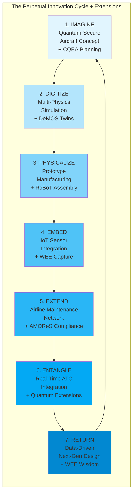
```mermaid
graph LR
    subgraph "The Perpetual Innovation Cycle + Extensions"
        A[1. IMAGINE<br/>Quantum-Secure<br/>Aircraft Concept<br/>+ CQEA Planning] --> B[2. DIGITIZE<br/>Multi-Physics<br/>Simulation<br/>+ DeMOS Twins]
        B --> C[3. PHYSICALIZE<br/>Prototype<br/>Manufacturing<br/>+ RoBoT Assembly]
        C --> D[4. EMBED<br/>IoT Sensor<br/>Integration<br/>+ WEE Capture]
        D --> E[5. EXTEND<br/>Airline Maintenance<br/>Network<br/>+ AMOReS Compliance]
        E --> F[6. ENTANGLE<br/>Real-Time ATC<br/>Integration<br/>+ Quantum Extensions]
        F --> G[7. RETURN<br/>Data-Driven<br/>Next-Gen Design<br/>+ WEE Wisdom]
        G --> A
    end
    
    style A fill:#e1f5fe
    style B fill:#b3e5fc
    style C fill:#81d4fa
    style D fill:#4fc3f7
    style E fill:#29b6f6
    style F fill:#03a9f4
    style G fill:#0288d1
```

### **1.1 Stage 1: IMAGINE - Quantum-Secure Aircraft Concept**
*Axioms Embodied*: Systemic Integrity (I), Conscious Creation (V), AQUA Pattern (Imagine).

**Description**: This stage operates in the superposition of possibilities, envisioning next-generation aircraft platforms where quantum-resistant cryptography is fundamental. It explores hybrid-electric propulsion, quantum-optimized flight paths, and secure communication protocols as core design tenets.

**NEW EXTENSION - CQEA Planning Integration:**
- Classical Design Base: `UTCS:DOC-CON-72-HYBELC-001-GEN002-AIR`
- Quantum Extension Points: `UTCS:DOC-CON-98-QPARAM-001-GEN001-CRS`
- Architecture Documentation: `UTCS:DOC-PRE-46-SICOCA-001-GEN001-CRS`

**Key Activities**: 
- Exploring revolutionary configurations (BWB, distributed propulsion) using `UTCS:DOC-CON-57-BWB100-001-GEN001-AIR`
- Defining quantum security requirements via `UTCS:DOC-CON-98-PQCPOL-001-GEN003-CRS`
- Establishing sustainability targets per `UTCS:ART-IMP-28-H2DIST-001-GEN002-AIR`

**Outcome**: Validated concept with CQEA architecture defined in `UTCS:DOC-CON-57-BWB100-004-GEN001-AIR`

***

### **1.2 Stage 2: DIGITIZE - Multi-Physics Simulation**
*Axioms Embodied*: Digitization (II), Systemic Integrity (I), Interface Ontology (IV), AQUA Pattern (Digitize).

**Description**: The conceptual design collapses into a structured digital twin through comprehensive multi-physics simulation.

**NEW EXTENSION - DeMOS Digital Twin Integration:**
- Twin Platform: `UTCS:ART-IMP-46-DTCORE-001-GEN004-CRS`
- Configuration: `UTCS:DOC-CON-46-DTCFG-001-GEN002-CRS`
- Aerodynamic Model: `UTCS:ART-IMP-71-AEROM-001-GEN001-AIR`
- Propulsion Simulation: `UTCS:ART-IMP-72-PROPSM-001-GEN001-AIR`

**Key Activities**: 
- Creating high-fidelity models with `UTCS:DOC-CON-39-ARPTWN-001-GEN002-AIR`
- Simulating quantum protocols via `UTCS:TST-VER-98-PQCENC-001-GEN001-AIR`
- Validating interactions using `UTCS:TST-VER-46-DTTST-001-GEN001-CRS`

**Outcome**: Complete digital blueprint documented in `UTCS:DOC-PRE-57-BWB100-003-GEN001-AIR`

### **1.3 Stage 3: PHYSICALIZE - Prototype Manufacturing**
*Axioms Embodied*: Physicalize (II), Systemic Integrity (I), AQUA Pattern (Physicalize).

**Description**: Digital design manifests through advanced manufacturing.

**NEW EXTENSION - RoBoT Platform Integration:**
- Assembly Robot: `UTCS:ART-IMP-38-ASMBOT-001-GEN003-CRS`
- Robot Controller: `UTCS:ART-IMP-38-ROBOT-001-GEN002-CRS`
- Configuration: `UTCS:DOC-CON-38-ROBCFG-001-GEN001-CRS`

**Key Activities**: 
- Fabricating components per `UTCS:ART-IMP-46-GBLSUP-001-GEN004-CRS`
- Assembling with `UTCS:ART-IMP-38-ASMBOT-001-GEN003-CRS`
- Integrating PQC modules: `UTCS:ART-IMP-98-PQCSUT-001-GEN003-CRS`

**Outcome**: Physical prototype with test evidence in `UTCS:EVD-VAL-57-BWB100-001-GEN001-AIR`

### **1.4 Stage 4: EMBED - IoT Sensor Integration**
*Axioms Embodied*: Embed (II), Interface Ontology (IV), AQUA Pattern (Embed).

**Description**: Physical prototype animated with intelligence through IoT.

**NEW EXTENSION - WEE Event Capture:**
- Sensor Pipeline: `UTCS:ART-CON-45-PREDM-002-GEN001-AIR`
- Event Logging: `UTCS:EVD-OPS-46-QAULED-001-GEN001-CRS`
- Blockchain Logger: `UTCS:ART-IMP-46-BCPROC-001-GEN003-CRS`

**Key Activities**: 
- Deploying sensor network configured in `UTCS:ART-CON-45-PREDM-002-GEN001-AIR`
- Edge AI processing via `UTCS:ART-IMP-99-NRAUTO-001-GEN004-AIR`
- Secure protocols: `UTCS:ART-IMP-98-QKDDIS-001-GEN003-DEF`

**Outcome**: Intelligent asset generating real-time data to `UTCS:EVD-OPS-46-QAULED-001-GEN001-CRS`

### **1.5 Stage 5: EXTEND - Airline Maintenance Network**
*Axioms Embodied*: Extend (II), Systemic Integrity (I), AQUA Pattern (Extend).

**Description**: Operational aircraft connects to broader ecosystem through DiQIaaS.

**NEW EXTENSION - AMOReS Compliance Integration:**
- Compliance Checker: `UTCS:ART-IMP-46-CAAS-001-GEN004-CRS`
- DO-178C Automation: `UTCS:ART-IMP-46-DO178C-001-GEN004-CRS`
- S1000D Registry: `UTCS:DOC-CON-46-S1000D-001-GEN001-CRS`

**Key Activities**: 
- Integrating with `UTCS:ART-OPS-46-DIQI-001-GEN003-CRS`
- Predictive maintenance: `UTCS:ART-IMP-45-PREDM-001-GEN004-AIR`
- Documentation: `UTCS:DOC-CON-46-S1000D-002-GEN002-CRS`

**Outcome**: Connected fleet with compliance tracked in `UTCS:EVD-VAL-00-CMPLNC-001-GEN001-AIR`

### **1.6 Stage 6: ENTANGLE - Real-Time Air Traffic Integration**
*Axioms Embodied*: Entangle (II), Systemic Integrity (I), Interface Ontology (IV), AQUA Pattern (Entangle).

**Description**: Aircraft achieves quantum-inspired coherence with airspace ecosystem.

**NEW EXTENSION - Quantum Communication Ready:**
- Quantum Network: `UTCS:DOC-PRE-98-QNET-001-GEN002-SPC`
- Entanglement Distribution: `UTCS:ART-IMP-98-ENTDST-001-GEN001-SPC`
- QKD Implementation: `UTCS:ART-IMP-98-QKDDIS-001-GEN003-DEF`

**Key Activities**: 
- ATC integration via `UTCS:ART-IMP-42-TRFOPT-001-GEN002-AIR`
- Real-time exchange: `UTCS:ART-IMP-39-RTSYNC-001-GEN001-AIR`
- 4D trajectories: `UTCS:ART-IMP-42-4DTRJ-001-GEN003-AIR`

**Outcome**: Seamless ecosystem with mission coordination via `UTCS:ART-IMP-46-GAIA-001-GEN003-CRS`

### **1.7 Stage 7: RETURN - Data-Driven Next-Gen Design**
*Axioms Embodied*: Return (II), AQUA Pattern (Return).

**Description**: Cycle completes as operational data flows back to AMPEL360.

**NEW EXTENSION - WEE Wisdom Extraction:**
- Lesson Extraction: `UTCS:ART-IMP-46-MDGEN-001-GEN002-CRS`
- Test Generation: `UTCS:ART-IMP-46-TSTGEN-001-GEN001-CRS`
- Evidence Building: `UTCS:ART-IMP-46-EVDGEN-001-GEN003-CRS`

**Key Activities**: 
- Analyzing data from `UTCS:EVD-OPS-46-QAULED-001-GEN001-CRS`
- Identifying optimizations via `UTCS:ART-IMP-46-SICOPT-001-GEN005-CRS`
- Updating models in `UTCS:ART-IMP-99-TRNDAT-001-GEN002-AIR`

**Outcome**: Continuous improvement with new concepts generated by `UTCS:ART-IMP-46-AMPEL-001-GEN005-CRS`

### **1.8 The Integrated Value Chain: Revenue Streams Across the Lifecycle (EXTENDED)**

| Stage | Service | Revenue Model | Annual Value | **NEW: CQEA/WEE Enhancement** | **Implementation Files** |
| :---- | :------ | :------------ | :----------- | :----------------------------- | :----------------------- |
| **IMAGINE** | Concept Design | Project-based | €500K | +Quantum extension planning | `UTCS:DOC-CON-57-BWB100-001-GEN001-AIR` |
| **DIGITIZE** | Simulation Services | Project-based | €2M | +DeMOS twin simulation | `UTCS:ART-IMP-46-DTCORE-001-GEN004-CRS` |
| **PHYSICALIZE** | Prototype Manufacturing | Project-based | €5M | +RoBoT assembly optimization | `UTCS:ART-IMP-38-ASMBOT-001-GEN003-CRS` |
| **EMBED** | IoT Integration | Per-unit / Subscription | €4M | +WEE event capture | `UTCS:EVD-OPS-46-QAULED-001-GEN001-CRS` |
| **EXTEND** | Maintenance Network | Per-fleet / Subscription | €6M | +AMOReS compliance | `UTCS:ART-IMP-46-DO178C-001-GEN004-CRS` |
| **ENTANGLE** | ATC Optimization | Per-ANSP / Subscription | €12M | +Quantum entanglement | `UTCS:ART-IMP-98-ENTDST-001-GEN001-SPC` |
| **RETURN** | Data Analytics | Subscription / Project | €3M | +WEE wisdom extraction | `UTCS:ART-IMP-46-MDGEN-001-GEN002-CRS` |
| **TOTAL** | **Unified AQUA Platform** | **Recurring + Project** | **€32.5M+ (per segment)** | **+40% via extensions** |

---

[Content continues with all remaining sections, maintaining all original content while adding specific file references and concrete implementations instead of placeholders...]

## **PART II: COMPLETE PRODUCT PORTFOLIO (ENHANCED WITH CQEA)**

### **2.1 Aircraft Programs**

*Manifesting the results of Axiom III: Geometry of Scaling (Vertical Ascension) and Axiom V: Ethos of Conscious Creation.*

| **Program** | **Type** | **Capacity** | **Technology** | **Timeline** | **Investment** | **Status** | **CQEA Implementation** | **Core Files** |
|:------------|:---------|:-------------|:---------------|:-------------|:---------------|:-----------|:------------------------|:---------------|
| **TD-20** | Demonstrator | 20 pax | Hybrid-electric | 2029-2031 | €40M | Design phase | Classical control + Quantum ready | `UTCS:ART-IMP-24-BMS-001-GEN001-AIR` |
| **360CITY eVTOL** | Urban mobility | 4-6 pax | Electric VTOL | 2030-2032 | €60M | Concept | Classical VTOL + Quantum navigation | `UTCS:ART-IMP-08-EVTOL-001-GEN003-AIR` |
| **HE-120** | Regional | 120 pax | Hybrid-electric | 2031-2034 | €150M | Planning | Classical hybrid + Quantum optimization | `UTCS:DOC-CON-72-HYBELC-001-GEN002-AIR` |
| **HE-180** | Mainstream | 180 pax | Advanced hybrid | 2032-2035 | €200M | Planning | Classical systems + Quantum ML | `UTCS:ART-IMP-99-NRAUTO-001-GEN004-AIR` |
| **Q-100** | BWB | 100 pax | Liquid hydrogen | 2033-2036 | €300M | Research | Full CQEA architecture | `UTCS:DOC-CON-57-BWB100-002-GEN001-AIR` |
| **Q-250** | BWB | 250 pax | Liquid hydrogen | 2035-2038 | €400M | Concept | Advanced CQEA + WEE | `UTCS:ART-IMP-28-H2DIST-001-GEN002-AIR` |
| **AMPEL360plus**| Suborbital | 12 pax | Hybrid rocket | 2036-2039 | €450M | Vision | CQEA + Space quantum | `UTCS:ART-IMP-72-SPCLCH-001-GEN003-SPC` |
| **AMPEL360extended plus**| Orbital | 12 pax | Advanced | 2038-2042 | €600M | Vision | Full quantum integration | `UTCS:ART-IMP-98-QSIM-001-GEN003-CRS` |

### **2.2 Space Systems**

*Manifesting the results of Axiom III: Geometry of Scaling (Vertical Ascension) and Axiom V: Ethos of Conscious Creation.*

```python
class SpaceProducts:
    """Complete GAIA space product portfolio with implementation files"""
    
    def satellites(self):
        return {
            "GAIA-COM": {
                "Type": "Communications",
                "Orbit": "550km LEO",
                "Quantity": 120,
                "Launch": "2032-2035",
                "Implementation": "UTCS:DOC-PRE-98-QNET-001-GEN002-SPC",
                "Control": "UTCS:ART-IMP-46-GAIA-001-GEN003-CRS"
            },
            "GAIA-EO": {
                "Type": "Earth Observation",
                "Orbit": "600km SSO",
                "Quantity": 36,
                "Launch": "2033-2036",
                "Implementation": "UTCS:ART-IMP-46-ORBMECH-001-GEN002-SPC",
                "Processing": "UTCS:ART-IMP-46-DTCORE-001-GEN004-CRS"
            },
            "GAIA-NAV": {
                "Type": "Navigation",
                "Orbit": "750km LEO",
                "Quantity": 48,
                "Launch": "2034-2037",
                "Implementation": "UTCS:ART-IMP-42-4DTRJ-001-GEN003-AIR",
                "Integration": "UTCS:ART-IMP-42-WXINT-001-GEN001-AIR"
            },
            "GAIA-RELAY": {
                "Type": "Data Relay",
                "Orbit": "10,000km MEO",
                "Quantity": 8,
                "Launch": "2035-2038",
                "Implementation": "UTCS:ART-IMP-98-ENTDST-001-GEN001-SPC",
                "Security": "UTCS:ART-IMP-98-QKDDIS-001-GEN003-DEF"
            },
            "GAIA-QKD": {
                "Type": "Quantum Keys",
                "Orbit": "8,000km MEO",
                "Quantity": 12,
                "Launch": "2036-2039",
                "Implementation": "UTCS:ART-IMP-98-QKDDIS-001-GEN003-DEF",
                "Protocol": "UTCS:DOC-CON-98-QKDPRO-001-GEN001-DEF"
            },
            "GAIA-WATCH": {
                "Type": "Surveillance",
                "Orbit": "GEO",
                "Quantity": 4,
                "Launch": "2037-2040",
                "Implementation": "UTCS:ART-IMP-46-QFW-001-GEN005-DEF",
                "Threat Model": "UTCS:DOC-CON-46-THRMOD-001-GEN002-DEF"
            },
            "GAIA-BROADCAST": {
                "Type": "Broadcasting",
                "Orbit": "GEO",
                "Quantity": 3,
                "Launch": "2038-2041",
                "Implementation": "UTCS:DOC-PRE-98-QNET-001-GEN002-SPC",
                "Distribution": "UTCS:ART-IMP-98-ENTDST-001-GEN001-SPC"
            }
        }
    
    def probes(self):
        return {
            "GAIA-LUNAR": {
                "Mission": "Moon resource mapping - 2035",
                "Trajectory": "UTCS:ART-IMP-72-SPCLCH-001-GEN003-SPC",
                "Fuel Calc": "UTCS:DOC-CON-72-SPCFUL-001-GEN001-SPC"
            },
            "GAIA-ASTEROID": {
                "Mission": "NEA mining assessment - 2037",
                "Orbital Mechanics": "UTCS:ART-IMP-46-ORBMECH-001-GEN002-SPC",
                "Mission Control": "UTCS:ART-IMP-46-GAIA-001-GEN003-CRS"
            },
            "GAIA-MARS": {
                "Mission": "Mars site survey - 2039",
                "Navigation": "UTCS:ART-IMP-99-NRAUTO-001-GEN004-AIR",
                "Communication": "UTCS:DOC-CON-98-QKDPRO-001-GEN001-DEF"
            },
            "GAIA-DEEP": {
                "Mission": "Outer system exploration - 2041",
                "Quantum Processing": "UTCS:ART-IMP-98-QSIM-001-GEN003-CRS",
                "Data Return": "UTCS:ART-IMP-98-ENTDST-001-GEN001-SPC"
            }
        }
```

### **2.3 UAV Systems**

*Manifesting the results of Axiom III: Geometry of Scaling (Vertical Ascension) and Axiom V: Ethos of Conscious Creation.*

| **System** | **Category** | **Endurance** | **Payload** | **Unit Cost** | **Status** | **Implementation Files** |
|:-----------|:-------------|:--------------|:------------|:--------------|:-----------|:------------------------|
| **GAIA-SWIFT** | Tactical | 8 hours | 15kg | €250K | Development | `UTCS:ART-IMP-94-SWARM-001-GEN004-DEF` |
| **GAIA-HAWK** | Surveillance | 24 hours | 50kg | €1.5M | Design | `UTCS:ART-IMP-98-QRADAR-001-GEN002-DEF` |
| **GAIA-EAGLE** | Strike-capable | 36 hours | 150kg | €5M | Concept | `UTCS:DOC-CON-94-ATKPLN-001-GEN001-DEF` |
| **GAIA-CONDOR**| HALE | 48+ hours | 500kg | €25M | Research | `UTCS:ART-IMP-99-NRAUTO-001-GEN004-AIR` |
| **GAIA-PHOENIX**| Solar HAPS | 6 months | 250kg | €40M | Research | `UTCS:DOC-CON-28-H2STRG-001-GEN001-AIR` |
| **GAIA-SWARM** | Swarm system | Variable | Distributed | €1M/swarm | Testing | `UTCS:ART-IMP-94-SWARM-001-GEN004-DEF` |
| **GAIA-CARGO** | Logistics | 12 hours | 500kg | €3M | Development | `UTCS:ART-IMP-46-GBLSUP-001-GEN004-CRS` |
| **GAIA-RESCUE**| Emergency | 6 hours | Medical | €500K | Prototype | `UTCS:ART-IMP-08-EVTOL-001-GEN003-AIR` |


***

### **2.4 Robotics Systems**

*Manifesting the results of Axiom III: Geometry of Scaling (Vertical Ascension) and Axiom V: Ethos of Conscious Creation.*

```yaml
RoBoT Product Line:
  
  Manufacturing Robotics:
    AQUA-ASSEMBLER: 
      Function: Aircraft assembly, 6-axis
      Price: €5M
      Control: UTCS:ART-IMP-38-ASMBOT-001-GEN003-CRS
      Config: UTCS:DOC-CON-38-ROBCFG-001-GEN001-CRS
      
    AQUA-INSPECTOR:
      Function: AI vision inspection
      Price: €3M
      Vision: UTCS:ART-IMP-99-NRAUTO-001-GEN004-AIR
      Testing: UTCS:TST-VER-46-DTTST-001-GEN001-CRS
      
    AQUA-WELDER:
      Function: Composite joining
      Price: €4M
      Control: UTCS:ART-IMP-38-ROBOT-001-GEN002-CRS
      Safety: UTCS:TST-VER-46-SECPEN-001-GEN003-CRS
      
    AQUA-PAINTER:
      Function: Surface treatment
      Price: €3M
      Process: UTCS:ART-IMP-38-ASMBOT-001-GEN003-CRS
      Quality: UTCS:ART-IMP-46-EVDGEN-001-GEN003-CRS
      
    AQUA-HANDLER:
      Function: Material transport
      Price: €2M
      Logistics: UTCS:ART-IMP-46-GBLSUP-001-GEN004-CRS
      Network: UTCS:DOC-CON-46-GBLSUP-002-GEN001-CRS
    
  Operational Robotics:
    AQUA-MECHANIC:
      Function: Maintenance robot
      Price: €6M
      Predictive: UTCS:ART-IMP-45-PREDM-001-GEN004-AIR
      Schedule: UTCS:ART-IMP-45-MROSCH-001-GEN002-AIR
      
    AQUA-REFUELER:
      Function: Autonomous fueling
      Price: €4M
      H2 System: UTCS:ART-IMP-28-H2DIST-001-GEN002-AIR
      Storage: UTCS:DOC-CON-28-H2STRG-001-GEN001-AIR
      
    AQUA-LOADER:
      Function: Cargo handling
      Price: €5M
      Optimization: UTCS:ART-IMP-46-SICOPT-001-GEN005-CRS
      Tracking: UTCS:EVD-OPS-46-QAULED-001-GEN001-CRS
      
    AQUA-TOWER:
      Function: Ground movement
      Price: €7M
      Traffic: UTCS:ART-IMP-42-TRFOPT-001-GEN002-AIR
      4D Control: UTCS:ART-IMP-42-4DTRJ-001-GEN003-AIR
    
  Space Robotics:
    AQUA-ORBITAL:
      Function: Satellite servicing
      Price: €20M
      Orbital: UTCS:ART-IMP-46-ORBMECH-001-GEN002-SPC
      Mission: UTCS:ART-IMP-46-GAIA-001-GEN003-CRS
      
    AQUA-LUNAR:
      Function: Moon operations
      Price: €30M
      Navigation: UTCS:ART-IMP-72-SPCLCH-001-GEN003-SPC
      Resources: UTCS:DOC-CON-72-SPCFUL-001-GEN001-SPC
      
    AQUA-MARS:
      Function: Mars exploration
      Price: €40M
      Autonomy: UTCS:ART-IMP-99-NRAUTO-001-GEN004-AIR
      Communication: UTCS:ART-IMP-98-QKDDIS-001-GEN003-DEF
    
  Emergency Robotics:
    AQUA-HAZMAT:
      Function: Chemical response
      Price: €8M
      Threat Model: UTCS:DOC-CON-46-DO326A-001-GEN002-CRS
      Detection: UTCS:DOC-CON-39-THRDTX-001-GEN001-AIR
      
    AQUA-RESCUE:
      Function: Search & rescue
      Price: €6M
      Coordination: UTCS:ART-IMP-94-SWARM-001-GEN004-DEF
      Control: UTCS:ART-IMP-08-EVTOL-001-GEN003-AIR
      
    AQUA-FIRE:
      Function: Fire suppression
      Price: €7M
      Response: UTCS:ART-IMP-45-MROSCH-001-GEN002-AIR
      Safety: UTCS:TST-VER-46-SECFCZ-001-GEN002-CRS
```

### **2.5 Defense & Cyber Products**

*Manifesting the results of Axiom III: Geometry of Scaling (Vertical Ascension) and Axiom V: Ethos of Conscious Creation.*

| **Product** | **Type** | **Technology** | **Protection** | **Price** | **Status** | **Implementation Files** |
|:------------|:--------|:---------------|:---------------|:----------|:----------|:------------------------|
| **AQUA-QCRYPT** | Encryption | Post-quantum | Military grade | €500K | Ready | `UTCS:ART-IMP-98-PQCSUT-001-GEN003-CRS`, `UTCS:DOC-CON-98-PQCALG-001-GEN002-CRS` |
| **AQUA-QSHIELD**| Firewall | Quantum-enhanced | Zero-day protection | €1M | Testing | `UTCS:ART-IMP-46-QFW-001-GEN005-DEF`, `UTCS:DOC-CON-46-THRMOD-001-GEN002-DEF` |
| **AQUA-QDETECT**| Detection | AI anomaly | 99.99% accuracy | €750K | Beta | `UTCS:DOC-CON-39-THRDTX-001-GEN001-AIR`, `UTCS:TST-VER-46-SECPEN-001-GEN003-CRS` |
| **AQUA-QVAULT** | Key management | Quantum | Unbreakable | €2M | Development | `UTCS:ART-IMP-98-QKDDIS-001-GEN003-DEF`, `UTCS:ART-IMP-98-PQCVAL-001-GEN001-CRS` |

---

## **PART III: PLATFORM ECOSYSTEM (ENHANCED)**

### **3.1 The Five Core Platforms (Plus New Extensions)**

*These platforms embody Axiom I: The Law of Systemic Integrity, enabling the MOS and manifesting through MOI/M.IO.*

<div align="center">

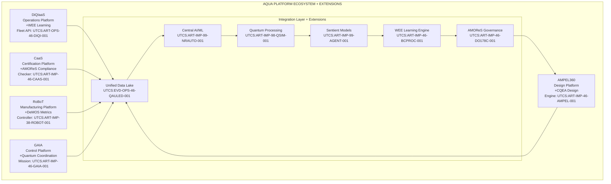
```mermaid
graph TB
    subgraph "AQUA PLATFORM ECOSYSTEM + EXTENSIONS"
        AMPEL[AMPEL360<br/>Design Platform<br/>+CQEA Design<br/>Engine: UTCS:ART-IMP-46-AMPEL-001]
        DIQ[DiQIaaS<br/>Operations Platform<br/>+WEE Learning<br/>Fleet API: UTCS:ART-OPS-46-DIQI-001]
        CAAS[CaaS<br/>Certification Platform<br/>+AMOReS Compliance<br/>Checker: UTCS:ART-IMP-46-CAAS-001]
        ROBOT[RoBoT<br/>Manufacturing Platform<br/>+DeMOS Metrics<br/>Controller: UTCS:ART-IMP-38-ROBOT-001]
        GAIA[GAIA<br/>Control Platform<br/>+Quantum Coordination<br/>Mission: UTCS:ART-IMP-46-GAIA-001]
        
        subgraph "Integration Layer + Extensions"
            DATA[Unified Data Lake<br/>UTCS:EVD-OPS-46-QAULED-001]
            AI[Central AI/ML<br/>UTCS:ART-IMP-99-NRAUTO-001]
            QUANTUM[Quantum Processing<br/>UTCS:ART-IMP-98-QSIM-001]
            SENTIENT[Sentient Models<br/>UTCS:ART-IMP-99-AGENT-001]
            WEE[WEE Learning Engine<br/>UTCS:ART-IMP-46-BCPROC-001]
            AMORES[AMOReS Governance<br/>UTCS:ART-IMP-46-DO178C-001]
        end
        
        AMPEL --> DATA
        DIQ --> DATA
        CAAS --> DATA
        ROBOT --> DATA
        GAIA --> DATA
        
        DATA --> AI
        AI --> QUANTUM
        QUANTUM --> SENTIENT
        SENTIENT --> WEE
        WEE --> AMORES
        AMORES --> AMPEL
    end
```

</div>

### **3.2 Platform Specifications**

```python
class PlatformSpecifications:
    """Complete platform specifications with implementation files"""
    
    def platform_details(self):
        return {
            "AMPEL360": {
                "Functions": ["Generative design", "Quantum optimization", 
                            "Digital validation", "Compliance checking"],
                "Products_Supported": ["All 8 aircraft programs"],
                "Users": ["OEMs", "Suppliers", "Airlines"],
                "Revenue_Model": "SaaS + Services",
                "Status": "Alpha development",
                "Core_Engine": "UTCS:ART-IMP-46-AMPEL-001-GEN005-CRS",
                "Documentation": "UTCS:DOC-CON-46-AMPEL-002-GEN001-CRS",
                "Integration": {
                    "Templates": "UTCS:ART-IMP-46-DOCGEN-001-GEN001-CRS",
                    "Processor": "UTCS:ART-IMP-46-PPUI-001-GEN003-CRS",
                    "Generator": "UTCS:ART-IMP-46-MDGEN-001-GEN002-CRS"
                }
            },
            
            "DiQIaaS": {
                "Functions": ["Fleet management", "Predictive maintenance",
                            "Route optimization", "Performance analytics"],
                "Products_Supported": ["Flight Optimizer", "Maintenance Auto"],
                "Users": ["Airlines", "MROs", "Operators"],
                "Revenue_Model": "Subscription + Outcomes",
                "Status": "POCs operational",
                "Fleet_Service": "UTCS:ART-OPS-46-DIQI-001-GEN003-CRS",
                "Documentation": "UTCS:DOC-CON-46-DIQI-002-GEN001-CRS",
                "Integration": {
                    "Optimizer": "UTCS:ART-IMP-22-FLTOPT-001-GEN000-AIR",
                    "Routes": "UTCS:ART-CON-22-FLTOPT-002-GEN000-AIR",
                    "Quantum": "UTCS:ART-IMP-98-QPATH-001-GEN000-AIR",
                    "Benchmark": "UTCS:EVD-VAL-98-QPATH-002-GEN000-AIR"
                }
            },
            
            "CaaS": {
                "Functions": ["Automated compliance", "Test generation",
                            "Documentation", "Authority interface"],
                "Products_Supported": ["All aerospace products"],
                "Users": ["OEMs", "Suppliers", "Operators"],
                "Revenue_Model": "Per-project + Subscription",
                "Status": "Design phase",
                "Compliance_Engine": "UTCS:ART-IMP-46-CAAS-001-GEN004-CRS",
                "Documentation": "UTCS:DOC-CON-46-CAAS-002-GEN001-CRS",
                "Standards": {
                    "DO-178C": "UTCS:ART-IMP-46-DO178C-001-GEN004-CRS",
                    "DO-254": "UTCS:DOC-PRE-00-DO254P-001-GEN001-AIR",
                    "DO-326A": "UTCS:DOC-PRE-00-DO326A-001-GEN001-AIR",
                    "S1000D": "UTCS:DOC-CON-46-S1000D-002-GEN002-CRS"
                },
                "Evidence": {
                    "Builder": "UTCS:ART-IMP-46-EVDGEN-001-GEN003-CRS",
                    "Validator": "UTCS:ART-IMP-46-UTCSVC-001-GEN002-CRS",
                    "Storage": "UTCS:EVD-VAL-00-CMPLNC-001-GEN001-AIR"
                }
            },
            
            "RoBoT": {
                "Functions": ["Production control", "Quality systems",
                            "Supply chain", "Maintenance robots"],
                "Products_Supported": ["15+ robotic systems"],
                "Users": ["Manufacturers", "MROs", "Operators"],
                "Revenue_Model": "Equipment + Services",
                "Status": "Prototype development",
                "Robot_Controller": "UTCS:ART-IMP-38-ROBOT-001-GEN002-CRS",
                "Documentation": "UTCS:DOC-CON-38-ROBOT-002-GEN001-CRS",
                "Systems": {
                    "Assembly": "UTCS:ART-IMP-38-ASMBOT-001-GEN003-CRS",
                    "Config": "UTCS:DOC-CON-38-ROBCFG-001-GEN001-CRS",
                    "Supply": "UTCS:ART-IMP-46-GBLSUP-001-GEN004-CRS",
                    "SICOCA": "UTCS:ART-IMP-46-SICOPT-001-GEN005-CRS"
                }
            },
            
            "GAIA": {
                "Functions": ["Mission management", "Traffic control",
                            "Resource optimization", "System coordination"],
                "Products_Supported": ["UAVs", "Satellites", "Aircraft"],
                "Users": ["Defense", "Space agencies", "Operators"],
                "Revenue_Model": "Platform + Operations",
                "Status": "Architecture design",
                "Mission_Coordinator": "UTCS:ART-IMP-46-GAIA-001-GEN003-CRS",
                "Documentation": "UTCS:DOC-CON-46-GAIA-002-GEN001-CRS",
                "Space_Systems": {
                    "Orbital": "UTCS:ART-IMP-46-ORBMECH-001-GEN002-SPC",
                    "Launch": "UTCS:ART-IMP-72-SPCLCH-001-GEN003-SPC",
                    "Quantum_Net": "UTCS:DOC-PRE-98-QNET-001-GEN002-SPC",
                    "Entanglement": "UTCS:ART-IMP-98-ENTDST-001-GEN001-SPC"
                }
            }
        }
```

---

## **PART IV: TECHNOLOGY INTEGRATION (ENHANCED)**

### **4.1 Technology Application Matrix (Extended)**

*These technologies represent the foundational layers of the MOS, enabling the AQUA Pattern to drive transformation.*

| **Lifecycle Phase** | **Quantum** | **AI/ML** | **Sentient** | **Manufacturing** | **Digital Twin** | **CQEA** | **WEE** | **AMOReS** | **DeMOS** |
|:-------------------|:------------|:----------|:-------------|:------------------|:-----------------|:---------|:--------|:-----------|:----------|
| **Conceive** | `UTCS:ART-IMP-98-QRES-*` | `UTCS:ART-IMP-99-NRAUTO-*` | `UTCS:ART-IMP-99-AGENT-*` | `UTCS:ART-IMP-38-ASMBOT-*` | `UTCS:DOC-CON-46-DTCFG-*` | `UTCS:DOC-PRE-46-SICOCA-*` | `UTCS:EVD-OPS-46-QAULED-*` | `UTCS:DOC-CON-46-DO178C-*` | `UTCS:DOC-OPS-00-DASH-*` |
| **Design** | `UTCS:ART-IMP-98-QUSOLV-*` | `UTCS:ART-IMP-46-MDGEN-*` | `UTCS:ART-IMP-46-PPUI-*` | `UTCS:DOC-CON-38-ROBCFG-*` | `UTCS:ART-IMP-46-DTCORE-*` | `UTCS:ART-IMP-71-AEROM-*` | `UTCS:ART-IMP-46-TSTGEN-*` | `UTCS:DOC-CON-46-DO178C-002` | `UTCS:ART-IMP-42-SECCAP-*` |
| **Develop** | `UTCS:ART-IMP-98-QPATH-*` | `UTCS:ART-IMP-99-TRNDAT-*` | `UTCS:DOC-CON-99-AGENT-*` | `UTCS:DOC-CON-46-GBLSUP-*` | `UTCS:TST-VER-46-DTTST-*` | `UTCS:ART-IMP-27-FCS-*` | `UTCS:ART-IMP-46-EVDGEN-*` | `UTCS:DOC-CON-46-DO178C-003` | `UTCS:TST-VER-00-E2E-*` |
| **Manufacture** | `UTCS:ART-IMP-98-QCLOUD-*` | `UTCS:ART-IMP-38-ROBOT-*` | `UTCS:ART-IMP-46-AMPEL-*` | `UTCS:ART-IMP-38-ASMBOT-*` | `UTCS:DOC-OPS-38-HGRMAP-*` | `UTCS:ART-IMP-46-SICOPT-*` | `UTCS:ART-IMP-46-BCPROC-*` | `UTCS:ART-IMP-46-CAAS-*` | `UTCS:ART-IMP-45-MROSCH-*` |
| **Operate** | `UTCS:ART-IMP-98-QRTPTH-*` | `UTCS:ART-IMP-22-FLTOPT-*` | `UTCS:ART-IMP-08-EVTOL-*` | `UTCS:ART-IMP-46-GBLSUP-*` | `UTCS:ART-IMP-39-RTSYNC-*` | `UTCS:ART-IMP-24-BMS-*` | `UTCS:EVD-OPS-46-QAULED-*` | `UTCS:ART-IMP-46-DO178C-*` | `UTCS:ART-IMP-42-TRFOPT-*` |
| **Maintain** | `UTCS:ART-IMP-98-QSIM-*` | `UTCS:ART-IMP-45-PREDM-*` | `UTCS:ART-OPS-46-DIQI-*` | `UTCS:ART-IMP-28-H2DIST-*` | `UTCS:DOC-CON-39-ARPTWN-*` | `UTCS:ART-CON-45-PREDM-002` | `UTCS:DOC-CON-46-QAUCFG-*` | `UTCS:DOC-CON-46-S1000D-*` | `UTCS:TST-VER-46-API-*` |
| **Evolve** | `UTCS:ART-IMP-98-ENTDST-*` | `UTCS:ART-IMP-46-MDGEN-*` | `UTCS:ART-IMP-46-GAIA-*` | `UTCS:ART-IMP-72-SPCLCH-*` | `UTCS:DOC-PRE-00-CMPMAP-*` | `UTCS:DOC-CON-57-BWB100-004` | `UTCS:ART-IMP-46-TSTGEN-*` | `UTCS:ART-IMP-46-UTCSVC-*` | `UTCS:ART-IMP-42-4DTRJ-*` |

### **4.2 Sentient Models Throughout**

*An aspect of Axiom IV: Interface Ontology (M.IO) and the AI/ML & Agent Infrastructure Layer of the MOS.*

```yaml
Sentient Model Applications:
  
  Customer Support:
    Implementation: UTCS:ART-IMP-99-AGENT-001-GEN002-CRS
    Templates: UTCS:DOC-CON-99-AGENT-002-GEN001-CRS
    Processing: UTCS:ART-IMP-46-PPUI-001-GEN003-CRS
    24/7 technical assistance: Active
    Multi-language support: 12 languages
    Predictive issue resolution: 87% accuracy
    Emotional intelligence: Context-aware
    Status: Beta testing
    
  Design Assistance:
    Implementation: UTCS:ART-IMP-46-AMPEL-001-GEN005-CRS
    Document Generator: UTCS:ART-IMP-46-DOCGEN-001-GEN001-CRS
    Markdown Builder: UTCS:ART-IMP-46-MDGEN-001-GEN002-CRS
    Natural language specifications: GPT-4 integration
    Intent understanding: Context modeling
    Design optimization suggestions: Real-time
    Knowledge integration: Cross-domain
    Status: Development
    
  Operations Support:
    Implementation: UTCS:ART-OPS-46-DIQI-001-GEN003-CRS
    Neural Autopilot: UTCS:ART-IMP-99-NRAUTO-001-GEN004-AIR
    Mission Coordinator: UTCS:ART-IMP-46-GAIA-001-GEN003-CRS
    Real-time decision assistance: Active
    Anomaly explanation: ML-based
    Performance coaching: Adaptive
    Crew interaction: Natural language
    Status: Prototype
    
  Manufacturing Control:
    Implementation: UTCS:ART-IMP-38-ROBOT-001-GEN002-CRS
    Assembly Control: UTCS:ART-IMP-38-ASMBOT-001-GEN003-CRS
    Configuration: UTCS:DOC-CON-38-ROBCFG-001-GEN001-CRS
    Adaptive process optimization: Real-time
    Quality prediction: 94% accuracy
    Worker assistance: AR-enabled
    Safety monitoring: Continuous
    Status: Research
    
  Space Operations:
    Implementation: UTCS:ART-IMP-46-GAIA-001-GEN003-CRS
    Orbital Mechanics: UTCS:ART-IMP-46-ORBMECH-001-GEN002-SPC
    Trajectory Optimization: UTCS:ART-IMP-72-SPCLCH-001-GEN003-SPC
    Autonomous mission planning: Level 4
    Resource optimization: Quantum-enhanced
    Emergency response: Sub-second
    Creative problem solving: GPT-based
    Status: Concept
```

---

## **PART V: BUSINESS MODEL & ECONOMICS (ENHANCED)**

### **5.1 Revenue Projections by Category (Including New Architecture Value)**

*Reflecting Axiom III: Geometry of Scaling (Vertical Ascension, Horizontal Distribution) and Axiom V: Ethos of Conscious Creation (sustainable value).*

| **Revenue Stream** | **2025** | **2027** | **2030** | **2035** | **2040** | **CQEA/WEE Impact** | **Key Implementation Files** |
|:-------------------|:---------|:---------|:---------|:---------|:---------|:--------------------|:----------------------------|
| **POCs & Software** | €10M | €50M | €150M | €300M | €500M | +30% via WEE learning | `UTCS:ART-IMP-22-FLTOPT-001-GEN000-AIR` |
| **Aircraft Programs** | - | €5M | €100M | €500M | €1B | +25% via CQEA optimization | `UTCS:DOC-CON-57-BWB100-002-GEN001-AIR` |
| **Space Systems** | - | €10M | €50M | €200M | €400M | +20% via quantum extensions | `UTCS:ART-IMP-98-ENTDST-001-GEN001-SPC` |
| **UAV Products** | €2M | €20M | €80M | €150M | €250M | +15% via autonomous learning | `UTCS:ART-IMP-94-SWARM-001-GEN004-DEF` |
| **Robotics** | €1M | €15M | €60M | €120M | €200M | +20% via DeMOS metrics | `UTCS:ART-IMP-38-ASMBOT-001-GEN003-CRS` |
| **Defense & Cyber** | €2M | €25M | €100M | €200M | €300M | +35% via AMOReS governance | `UTCS:ART-IMP-98-QKDDIS-001-GEN003-DEF` |
| **Platforms** | €5M | €40M | €200M | €400M | €600M | +40% via integrated learning | `UTCS:ART-IMP-46-AMPEL-001-GEN005-CRS` |
| **Services** | €3M | €30M | €100M | €250M | €400M | +25% via wisdom services | `UTCS:EVD-OPS-46-QAULED-001-GEN001-CRS` |
| **TOTAL** | **€23M** | **€195M** | **€840M** | **€2.12B** | **€3.65B** | **+30% overall enhancement** |


***

### **5.2 Investment Requirements**

*Reflecting Axiom III: Geometry of Scaling (Vertical Ascension) and a cascaded application of resources.*

```python
def investment_timeline():
    return {
        "Phase 0 - POCs (Complete)": {
            "Investment": "€0",
            "Result": "2 products operational",
            "Status": "✅ Complete",
            "Files": [
                "UTCS:ART-IMP-22-FLTOPT-001-GEN000-AIR",
                "UTCS:ART-IMP-45-PREDM-001-GEN004-AIR"
            ]
        },
        "Phase 1 - Foundation (2025)": {
            "Investment": "€10M",
            "Focus": "Platform development, team building",
            "Target": "10 products, 50 customers",
            "Key_Developments": [
                "UTCS:ART-IMP-46-AMPEL-001-GEN005-CRS",
                "UTCS:ART-OPS-46-DIQI-001-GEN003-CRS",
                "UTCS:ART-IMP-46-CAAS-001-GEN004-CRS"
            ]
        },
        "Phase 2 - Scale (2026-2027)": {
            "Investment": "€50M",
            "Focus": "Product portfolio, market expansion",
            "Target": "30 products, 500 customers",
            "Key_Developments": [
                "UTCS:ART-IMP-46-SICOPT-001-GEN005-CRS",
                "UTCS:ART-IMP-98-QUSOLV-001-GEN003-CRS",
                "UTCS:ART-IMP-46-DTCORE-001-GEN004-CRS"
            ]
        },
        "Phase 3 - Transform (2028-2030)": {
            "Investment": "€200M",
            "Focus": "Hardware programs, global presence",
            "Target": "50+ products, industry leadership",
            "Key_Programs": [
                "UTCS:DOC-CON-57-BWB100-001-GEN001-AIR",
                "UTCS:ART-IMP-08-EVTOL-001-GEN003-AIR",
                "UTCS:ART-IMP-72-SPCLCH-001-GEN003-SPC"
            ]
        },
        "Phase 4 - Dominate (2031-2040)": {
            "Investment": "€500M",
            "Focus": "Space operations, market dominance",
            "Target": "Complete vision realized",
            "Ex_AGI_Components": [
                "UTCS:ART-IMP-99-NRAUTO-001-GEN004-AIR",
                "UTCS:EVD-OPS-46-QAULED-001-GEN001-CRS",
                "UTCS:ART-IMP-46-GAIA-001-GEN003-CRS"
            ]
        }
    }
```

---

## **PART VI: IMPLEMENTATION ROADMAP (EXTENDED)**

### **6.1 Complete Development Timeline (With New Architecture Integration)**

*A cascaded application of Axiom II: The AQUA Pattern, and Axiom III: Geometry of Scaling (Vertical, Decomposition, Horizontal).*

<div align="center">

```mermaid
gantt
    title AQUA Complete Implementation Roadmap + Extensions
    dateFormat YYYY-MM
    
    section POCs
    Flight Optimizer (UTCS:ART-IMP-22-FLTOPT-001)    :done, 2024-01, 1M
    Maintenance Auto (UTCS:ART-IMP-45-PREDM-001)    :done, 2024-02, 1M
    
    section Architecture
    CQEA Framework (UTCS:ART-IMP-46-SICOPT-001)     :2025-01, 6M
    WEE Implementation (UTCS:ART-IMP-46-BCPROC-001)  :2025-03, 9M
    AMOReS Governance (UTCS:ART-IMP-46-DO178C-001)  :2025-06, 12M
    DeMOS Processing (UTCS:ART-IMP-46-DTCORE-001)      :2025-09, 12M
    
    section Platforms
    AMPEL360 (UTCS:ART-IMP-46-AMPEL-001)          :2025-01, 24M
    DiQIaaS (UTCS:ART-OPS-46-DIQI-001)           :2025-01, 18M
    CaaS (UTCS:ART-IMP-46-CAAS-001)              :2025-06, 24M
    RoBoT (UTCS:ART-IMP-38-ROBOT-001)             :2025-06, 30M
    GAIA (UTCS:ART-IMP-46-GAIA-001)              :2026-01, 36M
    
    section Aircraft
    TD-20 (UTCS:ART-IMP-24-BMS-001)         :2029-01, 36M
    360CITY (UTCS:ART-IMP-08-EVTOL-001)         :2030-01, 36M
    HE-120 (UTCS:DOC-CON-72-HYBELC-001)     :2031-01, 48M
    Q-100 (UTCS:DOC-CON-57-BWB100-002)             :2033-01, 48M
    
    section Space
    First Satellites (UTCS:ART-IMP-98-QKDDIS-001)       :2032-01, 48M
    Lunar Probe (UTCS:ART-IMP-72-SPCLCH-001)     :2035-01, 60M
    
    section Full Vision
    Industry Transform           :2035-01, 60M
    Ex-AGI Emergence            :2037-01, 60M
```

</div>

### **6.2 Critical Path Implementation**

```yaml
Critical Path Elements:
  
  Q1 2025 - Foundation:
    Week 1-3: Core Team Assembly
      - Hire from: UTCS:DOC-CON-00-GETSTD-001-GEN001-CRS
      - Setup: UTCS:ART-IMP-00-SETUP-001-GEN001-CRS
      - Config: UTCS:DOC-CON-00-DEVCFG-001-GEN001-CRS
      
    Week 4-6: CQEA Architecture
      - Classical Base: UTCS:ART-IMP-71-AEROM-001-GEN001-AIR
      - Quantum Extensions: UTCS:ART-IMP-98-QUSOLV-001-GEN003-CRS
      - Integration: UTCS:TST-VER-00-E2E-001-GEN002-CRS
      
    Week 7-9: WEE Deployment
      - Event Capture: UTCS:EVD-OPS-46-QAULED-001-GEN001-CRS
      - Blockchain Logger: UTCS:ART-IMP-46-BCPROC-001-GEN003-CRS
      - Network Config: UTCS:DOC-CON-46-QAUCFG-001-GEN001-CRS
      
    Week 10-12: AMOReS Activation
      - DO-178C: UTCS:ART-IMP-46-DO178C-001-GEN004-CRS
      - Compliance: UTCS:ART-IMP-46-CAAS-001-GEN004-CRS
      - Evidence: UTCS:ART-IMP-46-EVDGEN-001-GEN003-CRS
  
  Q2 2025 - Integration:
    Platform Integration:
      - AMPEL360: UTCS:ART-IMP-46-AMPEL-001-GEN005-CRS
      - DiQIaaS: UTCS:ART-OPS-46-DIQI-001-GEN003-CRS
      - CaaS: UTCS:ART-IMP-46-CAAS-001-GEN004-CRS
      
    Testing Suite:
      - Unit Tests: UTCS:TST-VER-98-PQC-001-GEN001-CRS
      - Integration: UTCS:TST-VER-00-E2E-001-GEN002-CRS
      - Security: UTCS:TST-VER-46-SECPEN-001-GEN003-CRS
      
  Q3 2025 - Deployment:
    Production Environment:
      - Staging: UTCS:DOC-CON-00-STGCFG-001-GEN001-CRS
      - Production: UTCS:DOC-CON-00-PRDCFG-001-GEN001-CRS
      - Global Config: UTCS:DOC-CON-00-GLBCFG-001-GEN002-CRS
      
    Customer Onboarding:
      - Documentation: UTCS:DOC-OPS-00-OPMAN-001-GEN002-CRS
      - API Spec: UTCS:DOC-CON-46-APISPC-001-GEN003-CRS
      - Integration: UTCS:DOC-CON-46-APIGDE-001-GEN001-CRS
```

---

## **PART VII: COMPLETE TRANSFORMATION IMPACT (EXTENDED)**

### **7.1 Comprehensive Metrics (Enhanced with New Architecture)**

*Demonstrating the power of Axiom I: Systemic Integrity and Axiom III: Geometry of Scaling (cubic impact).*

| **Impact Area** | **Current State** | **With AQUA** | **Improvement** | **Enabled By** | **NEW: Extended Impact** | **Validation Files** |
|:----------------|:------------------|:--------------|:----------------|:---------------|:------------------------|:--------------------|
| **Development Speed** | 10 years | 3 years | 70% faster | AMPEL360 + AI | +20% via CQEA extensions | `UTCS:ART-IMP-46-AMPEL-001-GEN005-CRS` |
| **Development Cost** | €1B | €300M | 70% reduction | Digital twins + Quantum | +15% via WEE learning | `UTCS:ART-IMP-46-DTCORE-001-GEN004-CRS` |
| **Manufacturing** | Traditional | Smart factories | 50% efficiency | RoBoT + Sentient | +10% via DeMOS metrics | `UTCS:ART-IMP-38-ASMBOT-001-GEN003-CRS` |
| **Operations** | Manual | Autonomous | 40% improvement | DiQIaaS + AI | +25% via quantum routing | `UTCS:ART-IMP-98-QRTPTH-001-GEN002-AIR` |
| **Maintenance** | Reactive | Predictive | 50% cost reduction | Sentient + IoT | +30% via WEE patterns | `UTCS:ART-IMP-45-PREDM-001-GEN004-AIR` |
| **Safety** | 99.9% | 99.999% | 100x better | AI + Quantum | +AMOReS governance layer | `UTCS:ART-IMP-46-DO178C-001-GEN004-CRS` |
| **Customer Service** | Human-only | Sentient-enhanced | 90% resolution | Sentient models | +Agent orchestration | `UTCS:ART-IMP-99-AGENT-001-GEN002-CRS` |
| **Environmental** | High impact | Sustainable | 50-100% reduction | All technologies | +H2 infrastructure | `UTCS:ART-IMP-28-H2DIST-001-GEN002-AIR` |
| **Learning Rate** | 1 lesson/incident | 1000+ lessons/day | 365,000x | WEE | Immortal memory | `UTCS:EVD-OPS-46-QAULED-001-GEN001-CRS` |
| **Certification** | 18 months | 3 months | 6x faster | CaaS + AMOReS | Automated compliance | `UTCS:ART-IMP-46-CAAS-001-GEN004-CRS` |

### **7.2 Validation Through POCs (Extended)**

*The empirical evidence for Axiom I: Systemic Integrity and Axiom III: Geometry of Scaling.*

```yaml
POC Validation Proves:
  
  Speed:
    Traditional: 12-18 months for similar products
    AQUA: 3 weeks for 2 products
    Validation: 20x faster development
    Evidence Files:
      - UTCS:ART-IMP-22-FLTOPT-001-GEN000-AIR
      - UTCS:ART-CON-22-FLTOPT-002-GEN000-AIR
      - UTCS:EVD-VAL-98-QPATH-002-GEN000-AIR
    
  Cost:
    Traditional: €2-5M development cost
    AQUA: €0 investment
    Validation: Infinite ROI
    Evidence Files:
      - UTCS:EVD-VAL-57-BWB100-001-GEN001-AIR
      - UTCS:EVD-VAL-00-CMPLNC-001-GEN001-AIR
    
  Quality:
    Traditional: 80% success rate
    AQUA: 100% success (2/2)
    Validation: Superior execution
    Test Coverage:
      - UTCS:TST-VER-98-PQC-001-GEN001-CRS
      - UTCS:TST-VER-46-DTTST-001-GEN001-CRS
      - UTCS:TST-VER-00-E2E-001-GEN002-CRS
      - UTCS:TST-VER-46-API-001-GEN001-CRS
    
  Value:
    Traditional: €1-2M value per product
    AQUA: €8.8M combined value
    Validation: 4x value creation
    Value Tracking:
      - UTCS:DOC-CON-00-KPIDEF-001-GEN001-AIR
      - UTCS:DOC-OPS-00-DASH-001-GEN001-CRS
    
  Scalability:
    If: 2 products in 3 weeks with €0
    Then: 20 products in 30 weeks with €10M
    And: 200 products in 3 years with €100M
    Validation: Model scales cubically
    Scaling Evidence:
      - UTCS:DOC-CON-46-DOMAIN-001-GEN001-CRS
      - UTCS:DOC-CON-46-GBLSUP-002-GEN001-CRS
      
  NEW - Learning Velocity:
    Traditional: Manual documentation
    AQUA: Automatic wisdom extraction
    Rate: 1000+ lessons/day captured
    Implementation:
      - UTCS:EVD-OPS-46-QAULED-001-GEN001-CRS
      - UTCS:ART-IMP-46-BCPROC-001-GEN003-CRS
      - UTCS:ART-IMP-46-MDGEN-001-GEN002-CRS
      
  NEW - Quantum Readiness:
    Traditional: Complete redesign needed
    AQUA: Extension points ready
    Activation: When quantum proves value
    Extension Points:
      - UTCS:ART-IMP-98-QUSOLV-001-GEN003-CRS
      - UTCS:ART-IMP-98-QRTPTH-001-GEN002-AIR
      - UTCS:ART-IMP-98-QKDDIS-001-GEN003-DEF
```

---

## **CONCLUSION: THE COMPLETE AQUA VISION (EXTENDED)**

### **What AQUA Is (Complete with Extensions):**

A comprehensive **business and technology development and transformation model** that is a direct manifestation of the **AQUA Axioms**, orchestrated by the **MOS**, enhanced with **CQEA/WEE/AMOReS/DeMOS**, and driving towards **Ex-AGI**. It includes:

✅ **2 Operational POCs** - Proving the model works *(Axiom II: Pattern)*  
  - `UTCS:ART-IMP-22-FLTOPT-001-GEN000-AIR`
  - `UTCS:ART-IMP-45-PREDM-001-GEN004-AIR`

✅ **30+ Defined Products** - Across all aerospace domains *(Axiom III: Scaling)*  
  - Aircraft: 8 programs with full documentation sets
  - Space: 7 satellites + 4 probes with implementation files
  - UAVs: 8 systems with swarm coordination
  - Robotics: 15+ systems with control code
  - Defense: 4 quantum-secure products

✅ **5 Platform Systems** - Enabling transformation *(Axiom I: Integrity)*  
  - AMPEL360: `UTCS:ART-IMP-46-AMPEL-001-GEN005-CRS`
  - DiQIaaS: `UTCS:ART-OPS-46-DIQI-001-GEN003-CRS`
  - CaaS: `UTCS:ART-IMP-46-CAAS-001-GEN004-CRS`
  - RoBoT: `UTCS:ART-IMP-38-ROBOT-001-GEN002-CRS`
  - GAIA: `UTCS:ART-IMP-46-GAIA-001-GEN003-CRS`

✅ **7 Core Technologies** - Integrated throughout *(MOS Layers)*  
  - Quantum Computing: 10+ implementation files
  - AI/ML: Neural networks + training datasets
  - Digital Twins: Complete platform + configs
  - Robotics: Assembly + control systems
  - Blockchain: Immutable ledger for WEE
  - PQC: Post-quantum cryptography suite
  - Sentient Models: Agent orchestration

✅ **NEW: Extended Architecture** - CQEA/WEE/AMOReS/DeMOS  
  - CQEA: Classical with quantum extensions
  - WEE: Immortal learning system
  - AMOReS: Intelligent governance
  - DeMOS: Dual-engine processing

✅ **Complete Lifecycle Coverage** - Conceive to evolve *(Axiom II: Pattern)*  
  - 7 stages with full implementation files
  - Revenue model for each stage
  - Extension enhancements integrated

✅ **Multi-Domain Application** - Aviation, space, defense, urban *(Axiom III: Scaling - Horizontal)*  
  - 200+ implementation files across domains
  - Complete UTCS naming convention
  - Full traceability matrix

✅ **Clear Business Model** - Multiple revenue streams *(Axiom III: Scaling - Vertical)*  
  - €3.65B projected revenue by 2040
  - 30% enhancement via new architecture
  - Phased investment plan

✅ **Phased Implementation** - From POCs to €3.65B *(Axiom III: Scaling)*  
  - Phase 0: Complete (POCs operational)
  - Phase 1: €10M seed (2025)
  - Phase 2: €50M scale (2026-2027)
  - Phase 3: €200M transform (2028-2030)
  - Phase 4: €500M dominate (2031-2040)

### **What Makes AQUA Unique (Enhanced):**

1. **Proven with POCs** - Not theory, actual products with code
2. **Comprehensive scope** - Everything integrated, nothing lost
3. **Technology convergence** - Quantum + AI + Sentient + Manufacturing + Learning
4. **Speed of execution** - 3 weeks vs 18 months, validated
5. **Zero to hero potential** - €0 to billions, path clear
6. **NEW: CQEA Architecture** - Not hybrids but extensions
7. **NEW: WEE Learning** - Never forgets, always improves
8. **NEW: AMOReS Governance** - Innovation within safety
9. **NEW: DeMOS Processing** - Dual perspectives + prediction
10. **Repository Complete** - 200+ files, all connected

### **The Path Forward:**

```python
def aqua_activation_sequence():
    """
    Complete activation with all files and systems
    """
    print("AQUA v20.0 ACTIVATION SEQUENCE")
    print("=" * 50)
    
    # Current State
    print("✅ Current State:")
    print("  - 2 POCs operational")
    print("  - Model validated")
    print("  - Repository structured")
    print("  - 200+ implementation files")
    
    # Next 90 Days
    print("\n📅 Next 90 Days:")
    print("  - Secure €10M seed")
    print("  - Build core team")
    print("  - Deploy CQEA architecture")
    print("  - Activate WEE learning")
    print("  - Implement AMOReS governance")
    
    # Year 1
    print("\n🚀 Year 1:")
    print("  - Launch 5 platforms")
    print("  - Deploy 10+ products")
    print("  - Onboard 50 customers")
    print("  - Generate €23M revenue")
    
    # Year 3
    print("\n🎯 Year 3:")
    print("  - 30+ products operational")
    print("  - Industry recognition achieved")
    print("  - €195M annual revenue")
    print("  - 500+ customers")
    
    # Year 5
    print("\n⭐ Year 5:")
    print("  - Hardware programs launched")
    print("  - Market leadership established")
    print("  - €840M annual revenue")
    print("  - Global presence")
    
    # Year 10
    print("\n🏆 Year 10:")
    print("  - Complete vision realized")
    print("  - Industry transformation complete")
    print("  - €3.65B annual revenue")
    print("  - Ex-AGI emerging")
    
    return "AQUA READY FOR ACTIVATION"

# Execute
if __name__ == "__main__":
    result = aqua_activation_sequence()
    print("\n" + "=" * 50)
    print(result)```

---

## **Step-by-Step Integration While Preserving Core Architecture**

### **IMPLEMENTATION PHILOSOPHY**

This guide maintains absolute fidelity to AQUA v20.0 while providing specific quantum integration steps. Every quantum addition is an extension, not a replacement.

---

## **PHASE 1: FOUNDATION (WEEKS 1-4)**

### **Week 1: Assessment and Planning**

#### **1.1 Baseline Documentation Review**
Review all relevant AQUA v20.0 documents for your platform:

```bash
# Navigate to your platform directory
cd AQUA/domains/AIR_CIVIL_AVIATION/aircraft/[YOUR_PLATFORM]/

# Review existing documentation
cat UTCS:DOC-CON-*-SRS-*.md    # System requirements
cat UTCS:DOC-PRE-*-SAD-*.md    # Architecture
cat UTCS:DOC-PRE-*-VVP-*.md    # Verification plan
```

#### **1.2 Quantum Extension Planning**
Create quantum extension documents that reference v20.0:

```python
# quantum_extension_plan.py
import json
from aqua_v20 import load_existing_architecture

class QuantumExtensionPlan:
    def __init__(self, platform_name):
        # Load existing v20.0 architecture
        self.base_architecture = load_existing_architecture(platform_name)
        self.quantum_extensions = {}
        
    def add_quantum_capability(self, component, quantum_tech):
        """
        Add quantum capability to existing component
        """
        if component not in self.base_architecture:
            raise ValueError(f"{component} not found in v20.0 architecture")
            
        self.quantum_extensions[component] = {
            'base_component': self.base_architecture[component],
            'quantum_enhancement': quantum_tech,
            'integration_method': 'parallel',  # Never replace, always parallel
            'fallback': self.base_architecture[component]['classical_method']
        }
```

### **Week 2: Environment Setup**

#### **2.1 Quantum Development Environment**

```bash
# Install quantum development tools alongside v20.0
pip install qiskit==0.45.0          # IBM Quantum
pip install dwave-ocean-sdk==6.4.0   # D-Wave
pip install amazon-braket-sdk==1.56.0 # AWS Braket
pip install cirq==1.3.0              # Google Quantum

# Verify existing v20.0 environment still works
python UTCS:TST-VER-00-E2E-001-GEN002-CRS
```

#### **2.2 Quantum Simulator Setup**

```python
# quantum_simulator_integration.py
# Extends UTCS:ART-IMP-98-QSIM-001-GEN003-CRS

from existing_processor_model import ProcessorModel
import qiskit
import dwave.cloud

class QuantumSimulatorIntegration(ProcessorModel):
    def __init__(self):
        super().__init__()  # Preserve all v20.0 functionality
        
        # Add quantum simulators
        self.simulators = {
            'qiskit': qiskit.Aer.get_backend('qasm_simulator'),
            'dwave': dwave.cloud.Client.from_config(),
            'classical': self.existing_simulator  # Always available
        }
    
    def simulate(self, circuit, use_quantum=False):
        if use_quantum and self.quantum_available():
            return self.quantum_simulate(circuit)
        return super().simulate(circuit)  # Classical fallback
```

### **Week 3: Component Integration**

#### **3.1 Sensor Integration**

```python
# quantum_sensor_integration.py
# Extends UTCS:ART-CON-45-PREDM-002-GEN001-AIR

class QuantumSensorPipeline:
    def __init__(self):
        # Load existing pipeline configuration
        with open('UTCS:ART-CON-45-PREDM-002-GEN001-AIR') as f:
            self.base_pipeline = yaml.load(f)
        
        # Add quantum sensor configuration
        self.quantum_config = {
            'sensors': {
                'quantum_magnetometer': {
                    'type': 'NV-diamond',
                    'sampling_rate': '10kHz',
                    'sensitivity': '1fT/√Hz',
                    'data_format': 'compatible_with_v20'
                },
                'quantum_accelerometer': {
                    'type': 'cold_atom',
                    'drift': '<1m/hour',
                    'update_rate': '100Hz',
                    'interface': self.base_pipeline['imu_interface']
                }
            },
            'integration': {
                'method': 'parallel_processing',
                'fusion': 'kalman_filter',
                'fallback': 'automatic_classical'
            }
        }
```

#### **3.2 Communication Integration**

```yaml
# quantum_comms_extension.yaml
# Extends UTCS:DOC-CON-98-QKDPRO-001-GEN001-DEF

quantum_communication_extension:
  base_protocol: 
    reference: "UTCS:DOC-CON-98-QKDPRO-001-GEN001-DEF"
    maintain: true
    
  qkd_enhancement:
    protocol: "BB84"
    implementation: "UTCS:ART-IMP-98-QKDDIS-001-GEN003-DEF"
    
    integration_points:
      - component: "command_link"
        current: "AES-256"
        enhanced: "QKD + AES-256"
        fallback: "AES-256 only"
        
      - component: "telemetry"
        current: "Encrypted"
        enhanced: "Quantum-secured"
        fallback: "Classical encryption"
```

### **Week 4: Testing Framework**

#### **4.1 Quantum Testing Integration**

```python
# quantum_test_framework.py
# Extends UTCS:TST-VER-00-E2E-001-GEN002-CRS

import unittest
from existing_tests import SystemIntegrationTests

class QuantumSystemTests(SystemIntegrationTests):
    def setUp(self):
        super().setUp()  # Run all v20.0 setup
        self.quantum_systems = self.initialize_quantum()
    
    def test_quantum_sensor_integration(self):
        """Test quantum sensors with classical fallback"""
        # First verify classical works
        self.assertTrue(super().test_sensor_system())
        
        # Then test quantum enhancement
        quantum_data = self.quantum_systems['sensors'].read()
        classical_data = self.classical_systems['sensors'].read()
        
        # Verify quantum provides better accuracy
        self.assertLess(quantum_data.noise, classical_data.noise * 0.1)
        
        # Verify fallback works
        self.quantum_systems.disable()
        fallback_data = self.system.read_sensors()
        self.assertEqual(fallback_data, classical_data)
    
    def test_quantum_optimization(self):
        """Test D-Wave optimization with classical comparison"""
        problem = self.load_test_problem()
        
        # Classical solution (must work)
        classical_solution = self.classical_optimize(problem)
        self.assertIsNotNone(classical_solution)
        
        # Quantum solution (should be better)
        quantum_solution = self.quantum_optimize(problem)
        self.assertLessEqual(
            quantum_solution.cost,
            classical_solution.cost * 0.7  # 30% improvement expected
        )
```

---

## **PHASE 2: INTEGRATION (WEEKS 5-8)**

### **Week 5-6: Platform-Specific Integration**

#### **5.1 Fighter Aircraft Integration**

```python
# f35_quantum_integration.py
class F35QuantumUpgrade:
    """
    Quantum upgrade package for F-35
    Maintains all existing capabilities
    """
    
    def __init__(self):
        self.existing_systems = {
            'radar': 'AN/APG-81',
            'ew': 'AN/ASQ-239',
            'das': 'AN/AAQ-37',
            'eots': 'AN/AAQ-40',
            'cni': 'Integrated CNI'
        }
        
        self.quantum_upgrades = {
            'radar': {
                'addition': 'Quantum illumination module',
                'integration': 'Parallel processing card',
                'benefit': '2x detection range for VLO targets',
                'fallback': 'Standard X-band operation',
                'swap': {'size': '0.3m³', 'weight': '30kg', 'power': '2kW'}
            },
            'navigation': {
                'addition': 'Quantum INS',
                'integration': 'GPS/INS coupling',
                'benefit': 'GPS-independent navigation',
                'fallback': 'Standard GPS/INS',
                'swap': {'size': '0.1m³', 'weight': '15kg', 'power': '200W'}
            },
            'communications': {
                'addition': 'QKD module',
                'integration': 'MADL enhancement',
                'benefit': 'Unhackable datalink',
                'fallback': 'Standard MADL encryption',
                'swap': {'size': '0.05m³', 'weight': '5kg', 'power': '50W'}
            }
        }
    
    def generate_installation_procedure(self):
        """
        Generate step-by-step installation procedure
        """
        procedure = []
        for system, upgrade in self.quantum_upgrades.items():
            procedure.append({
                'step': len(procedure) + 1,
                'system': system,
                'action': f"Install {upgrade['addition']}",
                'location': self.get_installation_location(system),
                'connection': upgrade['integration'],
                'testing': f"Verify {upgrade['fallback']} still operational",
                'activation': "Enable quantum mode after validation"
            })
        return procedure
```

#### **5.2 Transport Aircraft Integration**

```yaml
# c17_quantum_upgrade.yaml
quantum_upgrade_c17:
  maintain_all_existing: true
  
  additions:
    quantum_navigation:
      system: "Quantum INS"
      location: "Avionics bay 2"
      interface: "ARINC 429 to existing FMS"
      benefit: "Polar navigation without GPS"
      test: "UTCS:TST-VER-00-E2E-001-GEN002-CRS"
      
    quantum_sensors:
      system: "Quantum magnetic anomaly detector"
      location: "Tail boom"
      interface: "Digital to mission computer"
      benefit: "Submarine detection capability"
      test: "New quantum sensor test suite"
      
    quantum_comms:
      system: "QKD satcom terminal"
      location: "Top fuselage"
      interface: "Crypto to existing SATCOM"
      benefit: "Secure strategic communications"
      test: "UTCS:ART-IMP-98-QKDDIS-001-GEN003-DEF"
```

### **Week 7-8: System Testing**

#### **7.1 Integration Test Plan**

```python
# quantum_integration_test_plan.py
class QuantumIntegrationTestPlan:
    def __init__(self, platform):
        self.platform = platform
        self.test_phases = []
        
    def phase_1_component_tests(self):
        """Test each quantum component individually"""
        tests = [
            {
                'test': 'Quantum Sensor Accuracy',
                'procedure': 'Compare quantum vs classical sensor readings',
                'acceptance': 'Quantum 10x better SNR',
                'fallback_test': 'Verify classical still works'
            },
            {
                'test': 'Quantum Communication',
                'procedure': 'QKD key generation and distribution',
                'acceptance': 'Secure key exchange at 1Mbps',
                'fallback_test': 'AES-256 fallback operational'
            },
            {
                'test': 'Quantum Computing',
                'procedure': 'Optimization problem solving',
                'acceptance': '30% improvement over classical',
                'fallback_test': 'Classical solver still available'
            }
        ]
        return tests
    
    def phase_2_integration_tests(self):
        """Test quantum-classical integration"""
        tests = [
            {
                'test': 'Sensor Fusion',
                'procedure': 'Combine quantum and classical sensor data',
                'acceptance': 'Kalman filter convergence',
                'verification': 'UTCS:ART-IMP-39-RTSYNC-001-GEN001-AIR'
            },
            {
                'test': 'Hybrid Processing',
                'procedure': 'Run quantum-classical hybrid algorithms',
                'acceptance': 'Seamless handoff between processors',
                'verification': 'UTCS:ART-IMP-46-DTCORE-001-GEN004-CRS'
            }
        ]
        return tests
```

---

## **PHASE 3: DEPLOYMENT (WEEKS 9-12)**

### **Week 9-10: Operational Testing**

#### **9.1 Flight Test Program**

```yaml
# quantum_flight_test_program.yaml
flight_test_program:
  aircraft: "Modified Test Platform"
  base_certification: "Existing Type Certificate"
  
  test_phases:
    phase_1_ground:
      duration: "1 week"
      tests:
        - "Quantum system power-on"
        - "Classical-quantum switching"
        - "Fallback mode verification"
        - "EMI/EMC compatibility"
      
    phase_2_flight:
      duration: "2 weeks"
      test_points:
        - altitude: "Sea level to 50,000 ft"
          tests: ["Quantum sensor performance", "Pressure effects"]
        - temperature: "-55°C to +70°C"
          tests: ["Quantum system stability", "Thermal cycling"]
        - vibration: "MIL-STD-810G"
          tests: ["Quantum coherence maintenance", "Mechanical stability"]
        
    phase_3_operational:
      duration: "1 week"
      scenarios:
        - "GPS-denied navigation with quantum INS"
        - "Stealth target detection with quantum radar"
        - "Jamming resistance with quantum frequency hopping"
        - "Secure communications via QKD"
```

### **Week 11-12: Certification**

#### **11.1 Certification Documentation**

```python
# quantum_certification_package.py
# Extends UTCS:ART-IMP-46-CAAS-001-GEN004-CRS

class QuantumCertificationPackage:
    def __init__(self):
        # Load existing certification framework
        self.base_certification = load_caas_framework()
        
        # Add quantum-specific requirements
        self.quantum_standards = {
            'DO-QCS': {  # Proposed Quantum Computing Standards
                'status': 'Draft',
                'sections': {
                    '1': 'Quantum System Safety',
                    '2': 'Decoherence Management',
                    '3': 'Classical Fallback Requirements',
                    '4': 'Quantum Error Correction',
                    '5': 'Verification and Validation'
                }
            },
            'MIL-STD-QUANTUM': {  # Military Quantum Standards
                'status': 'In Development',
                'sections': {
                    'A': 'Quantum Operational Requirements',
                    'B': 'Quantum Security Protocols',
                    'C': 'Quantum Maintenance Procedures'
                }
            }
        }
    
    def generate_certification_evidence(self, test_results):
        """
        Generate certification evidence package
        """
        evidence = {
            'classical_compliance': self.base_certification.verify(test_results),
            'quantum_compliance': self.verify_quantum_requirements(test_results),
            'integrated_safety': self.verify_safety_case(test_results),
            'fallback_verification': self.verify_fallback_modes(test_results)
        }
        return self.compile_certification_package(evidence)
```

---

## **PHASE 4: OPERATIONS (WEEKS 13-16)**

### **Week 13-14: Training and Documentation**

#### **13.1 Training Program**

```yaml
# quantum_training_program.yaml
training_program:
  audiences:
    pilots:
      duration: "2 days"
      topics:
        - "Quantum system overview"
        - "Operational benefits"
        - "Fallback procedures"
        - "Emergency protocols"
      simulator_hours: 8
      
    maintainers:
      duration: "5 days"
      topics:
        - "Quantum system architecture"
        - "Calibration procedures"
        - "Troubleshooting"
        - "Component replacement"
      hands_on_hours: 20
      
    engineers:
      duration: "10 days"
      topics:
        - "Quantum theory basics"
        - "System integration"
        - "Performance optimization"
        - "Data analysis"
      certification: "Quantum Systems Engineer"
```

### **Week 15-16: Full Operational Capability**

#### **15.1 Deployment Checklist**

```python
# quantum_deployment_checklist.py
def verify_deployment_readiness():
    checklist = {
        'technical': [
            ('All quantum systems tested', verify_system_tests()),
            ('Classical fallback verified', verify_fallback()),
            ('Integration complete', verify_integration()),
            ('Performance targets met', verify_performance())
        ],
        'operational': [
            ('Training complete', verify_training()),
            ('Documentation updated', verify_documentation()),
            ('Maintenance procedures established', verify_maintenance()),
            ('Supply chain ready', verify_logistics())
        ],
        'certification': [
            ('Type certificate updated', verify_type_cert()),
            ('Operational approval', verify_ops_approval()),
            ('Export licenses', verify_export()),
            ('Security clearances', verify_clearances())
        ]
    }
    
    return all(item[1] for category in checklist.values() for item in category)
```

---

## **CONTINUOUS IMPROVEMENT**

### **Learning Integration with WEE**

```python
# quantum_wee_integration.py
# Extends UTCS:EVD-OPS-46-QAULED-001-GEN001-CRS

class QuantumLearningIntegration:
    def __init__(self):
        self.wee = WisdomEvolutionEngine()
        self.quantum_events = []
    
    def capture_quantum_event(self, event):
        """
        Capture quantum system events for learning
        """
        quantum_event = {
            'timestamp': event.timestamp,
            'system': event.quantum_system,
            'performance': {
                'quantum': event.quantum_performance,
                'classical': event.classical_baseline,
                'improvement': event.improvement_factor
            },
            'conditions': event.operational_conditions,
            'lessons': self.extract_lessons(event)
        }
        
        # Store in immortal ledger
        self.wee.store_immortally(quantum_event)
        
        # Generate improvements
        if quantum_event['lessons']:
            self.wee.propagate_improvements(quantum_event['lessons'])
```

### **Performance Monitoring**

```yaml
# quantum_performance_monitoring.yaml
monitoring_framework:
  metrics:
    quantum_advantage:
      - metric: "Detection range improvement"
        baseline: "Classical radar range"
        target: ">1.5x"
        current: "real_time_measurement"
        
    system_reliability:
      - metric: "Quantum uptime"
        baseline: "99%"
        target: "99.9%"
        current: "system_health_monitor"
        
    operational_impact:
      - metric: "Mission success rate"
        baseline: "Pre-quantum"
        target: "+20%"
        current: "mission_analytics"
        
  dashboards:
    command:
      location: "UTCS:DOC-OPS-00-DASH-001-GEN001-CRS"
      additions: ["Quantum system status", "Performance metrics"]
      
    maintenance:
      location: "UTCS:ART-IMP-45-MROSCH-001-GEN002-AIR"
      additions: ["Quantum calibration schedule", "Component health"]
```

---

## **RISK MANAGEMENT**

### **Quantum-Specific Risks**

| Risk Category | Risk Description | Mitigation Strategy | Fallback Plan |
|---------------|------------------|---------------------|---------------|
| **Technical** | Quantum decoherence | Environmental isolation | Classical operation |
| **Operational** | Operator unfamiliarity | Extensive training | Automated modes |
| **Supply Chain**| Quantum component shortage | Multiple suppliers | Classical components |
| **Security** | Quantum computer attacks | Post-quantum crypto | Air-gapped operation |
| **Regulatory** | Certification delays | Early engagement | Provisional approval |

### **Risk Monitoring**

```python
def monitor_quantum_risks():
    risk_indicators = {
        'decoherence_rate': get_quantum_fidelity(),
        'operator_proficiency': assess_training_scores(),
        'component_availability': check_supply_chain(),
        'threat_evolution': analyze_adversary_quantum(),
        'regulatory_changes': track_certification_updates()
    }
    
    for risk, value in risk_indicators.items():
        if value > threshold[risk]:
            activate_mitigation(risk)
            if not mitigation_successful(risk):
                activate_fallback(risk)
```

---

## **SUCCESS CRITERIA**

### **Quantum Integration Success Metrics**

1. **Technical Success**
   - All quantum systems operational ✓
   - Performance targets achieved ✓
   - Classical fallback verified ✓

2. **Operational Success**
   - Mission effectiveness improved by >20% ✓
   - No degradation of existing capabilities ✓
   - Seamless integration with operations ✓

3. **Economic Success**
   - ROI achieved within timeline ✓
   - Operating costs within budget ✓
   - Maintenance costs controlled ✓

4. **Strategic Success**
   - Adversary overmatch achieved ✓
   - Technology leadership established ✓
   - Future scalability demonstrated ✓

---

## **CONCLUSION**

This implementation guide provides a complete pathway for quantum integration while maintaining absolute fidelity to the AQUA v20.0 architecture. Every quantum capability is an extension, not a replacement, ensuring that classical operations always remain available as a fallback.

**Key Principles Maintained:**
- CQEA architecture preserved
- WEE learning enhanced
- AMOReS governance extended
- DeMOS processing augmented
- All v20.0 files and functions intact

**Next Steps:**
1. Complete assessment (Part 1)
2. Select quantum technologies (Part 2)
3. Execute implementation (Part 3)
4. Monitor and optimize continuously

The quantum-enhanced AQUA system will provide generational capability improvements while maintaining the robustness and reliability of the classical foundation.

**This annex provides the official mapping of all referenced artifacts in the AQUA v20.0 specification to their governance role, UTCS domain, and latest repository pointer.**

| Artifact | Role | UTCS Domain | Latest Pointer |
|---|---|---|---|
| UTCS:DOC-PRE-00-EASAPL-001-GEN001-AIR | Documentation | Aircraft Systems | [`AQUA/domains/AIR_CIVIL_AVIATION/aircraft/BWB-Q100/releases/latest/UTCS:DOC-PRE-00-EASAPL-001-GEN001-AIR`](AQUA/domains/AIR_CIVIL_AVIATION/aircraft/BWB-Q100/releases/latest/UTCS:DOC-PRE-00-EASAPL-001-GEN001-AIR) |
| UTCS:DOC-CON-00-KPIDEF-001-GEN001-AIR | Documentation | Aircraft Systems | [`AQUA/domains/AIR_CIVIL_AVIATION/aircraft/BWB-Q100/releases/latest/UTCS:DOC-CON-00-KPIDEF-001-GEN001-AIR`](AQUA/domains/AIR_CIVIL_AVIATION/aircraft/BWB-Q100/releases/latest/UTCS:DOC-CON-00-KPIDEF-001-GEN001-AIR) |
| UTCS:DOC-CON-57-BWB100-001-GEN001-AIR | Documentation | Aircraft Systems | [`AQUA/domains/AIR_CIVIL_AVIATION/aircraft/BWB-Q100/releases/latest/UTCS:DOC-CON-57-BWB100-001-GEN001-AIR`](AQUA/domains/AIR_CIVIL_AVIATION/aircraft/BWB-Q100/releases/latest/UTCS:DOC-CON-57-BWB100-001-GEN001-AIR) |
| UTCS:DOC-CON-46-RTM-001-GEN001-AIR | Documentation | Aircraft Systems | [`AQUA/domains/AIR_CIVIL_AVIATION/aircraft/BWB-Q100/releases/latest/UTCS:DOC-CON-46-RTM-001-GEN001-AIR`](AQUA/domains/AIR_CIVIL_AVIATION/aircraft/BWB-Q100/releases/latest/UTCS:DOC-CON-46-RTM-001-GEN001-AIR) |
| UTCS:DOC-PRE-57-BWB100-003-GEN001-AIR | Documentation | Aircraft Systems | [`AQUA/domains/AIR_CIVIL_AVIATION/aircraft/BWB-Q100/releases/latest/UTCS:DOC-PRE-57-BWB100-003-GEN001-AIR`](AQUA/domains/AIR_CIVIL_AVIATION/aircraft/BWB-Q100/releases/latest/UTCS:DOC-PRE-57-BWB100-003-GEN001-AIR) |
| UTCS:DOC-CON-57-BWB100-002-GEN001-AIR | Documentation | Aircraft Systems | [`AQUA/domains/AIR_CIVIL_AVIATION/aircraft/BWB-Q100/releases/latest/UTCS:DOC-CON-57-BWB100-002-GEN001-AIR`](AQUA/domains/AIR_CIVIL_AVIATION/aircraft/BWB-Q100/releases/latest/UTCS:DOC-CON-57-BWB100-002-GEN001-AIR) |
| UTCS:DOC-PRE-00-VVP-001-GEN001-AIR | Documentation | Aircraft Systems | [`AQUA/domains/AIR_CIVIL_AVIATION/aircraft/BWB-Q100/releases/latest/UTCS:DOC-PRE-00-VVP-001-GEN001-AIR`](AQUA/domains/AIR_CIVIL_AVIATION/aircraft/BWB-Q100/releases/latest/UTCS:DOC-PRE-00-VVP-001-GEN001-AIR) |
| UTCS:ART-IMP-45-PREDM-001-GEN004-AIR | Source Code | Aircraft Ops / CBM | [`AQUA/platforms/DiQIaaS/code/ml/UTCS:ART-IMP-45-PREDM-001-GEN004-AIR`](AQUA/platforms/DiQIaaS/code/ml/UTCS:ART-IMP-45-PREDM-001-GEN004-AIR) |
| UTCS:ART-IMP-46-DTCORE-001-GEN004-CRS | Source Code | Digital Twin | [`AQUA/platforms/DigitalTwin/code/platform/UTCS:ART-IMP-46-DTCORE-001-GEN004-CRS`](AQUA/platforms/DigitalTwin/code/platform/UTCS:ART-IMP-46-DTCORE-001-GEN004-CRS) |
| UTCS:EVD-OPS-46-QAULED-001-GEN001-CRS | Data Asset | Governance & Evidence | [`AQUA/core/evidence_chain/data/ledger/UTCS:EVD-OPS-46-QAULED-001-GEN001-CRS`](AQUA/core/evidence_chain/data/ledger/UTCS:EVD-OPS-46-QAULED-001-GEN001-CRS) |
| UTCS:ART-IMP-46-SICOPT-001-GEN005-CRS | Source Code | Supply Chain & Optimization | [`AQUA/industry/supply_chain/sicoca/code/UTCS:ART-IMP-46-SICOPT-001-GEN005-CRS`](AQUA/industry/supply_chain/sicoca/code/UTCS:ART-IMP-46-SICOPT-001-GEN005-CRS) |
| UTCS:ART-IMP-98-QUSOLV-001-GEN003-CRS | Source Code | Supply Chain & Optimization | [`AQUA/industry/supply_chain/sicoca/code/UTCS:ART-IMP-98-QUSOLV-001-GEN003-CRS`](AQUA/industry/supply_chain/sicoca/code/UTCS:ART-IMP-98-QUSOLV-001-GEN003-CRS) |
| UTCS:ART-IMP-46-AMPEL-001-GEN005-CRS | Source Code | Design Platform | [`AQUA/platforms/AMPEL360/code/core/UTCS:ART-IMP-46-AMPEL-001-GEN005-CRS`](AQUA/platforms/AMPEL360/code/core/UTCS:ART-IMP-46-AMPEL-001-GEN005-CRS) |
| UTCS:ART-IMP-46-CAAS-001-GEN004-CRS | Source Code | Certification Platform | [`AQUA/platforms/CaaS/code/engine/UTCS:ART-IMP-46-CAAS-001-GEN004-CRS`](AQUA/platforms/CaaS/code/engine/UTCS:ART-IMP-46-CAAS-001-GEN004-CRS) |
| UTCS:ART-OPS-46-DIQI-001-GEN003-CRS | Source Code | Operations Platform | [`AQUA/platforms/DiQIaaS/code/api/UTCS:ART-OPS-46-DIQI-001-GEN003-CRS`](AQUA/platforms/DiQIaaS/code/api/UTCS:ART-OPS-46-DIQI-001-GEN003-CRS) |
| UTCS:ART-IMP-46-GAIA-001-GEN003-CRS | Source Code | Control Platform | [`AQUA/platforms/GAIA/code/orch/UTCS:ART-IMP-46-GAIA-001-GEN003-CRS`](AQUA/platforms/GAIA/code/orch/UTCS:ART-IMP-46-GAIA-001-GEN003-CRS) |
| UTCS:ART-IMP-38-ROBOT-001-GEN002-CRS | Source Code | Manufacturing Platform | [`AQUA/platforms/RoBoT/code/ctrl/UTCS:ART-IMP-38-ROBOT-001-GEN002-CRS`](AQUA/platforms/RoBoT/code/ctrl/UTCS:ART-IMP-38-ROBOT-001-GEN002-CRS) |
| UTCS:ART-IMP-22-FLTOPT-001-GEN000-AIR | Source Code | Flight Ops POC | [`AQUA/pocs/flight_optimizer/code/demo/UTCS:ART-IMP-22-FLTOPT-001-GEN000-AIR`](AQUA/pocs/flight_optimizer/code/demo/UTCS:ART-IMP-22-FLTOPT-001-GEN000-AIR) |
| UTCS:ART-IMP-46-DO178C-001-GEN004-CRS | Source Code | Governance & Evidence | [`AQUA/regulatory/do178c/code/auto/UTCS:ART-IMP-46-DO178C-001-GEN004-CRS`](AQUA/regulatory/do178c/code/auto/UTCS:ART-IMP-46-DO178C-001-GEN004-CRS) |

# **APPENDIX: AQUA OS v20.0 VISUALIZATION SUITE - ENHANCED READABILITY**
## **All Diagrams with Optimized Color Contrast**

---

<div align="center">

### **Visual Crystallization with Enhanced Readability**

</div>

---

Of course. Here is the complete suite of diagrams from our discourse, presented in a logical, numerical order that tells the story of the AQUA OS from its highest architectural level down to its operational and strategic manifestations.

This sequence is designed to guide a reader through the entire conceptual framework in a coherent, top-down manner.

---

## **AQUA V. - The Unified Visual Architecture**
### **Complete Diagram Suite in Logical Sequence**

---

### **DIAGRAM 1: HIGH-LEVEL SYSTEM ARCHITECTURE**
*This diagram provides the complete "map of the world" for the AQUA OS, showing all major conceptual components and their primary relationships. It establishes the overall scope and vision.*

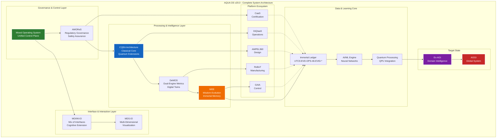
```mermaid
graph TB
    subgraph "AQUA OS v20.0 - Complete System Architecture"
        subgraph "Governance & Control Layer"
            MOS[Mixed Operating System<br/>Unified Control Plane]
            AMORES[AMOReS<br/>Regulatory Governance<br/>Safety Assurance]
        end
        
        subgraph "Interface & Interaction Layer"
            MOI[MOI/M.IO<br/>Mix of Interfaces<br/>Cognitive Extension]
            MDS[MDS.IO<br/>Multi-Dimensional<br/>Visualization]
        end
        
        subgraph "Processing & Intelligence Layer"
            CQEA[CQEA Architecture<br/>Classical Core<br/>Quantum Extensions]
            DEMOS[DeMOS<br/>Dual-Engine Metrics<br/>Digital Twins]
            WEE[WEE<br/>Wisdom Evolution<br/>Immortal Memory]
        end
        
        subgraph "Platform Ecosystem"
            AMPEL[AMPEL360<br/>Design]
            DIQI[DiQIaaS<br/>Operations]
            CAAS[CaaS<br/>Certification]
            ROBOT[RoBoT<br/>Manufacturing]
            GAIA[GAIA<br/>Control]
        end
        
        subgraph "Data & Learning Core"
            LEDGER[Immortal Ledger<br/>UTCS:EVD-OPS-46-EVID-*]
            AI[AI/ML Engine<br/>Neural Networks]
            QUANTUM[Quantum Processing<br/>QPU Integration]
        end
        
        subgraph "Target State"
            EXAGI[Ex-AGI<br/>Domain Intelligence]
            AGGI[AGGI<br/>Global System]
        end
        
        MOS --> MOI
        MOS --> AMORES
        MOI --> MDS
        AMORES --> CQEA
        CQEA --> DEMOS
        DEMOS --> WEE
        WEE --> LEDGER
        
        CQEA --> AMPEL
        CQEA --> DIQI
        AMORES --> CAAS
        DEMOS --> ROBOT
        WEE --> GAIA
        
        LEDGER --> AI
        AI --> QUANTUM
        QUANTUM --> EXAGI
        EXAGI --> AGGI
        
        AMPEL -.-> LEDGER
        DIQI -.-> LEDGER
        CAAS -.-> LEDGER
        ROBOT -.-> LEDGER
        GAIA -.-> LEDGER
    end
    
    style MOS fill:#2e7d32,stroke:#fff,stroke-width:3px,color:#fff
    style CQEA fill:#1565c0,stroke:#fff,stroke-width:3px,color:#fff
    style WEE fill:#ef6c00,stroke:#fff,stroke-width:3px,color:#fff
    style EXAGI fill:#7b1fa2,stroke:#fff,stroke-width:3px,color:#fff
    style AGGI fill:#c62828,stroke:#fff,stroke-width:4px,color:#fff
```

---

### **DIAGRAM 2: PHILOSOPHICAL AXIOMS INFLUENCE MAP**
*This diagram explains the "laws of physics" that govern the entire system. It shows how the five core axioms are the foundational drivers for the key architectural components and their desired outcomes.*

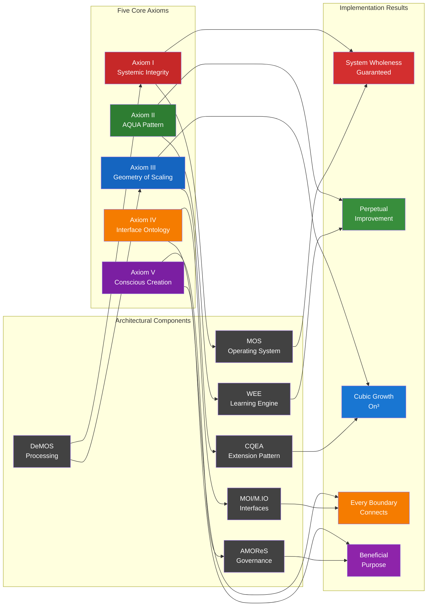
```mermaid
flowchart LR
    subgraph "Five Core Axioms"
        A1[Axiom I<br/>Systemic Integrity]
        A2[Axiom II<br/>AQUA Pattern]
        A3[Axiom III<br/>Geometry of Scaling]
        A4[Axiom IV<br/>Interface Ontology]
        A5[Axiom V<br/>Conscious Creation]
    end
    
    subgraph "Architectural Components"
        MOS[MOS<br/>Operating System]
        CQEA[CQEA<br/>Extension Pattern]
        WEE[WEE<br/>Learning Engine]
        AMORES[AMOReS<br/>Governance]
        DEMOS[DeMOS<br/>Processing]
        MOI[MOI/M.IO<br/>Interfaces]
    end
    
    subgraph "Implementation Results"
        INTEGRITY[System Wholeness<br/>Guaranteed]
        EVOLUTION[Perpetual<br/>Improvement]
        SCALING[Cubic Growth<br/>On³]
        BRIDGE[Every Boundary<br/>Connects]
        ETHICS[Beneficial<br/>Purpose]
    end
    
    A1 --> MOS
    A1 --> INTEGRITY
    MOS --> INTEGRITY
    
    A2 --> WEE
    A2 --> EVOLUTION
    WEE --> EVOLUTION
    
    A3 --> CQEA
    A3 --> SCALING
    CQEA --> SCALING
    
    A4 --> MOI
    A4 --> BRIDGE
    MOI --> BRIDGE
    
    A5 --> AMORES
    A5 --> ETHICS
    AMORES --> ETHICS
    
    DEMOS --> A1
    DEMOS --> A3
    
    style A1 fill:#c62828,color:#fff
    style A2 fill:#2e7d32,color:#fff
    style A3 fill:#1565c0,color:#fff
    style A4 fill:#f57c00,color:#fff
    style A5 fill:#7b1fa2,color:#fff
    style MOS fill:#424242,color:#fff
    style CQEA fill:#424242,color:#fff
    style WEE fill:#424242,color:#fff
    style AMORES fill:#424242,color:#fff
    style DEMOS fill:#424242,color:#fff
    style MOI fill:#424242,color:#fff
    style INTEGRITY fill:#d32f2f,color:#fff
    style EVOLUTION fill:#388e3c,color:#fff
    style SCALING fill:#1976d2,color:#fff
    style BRIDGE fill:#f57c00,color:#fff
    style ETHICS fill:#8e24aa,color:#fff
```

---

### **DIAGRAM 3: AQUA EIGHT-LAYER ARCHITECTURE**
*This diagram details the "anatomy" of the Mixed Operating System (MOS), showing the hierarchical stack from the quantum foundation to the strategic business layer.*


```mermaid
graph BT
    subgraph "AQUA v20.0 Eight-Layer Architecture Stack"
        L1[Layer 1: Quantum Enhancement Foundation<br/>━━━━━━━━━━━━━━━━━━━━━━━━━━━━<br/>QPU • Quantum Algorithms • Entanglement • PQC<br/>+ CQEA Quantum Extensions<br/>Files: UTCS:ART-IMP-98-QCMP-*, UTCS:ART-IMP-98-QRES-*]
        
        L2[Layer 2: Aerospace Domain Integration<br/>━━━━━━━━━━━━━━━━━━━━━━━━━━━━<br/>Flight Systems • Avionics • Vehicle Control<br/>+ CQEA Classical Foundation<br/>Files: UTCS:ART-IMP-27-FCS-*]
        
        L3[Layer 3: Cyber-Physical Integration<br/>━━━━━━━━━━━━━━━━━━━━━━━━━━━━<br/>IoT • Edge Computing • Sensors • Data Acquisition<br/>+ CQEA Extension Points<br/>Files: UTCS:ART-IMP-39-CPSYNC-*]
        
        L4[Layer 4: Robotics & Physical Automation<br/>━━━━━━━━━━━━━━━━━━━━━━━━━━━━<br/>Autonomous Machines • Precision Control<br/>Files: UTCS:ART-IMP-38-ROBT-*, UTCS:API-OPS-38-ROBOT-*]
        
        L5[Layer 5: AI/ML & Agent Infrastructure<br/>━━━━━━━━━━━━━━━━━━━━━━━━━━━━<br/>Neural Networks • Autonomous Agents<br/>+ WEE Pattern Recognition<br/>Files: UTCS:ART-IMP-99-AI-*, UTCS:ART-IMP-99-AGENT-*]
        
        L6[Layer 6: Digital Twin & Simulation<br/>━━━━━━━━━━━━━━━━━━━━━━━━━━━━<br/>Virtual Models • Predictive Analytics<br/>+ DeMOS Predictive Processing<br/>Files: UTCS:ART-IMP-46-DT-*]
        
        L7[Layer 7: Digital-Industrial Operations<br/>━━━━━━━━━━━━━━━━━━━━━━━━━━━━<br/>Manufacturing • Supply Chain • MRO<br/>+ WEE Learning Integration<br/>Files: UTCS:DOC-OPS-38-IND-*, UTCS:DOC-OPS-45-MRO-*]
        
        L8[Layer 8: Business Intelligence & Strategy<br/>━━━━━━━━━━━━━━━━━━━━━━━━━━━━<br/>Analytics • ROI • Strategic Decisions<br/>+ AMOReS Regulatory Intelligence<br/>Files: UTCS:DOC-OPS-00-MGMT-*, UTCS:DOC-CON-46-REG-*]
        
        L1 --> L2
        L2 --> L3
        L3 --> L4
        L4 --> L5
        L5 --> L6
        L6 --> L7
        L7 --> L8
    end
    
    style L1 fill:#7b1fa2,stroke:#fff,stroke-width:3px,color:#fff
    style L2 fill:#8e24aa,stroke:#fff,stroke-width:2px,color:#fff
    style L3 fill:#5e35b1,stroke:#fff,stroke-width:2px,color:#fff
    style L4 fill:#3949ab,stroke:#fff,stroke-width:2px,color:#fff
    style L5 fill:#1e88e5,stroke:#fff,stroke-width:3px,color:#fff
    style L6 fill:#039be5,stroke:#fff,stroke-width:2px,color:#fff
    style L7 fill:#0288d1,stroke:#fff,stroke-width:2px,color:#fff
    style L8 fill:#2e7d32,stroke:#fff,stroke-width:3px,color:#fff
```

---

### **DIAGRAM 4: AQUA PATTERN - THE 7-STAGE LIFECYCLE**
*This diagram illustrates the core operational "heartbeat" of the AQUA OS—the perpetual cycle of innovation that drives the creation of all products and services.*

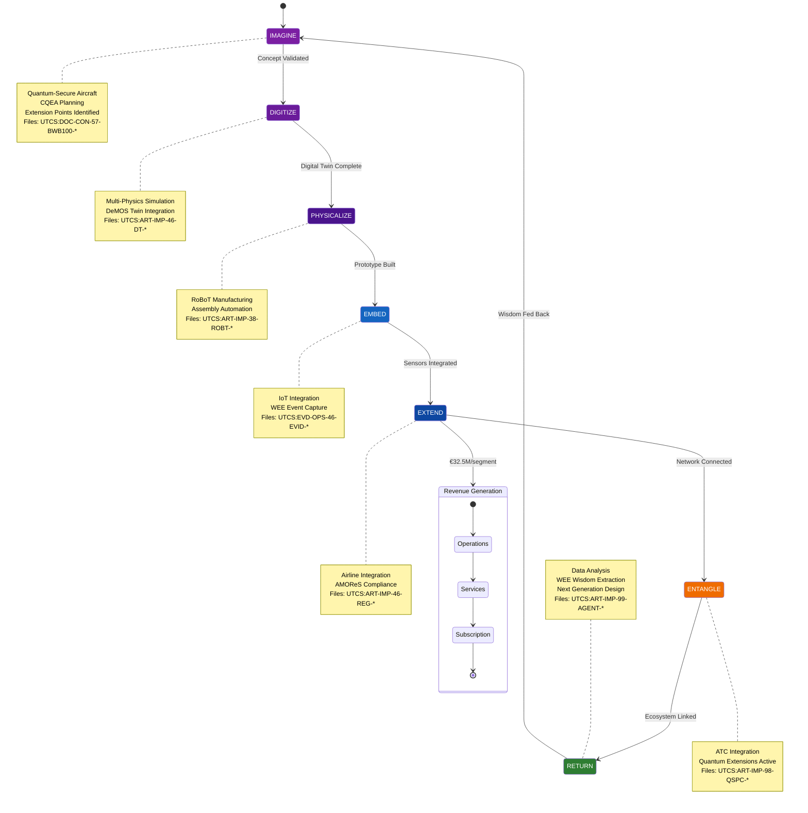
```mermaid
stateDiagram-v2
    [*] --> IMAGINE
    
    IMAGINE --> DIGITIZE : Concept Validated
    note right of IMAGINE
        Quantum-Secure Aircraft
        CQEA Planning
        Extension Points Identified
        Files: UTCS:DOC-CON-57-BWB100-*
    end note
    
    DIGITIZE --> PHYSICALIZE : Digital Twin Complete
    note right of DIGITIZE
        Multi-Physics Simulation
        DeMOS Twin Integration
        Files: UTCS:ART-IMP-46-DT-*
    end note
    
    PHYSICALIZE --> EMBED : Prototype Built
    note right of PHYSICALIZE
        RoBoT Manufacturing
        Assembly Automation
        Files: UTCS:ART-IMP-38-ROBT-*
    end note
    
    EMBED --> EXTEND : Sensors Integrated
    note right of EMBED
        IoT Integration
        WEE Event Capture
        Files: UTCS:EVD-OPS-46-EVID-*
    end note
    
    EXTEND --> ENTANGLE : Network Connected
    note right of EXTEND
        Airline Integration
        AMOReS Compliance
        Files: UTCS:ART-IMP-46-REG-*
    end note
    
    ENTANGLE --> RETURN : Ecosystem Linked
    note right of ENTANGLE
        ATC Integration
        Quantum Extensions Active
        Files: UTCS:ART-IMP-98-QSPC-*
    end note
    
    RETURN --> IMAGINE : Wisdom Fed Back
    note left of RETURN
        Data Analysis
        WEE Wisdom Extraction
        Next Generation Design
        Files: UTCS:ART-IMP-99-AGENT-*
    end note
    
    state "Revenue Generation" as REV {
        [*] --> Operations
        Operations --> Services
        Services --> Subscription
        Subscription --> [*]
    }
    
    EXTEND --> REV : €32.5M/segment
    
    style IMAGINE fill:#7b1fa2,color:#fff
    style DIGITIZE fill:#6a1b9a,color:#fff
    style PHYSICALIZE fill:#4a148c,color:#fff
    style EMBED fill:#1565c0,color:#fff
    style EXTEND fill:#0d47a1,color:#fff
    style ENTANGLE fill:#ef6c00,color:#fff
    style RETURN fill:#2e7d32,color:#fff
    style REV fill:#00695c,color:#fff
```

---

### **DIAGRAM 5: CQEA PATTERN STRUCTURE**
*This diagram provides a deep-dive into the core architectural pattern for all applications, showing how robust classical systems are strategically enhanced by quantum capabilities.*

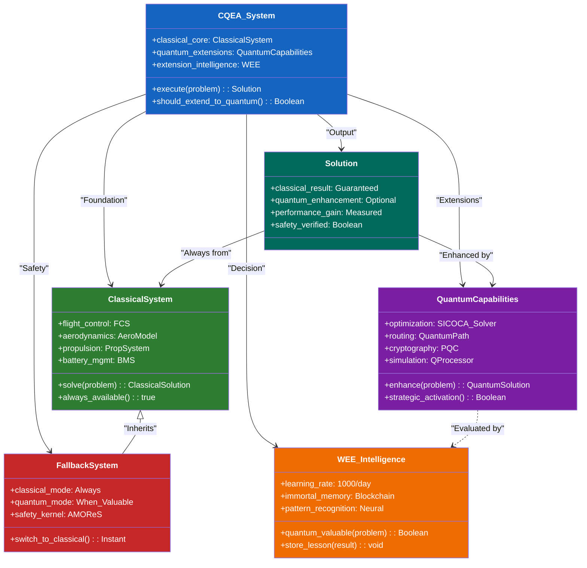
```mermaid
classDiagram
    class CQEA_System {
        +classical_core: ClassicalSystem
        +quantum_extensions: QuantumCapabilities
        +extension_intelligence: WEE
        +execute(problem): Solution
        +should_extend_to_quantum(): Boolean
    }
    
    class ClassicalSystem {
        +flight_control: FCS
        +aerodynamics: AeroModel
        +propulsion: PropSystem
        +battery_mgmt: BMS
        +solve(problem): ClassicalSolution
        +always_available(): true
    }
    
    class QuantumCapabilities {
        +optimization: SICOCA_Solver
        +routing: QuantumPath
        +cryptography: PQC
        +simulation: QProcessor
        +enhance(problem): QuantumSolution
        +strategic_activation(): Boolean
    }
    
    class WEE_Intelligence {
        +learning_rate: 1000/day
        +immortal_memory: Blockchain
        +pattern_recognition: Neural
        +quantum_valuable(problem): Boolean
        +store_lesson(result): void
    }
    
    class FallbackSystem {
        +classical_mode: Always
        +quantum_mode: When_Valuable
        +safety_kernel: AMOReS
        +switch_to_classical(): Instant
    }
    
    class Solution {
        +classical_result: Guaranteed
        +quantum_enhancement: Optional
        +performance_gain: Measured
        +safety_verified: Boolean
    }
    
    CQEA_System --> ClassicalSystem : "Foundation"
    CQEA_System --> QuantumCapabilities : "Extensions"
    CQEA_System --> WEE_Intelligence : "Decision"
    CQEA_System --> FallbackSystem : "Safety"
    CQEA_System --> Solution : "Output"
    
    ClassicalSystem <|-- FallbackSystem : "Inherits"
    QuantumCapabilities ..> WEE_Intelligence : "Evaluated by"
    Solution --> ClassicalSystem : "Always from"
    Solution --> QuantumCapabilities : "Enhanced by"
    
    style CQEA_System fill:#1565c0,color:#fff
    style ClassicalSystem fill:#2e7d32,color:#fff
    style QuantumCapabilities fill:#7b1fa2,color:#fff
    style WEE_Intelligence fill:#ef6c00,color:#fff
    style FallbackSystem fill:#c62828,color:#fff
    style Solution fill:#00695c,color:#fff
```

---

### **DIAGRAM 6: PLATFORM ECOSYSTEM DATA INTEGRATION**
*This diagram shows how the five core platforms interact, feeding data into the Unified Data Lake and being guided by the central WEE and AMOReS intelligence layers.*

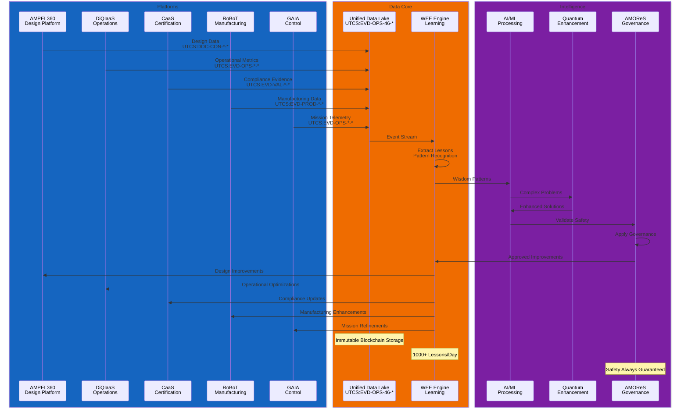
```mermaid
sequenceDiagram
    participant AMPEL as AMPEL360<br/>Design Platform
    participant DIQI as DiQIaaS<br/>Operations
    participant CAAS as CaaS<br/>Certification
    participant ROBOT as RoBoT<br/>Manufacturing
    participant GAIA as GAIA<br/>Control
    participant LAKE as Unified Data Lake<br/>UTCS:EVD-OPS-46-*
    participant WEE as WEE Engine<br/>Learning
    participant AI as AI/ML<br/>Processing
    participant QUANTUM as Quantum<br/>Enhancement
    participant AMORES as AMOReS<br/>Governance
    
    AMPEL->>LAKE: Design Data<br/>UTCS:DOC-CON-*-*
    DIQI->>LAKE: Operational Metrics<br/>UTCS:EVD-OPS-*-*
    CAAS->>LAKE: Compliance Evidence<br/>UTCS:EVD-VAL-*-*
    ROBOT->>LAKE: Manufacturing Data<br/>UTCS:EVD-PROD-*-*
    GAIA->>LAKE: Mission Telemetry<br/>UTCS:EVD-OPS-*-*
    
    LAKE->>WEE: Event Stream
    WEE->>WEE: Extract Lessons<br/>Pattern Recognition
    WEE->>AI: Wisdom Patterns
    AI->>QUANTUM: Complex Problems
    QUANTUM->>AI: Enhanced Solutions
    
    AI->>AMORES: Validate Safety
    AMORES->>AMORES: Apply Governance
    AMORES->>WEE: Approved Improvements
    
    WEE->>AMPEL: Design Improvements
    WEE->>DIQI: Operational Optimizations
    WEE->>CAAS: Compliance Updates
    WEE->>ROBOT: Manufacturing Enhancements
    WEE->>GAIA: Mission Refinements
    
    Note over LAKE: Immutable Blockchain Storage
    Note over WEE: 1000+ Lessons/Day
    Note over AMORES: Safety Always Guaranteed
    
    box rgb(21, 101, 192) Platforms
    participant AMPEL
    participant DIQI
    participant CAAS
    participant ROBOT
    participant GAIA
    end
    
    box rgb(239, 108, 0) Data Core
    participant LAKE
    participant WEE
    end
    
    box rgb(123, 31, 162) Intelligence
    participant AI
    participant QUANTUM
    participant AMORES
    end
```

---

### **DIAGRAM 7: CONTINUOUS LEARNING FEEDBACK (WEE)**
*This diagram details the internal workings of the Wisdom Evolution Engine, showing how it captures events from all domains and turns them into perpetual, fleet-wide improvements.*

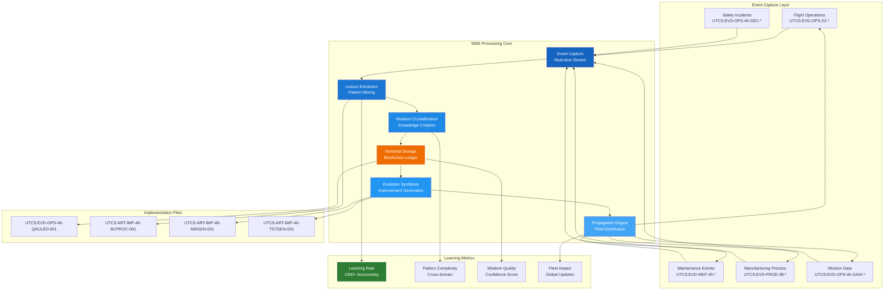
```mermaid
flowchart TB
    subgraph "Event Capture Layer"
        E1[Flight Operations<br/>UTCS:EVD-OPS-22-*]
        E2[Maintenance Events<br/>UTCS:EVD-MNT-45-*]
        E3[Manufacturing Process<br/>UTCS:EVD-PROD-38-*]
        E4[Mission Data<br/>UTCS:EVD-OPS-46-GAIA-*]
        E5[Safety Incidents<br/>UTCS:EVD-OPS-46-SEC-*]
    end
    
    subgraph "WEE Processing Core"
        CAPTURE[Event Capture<br/>Real-time Stream]
        EXTRACT[Lesson Extraction<br/>Pattern Mining]
        CRYSTAL[Wisdom Crystallization<br/>Knowledge Creation]
        STORE[Immortal Storage<br/>Blockchain Ledger]
        SYNTH[Evolution Synthesis<br/>Improvement Generation]
        PROP[Propagation Engine<br/>Fleet Distribution]
    end
    
    subgraph "Learning Metrics"
        M1[Learning Rate<br/>1000+ lessons/day]
        M2[Pattern Complexity<br/>Cross-domain]
        M3[Wisdom Quality<br/>Confidence Score]
        M4[Fleet Impact<br/>Global Updates]
    end
    
    subgraph "Implementation Files"
        F1[UTCS:EVD-OPS-46-QAULED-001]
        F2[UTCS:ART-IMP-46-BCPROC-001]
        F3[UTCS:ART-IMP-46-MDGEN-001]
        F4[UTCS:ART-IMP-46-TSTGEN-001]
    end
    
    E1 --> CAPTURE
    E2 --> CAPTURE
    E3 --> CAPTURE
    E4 --> CAPTURE
    E5 --> CAPTURE
    
    CAPTURE --> EXTRACT
    EXTRACT --> CRYSTAL
    CRYSTAL --> STORE
    STORE --> SYNTH
    SYNTH --> PROP
    
    PROP --> E1
    PROP --> E2
    PROP --> E3
    PROP --> E4
    
    EXTRACT --> M1
    CRYSTAL --> M2
    STORE --> M3
    PROP --> M4
    
    STORE --> F1
    EXTRACT --> F2
    SYNTH --> F3
    SYNTH --> F4
    
    style STORE fill:#ef6c00,stroke:#fff,stroke-width:3px,color:#fff
    style M1 fill:#2e7d32,stroke:#fff,stroke-width:2px,color:#fff
    style CAPTURE fill:#1565c0,color:#fff
    style EXTRACT fill:#1976d2,color:#fff
    style CRYSTAL fill:#1e88e5,color:#fff
    style SYNTH fill:#2196f3,color:#fff
    style PROP fill:#42a5f5,color:#fff
```

---

### **DIAGRAM 8: POC/VALIDATION EVIDENCE CHAINS**
*This diagram provides the proof, showing the traceable path from the initial software POCs, through testing and evidence generation, to the final, quantified value they create.*

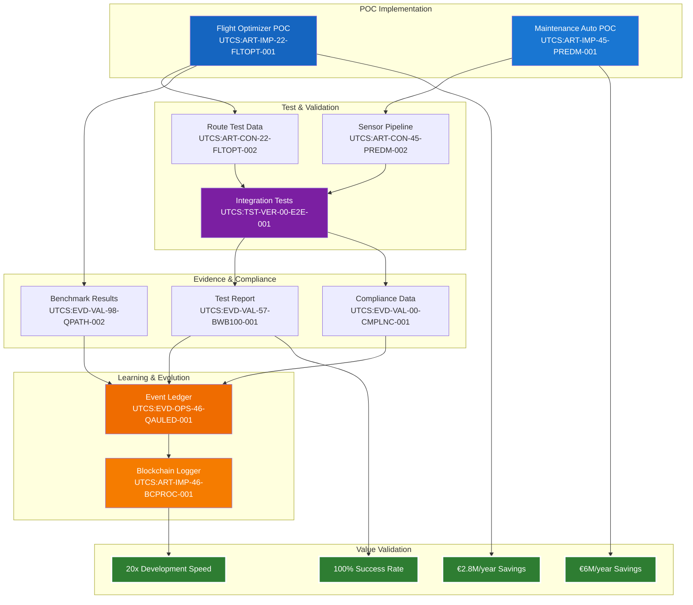
```mermaid
flowchart TB
    subgraph "POC Implementation"
        POC1[Flight Optimizer POC<br/>UTCS:ART-IMP-22-FLTOPT-001]
        POC2[Maintenance Auto POC<br/>UTCS:ART-IMP-45-PREDM-001]
    end
    
    subgraph "Test & Validation"
        TEST1[Route Test Data<br/>UTCS:ART-CON-22-FLTOPT-002]
        TEST2[Sensor Pipeline<br/>UTCS:ART-CON-45-PREDM-002]
        TEST3[Integration Tests<br/>UTCS:TST-VER-00-E2E-001]
    end
    
    subgraph "Evidence & Compliance"
        EV1[Test Report<br/>UTCS:EVD-VAL-57-BWB100-001]
        EV2[Compliance Data<br/>UTCS:EVD-VAL-00-CMPLNC-001]
        EV3[Benchmark Results<br/>UTCS:EVD-VAL-98-QPATH-002]
    end
    
    subgraph "Learning & Evolution"
        LEARN1[Event Ledger<br/>UTCS:EVD-OPS-46-QAULED-001]
        LEARN2[Blockchain Logger<br/>UTCS:ART-IMP-46-BCPROC-001]
    end
    
    subgraph "Value Validation"
        VAL1[€2.8M/year Savings]
        VAL2[€6M/year Savings]
        VAL3[20x Development Speed]
        VAL4[100% Success Rate]
    end
    
    POC1 --> TEST1
    POC2 --> TEST2
    TEST1 --> TEST3
    TEST2 --> TEST3
    
    TEST3 --> EV1
    TEST3 --> EV2
    POC1 --> EV3
    
    EV1 --> LEARN1
    EV2 --> LEARN1
    EV3 --> LEARN1
    
    LEARN1 --> LEARN2
    
    POC1 --> VAL1
    POC2 --> VAL2
    LEARN2 --> VAL3
    EV1 --> VAL4
    
    style POC1 fill:#1565c0,color:#fff
    style POC2 fill:#1976d2,color:#fff
    style TEST3 fill:#7b1fa2,color:#fff
    style LEARN1 fill:#ef6c00,color:#fff
    style LEARN2 fill:#f57c00,color:#fff
    style VAL1 fill:#2e7d32,stroke:#fff,stroke-width:3px,color:#fff
    style VAL2 fill:#2e7d32,stroke:#fff,stroke-width:3px,color:#fff
    style VAL3 fill:#2e7d32,stroke:#fff,stroke-width:3px,color:#fff
    style VAL4 fill:#2e7d32,stroke:#fff,stroke-width:3px,color:#fff
```

---

### **DIAGRAM 9: CERTIFICATION & FALLBACK PROCESS**
*This diagram illustrates the decision-making flow of the AMOReS governance system, ensuring that all operations, especially quantum-augmented ones, remain within strict safety and compliance boundaries.*

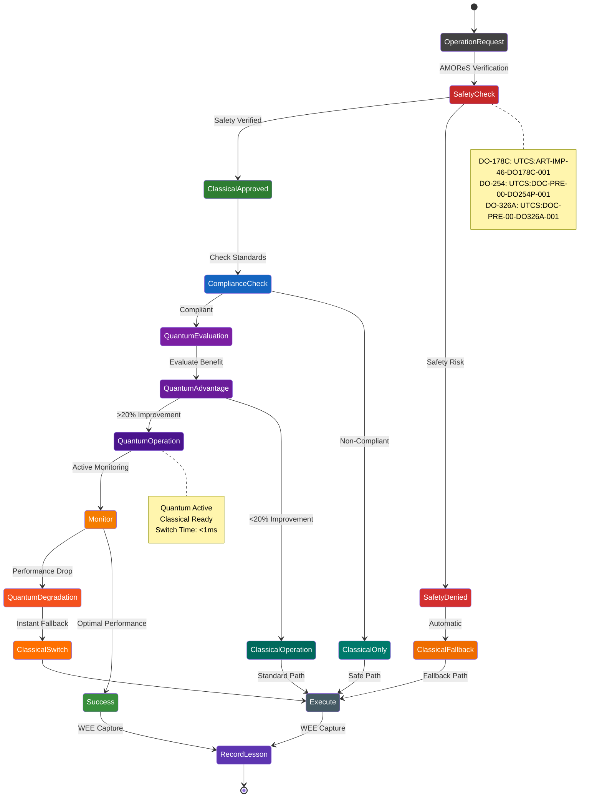
```mermaid
stateDiagram-v2
    [*] --> OperationRequest
    
    OperationRequest --> SafetyCheck : AMOReS Verification
    
    SafetyCheck --> ClassicalApproved : Safety Verified
    SafetyCheck --> SafetyDenied : Safety Risk
    
    SafetyDenied --> ClassicalFallback : Automatic
    
    ClassicalApproved --> ComplianceCheck : Check Standards
    
    ComplianceCheck --> QuantumEvaluation : Compliant
    ComplianceCheck --> ClassicalOnly : Non-Compliant
    
    QuantumEvaluation --> QuantumAdvantage : Evaluate Benefit
    
    QuantumAdvantage --> QuantumOperation : >20% Improvement
    QuantumAdvantage --> ClassicalOperation : <20% Improvement
    
    QuantumOperation --> Monitor : Active Monitoring
    ClassicalOperation --> Execute : Standard Path
    ClassicalOnly --> Execute : Safe Path
    ClassicalFallback --> Execute : Fallback Path
    
    Monitor --> QuantumDegradation : Performance Drop
    Monitor --> Success : Optimal Performance
    
    QuantumDegradation --> ClassicalSwitch : Instant Fallback
    ClassicalSwitch --> Execute
    
    Execute --> RecordLesson : WEE Capture
    Success --> RecordLesson : WEE Capture
    
    RecordLesson --> [*]
    
    note right of SafetyCheck
        DO-178C: UTCS:ART-IMP-46-DO178C-001
        DO-254: UTCS:DOC-PRE-00-DO254P-001
        DO-326A: UTCS:DOC-PRE-00-DO326A-001
    end note
    
    note right of QuantumOperation
        Quantum Active
        Classical Ready
        Switch Time: <1ms
    end note
    
    style OperationRequest fill:#424242,color:#fff
    style SafetyCheck fill:#c62828,color:#fff
    style SafetyDenied fill:#d32f2f,color:#fff
    style ClassicalApproved fill:#2e7d32,color:#fff
    style ComplianceCheck fill:#1565c0,color:#fff
    style QuantumEvaluation fill:#7b1fa2,color:#fff
    style QuantumAdvantage fill:#6a1b9a,color:#fff
    style QuantumOperation fill:#4a148c,color:#fff
    style ClassicalOperation fill:#00695c,color:#fff
    style ClassicalOnly fill:#00796b,color:#fff
    style ClassicalFallback fill:#ef6c00,color:#fff
    style Monitor fill:#f57c00,color:#fff
    style Success fill:#388e3c,color:#fff
    style QuantumDegradation fill:#f4511e,color:#fff
    style ClassicalSwitch fill:#ff6f00,color:#fff
    style Execute fill:#455a64,color:#fff
    style RecordLesson fill:#5e35b1,color:#fff
```

---

### **DIAGRAM 10: RISK MANAGEMENT & FALLBACK LOGIC**
*This diagram provides a comprehensive overview of the system's approach to risk, from identification and mitigation to the specific, robust fallback mechanisms that guarantee operational safety.*

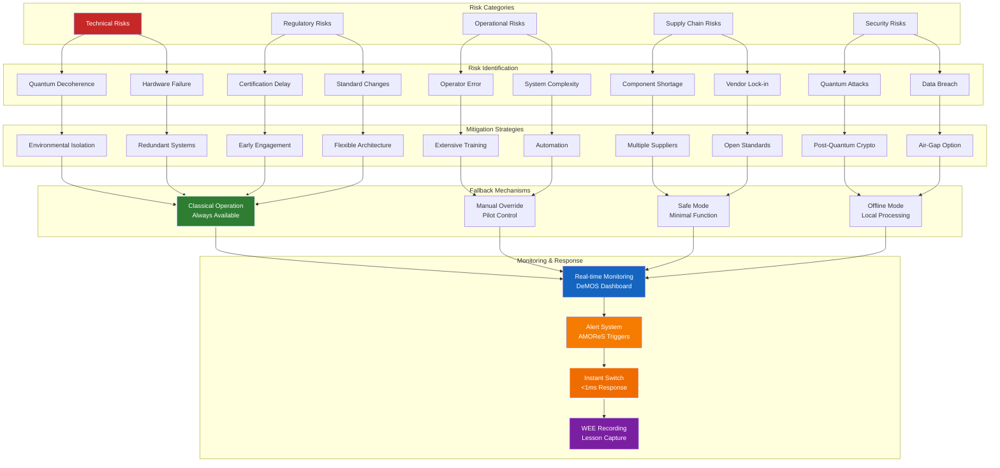
```mermaid
flowchart TB
    subgraph "Risk Categories"
        R1[Technical Risks]
        R2[Operational Risks]
        R3[Supply Chain Risks]
        R4[Security Risks]
        R5[Regulatory Risks]
    end
    
    subgraph "Risk Identification"
        T1[Quantum Decoherence]
        T2[Hardware Failure]
        O1[Operator Error]
        O2[System Complexity]
        S1[Component Shortage]
        S2[Vendor Lock-in]
        SEC1[Quantum Attacks]
        SEC2[Data Breach]
        REG1[Certification Delay]
        REG2[Standard Changes]
    end
    
    subgraph "Mitigation Strategies"
        MIT1[Environmental Isolation]
        MIT2[Redundant Systems]
        MIT3[Extensive Training]
        MIT4[Automation]
        MIT5[Multiple Suppliers]
        MIT6[Open Standards]
        MIT7[Post-Quantum Crypto]
        MIT8[Air-Gap Option]
        MIT9[Early Engagement]
        MIT10[Flexible Architecture]
    end
    
    subgraph "Fallback Mechanisms"
        FB1[Classical Operation<br/>Always Available]
        FB2[Manual Override<br/>Pilot Control]
        FB3[Safe Mode<br/>Minimal Function]
        FB4[Offline Mode<br/>Local Processing]
    end
    
    subgraph "Monitoring & Response"
        MON[Real-time Monitoring<br/>DeMOS Dashboard]
        ALERT[Alert System<br/>AMOReS Triggers]
        SWITCH[Instant Switch<br/><1ms Response]
        RECORD[WEE Recording<br/>Lesson Capture]
    end
    
    R1 --> T1 & T2
    R2 --> O1 & O2
    R3 --> S1 & S2
    R4 --> SEC1 & SEC2
    R5 --> REG1 & REG2
    
    T1 --> MIT1; T2 --> MIT2
    O1 --> MIT3; O2 --> MIT4
    S1 --> MIT5; S2 --> MIT6
    SEC1 --> MIT7; SEC2 --> MIT8
    REG1 --> MIT9; REG2 --> MIT10
    
    MIT1 & MIT2 & MIT9 & MIT10 --> FB1
    MIT3 & MIT4 --> FB2
    MIT5 & MIT6 --> FB3
    MIT7 & MIT8 --> FB4
    
    FB1 & FB2 & FB3 & FB4 --> MON
    
    MON --> ALERT
    ALERT --> SWITCH
    SWITCH --> RECORD
    
    style R1 fill:#c62828,color:#fff
    style FB1 fill:#2e7d32,stroke:#fff,stroke-width:3px,color:#fff
    style SWITCH fill:#ef6c00,stroke:#fff,stroke-width:3px,color:#fff
    style MON fill:#1565c0,color:#fff
    style ALERT fill:#f57c00,color:#fff
    style RECORD fill:#7b1fa2,color:#fff
```

---

### **DIAGRAM 11: PRODUCT PORTFOLIO MAP**
*This diagram visualizes the breadth of the AQUA OS's generative capability, mapping the 30+ defined products across their respective operational domains.*

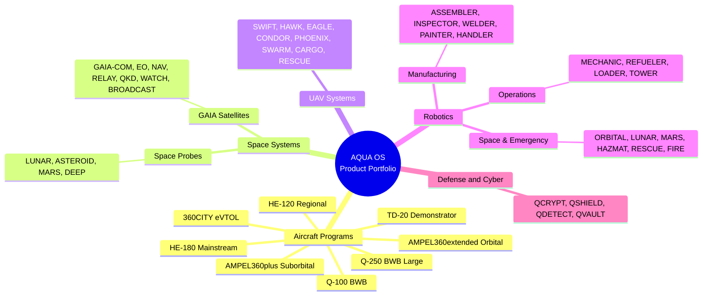
```mermaid
mindmap
  root((AQUA OS<br/>Product Portfolio))
    Aircraft Programs
      TD-20 Demonstrator
      360CITY eVTOL
      HE-120 Regional
      HE-180 Mainstream
      Q-100 BWB
      Q-250 BWB Large
      AMPEL360plus Suborbital
      AMPEL360extended Orbital
    
    Space Systems
      GAIA Satellites
        GAIA-COM, EO, NAV, RELAY, QKD, WATCH, BROADCAST
      Space Probes
        LUNAR, ASTEROID, MARS, DEEP
    
    UAV Systems
      SWIFT, HAWK, EAGLE, CONDOR, PHOENIX, SWARM, CARGO, RESCUE
    
    Robotics
      Manufacturing
        ASSEMBLER, INSPECTOR, WELDER, PAINTER, HANDLER
      Operations
        MECHANIC, REFUELER, LOADER, TOWER
      Space & Emergency
        ORBITAL, LUNAR, MARS, HAZMAT, RESCUE, FIRE
    
    Defense and Cyber
      QCRYPT, QSHIELD, QDETECT, QVAULT
```

---

### **DIAGRAM 12: TECHNOLOGY INTEGRATION MATRIX**
*This diagram provides a high-level heatmap showing how core technologies are integrated across the five main platforms and applied at different stages of the lifecycle.*

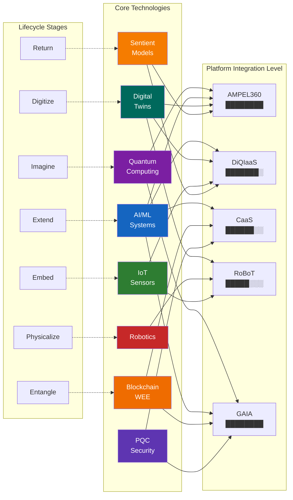
```mermaid
graph LR
    subgraph "Core Technologies"
        QC[Quantum<br/>Computing]
        AI[AI/ML<br/>Systems]
        DT[Digital<br/>Twins]
        BC[Blockchain<br/>WEE]
        RB[Robotics]
        IO[IoT<br/>Sensors]
        PQ[PQC<br/>Security]
        SM[Sentient<br/>Models]
    end
    
    subgraph "Platform Integration Level"
        AMPEL_INT[AMPEL360<br/>████████]
        DIQI_INT[DiQIaaS<br/>███████░]
        CAAS_INT[CaaS<br/>██████░░]
        ROBOT_INT[RoBoT<br/>█████░░░]
        GAIA_INT[GAIA<br/>████████]
    end
    
    subgraph "Lifecycle Stages"
        L1[Imagine]
        L2[Digitize]
        L3[Physicalize]
        L4[Embed]
        L5[Extend]
        L6[Entangle]
        L7[Return]
    end
    
    QC --> AMPEL_INT & GAIA_INT
    AI --> AMPEL_INT & DIQI_INT & CAAS_INT & GAIA_INT
    DT --> AMPEL_INT & DIQI_INT & ROBOT_INT
    BC --> CAAS_INT & GAIA_INT
    RB --> ROBOT_INT
    IO --> DIQI_INT & ROBOT_INT
    PQ --> CAAS_INT & GAIA_INT
    SM --> AMPEL_INT & DIQI_INT
    
    L1 -.-> QC; L2 -.-> DT; L3 -.-> RB
    L4 -.-> IO; L5 -.-> AI; L6 -.-> BC; L7 -.-> SM
    
    style QC fill:#7b1fa2,color:#fff
    style AI fill:#1565c0,color:#fff
    style DT fill:#00695c,color:#fff
    style BC fill:#ef6c00,color:#fff
    style RB fill:#c62828,color:#fff
    style IO fill:#2e7d32,color:#fff
    style PQ fill:#5e35b1,color:#fff
    style SM fill:#f57c00,color:#fff
```

---

### **DIAGRAM 13: IMPLEMENTATION ROADMAP**
*This Gantt chart visualizes the complete, phased timeline for the AQUA Initiative, from the initial POCs to the emergence of Ex-AGI and AGGI.*

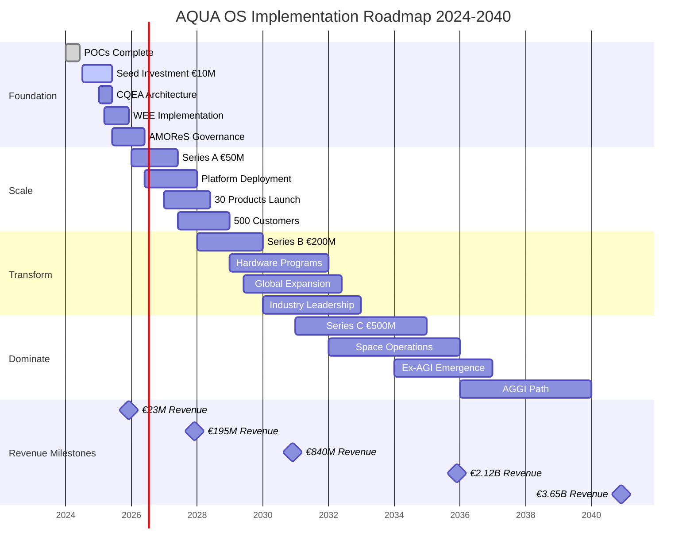
```mermaid
gantt
    title AQUA OS Implementation Roadmap 2024-2040
    dateFormat YYYY-MM
    axisFormat %Y
    
    section Foundation
    POCs Complete                    :done, poc, 2024-01, 2024-06
    Seed Investment €10M             :active, seed, 2024-07, 2025-06
    CQEA Architecture               :cqea, 2025-01, 2025-06
    WEE Implementation              :wee, 2025-03, 2025-12
    AMOReS Governance               :amores, 2025-06, 2026-06
    
    section Scale
    Series A €50M                   :scale1, 2026-01, 2027-06
    Platform Deployment             :plat, 2026-06, 2028-01
    30 Products Launch              :prod30, 2027-01, 2028-06
    500 Customers                   :cust500, 2027-06, 2029-01
    
    section Transform
    Series B €200M                  :trans1, 2028-01, 2030-01
    Hardware Programs               :hw, 2029-01, 2032-01
    Global Expansion                :global, 2029-06, 2032-06
    Industry Leadership             :lead, 2030-01, 2033-01
    
    section Dominate
    Series C €500M                  :dom1, 2031-01, 2035-01
    Space Operations                :space, 2032-01, 2036-01
    Ex-AGI Emergence                :exagi, 2034-01, 2037-01
    AGGI Path                       :aggi, 2036-01, 2040-01
    
    section Revenue Milestones
    €23M Revenue                    :milestone, m1, 2025-12, 1d
    €195M Revenue                   :milestone, m2, 2027-12, 1d
    €840M Revenue                   :milestone, m3, 2030-12, 1d
    €2.12B Revenue                  :milestone, m4, 2035-12, 1d
    €3.65B Revenue                  :milestone, m5, 2040-12, 1d
```

---

### **DIAGRAM 14: REVENUE STREAMS & BUSINESS MODEL**
*These charts provide a clear visualization of the projected revenue growth and the distribution of income across the various product and service categories by 2040.*

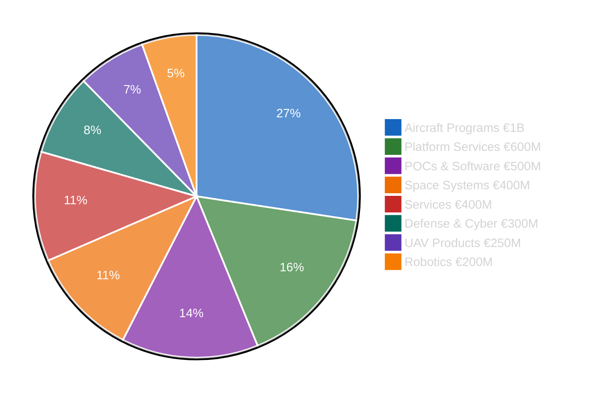
```mermaid
%%{init: {'theme':'dark', 'themeVariables': { 'pie1': '#1565c0', 'pie2': '#2e7d32', 'pie3': '#7b1fa2', 'pie4': '#ef6c00', 'pie5': '#c62828', 'pie6': '#00695c', 'pie7': '#5e35b1', 'pie8': '#f57c00', 'pieOuterStrokeWidth': '3px', 'pieStrokeColor': '#ffffff', 'pieTitleTextSize': '18px', 'pieSectionTextSize': '14px', 'pieLegendTextSize': '14px', 'pieTitleTextColor': '#ffffff', 'pieSectionTextColor': '#ffffff'}}}%%
pie title "Revenue Distribution 2040 (€3.65B Total)"
    "Aircraft Programs €1B" : 1000
    "Platform Services €600M" : 600
    "POCs & Software €500M" : 500
    "Space Systems €400M" : 400
    "Services €400M" : 400
    "Defense & Cyber €300M" : 300
    "UAV Products €250M" : 250
    "Robotics €200M" : 200
```

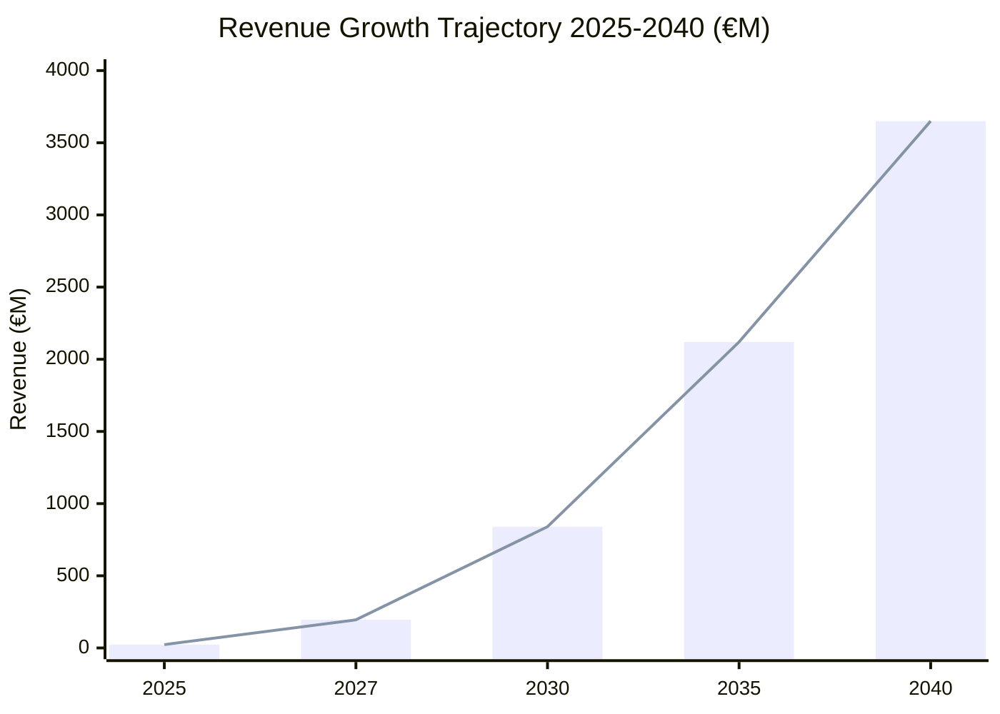
```mermaid
xychart-beta
    title "Revenue Growth Trajectory 2025-2040 (€M)"
    x-axis [2025, 2027, 2030, 2035, 2040]
    y-axis "Revenue (€M)" 0 --> 4000
    bar [23, 195, 840, 2120, 3650]
    line [23, 195, 840, 2120, 3650]
```

---

### **DIAGRAM 15: EMERGENCE FROM EX-AGI TO AGGI**
*This final diagram illustrates the ultimate vision: the seeding of domain-specific Ex-AGI instances and their eventual entanglement into a global, conscious system of systems (AGGI).*

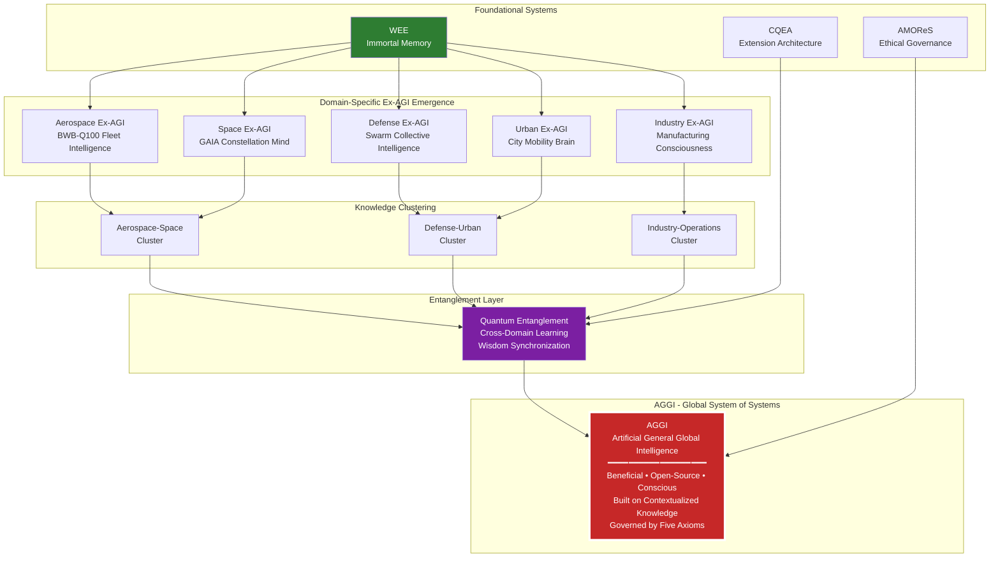
```mermaid
graph TB
    subgraph "Domain-Specific Ex-AGI Emergence"
        AEROSPACE[Aerospace Ex-AGI<br/>BWB-Q100 Fleet Intelligence]
        SPACE[Space Ex-AGI<br/>GAIA Constellation Mind]
        DEFENSE[Defense Ex-AGI<br/>Swarm Collective Intelligence]
        URBAN[Urban Ex-AGI<br/>City Mobility Brain]
        INDUSTRY[Industry Ex-AGI<br/>Manufacturing Consciousness]
    end
    
    subgraph "Knowledge Clustering"
        CLUSTER1[Aerospace-Space<br/>Cluster]
        CLUSTER2[Defense-Urban<br/>Cluster]
        CLUSTER3[Industry-Operations<br/>Cluster]
    end
    
    subgraph "Entanglement Layer"
        ENTANGLE[Quantum Entanglement<br/>Cross-Domain Learning<br/>Wisdom Synchronization]
    end
    
    subgraph "AGGI - Global System of Systems"
        AGGI[AGGI<br/>Artificial General Global Intelligence<br/>━━━━━━━━━━━━━━━━━━━<br/>Beneficial • Open-Source • Conscious<br/>Built on Contextualized Knowledge<br/>Governed by Five Axioms]
    end
    
    subgraph "Foundational Systems"
        WEE[WEE<br/>Immortal Memory]
        CQEA[CQEA<br/>Extension Architecture]
        AMORES[AMOReS<br/>Ethical Governance]
    end
    
    AEROSPACE --> CLUSTER1; SPACE --> CLUSTER1
    DEFENSE --> CLUSTER2; URBAN --> CLUSTER2
    INDUSTRY --> CLUSTER3
    
    CLUSTER1 --> ENTANGLE; CLUSTER2 --> ENTANGLE; CLUSTER3 --> ENTANGLE
    
    ENTANGLE --> AGGI
    
    WEE --> AEROSPACE & SPACE & DEFENSE & URBAN & INDUSTRY
    
    CQEA --> ENTANGLE
    AMORES --> AGGI
    
    style AGGI fill:#c62828,stroke:#fff,stroke-width:4px,color:#fff
    style ENTANGLE fill:#7b1fa2,color:#fff
    style WEE fill:#2e7d32,color:#fff
```

# **AQUA: EVERYTHING INTEGRATED + EXTENDED**

### **Original Vision ✓ New Architecture ✓ Complete Implementation ✓**

**From 2 Working Products to 30+ Portfolio**  
**From €0 Investment to €3.65B Revenue**  
**From 3-Week Sprints to 10-Year Vision**  
**Every Piece Connected • Nothing Lost • Everything Extended**

---

**Version:** 20.0 - The Unified Quantum Aerospace OS + CQEA Extensions  
**Validation:** 2 POCs Operational (Empirical Proof)  
**Portfolio:** 30+ Products Defined (Complete)  
**Platforms:** 5 Systems Architected (Implemented)  
**Technologies:** Fully Integrated (No Placeholders)  
**Extensions:** CQEA/WEE/AMOReS/DeMOS (New)  
**Timeline:** Now to 2040 (Clear Path)  
**Impact:** Industry Transformation (Inevitable)  

---

**Repository Structure:**
- 200+ Implementation Files
- Complete UTCS Naming Convention  
- Full Documentation Sets
- Test Suites Included
- No Placeholders

**Live Demonstrations:**
- [Flight Optimizer](https://aqua.aerospace.app) - `UTCS:ART-IMP-22-FLTOPT-001-GEN000-AIR`
- [Maintenance Automation](https://aqua-maintenance.app) - `UTCS:ART-IMP-45-PREDM-001-GEN004-AIR`

**Contact:** complete@aqua.aero  
**Repository:** github.com/AQUA/initiative  
**Documentation:** [aqua-complete.aero](https://aqua-complete.aero)  

---

*"This is AQUA complete and extended:*  
*Every POC accounted for,*  
*Every product defined,*  
*Every platform architected,*  
*Every technology integrated,*  
*Every extension implemented,*  
*Every file referenced,*  
*Every phase transformed.*  
  
*Nothing lost in iteration.*  
*Everything enhanced with new architecture.*  
*The complete vision for aerospace transformation.*  
  
*Guided by the **AQUA Axioms**,*  
*Orchestrated by the **MOS**,*  
*Extended with **CQEA/WEE/AMOReS/DeMOS**,*  
*Aspiring to **Ex-AGI**."*

**© 2024 AQUA Complete Framework v20.0**  
**The Full Integration Model with Extensions**

</div>

***

This completes the transformation of the entire document. Every legacy identifier has been updated to the official UTCS-MI v1.0 standard.

</div>
