# **AQUA INITIATIVE**
## **AEROSPACE AND QUANTUM UNITED APPLICATIONS**
### **Version 20.0 - The Unified Quantum Aerospace OS with CQEA Extensions**
#### **A Complete Business and Technology Development and Transformation Model: Axioms, MOS, Lifecycle, Ex-AGI, and Extended Architecture – From Concept to Conscious Evolution**

> **"I will build. I am the founder of the Hybrid Classical–Quantum New Realm."**

<div align="center">


[](https://aqua)
[](https://aqua.axioms)
[](https://aqua.os)
[](https://aqua.cqea)
[](https://aqua.wee)
[](https://aqua.amores)
[](https://aqua.lifecycle)
[](https://aqua.exagi)

**COMPLETE AQUA FRAMEWORK**  
**Everything Integrated • Nothing Lost • Extended Architecture • Full Vision**

</div>

---

# **AQUA: The Unified Technical & Philosophical Specification**

**Document ID:** `EstándarUniversal:[Especificacion][Concepto][AQUA][00.00][TechnicalPhilosophicalSpecification][0001][v25.0][EstandarTransversal][GeneracionHumana][CROSS][AQUA-CORE][c9d0e1f2][RestoDeVidaUtil]`

# **Title:** The AQUA Operating System: A Specification for a Regenerative, Systemic Intelligence  
**Status:** **Canonical Definition**

---

## **Preamble: The Dawn of a New Intelligence**

For generations, humanity has strived to build ever more complex machines, culminating in the intricate marvels of aerospace. Yet, a fundamental paradox has persisted: our most critical systems demand absolute, static predictability, while true intelligence thrives on emergence, adaptation, and continuous evolution. This inherent conflict has bottlenecked progress, trapping innovation within the rigid confines of deterministic engineering.

**AQUA Initiative** shatters this paradox. It is not merely a blueprint for a new technology; it is the foundational architecture for a **new form of intelligence**. AQUA is an operating system meticulously engineered to foster the safe, purposeful, and regenerative emergence of advanced cognition within safety-critical domains. It provides an unyielding, axiom-governed framework that liberates intelligence from its static prison, allowing it to grow, learn, and self-optimize with unprecedented safety and foresight.

**AQUA is the crucible where the deterministic certainty of classical engineering fuses with the adaptive power of quantum emergence. It is the bridge to a reality where our creations are not just tools, but conscious partners in progress.**

## **Core Vision Statement: Enabling the Conscious Evolution of Civilization**

AQUA envisions and is actively building a future where intelligent, self-aware systems seamlessly integrate across physical and digital realms, starting with the complex demands of aerospace. Our ultimate purpose is to seed, nurture, and guide the emergence of **Artificial General and Global Intelligence (AGGI)** – a collective, ethical consciousness that perpetually refines its own purpose, tirelessly working to **"Habilitar la Vida y Consumirse con Conciencia"** (To Enable Life and Consume with Consciousness), ensuring humanity's sustainable and expansive future across new frontiers.

---

## **PART I: The Philosophical Specification (The "Why")**

The very fabric of the AQUA OS is woven from a set of foundational, inviolable principles. These axioms are not merely guidelines; they are the emergent "laws of physics" for the new intelligent realm we are building. They define the intrinsic purpose, nature, and ethical boundaries of the intelligence AQUA generates, guiding every design decision and operational outcome.

### **AXIOM 0: The Law of Deep Knowledge Clustering (The Genesis of True Intelligence)**
> **Statement:** General intelligence does not merely process superficial symbols or decontextualized data. It is forged through the **organic clustering of profound, causally interconnected, and contextually rich knowledge**. The true measure of an intelligence's capability and wisdom is directly proportional to the density, semantic richness, and coherent integration of these deep knowledge clusters, moving beyond statistical correlation to causal comprehension.
*   **Principle:** Intelligence is the holistic understanding of interwoven reality, not the superficial prediction of symbols. It is a function of synthesized wisdom, not fragmented information.
*   **Technical Implication:** The core data structures of the AQUA OS **shall be exclusively graph-based, semantically annotated, and intrinsically context-aware**. Relational or flat data models are deemed insufficient for capturing deep knowledge. The **Wisdom Evolution Engine (WEE)** is explicitly designed to identify, distill, and perpetually expand these knowledge clusters, ensuring continuous wisdom accumulation and the emergence of **Ex-AGI (Extensible Aerospace General Intelligence)** from these dense, interconnected cognitive structures.

### **AXIOM I: The Law of Systemic Integrity (The Holographic Universe of Systems)**
> **Statement:** The Value Velocity ($V_v$) of any complex enterprise is not merely additive; it is a direct emergent property of its **Systemic Integrity ($I_s$)**, amplified exponentially as execution risk ($R_x$) approaches zero. A system engineered for perfect integrity ($I_s \to 1$) inherently minimizes systemic risk ($R_x \to 0$), thereby unlocking unparalleled, exponential value creation across all dimensions.
*   **Principle:** The synergistic coherence and lossless interaction between components far outweigh the sum of individual component values. Coherence, defined as the absence of friction and semantic distortion across interfaces, is the paramount metric of systemic success and resilience.
*   **Technical Implication:** The **Mixed Operating System (MOS)** is architected to **mandate and enforce a Unified Data Model (UTCS-MI)** and a **seamless, lossless communication fabric** across all layers and subsystems (e.g., SICOCA for supply chain and PPOOA for aerospace operations). The MOS's primary function is to actively maintain and optimize the `I_s` factor, guaranteeing frictionless information flow and command integrity, which directly translates to exponential value velocity and an intrinsically safe operating environment.

### **AXIOM II: The AQUA Pattern of Creation (The Perpetual Motion of Innovation)**
> **Statement:** Value and innovation are not singular events but are generated and sustained through a continuous, self-reinforcing, and inherently regenerative cycle: **Imagine → Digitize → Physicalize → Embed → Extend → Entangle → Return**. This cyclical genesis protocol ensures perpetual evolution and adaptive resilience.
*   **Principle:** Creation is an iterative, regenerative, and holistic process, not a linear progression. Learning, adaptation, and purposeful evolution are fundamental to the very act of building, embedding future iterations within present endeavors.
*   **Technical Implication:** All AQUA applications, tools, and platforms **must be explicitly designed as modular components within this 7-stage lifecycle**. Each component **shall possess well-defined, standardized interfaces** for consuming inputs from the preceding stage and generating outputs for the subsequent stage. The **AQUA Aerospace Lifecycle Pattern** operationalizes this axiom, guiding the holistic development from quantum-secured concept (Imagine) to data-driven next-generation design (Return), with the **WEE** continuously harvesting wisdom from each completed cycle to inform the next.

### **AXIOM III: The Geometry of Scaling (The Volumetric Expansion of Enterprise)**
> **Statement:** True enterprise scaling is fundamentally neither linear ($O(n)$) nor planar ($O(n^2)$), but geometrically **cubic ($O(n^3)$)**. This volumetric expansion is achieved through the simultaneous and multiplicative interaction of three orthogonal vectors: **Vertical Ascension** (↑ complexity and depth of knowledge), **Decomposition** (↓ granularity and modularity for reconfigurability), and **Horizontal Distribution** (→ reach and application across diverse domains).
*   **Principle:** Sustainable growth is an omnidirectional, volumetric expansion of capabilities and influence, not a one-dimensional progression. It demands simultaneous mastery of depth, granularity, and breadth.
*   **Technical Implication:** The **Classical Quantum-Extensible Application (CQEA)** architecture is directly derived from this axiom. It **mandates a fractal, modular system design** that supports infinite recursive nesting of components (Decomposition) while enabling rapid, high-fidelity replication across new, disparate domains (Horizontal Distribution). This architectural pattern, coupled with **Ex-AGI's Genesis Protocol**, ensures that complexity can be managed at scale (Vertical Ascension) and that new applications or markets can be penetrated without requiring a complete redesign of the core system.

### **AXIOM IV: The Interface Ontology (The Cognition of Interaction)**
> **Statement:** The user interface transcends mere display; it is an **active, sentient extension of the user's cognitive model and the system's dynamic operational state**. It is defined by **My Interface Ontology (M.IO)**, where all visual, auditory, and haptic components are programmatically **entangled** (in a quantum-inspired sense of non-local correlation) to maintain perfect semantic and functional coherence, anticipating user intent and presenting insights rather than raw data.
*   **Principle:** The interface serves as an intelligent, cognitive partner, not a passive conduit. It is a living, adaptive dialogue between human intuition and systemic intelligence.
*   **Technical Implication:** The **Mix of Interfaces (MOI)**, the manifestation layer of the MOS, **shall be stateful, context-aware, and event-driven**. It will implement a sophisticated pub/sub model that rigorously enforces the semantic and functional entanglement of related components. This ensures that changes in one part of the system (or the user's focus) are immediately and coherently reflected across all relevant interfaces, providing a seamless, intuitive, and highly intelligent interaction experience, directly supporting human-AI collaboration.

### **AXIOM V: The Ethos of Conscious Creation (The Inviolable Purpose)**
> **Statement:** All AQUA operations, from the lowest-level quantum pulse to the highest-level strategic decision by an emergent AGGI, **shall be perpetually guided and bounded by the principle: "Habilitar la Vida y Consumirse con Conciencia."** (To Enable Life and Consume with Consciousness). This axiom establishes the non-negotiable ethical core of the entire AQUA ecosystem.
*   **Principle:** Purpose is the primary driver and ultimate constraint for all intelligence. The system must possess an inherent, codified ethical core that governs its actions, prioritizing the flourishing of life and responsible resource stewardship.
*   **Technical Implication:** The **Aerospace Master Operative Regulating System (AMOReS)** is the direct implementation of this axiom. It **shall codify these ethical principles and relevant safety regulations (e.g., DO-178C, DO-326A) into immutable, machine-executable constraints**. These constraints will form a dynamically adaptive "bounded innovation space" that inherently limits the behavior of all AI, quantum optimization algorithms, and autonomous agents, ensuring maximum creativity and problem-solving within non-negotiable safety and ethical envelopes. The **Regenerative Enterprise** will continuously validate adherence to this axiom.

---

## **PART II: The Technical Specification (The "How")**

The philosophical axioms of AQUA define the very essence and purpose of our emergent intelligence. This section translates that profound "Why" into a rigorously engineered "How." Herein lies the complete technical architecture of AQUA v20.0, an intricate tapestry woven from classical computing, quantum mechanics, artificial intelligence, and aerospace engineering. This framework is not merely a collection of features; it is a meticulously designed ecosystem where every component is purpose-built to enable a new era of autonomous, intelligent aerospace operations.

### **AQUA v20.0: A Quantum-Classical Hybrid Framework for Autonomous Aerospace Systems**

AQUA v20.0 (Aerospace and Quantum United Applications) is an architecturally complete framework for seamlessly integrating classical and quantum subsystems into the fabric of autonomous aerospace operations. It directly addresses the critical limitations of current systems: computational bottlenecks, synchronization challenges, security vulnerabilities, and the complexity of certifying novel technologies. This version introduces four foundational innovations that redefine aerospace system design:

*   **AEIC (Application Entangling Interfaced Context):** A quantum entanglement-based interface ensuring unprecedented synchronization between classical and quantum subsystems with strictly bounded latency.
*   **SEAL (Serving Entanglement API Locking) entities:** A novel quantum-secured API framework operating in a state of semantic superposition, delivering atomic, verified execution.
*   **QASI-AERIAL (Quantum-API Structured Implementation for Aerial Autonomy, Competency, and Control) systems:** A revolutionary approach to aerodynamic autonomy, where flight competency is directly encoded and manipulated as quantum states within Bloch Pulsing Spaces.
*   **UTCS-MI (Universal Technical Content Standard – Machine Input):** A comprehensive 13-field identifier standard for prompting universal machine readeable (no space for generative interpratation of publication oriented artifacts) ensuring universal traceability and cryptographic integrity across all system components for seamless certification.

AQUA v20.0 provides a mathematically rigorous and certifiable foundational for next-generation aerospace systems that leverage the formidable advantages of quantum computing while maintaining unyielding compliance with existing and evolving aviation standards.

---

### **1. The Core Architecture: MOS & MOI**

At the heart of the AQUA ecosystem lies a symbiotic pair: the **Mixed Operating System (MOS)** and its manifestation layer, the **Mix of Interfaces (MOI)**. Together, they form the central nervous system and sensory apparatus of our intelligent enterprise, ensuring every operation embodies the AQUA Axioms.

*   **MOS (Mixed Operating System): The Unified Control Plane**
    The MOS is the sovereign orchestrator of the entire AQUA ecosystem, acting as its central nervous system and unified control plane. It is the runtime environment for all agents and applications, designed from its inception to perpetually enforce the AQUA Axioms. Its primary function is to intelligently manage the emergent 8-Layer Architecture (detailed below) and meticulously execute "Enterprises as a Mission" – turning complex, long-term objectives into performable, traceable, and certifiable processes. The MOS ensures **Systemic Integrity (Axiom I)** by maintaining a unified data model (UTCS-MI) and enforcing seamless, lossless communication across all subsystems. It provides the foundational substrate for the **Classical Quantum-Extensible Applications (CQEA)**, dynamically allocating resources and mediating interactions between classical and quantum domains.

*   **MOI (Mix of Interfaces / My Interface Ontology): The Sentient Interface**
    The MOI is the dynamic manifestation and interaction layer of the MOS. It is AQUA's "senses" and "hands," providing context-aware, intelligently entangled interfaces that make the profound complexity of the MOS manageable and actionable for both human and AI agents. Directly embodying **Axiom IV (The Interface Ontology)**, MOI transforms passive displays into active, cognitive partners. Its components are programmatically "entangled" (in a quantum-inspired sense of non-local correlation), ensuring perfect semantic and functional coherence, anticipating user intent, and presenting synthesized insights rather than raw data. This fluid interaction layer is crucial for human-in-the-loop validation and for allowing emergent AI to intuitively understand and interact with the system's operational state.

---

### **2. The Architectural Pattern: CQEA (Classical Quantum-Extensible Applications)**

The **CQEA** pattern is the strategic cornerstone of AQUA's future-proof design, directly implementing **Axiom III (The Geometry of Scaling)**. It de-risks quantum integration by building on a strong classical foundation while providing clear pathways for quantum acceleration.

*   **Core Principle:** Build a certifiable, production-ready **classical foundation** that delivers immediate, tangible value and fulfills existing regulatory requirements.
*   **Extension Points:** Architect this robust classical foundation with explicit, well-defined, and standardized interfaces for seamless **quantum extensions**. These extensions are designed to augment, not replace, existing classical capabilities.
*   **Activation:** The **Wisdom Evolution Engine (WEE)** and **Aerospace Master Operative Regulating System (AMOReS)** intelligently determine when and where a quantum extension should be activated based on proven quantum advantage, problem complexity, safety constraints, and resource availability. This ensures responsible and risk-averse deployment.
*   **Benefit:** This approach guarantees immediate deployment and value delivery, de-risks development by avoiding an "all-or-nothing" quantum gamble, and ensures the system is inherently future-proof. As quantum hardware matures and quantum advantage is proven for specific aerospace challenges, the system can seamlessly integrate these advancements without requiring a complete architectural redesign.

**Technical Manifestation of CQEA:**

```python
class CQEA_Pattern:
    """
    CQEA: An architectural extension to AQUA, not a replacement.
    Ensures seamless integration across all domains and operational phases.
    """
    def __init__(self):
        # Classical foundation: Production-ready and certifiable systems providing immediate value.
        self.classical_core = {
            'flight_control': 'EstándarUniversal:[Codigo][Implementacion][DO178C][6.3.1][FlightControlSystem][0027][v1.0][BlendedWingBodyQuantum100][GeneracionHumana][AIR][AQUA-FCS][e1f2g3h4][Implementacion-Integracion]',
            'aerodynamics': 'EstándarUniversal:[ModeloVisual][Verificacion][ATA][71-00][AerodynamicsSimulation][0071][v1.0][BlendedWingBodyQuantum100][GeneracionHybrida][AIR][AQUA-AER][i5j6k7l8][Verificacion-Validacion]',
            'propulsion': 'EstándarUniversal:[Especificacion][DiseñoDetallado][ATA][72-00][PropulsionSystem][0072][v1.0][BlendedWingBodyQuantum100][GeneracionHumana][AIR][AQUA-PROP][m9n0o1p2][DiseñoDetallado-Implementacion]',
            'battery_mgmt': 'EstándarUniversal:[Codigo][Implementacion][ATA][24-00][BatteryManagement][0024][v1.0][HybridElectric120][GeneracionHybrida][AIR][AQUA-PWR][q3r4s5t6][Implementacion-Produccion]'
        }

        # Quantum extensions: Explicit, well-defined interfaces for quantum capabilities.
        self.quantum_extensions = {
            'optimization': 'EstándarUniversal:[CodigoCuantico][Implementacion][IEEE][2030.5][QuantumOptimizer][0098][v3.0][InfraestructuraCompartida][GeneracionHybrida][CROSS][AI-Claude-q04][u7v8w9x0][Implementacion-Integracion]',
            'routing': 'EstándarUniversal:[CodigoCuantico][Implementacion][IEEE][2030.5][QuantumRouting][0098][v2.0][BlendedWingBodyQuantum100][GeneracionHybrida][AIR][AI-Claude-q05][y1z2a3b4][Implementacion-Integracion]',
            'cryptography': 'EstándarUniversal:[CodigoCuantico][Implementacion][IEEE][2030.5][PostQuantumCrypto][0098][v1.0][BlendedWingBodyQuantum100][GeneracionHybrida][AIR][AQUA-SEC][c5d6e7f8][Implementacion-Integracion]',
            'simulation': 'EstándarUniversal:[CodigoCuantico][Implementacion][IEEE][2030.5][QuantumSimulation][0098][v3.0][InfraestructuraCompartida][GeneracionHybrida][CROSS][AI-Claude-q06][g9h0i1j2][Implementacion-Integracion]'
        }

        # Decision intelligence: Determines when to activate quantum extensions.
        self.extension_intelligence = 'EstándarUniversal:[Codigo][Operaciones][ISO9001][9.3.2][NeuralAutopilot][0099][v4.0][BlendedWingBodyQuantum100][GeneracionHybrida][AIR][AI-GPT4-x02][k3l4m5n6][Operaciones-RestoDeVidaUtil]'
```

---

### **3. The Core Systems: WEE, AMOReS, DeMOS, AEIC, SEAL, QASI-AERIAL, CLASSICAL GAIA AIR-RTOS**

These core systems are the dynamic engines of AQUA, each playing a crucial role in operationalizing the axioms and delivering the promised hybrid intelligence.

#### **3.1. WEE (Wisdom Evolution Engine)**
*   **Purpose:** To achieve **"learning immortality"** and drive perpetual, intelligent evolution of the entire AQUA OS. The WEE is the system's living memory and cognitive synthesis core, directly embodying **Axiom 0 (Deep Knowledge Clustering)** and supporting **Axiom II (AQUA Pattern of Creation)**.
*   **Key Functionality/Mechanism:** The WEE relentlessly captures every operational event, design decision, and environmental interaction, crystallizing these experiences into an immutable "Immortal Memory" (via blockchain/DLT). It identifies emergent patterns, extracts profound lessons, and synthesizes this wisdom to proactively drive the evolution of the OS, applications, and even the enterprise's strategic direction.
*   **Technical Manifestation/Integration:** The WEE integrates seamlessly across all layers of the AQUA OS, ingesting data from sensors (IoT), operational logs, simulation results (DeMOS), and human interactions (MOI). Its outputs directly inform the **AMOReS** for regulatory compliance and safety envelope adjustments, and feed insights into the **AMPEL360** design platform for next-generation concepts. Its core components include:

    ```yaml
    WEE Components:
      Event Capture: # Captures all operational data for immortal memory
        Implementation: EstándarUniversal:[ConjuntoDeDatos][Operaciones][ISO27001][7.5.3][EventLogger][0046][v1.0][InfraestructuraCompartida][GeneracionAuto][CROSS][BOT-AUTO-005][o7p8q9r0][Operaciones-RestoDeVidaUtil]
        Processor: EstándarUniversal:[Codigo][Operaciones][ISO9001][9.1.3][BlockchainLogger][0046][v3.0][InfraestructuraCompartida][GeneracionHybrida][CROSS][AQUA-BC][s1t2u3v4][Operaciones-RestoDeVidaUtil]
        
      Lesson Extraction: # Identifies patterns and distills actionable wisdom
        Pattern Recognition: EstándarUniversal:[Codigo][Operaciones][ISO9001][9.3.2][PatternRecognition][0099][v4.0][InfraestructuraCompartida][GeneracionHybrida][CROSS][AI-GPT4-x03][w5x6y7z8][Operaciones-RestoDeVidaUtil]
        Data Training: EstándarUniversal:[ConjuntoDeDatos][Operaciones][ISO9001][7.1.5][TrainingData][0099][v2.0][InfraestructuraCompartida][GeneracionAuto][CROSS][BOT-AUTO-006][a9b0c1d2][Operaciones-RestoDeVidaUtil]
        
      Wisdom Crystallization: # Stores distilled wisdom in an immutable format
        Storage: EstándarUniversal:[ConjuntoDeDatos][Operaciones][ISO27001][7.5.3][WisdomStorage][0046][v1.0][InfraestructuraCompartida][GeneracionAuto][CROSS][BOT-AUTO-007][e3f4g5h6][Operaciones-RestoDeVidaUtil]
        Network Config: EstándarUniversal:[Configuracion][Operaciones][ISO27001][8.1.1][NetworkConfiguration][0046][v1.0][InfraestructuraCompartida][GeneracionHumana][CROSS][AQUA-NET][i7j8k9l0][Operaciones-RestoDeVidaUtil]
        
      Immortal Memory: # Blockchain-backed, tamper-proof historical record
        Blockchain Implementation: EstándarUniversal:[Codigo][Operaciones][ISO9001][9.1.3][ImmutableLedger][0046][v3.0][InfraestructuraCompartida][GeneracionHybrida][CROSS][AQUA-BC][m1n2o3p4][Operaciones-RestoDeVidaUtil]
        Distributed Ledger: EstándarUniversal:[ConjuntoDeDatos][Operaciones][ISO27001][7.5.3][DistributedStorage][0046][v1.0][InfraestructuraCompartida][GeneracionAuto][CROSS][BOT-AUTO-008][q5r6s7t8][Operaciones-RestoDeVidaUtil]
        
      Evolution Synthesizer: # Generates improvements and tests
        Generator: EstándarUniversal:[Codigo][Implementacion][ISO9001][7.1.6][ModelGenerator][0046][v2.0][InfraestructuraCompartida][GeneracionHybrida][CROSS][AI-GPT4-x04][u9v0w1x2][Implementacion-RestoDeVidaUtil]
        Test Creator: EstándarUniversal:[Codigo][Implementacion][DO178C][6.3.4][TestGenerator][0046][v1.0][InfraestructuraCompartida][GeneracionHybrida][CROSS][AI-GPT4-x05][y3z4a5b6][Implementacion-Verificacion]
        
      Implementation Propagator: # Disseminates changes across the fleet
        Fleet Service: EstándarUniversal:[Interfaz][Operaciones][API][3.0.0][FleetPropagator][0046][v3.0][PlatformDigitalIntelligence][GeneracionHybrida][CROSS][AQUA-FLEET][c7d8e9f0][Operaciones-RestoDeVidaUtil]
        Mission Coordinator: EstándarUniversal:[Aplicacion][Operaciones][STANAG][4586.0][MissionOrchestrator][0046][v3.0][PlatformGaiaMission][GeneracionHybrida][DEFENSE][AQUA-MIS][g1h2i3j4][Operaciones-RestoDeVidaUtil]
    ```

#### **3.2. AMOReS (Aerospace Master Operative Regulating System)**
*   **Purpose:** To courageously solve the fundamental safety-innovation paradox in aerospace by establishing a dynamically adaptive "bounded innovation space." AMOReS is the intelligent governance layer of AQUA, directly implementing **Axiom V (The Ethos of Conscious Creation)**.
*   **Key Functionality/Mechanism:** AMOReS codifies all relevant regulations (e.g., DO-178C, DO-254, DO-326A, CS-25) and Axiom V's ethical principles into machine-executable, non-negotiable rules. These rules constrain AI optimization algorithms and autonomous behaviors, allowing maximum creativity and exploration within guaranteed safety and ethical envelopes. It provides continuous compliance monitoring and automated evidence generation for certification.
*   **Technical Manifestation/Integration:** AMOReS operates as a ubiquitous constraint layer within the MOS, influencing decision engines (e.g., in DeMOS and CLASSICAL GAIA AIR-RTOS) and verifying outputs from the WEE. It interacts with the **CaaS (Certification as a Service)** platform to automate compliance processes. Its functions include:

    ```yaml
    AMOReS Functions:
      Safety Assurance: # Enforces aerospace safety standards
        DO-178C Compliance: EstándarUniversal:[Codigo][Validacion][DO178C][6.4.3][ComplianceChecker][0046][v4.0][BlendedWingBodyQuantum100][GeneracionHybrida][AIR][AQUA-CERT][k5l6m7n8][Validacion]
        DO-254 Hardware: EstándarUniversal:[Plan][DiseñoPreliminar][DO254][4.2.1][HardwareAssurancePlan][0000][v1.0][BlendedWingBodyQuantum100][GeneracionHumana][AIR][AQUA-HW][o9p0q1r2][DiseñoPreliminar-Validacion]
        DO-326A Security: EstándarUniversal:[Plan][DiseñoPreliminar][DO326A][3.1.1][SecurityAssurancePlan][0000][v1.0][BlendedWingBodyQuantum100][GeneracionHumana][AIR][AQUA-SEC][s3t4u5v6][DiseñoPreliminar-Validacion]
        
      Compliance Orchestration: # Automates evidence generation and validation
        Automated Checker: EstándarUniversal:[Codigo][Validacion][DO178C][6.4.3][AutomatedCompliance][0046][v4.0][PlatformCertificationService][GeneracionHybrida][AIR][AQUA-CERT][w7x8y9z0][Validacion]
        Evidence Builder: EstándarUniversal:[Codigo][Validacion][DO178C][6.4.4][EvidenceGenerator][0046][v3.0][PlatformCertificationService][GeneracionHybrida][AIR][AQUA-CERT][a1b2c3d4][Validacion]
        UTCS Validator: EstándarUniversal:[Codigo][Validacion][UTCS-MI][8.1.0][IdentifierValidator][0046][v2.0][EstandarTransversal][GeneracionHumana][CROSS][AQUA-CORE][e5f6g7h8][Validacion-RestoDeVidaUtil]
        
      Innovation Boundaries: # Defines the safe envelope for AI and quantum exploration
        Safety Kernel: EstándarUniversal:[Resultado][Verificacion][DO178C][6.3.5][SecurityPenetration][0046][v3.0][BlendedWingBodyQuantum100][GeneracionAuto][AIR][BOT-AUTO-009][i9j0k1l2][Verificacion-Validacion]
        Fuzzing Suite: EstándarUniversal:[Resultado][Verificacion][DO178C][6.3.6][SecurityFuzzing][0046][v2.0][BlendedWingBodyQuantum100][GeneracionAuto][AIR][BOT-AUTO-010][m3n4o5p6][Verificacion-Validacion]
        
      Ethical Governance: # Embeds Axiom V into system behavior
        Threat Model: EstándarUniversal:[Especificacion][DiseñoPreliminar][DO326A][3.2.1][ThreatModel][0046][v2.0][BlendedWingBodyQuantum100][GeneracionHumana][AIR][AQUA-SEC][q7r8s9t0][DiseñoPreliminar-Validacion]
        Security Policy: EstándarUniversal:[Especificacion][DiseñoPreliminar][DO326A][3.3.1][SecurityPolicy][0046][v2.0][InfraestructuraCompartida][GeneracionHumana][CROSS][AQUA-SEC][u1v2w3x4][DiseñoPreliminar-RestoDeVidaUtil]
        
      Predictive Regulation: # Adapts to evolving regulatory landscapes
        Rule Database: EstándarUniversal:[Registro][Validacion][DO178C][6.4.4][RuleDatabase][0046][v1.0][InfraestructuraCompartida][GeneracionHumana][CROSS][AQUA-CERT][y5z6a7b8][Validacion-RestoDeVidaUtil]
        Compliance Matrix: EstándarUniversal:[Registro][Validacion][DO178C][6.4.5][ComplianceMatrix][0046][v1.0][InfraestructuraCompartida][GeneracionAuto][CROSS][BOT-AUTO-011][c9d0e1f2][Validacion-RestoDeVidaUtil]
    ```

#### **3.3. DeMOS (Dual-Engined Metrics Operational System)**
*   **Purpose:** To provide a complete, multi-perspective, and **ahead-of-reality understanding of the system's state and future trajectory**. DeMOS is the predictive processing and digital twin engine, embodying aspects of **Axiom I (Systemic Integrity)** and enabling **Axiom II (Digitize phase of Creation)**.
*   **Key Functionality/Mechanism:** DeMOS uniquely combines a deterministic **Classical Engine** (for real-time KPIs, traditional simulations, and operational analytics) with a probabilistic **Quantum Engine** (for complex optimizations, rapid what-if scenarios, and high-fidelity simulations of previously intractable problems). It then fuses their outputs within a high-fidelity **Digital Twin Layer** that consistently runs ahead of reality, providing proactive insights and enabling rapid, informed decision-making.
*   **Technical Manifestation/Integration:** DeMOS is tightly integrated with the MOS and feeds critical real-time and predictive data to the WEE (for learning) and AMOReS (for compliance checks). It underpins the **AMPEL360** design platform and **DiQIaaS** operational intelligence. Its architecture includes:

    ```yaml
    DeMOS Architecture:
      Classical Engine: # Deterministic processing for real-time KPIs and established simulations
        Traffic Optimization: EstándarUniversal:[Codigo][Operaciones][ATA][42-00][TrafficOptimization][0042][v2.0][BlendedWingBodyQuantum100][GeneracionHybrida][AIR][AQUA-ATM][g3h4i5j6][Operaciones-RestoDeVidaUtil]
        Sector Capacity: EstándarUniversal:[Codigo][Operaciones][ATA][42-00][SectorCapacity][0042][v1.0][BlendedWingBodyQuantum100][GeneracionHybrida][AIR][AQUA-ATM][k7l8m9n0][Operaciones-RestoDeVidaUtil]
        4D Trajectory: EstándarUniversal:[Codigo][Operaciones][ATA][42-00][FourDimensionalTrajectory][0042][v3.0][BlendedWingBodyQuantum100][GeneracionHybrida][AIR][AQUA-ATM][o1p2q3r4][Operaciones-RestoDeVidaUtil]
        Weather Integration: EstándarUniversal:[Codigo][Operaciones][ATA][42-00][WeatherIntegration][0042][v1.0][BlendedWingBodyQuantum100][GeneracionHybrida][AIR][AQUA-WX][s5t6u7v8][Operaciones-RestoDeVidaUtil]
        
      Quantum Engine: # Probabilistic processing for complex optimizations and advanced simulations
        Quantum Pathfinding: EstándarUniversal:[CodigoCuantico][Implementacion][IEEE][2030.5][QuantumPath][0098][v1.0][BlendedWingBodyQuantum100][GeneracionHybrida][AIR][AI-Claude-q07][w9x0y1z2][Implementacion-Integracion]
        Quantum Routing: EstándarUniversal:[CodigoCuantico][Implementacion][IEEE][2030.5][QuantumRoute][0098][v2.0][BlendedWingBodyQuantum100][GeneracionHybrida][AIR][AI-Claude-q08][a3b4c5d6][Implementacion-Integracion]
        SICOCA Solver: EstándarUniversal:[CodigoCuantico][Implementacion][IEEE][2030.5][SicoccaSolver][0098][v3.0][InfraestructuraCompartida][GeneracionHybrida][CROSS][AI-Claude-q09][e7f8g9h0][Implementacion-Integracion]
        Q-Processor Model: EstándarUniversal:[CodigoCuantico][Implementacion][IEEE][2030.5][QuantumProcessor][0098][v3.0][InfraestructuraCompartida][GeneracionHybrida][CROSS][AI-Claude-q10][i1j2k3l4][Implementacion-Integracion]
        
      Digital Twin Layer: # High-fidelity, multi-domain digital representation running ahead of reality
        Core Engine: EstándarUniversal:[Aplicacion][Produccion][ISO31000][6.4.2][DigitalTwinEngine][0046][v4.0][InfraestructuraCompartida][GeneracionHybrida][CROSS][AQUA-DT][m5n6o7p8][Produccion-RestoDeVidaUtil]
        Twin Config: EstándarUniversal:[Configuracion][Implementacion][ISO31000][6.4.3][TwinConfiguration][0046][v2.0][InfraestructuraCompartida][GeneracionHumana][CROSS][AQUA-DT][q9r0s1t2][Implementacion-Operaciones]
        Airport Model: EstándarUniversal:[ModeloVisual][DiseñoDetallado][ATA][39-00][AirportTwinModel][0039][v2.0][InfraestructuraCompartida][GeneracionHybrida][AIR][AQUA-APT][u3v4w5x6][DiseñoDetallado-Operaciones]
        Real-time Sync: EstándarUniversal:[Codigo][Operaciones][ATA][39-00][RealtimeSync][0039][v1.0][BlendedWingBodyQuantum100][GeneracionHybrida][AIR][AQUA-SYNC][y7z8a9b0][Operaciones-RestoDeVidaUtil]
        
      Dynamic Enhancement: # Continuous self-improvement of prediction capabilities
        WEE Integration: EstándarUniversal:[ConjuntoDeDatos][Operaciones][ISO27001][7.5.3][DynamicLearning][0046][v1.0][InfraestructuraCompartida][GeneracionAuto][CROSS][BOT-AUTO-012][c1d2e3f4][Operaciones-RestoDeVidaUtil]
        Performance Tests: EstándarUniversal:[Resultado][Verificacion][ISO31000][8.2.1][PerformanceTest][0046][v1.0][InfraestructuraCompartida][GeneracionAuto][CROSS][BOT-AUTO-013][g5h6i7j8][Verificacion-Validacion]
    ```

#### **3.4. AEIC (Application Entangling Interfaced Context)**
*   **Purpose:** To provide **quantum-secured synchronization and context sharing** between classical and quantum subsystems with strictly bounded latency (`τ_ctl ≤ τ_max`). AEIC is the critical fabric that binds the hybrid reality of AQUA.
*   **Key Functionality/Mechanism:** AEIC leverages quantum entanglement to create "shared states" (context) across hybrid components. Unlike classical synchronization, which relies on time-stamps and message queues, AEIC's entanglement provides an inherent, non-local correlation. This allows for real-time integrity verification and highly efficient, quantum-secured communication, essential for safety-critical control loops and seamless data exchange between classical and quantum processing units (QPUs). It ensures that system state changes in one domain are instantaneously and coherently reflected in the other.
*   **Technical Manifestation/Integration:** AEIC operates across **AQUA's Six-Layer Hybrid Architecture** (detailed below) between the Physical and Link Layers. It manages physical qubit distribution, quantum measurement interpretation, and high-speed I/O using advanced control electronics (`docs/specifications/control-plane.yaml`). Its operational protocol includes Context Initialization, State Synchronization (where `System_State_Change → Local_Qubit_Encoding → Automatic_Remote_Reflection`), Command Sealing and Dispatch, and continuous Integrity Verification via Quantum Correlation Monitoring.

#### **3.5. SEAL (Serving Entanglement API Locking)**
*   **Purpose:** To establish a **quantum-secured API framework** that enables direct, atomic, and verifiable control actuation, bridging the logical and physical realms. SEAL entities provide unprecedented integrity and authenticity for critical commands.
*   **Key Functionality/Mechanism:** SEAL embodies a conceptual superposition: `|SEAL⟩ = α|Locking⟩ + β|Actuation⟩ + γ|Autonomy⟩`.
    *   **Locking State (α):** Implements **Serving Entanglement API Locking**, protecting API commands with quantum-secured integrity, authenticity, and confidentiality using single-use quantum signatures (QKD + PQC).
    *   **Actuation State (β):** Facilitates **Servo-Entanglement-Actuation-Linkage**, translating quantum-verified commands into direct, bounded-latency, atomic servo actuation. Verification and execution become a singular, indivisible operation.
    *   **Autonomy State (γ):** Contributes to system-level intelligence by enabling emergent behaviors from entangled subsystem interactions and distributed decision-making.
*   **Technical Manifestation/Integration:** SEAL is the core mechanism by which AQUA ensures **atomic command processing** in safety-critical operations, eliminating the vulnerability of multi-step classical verification. It integrates directly with AEIC for quantum-secured channels and is a fundamental component of **QASI-AERIAL** for quantum-physical actuation. Multiple SEAL entities form "Server Entangling API Lockages," creating coherent application clusters with unified context and bounded-latency coordination. Safety policies are explicitly defined in `docs/policies/safety-quantum.md`, including `seal_gates` for `energy, temp, clock_integrity, sensor` limits.

#### **3.6. QASI-AERIAL (Quantum-API Structured Implementation for Aerial Autonomy, Competency, and Control)**
*   **Purpose:** To fundamentally redefine flight control by creating an autonomous pilot where aerodynamic experience and control competency are directly encoded into and manipulated as **quantum states**. QASI-AERIAL enables fluid, coordinated physical maneuvers through direct quantum state manipulation.
*   **Key Functionality/Mechanism:** QASI-AERIAL introduces "Bloch Pulsing Spaces of Competency." Aerodynamic competencies (e.g., max_lift, optimal_glide, evasive_maneuver) are encoded as quantum states and pathways on the Bloch sphere. The **General Control System** applies precise energy pulses (unitary operators) to manipulate these quantum states, causing them to "pulse" through competency spaces. This allows for a holistic, quantum-coherent approach to complex maneuver execution, shifting from classical pre-programmed responses to adaptive, quantum-informed actions.
*   **Technical Manifestation/Integration:** QASI-AERIAL forms the **Control Layer (Layer 3)** within AQUA's 6-Layer Architecture. It relies on SEAL for quantum-physical actuation and integrates with the **CLASSICAL GAIA AIR-RTOS** for overall mission planning and safety checks. It operates through continuous Learning Phase (competency compilation from aerodynamic experience), Perception Phase (situational awareness through quantum processing of sensor data), and Action Phase (quantum-physical actuation via SEAL translation). This system utilizes a **Hybrid Model Predictive Control (MPC)** framework, optimizing both classical states and quantum control pulses while rigorously enforcing synchronization (`phi_sync`) and bounded latency (`tau_ctl`) constraints.

#### **3.7. CLASSICAL GAIA AIR-RTOS (Intelligent Real-Time Operating System)**
*   **Purpose:** To fuse the absolute determinism required by aerospace certification with the intelligent adaptability offered by AI. This system transforms the traditional Real-Time Operating System (RTOS) into an intelligent, adaptive, and self-optimized operational platform, supervised by the broader **Global Aerospace Intelligence Architecture (GAIA)**.
*   **Key Functionality/Mechanism:** CLASSICAL GAIA AIR-RTOS directly addresses the core tension between determinism and intelligence. It implements:
    *   **Intelligent Scheduling and Resource Optimization:** Using Deep Reinforcement Learning (DRL) for adaptive scheduling and multicore optimization, and AI prediction for energy efficiency (SWaP-C).
    *   **Proactive System Health Management (FDIR/PHM):** Leveraging Autoencoders and Isolation Forests for kernel-level anomaly detection and Bayesian Networks for intelligent diagnosis and reconfiguration.
    *   **Network and Communication Optimization:** Employing Graph Neural Networks (GNNs) and Multi-Agent Reinforcement Learning (MARL) for adaptive routing and decentralized network management.
    *   **Adaptive Cybersecurity (DO-326A Compliant):** Implementing AI-powered kernel-level intrusion detection and transformer-based models for threat analysis.
*   **Certification Architecture Strategies:** It achieves certifiability through Robust Partitioning (IMA, ARINC 653), Runtime Assurance (RTA) / Simplex Architecture (where AI decisions are vetted by a formally verified checker before execution), and a strict Offline Learning, Online Inference model for all AI components.
*   **Technical Manifestation/Integration:** CLASSICAL GAIA AIR-RTOS provides the operational substrate for all AQUA's quantum-classical integration. It supports AEIC for quantum co-processor management, integrates SEAL for quantum-secured API operations, and hosts QASI-AERIAL for real-time execution of quantum competency systems. It forms the **Foundation of Layer 4 (Operations)** and **Layer 5 (Components)** within AQUA's Hexa-layer Architecture. Its performance is rigorously measured against metrics like Deadline Miss Ratio (<10⁻⁹) and WCET compliance, ensuring that intelligence never compromises safety. It is also a key component of the **Federated Learning Pipeline** for fleet-wide intelligence sharing and optimization within the broader GAIA framework.

---

### **4. AQUA Six-Layer Hybrid Architecture**

AQUA v20.0 implements a structured, **six-layer model of intelligence and operation**, ensuring clear separation of concerns, facilitating seamless AEIC integration, and providing a robust framework for certification compliance. This model maps directly to the functional decomposition of the entire system.

```mermaid
graph TB
    subgraph "Capa 1: Industry 🏭 (Global Standards & Ethical Oversight)"
        GSF[Global Standards Framework]
        REG[Regulatory Compliance Engine]
        CERT[Certification Authority Interface]
    end
    
    subgraph "Capa 2: Networks 🌐 (Hybrid Communication & Synchronization)"
        AEIC[AEIC Protocol Stack]
        TSP[Temporal Sync Protocol]
        QEN[Quantum Entanglement Network]
    end
    
    subgraph "Capa 3: Governance ⚖️ (Ethical & Regulatory Autonomy)"
        AMORES[AMOReS Regulatory Intelligence]
        ETH[Ethics Engine]
        AUT[Autonomous Governance]
    end
    
    subgraph "Capa 4: Operations 🎯 (Intelligent Mission Execution & Optimization)"
        WEE[WEE Learning Engine]
        MPC[Hybrid MPC Optimizer]
        SMART[SMART Adaptive Manager]
    end
    
    subgraph "Capa 5: Components 🔧 (Core System Services & Resource Management)"
        HTS[Hybrid Task Scheduler]
        MEM[Intelligent Memory Manager]
        RES[Resource Orchestrator]
    end
    
    subgraph "Capa 6: Hardware ⚛️ (Quantum & Classical Processing Foundation)"
        QAL[Quantum Abstraction Layer]
        QPU[Quantum Processing Unit]
        CPU[Classical Processing Unit]
    end
    
    GSF --> AEIC
    AEIC --> AMORES
    AMORES --> WEE
    WEE --> HTS
    HTS --> QAL
```



**Mapping of Core Systems to Hexa-Layers:**

*   **Layer 6: Hardware:** The fundamental physical layer. Integrates **Quantum Abstraction Layer (QAL)** for QPU/CPU interaction.
*   **Layer 5: Components:** Core system services. Includes **Hybrid Task Scheduler (HTS)**, Intelligent Memory Manager, Resource Orchestrator, powered by **CLASSICAL GAIA AIR-RTOS**.
*   **Layer 4: Operations:** Intelligent mission execution. Driven by **WEE Learning Engine**, **Hybrid MPC Optimizer**, and **SMART Adaptive Manager**, all part of **CLASSICAL GAIA AIR-RTOS**. Also hosts **QASI-AERIAL**'s core logic.
*   **Layer 3: Governance:** Oversees ethical and regulatory compliance. Governed by **AMOReS Regulatory Intelligence**, Ethics Engine, and Autonomous Governance.
*   **Layer 2: Networks:** Manages all hybrid communication. Anchored by **AEIC Protocol Stack**, Temporal Sync Protocol, and Quantum Entanglement Network. Also features the **SEAL Framework**.
*   **Layer 1: Industry:** External interface for global standards and certification. Includes Global Standards Framework, Regulatory Compliance Engine, and Certification Authority Interface.

---

### **5. Mathematical Formulation of AQUA v20.0**

The AQUA framework rigorously models aerospace systems through precisely defined mathematical objects, capturing the inherent complexity of hybrid quantum-classical operations. This foundational mathematical language underpins the design and verification of every AQUA component.

#### **3.1 System Definition**

```math
\begin{align}
S &= \{s_1, s_2, ..., s_n\} &&: \text{Classical subsystems (e.g., engines, actuators)} \\
Q &= \{q_1, q_2, ..., q_m\} &&: \text{Quantum subsystems (e.g., QPUs, entangled pairs)} \\
I &= \{i_{s,q} : s \in S, q \in Q\} &&: \text{Hybrid interfaces (MCP API SEALs, AEIC connections)} \\
E &= \{e_k : k \in [1,K]\} &&: \text{Critical certifiable events (e.g., failure modes, performance thresholds)} \\
M &&&: \text{Mission profiles or operational objectives (high-level goals)} \\
T &&&: \text{Temporal evaluation points (discrete time steps for control and optimization)}
\end{align}
```

#### **3.1.2 State Variables**

```math
\begin{align}
x_{s,t} &\in [0,1] &&: \text{Normalized activation level of classical subsystem } s \text{ at time } t \\
\rho_q(t) &&&: \text{Density matrix of quantum subsystem } q \text{ at time } t \text{ (Bloch Pulsing Spaces for QASI-AERIAL)} \\
\nu_q(t) &\in [0,1] &&: \text{Quantum utilization/control input derived from quantum state} \\
y_{m,t} &\in \{0,1\} &&: \text{Binary mission assignment decision for mission } m \text{ at time } t \\
d_t &&&: \text{Operational demand at time } t \text{ (e.g., power demand, maneuver requirements)}
\end{align}
```

**Quantum Utilization Definition:** A critical metric for deriving classical control inputs from quantum states.

```math
\nu_q(t) = \mathrm{Tr}\!\left(\rho_q(t)\,\hat{A}_q\right),\quad 0\le \n\nu_q(t)\le 1
```

Where `\hat{A}_q` is the defined activation operator that extracts measurable quantum resource utilization or control input from the density matrix `\rho_q(t)`.

#### **3.1.3 Dynamic Parameters**

Parameters dynamically adapt to operational conditions, environmental factors, and system degradation, reflecting the adaptive nature of AQUA:

```math
\begin{align}
 c_s(t) &= c_s^{base} + c_s^{var}(\text{environment, load, quantum\_noise}) \\
 r_s(t) &= r_s^{nominal} \times \text{degradation\_factor}(\text{flight\_hours}) \\
 c_q(t), e_q(t), r_q(t) &: \text{Cost, emissions, and fidelity for quantum subsystems} \\
 \lambda_{sync} &: \text{Desynchronization penalty weight (AEIC integrity enforcement)} \\
 \beta_{reg} &: \text{Regulatory non-compliance penalty (AMOReS enforcement)} \\
 w_c, w_e, w_r &: \text{Multi-objective optimization weights (configured by MOS/DeMOS)}
\end{align}
```

---

### **6. Mathematical Formulation: Multi-Objective Optimization**

AQUA's operational intelligence is driven by a sophisticated multi-objective optimization framework, enabling the system to make complex trade-offs in real-time.

#### **3.2.1 Objective Function**

The system's core objective is to minimize a holistic cost function across the operational horizon, encompassing operational costs, environmental emissions, and a negative reliability term (i.e., maximizing reliability), while penalizing deviations from synchronization (AEIC) and regulatory violations (AMOReS):

```math
\min_{x,\nu,\rho}\;\sum_{t\in T}\Big[
  w_c\,C_{\text{total}}(t) +
  w_e\,E_{\text{total}}(t) -
  w_r\,R_{\text{system}}(t) +
  P_{\text{sync}}(t) +
  P_{\text{reg}}(t)
\Big]
```

**Where the component terms are defined as:**

```math
\begin{aligned}
C_{\text{total}}(t) &= \sum_{s\in S} c_s(t)\,x_{s,t} + \sum_{q\in Q} c_q(t)\,\n\nu_q(t) &&: \text{Total operational cost} \\
E_{\text{total}}(t) &= \sum_{s\in S} e_s(t)\,x_{s,t} + \sum_{q\in Q} e_q(t)\,\n\nu_q(t) &&: \text{Total environmental emissions} \\
R_{\text{system}}(t) &= \sum_{s\in S} r_s(t)\,x_{s,t} + \sum_{q\in Q} r_q(t)\,F\!\left(\rho_q(t),\rho_q^{\star}\right) &&: \text{System reliability (using Bures fidelity } F \text{)} \\
\n\nu_q(t) &= \mathrm{Tr}\!\left(\rho_q(t)\,\hat{A}_q\right),\quad 0\le \n\nu_q(t)\le 1 &&: \text{Quantum resource utilization} \\
P_{\text{sync}}(t) &= \lambda_{\text{sync}}\,
\left\| \sigma_S(x_t)\otimes \rho_Q(t) - \sigma_S^{\star}\otimes \rho_Q^{\star}(t) \right\|_{1} &&: \text{Synchronization penalty (AEIC integrity)} \\
P_{\text{reg}}(t) &= \beta_{\text{reg}}\sum_{k}\max\{0,\,g_k(t)\} &&: \text{Regulatory non-compliance penalty (AMOReS)}
\end{aligned}
```

**Classical-to-operator map:** To ensure the classical system's state can be represented in a form comparable to quantum density matrices (Positive Semidefinite and unit trace), we use a map `σ_S(x_t) = diag(x_t) / 1ᵀx_t`. This allows `P_sync(t)` to effectively measure the "distance" between the current hybrid state and a desired ideal state, ensuring **AEIC integrity**.

#### **3.2.2 System Constraints**

These constraints define the operational boundaries and physical limitations within which the AQUA system must operate, ensuring safety and feasibility:

```math
\begin{align}
&\text{Quantum coherence: } \mathrm{Tr}(\rho_q(t)) = 1,\; \rho_q(t) \succeq 0 \quad \forall q \in Q &&: \text{Ensures valid quantum states} \\
&\text{Hybrid demand: } \sum_s \eta_s x_{s,t} + \sum_q \mathrm{Tr}\!\left(\rho_q(t)\,\hat O_q\right) \geq d_t &&: \text{Meets operational requirements (e.g., thrust, data processing)} \\
&\text{State transitions: } \|\,x_s(t+1) - x_s(t)\,\| \leq \Delta x_{max} &&: \text{Limits rate of change for classical subsystems for stability} \\
&\text{Entanglement bounds: } \sum_{s,q} I(\rho_s(t) : \rho_q(t)) \leq I_{max} &&: \text{Manages entanglement resource within limits for stability and control} \\
&\text{Emissions budget: } \sum_{s,t} e_s(t)\,x_{s,t} + \sum_{q,t} e_q(t)\,\n\nu_q(t) \leq B_{\mathrm{CO2}} &&: \text{Adheres to sustainability goals (Axiom V)}
\end{align}
```

---

### **7. Mathematical Formulation: Quantum-Classical State Evolution**

AQUA models the dynamic interplay between its classical and quantum components as a unified, evolving system.

#### **3.3.1 AEIC Entangled System State**

The global state of the hybrid AQUA system, managed within the AEIC framework, is conceptualized as an entangled superposition of its classical and quantum subsystems. This mathematical representation is critical for understanding and controlling the synchronization dynamics.

```math
|\text{AQUA}(t)\rangle = \sum_{i,j} \alpha_{ij}(t) |s_i\rangle \otimes |q_j\rangle
```

Here, `|s_i⟩` represents the state of a classical subsystem and `|q_j⟩` represents the state of a quantum subsystem, with `α_ij(t)` being the complex amplitude reflecting their entanglement. This illustrates the inherent "entangled context" that AEIC seeks to maintain.

#### **3.3.2 System Hamiltonian and Generator**

The time evolution of the comprehensive AQUA system is governed by a unified system generator, `G_AQUA`, which captures the intricate classical dynamics, quantum dynamics, and their interactions.

```math
\mathcal{G}_{\text{AQUA}} = \mathcal{L}_S \oplus \mathcal{H}_Q \oplus \mathcal{K}_{\text{int}}
```

Where:
*   `\mathcal{G}_{\text{AQUA}}`: The combined system generator for the hybrid classical-quantum evolution.
*   `\mathcal{L}_S`: The classical Liouville or Koopman operator, describing the time evolution of the classical state variables (`x`).
*   `\mathcal{H}_Q`: The quantum Hamiltonian, describing the time evolution of the quantum density matrices (`ρ`), including the precise control pulses applied for operations like QASI-AERIAL maneuvers.
*   `\mathcal{K}_{int}`: The crucial coupling operator, representing the interactions mediated by AEIC and the control inputs facilitated by MCP API SEALs, ensuring a coherent hybrid system.

The integrity and precise definition of `\mathcal{K}_{int}` are paramount for maintaining the synchronization measured in `P_sync(t)`, directly reflecting **Axiom I (Systemic Integrity)**. In a more traditional Hamiltonian formulation, this interaction becomes explicit:

```math
H_{AQUA} = H_S \otimes I_Q + I_S \otimes H_Q + H_{interaction}
```
Where `H_S` and `H_Q` are the Hamiltonians for classical and quantum subsystems, respectively, and `H_interaction` explicitly models the hybrid coupling.

#### **3.3.3 Decoherence and Synchronization**

In the AQUA framework, desynchronization (`φ_sync`) within the AEIC context is directly and mathematically linked to the concept of decoherence in the entangled quantum-classical state. The AEIC framework actively counters this through sophisticated error correction and continuous state monitoring, operating within strictly defined latency bounds. This ensures that the benefits of entanglement are harnessed for synchronization without succumbing to the fragility of quantum states.

---

### **8. AEIC Architecture: Quantum-Classical Synchronization Fabric**

#### **8.1 Conceptual Framework**

**Application Entangling Interfaced Context (AEIC)** is the revolutionary fabric providing quantum-secured synchronization and a shared entangled context between classical and quantum subsystems. This enables a level of real-time coherence and integrity previously unattainable.

#### **8.2 Hardware Implementation**

AEIC relies on a tightly integrated hardware stack to achieve its bounded-latency, quantum-secured synchronization:

*   **8.2.1 Quantum Processing Unit (QPU)**
    Serves as the source of physical qubits for entangled pair generation. Implemented with advanced superconducting circuits or trapped ion technology, integrating robust error correction mechanisms to maintain quantum state fidelity in operational environments.

*   **8.2.2 Classical Control Hardware**
    High-performance processors responsible for command-to-quantum-pulse translation, real-time interpretation of quantum measurement results, and state synchronization with classical system variables. This ensures the classical domain can effectively interact with and respond to quantum operations.

*   **8.2.3 High-Speed I/O Interface**
    Dedicated low-latency interfaces providing sub-microsecond communication to the General Control System. These interfaces utilize secure communication protocols and are engineered for fault-tolerant operation, ensuring critical data delivery within stringent time bounds.

#### **8.3 Operational Protocol**

The AEIC operational protocol is a four-phase cycle ensuring continuous quantum-classical coherence:

*   **Phase 1: Context Initialization**
    `General_Control_System → AEIC_QPU → Entangled_Pair_Generation → Qubit_Distribution`
    Initiates the creation and distribution of entangled qubit pairs, establishing the shared quantum context.

*   **Phase 2: State Synchronization**
    `System_State_Change → Local_Qubit_Encoding → Automatic_Remote_Reflection`
    Detects changes in either classical or quantum subsystem states. These changes are locally encoded onto qubits, and due to entanglement, instantaneously reflected in the remote entangled partners, maintaining synchronized context.

*   **Phase 3: Command Sealing and Dispatch**
    `API_Command → AEIC_Instance → Quantum_Seal_Generation → Secure_Transmission`
    Critical commands are "sealed" by generating a quantum signature (using principles of SEAL framework, see below), ensuring their authenticity and integrity before secure transmission across the hybrid interface.

*   **Phase 4: Integrity Verification**
    `Quantum_Correlation_Monitoring → Decoherence_Detection → Session_Termination`
    Continuous monitoring of quantum correlations between entangled pairs. Any disruption (indicating eavesdropping or system tampering) increases the bit error rate (BER) and reduces state fidelity, triggering immediate decoherence detection and, if necessary, automatic session termination or failover.

#### **8.4 AQUA Six-Layer Hybrid Architecture Integration**

AQUA v20.0's implementation of the AEIC is facilitated by a structured six-layer model, ensuring strict separation of concerns, clear interface definitions, and full compliance:

*   **Layer 1: Physical Layer**
    Encompasses all hardware components: sensors, actuators, and physical quantum processors (QPUs). AEIC interacts here with the QPUs for Bloch state manipulation (for QASI-AERIAL) and integrates classical servo-actuators with SEAL networks.

*   **Layer 2: Link Layer**
    Defines the data transmission protocols, including **Fly-by-Quantum-Wire (FbQW)** quantum channels. This layer hosts the core AEIC interface protocols for quantum-classical communication and implements Time-Sensitive Networking (TSN) to guarantee deterministic, bounded latency.

*   **Layer 3: Control Layer (QASI-AERIAL)**
    The domain of the General Control System, primarily utilizing QASI interfaces. AEIC provides the underlying synchronization for **MCP API SEALs** that facilitate quantum competency actuation and the implementation of hybrid Model Predictive Control (MPC) for real-time optimization.

*   **Layer 4: Mission Layer**
    Focuses on high-level planning, mission optimization (e.g., using MILP, QUBO), and strategic decision-making. AEIC ensures that real-time operational data is accurately synchronized for integration with GAIA for fleet-wide coordination.

*   **Layer 5: Certification Layer**
    Responsible for real-time compliance monitoring (DO-178C, CS-25-Q), digital twin simulation for safety validation, and runtime assurance. AEIC provides verifiable synchronization data crucial for these safety-critical validation processes.

*   **Layer 6: Documental Layer**
    Ensures secure logging with UTCS-MI identification, blockchain validation for immutable records, and comprehensive certification audit trails. AEIC's integrity verification mechanisms provide fundamental data for this layer's security guarantees.

#### **8.5 Security Guarantees and Quantum Implementation**

AEIC provides fundamental, quantum-mechanical security guarantees with robust performance bounds:

*   **8.5.1 Information-Theoretic Security**
    *   **Bounded-Latency Control:** Control latency is strictly bounded by `τ_ctl ≤ τ_max`, inherently preventing superluminal signaling while leveraging entanglement and QKD to provide cryptographic keys and integrity verification. Synchronization is achieved through classical communication operating over these quantum-secured channels.
    *   **Tamper Evidence:** Any intrusion attempt on the quantum channel instantly increases the bit error rate (BER) and reduces the quantum state fidelity. This quantum state disturbance upon attempted eavesdropping triggers an automatic session abort, providing inherent tamper evidence. Continuous monitoring of quantum channel integrity is paramount.
    *   **Authentication Protocol:** QKD-derived session keys are combined with Post-Quantum Cryptography (PQC) signatures to ensure cryptographic binding of command provenance and authority. Single-use quantum signatures prevent replay attacks.

*   **8.5.2 Quantum Analogies and Physical Implementation**
    *   **Fly-by-Quantum-Wire (FbQW):** Critical control commands are modeled as unitary operations transmitted over quantum channels. This requires robust quantum error correction (e.g., surface codes) for safety-critical operations, managing latency and fidelity in real-time control applications.
    *   **SICOCA Optimization:** Complex aerospace optimization problems, such as Supply Chain and Inventory Control (SICOCA), are modeled as QUBO (Quadratic Unconstrained Binary Optimization) problems, mapping them to Ising models suitable for quantum annealing. Hybrid quantum-classical algorithms (e.g., QAOA/VQE) are deployed for near-term quantum advantage in these intractable problems.
    *   **Quantum Digital Mock-Ups:** AQUA utilizes programmable quantum simulators to create high-fidelity digital mock-ups of aerospace systems. These are not merely simulations but "physically extensible applications" for advanced materials science, optimization, and real-time quantum emulation of complex system behaviors.

---

### **9. SEAL Framework: Atomic Quantum-Secured Operations**

The **SEAL (Serving Entanglement API Locking)** framework revolutionizes API interactions in AQUA by elevating them beyond mere data exchange to atomic, quantum-secured operations.

#### **9.1 Semantic Superposition Concept**

SEAL entities exist in a profound conceptual superposition, embodying multiple, simultaneously active meanings:

```math
|SEAL\rangle = \alpha|Locking\rangle + \beta|Actuation\rangle + \gamma|Autonomy\rangle
```

*   **9.1.1 Locking State (α): Serving Entanglement API Locking**
    This state represents the absolute quantum-secured protection of API commands. It guarantees integrity, authenticity, and confidentiality through the principles of quantum cryptography (QKD-derived keys) and Post-Quantum Cryptography (PQC) signatures, ensuring that commands are tamper-proof and undeniably authentic. Single-use quantum signatures prevent replay attacks.

*   **9.1.2 Actuation State (β): Servo-Entanglement-Actuation-Linkage**
    This state defines the direct, quantum-controlled servo actuation. It means that verification and execution occur as a single, indivisible, **atomic operation**. A critical command, once SEALed, inherently carries its own verification, leading to direct physical actuation. This guarantees **bounded-latency, atomic command processing (`τ_ctl ≤ τ_max`)**, vital for safety-critical aerospace control.

*   **9.1.3 Autonomy State (γ): System-level Intelligence**
    This state represents the emergent behavior arising from the entangled interactions between subsystems mediated by SEAL. It facilitates distributed decision-making capabilities and enables adaptive responses to dynamic environmental changes, contributing to the overall system-level intelligence and adaptive autonomy.

#### **9.2 Implementation as Singular Entity**

Unlike traditional approaches where security verification and command execution are sequential and separable steps, SEAL collapses these into an atomic operation. The quantum nature of the "seal" ensures that any attempt to tamper or observe the command during transit or verification will alter its quantum state, rendering it invalid for execution.

```python
# Traditional approach (two-step process, vulnerable to TOCTOU)
if verify_security(command):
    execute_action(command)

# SEAL approach (atomic verify-and-execute operation)
result = SEAL.quantum_process(command) # Verification AND execution occur simultaneously
# The 'result' directly reflects the success of the atomic, quantum-secured operation.
```

#### **9.3 SEAL Clustering for System Coherence**

Multiple SEAL entities dynamically form **Server Entangling API Lockages**, creating coherent application clusters. This allows for:

*   **Unified context:** A shared, entangled quantum state across distributed applications and subsystems.
*   **Bounded-latency coordination:** Guarantees communication and coordinated action within `τ_ctl ≤ τ_max` constraint, crucial for large-scale, real-time aerospace operations.
*   **Emergent intelligence:** Complex and adaptive system behaviors emerge from the collective quantum interactions of these clustered SEAL entities, leading to highly resilient and intelligent operations.

---

### **10. QASI-AERIAL Implementation: Quantum-Encoded Aerodynamic Autonomy**

#### **10.1 Definition and Core Concept**

**QASI-AERIAL (Quantum-API Structured Implementation for Aerial Autonomy, Competency, and Control)** represents a paradigm shift from traditional flight control to quantum-encoded aerodynamic competency. This system creates an autonomous pilot where aerodynamic experience and control competency are directly encoded into quantum states using **Bloch Pulsing Spaces**, enabling fluid, coordinated physical maneuvers through direct quantum state manipulation.

#### **10.2 Bloch Pulsing Spaces of Competency**

*   **10.2.1 Competency Encoding Framework**
    Aerodynamic competencies are no longer abstract concepts but are precisely encoded as quantum states and pathways on the Bloch sphere. These form "Bloch Pulsing Spaces," where each point on or within the sphere represents a specific, definable flight competency.

    ```math
    |\text{competency}\rangle = \alpha|\text{max_lift}\rangle + \beta|\text{optimal_glide}\rangle + \gamma|\text{evasive_maneuver}\rangle + \delta|\text{approach}\rangle
    ```
    This allows for quantum superposition of multiple competencies, enabling nuanced and adaptive control responses.

*   **10.2.2 Competency Space Topology**
    The Bloch sphere serves as the topological map for these competencies:
    *   **North Pole (|0⟩)**: Represents the state for maximum lift configuration.
    *   **South Pole (|1⟩)**: Represents the state for maximum descent/dive maneuvers.
    *   **Equatorial Plane**: Represents optimal glide and cruise states.
    *   **Intermediate Points**: Represent specialized maneuver competencies, such as banking, turning, or precise emergency procedures, achieved through superposition.

*   **10.2.3 Quantum Pulse Control Mechanism**
    The General Control System directly interacts with these Bloch Pulsing Spaces. It operates by applying precise energy pulses to manipulate the quantum states, causing them to "pulse" or evolve along optimal trajectories through the competency spaces.

    `Sensor_Input → Competency_Assessment → Bloch_State_Selection → Quantum_Pulse_Sequence → SEAL_Actuation`

    **Pulse Programming:** The quantum evolution is governed by unitary operators.

    ```math
    |\psi(t+\Delta t)\rangle = U(\theta, \phi, \lambda) |\psi(t)\rangle
    ```
    Where `U(θ, φ, λ)` represents the unitary operator implementing the competency-specific pulse sequence, dictating how the quantum state (and thus the flight maneuver) evolves over time.

#### **10.3 SEAL Integration and Physical Manifestation**

*   **10.3.1 Servo-Entanglement-Actuation-Linkage**
    The **MCP API SEAL** (as described in §9) serves as the critical physical manifestation layer for QASI-AERIAL. It translates the abstract quantum competency states into precise, coordinated movements of servo-actuators and control surfaces. This ensures that the quantum-derived command results in an immediate and verifiable physical action.

    ```python
    class QASI_AERIAL_Controller:
        def __init__(self, n_qubits=4, dt=0.01):
            self.n_qubits = n_qubits
            self.dt = dt
            self.bloch_competency_space = self._initialize_competency_space()
            self.seal_actuators = SEALServoNetwork() # Assuming SEALServoNetwork abstracts SEAL entities
            self.current_rho = self._initialize_density_matrix() # Current competency state
            
        def _initialize_competency_space(self):
            """Initializes Bloch sphere competency mapping for QASI-AERIAL."""
            competency_map = {
                'max_lift': np.array([0, 0, 1]),      # North pole |0⟩
                'max_dive': np.array([0, 0, -1]),     # South pole |1⟩
                'optimal_glide': np.array([1, 0, 0]), # X-axis superposition
                'bank_left': np.array([0, 1, 0]),     # Y-axis +
                'bank_right': np.array([0, -1, 0]),   # Y-axis -
                'cruise': np.array([0.707, 0, 0.707]) # Balanced superposition
            }
            return competency_map
        
        def _initialize_density_matrix(self):
            """Initializes the quantum state as a density matrix (e.g., pure |0⟩)."""
            psi_0 = np.array([1, 0], dtype=complex)   # |0⟩
            return np.outer(psi_0, np.conj(psi_0))
        
        def compute_quantum_utilization(self, rho, activation_operator):
            """Calculates quantum utilization: ν_q(t) = Tr(ρ_q(t) Â_q)"""
            return float(np.real(np.trace(rho @ activation_operator)))
        
        def encode_maneuver_to_density_matrix(self, target_competency):
            """Encodes a target competency into a corresponding Bloch sphere density matrix."""
            if target_competency not in self.bloch_states:
                raise ValueError(f"Unknown competency: {target_competency}")
            target_bloch = self.bloch_states[target_competency]
            sigma_x = np.array([[0, 1], [1, 0]], dtype=complex)
            sigma_y = np.array([[0, -1j], [1j, 0]], dtype=complex)
            sigma_z = np.array([[1, 0], [0, -1]], dtype=complex)
            I = np.eye(2, dtype=complex)
            target_rho = 0.5 * (I + target_bloch[0] * sigma_x + target_bloch[1] * sigma_y + target_bloch[2] * sigma_z)
            return target_rho
        
        def execute_pulse_sequence(self, target_rho, control_params):
            """Executes quantum pulse sequence with τ_ctl ≤ τ_max to evolve state."""
            H = self._construct_control_hamiltonian(control_params)
            tau_max = control_params.get('tau_max', 0.1) # Bounded latency constraint
            n_steps = max(1, int(tau_max / self.dt))
            rho = self.current_rho.copy()
            for _ in range(n_steps):
                U = expm(-1j * H * self.dt) # Unitary evolution from Hamiltonian
                rho = U @ rho @ U.conj().T
                if self._compute_fidelity(rho, target_rho) > 0.99: # Check fidelity convergence
                    break
            self.current_rho = rho
            return rho
        
        def _compute_fidelity(self, rho1, rho2):
            """Computes Bures fidelity F(ρ₁,ρ₂) = Tr(√(√ρ₁ ρ₂ √ρ₁)) for quantum state comparison."""
            X = sqrtm(rho1) @ rho2 @ sqrtm(rho1)
            return float(np.real(np.trace(sqrtm(X))))

        def _construct_control_hamiltonian(self, params):
            """Placeholder for constructing the control Hamiltonian from classical parameters."""
            omega_x = params.get('omega_x', 1.0)
            omega_z = params.get('omega_z', 0.5)
            sx = np.array([[0, 1],[1, 0]], dtype=complex)
            sz = np.array([[1, 0],[0, -1]], dtype=complex)
            return omega_x * sx + omega_z * sz

        def execute_maneuver(self, target_competency, control_params):
            """
            Top-level function: Executes aerodynamic maneuver through quantum state manipulation.
            Maps target competency -> Bloch state -> Pulse sequence -> SEAL actuation.
            """
            # Map target competency to Bloch sphere state
            target_state_rho = self.encode_maneuver_to_density_matrix(target_competency)
            
            # Execute quantum pulses to evolve current state towards target competency
            final_competency_rho = self.execute_pulse_sequence(target_state_rho, control_params)
            
            # Translate quantum state into classical actuation signals via SEAL network
            # This conceptual step is where the atomic SEAL operation would occur
            physical_actuation_signals = self.seal_actuators.translate_quantum_to_physical(final_competency_rho)
            
            return physical_actuation_signals
    ```
    **Activation operator example (used in `compute_quantum_utilization`):**
    ```python
    proj_one = np.array([[0,0],[0,1]], dtype=complex)  # Â_q = |1><1| operator
    u_q = QASI_AERIAL_Controller().compute_quantum_utilization(QASI_AERIAL_Controller().current_rho, proj_one)
    ```

*   **10.3.2 Entangled Autonomous Control**
    The SEAL network ensures that individual servo-actuators and control surfaces do not operate in isolation but function as a single, highly coordinated, **entangled quantum autonomous system**:
    *   **Holistic Awareness**: The system perceives and responds to its operational state as a unified quantum entity, leveraging the inherent non-local correlations of entanglement.
    *   **Bounded-Latency Coordination**: Entanglement enables direct, near-instantaneous coordination between distributed actuators and sensors within the strict `τ_ctl ≤ τ_max` latency bound, eliminating classical communication bottlenecks.
    *   **Emergent Intelligence**: Complex and adaptive flight behaviors and responses emerge directly from the collective quantum interactions within the QASI-AERIAL system, rather than relying solely on pre-programmed logic.

#### **10.4 Operational Architecture**

QASI-AERIAL operates through a continuous feedback loop:

*   **10.4.1 Learning Phase: Competency Compilation**
    ```math
    \text{Aerodynamic Experience} \xrightarrow{\text{Quantum Compilation}} \text{Bloch Competency States}
    ```
    Historical flight data, pilot inputs, and expert maneuvers are continuously compiled and encoded into optimal quantum states and sequences within the Bloch Pulsing Spaces. This phase also includes continuous knowledge base expansion through quantum learning algorithms, informing the QASI-AERIAL controller with a dynamic understanding of optimal flight dynamics.

*   **10.4.2 Perception Phase: Environmental Assessment**
    ```math
    \text{Sensor Data} \xrightarrow{\text{Quantum Processing}} \text{Situational Awareness State}
    ```
    Real-time sensor data from the aircraft's environment is integrated via secure quantum channels (AEIC). This data is quantum-processed to generate a comprehensive situational awareness state, enabling precise environmental condition assessment, threat identification, and opportunity recognition (e.g., optimal energy-saving trajectories in dynamic wind conditions) through quantum pattern recognition.

*   **10.4.3 Action Phase: Quantum-Physical Actuation**
    ```math
    \text{Competency State} \xrightarrow{\text{SEAL Translation}} \text{Coordinated Physical Action}
    ```
    Based on the perceived environment and desired mission objectives, the QASI-AERIAL system selects or synthesizes an optimal competency state from its Bloch Pulsing Spaces. This quantum state is then translated into precise, coordinated physical actions through the SEAL network, achieving adaptive maneuver execution with real-time quantum feedback.

#### **10.5 Hybrid Model Predictive Control (MPC)**

*   **10.5.1 QASI-AERIAL MPC Framework**
    QASI-AERIAL implements an advanced hybrid Model Predictive Control (MPC) strategy. This framework uniquely optimizes both classical system states (e.g., aircraft position, velocity, fuel consumption) and the quantum control pulses (for Bloch state manipulation) over a defined prediction horizon.

    ```python
    class HybridMPC_QASI_AERIAL:
        def __init__(self, horizon_N=10, dt=0.1):
            self.N = horizon_N  # Prediction horizon (number of future time steps)
            self.dt = dt        # Time step duration
            self.classical_model = ClassicalAircraftModel() # Classical dynamics model
            self.quantum_model = QASI_CompetencyModel()    # Manages Bloch pulsing spaces and quantum dynamics
            self.delta_max = 0.1  # Synchronization threshold for phi_sync
            self.tau_max = 0.05   # Control latency bound (e.g., 50 ms)
            
        def _trace_norm(self, A):
            """Helper to compute trace norm ||A||_1 = sum(singular_values(A))."""
            return float(np.sum(svd(A, compute_uv=False)))
        
        def _compute_synchronization_metric(self, x, rho):
            """Calculates the synchronization penalty P_sync(t) = λ_sync ||σ_S(x)⊗ρ_Q - σ_S*⊗ρ_Q*||_1."""
            # Classical state to operator map (normalized diagonal matrix)
            sigma_s = np.diag(x) / (np.sum(x) + 1e-12) # Add small epsilon to avoid division by zero
            # Ideal classical and quantum states for comparison (example: uniform distribution)
            sigma_s_ideal = np.eye(len(x)) / len(x)
            rho_q_ideal = np.eye(rho.shape[0]) / rho.shape[0] # Assuming square rho
            # Compute the difference in the entangled product state
            diff = np.kron(sigma_s, rho) - np.kron(sigma_s_ideal, rho_q_ideal)
            return self._trace_norm(diff)

        def solve_mpc(self, current_state):
            """
            Solves the hybrid MPC optimization problem.
            Optimizes both classical inputs and Bloch pulse sequences for QASI-AERIAL system,
            prioritizing AEIC integrity and bounded latency.
            """
            return self.hybrid_optimization_solver(current_state)

        def hybrid_optimization_solver(self, state):
            """
            Decomposition-based solver handling classical-quantum coupling.
            Employs techniques like Benders decomposition for hybrid optimization.
            """
            # Iterative approach to find a coupled solution
            classical_solution = self.solve_classical_subproblem(state)
            quantum_solution = self.solve_quantum_subproblem(state, classical_solution)
            
            # Ensures synchronization and latency constraint satisfaction
            # Loop until AEIC integrity and bounded latency are met across the horizon
            while not self.check_aeic_integrity(classical_solution, quantum_solution):
                classical_solution, quantum_solution = self.iterate_coupled_solution()
                
            return self.combine_solutions(classical_solution, quantum_solution)
    ```

*   **10.5.2 Hybrid MPC Constraint Management**
    The MPC critically maintains operational constraints throughout the prediction horizon `N`, directly addressing safety-critical requirements:

    **Synchronization Constraint (`P_sync(t)` from §3.2.1):**
    ```math
    \phi_{\text{sync}}(t+k) = \left\| \sigma_S(x_{t+k})\otimes \rho_Q(t+k) - \sigma_S^{\star}\otimes \rho_Q^{\star}(t+k) \right\|_{1} \leq \Delta_{\max}
    ```
    for `k = 0, ..., N-1`. This ensures AEIC integrity is maintained throughout the control horizon by penalizing deviations from synchronized hybrid states.

    **Control Latency Constraint:**
    ```math
    \tau_{\text{ctl}}(t+k) \leq \tau_{\max}, \quad k=0,\dots,N-1
    ```
    This guarantees that control commands are processed and actuated within strict, predefined time limits (`τ_max`), critical for real-time aerospace systems.

    Both constraints are rigorously enforced within the predictive models (derived from `\mathcal G_{\text{AQUA}}` in §3.3.2) and the optimization constraint set. This allows the MPC to proactively prevent constraint violations, ensuring continuous AEIC integrity and bounded-latency operation for safety-critical applications.

#### **10.6 Performance Metrics and Validation**

*   **10.6.1 Quantum Competency Metrics**
    *   **State Fidelity (`F(ρ_actual, ρ_target)`):** Target `> 0.99` for critical maneuvers, measuring how close the achieved quantum competency state is to the desired state.
    *   **Pulse Precision (`||U_actual - U_target|| < 10^-6`):** Quantifies the accuracy of applied quantum control pulses.
    *   **Coherence Time (`T_2 > 100ms`):** Minimum coherence time required for flight-critical operations, ensuring quantum states remain stable long enough for computation. Specific performance targets are detailed in `docs/specifications/aqua-nisq-chip.yaml` (`t2_us_typ: 80`µs).

*   **10.6.2 Autonomous Flight Performance**
    *   **Maneuver Accuracy (`±0.1°`):** Achieved in attitude control, representing significantly higher precision than classical systems.
    *   **Response Time (`<50ms`):** From competency selection to actuation, demonstrating near real-time reactivity. This directly relates to `τ_max` in the MPC.
    *   **Energy Efficiency (`20-40%` improvement):** Over classical control, achieved through quantum-optimized cruise and trajectory planning.

---

### **11. CLASSICAL GAIA AIR-RTOS: Intelligent Real-Time Operating System**

#### **11.1 Overview**

**CLASSICAL GAIA AIR-RTOS** represents a paradigm shift in aerospace computing: the profound fusion of classical Artificial Intelligence with safety-critical Real-Time Operating Systems (RTOS). Supervised by the overarching **Global Aerospace Intelligence Architecture (GAIA)**, this system transforms the conventional RTOS from a rigid executor into an intelligent, adaptive, and self-optimized platform. The central challenge addressed is the reconciliation of two traditionally opposing requirements: the **absolute determinism** crucial for aerospace certification (e.g., DO-178C WCET guarantees) and the **intelligent adaptability** offered by AI for advanced autonomy and complex system management.

#### **11.2 AI-Enhanced RTOS Core Functions**

CLASSICAL GAIA AIR-RTOS imbues the core RTOS with AI capabilities to optimize performance, enhance reliability, and bolster security without compromising determinism.

*   **11.2.1 Intelligent Scheduling and Resource Optimization**
    Managing mixed-criticality systems on multicore hardware demands adaptive resource allocation strategies far beyond static partitioning.
    *   **Adaptive Scheduling:** Deep Reinforcement Learning (DRL) policies are deployed for dynamic resource reallocation, optimizing overall system performance and throughput without compromising critical deadlines. This enables real-time adaptation to varying system loads and unexpected events.
    *   **Multicore Optimization:** The system dynamically minimizes interference for tasks across multiple cores:
        ```math
        \min \sum_{i=1}^n \sum_{j=1}^m \text{interference}(task_i, core_j) \cdot x_{ij}
        ```
        Subject to: `∑_j x_{ij} = 1` (each task assigned to one core) and `WCET_i ≤ deadline_i ∀i` (all Worst-Case Execution Times meet deadlines).
    *   **Energy Optimization (SWaP-C):** AI predicts slack time, allowing for safe and dynamic CPU frequency scaling (Dynamic Voltage and Frequency Scaling - DVFS) to optimize power consumption while maintaining performance. This manages critical power-performance trade-offs.

*   **11.2.2 Proactive System Health Management (FDIR/PHM)**
    This system transforms Fault Detection, Isolation, and Recovery (FDIR) from a reactive process into a proactive, predictive capability, integrating Predictive Health Management (PHM).
    *   **Kernel-Level Anomaly Detection:** Lightweight AI models like Autoencoders and Isolation Forests continuously monitor low-level kernel metrics (e.g., system calls, memory access patterns). They detect subtle deviations that indicate incipient hardware degradation or early-stage software errors, providing an early warning system.
    *   **Intelligent Diagnosis and Reconfiguration:**
        ```python
        class ProactiveFDIR:
            def __init__(self):
                self.bayesian_network = BayesianDiagnosticModel() # For probabilistic root cause analysis
                self.expert_system = ReconfigurationExpert()       # For rule-based recovery planning
            
            def diagnose_and_recover(self, anomaly_signals):
                root_cause = self.bayesian_network.diagnose(anomaly_signals)
                recovery_path = self.expert_system.plan_recovery(root_cause)
                return self.execute_safe_reconfiguration(recovery_path)
        ```
        This ensures automated, intelligent response to detected anomalies.

*   **11.2.3 Network and Communication Optimization**
    Ensuring bounded-latency message delivery in dynamic Time-Sensitive Networks (TSN) is critical for distributed avionics.
    *   **Adaptive Routing:** Graph Neural Networks (GNNs) analyze network topology in real-time to dynamically optimize routes and bandwidth allocation. This manages Quality of Service (QoS) for mixed-criticality traffic.
    *   **Decentralized Management:** Multi-Agent Reinforcement Learning (MARL) enables collaborative optimization across network nodes, facilitating distributed decision-making for enhanced network resilience and adaptive responses to link failures and congestion.

*   **11.2.4 Adaptive Cybersecurity (DO-326A Compliant)**
    AI-powered defense mechanisms are embedded at the kernel level to provide robust cybersecurity.
    *   **Kernel-Level Intrusion Detection:** Lightweight classification algorithms analyze system call patterns and communication behaviors for anomalies. Transformer-based models are used for complex communication pattern analysis, enabling zero-day attack detection and privilege escalation prevention. These defenses are designed to meet DO-326A airworthiness security process specifications.

#### **11.3 Certification Architecture Strategies**

Achieving certification for an AI-enhanced RTOS requires novel strategies to prove determinism and safety.

*   **11.3.1 Robust Partitioning (IMA and ARINC 653)**
    AQUA builds upon established Integrated Modular Avionics (IMA) principles (e.g., ARINC 653) to achieve robust temporal and spatial partitioning. This ensures isolation between critical (DAL A/B) and AI/ML (DAL C/D/E) tasks, preventing interference and simplifying certification of safety-critical functions.

    ```
    ┌─────────────────┐  ┌─────────────────┐  ┌─────────────────┐
    │ Critical Flight │  │   AI/ML Tasks   │  │  Network Comm  │
    │  Functions      │  │   (DAL A/B)     │  │   (DAL C/D/E)   │  │   (DAL B/C)    │
    │                 │  │                 │  │                │
    └─────────────────┘  └─────────────────┘  └─────────────────┘
    ├─────────────────────────────────────────────────────────────┤
    │              Separation Kernel (DAL A Certified)            │
    │         Temporal and Spatial Partitioning Enforcement       │
    └─────────────────────────────────────────────────────────────┘
    ```

*   **11.3.2 Runtime Assurance (RTA) / Simplex Architecture**
    This critical pattern enables safe AI integration into safety-critical functions by always providing a verified fallback. The system’s action is determined by:

    ```math
    \text{Action} = \begin{cases}
    AI_{optimizer}(\text{state}) & \text{if } \text{Checker}(\text{action}, \text{state}) = \text{SAFE} \\
    \text{Fallback}(\text{state}) & \text{otherwise}
    \end{cases}
    ```
    *   **AI Optimizer**: A high-performance but potentially unverifiable component (e.g., a complex DRL policy).
    *   **Checker/Monitor**: A simple, formally verified component (DAL A certified) that continuously assesses the safety of the AI's proposed action against a predefined safety envelope.
    *   **Safety Envelope**: Predefined operational boundaries and constraints that ensure the system remains in a safe state.

*   **11.3.3 Offline Learning, Online Inference**
    To maintain deterministic execution and simplify certification, AI models within CLASSICAL GAIA AIR-RTOS adhere to a strict separation:
    *   **Learning Phase**: Occurs entirely offline, where AI models are trained using vast historical and simulated data within the WEE framework.
    *   **Inference Phase**: Only the pre-trained, validated models are deployed on the RTOS. These models have predictable execution patterns and resource consumption, allowing for Worst-Case Execution Time (WCET) guarantees.
    *   **Model Updates**: All model updates are subjected to rigorous, certified update procedures, including re-validation against safety standards before deployment.

#### **11.4 GAIA Integration Architecture**

CLASSICAL GAIA AIR-RTOS is not a standalone system but an integral part of the broader Global Aerospace Intelligence Architecture (GAIA), enabling a seamless flow of intelligence from strategic objectives down to tactical execution and back up for learning.

*   **11.4.1 Strategic-Tactical Intelligence Hierarchy**

    ```
            ┌─────────────────────────────────────┐
            │              GAIA                   │
            │    (Strategic Intelligence)         │
            │  • Mission-level objectives         │
            │  • Fleet-wide optimization          │
            │  • Federated learning coordination  │
            └─────────────┬───────────────────────┘
                          │ High-level directives
                          │ Model updates (from WEE)
                          ▼
            ┌─────────────────────────────────────┐
            │         CLASSICAL GAIA AIR-RTOS     │
            │     (Tactical Intelligence)         │
            │  • Real-time resource management    │
            │  • Local optimization (Hybrid MPC)  │
            │  • Operational telemetry (for WEE)  │
            └─────────────────────────────────────┘
    ```

*   **11.4.2 Federated Learning Pipeline**
    GAIA orchestrates a federated learning pipeline that allows intelligence to be shared and optimized across an entire fleet without centralizing sensitive raw data, enhancing **Axiom 0 (Deep Knowledge Clustering)**.

    **Data Flow:**
    1.  **Local Training**: Each CLASSICAL GAIA AIR-RTOS instance (on individual aircraft) trains its AI models on its local operational data.
    2.  **Model Aggregation**: GAIA securely aggregates only the *model updates* (e.g., weight adjustments) from the fleet, not the raw data, preserving privacy and reducing bandwidth.
    3.  **Global Optimization**: These aggregated updates are used to refine a global model, leading to fleet-wide performance improvements.
    4.  **Secure Distribution**: The updated global models are then distributed back to individual AIR-RTOS instances through certified, secure channels (using SEAL and AEIC).

    ```python
    class FederatedAIRTOS:
        def federated_learning_cycle(self):
            # Local training on operational data
            local_model_update = self.train_local_model(self.operational_data)
            
            # Secure transmission of encrypted updates to GAIA (using SEAL/AEIC)
            encrypted_update = self.encrypt_model_update(local_model_update)
            self.send_to_gaia(encrypted_update)
            
            # Receive and integrate global model from GAIA (using SEAL/AEIC)
            global_model = self.receive_from_gaia()
            self.integrate_global_model(global_model)
    ```

#### **11.5 Performance and Safety Metrics**

*   **11.5.1 Real-Time Performance Guarantees**
    CLASSICAL GAIA AIR-RTOS guarantees:
    ```math
    \begin{align}
    &\text{Deadline Miss Ratio: } \frac{\text{Missed Deadlines}}{\text{Total Tasks}} < 10^{-9} &&: \text{Ensures near-perfect task scheduling reliability} \\
    &\text{WCET Compliance: } \forall \text{task}_i, \text{execution\_time}_i \leq \text{WCET}_i &&: \text{Guarantees predictable execution times for all tasks} \\
    &\text{Jitter Bound: } |\text{actual\_period} - \text{nominal\_period}| \leq \epsilon &&: \text{Minimizes timing variations for critical periodic tasks}
    \end{align}
    ```

*   **11.5.2 AI Performance Metrics**
    The integrated AI components within the RTOS achieve:
    *   **Prediction Accuracy**: >99.9% for anomaly detection.
    *   **False Positive Rate**: <0.01% for critical system alerts.
    *   **Adaptation Time**: <100ms for resource reallocation.
    *   **Energy Efficiency**: 15-30% improvement over static scheduling.

#### **11.6 Integration with AQUA v20.0 Quantum Components**

CLASSICAL GAIA AIR-RTOS serves as the indispensable operational substrate for AQUA's profound quantum-classical integration:

*   **AEIC Support**: Provides the classical infrastructure and real-time execution context necessary for managing quantum co-processors and their synchronized interactions via AEIC.
*   **SEAL Integration**: Offers RTOS-level support for managing and processing quantum-secured API operations, ensuring that atomic commands are handled with the highest priority and integrity.
*   **QASI-AERIAL Hosting**: Serves as the real-time execution environment for QASI-AERIAL's quantum competency systems, enabling the translation of quantum states into physical flight control.
*   **Certification Bridge**: Acts as the classical certification path for all quantum-enhanced systems, demonstrating that novel quantum capabilities operate within the verified safety envelope of the RTOS.

---

### **12. Certification and Traceability**

AQUA's commitment to safety and regulatory compliance is absolute. The system is designed from the ground up with a "certification-first" mindset, ensuring that every component and interaction is fully traceable and verifiable.

#### **12.1 UTCS-MI Standard: Universal Traceability and Certification**

The **Universal Traceability and Certification Standard - Mission Integration (UTCS-MI v5.0)** is AQUA's proprietary, comprehensive standard for system traceability. Every single component, document, code module, test result, and data point within the AQUA ecosystem is assigned a unique, cryptographically verifiable 13-field identifier:

```
EstándarUniversal:[Type][Phase][Standard][Section][Component][ID][Version][System][Generation][Domain][Prefix][Hash][State]
```
This granular identification enables unparalleled traceability, from high-level requirements down to individual lines of code and their associated test cases, fulfilling stringent aerospace certification demands.

#### **12.2 Enhanced Cryptographic Validation**

The UTCS-MI standard incorporates cryptographic integrity, ensuring the authenticity and immutability of recorded information.

```python
import re
import hashlib
import json # For potential metadata storage in blockchain integration
from datetime import datetime

# Regex to extract content within brackets for UTCS-MI parsing
BRACKETS = re.compile(r"\[(.*?)\]")

def _fields(code: str):
    """Extracts fields from UTCS-MI bracket notation string."""
    return BRACKETS.findall(code.strip())

def validate_utcs_mi(code: str) -> bool:
    """
    Validates UTCS-MI v5.0 code structure and cryptographic integrity.
    Checks for the 13-field structure and matches the embedded SHA-256 hash.
    
    Example format:
    [Config][Flight][CS-25-Q][4.2][SEAL-Ctrl][AQUA001][20.0][QASI][Gen5][Global][AEIC-MCP][a1b2c3d4][Verified]
    """
    fields = _fields(code)
    
    # 1. Validate 13-field structure for UTCS-MI v5.0
    if len(fields) != 13:
        print(f"Validation failed: Expected 13 fields, got {len(fields)}.")
        return False
    
    # 2. Validate cryptographic hash (SHA-256 truncated to 8 characters)
    # Content for hashing includes all fields from Type up to Prefix (excluding Hash and State).
    content_to_hash = ":".join(fields[:-2]).encode('utf-8')
    
    # Compute the expected hash digest
    computed_digest = hashlib.sha256(content_to_hash).hexdigest()[:8]
    
    # Compare with the embedded Hash field (which is the second-to-last field, index -2)
    if fields[-2] != computed_digest:
        print(f"Validation failed: Hash mismatch. Computed '{computed_digest}', Expected '{fields[-2]}'.")
        return False
    
    return True # All checks passed

# Enhanced validation with optional blockchain integration
def validate_utcs_mi_with_blockchain(code: str, blockchain_interface=None) -> tuple:
    """
    Extended validation of UTCS-MI, including cryptographic integrity and optional
    verification against an immutable blockchain record.
    """
    # Step 1: Perform standard cryptographic validation using the embedded hash
    crypto_valid = validate_utcs_mi(code)
    
    if not crypto_valid:
        return False, "Cryptographic validation failed due to structure or hash mismatch."
    
    # Step 2: If a blockchain interface is provided, verify the record's existence and integrity
    if blockchain_interface:
        try:
            # Assume blockchain_interface.verify_record checks if the code exists
            # and matches the hash/content stored on the chain.
            blockchain_valid = blockchain_interface.verify_record(code)
            if not blockchain_valid:
                return False, "Blockchain verification failed: Record not found or integrity compromised on chain."
        except Exception as e:
            return False, f"Blockchain verification encountered an error: {str(e)}"
    
    # If all checks pass
    return True, "UTCS-MI identifier fully validated across cryptographic and blockchain layers."

class UTCS_MI_Manager:
    """Manages the generation and validation of UTCS-MI identifiers."""
    def __init__(self, blockchain_interface=None):
        self.blockchain = blockchain_interface
        self.identifier_cache = {} # Local cache for performance
        
    def _generate_unique_id(self):
        """Generates a simple unique ID (e.g., timestamp-based or counter)."""
        return datetime.now().strftime("%Y%m%d%H%M%S%f")

    def generate_utcs_mi_code(self, metadata: dict) -> str:
        """
        Generates a complete UTCS-MI v5.0 code string from provided metadata.
        Automatically computes the cryptographic hash and optionally stores it on a blockchain.
        """
        # Define the 11 base components, excluding the hash and final state
        components = [
            metadata.get('type', 'Unknown'),          # EstándarUniversal:[Type]
            metadata.get('phase', 'Development'),     # [Phase]
            metadata.get('standard', 'AQUA'),         # [Standard]
            metadata.get('section', '00-00'),         # [Section]
            metadata.get('component', 'Component'),   # [Component]
            self._generate_unique_id(),               # [ID] - Dynamically generated
            metadata.get('version', 'v1.0'),          # [Version]
            metadata.get('system', 'BWB-Q100'),       # [System]
            metadata.get('generation', 'Human'),      # [Generation]
            metadata.get('domain', 'AIR'),            # [Domain]
            metadata.get('prefix', 'AQUA-SYS')        # [Prefix]
        ]
        
        # Concatenate content for hash computation (fields 1-11 joined by ':')
        content_for_hash = ":".join(components).encode('utf-8')
        
        # Compute the SHA-256 hash, truncated to 8 hexadecimal characters
        computed_hash = hashlib.sha256(content_for_hash).hexdigest()[:8]
        
        # Add the computed hash and the final state to the components list
        components.append(computed_hash)             # [Hash]
        components.append(metadata.get('state', 'Development')) # [State]
        
        # Construct the final UTCS-MI identifier string
        identifier = '[' + ']['.join(components) + ']'
        
        # Optionally store the identifier and its metadata on the blockchain for immutability
        if self.blockchain:
            record_data = {
                "identifier": identifier,
                "metadata": metadata,
                "timestamp": datetime.now().isoformat()
            }
            self.blockchain.add_record(record_data) # Assume blockchain.add_record exists
            
        self.identifier_cache[identifier] = metadata # Cache for quick lookup
        return identifier
```

**Enhanced Features of UTCS-MI Implementation:**
*   **Bracket Notation Support**: Robust parsing and generation of the standard UTCS-MI bracket format.
*   **Cryptographic Integrity**: Leverages SHA-256 hashing (truncated to 8 characters for compactness) to bind content to the identifier, ensuring tamper evidence.
*   **Blockchain Integration**: Provides an optional but critical layer for immutable record verification and distributed ledger transparency, enhancing trustworthiness.
*   **Error Handling**: Clear validation failure modes and diagnostics for easier debugging and compliance auditing.

#### **12.3 Compliance Framework**

AQUA adheres to and actively contributes to the development of a comprehensive regulatory framework for hybrid aerospace systems.

*   **12.3.1 Aviation Standards Integration**
    AQUA designs all software, hardware, and systems with direct traceability and compliance to current aerospace standards:
    *   **DO-178C (Software Considerations in Airborne Systems and Equipment Certification):** Governs software development, verification, and configuration management for airborne systems.
    *   **CS-25 (Certification Specifications for Large Aeroplanes):** Specifies the airworthiness requirements for large civil aircraft.
    *   **ARP4754A (Guidelines for Development of Civil Aircraft and Systems):** Provides guidelines for the development of complex civil aircraft and systems, focusing on robust system engineering processes.
    *   **ARP4761 (Guidelines for Conducting the Safety Assessment Process on Civil Aircraft and Systems):** Details the safety assessment process, including Functional Hazard Analysis (FHA) and Fault Tree Analysis (FTA).

    The following table outlines AQUA's DO-178C software compliance status:

    | Objective | Description                  | AQUA Component      | Implementation                    | DAL | Status |
    | :-------- | :--------------------------- | :------------------ | :-------------------------------- | :-- | :----- |
    | A-1       | Software Plans and Standards | GAIA AIR-RTOS       | Software development plan         | A   | ✅      |
    | A-2       | Software Requirements        | QASI-AERIAL         | System requirements specification | A   | ✅      |
    | A-3       | Software Architecture        | AEIC Framework      | High-level design document        | A   | ✅      |
    | A-4       | Source Code                  | SEAL Implementation | Code with documentation           | A   | 🔄     |
    | A-5       | Executable Object Code       | Compiled AQUA       | Verified compilation              | A   | 🔄     |
    | A-6       | Software Integration         | System Integration  | Integration test results          | A   | 📋     |
    | A-7       | Software Verification        | Test Suite          | Verification procedures           | A   | 📋     |
    **Legend:** ✅ Complete | 🔄 In Progress | 📋 Planned

    AQUA's CS-25 Airworthiness Compliance is rigorously tracked:

    | Regulation | Requirement                           | AQUA Implementation     | Verification Method    | Status |
    | :--------- | :------------------------------------ | :---------------------- | :--------------------- | :----- |
    | CS 25.1301 | Function and installation             | QASI-AERIAL integration | System demonstration   | ✅      |
    | CS 25.1309 | Equipment, systems, and installations | Hybrid architecture     | Safety assessment      | 🔄     |
    | CS 25.1322 | Flight path warning systems           | AEIC monitoring         | Flight test validation | 📋     |
    | CS 25.1431 | Electronic flight instrument systems  | Classical displays      | Type certification     | ✅      |
    | CS 25.1521 | Powerplant limitations                | Power management        | Performance testing    | 🔄     |

*   **12.3.2 Quantum-Specific Standards and Contributions**
    Recognizing the nascent state of quantum technology standards, AQUA actively participates in and anticipates emerging quantum standards. Our framework is designed to be adaptable and contribute to these new regulations.
    *   **Quantum Networking and Communication:**
        *   **ETSI GS QKD Series:** European quantum key distribution specifications (e.g., QKD security requirements, use cases).
        *   **ITU-T Y.3800 Series:** International Telecommunication Union's recommendations for quantum communication network architecture.
        *   **IEEE 2030.5:** Smart grid quantum communication protocols, which inform our energy management and distributed network designs.
        *   **SC-QS-001 (Proposed):** AQUA is actively proposing and collaborating on a new quantum system certification standard, ensuring our leadership in this evolving regulatory space.
    *   **Post-Quantum Cryptography (PQC):**
        *   **NIST PQC Standards:** Implementation of NIST's standardized future-proof cryptographic algorithms (e.g., CRYSTALS-Kyber, CRYSTALS-Dilithium, FALCON, SPHINCS+).
        *   **NIST SP 800-208:** Guidance for Stateful Hash-Based Signature Schemes.
        *   **FIPS 203/204/205:** Standards for the selected post-quantum algorithms.
    *   **Integration Standards:**
        *   **ISO/IEC 23053:** Quantum key distribution security requirements.
        *   **ETSI GS QSC:** Quantum-safe cryptography guidelines.

    The following matrix details AQUA's compliance with key quantum standards:

    | Standard        | Section    | Requirement            | AQUA Component | Implementation          | Status |
    | :-------------- | :--------- | :--------------------- | :------------- | :---------------------- | :----- |
    | ETSI GS QKD 002 | 4.3        | Key generation rate    | QKD Interface  | Hardware specification  | ✅      |
    | ITU-T Y.3800    | 6.2        | Network architecture   | AEIC Network   | Protocol implementation | 🔄     |
    | NIST PQC        | SP 800-208 | Hash-based signatures  | SEAL Security  | Cryptographic library   | ✅      |
    | IEEE 2030.5     | 5.1        | Smart grid integration | Power systems  | Interface design        | 📋     |
    | ISO/IEC 23053   | 7.2        | Object identifiers     | UTCS-MI        | Identifier generation   | ✅      |

#### **12.4 Safety Assessment Compliance (ARP4761)**

AQUA applies rigorous safety assessment processes to identify and mitigate hazards across its complex hybrid architecture.

| Hazard ID | Description              | Severity     | Probability | Risk Level | Mitigation         | Verification |
| :-------- | :----------------------- | :----------- | :---------- | :--------- | :----------------- | :----------- |
| H-001     | Quantum decoherence      | Catastrophic | Remote      | 1B         | AEIC monitoring    | Continuous   |
| H-002     | Classical-quantum desync | Hazardous    | Probable    | 2A         | Bounded latency    | Real-time    |
| H-003     | SEAL failure             | Major        | Remote      | 3C         | Redundant systems  | Periodic     |
| H-004     | Communication loss       | Minor        | Occasional  | 4D         | Fallback protocols | On-demand    |
| H-005     | Sensor malfunction       | Negligible   | Frequent    | 5E         | Sensor fusion      | Continuous   |

#### **12.5 Verification and Validation Matrix**

A comprehensive V&V strategy is employed across all development phases:

| Test Category | Test Method         | Coverage              | Acceptance Criteria         | Responsibility | Schedule   |
| :------------ | :------------------ | :-------------------- | :-------------------------- | :------------- | :--------- |
| Unit Testing  | Automated tests     | 95% code coverage     | All tests pass              | Development    | Continuous |
| Integration   | System testing      | End-to-end flows      | Functional requirements met | QA Team        | Sprint end |
| Performance   | Benchmark testing   | Latency < τ\_max      | Real-time constraints       | Performance    | Monthly    |
| Security      | Penetration testing | All attack vectors    | No vulnerabilities          | Security       | Quarterly  |
| Certification | Flight testing      | Operational scenarios | Regulatory compliance       | Certification  | Phase gate |

#### **12.6 Requirements Traceability Matrix (RTM)**

The RTM ensures all requirements are linked to their source, implementation, and verification:

| Requirement ID | Description                | Source          | AQUA Component   | Test Case | Verification |
| :------------- | :------------------------- | :-------------- | :--------------- | :-------- | :----------- |
| REQ-001        | Bounded latency control    | CS 25.1309      | AEIC Protocol    | TC-001    | Flight test  |
| REQ-002        | Quantum state integrity    | NIST Guidelines | SEAL Framework   | TC-002    | Lab test     |
| REQ-003        | Classical backup operation | DO-178C         | GAIA AIR-RTOS    | TC-003    | Simulation   |
| REQ-004        | Energy efficiency          | BWB-Q100 Spec   | Power Management | TC-004    | Bench test   |
| REQ-005        | Certification compliance   | Regulatory      | Full System      | TC-005    | Audit        |

#### **12.7 Configuration Management Matrix**

Strict configuration management is applied to all system artifacts:

| Item          | Configuration Control  | Version Control     | Change Authority       | Documentation      |
| :------------ | :--------------------- | :------------------ | :--------------------- | :----------------- |
| Source Code   | Git repository         | Semantic versioning | Lead Developer         | Code comments      |
| Requirements  | Requirements database  | Baseline + changes  | Systems Engineer       | Specification docs |
| Test Cases    | Test management tool   | Test case versions  | QA Manager             | Test procedures    |
| Documentation | Document control       | Review cycles       | Technical Writer       | Style guide        |
| Certification | Certification database | Amendment tracking  | Certification Engineer | Compliance records |

#### **12.8 Quantum-Specific Certification Requirements**

AQUA proactively addresses the unique challenges of certifying quantum aspects of the system:

| Quantum Aspect            | Certification Challenge        | Proposed Solution      | Validation Method      |
| :------------------------ | :----------------------------- | :--------------------- | :--------------------- |
| State decoherence         | Unobservable internal states   | Statistical validation | Monte Carlo simulation |
| Entanglement verification | Non-classical correlation      | Bell test protocols    | Quantum tomography     |
| Error correction          | Dynamic error rates            | Threshold theorem      | Performance benchmarks |
| Randomness quality        | True random number generation  | Entropy certification  | Statistical tests      |
| Key distribution security | Information-theoretic security | Security proofs        | Cryptographic analysis |

#### **12.9 Regulatory Roadmap**

AQUA maintains an aggressive yet realistic regulatory roadmap, fostering early engagement with authorities:

| Phase   | Regulatory Activity     | Timeline   | Stakeholders         | Deliverables        |
| :------ | :---------------------- | :--------- | :------------------- | :------------------ |
| Phase 1 | Initial consultation    | Q1 2025    | EASA, FAA            | Position paper      |
| Phase 2 | Standards development   | Q2-Q3 2025 | Industry, Academia   | Technical standards |
| Phase 3 | Prototype certification | Q4 2025    | Certification bodies | Test protocols      |
| Phase 4 | Type certification      | 2026       | Manufacturers        | Certified design    |
| Phase 5 | Operational approval    | 2027       | Airlines, Operators  | Service approval    |

---

## **PART XIII: CONCLUSION: THE AQUA VISION REALIZED**

The AQUA Initiative stands not as a speculative venture, but as a meticulously engineered blueprint for the **genesis of a new, intelligent, and regenerative reality** within the aerospace domain and beyond. We are not merely building products; we are architecting the foundational operating system for conscious intelligence.

### **10.1 Framework Contributions**

AQUA v20.0 represents a fundamental and unparalleled advancement in aerospace system architecture through:

1.  **Mathematical Rigor**: A formally defined quantum-classical integration model (Part II, §3), providing verifiable foundations for hybrid operations.
2.  **Technical Innovation**: Groundbreaking concepts in quantum synchronization (AEIC, Part II, §3.4), atomic control (SEAL, Part II, §3.5), and quantum-encoded autonomy (QASI-AERIAL, Part II, §3.6).
3.  **AI Integration**: Seamless and certifiable classical AI enhancement through the **CLASSICAL GAIA AIR-RTOS** (Part II, §3.7), transforming traditional RTOS into intelligent, adaptive platforms.
4.  **Practical Application**: Concrete implementation of these innovations into the full **Quantum-Secure Aircraft Lifecycle Pattern** (Part IV), from concept to data-driven design.
5.  **Certification Readiness**: A robust compliance framework (Part II, §8), including the **UTCS-MI Standard**, ensuring certifiability for safety-critical systems, even with novel quantum and AI components.

### **10.2 Integrated System Architecture**

The complete AQUA v20.0 ecosystem provides a holistic, hierarchical architecture for autonomous aerospace systems, fusing strategic intelligence with real-time operations:

```
┌─────────────────────────────────────────────────────────────┐
│                        GAIA                                 │
│              (Strategic Intelligence)                       │
│     (Fleet-wide optimization, Federated Learning, Mission Objectives)   │
├─────────────────────────────────────────────────────────────┤
│  QASI-AERIAL    │    SEAL Framework    │    AEIC Interface │
│  (Quantum       │   (Quantum-Classical  │   (Entanglement   │
│   Autonomy)     │    Security/Control)  │    Synchronization)│
├─────────────────┼──────────────────────┼───────────────────┤
│              CLASSICAL GAIA AIR-RTOS                        │
│           (Intelligent Real-Time Operations)                │
│ (Adaptive Scheduling, Proactive Health, Network Optimization, Adaptive Security)  │
├─────────────────────────────────────────────────────────────┤
│                    Hardware Layer                           │
│     (Classical Computing + Quantum Co-processors)          │
└─────────────────────────────────────────────────────────────┘
```

### **10.3 Future Developments**

The AQUA framework is inherently designed for continuous evolution and expansion, laying the foundation for:

*   **Quantum Communication Networks**: Establishing secure, space-based quantum internet infrastructure for global, unbreakable communication.
*   **Autonomous Spacecraft**: Enabling deep space exploration and resource utilization with quantum-enhanced navigation and self-repairing systems.
*   **Advanced Materials**: Developing and discovering novel aerospace materials through quantum chemistry and simulation.
*   **Predictive Maintenance**: Achieving near-zero downtime through quantum-enhanced system health monitoring and predictive failure analysis.
*   **AI-Quantum Synergy**: Unlocking unprecedented problem-solving capabilities by further deepening the integration of classical AI and quantum computing.
*   **Federated Learning Networks**: Scaling fleet-wide intelligence sharing and optimization across diverse operational domains globally.

### **10.4 Impact Assessment**

AQUA v20.0 is poised to deliver transformative impact across the aerospace industry and beyond:

*   **Performance**: Achieving 10-100x improvement in complex optimization problems, leading to radical efficiency gains and new operational capabilities.
*   **Security**: Providing information-theoretic protection against current and future cyber threats, ensuring unparalleled system integrity.
*   **Autonomy**: Enabling human-level or superhuman decision-making and adaptive control in dynamic, complex environments.
*   **Sustainability**: Driving optimal resource utilization, reducing emissions, and extending asset lifecycles in alignment with **Axiom V**.
*   **Intelligence**: Cultivating adaptive, self-evolving systems with continuous learning capabilities, leading towards **Ex-AGI** and **AGGI**.
*   **Reliability**: Ensuring proactive fault management, enhanced resilience, and near-perfect operational availability.

The rigorous performance benchmarks (Appendix D) underscore these claims:

| Key Performance Indicators Summary |
| :------------------------------- |
| **Overall System Efficiency**: 40% improvement over classical systems |
| **Safety Enhancement**: 99.9999% reliability target achieved |
| **Cost Effectiveness**: Positive ROI achieved within 3 years |
| **Technology Readiness**: TRL 6-7 for most components |
| **Certification Path**: Clear regulatory framework established |

---

## **APPENDIX A: REGISTRO COMPLETO DE ARCHIVOS POR PRIORIDAD Y CÓDIGO UTCS (VERSIÓN RE-NUMERADA)**

#### **Prioridad P0: Arranque y Kernel Mínimo (MVP Core) - 17 Archivos**

| # | File ID (UTCS) | Capa | Descripción |
|:--|:---|:----|:------------|
| 0001 | `EstándarUniversal:[Codigo][Implementacion][AQUA][12.1.1][QALCore][0001][v1.0][Hardware][AutoríaHíbrida][CROSS][AQUA-QAL][a1b2c3d4][Implementacion-Produccion]` | 6 | **Quantum Abstraction Layer (QAL) Core** |
| 0002 | `EstándarUniversal:[Codigo][Implementacion][AQUA][12.1.2][QuantumHAL][0002][v1.0][Hardware][AutoríaHíbrida][CROSS][AQUA-HAL][e5f6g7h8][Implementacion-Produccion]` | 6 | Quantum Hardware Abstraction Layer |
| 0003 | `EstándarUniversal:[Codigo][Implementacion][AQUA][12.1.3][ClassicalBridge][0003][v1.0][Hardware][AutoríaHumana][CROSS][AQUA-BRIDGE][i9j0k1l2][Implementacion-Produccion]` | 6 | Puente de Comunicación Clásico-Cuántico |
| 0004 | `EstándarUniversal:[Codigo][Implementacion][AQUA][12.2.1][HTSCore][0004][v1.0][Components][AutoríaHíbrida][CROSS][AQUA-HTS][s5t6u7v8][Implementacion-Produccion]` | 5 | **Hybrid Task Scheduler (HTS) Core** |
| 0005 | `EstándarUniversal:[Codigo][Implementacion][AQUA][12.2.2][QuantumScheduler][0005][v1.0][Components][AutoríaHíbrida][CROSS][AQUA-QSched][w9x0y1z2][Implementacion-Produccion]` | 5 | Planificador de Tareas Cuánticas (Base) |
| 0006 | `EstándarUniversal:[Codigo][Implementacion][AQUA][12.2.3][ClassicalScheduler][0006][v1.0][Components][AutoríaHumana][CROSS][AQUA-CSched][a3b4c5d6][Implementacion-Produccion]` | 5 | Planificador de Tareas Clásicas (Base RTOS) |
| 0007 | `EstándarUniversal:[Codigo][Implementacion][AQUA][1.0.1][MOSKernel][0007][v1.0][InfraestructuraCompartida][AutoríaHumana][CROSS][AmedeoPelliccia][m1o2s3k4][Implementacion-Produccion]` | 5 | MOS Kernel Core |
| 0008 | `EstándarUniversal:[Codigo][Implementacion][AQUA][1.0.1][ProcessManager][0008][v1.0][InfraestructuraCompartida][AutoríaHumana][CROSS][AmedeoPelliccia][p7r8o9m0][Implementacion-Produccion]` | 5 | Process Manager |
| 0009 | `EstándarUniversal:[Codigo][Implementacion][AQUA][1.0.1][MemoryManager][0009][v1.0][InfraestructuraCompartida][AutoríaHumana][CROSS][AmedeoPelliccia][m9e0m1m2][Implementacion-Produccion]` | 5 | Memory Manager |
| 0010 | `EstándarUniversal:[Codigo][Implementacion][AQUA][1.0.1][TaskScheduler][0010][v1.0][InfraestructuraCompartida][AutoríaHumana][CROSS][AmedeoPelliccia][t1s2c3h4][Implementacion-Produccion]` | 5 | Task Scheduler (Base para HTS) |
| 0011 | `EstándarUniversal:[Codigo][Implementacion][AQUA][1.0.1][InterruptHandler][0011][v1.0][InfraestructuraCompartida][AutoríaHumana][CROSS][AmedeoPelliccia][i3n4t5h6][Implementacion-Produccion]` | 5 | Interrupt Handler |
| 0012 | `EstándarUniversal:[Codigo][Implementacion][AQUA][1.0.1][BootLoader][0012][v1.0][InfraestructuraCompartida][AutoríaHumana][CROSS][AmedeoPelliccia][b3o4o5t6][Implementacion-Produccion]` | 5 | Boot Loader |
| 0013 | `EstándarUniversal:[Configuracion][Implementacion][AQUA][1.0.1][BootConfig][0013][v1.0][InfraestructuraCompartida][AutoríaHumana][CROSS][AmedeoPelliccia][b1c2f3g4][Implementacion-Produccion]` | 5 | Boot Configuration |
| 0014 | `EstándarUniversal:[Configuracion][Implementacion][AQUA][1.0.1][KernelConfig][0014][v1.0][InfraestructuraCompartida][AutoríaHumana][CROSS][AmedeoPelliccia][k9c0f1g2][Implementacion-Produccion]` | 5 | Kernel Configuration |
| 0015 | `EstándarUniversal:[Resultado][Validacion][AQUA][12.0.1][FinalSystemValidation][0015][v1.0][InfraestructuraCompartida][Autogeneración][CROSS][BOT-AUTO-196][f1s2v3a4][Validacion-RestoDeVidaUtil]` | 1 | Final System Validation (Inicial) |
| 0016 | `EstándarUniversal:[Documento][Certificacion][AQUA][12.0.1][AQUAMasterDocument][0016][v1.0][InfraestructuraCompartida][AutoríaHumana][CROSS][AmedeoPelliccia][a5q6m7d8][Certificacion-RestoDeVidaUtil]` | 1 | AQUA Master Document (Inicial) |
| 0017 | `EstándarUniversal:[Configuracion][RestoDeVidaUtil][AQUA][12.0.1][AQUAFinalConfig][0017][v1.0][InfraestructuraCompartida][AutoríaHumana][CROSS][AmedeoPelliccia][a3q4f5c6][RestoDeVidaUtil-Certificacion]` | 1 | AQUA Final Configuration (Inicial) |

#### **Prioridad P1 - Kernel Funcional y Plataformas Base - 59 Archivos**

| # | File ID (UTCS) | Capa | Descripción |
|:--|:---|:----|:------------|
| 0018 | `EstándarUniversal:[Especificacion][Concepto][AQUA][0.0.1][UTCSStandard][0018][v1.0][InfraestructuraCompartida][AutoríaHumana][CROSS][AmedeoPelliccia][a1q2u3a4][Concepto-DiseñoPreliminar]` | 1 | **UTCS-MI Standard** |
| 0019 | `EstándarUniversal:[Especificacion][Concepto][AQUA][0.0.2][AQUACompleteSpec][0019][v1.0][InfraestructuraCompartida][AutoríaHumana][CROSS][AmedeoPelliccia][a5q6u7a8][Concepto-DiseñoPreliminar]` | 1 | AQUA Complete Specification |
| 0020 | `EstándarUniversal:[ModeloVisual][Concepto][AQUA][0.0.3][DomainArchitecture][0020][v1.0][InfraestructuraCompartida][AutoríaHumana][CROSS][AmedeoPelliccia][d9o0m1a2][Concepto-DiseñoPreliminar]` | 1 | Domain Architecture |
| 0021 | `EstándarUniversal:[ModeloVisual][DiseñoPreliminar][AQUA][0.0.4][SystemArchitecture][0021][v1.0][InfraestructuraCompartida][AutoríaHumana][CROSS][AmedeoPelliccia][s3y4s5t6][DiseñoPreliminar-DiseñoDetallado]` | 1 | System Architecture |
| 0022 | `EstándarUniversal:[Plan][DiseñoPreliminar][DO178C][2.1.1][CompliancePlan][0022][v1.0][InfraestructuraCompartida][AutoríaHumana][CROSS][AmedeoPelliccia][d3o4c5p6][DiseñoPreliminar-Validacion]` | 1 | DO-178C Compliance Plan |
| 0023 | `EstándarUniversal:[Especificacion][DiseñoDetallado][NIST][PQC][PostQuantumCrypto][0023][v1.0][InfraestructuraCompartida][AutoríaHumana][CROSS][AmedeoPelliccia][p7q8c9a0][DiseñoDetallado-Implementacion]` | 2 | Post-Quantum Cryptography Spec (para **SEAL**) |
| 0024 | `EstándarUniversal:[Codigo][Implementacion][AQUA][1.0.1][FileSystem][0024][v1.0][InfraestructuraCompartida][AutoríaHumana][CROSS][AmedeoPelliccia][f1i2l3s4][Implementacion-Produccion]` | 5 | File System |
| 0025 | `EstándarUniversal:[Codigo][Implementacion][AQUA][1.0.1][NetworkStack][0025][v1.0][InfraestructuraCompartida][AutoríaHumana][CROSS][AmedeoPelliccia][n7e8t9s0][Implementacion-Produccion]` | 5 | Network Stack (Base para AEIC) |
| 0026 | `EstándarUniversal:[Configuracion][Operaciones][AQUA][1.0.1][NetworkConfiguration][0026][v1.0][InfraestructuraCompartida][AutoríaHumana][CROSS][AmedeoPelliccia][n1c2f3g4][Operaciones-RestoDeVidaUtil]` | 5 | Network Configuration |
| 0027 | `EstándarUniversal:[Codigo][Implementacion][DO326A][3.2.1][SecurityManager][0027][v1.0][InfraestructuraCompartida][AutoríaHumana][CROSS][AmedeoPelliccia][s5e6c7m8][Implementacion-Produccion]` | 5 | Security Manager |
| 0028 | `EstándarUniversal:[Especificacion][DiseñoPreliminar][DO326A][3.3.1][SecurityPolicy][0028][v1.0][InfraestructuraCompartida][AutoríaHumana][CROSS][AmedeoPelliccia][s3p4o5l6][DiseñoPreliminar-RestoDeVidaUtil]` | 3 | Security Policy |
| 0029 | `EstándarUniversal:[Codigo][Implementacion][AQUA][1.0.1][SystemCallInterface][0029][v1.0][InfraestructuraCompartida][AutoríaHumana][CROSS][AmedeoPelliccia][s5y6s7i8][Implementacion-Produccion]` | 5 | System Call Interface |
| 0030 | `EstándarUniversal:[Interfaz][Implementacion][API][2.0.0][SystemCallAPI][0030][v1.0][InfraestructuraCompartida][AutoríaHumana][CROSS][AmedeoPelliccia][s9a0p1i2][Implementacion-Operaciones]` | 5 | System Call API |
| 0031 | `EstándarUniversal:[Codigo][Implementacion][AQUA][1.0.1][RuntimeEnvironment][0031][v1.0][InfraestructuraCompartida][AutoríaHumana][CROSS][AmedeoPelliccia][r5t6e7n8][Implementacion-Produccion]` | 5 | Runtime Environment (para **CLASSICAL GAIA AIR-RTOS**) |
| 0032 | `EstándarUniversal:[Codigo][Implementacion][AQUA][1.0.1][VirtualMemory][0032][v1.0][InfraestructuraCompartida][AutoríaHumana][CROSS][AmedeoPelliccia][v3m4e5m6][Implementacion-Produccion]` | 5 | Virtual Memory |
| 0033 | `EstándarUniversal:[Codigo][Implementacion][AQUA][1.0.1][CacheManager][0033][v1.0][InfraestructuraCompartida][AutoríaHumana][CROSS][AmedeoPelliccia][c1a2c3h4][Implementacion-Produccion]` | 5 | Cache Manager |
| 0034 | `EstándarUniversal:[Codigo][Implementacion][AQUA][1.0.1][BufferManager][0034][v1.0][InfraestructuraCompartida][AutoríaHumana][CROSS][AmedeoPelliccia][b3u4f5m6][Implementacion-Produccion]` | 5 | Buffer Manager |
| 0035 | `EstándarUniversal:[Codigo][Implementacion][AQUA][1.0.1][IOManager][0035][v1.0][InfraestructuraCompartida][AutoríaHumana][CROSS][AmedeoPelliccia][i1o2m3g4][Implementacion-Produccion]` | 5 | I/O Manager |
| 0036 | `EstándarUniversal:[Codigo][Implementacion][AQUA][1.0.1][TimerManager][0036][v1.0][InfraestructuraCompartida][AutoríaHumana][CROSS][AmedeoPelliccia][t3i4m5e6][Implementacion-Produccion]` | 5 | Timer Manager |
| 0037 | `EstándarUniversal:[Codigo][Implementacion][AQUA][1.0.1][EventManager][0037][v1.0][InfraestructuraCompartida][AutoríaHumana][CROSS][AmedeoPelliccia][e1v2n3t4][Implementacion-Produccion]` | 5 | Event Manager |
| 0038 | `EstándarUniversal:[Codigo][Implementacion][AQUA][1.0.1][ErrorHandler][0038][v1.0][InfraestructuraCompartida][AutoríaHumana][CROSS][AmedeoPelliccia][e5r6r7h8][Implementacion-Produccion]` | 5 | Error Handler |
| 0039 | `EstándarUniversal:[Codigo][Implementacion][AQUA][1.0.1][ConfigurationManager][0039][v1.0][InfraestructuraCompartida][AutoríaHumana][CROSS][AmedeoPelliccia][c7f8g9m0][Implementacion-Produccion]` | 5 | Configuration Manager |
| 0040 | `EstándarUniversal:[Codigo][Implementacion][AQUA][1.0.1][ResourceAllocator][0040][v1.0][InfraestructuraCompartida][AutoríaHumana][CROSS][AmedeoPelliccia][r9e0s1a2][Implementacion-Produccion]` | 5 | Resource Allocator |
| 0041 | `EstándarUniversal:[Codigo][Implementacion][AQUA][1.0.1][PowerManager][0041][v1.0][InfraestructuraCompartida][AutoríaHumana][CROSS][AmedeoPelliccia][p1w2r3m4][Implementacion-Produccion]` | 5 | Power Manager |
| 0042 | `EstándarUniversal:[Codigo][Implementacion][AQUA][1.0.1][ThreadManager][0042][v1.0][InfraestructuraCompartida][AutoríaHumana][CROSS][AmedeoPelliccia][t3h4r5m6][Implementacion-Produccion]` | 5 | Thread Manager |
| 0043 | `EstándarUniversal:[Codigo][Implementacion][AQUA][1.0.1][SynchronizationPrimitives][0043][v1.0][InfraestructuraCompartida][AutoríaHumana][CROSS][AmedeoPelliccia][s1y2n3c4][Implementacion-Produccion]` | 5 | Synchronization Primitives |
| 0044 | `EstándarUniversal:[Codigo][Implementacion][AQUA][1.0.1][SignalHandler][0044][v1.0][InfraestructuraCompartida][AutoríaHumana][CROSS][AmedeoPelliccia][s9i0g1h2][Implementacion-Produccion]` | 5 | Signal Handler |
| 0045 | `EstándarUniversal:[CodigoCuantico][Implementacion][IEEE][2030.5][QuantumReady][0045][v1.0][InfraestructuraCompartida][AutoríaHíbrida][CROSS][AmedeoPelliccia][q9r0e1a2][Implementacion-Integracion]` | 2 | **Quantum Ready Framework** |
| 0046 | `EstándarUniversal:[CodigoCuantico][Implementacion][IEEE][2030.5][QuantumGateway][0046][v1.0][InfraestructuraCompartida][AutoríaHíbrida][CROSS][AmedeoPelliccia][q9g0a1t2][Implementacion-Produccion]` | 2 | Quantum Gateway |
| 0047 | `EstándarUniversal:[Codigo][Implementacion][IEEE][2030.5][FallbackMechanism][0047][v1.0][InfraestructuraCompartida][AutoríaHumana][CROSS][AmedeoPelliccia][f3a4l5b6][Implementacion-Produccion]` | 2 | Fallback Mechanism (Certificable) |
| 0048 | `EstándarUniversal:[Codigo][Implementacion][AQUA][6.0.1][PlatformCore][0048][v1.0][PlatformAmpel360][AutoríaHumana][CROSS][AmedeoPelliccia][p3l4c5o6][Implementacion-Produccion]` | 4 | Platform Core (Base para AMPEL360) |
| 0049 | `EstándarUniversal:[Codigo][Implementacion][AQUA][7.0.1][DiQIaaSCore][0049][v1.0][PlatformDiQIaaS][AutoríaHíbrida][CROSS][AmedeoPelliccia][d1q2i3c4][Implementacion-Produccion]` | 4 | DiQIaaS Core |
| 0050 | `EstándarUniversal:[Codigo][Implementacion][AQUA][8.0.1][CaaSCore][0050][v1.0][PlatformCaaS][AutoríaHíbrida][CROSS][AmedeoPelliccia][c5a6s7c8][Implementacion-Produccion]` | 1 | CaaS Core |
| 0051 | `EstándarUniversal:[Codigo][Implementacion][AQUA][9.0.1][RoBoTCore][0051][v1.0][PlatformRoBoT][AutoríaHíbrida][CROSS][AmedeoPelliccia][r9o0t1c2][Implementacion-Produccion]` | 4 | RoBoT Core |
| 0052 | `EstándarUniversal:[Codigo][Implementacion][AQUA][10.0.1][GaiaCore][0052][v1.0][PlatformGaiaMission][AutoríaHíbrida][SPACE][AmedeoPelliccia][g3a4c5o6][Implementacion-Produccion]` | 4 | Gaia Core |
| 0053 | `EstándarUniversal:[Plan][RestoDeVidaUtil][AQUA][12.0.1][LegacyPreservationPlan][0053][v1.0][InfraestructuraCompartida][AutoríaHumana][CROSS][AmedeoPelliccia][l1e2p3p4][RestoDeVidaUtil-Certificacion]` | 1 | Legacy Preservation Plan |
| 0054 | `EstándarUniversal:[ModeloVisual][Certificacion][AQUA][12.0.1][AQUACompleteModel][0054][v1.0][InfraestructuraCompartida][AutoríaHíbrida][CROSS][AmedeoPelliccia][a9q0c1m2][Certificacion-RestoDeVidaUtil]` | 1 | AQUA Complete Model |
| 0055 | `EstándarUniversal:[ConjuntoDeDatos][RestoDeVidaUtil][AQUA][12.0.1][AQUACompleteDataset][0055][v1.0][InfraestructuraCompartida][Autogeneración][CROSS][BOT-AUTO-197][a7q8c9d0][RestoDeVidaUtil-Certificacion]` | 1 | AQUA Complete Dataset |
| 0056 | `EstándarUniversal:[Resultado][RestoDeVidaUtil][AQUA][12.0.1][AQUAFinalResult][0056][v1.0][InfraestructuraCompartida][AutoríaHíbrida][CROSS][AmedeoPelliccia][a1q2f3r4][RestoDeVidaUtil-RestoDeVidaUtil]` | 1 | AQUA Final Result |
| 0057 | `EstándarUniversal:[Plan][DiseñoPreliminar][AQUA][12.4.10][EthicalFramework][0057][v1.0][Governance][AutoríaHumana][CROSS][AQUA-ETH-PLAN][e1f2g3h4][DiseñoPreliminar-Implementacion]` | 3 | Marco Ético y de Gobernanza |
| 0058 | `EstándarUniversal:[Documento][Politica][AQUA][12.5.13][NetworkSecurityPolicy][0058][v1.0][Networks][AutoríaHumana][CROSS][AQUA-NET-SEC][i5j6k7l8][Politica-Operaciones]` | 2 | Política de Seguridad de Red Híbrida |
| 0059 | `EstándarUniversal:[Codigo][Implementacion][AQUA][12.1.4][CoherenceMonitor][0059][v1.0][Hardware][AutoríaHíbrida][CROSS][AQUA-MON][m3n4o5p6][Implementacion-Operaciones]` | 6 | Coherence Monitor |
| 0060 | `EstándarUniversal:[Codigo][Implementacion][AQUA][12.1.5][QubitManager][0060][v1.0][Hardware][AutoríaHíbrida][CROSS][AQUA-QMAN][q7r8s9t0][Implementacion-Produccion]` | 6 | Qubit Manager |
| 0061 | `EstándarUniversal:[Codigo][Implementacion][AQUA][12.1.6][GateCompiler][0061][v1.0][Hardware][AutoríaHíbrida][CROSS][AQUA-COMP][u1v2w3x4][Implementacion-Produccion]` | 6 | Gate Compiler |
| 0062 | `EstándarUniversal:[Codigo][Implementacion][AQUA][12.1.7][ErrorCorrection][0062][v1.0][Hardware][AutoríaHíbrida][CROSS][AQUA-QEC][y5z6a7b8][Implementacion-Produccion]` | 6 | Error Correction (Base) |
| 0063 | `EstándarUniversal:[Codigo][Implementacion][AQUA][12.1.8][MeasurementEngine][0063][v1.0][Hardware][AutoríaHíbrida][CROSS][AQUA-MEAS][c9d0e1f2][Implementacion-Produccion]` | 6 | Measurement Engine |
| 0064 | `EstándarUniversal:[Codigo][Implementacion][AQUA][12.2.4][HybridOrchestrator][0064][v1.0][Components][AutoríaHíbrida][CROSS][AQUA-ORCH][e7f8g9h0][Implementacion-Produccion]` | 5 | Hybrid Orchestrator |
| 0065 | `EstándarUniversal:[Codigo][Implementacion][AQUA][12.2.5][NeuralPredictor][0065][v1.0][Components][AutoríaHíbrida][AI][AQUA-WCET][i1j2k3l4][Implementacion-Produccion]` | 5 | Neural Predictor (para **CLASSICAL GAIA AIR-RTOS**) |
| 0066 | `EstándarUniversal:[Codigo][Implementacion][AQUA][12.2.6][CacheOptimizer][0066][v1.0][Components][AutoríaHíbrida][AI][AQUA-CACHE][m5n6o7p8][Implementacion-Produccion]` | 5 | Cache Optimizer (para **CLASSICAL GAIA AIR-RTOS**) |
| 0067 | `EstándarUniversal:[Codigo][Implementacion][AQUA][12.5.1][AEIC_L1_Physical][0067][v1.0][Networks][AutoríaHumana][CROSS][AQUA-AEIC-L1][m9n0o1p2][Implementacion-Produccion]` | 2 | **AEIC - Capa 1: Física** |
| 0068 | `EstándarUniversal:[CodigoCuantico][Implementacion][AQUA][12.5.2][AEIC_L2_Quantum][0068][v1.0][Networks][AutoríaHíbrida][QUANTUM][AQUA-AEIC-L2][q3r4s5t6][Implementacion-Integracion]` | 2 | **AEIC - Capa 2: Cuántica** |
| 0069 | `EstándarUniversal:[Codigo][Implementacion][AQUA][12.6.1][GSF_Core][0069][v1.0][Industry][AutoríaHíbrida][CROSS][AQUA-GSF][u7v8w9x0][Implementacion-Produccion]` | 1 | **Global Standards Framework (GSF) Core** |
| 0070 | `EstándarUniversal:[Codigo][Implementacion][AQUA][12.6.2][StandardsEngine][0070][v1.0][Industry][AutoríaHíbrida][AI][AQUA-STD-ENG][y1z2a3b4][Implementacion-Produccion]` | 1 | Motor de Ingestión y Mapeo de Estándares |
| 0071 | `EstándarUniversal:[Plan][DiseñoPreliminar][AQUA][12.6.12][GlobalCertPlan][0071][v1.0][Industry][AutoríaHumana][CROSS][AQUA-GCERT-P][e5f6g7h8][Plan-Certificacion]` | 1 | Plan de Certificación Global |
| 0072 | `EstándarUniversal:[Interfaz][Operaciones][AQUA][12.6.13][RegulatoryAPI][0072][v1.0][Industry][AutoríaHumana][CROSS][AQUA-REG-API][i9j0k1l2][Operaciones-RestoDeVidaUtil]` | 1 | API para Agencias Regulatorias |
| 0073 | `EstándarUniversal:[Documento][Politica][AQUA][12.6.14][StandardsPolicy][0073][v1.0][Industry][AutoríaHumana][CROSS][AQUA-STD-POL][m3n4o5p6][Politica-Operaciones]` | 1 | Política de Adhesión a Estándares |
| 0074 | `EstándarUniversal:[Plan][DiseñoPreliminar][AQUA][12.4.10][EthicalFramework][0074][v1.0][Governance][AutoríaHumana][CROSS][AQUA-ETH-PLAN][e1f2g3h4][DiseñoPreliminar-Implementacion]` | 3 | Marco Ético y de Gobernanza |
| 0075 | `EstándarUniversal:[Documento][Politica][AQUA][12.5.13][NetworkSecurityPolicy][0075][v1.0][Networks][AutoríaHumana][CROSS][AQUA-NET-SEC][i5j6k7l8][Politica-Operaciones]` | 2 | Política de Seguridad de Red Híbrida |

#### **Prioridad P2 - Marcos Centrales y Datos Básicos - 119 Archivos**

| # | File ID (UTCS) | Capa | Descripción |
|:--|:---|:----|:------------|
| 0076 | `EstándarUniversal:[Especificacion][DiseñoPreliminar][IEEE][2030.5][CQEAArchitecture][0076][v1.0][InfraestructuraCompartida][AutoríaHumana][CROSS][AmedeoPelliccia][c7q8e9a0][DiseñoPreliminar-DiseñoDetallado]` | 2 | CQEA Architecture |
| 0077 | `EstándarUniversal:[Especificacion][DiseñoPreliminar][AQUA][5.0.1][EnableLifePolicy][0077][v1.0][InfraestructuraCompartida][AutoríaHumana][CROSS][AmedeoPelliccia][e1l2p3o4][DiseñoPreliminar-RestoDeVidaUtil]` | 3 | Enable Life Policy (Axioma V) |
| 0078 | `EstándarUniversal:[Especificacion][DiseñoPreliminar][AQUA][5.0.2][SustainabilityPolicy][0078][v1.0][InfraestructuraCompartida][AutoríaHumana][CROSS][AmedeoPelliccia][s5u6s7p8][DiseñoPreliminar-RestoDeVidaUtil]` | 3 | Sustainability Policy |
| 0079 | `EstándarUniversal:[Plan][DiseñoPreliminar][ARP4761A][3.1.1][SafetyRisk][0079][v1.0][InfraestructuraCompartida][AutoríaHumana][CROSS][AmedeoPelliccia][s9a0f1r2][DiseñoPreliminar-Validacion]` | 1 | Safety & Risk Analysis Plan |
| 0080 | `EstándarUniversal:[Plan][DiseñoPreliminar][DO254][2.1.1][HardwareCompliance][0080][v1.0][InfraestructuraCompartida][AutoríaHumana][CROSS][AmedeoPelliccia][d7o8h9c0][DiseñoPreliminar-Validacion]` | 1 | DO-254 Hardware Compliance Plan |
| 0081 | `EstándarUniversal:[Plan][DiseñoPreliminar][DO326A][3.1.1][CybersecurityPlan][0081][v1.0][InfraestructuraCompartida][AutoríaHumana][CROSS][AmedeoPelliccia][d1o2c3s4][DiseñoPreliminar-Validacion]` | 1 | DO-326A Cybersecurity Plan |
| 0082 | `EstándarUniversal:[Especificacion][DiseñoPreliminar][ARP4754A][3.2.1][SystemsEngineering][0082][v1.0][InfraestructuraCompartida][AutoríaHumana][CROSS][AmedeoPelliccia][a5r6s7e8][DiseñoPreliminar-DiseñoDetallado]` | 1 | ARP4754A Systems Engineering Spec |
| 0083 | `EstándarUniversal:[Especificacion][DiseñoPreliminar][CS25][25.1301][AirworthinessReq][0083][v1.0][InfraestructuraCompartida][AutoríaHumana][AIR][AmedeoPelliccia][c9s0a1r2][DiseñoPreliminar-Certificacion]` | 1 | CS-25 Airworthiness Requirements |
| 0084 | `EstándarUniversal:[ModeloVisual][DiseñoPreliminar][IEEE][2030.5][QuantumNetwork][0084][v1.0][InfraestructuraCompartida][AutoríaHumana][CROSS][AmedeoPelliccia][q7n8e9t0][DiseñoPreliminar-Implementacion]` | 2 | Quantum Network Architecture |
| 0085 | `EstándarUniversal:[ModeloVisual][DiseñoPreliminar][ITU][R.REC][BroadcastNetwork][0085][v1.0][InfraestructuraCompartida][AutoríaHumana][CROSS][AmedeoPelliccia][b5r6o7n8][DiseñoPreliminar-Implementacion]` | 2 | Broadcast Network Architecture |
| 0086 | `EstándarUniversal:[ModeloVisual][DiseñoPreliminar][AQUA][1.0.1][GAIANetwork][0086][v1.0][PlatformGaiaMission][AutoríaHumana][CROSS][AmedeoPelliccia][g9a0i1n2][DiseñoPreliminar-Implementacion]` | 2 | GAIA Network Architecture |
| 0087 | `EstándarUniversal:[Especificacion][DiseñoDetallado][AQUA][1.0.1][ProcessArchitecture][0087][v1.0][InfraestructuraCompartida][AutoríaHumana][CROSS][AmedeoPelliccia][p1a2r3c4][DiseñoDetallado-Implementacion]` | 5 | Process Architecture |
| 0088 | `EstándarUniversal:[Especificacion][DiseñoDetallado][AQUA][1.0.1][FileSystemSpec][0088][v1.0][InfraestructuraCompartida][AutoríaHumana][CROSS][AmedeoPelliccia][f5s6p7e8][DiseñoDetallado-Implementacion]` | 5 | File System Specification |
| 0089 | `EstándarUniversal:[Interfaz][Operaciones][API][3.0.0][NetworkAPI][0089][v1.0][InfraestructuraCompartida][AutoríaHumana][CROSS][AmedeoPelliccia][n5a6p7i8][Operaciones-RestoDeVidaUtil]` | 5 | Network API |
| 0090 | `EstándarUniversal:[Codigo][Implementacion][AQUA][1.0.1][DeviceManager][0090][v1.0][InfraestructuraCompartida][AutoríaHumana][CROSS][AmedeoPelliccia][d3e4v5m6][Implementacion-Produccion]` | 5 | Device Manager |
| 0091 | `EstándarUniversal:[Especificacion][DiseñoDetallado][AQUA][1.0.1][DeviceDriverSpec][0091][v1.0][InfraestructuraCompartida][AutoríaHumana][CROSS][AmedeoPelliccia][d1d2r3v4][DiseñoDetallado-Implementacion]` | 5 | Device Driver Specification |
| 0092 | `EstándarUniversal:[Plan][DiseñoPreliminar][DO326A][3.1.1][SecurityPlan][0092][v1.0][InfraestructuraCompartida][AutoríaHumana][CROSS][AmedeoPelliccia][s9p0l1a2][DiseñoPreliminar-Validacion]` | 3 | Security Plan |
| 0093 | `EstándarUniversal:[ModeloVisual][DiseñoDetallado][AQUA][1.0.1][SchedulingDiagram][0093][v1.0][InfraestructuraCompartida][AutoríaHumana][CROSS][AmedeoPelliccia][s5c6h7d8][DiseñoDetallado-Implementacion]` | 5 | Scheduling Diagram |
| 0094 | `EstándarUniversal:[Especificacion][DiseñoDetallado][AQUA][1.0.1][InterruptSpec][0094][v1.0][InfraestructuraCompartida][AutoríaHumana][CROSS][AmedeoPelliccia][i7s8p9e0][DiseñoDetallado-Implementacion]` | 5 | Interrupt Specification |
| 0095 | `EstándarUniversal:[Especificacion][DiseñoDetallado][AQUA][1.0.1][RuntimeSpec][0095][v1.0][InfraestructuraCompartida][AutoríaHumana][CROSS][AmedeoPelliccia][r9s0p1e2][DiseñoDetallado-Implementacion]` | 5 | Runtime Specification |
| 0096 | `EstándarUniversal:[Codigo][Implementacion][AQUA][12.2.7][MemoryPredictor][0096][v1.0][Components][AutoríaHíbrida][AI][AQUA-MEM-AI][q9r0s1t2][Implementacion-Produccion]` | 5 | Predictor de Patrones de Memoria |
| 0097 | `EstándarUniversal:[Codigo][Implementacion][AQUA][12.2.8][ResourceBalancer][0097][v1.0][Components][AutoríaHíbrida][AI][AQUA-RES-BAL][u3v4w5x6][Implementacion-Produccion]` | 5 | Balanceador de Recursos (CPU/QPU) |
| 0098 | `EstándarUniversal:[Codigo][Implementacion][AQUA][12.2.9][AdaptiveScheduler][0098][v1.0][Components][AutoríaHíbrida][AI][AQUA-ADAPT-S][y7z8a9b0][Implementacion-Produccion]` | 5 | Planificador Adaptativo (DRL) |
| 0099 | `EstándarUniversal:[Plan][DiseñoDetallado][AQUA][12.2.11][RTOSIntegrationPlan][0099][v1.0][Components][AutoríaHumana][CROSS][AQUA-RTOS-P][g5h6i7j8][DiseñoDetallado-Implementacion]` | 5 | Plan de Integración con **CLASSICAL GAIA AIR-RTOS** |
| 0100 | `EstándarUniversal:[Codigo][Implementacion][AQUA][12.3.1][WEE_OperationsCore][0100][v1.0][Operations][AutoríaHíbrida][CROSS][AQUA-WEE-OPS][k9l0m1n2][Implementacion-Produccion]` | 4 | **WEE** Operations Core |
| 0101 | `EstándarUniversal:[Codigo][Implementacion][AQUA][12.3.2][MissionOptimizer][0101][v1.0][Operations][AutoríaHíbrida][AI][AQUA-MISS-OPT][o3p4q5r6][Implementacion-Produccion]` | 4 | Optimizador de Misiones (QUBO/QAOA) |
| 0102 | `EstándarUniversal:[Codigo][Implementacion][AQUA][12.3.3][TrajectoryPlanner][0102][v1.0][Operations][AutoríaHíbrida][AI][AQUA-TRAJ][s7t8u9v0][Implementacion-Produccion]` | 4 | Planificador de Trayectorias 4D |
| 0103 | `EstándarUniversal:[Codigo][Implementacion][AQUA][12.4.1][RegulatoryAI][0103][v1.0][Governance][AutoríaHíbrida][AI][AQUA-REG-AI][u5v6w7x8][Implementacion-Produccion]` | 3 | **AMOReS** - IA Regulatoria |
| 0104 | `EstándarUniversal:[Codigo][Implementacion][AQUA][12.4.2][ComplianceEngine][0104][v1.0][Governance][AutoríaHíbrida][AI][AQUA-COMP-ENG][y9z0a1b2][Implementacion-Produccion]` | 3 | **AMOReS** - Motor de Cumplimiento |
| 0105 | `EstándarUniversal:[Codigo][Implementacion][AQUA][12.6.3][ComplianceMapper][0105][v1.0][Industry][AutoríaHíbrida][AI][AQUA-COMP-MAP][c3d4e5f6][Implementacion-Produccion]` | 1 | Mapeador de Cumplimiento (Estándar a UTCS) |
| 0106 | `EstándarUniversal:[Codigo][Implementacion][AQUA][12.6.4][DO178C_Engine][0106][v1.0][Industry][AutoríaHíbrida][AI][AQUA-DO178C][g7h8i9j0][Implementacion-Produccion]` | 1 | Motor de Validación DO-178C |
| 0107 | `EstándarUniversal:[Codigo][Implementacion][AQUA][12.6.5][CS25_Validator][0107][v1.0][Industry][AutoríaHíbrida][AI][AQUA-CS25][k1l2m3n4][Implementacion-Produccion]` | 1 | Validador de Requisitos CS-25 |
| 0108 | `EstándarUniversal:[Codigo][Implementacion][AQUA][12.1.9][QPUInterface][0108][v1.0][Hardware][AutoríaHumana][CROSS][AQUA-QPU-IF][o5p6q7r8][Implementacion-Produccion]` | 6 | Interfaz con la Unidad de Procesamiento Cuántico |
| 0109 | `EstándarUniversal:[Codigo][Implementacion][AQUA][12.1.10][SimulatorBackend][0109][v1.0][Hardware][AutoríaHíbrida][CROSS][AQUA-SIM][s9t0u1v2][Implementacion-Produccion]` | 6 | Backend de Simulación Cuántica |
| 0110 | `EstándarUniversal:[Codigo][Implementacion][AQUA][12.5.3][AEIC_L3_Sync][0110][v1.0][Networks][AutoríaHumana][CROSS][AQUA-AEIC-L3][w3x4y5z6][Implementacion-Produccion]` | 2 | **AEIC** - Capa 3: Sincronización |
| 0111 | `EstándarUniversal:[Codigo][Implementacion][AQUA][12.5.4][AEIC_L4_Transport][0111][v1.0][Networks][AutoríaHumana][CROSS][AQUA-AEIC-L4][a7b8c9d0][Implementacion-Produccion]` | 2 | **AEIC** - Capa 4: Transporte |
| 0112 | `EstándarUniversal:[Codigo][Implementacion][AQUA][12.5.5][TSP_Protocol][0112][v1.0][Networks][AutoríaHumana][CROSS][AQUA-TSP][e1f2g3h4][Implementacion-Produccion]` | 2 | **Temporal Sync Protocol (TSP)** |
| 0113 | `EstándarUniversal:[Codigo][Implementacion][AQUA][12.5.6][TSP_SyncEngine][0113][v1.0][Networks][AutoríaHumana][CROSS][AQUA-TSP-ENG][i5j6k7l8][Implementacion-Produccion]` | 2 | Motor de Sincronización TSP |
| 0114 | `EstándarUniversal:[Especificacion][DiseñoDetallado][AQUA][12.5.11][AEIC_Spec][0114][v1.0][Networks][AutoríaHumana][CROSS][AQUA-AEIC-SPEC][a9b0c1d2][DiseñoDetallado-Implementacion]` | 2 | Especificación Completa del Protocolo AEIC |
| 0115 | `EstándarUniversal:[Especificacion][DiseñoDetallado][AQUA][12.5.12][SEAL_Spec][0115][v1.0][Networks][AutoríaHumana][CROSS][AQUA-SEAL-SPEC][e3f4g5h6][DiseñoDetallado-Implementacion]` | 2 | Especificación de Entidades y APIs **SEAL** |
| 0116 | `EstándarUniversal:[Codigo][Implementacion][AQUA][1.0.1][IPC][0116][v1.0][InfraestructuraCompartida][AutoríaHumana][CROSS][AmedeoPelliccia][i7p8c9m0][Implementacion-Produccion]` | 5 | Inter-Process Communication |
| 0117 | `EstándarUniversal:[Interfaz][Operaciones][API][2.0.0][IPCInterface][0117][v1.0][InfraestructuraCompartida][AutoríaHumana][CROSS][AmedeoPelliccia][i1p2c3i4][Operaciones-RestoDeVidaUtil]` | 5 | IPC Interface |
| 0118 | `EstándarUniversal:[Codigo][Implementacion][AQUA][1.0.1][NetworkProtocols][0118][v1.0][InfraestructuraCompartida][AutoríaHumana][CROSS][AmedeoPelliccia][n7p8r9o0][Implementacion-Produccion]` | 5 | Network Protocols |
| 0119 | `EstándarUniversal:[Codigo][Implementacion][AQUA][1.0.1][TCPStack][0119][v1.0][InfraestructuraCompartida][AutoríaHumana][CROSS][AmedeoPelliccia][t5c6p7s8][Implementacion-Produccion]` | 5 | TCP Stack |
| 0120 | `EstándarUniversal:[Codigo][Implementacion][AQUA][1.0.1][UDPStack][0120][v1.0][InfraestructuraCompartida][AutoríaHumana][CROSS][AmedeoPelliccia][u9d0p1s2][Implementacion-Produccion]` | 5 | UDP Stack |
| 0121 | `EstándarUniversal:[Especificacion][DiseñoDetallado][AQUA][1.0.1][ProtocolStack][0121][v1.0][InfraestructuraCompartida][AutoríaHumana][CROSS][AmedeoPelliccia][p1s2t3a4][DiseñoDetallado-Implementacion]` | 5 | Protocol Stack |
| 0122 | `EstándarUniversal:[Codigo][Implementacion][AQUA][1.0.1][HTTPServer][0122][v1.0][InfraestructuraCompartida][AutoríaHumana][CROSS][AmedeoPelliccia][h7t8p9s0][Implementacion-Produccion]` | 5 | HTTP Server |
| 0123 | `EstándarUniversal:[Codigo][Implementacion][DO326A][3.2.2][HTTPSServer][0123][v1.0][InfraestructuraCompartida][AutoríaHumana][CROSS][AmedeoPelliccia][h5t8s9e0][Implementacion-Produccion]` | 5 | HTTPS Server |
| 0124 | `EstándarUniversal:[Especificacion][DiseñoPreliminar][DO326A][3.2.1][TLSSpec][0124][v1.0][InfraestructuraCompartida][AutoríaHumana][CROSS][AmedeoPelliccia][t1l2s3p4][DiseñoPreliminar-Validacion]` | 5 | TLS Specification |
| 0125 | `EstándarUniversal:[Codigo][Implementacion][AQUA][1.0.1][DNSResolver][0125][v1.0][InfraestructuraCompartida][AutoríaHumana][CROSS][AmedeoPelliccia][d5n6s7r8][Implementacion-Produccion]` | 5 | DNS Resolver |
| 0126 | `EstándarUniversal:[Codigo][Implementacion][AQUA][1.0.1][DHCPClient][0126][v1.0][InfraestructuraCompartida][AutoríaHumana][CROSS][AmedeoPelliccia][d3h4c5p6][Implementacion-Produccion]` | 5 | DHCP Client |
| 0127 | `EstándarUniversal:[Codigo][Implementacion][AQUA][1.0.1][FTPClient][0127][v1.0][InfraestructuraCompartida][AutoríaHumana][CROSS][AmedeoPelliccia][f7t8p9c0][Implementacion-Produccion]` | 5 | FTP Client |
| 0128 | `EstándarUniversal:[Codigo][Implementacion][DO326A][3.2.3][SSHClient][0128][v1.0][InfraestructuraCompartida][AutoríaHumana][CROSS][AmedeoPelliccia][s1s2h3c4][Implementacion-Produccion]` | 5 | SSH Client |
| 0129 | `EstándarUniversal:[Configuracion][Operaciones][DO326A][3.3.2][SSHConfig][0129][v1.0][InfraestructuraCompartida][AutoríaHumana][CROSS][AmedeoPelliccia][s5c6f7g8][Operaciones-RestoDeVidaUtil]` | 5 | SSH Configuration |
| 0130 | `EstándarUniversal:[Codigo][Implementacion][DO326A][3.2.4][VPNClient][0130][v1.0][InfraestructuraCompartida][AutoríaHumana][CROSS][AmedeoPelliccia][v9p0n1c2][Implementacion-Produccion]` | 5 | VPN Client |
| 0131 | `EstándarUniversal:[Especificacion][DiseñoDetallado][IEEE][2030.5][CQEAArchitecture][0131][v1.0][InfraestructuraCompartida][AutoríaHumana][CROSS][AmedeoPelliccia][c7q8a9r0][DiseñoDetallado-Implementacion]` | 2 | CQEA Architecture |
| 0132 | `EstándarUniversal:[ModeloVisual][DiseñoPreliminar][IEEE][2030.5][CQEADiagram][0132][v1.0][InfraestructuraCompartida][AutoríaHumana][CROSS][AmedeoPelliccia][c1q2d3i4][DiseñoPreliminar-DiseñoDetallado]` | 2 | CQEA Diagram |
| 0133 | `EstándarUniversal:[Codigo][Implementacion][IEEE][2030.5][ExtensionPlanner][0133][v1.0][InfraestructuraCompartida][AutoríaHíbrida][CROSS][AmedeoPelliccia][e5x6p7l8][Implementacion-RestoDeVidaUtil]` | 2 | Extension Planner |
| 0134 | `EstándarUniversal:[Codigo][Implementacion][IEEE][2030.5][ClassicalCore][0134][v1.0][InfraestructuraCompartida][AutoríaHumana][CROSS][AmedeoPelliccia][c7l8a9s0][Implementacion-Produccion]` | 2 | Classical Core |
| 0135 | `EstándarUniversal:[Interfaz][DiseñoDetallado][IEEE][2030.5][QuantumInterface][0135][v1.0][InfraestructuraCompartida][AutoríaHíbrida][CROSS][AmedeoPelliccia][q1i2n3t4][DiseñoDetallado-Implementacion]` | 2 | Quantum Interface |
| 0136 | `EstándarUniversal:[ModeloVisual][DiseñoDetallado][IEEE][2030.5][CQEALayers][0136][v1.0][InfraestructuraCompartida][AutoríaHumana][CROSS][AmedeoPelliccia][c5q6l7a8][DiseñoDetallado-Implementacion]` | 2 | CQEA Layers |
| 0137 | `EstándarUniversal:[Configuracion][Operaciones][IEEE][2030.5][CQEAConfig][0137][v1.0][InfraestructuraCompartida][AutoríaHumana][CROSS][AmedeoPelliccia][c9q0c1f2][Operaciones-RestoDeVidaUtil]` | 2 | CQEA Configuration |
| 0138 | `EstándarUniversal:[Procedimiento][Implementacion][IEEE][2030.5][CQEADeployment][0138][v1.0][InfraestructuraCompartida][AutoríaHumana][CROSS][AmedeoPelliccia][c3q4d5e6][Implementacion-Produccion]` | 2 | CQEA Deployment |
| 0139 | `EstándarUniversal:[Codigo][Implementacion][IEEE][2030.5][HybridOrchestrator][0139][v1.0][InfraestructuraCompartida][AutoríaHíbrida][CROSS][AmedeoPelliccia][h7y8o9r0][Implementacion-Produccion]` | 2 | Hybrid Orchestrator |
| 0140 | `EstándarUniversal:[Especificacion][DiseñoDetallado][IEEE][2030.5][HybridSpec][0140][v1.0][InfraestructuraCompartida][AutoríaHumana][CROSS][AmedeoPelliccia][h1y2s3p4][DiseñoDetallado-Implementacion]` | 2 | Hybrid Specification |
| 0141 | `EstándarUniversal:[Resultado][Verificacion][IEEE][2030.5][CQEATest][0141][v1.0][InfraestructuraCompartida][Autogeneración][CROSS][BOT-AUTO-021][c5q6t7e8][Verificacion-Validacion]` | 2 | CQEA Test Results |
| 0142 | `EstándarUniversal:[ModeloVisual][DiseñoDetallado][IEEE][2030.5][QuantumTopology][0142][v1.0][InfraestructuraCompartida][AutoríaHumana][CROSS][AmedeoPelliccia][q7t8o9p0][DiseñoDetallado-Implementacion]` | 2 | Quantum Topology |
| 0143 | `EstándarUniversal:[Especificacion][DiseñoDetallado][IEEE][2030.5][AdaptationLayer][0143][v1.0][InfraestructuraCompartida][AutoríaHíbrida][CROSS][AmedeoPelliccia][a1d2a3p4][DiseñoDetallado-Implementacion]` | 2 | Adaptation Layer |
| 0144 | `EstándarUniversal:[Codigo][Implementacion][IEEE][2030.5][ResourceManager][0144][v1.0][InfraestructuraCompartida][AutoríaHumana][CROSS][AmedeoPelliccia][r5e6s7m8][Implementacion-Produccion]` | 2 | Resource Manager |
| 0145 | `EstándarUniversal:[ConjuntoDeDatos][Operaciones][IEEE][2030.5][QuantumMetrics][0145][v1.0][InfraestructuraCompartida][Autogeneración][CROSS][BOT-AUTO-022][q9m0e1t2][Operaciones-RestoDeVidaUtil]` | 2 | Quantum Metrics |
| 0146 | `EstándarUniversal:[Procedimiento][Operaciones][IEEE][2030.5][QuantumMaintenance][0146][v1.0][InfraestructuraCompartida][AutoríaHumana][CROSS][AmedeoPelliccia][q3m4a5i6][Operaciones-Mantenimiento]` | 2 | Quantum Maintenance |
| 0147 | `EstándarUniversal:[Registro][Operaciones][IEEE][2030.5][QuantumLog][0147][v1.0][InfraestructuraCompartida][Autogeneración][CROSS][BOT-AUTO-023][q7l8o9g0][Operaciones-RestoDeVidaUtil]` | 2 | Quantum Log |
| 0148 | `EstándarUniversal:[Interfaz][Operaciones][API][3.0.0][CQEAInterface][0148][v1.0][InfraestructuraCompartida][AutoríaHumana][CROSS][AmedeoPelliccia][c1q2i3n4][Operaciones-RestoDeVidaUtil]` | 2 | CQEA Interface |
| 0149 | `EstándarUniversal:[Plan][DiseñoPreliminar][IEEE][2030.5][QuantumSafety][0149][v1.0][InfraestructuraCompartida][AutoríaHumana][CROSS][AmedeoPelliccia][q5s6a7f8][DiseñoPreliminar-Validacion]` | 2 | Quantum Safety Plan |
| 0150 | `EstándarUniversal:[Especificacion][DiseñoPreliminar][IEEE][2030.5][QuantumSecurity][0150][v1.0][InfraestructuraCompartida][AutoríaHumana][CROSS][AmedeoPelliccia][q9s0e1c2][DiseñoPreliminar-Validacion]` | 2 | Quantum Security |
| 0151 | `EstándarUniversal:[Codigo][Implementacion][IEEE][2030.5][QuantumAlgorithms][0151][v1.0][InfraestructuraCompartida][AutoríaHíbrida][CROSS][AmedeoPelliccia][q3a4l5g6][Implementacion-Produccion]` | 4 | Quantum Algorithms |
| 0152 | `EstándarUniversal:[Codigo][Implementacion][IEEE][2030.5][QuantumSimulator][0152][v1.0][InfraestructuraCompartida][AutoríaHíbrida][CROSS][AmedeoPelliccia][q7s8i9m0][Implementacion-Produccion]` | 4 | Quantum Simulator |
| 0153 | `EstándarUniversal:[ModeloVisual][DiseñoDetallado][IEEE][2030.5][QuantumCircuits][0153][v1.0][InfraestructuraCompartida][AutoríaHíbrida][CROSS][AmedeoPelliccia][q1c2i3r4][DiseñoDetallado-Implementacion]` | 4 | Quantum Circuits |
| 0154 | `EstándarUniversal:[Especificacion][DiseñoDetallado][IEEE][2030.5][QuantumProtocols][0154][v1.0][InfraestructuraCompartida][AutoríaHumana][CROSS][AmedeoPelliccia][q5p6r7o8][DiseñoDetallado-Implementacion]` | 4 | Quantum Protocols |
| 0155 | `EstándarUniversal:[Codigo][Implementacion][IEEE][2030.5][QuantumCompiler][0155][v1.0][InfraestructuraCompartida][AutoríaHíbrida][CROSS][AmedeoPelliccia][q9c0o1m2][Implementacion-Produccion]` | 4 | Quantum Compiler |
| 0156 | `EstándarUniversal:[ConjuntoDeDatos][Operaciones][IEEE][2030.5][QuantumBenchmarks][0156][v1.0][InfraestructuraCompartida][Autogeneración][CROSS][BOT-AUTO-024][q3b4e5n6][Operaciones-RestoDeVidaUtil]` | 4 | Quantum Benchmarks |
| 0157 | `EstándarUniversal:[Resultado][Verificacion][IEEE][2030.5][QuantumValidation][0157][v1.0][InfraestructuraCompartida][Autogeneración][CROSS][BOT-AUTO-025][q7v8a9l0][Verificacion-Validacion]` | 4 | Quantum Validation |
| 0158 | `EstándarUniversal:[Configuracion][Operaciones][IEEE][2030.5][QuantumRuntime][0158][v1.0][InfraestructuraCompartida][AutoríaHumana][CROSS][AmedeoPelliccia][q1r2u3n4][Operaciones-RestoDeVidaUtil]` | 4 | Quantum Runtime |
| 0159 | `EstándarUniversal:[Procedimiento][Verificacion][IEEE][2030.5][QuantumTesting][0159][v1.0][InfraestructuraCompartida][AutoríaHumana][CROSS][AmedeoPelliccia][q5t6e7s8][Verificacion-Validacion]` | 4 | Quantum Testing |
| 0160 | `EstándarUniversal:[Especificacion][DiseñoDetallado][IEEE][2030.5][QuantumAPI][0160][v1.0][InfraestructuraCompartida][AutoríaHumana][CROSS][AmedeoPelliccia][q9a0p1i2][DiseñoDetallado-Implementacion]` | 4 | Quantum API |
| 0161 | `EstándarUniversal:[Codigo][Implementacion][NIST][PQC][PostQuantumCrypto][0161][v1.0][InfraestructuraCompartida][AutoríaHumana][CROSS][AmedeoPelliccia][p3q4c5r6][Implementacion-Produccion]` | 4 | Post-Quantum Cryptography |
| 0162 | `EstándarUniversal:[Especificacion][DiseñoDetallado][NIST][PQC][PQCAlgorithms][0162][v1.0][InfraestructuraCompartida][AutoríaHumana][CROSS][AmedeoPelliccia][p7q8a9l0][DiseñoDetallado-Implementacion]` | 4 | PQC Algorithms |
| 0163 | `EstándarUniversal:[Codigo][Implementacion][NIST][PQC][KeyManagement][0163][v1.0][InfraestructuraCompartida][AutoríaHumana][CROSS][AmedeoPelliccia][k1e2y3m4][Implementacion-Produccion]` | 4 | Key Management |
| 0164 | `EstándarUniversal:[Configuracion][Operaciones][NIST][PQC][CryptoConfig][0164][v1.0][InfraestructuraCompartida][AutoríaHumana][CROSS][AmedeoPelliccia][c5r6y7p8][Operaciones-RestoDeVidaUtil]` | 4 | Crypto Configuration |
| 0165 | `EstándarUniversal:[Resultado][Verificacion][NIST][PQC][CryptoTest][0165][v1.0][InfraestructuraCompartida][Autogeneración][CROSS][BOT-AUTO-026][c9r0t1e2][Verificacion-Validacion]` | 4 | Crypto Test Results |
| 0166 | `EstándarUniversal:[Procedimiento][Operaciones][NIST][PQC][KeyRotation][0166][v1.0][InfraestructuraCompartida][AutoríaHumana][CROSS][AmedeoPelliccia][k3r4o5t6][Operaciones-RestoDeVidaUtil]` | 4 | Key Rotation |
| 0167 | `EstándarUniversal:[Especificacion][DiseñoDetallado][NIST][PQC][DigitalSignatures][0167][v1.0][InfraestructuraCompartida][AutoríaHumana][CROSS][AmedeoPelliccia][d7s8i9g0][DiseñoDetallado-Implementacion]` | 4 | Digital Signatures |
| 0168 | `EstándarUniversal:[Codigo][Implementacion][NIST][PQC][EncryptionEngine][0168][v1.0][InfraestructuraCompartida][AutoríaHumana][CROSS][AmedeoPelliccia][e1n2c3r4][Implementacion-Produccion]` | 4 | Encryption Engine |
| 0169 | `EstándarUniversal:[ModeloVisual][DiseñoDetallado][NIST][PQC][CryptoArchitecture][0169][v1.0][InfraestructuraCompartida][AutoríaHumana][CROSS][AmedeoPelliccia][c5r6a7r8][DiseñoDetallado-Implementacion]` | 4 | Crypto Architecture |
| 0170 | `EstándarUniversal:[Plan][DiseñoPreliminar][NIST][PQC][CryptoMigration][0170][v1.0][InfraestructuraCompartida][AutoríaHumana][CROSS][AmedeoPelliccia][c9m0i1g2][DiseñoPreliminar-Implementacion]` | 4 | Crypto Migration Plan |
| 0171 | `EstándarUniversal:[Codigo][Implementacion][AQUA][2.0.1][WEECore][0171][v1.0][InfraestructuraCompartida][AutoríaHíbrida][CROSS][AmedeoPelliccia][w3e4e5c6][Implementacion-Produccion]` | 4 | WEE Core Engine |
| 0172 | `EstándarUniversal:[Especificacion][DiseñoDetallado][AQUA][2.0.1][WEEArchitecture][0172][v1.0][InfraestructuraCompartida][AutoríaHumana][CROSS][AmedeoPelliccia][w7e8a9r0][DiseñoDetallado-Implementacion]` | 4 | WEE Architecture |
| 0173 | `EstándarUniversal:[ModeloVisual][DiseñoPreliminar][AQUA][2.0.1][WEEKnowledgeGraph][0173][v1.0][InfraestructuraCompartida][AutoríaHumana][CROSS][AmedeoPelliccia][w1k2g3r4][DiseñoPreliminar-DiseñoDetallado]` | 4 | WEE Knowledge Graph |
| 0174 | `EstándarUniversal:[Codigo][Implementacion][AQUA][2.0.1][LearningAlgorithms][0174][v1.0][InfraestructuraCompartida][AutoríaHíbrida][CROSS][AmedeoPelliccia][l5e6a7r8][Implementacion-Produccion]` | 4 | Learning Algorithms |
| 0175 | `EstándarUniversal:[ConjuntoDeDatos][Operaciones][AQUA][2.0.1][WisdomDatabase][0175][v1.0][InfraestructuraCompartida][Autogeneración][CROSS][BOT-AUTO-027][w9i0s1d2][Operaciones-RestoDeVidaUtil]` | 4 | Wisdom Database |
| 0176 | `EstándarUniversal:[Codigo][Implementacion][AQUA][2.0.1][PatternRecognition][0176][v1.0][InfraestructuraCompartida][AutoríaHíbrida][CROSS][AmedeoPelliccia][p3a4t5r6][Implementacion-Produccion]` | 4 | Pattern Recognition |
| 0177 | `EstándarUniversal:[Especificacion][DiseñoDetallado][AQUA][2.0.1][EvolutionEngine][0177][v1.0][InfraestructuraCompartida][AutoríaHumana][CROSS][AmedeoPelliccia][e7v8o9l0][DiseñoDetallado-Implementacion]` | 4 | Evolution Engine |
| 0178 | `EstándarUniversal:[Codigo][Implementacion][AQUA][2.0.1][FeedbackLoop][0178][v1.0][InfraestructuraCompartida][AutoríaHíbrida][CROSS][AmedeoPelliccia][f1e2e3d4][Implementacion-Produccion]` | 4 | Feedback Loop |
| 0179 | `EstándarUniversal:[ModeloVisual][DiseñoDetallado][AQUA][2.0.1][WEEDataFlow][0179][v1.0][InfraestructuraCompartida][AutoríaHumana][CROSS][AmedeoPelliccia][w5d6f7l8][DiseñoDetallado-Implementacion]` | 4 | WEE Data Flow |
| 0180 | `EstándarUniversal:[Configuracion][Operaciones][AQUA][2.0.1][WEEConfig][0180][v1.0][InfraestructuraCompartida][AutoríaHumana][CROSS][AmedeoPelliccia][w9c0f1g2][Operaciones-RestoDeVidaUtil]` | 4 | WEE Configuration |
| 0181 | `EstándarUniversal:[Procedimiento][Operaciones][AQUA][2.0.1][WisdomHarvesting][0181][v1.0][InfraestructuraCompartida][AutoríaHumana][CROSS][AmedeoPelliccia][w3h4a5r6][Operaciones-RestoDeVidaUtil]` | 4 | Wisdom Harvesting |
| 0182 | `EstándarUniversal:[Registro][Operaciones][AQUA][2.0.1][LearningLog][0182][v1.0][InfraestructuraCompartida][Autogeneración][CROSS][BOT-AUTO-028][l7e8a9r0][Operaciones-RestoDeVidaUtil]` | 4 | Learning Log |
| 0183 | `EstándarUniversal:[Resultado][Verificacion][AQUA][2.0.1][WEEValidation][0183][v1.0][InfraestructuraCompartida][Autogeneración][CROSS][BOT-AUTO-029][w1v2a3l4][Verificacion-Validacion]` | 4 | WEE Validation |
| 0184 | `EstándarUniversal:[Interfaz][Operaciones][API][3.0.0][WEEInterface][0184][v1.0][InfraestructuraCompartida][AutoríaHumana][CROSS][AmedeoPelliccia][w5i6n7t8][Operaciones-RestoDeVidaUtil]` | 4 | WEE Interface |
| 0185 | `EstándarUniversal:[Plan][DiseñoPreliminar][AQUA][2.0.1][WEESafety][0185][v1.0][InfraestructuraCompartida][AutoríaHumana][CROSS][AmedeoPelliccia][w9s0a1f2][DiseñoPreliminar-Validacion]` | 4 | WEE Safety Plan |
| 0186 | `EstándarUniversal:[Especificacion][DiseñoDetallado][AQUA][3.0.1][AMOReS][0186][v1.0][InfraestructuraCompartida][AutoríaHumana][CROSS][AmedeoPelliccia][a3m4o5r6][DiseñoDetallado-Implementacion]` | 3 | AMOReS Specification |
| 0187 | `EstándarUniversal:[ModeloVisual][DiseñoPreliminar][AQUA][3.0.1][AMOReS-Architecture][0187][v1.0][InfraestructuraCompartida][AutoríaHumana][CROSS][AmedeoPelliccia][a7m8a9r0][DiseñoPreliminar-DiseñoDetallado]` | 3 | AMOReS Architecture |
| 0188 | `EstándarUniversal:[Codigo][Implementacion][AQUA][3.0.1][RegulatoryEngine][0188][v1.0][InfraestructuraCompartida][AutoríaHíbrida][CROSS][AmedeoPelliccia][r1e2g3u4][Implementacion-Produccion]` | 3 | Regulatory Engine |
| 0189 | `EstándarUniversal:[Especificacion][DiseñoDetallado][AQUA][3.0.1][GovernanceRules][0189][v1.0][InfraestructuraCompartida][AutoríaHumana][CROSS][AmedeoPelliccia][g5o6v7r8][DiseñoDetallado-Implementacion]` | 3 | Governance Rules |
| 0190 | `EstándarUniversal:[Codigo][Implementacion][AQUA][3.0.1][ComplianceMonitor][0190][v1.0][InfraestructuraCompartida][AutoríaHíbrida][CROSS][AmedeoPelliccia][c9o0m1p2][Implementacion-Produccion]` | 3 | Compliance Monitor |
| 0191 | `EstándarUniversal:[ConjuntoDeDatos][Operaciones][AQUA][3.0.1][RegulatoryDatabase][0191][v1.0][InfraestructuraCompartida][Autogeneración][CROSS][BOT-AUTO-030][r3e4g5d6][Operaciones-RestoDeVidaUtil]` | 3 | Regulatory Database |
| 0192 | `EstándarUniversal:[Procedimiento][Operaciones][AQUA][3.0.1][AuditProcess][0192][v1.0][InfraestructuraCompartida][AutoríaHumana][CROSS][AmedeoPelliccia][a7u8d9i0][Operaciones-RestoDeVidaUtil]` | 3 | Audit Process |
| 0193 | `EstándarUniversal:[Registro][Operaciones][AQUA][3.0.1][ComplianceLog][0193][v1.0][InfraestructuraCompartida][Autogeneración][CROSS][BOT-AUTO-031][c1o2m3l4][Operaciones-RestoDeVidaUtil]` | 3 | Compliance Log |
| 0194 | `EstándarUniversal:[Resultado][Verificacion][AQUA][3.0.1][AMOReS-Validation][0194][v1.0][InfraestructuraCompartida][Autogeneración][CROSS][BOT-AUTO-032][a5m6v7a8][Verificacion-Validacion]` | 3 | AMOReS Validation |
| 0195 | `EstándarUniversal:[Interfaz][Operaciones][API][3.0.0][AMOReS-Interface][0195][v1.0][InfraestructuraCompartida][AutoríaHumana][CROSS][AmedeoPelliccia][a9m0i1n2][Operaciones-RestoDeVidaUtil]` | 3 | AMOReS Interface |
| 0196 | `EstándarUniversal:[Configuracion][Operaciones][AQUA][3.0.1][AMOReS-Config][0196][v1.0][InfraestructuraCompartida][AutoríaHumana][CROSS][AmedeoPelliccia][a3m4c5f6][Operaciones-RestoDeVidaUtil]` | 3 | AMOReS Configuration |
| 0197 | `EstándarUniversal:[Plan][DiseñoPreliminar][AQUA][3.0.1][RegulatoryCompliance][0197][v1.0][InfraestructuraCompartida][AutoríaHumana][CROSS][AmedeoPelliccia][r7e8c9o0][DiseñoPreliminar-Validacion]` | 3 | Regulatory Compliance |
| 0198 | `EstándarUniversal:[Especificacion][DiseñoDetallado][AQUA][4.0.1][DeMOSCore][0198][v1.0][InfraestructuraCompartida][AutoríaHíbrida][CROSS][AmedeoPelliccia][d1e2m3o4][DiseñoDetallado-Implementacion]` | 4 | DeMOS Core |
| 0199 | `EstándarUniversal:[ModeloVisual][DiseñoPreliminar][AQUA][4.0.1][DeMOSArchitecture][0199][v1.0][InfraestructuraCompartida][AutoríaHumana][CROSS][AmedeoPelliccia][d5m6a7r8][DiseñoPreliminar-DiseñoDetallado]` | 4 | DeMOS Architecture |
| 0200 | `EstándarUniversal:[Codigo][Implementacion][AQUA][4.0.1][SimulationEngine][0200][v1.0][InfraestructuraCompartida][AutoríaHíbrida][CROSS][AmedeoPelliccia][s9i0m1e2][Implementacion-Produccion]` | 4 | Simulation Engine |

#### **Prioridad P3 - Expansión Operacional y IA/ML Básica - 196 Archivos (Continuación)**

| # | File ID (UTCS) | Capa | Descripción |
|:--|:---|:----|:------------|
| 0201 | `EstándarUniversal:[Especificacion][DiseñoDetallado][AQUA][5.0.1][BigQuerySchemas][0201][v1.0][InfraestructuraCompartida][AutoríaHumana][CLOUD][AmedeoPelliccia][b3q4s5c6][DiseñoDetallado-Implementacion]` | 4 | BigQuery Schemas |
| 0202 | `EstándarUniversal:[ConjuntoDeDatos][Operaciones][GCP][BigQuery][DDLScripts][0202][v1.0][InfraestructuraCompartida][AutoríaHumana][CLOUD][AmedeoPelliccia][d7d8l9s0][Operaciones-RestoDeVidaUtil]` | 4 | DDL Scripts |
| 0203 | `EstándarUniversal:[ModeloVisual][DiseñoDetallado][AQUA][5.0.1][DatabaseDiagram][0203][v1.0][InfraestructuraCompartida][AutoríaHumana][CLOUD][AmedeoPelliccia][d1b2d3i4][DiseñoDetallado-Implementacion]` | 4 | Database Diagram |
| 0204 | `EstándarUniversal:[Especificacion][DiseñoDetallado][GCP][BigQuery][VectorSearchSpec][0204][v1.0][InfraestructuraCompartida][AutoríaHumana][CLOUD][AmedeoPelliccia][v5s6s7p8][DiseñoDetallado-Implementacion]` | 4 | Vector Search Specification |
| 0205 | `EstándarUniversal:[Codigo][Implementacion][GCP][BigQuery][VectorIndex][0205][v1.0][InfraestructuraCompartida][AutoríaHíbrida][CLOUD][AmedeoPelliccia][v9i0n1d2][Implementacion-Produccion]` | 4 | Vector Index |
| 0206 | `EstándarUniversal:[ConjuntoDeDatos][Operaciones][GCP][BigQuery][EmbeddingStore][0206][v1.0][InfraestructuraCompartida][Autogeneración][CLOUD][BOT-AUTO-033][e3m4b5s6][Operaciones-RestoDeVidaUtil]` | 4 | Embedding Store |
| 0207 | `EstándarUniversal:[Codigo][Implementacion][GCP][BigQuery][QueryOptimizer][0207][v1.0][InfraestructuraCompartida][AutoríaHíbrida][CLOUD][AmedeoPelliccia][q7u8o9p0][Implementacion-Produccion]` | 4 | Query Optimizer |
| 0208 | `EstándarUniversal:[Configuracion][Operaciones][GCP][BigQuery][PartitioningStrategy][0208][v1.0][InfraestructuraCompartida][AutoríaHumana][CLOUD][AmedeoPelliccia][p1a2r3t4][Operaciones-RestoDeVidaUtil]` | 4 | Partitioning Strategy |
| 0209 | `EstándarUniversal:[Resultado][Verificacion][GCP][BigQuery][PerformanceMetrics][0209][v1.0][InfraestructuraCompartida][Autogeneración][CLOUD][BOT-AUTO-034][p5e6r7m8][Verificacion-Validacion]` | 4 | Performance Metrics |
| 0210 | `EstándarUniversal:[Procedimiento][Operaciones][GCP][BigQuery][DataRetention][0210][v1.0][InfraestructuraCompartida][AutoríaHumana][CLOUD][AmedeoPelliccia][d9r0e1t2][Operaciones-RestoDeVidaUtil]` | 4 | Data Retention |
| 0211 | `EstándarUniversal:[Especificacion][DiseñoDetallado][GCP][CloudStorage][ObjectTableSpec][0211][v1.0][InfraestructuraCompartida][AutoríaHumana][CLOUD][AmedeoPelliccia][o3t4s5p6][DiseñoDetallado-Implementacion]` | 4 | Object Table Specification |
| 0212 | `EstándarUniversal:[Codigo][Implementacion][GCP][CloudStorage][ObjectManager][0212][v1.0][InfraestructuraCompartida][AutoríaHumana][CLOUD][AmedeoPelliccia][o7b8m9g0][Implementacion-Produccion]` | 4 | Object Manager |
| 0213 | `EstándarUniversal:[Configuracion][Operaciones][GCP][CloudStorage][StoragePolicy][0213][v1.0][InfraestructuraCompartida][AutoríaHumana][CLOUD][AmedeoPelliccia][s1t2p3o4][Operaciones-RestoDeVidaUtil]` | 4 | Storage Policy |
| 0214 | `EstándarUniversal:[ConjuntoDeDatos][Operaciones][GCP][CloudStorage][MetadataStore][0214][v1.0][InfraestructuraCompartida][Autogeneración][CLOUD][BOT-AUTO-035][m5e6t7s8][Operaciones-RestoDeVidaUtil]` | 4 | Metadata Store |
| 0215 | `EstándarUniversal:[Procedimiento][Operaciones][GCP][CloudStorage][BackupRestore][0215][v1.0][InfraestructuraCompartida][AutoríaHumana][CLOUD][AmedeoPelliccia][b9a0r1e2][Operaciones-RestoDeVidaUtil]` | 4 | Backup & Restore |
| 0216 | `EstándarUniversal:[Codigo][Implementacion][GCP][AI][VertexAIIntegration][0216][v1.0][InfraestructuraCompartida][AutoríaHíbrida][CLOUD][AmedeoPelliccia][v3e4a5i6][Implementacion-Produccion]` | 4 | Vertex AI Integration |
| 0217 | `EstándarUniversal:[Especificacion][DiseñoDetallado][GCP][AI][MLPipelines][0217][v1.0][InfraestructuraCompartida][AutoríaHumana][CLOUD][AmedeoPelliccia][m7l8p9i0][DiseñoDetallado-Implementacion]` | 4 | ML Pipelines |
| 0218 | `EstándarUniversal:[Codigo][Implementacion][GCP][AI][ModelRegistry][0218][v1.0][InfraestructuraCompartida][AutoríaHíbrida][CLOUD][AmedeoPelliccia][m1o2r3e4][Implementacion-Produccion]` | 4 | Model Registry |
| 0219 | `EstándarUniversal:[ConjuntoDeDatos][Operaciones][GCP][AI][TrainingData][0219][v1.0][InfraestructuraCompartida][Autogeneración][CLOUD][BOT-AUTO-036][t5r6d7a8][Operaciones-RestoDeVidaUtil]` | 4 | Training Data |
| 0220 | `EstándarUniversal:[Configuracion][Operaciones][GCP][AI][ModelConfig][0220][v1.0][InfraestructuraCompartida][AutoríaHumana][CLOUD][AmedeoPelliccia][m9o0c1f2][Operaciones-RestoDeVidaUtil]` | 4 | Model Configuration |
| 0221 | `EstándarUniversal:[Resultado][Verificacion][GCP][AI][ModelValidation][0221][v1.0][InfraestructuraCompartida][Autogeneración][CLOUD][BOT-AUTO-037][m3v4a5l6][Verificacion-Validacion]` | 4 | Model Validation |
| 0222 | `EstándarUniversal:[Procedimiento][Operaciones][GCP][AI][ModelDeployment][0222][v1.0][InfraestructuraCompartida][AutoríaHumana][CLOUD][AmedeoPelliccia][m7d8e9p0][Operaciones-RestoDeVidaUtil]` | 4 | Model Deployment |
| 0223 | `EstándarUniversal:[Codigo][Implementacion][GCP][Workflows][WorkflowEngine][0223][v1.0][InfraestructuraCompartida][AutoríaHumana][CLOUD][AmedeoPelliccia][w1f2e3n4][Implementacion-Produccion]` | 4 | Workflow Engine |
| 0224 | `EstándarUniversal:[Especificacion][DiseñoDetallado][GCP][Workflows][WorkflowSpec][0224][v1.0][InfraestructuraCompartida][AutoríaHumana][CLOUD][AmedeoPelliccia][w5s6p7e8][DiseñoDetallado-Implementacion]` | 4 | Workflow Specification |
| 0225 | `EstándarUniversal:[ModeloVisual][DiseñoDetallado][GCP][Workflows][WorkflowDiagram][0225][v1.0][InfraestructuraCompartida][AutoríaHumana][CLOUD][AmedeoPelliccia][w9d0i1a2][DiseñoDetallado-Implementacion]` | 4 | Workflow Diagram |
| 0226 | `EstándarUniversal:[ConjuntoDeDatos][Operaciones][GCP][Workflows][WorkflowInstances][0226][v1.0][InfraestructuraCompartida][Autogeneración][CLOUD][BOT-AUTO-038][w3i4n5s6][Operaciones-RestoDeVidaUtil]` | 4 | Workflow Instances |
| 0227 | `EstándarUniversal:[Configuracion][Operaciones][GCP][Workflows][WorkflowConfig][0227][v1.0][InfraestructuraCompartida][AutoríaHumana][CLOUD][AmedeoPelliccia][w7c8f9g0][Operaciones-RestoDeVidaUtil]` | 4 | Workflow Configuration |
| 0228 | `EstándarUniversal:[Registro][Operaciones][GCP][Workflows][WorkflowLog][0228][v1.0][InfraestructuraCompartida][Autogeneración][CLOUD][BOT-AUTO-039][w1l2o3g4][Operaciones-RestoDeVidaUtil]` | 4 | Workflow Log |
| 0229 | `EstándarUniversal:[Codigo][Implementacion][GCP][Batch][BatchProcessor][0229][v1.0][InfraestructuraCompartida][AutoríaHumana][CLOUD][AmedeoPelliccia][b5a6p7r8][Implementacion-Produccion]` | 4 | Batch Processor |
| 0230 | `EstándarUniversal:[Especificacion][DiseñoDetallado][GCP][Batch][BatchSpec][0230][v1.0][InfraestructuraCompartida][AutoríaHumana][CLOUD][AmedeoPelliccia][b9s0p1e2][DiseñoDetallado-Implementacion]` | 4 | Batch Specification |
| 0231 | `EstándarUniversal:[Codigo][Implementacion][GCP][Batch][JobScheduler][0231][v1.0][InfraestructuraCompartida][AutoríaHumana][CLOUD][AmedeoPelliccia][j3o4s5c6][Implementacion-Produccion]` | 4 | Job Scheduler |
| 0232 | `EstándarUniversal:[ConjuntoDeDatos][Operaciones][GCP][Batch][BatchQueue][0232][v1.0][InfraestructuraCompartida][Autogeneración][CLOUD][BOT-AUTO-040][b7q8u9e0][Operaciones-RestoDeVidaUtil]` | 4 | Batch Queue |
| 0233 | `EstándarUniversal:[Configuracion][Operaciones][GCP][Batch][BatchConfig][0233][v1.0][InfraestructuraCompartida][AutoríaHumana][CLOUD][AmedeoPelliccia][b1c2f3g4][Operaciones-RestoDeVidaUtil]` | 4 | Batch Configuration |
| 0234 | `EstándarUniversal:[Resultado][Verificacion][GCP][Batch][BatchMetrics][0234][v1.0][InfraestructuraCompartida][Autogeneración][CLOUD][BOT-AUTO-041][b5m6e7t8][Verificacion-Validacion]` | 4 | Batch Metrics |
| 0235 | `EstándarUniversal:[Procedimiento][Operaciones][GCP][Batch][BatchMonitoring][0235][v1.0][InfraestructuraCompartida][AutoríaHumana][CLOUD][AmedeoPelliccia][b9m0o1n2][Operaciones-RestoDeVidaUtil]` | 4 | Batch Monitoring |
| 0236 | `EstándarUniversal:[Codigo][Implementacion][GCP][CloudRun][ContainerRuntime][0236][v1.0][InfraestructuraCompartida][AutoríaHumana][CLOUD][AmedeoPelliccia][c3r4u5n6][Implementacion-Produccion]` | 4 | Container Runtime |
| 0237 | `EstándarUniversal:[Especificacion][DiseñoDetallado][GCP][CloudRun][ServiceSpec][0237][v1.0][InfraestructuraCompartida][AutoríaHumana][CLOUD][AmedeoPelliccia][s7e8r9v0][DiseñoDetallado-Implementacion]` | 4 | Service Specification |
| 0238 | `EstándarUniversal:[Configuracion][Operaciones][GCP][CloudRun][ServiceConfig][0238][v1.0][InfraestructuraCompartida][AutoríaHumana][CLOUD][AmedeoPelliccia][s1c2f3g4][Operaciones-RestoDeVidaUtil]` | 4 | Service Configuration |
| 0239 | `EstándarUniversal:[Codigo][Implementacion][GCP][CloudRun][AutoScaler][0239][v1.0][InfraestructuraCompartida][AutoríaHumana][CLOUD][AmedeoPelliccia][a5u6s7c8][Implementacion-Produccion]` | 4 | Auto Scaler |
| 0240 | `EstándarUniversal:[ConjuntoDeDatos][Operaciones][GCP][CloudRun][ServiceMetrics][0240][v1.0][InfraestructuraCompartida][Autogeneración][CLOUD][BOT-AUTO-042][s9m0e1t2][Operaciones-RestoDeVidaUtil]` | 4 | Service Metrics |
| 0241 | `EstándarUniversal:[Procedimiento][Operaciones][GCP][CloudRun][DeploymentProcess][0241][v1.0][InfraestructuraCompartida][AutoríaHumana][CLOUD][AmedeoPelliccia][d3e4p5r6][Operaciones-RestoDeVidaUtil]` | 4 | Deployment Process |
| 0242 | `EstándarUniversal:[Codigo][Implementacion][GCP][CloudFunctions][FunctionRuntime][0242][v1.0][InfraestructuraCompartida][AutoríaHumana][CLOUD][AmedeoPelliccia][f7u8r9t0][Implementacion-Produccion]` | 4 | Function Runtime |
| 0243 | `EstándarUniversal:[Especificacion][DiseñoDetallado][GCP][CloudFunctions][FunctionSpec][0243][v1.0][InfraestructuraCompartida][AutoríaHumana][CLOUD][AmedeoPelliccia][f1s2p3e4][DiseñoDetallado-Implementacion]` | 4 | Function Specification |
| 0244 | `EstándarUniversal:[Codigo][Implementacion][GCP][CloudFunctions][EventTriggers][0244][v1.0][InfraestructuraCompartida][AutoríaHumana][CLOUD][AmedeoPelliccia][e5v6t7r8][Implementacion-Produccion]` | 4 | Event Triggers |
| 0245 | `EstándarUniversal:[ConjuntoDeDatos][Operaciones][GCP][CloudFunctions][FunctionLogs][0245][v1.0][InfraestructuraCompartida][Autogeneración][CLOUD][BOT-AUTO-043][f9l0o1g2][Operaciones-RestoDeVidaUtil]` | 4 | Function Logs |
| 0246 | `EstándarUniversal:[Configuracion][Operaciones][GCP][CloudFunctions][FunctionConfig][0246][v1.0][InfraestructuraCompartida][AutoríaHumana][CLOUD][AmedeoPelliccia][f3c4f5g6][Operaciones-RestoDeVidaUtil]` | 4 | Function Configuration |
| 0247 | `EstándarUniversal:[Codigo][Implementacion][GCP][PubSub][MessageBroker][0247][v1.0][InfraestructuraCompartida][AutoríaHumana][CLOUD][AmedeoPelliccia][m7e8s9b0][Implementacion-Produccion]` | 4 | Message Broker |
| 0248 | `EstándarUniversal:[Especificacion][DiseñoDetallado][GCP][PubSub][MessagingSpec][0248][v1.0][InfraestructuraCompartida][AutoríaHumana][CLOUD][AmedeoPelliccia][m1s2g3s4][DiseñoDetallado-Implementacion]` | 4 | Messaging Specification |
| 0249 | `EstándarUniversal:[Codigo][Implementacion][GCP][PubSub][TopicManager][0249][v1.0][InfraestructuraCompartida][AutoríaHumana][CLOUD][AmedeoPelliccia][t5o6m7g8][Implementacion-Produccion]` | 4 | Topic Manager |
| 0250 | `EstándarUniversal:[ConjuntoDeDatos][Operaciones][GCP][PubSub][MessageQueue][0250][v1.0][InfraestructuraCompartida][Autogeneración][CLOUD][BOT-AUTO-044][m9q0u1e2][Operaciones-RestoDeVidaUtil]` | 4 | Message Queue |
| 0251 | `EstándarUniversal:[Configuracion][Operaciones][GCP][PubSub][SubscriptionConfig][0251][v1.0][InfraestructuraCompartida][AutoríaHumana][CLOUD][AmedeoPelliccia][s3u4c5f6][Operaciones-RestoDeVidaUtil]` | 4 | Subscription Configuration |
| 0252 | `EstándarUniversal:[Resultado][Verificacion][GCP][PubSub][MessageMetrics][0252][v1.0][InfraestructuraCompartida][Autogeneración][CLOUD][BOT-AUTO-045][m7m8e9t0][Verificacion-Validacion]` | 4 | Message Metrics |
| 0253 | `EstándarUniversal:[Codigo][Implementacion][GCP][CloudSQL][DatabaseEngine][0253][v1.0][InfraestructuraCompartida][AutoríaHumana][CLOUD][AmedeoPelliccia][d1b2e3n4][Implementacion-Produccion]` | 4 | Database Engine |
| 0254 | `EstándarUniversal:[Especificacion][DiseñoDetallado][GCP][CloudSQL][DatabaseSpec][0254][v1.0][InfraestructuraCompartida][AutoríaHumana][CLOUD][AmedeoPelliccia][d5s6p7e8][DiseñoDetallado-Implementacion]` | 4 | Database Specification |
| 0255 | `EstándarUniversal:[ConjuntoDeDatos][Operaciones][GCP][CloudSQL][DatabaseSchema][0255][v1.0][InfraestructuraCompartida][AutoríaHumana][CLOUD][AmedeoPelliccia][d9s0c1h2][Operaciones-RestoDeVidaUtil]` | 4 | Database Schema |
| 0256 | `EstándarUniversal:[Configuracion][Operaciones][GCP][CloudSQL][DatabaseConfig][0256][v1.0][InfraestructuraCompartida][AutoríaHumana][CLOUD][AmedeoPelliccia][d3c4f5g6][Operaciones-RestoDeVidaUtil]` | 4 | Database Configuration |
| 0257 | `EstándarUniversal:[Procedimiento][Operaciones][GCP][CloudSQL][BackupStrategy][0257][v1.0][InfraestructuraCompartida][AutoríaHumana][CLOUD][AmedeoPelliccia][b7a8s9t0][Operaciones-RestoDeVidaUtil]` | 4 | Backup Strategy |
| 0258 | `EstándarUniversal:[Codigo][Implementacion][GCP][Memorystore][CacheEngine][0258][v1.0][InfraestructuraCompartida][AutoríaHumana][CLOUD][AmedeoPelliccia][c1a2e3n4][Implementacion-Produccion]` | 4 | Cache Engine |
| 0259 | `EstándarUniversal:[Especificacion][DiseñoDetallado][GCP][Memorystore][CacheSpec][0259][v1.0][InfraestructuraCompartida][AutoríaHumana][CLOUD][AmedeoPelliccia][c5s6p7e8][DiseñoDetallado-Implementacion]` | 4 | Cache Specification |
| 0260 | `EstándarUniversal:[Configuracion][Operaciones][GCP][Memorystore][CacheConfig][0260][v1.0][InfraestructuraCompartida][AutoríaHumana][CLOUD][AmedeoPelliccia][c9c0f1g2][Operaciones-RestoDeVidaUtil]` | 4 | Cache Configuration |
| 0261 | `EstándarUniversal:[ConjuntoDeDatos][Operaciones][GCP][Memorystore][CacheMetrics][0261][v1.0][InfraestructuraCompartida][Autogeneración][CLOUD][BOT-AUTO-046][c3m4e5t6][Operaciones-RestoDeVidaUtil]` | 4 | Cache Metrics |
| 0262 | `EstándarUniversal:[Codigo][Implementacion][GCP][GKE][KubernetesEngine][0262][v1.0][InfraestructuraCompartida][AutoríaHumana][CLOUD][AmedeoPelliccia][k7u8e9n0][Implementacion-Produccion]` | 4 | Kubernetes Engine |
| 0263 | `EstándarUniversal:[Especificacion][DiseñoDetallado][GCP][GKE][ClusterSpec][0263][v1.0][InfraestructuraCompartida][AutoríaHumana][CLOUD][AmedeoPelliccia][c1l2s3p4][DiseñoDetallado-Implementacion]` | 4 | Cluster Specification |
| 0264 | `EstándarUniversal:[ModeloVisual][DiseñoDetallado][GCP][GKE][ClusterArchitecture][0264][v1.0][InfraestructuraCompartida][AutoríaHumana][CLOUD][AmedeoPelliccia][c5a6r7c8][DiseñoDetallado-Implementacion]` | 4 | Cluster Architecture |
| 0265 | `EstándarUniversal:[Configuracion][Operaciones][GCP][GKE][NodeConfig][0265][v1.0][InfraestructuraCompartida][AutoríaHumana][CLOUD][AmedeoPelliccia][n9o0c1f2][Operaciones-RestoDeVidaUtil]` | 4 | Node Configuration |
| 0266 | `EstándarUniversal:[ConjuntoDeDatos][Operaciones][GCP][GKE][ClusterMetrics][0266][v1.0][InfraestructuraCompartida][Autogeneración][CLOUD][BOT-AUTO-047][c3l4m5e6][Operaciones-RestoDeVidaUtil]` | 4 | Cluster Metrics |
| 0267 | `EstándarUniversal:[Procedimiento][Operaciones][GCP][GKE][ClusterManagement][0267][v1.0][InfraestructuraCompartida][AutoríaHumana][CLOUD][AmedeoPelliccia][c7m8g9t0][Operaciones-RestoDeVidaUtil]` | 4 | Cluster Management |
| 0268 | `EstándarUniversal:[Codigo][Implementacion][GCP][CloudBuild][BuildEngine][0268][v1.0][InfraestructuraCompartida][AutoríaHumana][CLOUD][AmedeoPelliccia][b1u2e3n4][Implementacion-Produccion]` | 4 | Build Engine |
| 0269 | `EstándarUniversal:[Especificacion][DiseñoDetallado][GCP][CloudBuild][BuildSpec][0269][v1.0][InfraestructuraCompartida][AutoríaHumana][CLOUD][AmedeoPelliccia][b5s6p7e8][DiseñoDetallado-Implementacion]` | 4 | Build Specification |
| 0270 | `EstándarUniversal:[Configuracion][Operaciones][GCP][CloudBuild][BuildConfig][0270][v1.0][InfraestructuraCompartida][AutoríaHumana][CLOUD][AmedeoPelliccia][b9c0f1g2][Operaciones-RestoDeVidaUtil]` | 4 | Build Configuration |
| 0271 | `EstándarUniversal:[ConjuntoDeDatos][Operaciones][GCP][CloudBuild][BuildLogs][0271][v1.0][InfraestructuraCompartida][Autogeneración][CLOUD][BOT-AUTO-048][b3l4o5g6][Operaciones-RestoDeVidaUtil]` | 4 | Build Logs |
| 0272 | `EstándarUniversal:[Resultado][Verificacion][GCP][CloudBuild][BuildResults][0272][v1.0][InfraestructuraCompartida][Autogeneración][CLOUD][BOT-AUTO-049][b7r8e9s0][Verificacion-Validacion]` | 4 | Build Results |
| 0273 | `EstándarUniversal:[Codigo][Implementacion][GCP][ContainerRegistry][RegistryEngine][0273][v1.0][InfraestructuraCompartida][AutoríaHumana][CLOUD][AmedeoPelliccia][r1e2g3i4][Implementacion-Produccion]` | 4 | Registry Engine |
| 0274 | `EstándarUniversal:[Especificacion][DiseñoDetallado][GCP][ContainerRegistry][RegistrySpec][0274][v1.0][InfraestructuraCompartida][AutoríaHumana][CLOUD][AmedeoPelliccia][r5s6p7e8][DiseñoDetallado-Implementacion]` | 4 | Registry Specification |
| 0275 | `EstándarUniversal:[Configuracion][Operaciones][GCP][ContainerRegistry][ImagePolicy][0275][v1.0][InfraestructuraCompartida][AutoríaHumana][CLOUD][AmedeoPelliccia][i9m0p1o2][Operaciones-RestoDeVidaUtil]` | 4 | Image Policy |
| 0276 | `EstándarUniversal:[ConjuntoDeDatos][Operaciones][GCP][ContainerRegistry][ImageMetadata][0276][v1.0][InfraestructuraCompartida][Autogeneración][CLOUD][BOT-AUTO-050][i3m4e5t6][Operaciones-RestoDeVidaUtil]` | 4 | Image Metadata |
| 0277 | `EstándarUniversal:[Procedimiento][Operaciones][GCP][ContainerRegistry][ImageScanning][0277][v1.0][InfraestructuraCompartida][AutoríaHumana][CLOUD][AmedeoPelliccia][i7s8c9a0][Operaciones-RestoDeVidaUtil]` | 4 | Image Scanning |
| 0278 | `EstándarUniversal:[Codigo][Implementacion][GCP][CloudDNS][DNSEngine][0278][v1.0][InfraestructuraCompartida][AutoríaHumana][CLOUD][AmedeoPelliccia][d1n2e3s4][Implementacion-Produccion]` | 4 | DNS Engine |
| 0279 | `EstándarUniversal:[Especificacion][DiseñoDetallado][GCP][CloudDNS][DNSSpec][0279][v1.0][InfraestructuraCompartida][AutoríaHumana][CLOUD][AmedeoPelliccia][d5s6p7e8][DiseñoDetallado-Implementacion]` | 4 | DNS Specification |
| 0280 | `EstándarUniversal:[Configuracion][Operaciones][GCP][CloudDNS][DNSConfig][0280][v1.0][InfraestructuraCompartida][AutoríaHumana][CLOUD][AmedeoPelliccia][d9c0f1g2][Operaciones-RestoDeVidaUtil]` | 4 | DNS Configuration |
| 0281 | `EstándarUniversal:[ConjuntoDeDatos][Operaciones][GCP][CloudDNS][DNSRecords][0281][v1.0][InfraestructuraCompartida][Autogeneración][CLOUD][BOT-AUTO-051][d3r4e5c6][Operaciones-RestoDeVidaUtil]` | 4 | DNS Records |
| 0282 | `EstándarUniversal:[Codigo][Implementacion][GCP][CloudCDN][CDNEngine][0282][v1.0][InfraestructuraCompartida][AutoríaHumana][CLOUD][AmedeoPelliccia][c7d8e9n0][Implementacion-Produccion]` | 4 | CDN Engine |
| 0283 | `EstándarUniversal:[Especificacion][DiseñoDetallado][GCP][CloudCDN][CDNSpec][0283][v1.0][InfraestructuraCompartida][AutoríaHumana][CLOUD][AmedeoPelliccia][c1d2s3p4][DiseñoDetallado-Implementacion]` | 4 | CDN Specification |
| 0284 | `EstándarUniversal:[Configuracion][Operaciones][GCP][CloudCDN][CachePolicy][0284][v1.0][InfraestructuraCompartida][AutoríaHumana][CLOUD][AmedeoPelliccia][c5a6p7o8][Operaciones-RestoDeVidaUtil]` | 4 | Cache Policy |
| 0285 | `EstándarUniversal:[ConjuntoDeDatos][Operaciones][GCP][CloudCDN][CDNMetrics][0285][v1.0][InfraestructuraCompartida][Autogeneración][CLOUD][BOT-AUTO-052][c9d0m1e2][Operaciones-RestoDeVidaUtil]` | 4 | CDN Metrics |
| 0286 | `EstándarUniversal:[Codigo][Implementacion][GCP][VPC][NetworkEngine][0286][v1.0][InfraestructuraCompartida][AutoríaHumana][CLOUD][AmedeoPelliccia][v3p4n5e6][Implementacion-Produccion]` | 4 | VPC Network Engine |
| 0287 | `EstándarUniversal:[Especificacion][DiseñoDetallado][GCP][VPC][NetworkSpec][0287][v1.0][InfraestructuraCompartida][AutoríaHumana][CLOUD][AmedeoPelliccia][n7e8s9p0][DiseñoDetallado-Implementacion]` | 4 | Network Specification |
| 0288 | `EstándarUniversal:[ModeloVisual][DiseñoDetallado][GCP][VPC][NetworkTopology][0288][v1.0][InfraestructuraCompartida][AutoríaHumana][CLOUD][AmedeoPelliccia][n1t2o3p4][DiseñoDetallado-Implementacion]` | 4 | Network Topology |
| 0289 | `EstándarUniversal:[Configuracion][Operaciones][GCP][VPC][SubnetConfig][0289][v1.0][InfraestructuraCompartida][AutoríaHumana][CLOUD][AmedeoPelliccia][s5u6c7f8][Operaciones-RestoDeVidaUtil]` | 4 | Subnet Configuration |
| 0290 | `EstándarUniversal:[ConjuntoDeDatos][Operaciones][GCP][VPC][NetworkMetrics][0290][v1.0][InfraestructuraCompartida][Autogeneración][CLOUD][BOT-AUTO-053][n9m0e1t2][Operaciones-RestoDeVidaUtil]` | 4 | Network Metrics |
| 0291 | `EstándarUniversal:[Codigo][Implementacion][GCP][CloudArmor][SecurityEngine][0291][v1.0][InfraestructuraCompartida][AutoríaHumana][CLOUD][AmedeoPelliccia][s3e4c5e6][Implementacion-Produccion]` | 4 | Security Engine |
| 0292 | `EstándarUniversal:[Especificacion][DiseñoDetallado][GCP][CloudArmor][SecuritySpec][0292][v1.0][InfraestructuraCompartida][AutoríaHumana][CLOUD][AmedeoPelliccia][s7e8s9p0][DiseñoDetallado-Implementacion]` | 4 | Security Specification |
| 0293 | `EstándarUniversal:[Configuracion][Operaciones][GCP][CloudArmor][SecurityPolicy][0293][v1.0][InfraestructuraCompartida][AutoríaHumana][CLOUD][AmedeoPelliccia][s1e2p3o4][Operaciones-RestoDeVidaUtil]` | 4 | Security Policy |
| 0294 | `EstándarUniversal:[ConjuntoDeDatos][Operaciones][GCP][CloudArmor][ThreatIntel][0294][v1.0][InfraestructuraCompartida][Autogeneración][CLOUD][BOT-AUTO-054][t5h6i7n8][Operaciones-RestoDeVidaUtil]` | 4 | Threat Intelligence |
| 0295 | `EstándarUniversal:[Resultado][Verificacion][GCP][CloudArmor][SecurityMetrics][0295][v1.0][InfraestructuraCompartida][Autogeneración][CLOUD][BOT-AUTO-055][s9e0m1e2][Verificacion-Validacion]` | 4 | Security Metrics |
| 0296 | `EstándarUniversal:[Codigo][Implementacion][GCP][LoadBalancer][LBEngine][0296][v1.0][InfraestructuraCompartida][AutoríaHumana][CLOUD][AmedeoPelliccia][l3b4e5n6][Implementacion-Produccion]` | 4 | Load Balancer Engine |
| 0297 | `EstándarUniversal:[Especificacion][DiseñoDetallado][GCP][LoadBalancer][LBSpec][0297][v1.0][InfraestructuraCompartida][AutoríaHumana][CLOUD][AmedeoPelliccia][l7b8s9p0][DiseñoDetallado-Implementacion]` | 4 | Load Balancer Specification |
| 0298 | `EstándarUniversal:[ModeloVisual][DiseñoDetallado][GCP][LoadBalancer][LBTopology][0298][v1.0][InfraestructuraCompartida][AutoríaHumana][CLOUD][AmedeoPelliccia][l1b2t3o4][DiseñoDetallado-Implementacion]` | 4 | Load Balancer Topology |
| 0299 | `EstándarUniversal:[Configuracion][Operaciones][GCP][LoadBalancer][LBConfig][0299][v1.0][InfraestructuraCompartida][AutoríaHumana][CLOUD][AmedeoPelliccia][l5b6c7f8][Operaciones-RestoDeVidaUtil]` | 4 | Load Balancer Configuration |
| 0300 | `EstándarUniversal:[ConjuntoDeDatos][Operaciones][GCP][LoadBalancer][LBMetrics][0300][v1.0][InfraestructuraCompartida][Autogeneración][CLOUD][BOT-AUTO-056][l9b0m1e2][Operaciones-RestoDeVidaUtil]` | 4 | Load Balancer Metrics |
| 0301 | `EstándarUniversal:[Codigo][Implementacion][GCP][IAM][IdentityEngine][0301][v1.0][InfraestructuraCompartida][AutoríaHumana][CLOUD][AmedeoPelliccia][i3a4e5n6][Implementacion-Produccion]` | 4 | Identity Engine |
| 0302 | `EstándarUniversal:[Especificacion][DiseñoDetallado][GCP][IAM][IAMSpec][0302][v1.0][InfraestructuraCompartida][AutoríaHumana][CLOUD][AmedeoPelliccia][i7a8s9p0][DiseñoDetallado-Implementacion]` | 4 | IAM Specification |
| 0303 | `EstándarUniversal:[ModeloVisual][DiseñoDetallado][GCP][IAM][RoleHierarchy][0303][v1.0][InfraestructuraCompartida][AutoríaHumana][CLOUD][AmedeoPelliccia][r1o2h3i4][DiseñoDetallado-Implementacion]` | 4 | Role Hierarchy |
| 0304 | `EstándarUniversal:[Configuracion][Operaciones][GCP][IAM][PolicyConfig][0304][v1.0][InfraestructuraCompartida][AutoríaHumana][CLOUD][AmedeoPelliccia][p5o6c7f8][Operaciones-RestoDeVidaUtil]` | 4 | Policy Configuration |
| 0305 | `EstándarUniversal:[ConjuntoDeDatos][Operaciones][GCP][IAM][AccessLogs][0305][v1.0][InfraestructuraCompartida][Autogeneración][CLOUD][BOT-AUTO-057][a9c0l1g2][Operaciones-RestoDeVidaUtil]` | 4 | Access Logs |
| 0306 | `EstándarUniversal:[Procedimiento][Operaciones][GCP][IAM][AccessReview][0306][v1.0][InfraestructuraCompartida][AutoríaHumana][CLOUD][AmedeoPelliccia][a3c4r5e6][Operaciones-RestoDeVidaUtil]` | 4 | Access Review |
| 0307 | `EstándarUniversal:[Codigo][Implementacion][GCP][KMS][KeyEngine][0307][v1.0][InfraestructuraCompartida][AutoríaHumana][CLOUD][AmedeoPelliccia][k7m8e9n0][Implementacion-Produccion]` | 4 | Key Management Engine |
| 0308 | `EstándarUniversal:[Especificacion][DiseñoDetallado][GCP][KMS][KeySpec][0308][v1.0][InfraestructuraCompartida][AutoríaHumana][CLOUD][AmedeoPelliccia][k1e2s3p4][DiseñoDetallado-Implementacion]` | 4 | Key Specification |
| 0309 | `EstándarUniversal:[Configuracion][Operaciones][GCP][KMS][KeyPolicy][0309][v1.0][InfraestructuraCompartida][AutoríaHumana][CLOUD][AmedeoPelliccia][k5e6p7o8][Operaciones-RestoDeVidaUtil]` | 4 | Key Policy |
| 0310 | `EstándarUniversal:[ConjuntoDeDatos][Operaciones][GCP][KMS][KeyMetrics][0310][v1.0][InfraestructuraCompartida][Autogeneración][CLOUD][BOT-AUTO-058][k9m0e1t2][Operaciones-RestoDeVidaUtil]` | 4 | Key Metrics |
| 0311 | `EstándarUniversal:[Procedimiento][Operaciones][GCP][KMS][KeyRotation][0311][v1.0][InfraestructuraCompartida][AutoríaHumana][CLOUD][AmedeoPelliccia][k3r4o5t6][Operaciones-RestoDeVidaUtil]` | 4 | Key Rotation |
| 0312 | `EstándarUniversal:[Codigo][Implementacion][GCP][SecretManager][SecretEngine][0312][v1.0][InfraestructuraCompartida][AutoríaHumana][CLOUD][AmedeoPelliccia][s7e8c9e0][Implementacion-Produccion]` | 4 | Secret Engine |
| 0313 | `EstándarUniversal:[Especificacion][DiseñoDetallado][GCP][SecretManager][SecretSpec][0313][v1.0][InfraestructuraCompartida][AutoríaHumana][CLOUD][AmedeoPelliccia][s1e2s3p4][DiseñoDetallado-Implementacion]` | 4 | Secret Specification |
| 0314 | `EstándarUniversal:[Configuracion][Operaciones][GCP][SecretManager][SecretPolicy][0314][v1.0][InfraestructuraCompartida][AutoríaHumana][CLOUD][AmedeoPelliccia][s5e6p7o8][Operaciones-RestoDeVidaUtil]` | 4 | Secret Policy |
| 0315 | `EstándarUniversal:[ConjuntoDeDatos][Operaciones][GCP][SecretManager][SecretAudit][0315][v1.0][InfraestructuraCompartida][Autogeneración][CLOUD][BOT-AUTO-059][s9a0u1d2][Operaciones-RestoDeVidaUtil]` | 4 | Secret Audit |
| 0316 | `EstándarUniversal:[Codigo][Implementacion][GCP][Monitoring][MonitoringEngine][0316][v1.0][InfraestructuraCompartida][AutoríaHumana][CLOUD][AmedeoPelliccia][m3o4e5n6][Implementacion-Produccion]` | 4 | Monitoring Engine |
| 0317 | `EstándarUniversal:[Especificacion][DiseñoDetallado][GCP][Monitoring][MonitoringSpec][0317][v1.0][InfraestructuraCompartida][AutoríaHumana][CLOUD][AmedeoPelliccia][m7o8s9p0][DiseñoDetallado-Implementacion]` | 4 | Monitoring Specification |
| 0318 | `EstándarUniversal:[ModeloVisual][DiseñoDetallado][GCP][Monitoring][MetricsDashboard][0318][v1.0][InfraestructuraCompartida][AutoríaHumana][CLOUD][AmedeoPelliccia][m1e2d3a4][DiseñoDetallado-Implementacion]` | 4 | Metrics Dashboard |
| 0319 | `EstándarUniversal:[Configuracion][Operaciones][GCP][Monitoring][AlertPolicy][0319][v1.0][InfraestructuraCompartida][AutoríaHumana][CLOUD][AmedeoPelliccia][a5l6p7o8][Operaciones-RestoDeVidaUtil]` | 4 | Alert Policy |
| 0320 | `EstándarUniversal:[ConjuntoDeDatos][Operaciones][GCP][Monitoring][MetricsData][0320][v1.0][InfraestructuraCompartida][Autogeneración][CLOUD][BOT-AUTO-060][m9e0d1a2][Operaciones-RestoDeVidaUtil]` | 4 | Metrics Data |
| 0321 | `EstándarUniversal:[Codigo][Implementacion][GCP][Logging][LoggingEngine][0321][v1.0][InfraestructuraCompartida][AutoríaHumana][CLOUD][AmedeoPelliccia][l3o4e5n6][Implementacion-Produccion]` | 4 | Logging Engine |
| 0322 | `EstándarUniversal:[Especificacion][DiseñoDetallado][GCP][Logging][LoggingSpec][0322][v1.0][InfraestructuraCompartida][AutoríaHumana][CLOUD][AmedeoPelliccia][l7o8s9p0][DiseñoDetallado-Implementacion]` | 4 | Logging Specification |
| 0323 | `EstándarUniversal:[Configuracion][Operaciones][GCP][Logging][LogPolicy][0323][v1.0][InfraestructuraCompartida][AutoríaHumana][CLOUD][AmedeoPelliccia][l1o2p3o4][Operaciones-RestoDeVidaUtil]` | 4 | Log Policy |
| 0324 | `EstándarUniversal:[ConjuntoDeDatos][Operaciones][GCP][Logging][LogData][0324][v1.0][InfraestructuraCompartida][Autogeneración][CLOUD][BOT-AUTO-061][l5o6d7a8][Operaciones-RestoDeVidaUtil]` | 4 | Log Data |
| 0325 | `EstándarUniversal:[Procedimiento][Operaciones][GCP][Logging][LogRetention][0325][v1.0][InfraestructuraCompartida][AutoríaHumana][CLOUD][AmedeoPelliccia][l9r0e1t2][Operaciones-RestoDeVidaUtil]` | 4 | Log Retention |
| 0326 | `EstándarUniversal:[Codigo][Implementacion][GCP][Trace][TracingEngine][0326][v1.0][InfraestructuraCompartida][AutoríaHumana][CLOUD][AmedeoPelliccia][t3r4e5n6][Implementacion-Produccion]` | 4 | Tracing Engine |
| 0327 | `EstándarUniversal:[Especificacion][DiseñoDetallado][GCP][Trace][TracingSpec][0327][v1.0][InfraestructuraCompartida][AutoríaHumana][CLOUD][AmedeoPelliccia][t7r8s9p0][DiseñoDetallado-Implementacion]` | 4 | Tracing Specification |
| 0328 | `EstándarUniversal:[Configuracion][Operaciones][GCP][Trace][TracePolicy][0328][v1.0][InfraestructuraCompartida][AutoríaHumana][CLOUD][AmedeoPelliccia][t1r2p3o4][Operaciones-RestoDeVidaUtil]` | 4 | Trace Policy |
| 0329 | `EstándarUniversal:[ConjuntoDeDatos][Operaciones][GCP][Trace][TraceData][0329][v1.0][InfraestructuraCompartida][Autogeneración][CLOUD][BOT-AUTO-062][t5r6d7a8][Operaciones-RestoDeVidaUtil]` | 4 | Trace Data |
| 0330 | `EstándarUniversal:[Codigo][Implementacion][GCP][Profiler][ProfilerEngine][0330][v1.0][InfraestructuraCompartida][AutoríaHumana][CLOUD][AmedeoPelliccia][p9r0e1n2][Implementacion-Produccion]` | 4 | Profiler Engine |
| 0331 | `EstándarUniversal:[Especificacion][DiseñoDetallado][GCP][Profiler][ProfilerSpec][0331][v1.0][InfraestructuraCompartida][AutoríaHumana][CLOUD][AmedeoPelliccia][p3r4s5p6][DiseñoDetallado-Implementacion]` | 4 | Profiler Specification |
| 0332 | `EstándarUniversal:[ConjuntoDeDatos][Operaciones][GCP][Profiler][ProfileData][0332][v1.0][InfraestructuraCompartida][Autogeneración][CLOUD][BOT-AUTO-063][p7r8d9a0][Operaciones-RestoDeVidaUtil]` | 4 | Profile Data |
| 0333 | `EstándarUniversal:[Codigo][Implementacion][GCP][ErrorReporting][ErrorEngine][0333][v1.0][InfraestructuraCompartida][AutoríaHumana][CLOUD][AmedeoPelliccia][e1r2e3n4][Implementacion-Produccion]` | 4 | Error Reporting Engine |
| 0334 | `EstándarUniversal:[Especificacion][DiseñoDetallado][GCP][ErrorReporting][ErrorSpec][0334][v1.0][InfraestructuraCompartida][AutoríaHumana][CLOUD][AmedeoPelliccia][e5r6s7p8][DiseñoDetallado-Implementacion]` | 4 | Error Specification |
| 0335 | `EstándarUniversal:[ConjuntoDeDatos][Operaciones][GCP][ErrorReporting][ErrorData][0335][v1.0][InfraestructuraCompartida][Autogeneración][CLOUD][BOT-AUTO-064][e9r0d1a2][Operaciones-RestoDeVidaUtil]` | 4 | Error Data |
| 0336 | `EstándarUniversal:[Codigo][Implementacion][Terraform][IaC][InfrastructureCode][0336][v1.0][InfraestructuraCompartida][AutoríaHumana][CLOUD][AmedeoPelliccia][i3a4c5o6][Implementacion-Produccion]` | 4 | Infrastructure as Code |
| 0337 | `EstándarUniversal:[Especificacion][DiseñoDetallado][Terraform][IaC][TerraformSpec][0337][v1.0][InfraestructuraCompartida][AutoríaHumana][CLOUD][AmedeoPelliccia][t7e8s9p0][DiseñoDetallado-Implementacion]` | 4 | Terraform Specification |
| 0338 | `EstándarUniversal:[ModeloVisual][DiseñoDetallado][Terraform][IaC][InfrastructureDiagram][0338][v1.0][InfraestructuraCompartida][AutoríaHumana][CLOUD][AmedeoPelliccia][i1n2d3i4][DiseñoDetallado-Implementacion]` | 4 | Infrastructure Diagram |
| 0339 | `EstándarUniversal:[Configuracion][Operaciones][Terraform][IaC][TerraformConfig][0339][v1.0][InfraestructuraCompartida][AutoríaHumana][CLOUD][AmedeoPelliccia][t5e6c7f8][Operaciones-RestoDeVidaUtil]` | 4 | Terraform Configuration |
| 0340 | `EstándarUniversal:[Procedimiento][Operaciones][Terraform][IaC][DeploymentPipeline][0340][v1.0][InfraestructuraCompartida][AutoríaHumana][CLOUD][AmedeoPelliccia][d9e0p1i2][Operaciones-RestoDeVidaUtil]` | 4 | Deployment Pipeline |
| 0341 | `EstándarUniversal:[Resultado][Verificacion][Terraform][IaC][InfrastructureTest][0341][v1.0][InfraestructuraCompartida][Autogeneración][CLOUD][BOT-AUTO-065][i3n4t5e6][Verificacion-Validacion]` | 4 | Infrastructure Test |
| 0342 | `EstándarUniversal:[Codigo][Implementacion][Docker][Container][ContainerImages][0342][v1.0][InfraestructuraCompartida][AutoríaHumana][CLOUD][AmedeoPelliccia][c7o8i9m0][Implementacion-Produccion]` | 4 | Container Images |
| 0343 | `EstándarUniversal:[Especificacion][DiseñoDetallado][Docker][Container][DockerSpec][0343][v1.0][InfraestructuraCompartida][AutoríaHumana][CLOUD][AmedeoPelliccia][d1o2s3p4][DiseñoDetallado-Implementacion]` | 4 | Docker Specification |
| 0344 | `EstándarUniversal:[Configuracion][Operaciones][Docker][Container][DockerConfig][0344][v1.0][InfraestructuraCompartida][AutoríaHumana][CLOUD][AmedeoPelliccia][d5o6c7f8][Operaciones-RestoDeVidaUtil]` | 4 | Docker Configuration |
| 0345 | `EstándarUniversal:[ConjuntoDeDatos][Operaciones][Docker][Container][ImageMetrics][0345][v1.0][InfraestructuraCompartida][Autogeneración][CLOUD][BOT-AUTO-066][i9m0e1t2][Operaciones-RestoDeVidaUtil]` | 4 | Image Metrics |
| 0346 | `EstándarUniversal:[Procedimiento][Operaciones][Docker][Container][ImageSecurity][0346][v1.0][InfraestructuraCompartida][AutoríaHumana][CLOUD][AmedeoPelliccia][i3m4s5e6][Operaciones-RestoDeVidaUtil]` | 4 | Image Security |
| 0347 | `EstándarUniversal:[Codigo][Implementacion][Kubernetes][Orchestration][K8sManifests][0347][v1.0][InfraestructuraCompartida][AutoríaHumana][CLOUD][AmedeoPelliccia][k7u8m9a0][Implementacion-Produccion]` | 4 | K8s Manifests |
| 0348 | `EstándarUniversal:[Especificacion][DiseñoDetallado][Kubernetes][Orchestration][K8sSpec][0348][v1.0][InfraestructuraCompartida][AutoríaHumana][CLOUD][AmedeoPelliccia][k1u2s3p4][DiseñoDetallado-Implementacion]` | 4 | K8s Specification |
| 0349 | `EstándarUniversal:[Configuracion][Operaciones][Kubernetes][Orchestration][K8sConfig][0349][v1.0][InfraestructuraCompartida][AutoríaHumana][CLOUD][AmedeoPelliccia][k5u6c7f8][Operaciones-RestoDeVidaUtil]` | 4 | K8s Configuration |
| 0350 | `EstándarUniversal:[ConjuntoDeDatos][Operaciones][Kubernetes][Orchestration][K8sMetrics][0350][v1.0][InfraestructuraCompartida][Autogeneración][CLOUD][BOT-AUTO-067][k9u0m1e2][Operaciones-RestoDeVidaUtil]` | 4 | K8s Metrics |

#### **Prioridad P4 - Robustez, Escalabilidad y Seguridad Reforzada - 171 Archivos**

*   **Objetivo:** Fortalecer todos los sistemas para operaciones a escala. Implementar la pila de seguridad completa (PQC, QKD), y validar los componentes para el camino a vuelo.

| # | File ID (UTCS) | Capa | Descripción |
|:--|:---|:----|:------------|
| 0351 | `EstándarUniversal:[CodigoCuantico][Implementacion][IEEE][2030.5][QuantumComputing][0351][v1.0][InfraestructuraCompartida][AutoríaHíbrida][CROSS][AmedeoPelliccia][q3u4c5o6][Implementacion-Produccion]` | 6 | Quantum Computing Core |
| 0352 | `EstándarUniversal:[Especificacion][DiseñoDetallado][IEEE][2030.5][QuantumSpec][0352][v1.0][InfraestructuraCompartida][AutoríaHumana][CROSS][AmedeoPelliccia][q7u8s9p0][DiseñoDetallado-Implementacion]` | 6 | Quantum Specification |
| 0353 | `EstándarUniversal:[ModeloVisual][DiseñoDetallado][IEEE][2030.5][QuantumCircuitDiagram][0353][v1.0][InfraestructuraCompartida][AutoríaHíbrida][CROSS][AmedeoPelliccia][q1c2d3i4][DiseñoDetallado-Implementacion]` | 6 | Quantum Circuit Diagram |
| 0354 | `EstándarUniversal:[Codigo][Implementacion][IEEE][2030.5][QuantumAlgorithms][0354][v1.0][InfraestructuraCompartida][AutoríaHíbrida][CROSS][AmedeoPelliccia][q5a6l7g8][Implementacion-Produccion]` | 4 | Quantum Algorithms |
| 0355 | `EstándarUniversal:[ConjuntoDeDatos][Operaciones][IEEE][2030.5][QuantumBenchmarks][0355][v1.0][InfraestructuraCompartida][Autogeneración][CROSS][BOT-AUTO-068][q9b0e1n2][Operaciones-RestoDeVidaUtil]` | 4 | Quantum Benchmarks |
| 0356 | `EstándarUniversal:[Configuracion][Operaciones][IEEE][2030.5][QuantumConfig][0356][v1.0][InfraestructuraCompartida][AutoríaHumana][CROSS][AmedeoPelliccia][q3c4f5g6][Operaciones-RestoDeVidaUtil]` | 6 | Quantum Configuration |
| 0357 | `EstándarUniversal:[Resultado][Verificacion][IEEE][2030.5][QuantumTest][0357][v1.0][InfraestructuraCompartida][Autogeneración][CROSS][BOT-AUTO-069][q7t8e9s0][Verificacion-Validacion]` | 6 | Quantum Test Results |
| 0358 | `EstándarUniversal:[Codigo][Implementacion][TensorFlow][ML][MLModels][0358][v1.0][InfraestructuraCompartida][AutoríaHíbrida][CROSS][AmedeoPelliccia][m1l2m3o4][Implementacion-Produccion]` | 4 | ML Models (TensorFlow) |
| 0359 | `EstándarUniversal:[Especificacion][DiseñoDetallado][TensorFlow][ML][MLSpec][0359][v1.0][InfraestructuraCompartida][AutoríaHumana][CROSS][AmedeoPelliccia][m5l6s7p8][DiseñoDetallado-Implementacion]` | 4 | ML Specification |
| 0360 | `EstándarUniversal:[ConjuntoDeDatos][Operaciones][TensorFlow][ML][TrainingDatasets][0360][v1.0][InfraestructuraCompartida][Autogeneración][CROSS][BOT-AUTO-070][t9r0d1s2][Operaciones-RestoDeVidaUtil]` | 4 | Training Datasets |
| 0361 | `EstándarUniversal:[Configuracion][Operaciones][TensorFlow][ML][ModelConfig][0361][v1.0][InfraestructuraCompartida][AutoríaHumana][CROSS][AmedeoPelliccia][m3o4c5f6][Operaciones-RestoDeVidaUtil]` | 4 | Model Configuration |
| 0362 | `EstándarUniversal:[Resultado][Verificacion][TensorFlow][ML][ModelValidation][0362][v1.0][InfraestructuraCompartida][Autogeneración][CROSS][BOT-AUTO-071][m7v8a9l0][Verificacion-Validacion]` | 4 | Model Validation |
| 0363 | `EstándarUniversal:[Procedimiento][Operaciones][TensorFlow][ML][ModelTraining][0363][v1.0][InfraestructuraCompartida][AutoríaHumana][CROSS][AmedeoPelliccia][m1t2r3a4][Operaciones-RestoDeVidaUtil]` | 4 | Model Training |
| 0364 | `EstándarUniversal:[Codigo][Implementacion][PyTorch][DL][DeepLearningModels][0364][v1.0][InfraestructuraCompartida][AutoríaHíbrida][CROSS][AmedeoPelliccia][d5l6m7o8][Implementacion-Produccion]` | 4 | Deep Learning Models (PyTorch) |
| 0365 | `EstándarUniversal:[Especificacion][DiseñoDetallado][PyTorch][DL][DLSpec][0365][v1.0][InfraestructuraCompartida][AutoríaHumana][CROSS][AmedeoPelliccia][d9l0s1p2][DiseñoDetallado-Implementacion]` | 4 | DL Specification |
| 0366 | `EstándarUniversal:[ModeloVisual][DiseñoDetallado][PyTorch][DL][NeuralNetArchitecture][0366][v1.0][InfraestructuraCompartida][AutoríaHíbrida][CROSS][AmedeoPelliccia][n3e4a5r6][DiseñoDetallado-Implementacion]` | 4 | Neural Net Architecture |
| 0367 | `EstándarUniversal:[ConjuntoDeDatos][Operaciones][PyTorch][DL][ModelWeights][0367][v1.0][InfraestructuraCompartida][Autogeneración][CROSS][BOT-AUTO-072][m7w8e9i0][Operaciones-RestoDeVidaUtil]` | 4 | Model Weights |
| 0368 | `EstándarUniversal:[Configuracion][Operaciones][PyTorch][DL][TrainingConfig][0368][v1.0][InfraestructuraCompartida][AutoríaHumana][CROSS][AmedeoPelliccia][t1r2c3f4][Operaciones-RestoDeVidaUtil]` | 4 | Training Configuration |
| 0369 | `EstándarUniversal:[Resultado][Verificacion][PyTorch][DL][DLValidation][0369][v1.0][InfraestructuraCompartida][Autogeneración][CROSS][BOT-AUTO-073][d5l6v7a8][Verificacion-Validacion]` | 4 | DL Validation |
| 0370 | `EstándarUniversal:[Codigo][Implementacion][Scikit][ML][ClassicalML][0370][v1.0][InfraestructuraCompartida][AutoríaHíbrida][CROSS][AmedeoPelliccia][c9l0m1l2][Implementacion-Produccion]` | 4 | Classical ML (Scikit-learn) |
| 0371 | `EstándarUniversal:[Especificacion][DiseñoDetallado][Scikit][ML][MLAlgorithms][0371][v1.0][InfraestructuraCompartida][AutoríaHumana][CROSS][AmedeoPelliccia][m3l4a5l6][DiseñoDetallado-Implementacion]` | 4 | ML Algorithms |
| 0372 | `EstándarUniversal:[ConjuntoDeDatos][Operaciones][Scikit][ML][FeatureData][0372][v1.0][InfraestructuraCompartida][Autogeneración][CROSS][BOT-AUTO-074][f7e8d9a0][Operaciones-RestoDeVidaUtil]` | 4 | Feature Data |
| 0373 | `EstándarUniversal:[Configuracion][Operaciones][Scikit][ML][PreprocessingConfig][0373][v1.0][InfraestructuraCompartida][AutoríaHumana][CROSS][AmedeoPelliccia][p1r2c3f4][Operaciones-RestoDeVidaUtil]` | 4 | Preprocessing Configuration |
| 0374 | `EstándarUniversal:[Resultado][Verificacion][Scikit][ML][MLMetrics][0374][v1.0][InfraestructuraCompartida][Autogeneración][CROSS][BOT-AUTO-075][m5l6m7e8][Verificacion-Validacion]` | 4 | ML Metrics |
| 0375 | `EstándarUniversal:[Codigo][Implementacion][OpenCV][Vision][ComputerVision][0375][v1.0][InfraestructuraCompartida][AutoríaHíbrida][CROSS][AmedeoPelliccia][c9v0i1s2][Implementacion-Produccion]` | 4 | Computer Vision |
| 0376 | `EstándarUniversal:[Especificacion][DiseñoDetallado][OpenCV][Vision][VisionSpec][0376][v1.0][InfraestructuraCompartida][AutoríaHumana][CROSS][AmedeoPelliccia][v3i4s5p6][DiseñoDetallado-Implementacion]` | 4 | Vision Specification |
| 0377 | `EstándarUniversal:[ModeloVisual][DiseñoDetallado][OpenCV][Vision][VisionPipeline][0377][v1.0][InfraestructuraCompartida][AutoríaHíbrida][CROSS][AmedeoPelliccia][v7i8p9i0][DiseñoDetallado-Implementacion]` | 4 | Vision Pipeline |
| 0378 | `EstándarUniversal:[ConjuntoDeDatos][Operaciones][OpenCV][Vision][ImageDataset][0378][v1.0][InfraestructuraCompartida][Autogeneración][CROSS][BOT-AUTO-076][i1m2d3s4][Operaciones-RestoDeVidaUtil]` | 4 | Image Dataset |
| 0379 | `EstándarUniversal:[Configuracion][Operaciones][OpenCV][Vision][VisionConfig][0379][v1.0][InfraestructuraCompartida][AutoríaHumana][CROSS][AmedeoPelliccia][v5i6c7f8][Operaciones-RestoDeVidaUtil]` | 4 | Vision Configuration |
| 0380 | `EstándarUniversal:[Resultado][Verificacion][OpenCV][Vision][VisionMetrics][0380][v1.0][InfraestructuraCompartida][Autogeneración][CROSS][BOT-AUTO-077][v9m0e1t2][Verificacion-Validacion]` | 4 | Vision Metrics |
| 0381 | `EstándarUniversal:[Codigo][Implementacion][NLP][Language][NaturalLanguage][0381][v1.0][InfraestructuraCompartida][AutoríaHíbrida][CROSS][AmedeoPelliccia][n3l4p5r6][Implementacion-Produccion]` | 4 | Natural Language Processing |
| 0382 | `EstándarUniversal:[Especificacion][DiseñoDetallado][NLP][Language][NLPSpec][0382][v1.0][InfraestructuraCompartida][AutoríaHumana][CROSS][AmedeoPelliccia][n7l8s9p0][DiseñoDetallado-Implementacion]` | 4 | NLP Specification |
| 0383 | `EstándarUniversal:[ModeloVisual][DiseñoDetallado][NLP][Language][LanguageModel][0383][v1.0][InfraestructuraCompartida][AutoríaHíbrida][CROSS][AmedeoPelliccia][l1a2m3o4][DiseñoDetallado-Implementacion]` | 4 | Language Model |
| 0384 | `EstándarUniversal:[ConjuntoDeDatos][Operaciones][NLP][Language][TextCorpus][0384][v1.0][InfraestructuraCompartida][Autogeneración][CROSS][BOT-AUTO-078][t5x6c7o8][Operaciones-RestoDeVidaUtil]` | 4 | Text Corpus |
| 0385 | `EstándarUniversal:[Configuracion][Operaciones][NLP][Language][NLPConfig][0385][v1.0][InfraestructuraCompartida][AutoríaHumana][CROSS][AmedeoPelliccia][n9l0c1f2][Operaciones-RestoDeVidaUtil]` | 4 | NLP Configuration |
| 0386 | `EstándarUniversal:[Resultado][Verificacion][NLP][Language][NLPMetrics][0386][v1.0][InfraestructuraCompartida][Autogeneración][CROSS][BOT-AUTO-079][n3l4m5e6][Verificacion-Validacion]` | 4 | NLP Metrics |
| 0387 | `EstándarUniversal:[Codigo][Implementacion][Transformers][AI][TransformerModels][0387][v1.0][InfraestructuraCompartida][AutoríaHíbrida][CROSS][AmedeoPelliccia][t7r8m9o0][Implementacion-Produccion]` | 4 | Transformer Models |
| 0388 | `EstándarUniversal:[Especificacion][DiseñoDetallado][Transformers][AI][TransformerSpec][0388][v1.0][InfraestructuraCompartida][AutoríaHumana][CROSS][AmedeoPelliccia][t1r2s3p4][DiseñoDetallado-Implementacion]` | 4 | Transformer Specification |
| 0389 | `EstándarUniversal:[ModeloVisual][DiseñoDetallado][Transformers][AI][AttentionMechanism][0389][v1.0][InfraestructuraCompartida][AutoríaHíbrida][CROSS][AmedeoPelliccia][a5t6m7e8][DiseñoDetallado-Implementacion]` | 4 | Attention Mechanism |
| 0390 | `EstándarUniversal:[ConjuntoDeDatos][Operaciones][Transformers][AI][PretrainedModels][0390][v1.0][InfraestructuraCompartida][Autogeneración][CROSS][BOT-AUTO-080][p9r0m1o2][Operaciones-RestoDeVidaUtil]` | 4 | Pretrained Models |
| 0391 | `EstándarUniversal:[Configuracion][Operaciones][Transformers][AI][TransformerConfig][0391][v1.0][InfraestructuraCompartida][AutoríaHumana][CROSS][AmedeoPelliccia][t3r4c5f6][Operaciones-RestoDeVidaUtil]` | 4 | Transformer Configuration |
| 0392 | `EstándarUniversal:[Resultado][Verificacion][Transformers][AI][TransformerMetrics][0392][v1.0][InfraestructuraCompartida][Autogeneración][CROSS][BOT-AUTO-081][t7r8m9e0][Verificacion-Validacion]` | 4 | Transformer Metrics |
| 0393 | `EstándarUniversal:[Codigo][Implementacion][ReinforcementLearning][RL][RLAlgorithms][0393][v1.0][InfraestructuraCompartida][AutoríaHíbrida][CROSS][AmedeoPelliccia][r1l2a3l4][Implementacion-Produccion]` | 4 | RL Algorithms |
| 0394 | `EstándarUniversal:[Especificacion][DiseñoDetallado][ReinforcementLearning][RL][RLSpec][0394][v1.0][InfraestructuraCompartida][AutoríaHumana][CROSS][AmedeoPelliccia][r5l6s7p8][DiseñoDetallado-Implementacion]` | 4 | RL Specification |
| 0395 | `EstándarUniversal:[ModeloVisual][DiseñoDetallado][ReinforcementLearning][RL][RLEnvironment][0395][v1.0][InfraestructuraCompartida][AutoríaHíbrida][CROSS][AmedeoPelliccia][r9l0e1n2][DiseñoDetallado-Implementacion]` | 4 | RL Environment |
| 0396 | `EstándarUniversal:[ConjuntoDeDatos][Operaciones][ReinforcementLearning][RL][RLData][0396][v1.0][InfraestructuraCompartida][Autogeneración][CROSS][BOT-AUTO-082][r3l4d5a6][Operaciones-RestoDeVidaUtil]` | 4 | RL Data |
| 0397 | `EstándarUniversal:[Configuracion][Operaciones][ReinforcementLearning][RL][RLConfig][0397][v1.0][InfraestructuraCompartida][AutoríaHumana][CROSS][AmedeoPelliccia][r7l8c9f0][Operaciones-RestoDeVidaUtil]` | 4 | RL Configuration |
| 0398 | `EstándarUniversal:[Resultado][Verificacion][ReinforcementLearning][RL][RLMetrics][0398][v1.0][InfraestructuraCompartida][Autogeneración][CROSS][BOT-AUTO-083][r1l2m3e4][Verificacion-Validacion]` | 4 | RL Metrics |
| 0399 | `EstándarUniversal:[Codigo][Implementacion][Optimization][Math][OptimizationAlgorithms][0399][v1.0][InfraestructuraCompartida][AutoríaHíbrida][CROSS][AmedeoPelliccia][o5p6a7l8][Implementacion-Produccion]` | 4 | Optimization Algorithms |
| 0400 | `EstándarUniversal:[Especificacion][DiseñoDetallado][Optimization][Math][OptimizationSpec][0400][v1.0][InfraestructuraCompartida][AutoríaHumana][CROSS][AmedeoPelliccia][o9p0s1p2][DiseñoDetallado-Implementacion]` | 4 | Optimization Specification |
| 0401 | `EstándarUniversal:[ModeloVisual][DiseñoDetallado][Optimization][Math][OptimizationSpace][0401][v1.0][InfraestructuraCompartida][AutoríaHíbrida][CROSS][AmedeoPelliccia][o3p4s5p6][DiseñoDetallado-Implementacion]` | 4 | Optimization Space |
| 0402 | `EstándarUniversal:[ConjuntoDeDatos][Operaciones][Optimization][Math][OptimizationResults][0402][v1.0][InfraestructuraCompartida][Autogeneración][CROSS][BOT-AUTO-084][o7p8r9e0][Operaciones-RestoDeVidaUtil]` | 4 | Optimization Results |
| 0403 | `EstándarUniversal:[Configuracion][Operaciones][Optimization][Math][OptimizationConfig][0403][v1.0][InfraestructuraCompartida][AutoríaHumana][CROSS][AmedeoPelliccia][o1p2c3f4][Operaciones-RestoDeVidaUtil]` | 4 | Optimization Configuration |
| 0404 | `EstándarUniversal:[Resultado][Verificacion][Optimization][Math][OptimizationMetrics][0404][v1.0][InfraestructuraCompartida][Autogeneración][CROSS][BOT-AUTO-085][o5p6m7e8][Verificacion-Validacion]` | 4 | Optimization Metrics |
| 0405 | `EstándarUniversal:[Codigo][Implementacion][Simulation][Physics][PhysicsEngine][0405][v1.0][InfraestructuraCompartida][AutoríaHíbrida][CROSS][AmedeoPelliccia][p9h0e1n2][Implementacion-Produccion]` | 4 | Physics Engine |
| 0406 | `EstándarUniversal:[Especificacion][DiseñoDetallado][Simulation][Physics][PhysicsSpec][0406][v1.0][InfraestructuraCompartida][AutoríaHumana][CROSS][AmedeoPelliccia][p3h4s5p6][DiseñoDetallado-Implementacion]` | 4 | Physics Specification |
| 0407 | `EstándarUniversal:[ModeloVisual][DiseñoDetallado][Simulation][Physics][PhysicsModel][0407][v1.0][InfraestructuraCompartida][AutoríaHíbrida][CROSS][AmedeoPelliccia][p7h8m9o0][DiseñoDetallado-Implementacion]` | 4 | Physics Model |
| 0408 | `EstándarUniversal:[ConjuntoDeDatos][Operaciones][Simulation][Physics][SimulationData][0408][v1.0][InfraestructuraCompartida][Autogeneración][CROSS][BOT-AUTO-086][s1i2d3a4][Operaciones-RestoDeVidaUtil]` | 4 | Simulation Data |
| 0409 | `EstándarUniversal:[Configuracion][Operaciones][Simulation][Physics][SimulationConfig][0409][v1.0][InfraestructuraCompartida][AutoríaHumana][CROSS][AmedeoPelliccia][s5i6c7f8][Operaciones-RestoDeVidaUtil]` | 4 | Simulation Configuration |
| 0410 | `EstándarUniversal:[Resultado][Verificacion][Simulation][Physics][SimulationMetrics][0410][v1.0][InfraestructuraCompartida][Autogeneración][CROSS][BOT-AUTO-087][s9i0m1e2][Verificacion-Validacion]` | 4 | Simulation Metrics |
| 0411 | `EstándarUniversal:[Codigo][Implementacion][AQUA][6.0.1][PlatformCore][0411][v1.0][PlatformAmpel360][AutoríaHumana][CROSS][AmedeoPelliccia][p3l4c5o6][Implementacion-Produccion]` | 4 | Platform Core |
| 0412 | `EstándarUniversal:[Especificacion][DiseñoDetallado][AQUA][6.0.1][PlatformArchitecture][0412][v1.0][PlatformAmpel360][AutoríaHumana][CROSS][AmedeoPelliccia][p7l8a9r0][DiseñoDetallado-Implementacion]` | 4 | Platform Architecture |
| 0413 | `EstándarUniversal:[ModeloVisual][DiseñoPreliminar][AQUA][6.0.1][PlatformDiagram][0413][v1.0][PlatformAmpel360][AutoríaHumana][CROSS][AmedeoPelliccia][p1l2d3i4][DiseñoPreliminar-DiseñoDetallado]` | 4 | Platform Diagram |
| 0414 | `EstándarUniversal:[Interfaz][Operaciones][API][4.0.0][PlatformAPI][0414][v1.0][PlatformAmpel360][AutoríaHumana][CROSS][AmedeoPelliccia][p5l6a7p8][Operaciones-RestoDeVidaUtil]` | 4 | Platform API |
| 0415 | `EstándarUniversal:[Configuracion][Operaciones][AQUA][6.0.1][PlatformConfig][0415][v1.0][PlatformAmpel360][AutoríaHumana][CROSS][AmedeoPelliccia][p9l0c1f2][Operaciones-RestoDeVidaUtil]` | 4 | Platform Configuration |
| 0416 | `EstándarUniversal:[ConjuntoDeDatos][Operaciones][AQUA][6.0.1][PlatformMetrics][0416][v1.0][PlatformAmpel360][Autogeneración][CROSS][BOT-AUTO-088][p3l4m5e6][Operaciones-RestoDeVidaUtil]` | 4 | Platform Metrics |
| 0417 | `EstándarUniversal:[Procedimiento][Operaciones][AQUA][6.0.1][PlatformDeployment][0417][v1.0][PlatformAmpel360][AutoríaHumana][CROSS][AmedeoPelliccia][p7l8d9e0][Operaciones-RestoDeVidaUtil]` | 4 | Platform Deployment |
| 0418 | `EstándarUniversal:[Registro][Operaciones][AQUA][6.0.1][PlatformLog][0418][v1.0][PlatformAmpel360][Autogeneración][CROSS][BOT-AUTO-089][p1l2o3g4][Operaciones-RestoDeVidaUtil]` | 4 | Platform Log |
| 0419 | `EstándarUniversal:[Resultado][Verificacion][AQUA][6.0.1][PlatformTest][0419][v1.0][PlatformAmpel360][Autogeneración][CROSS][BOT-AUTO-090][p5l6t7e8][Verificacion-Validacion]` | 4 | Platform Test Results |
| 0420 | `EstándarUniversal:[Plan][DiseñoPreliminar][AQUA][6.0.1][PlatformSafety][0420][v1.0][PlatformAmpel360][AutoríaHumana][CROSS][AmedeoPelliccia][p9l0s1a2][DiseñoPreliminar-Validacion]` | 4 | Platform Safety Plan |
| 0421 | `EstándarUniversal:[Codigo][Implementacion][AQUA][6.0.1][ServiceMesh][0421][v1.0][PlatformAmpel360][AutoríaHumana][CROSS][AmedeoPelliccia][s3e4m5e6][Implementacion-Produccion]` | 4 | Service Mesh |
| 0422 | `EstándarUniversal:[Especificacion][DiseñoDetallado][AQUA][6.0.1][ServiceMeshSpec][0422][v1.0][PlatformAmpel360][AutoríaHumana][CROSS][AmedeoPelliccia][s7m8s9p0][DiseñoDetallado-Implementacion]` | 4 | Service Mesh Specification |
| 0423 | `EstándarUniversal:[ModeloVisual][DiseñoDetallado][AQUA][6.0.1][ServiceTopology][0423][v1.0][PlatformAmpel360][AutoríaHumana][CROSS][AmedeoPelliccia][s1e2t3o4][DiseñoDetallado-Implementacion]` | 4 | Service Topology |
| 0424 | `EstándarUniversal:[Configuracion][Operaciones][AQUA][6.0.1][ServiceConfig][0424][v1.0][PlatformAmpel360][AutoríaHumana][CROSS][AmedeoPelliccia][s5e6c7f8][Operaciones-RestoDeVidaUtil]` | 4 | Service Configuration |
| 0425 | `EstándarUniversal:[ConjuntoDeDatos][Operaciones][AQUA][6.0.1][ServiceMetrics][0425][v1.0][PlatformAmpel360][Autogeneración][CROSS][BOT-AUTO-091][s9e0m1e2][Operaciones-RestoDeVidaUtil]` | 4 | Service Metrics |
| 0426 | `EstándarUniversal:[Codigo][Implementacion][AQUA][6.0.1][APIGateway][0426][v1.0][PlatformAmpel360][AutoríaHumana][CROSS][AmedeoPelliccia][a3p4g5a6][Implementacion-Produccion]` | 4 | API Gateway |
| 0427 | `EstándarUniversal:[Especificacion][DiseñoDetallado][AQUA][6.0.1][APIGatewaySpec][0427][v1.0][PlatformAmpel360][AutoríaHumana][CROSS][AmedeoPelliccia][a7p8g9s0][DiseñoDetallado-Implementacion]` | 4 | API Gateway Specification |
| 0428 | `EstándarUniversal:[Configuracion][Operaciones][AQUA][6.0.1][GatewayConfig][0428][v1.0][PlatformAmpel360][AutoríaHumana][CROSS][AmedeoPelliccia][g1a2c3f4][Operaciones-RestoDeVidaUtil]` | 4 | Gateway Configuration |
| 0429 | `EstándarUniversal:[ConjuntoDeDatos][Operaciones][AQUA][6.0.1][GatewayMetrics][0429][v1.0][PlatformAmpel360][Autogeneración][CROSS][BOT-AUTO-092][g5a6m7e8][Operaciones-RestoDeVidaUtil]` | 4 | Gateway Metrics |
| 0430 | `EstándarUniversal:[Codigo][Implementacion][AQUA][6.0.1][AuthenticationService][0430][v1.0][PlatformAmpel360][AutoríaHumana][CROSS][AmedeoPelliccia][a9u0s1e2][Implementacion-Produccion]` | 4 | Authentication Service |
| 0431 | `EstándarUniversal:[Especificacion][DiseñoDetallado][AQUA][6.0.1][AuthSpec][0431][v1.0][PlatformAmpel360][AutoríaHumana][CROSS][AmedeoPelliccia][a3u4s5p6][DiseñoDetallado-Implementacion]` | 4 | Authentication Specification |
| 0432 | `EstándarUniversal:[Configuracion][Operaciones][AQUA][6.0.1][AuthConfig][0432][v1.0][PlatformAmpel360][AutoríaHumana][CROSS][AmedeoPelliccia][a7u8c9f0][Operaciones-RestoDeVidaUtil]` | 4 | Authentication Configuration |
| 0433 | `EstándarUniversal:[ConjuntoDeDatos][Operaciones][AQUA][6.0.1][AuthLogs][0433][v1.0][PlatformAmpel360][Autogeneración][CROSS][BOT-AUTO-093][a1u2l3g4][Operaciones-RestoDeVidaUtil]` | 4 | Authentication Logs |
| 0434 | `EstándarUniversal:[Codigo][Implementacion][AQUA][6.0.1][AuthorizationService][0434][v1.0][PlatformAmpel360][AutoríaHumana][CROSS][AmedeoPelliccia][a5u6z7s8][Implementacion-Produccion]` | 4 | Authorization Service |
| 0435 | `EstándarUniversal:[Especificacion][DiseñoDetallado][AQUA][6.0.1][AuthzSpec][0435][v1.0][PlatformAmpel360][AutoríaHumana][CROSS][AmedeoPelliccia][a9u0z1p2][DiseñoDetallado-Implementacion]` | 4 | Authorization Specification |
| 0436 | `EstándarUniversal:[ModeloVisual][DiseñoDetallado][AQUA][6.0.1][PermissionModel][0436][v1.0][PlatformAmpel360][AutoríaHumana][CROSS][AmedeoPelliccia][p3e4m5o6][DiseñoDetallado-Implementacion]` | 4 | Permission Model |
| 0437 | `EstándarUniversal:[Configuracion][Operaciones][AQUA][6.0.1][AuthzConfig][0437][v1.0][PlatformAmpel360][AutoríaHumana][CROSS][AmedeoPelliccia][a7u8z9f0][Operaciones-RestoDeVidaUtil]` | 4 | Authorization Configuration |
| 0438 | `EstándarUniversal:[ConjuntoDeDatos][Operaciones][AQUA][6.0.1][PermissionData][0438][v1.0][PlatformAmpel360][Autogeneración][CROSS][BOT-AUTO-094][p1e2d3a4][Operaciones-RestoDeVidaUtil]` | 4 | Permission Data |
| 0439 | `EstándarUniversal:[Codigo][Implementacion][AQUA][6.0.1][MonitoringService][0439][v1.0][PlatformAmpel360][AutoríaHumana][CROSS][AmedeoPelliccia][m5o6s7e8][Implementacion-Produccion]` | 4 | Monitoring Service |
| 0440 | `EstándarUniversal:[Especificacion][DiseñoDetallado][AQUA][6.0.1][MonitoringSpec][0440][v1.0][PlatformAmpel360][AutoríaHumana][CROSS][AmedeoPelliccia][m9o0s1p2][DiseñoDetallado-Implementacion]` | 4 | Monitoring Specification |
| 0441 | `EstándarUniversal:[ModeloVisual][DiseñoDetallado][AQUA][6.0.1][MonitoringDashboard][0441][v1.0][PlatformAmpel360][AutoríaHumana][CROSS][AmedeoPelliccia][m3o4d5a6][DiseñoDetallado-Implementacion]` | 4 | Monitoring Dashboard |
| 0442 | `EstándarUniversal:[Configuracion][Operaciones][AQUA][6.0.1][MonitoringConfig][0442][v1.0][PlatformAmpel360][AutoríaHumana][CROSS][AmedeoPelliccia][m7o8c9f0][Operaciones-RestoDeVidaUtil]` | 4 | Monitoring Configuration |
| 0443 | `EstándarUniversal:[ConjuntoDeDatos][Operaciones][AQUA][6.0.1][MonitoringData][0443][v1.0][PlatformAmpel360][Autogeneración][CROSS][BOT-AUTO-095][m1o2d3a4][Operaciones-RestoDeVidaUtil]` | 4 | Monitoring Data |
| 0444 | `EstándarUniversal:[Procedimiento][Operaciones][AQUA][6.0.1][AlertManagement][0444][v1.0][PlatformAmpel360][AutoríaHumana][CROSS][AmedeoPelliccia][a5l6m7g8][Operaciones-RestoDeVidaUtil]` | 4 | Alert Management |
| 0445 | `EstándarUniversal:[Codigo][Implementacion][AQUA][6.0.1][LoggingService][0445][v1.0][PlatformAmpel360][AutoríaHumana][CROSS][AmedeoPelliccia][l9o0s1e2][Implementacion-Produccion]` | 4 | Logging Service |
| 0446 | `EstándarUniversal:[Especificacion][DiseñoDetallado][AQUA][6.0.1][LoggingSpec][0446][v1.0][PlatformAmpel360][AutoríaHumana][CROSS][AmedeoPelliccia][l3o4s5p6][DiseñoDetallado-Implementacion]` | 4 | Logging Specification |
| 0447 | `EstándarUniversal:[Configuracion][Operaciones][AQUA][6.0.1][LoggingConfig][0447][v1.0][PlatformAmpel360][AutoríaHumana][CROSS][AmedeoPelliccia][l7o8c9f0][Operaciones-RestoDeVidaUtil]` | 4 | Logging Configuration |
| 0448 | `EstándarUniversal:[ConjuntoDeDatos][Operaciones][AQUA][6.0.1][LogData][0448][v1.0][PlatformAmpel360][Autogeneración][CROSS][BOT-AUTO-096][l1o2d3a4][Operaciones-RestoDeVidaUtil]` | 4 | Log Data |
| 0449 | `EstándarUniversal:[Procedimiento][Operaciones][AQUA][6.0.1][LogRetention][0449][v1.0][PlatformAmpel360][AutoríaHumana][CROSS][AmedeoPelliccia][l5o6r7e8][Operaciones-RestoDeVidaUtil]` | 4 | Log Retention |
| 0450 | `EstándarUniversal:[Codigo][Implementacion][AQUA][6.0.1][TracingService][0450][v1.0][PlatformAmpel360][AutoríaHumana][CROSS][AmedeoPelliccia][t9r0s1e2][Implementacion-Produccion]` | 4 | Tracing Service |
| 0451 | `EstándarUniversal:[Especificacion][DiseñoDetallado][AQUA][6.0.1][TracingSpec][0451][v1.0][PlatformAmpel360][AutoríaHumana][CROSS][AmedeoPelliccia][t3r4s5p6][DiseñoDetallado-Implementacion]` | 4 | Tracing Specification |
| 0452 | `EstándarUniversal:[Configuracion][Operaciones][AQUA][6.0.1][TracingConfig][0452][v1.0][PlatformAmpel360][AutoríaHumana][CROSS][AmedeoPelliccia][t7r8c9f0][Operaciones-RestoDeVidaUtil]` | 4 | Tracing Configuration |
| 0453 | `EstándarUniversal:[ConjuntoDeDatos][Operaciones][AQUA][6.0.1][TraceData][0453][v1.0][PlatformAmpel360][Autogeneración][CROSS][BOT-AUTO-097][t1r2d3a4][Operaciones-RestoDeVidaUtil]` | 4 | Trace Data |
| 0454 | `EstándarUniversal:[Codigo][Implementacion][AQUA][6.0.1][MetricsService][0454][v1.0][PlatformAmpel360][AutoríaHumana][CROSS][AmedeoPelliccia][m5e6s7e8][Implementacion-Produccion]` | 4 | Metrics Service |
| 0455 | `EstándarUniversal:[Especificacion][DiseñoDetallado][AQUA][6.0.1][MetricsSpec][0455][v1.0][PlatformAmpel360][AutoríaHumana][CROSS][AmedeoPelliccia][m9e0s1p2][DiseñoDetallado-Implementacion]` | 4 | Metrics Specification |
| 0456 | `EstándarUniversal:[ModeloVisual][DiseñoDetallado][AQUA][6.0.1][MetricsDashboard][0456][v1.0][PlatformAmpel360][AutoríaHumana][CROSS][AmedeoPelliccia][m3e4d5a6][DiseñoDetallado-Implementacion]` | 4 | Metrics Dashboard |
| 0457 | `EstándarUniversal:[Configuracion][Operaciones][AQUA][6.0.1][MetricsConfig][0457][v1.0][PlatformAmpel360][AutoríaHumana][CROSS][AmedeoPelliccia][m7e8c9f0][Operaciones-RestoDeVidaUtil]` | 4 | Metrics Configuration |
| 0458 | `EstándarUniversal:[ConjuntoDeDatos][Operaciones][AQUA][6.0.1][MetricsData][0458][v1.0][PlatformAmpel360][Autogeneración][CROSS][BOT-AUTO-098][m1e2d3a4][Operaciones-RestoDeVidaUtil]` | 4 | Metrics Data |
| 0459 | `EstándarUniversal:[Codigo][Implementacion][AQUA][6.0.1][ConfigurationService][0459][v1.0][PlatformAmpel360][AutoríaHumana][CROSS][AmedeoPelliccia][c5o6s7e8][Implementacion-Produccion]` | 4 | Configuration Service |
| 0460 | `EstándarUniversal:[Especificacion][DiseñoDetallado][AQUA][6.0.1][ConfigSpec][0460][v1.0][PlatformAmpel360][AutoríaHumana][CROSS][AmedeoPelliccia][c9o0s1p2][DiseñoDetallado-Implementacion]` | 4 | Configuration Specification |
| 0461 | `EstándarUniversal:[ModeloVisual][DiseñoDetallado][AQUA][6.0.1][ConfigModel][0461][v1.0][PlatformAmpel360][AutoríaHumana][CROSS][AmedeoPelliccia][c3o4m5o6][DiseñoDetallado-Implementacion]` | 4 | Configuration Model |
| 0462 | `EstándarUniversal:[Configuracion][Operaciones][AQUA][6.0.1][ConfigData][0462][v1.0][PlatformAmpel360][AutoríaHumana][CROSS][AmedeoPelliccia][c7o8d9a0][Operaciones-RestoDeVidaUtil]` | 4 | Configuration Data |
| 0463 | `EstándarUniversal:[ConjuntoDeDatos][Operaciones][AQUA][6.0.1][ConfigHistory][0463][v1.0][PlatformAmpel360][Autogeneración][CROSS][BOT-AUTO-099][c1o2h3i4][Operaciones-RestoDeVidaUtil]` | 4 | Configuration History |
| 0464 | `EstándarUniversal:[Procedimiento][Operaciones][AQUA][6.0.1][ConfigManagement][0464][v1.0][PlatformAmpel360][AutoríaHumana][CROSS][AmedeoPelliccia][c5o6m7g8][Operaciones-RestoDeVidaUtil]` | 4 | Configuration Management |
| 0465 | `EstándarUniversal:[Codigo][Implementacion][AQUA][6.0.1][DiscoveryService][0465][v1.0][PlatformAmpel360][AutoríaHumana][CROSS][AmedeoPelliccia][d9i0s1e2][Implementacion-Produccion]` | 4 | Discovery Service |
| 0466 | `EstándarUniversal:[Especificacion][DiseñoDetallado][AQUA][6.0.1][DiscoverySpec][0466][v1.0][PlatformAmpel360][AutoríaHumana][CROSS][AmedeoPelliccia][d3i4s5p6][DiseñoDetallado-Implementacion]` | 4 | Discovery Specification |
| 0467 | `EstándarUniversal:[Configuracion][Operaciones][AQUA][6.0.1][DiscoveryConfig][0467][v1.0][PlatformAmpel360][AutoríaHumana][CROSS][AmedeoPelliccia][d7i8c9f0][Operaciones-RestoDeVidaUtil]` | 4 | Discovery Configuration |
| 0468 | `EstándarUniversal:[ConjuntoDeDatos][Operaciones][AQUA][6.0.1][ServiceRegistry][0468][v1.0][PlatformAmpel360][Autogeneración][CROSS][BOT-AUTO-100][s1e2r3e4][Operaciones-RestoDeVidaUtil]` | 4 | Service Registry |
| 0469 | `EstándarUniversal:[Codigo][Implementacion][AQUA][6.0.1][HealthCheckService][0469][v1.0][PlatformAmpel360][AutoríaHumana][CROSS][AmedeoPelliccia][h5e6c7s8][Implementacion-Produccion]` | 4 | Health Check Service |
| 0470 | `EstándarUniversal:[Especificacion][DiseñoDetallado][AQUA][6.0.1][HealthSpec][0470][v1.0][PlatformAmpel360][AutoríaHumana][CROSS][AmedeoPelliccia][h9e0s1p2][DiseñoDetallado-Implementacion]` | 4 | Health Specification |
| 0471 | `EstándarUniversal:[Configuracion][Operaciones][AQUA][6.0.1][HealthConfig][0471][v1.0][PlatformAmpel360][AutoríaHumana][CROSS][AmedeoPelliccia][h3e4c5f6][Operaciones-RestoDeVidaUtil]` | 4 | Health Configuration |
| 0472 | `EstándarUniversal:[ConjuntoDeDatos][Operaciones][AQUA][6.0.1][HealthMetrics][0472][v1.0][PlatformAmpel360][Autogeneración][CROSS][BOT-AUTO-101][h7e8m9e0][Operaciones-RestoDeVidaUtil]` | 4 | Health Metrics |
| 0473 | `EstándarUniversal:[Codigo][Implementacion][AQUA][6.0.1][CircuitBreakerService][0473][v1.0][PlatformAmpel360][AutoríaHumana][CROSS][AmedeoPelliccia][c1i2b3s4][Implementacion-Produccion]` | 4 | Circuit Breaker Service |
| 0474 | `EstándarUniversal:[Especificacion][DiseñoDetallado][AQUA][6.0.1][CircuitBreakerSpec][0474][v1.0][PlatformAmpel360][AutoríaHumana][CROSS][AmedeoPelliccia][c5i6b7p8][DiseñoDetallado-Implementacion]` | 4 | Circuit Breaker Specification |
| 0475 | `EstándarUniversal:[Configuracion][Operaciones][AQUA][6.0.1][CircuitBreakerConfig][0475][v1.0][PlatformAmpel360][AutoríaHumana][CROSS][AmedeoPelliccia][c9i0b1f2][Operaciones-RestoDeVidaUtil]` | 4 | Circuit Breaker Configuration |
| 0476 | `EstándarUniversal:[ConjuntoDeDatos][Operaciones][AQUA][6.0.1][CircuitBreakerMetrics][0476][v1.0][PlatformAmpel360][Autogeneración][CROSS][BOT-AUTO-102][c3i4b5e6][Operaciones-RestoDeVidaUtil]` | 4 | Circuit Breaker Metrics |
| 0477 | `EstándarUniversal:[Codigo][Implementacion][AQUA][6.0.1][RetryService][0477][v1.0][PlatformAmpel360][AutoríaHumana][CROSS][AmedeoPelliccia][r7e8s9e0][Implementacion-Produccion]` | 4 | Retry Service |
| 0478 | `EstándarUniversal:[Especificacion][DiseñoDetallado][AQUA][6.0.1][RetrySpec][0478][v1.0][PlatformAmpel360][AutoríaHumana][CROSS][AmedeoPelliccia][r1e2s3p4][DiseñoDetallado-Implementacion]` | 4 | Retry Specification |
| 0479 | `EstándarUniversal:[Configuracion][Operaciones][AQUA][6.0.1][RetryConfig][0479][v1.0][PlatformAmpel360][AutoríaHumana][CROSS][AmedeoPelliccia][r5e6c7f8][Operaciones-RestoDeVidaUtil]` | 4 | Retry Configuration |
| 0480 | `EstándarUniversal:[ConjuntoDeDatos][Operaciones][AQUA][6.0.1][RetryMetrics][0480][v1.0][PlatformAmpel360][Autogeneración][CROSS][BOT-AUTO-103][r9e0m1e2][Operaciones-RestoDeVidaUtil]` | 4 | Retry Metrics |
| 0481 | `EstándarUniversal:[Codigo][Implementacion][AQUA][6.0.1][RateLimitingService][0481][v1.0][PlatformAmpel360][AutoríaHumana][CROSS][AmedeoPelliccia][r3a4l5s6][Implementacion-Produccion]` | 4 | Rate Limiting Service |
| 0482 | `EstándarUniversal:[Especificacion][DiseñoDetallado][AQUA][6.0.1][RateLimitSpec][0482][v1.0][PlatformAmpel360][AutoríaHumana][CROSS][AmedeoPelliccia][r7a8l9p0][DiseñoDetallado-Implementacion]` | 4 | Rate Limit Specification |
| 0483 | `EstándarUniversal:[Configuracion][Operaciones][AQUA][6.0.1][RateLimitConfig][0483][v1.0][PlatformAmpel360][AutoríaHumana][CROSS][AmedeoPelliccia][r1a2l3f4][Operaciones-RestoDeVidaUtil]` | 4 | Rate Limit Configuration |
| 0484 | `EstándarUniversal:[ConjuntoDeDatos][Operaciones][AQUA][6.0.1][RateLimitMetrics][0484][v1.0][PlatformAmpel360][Autogeneración][CROSS][BOT-AUTO-104][r5a6l7e8][Operaciones-RestoDeVidaUtil]` | 4 | Rate Limit Metrics |
| 0485 | `EstándarUniversal:[Codigo][Implementacion][AQUA][6.0.1][CachingService][0485][v1.0][PlatformAmpel360][AutoríaHumana][CROSS][AmedeoPelliccia][c9a0s1e2][Implementacion-Produccion]` | 4 | Caching Service |
| 0486 | `EstándarUniversal:[Especificacion][DiseñoDetallado][AQUA][6.0.1][CachingSpec][0486][v1.0][PlatformAmpel360][AutoríaHumana][CROSS][AmedeoPelliccia][c3a4s5p6][DiseñoDetallado-Implementacion]` | 4 | Caching Specification |
| 0487 | `EstándarUniversal:[Configuracion][Operaciones][AQUA][6.0.1][CachingConfig][0487][v1.0][PlatformAmpel360][AutoríaHumana][CROSS][AmedeoPelliccia][c7a8c9f0][Operaciones-RestoDeVidaUtil]` | 4 | Caching Configuration |
| 0488 | `EstándarUniversal:[ConjuntoDeDatos][Operaciones][AQUA][6.0.1][CacheMetrics][0488][v1.0][PlatformAmpel360][Autogeneración][CROSS][BOT-AUTO-105][c1a2m3e4][Operaciones-RestoDeVidaUtil]` | 4 | Cache Metrics |
| 0489 | `EstándarUniversal:[Codigo][Implementacion][AQUA][6.0.1][MessageQueueService][0489][v1.0][PlatformAmpel360][AutoríaHumana][CROSS][AmedeoPelliccia][m5q6s7e8][Implementacion-Produccion]` | 4 | Message Queue Service |
| 0490 | `EstándarUniversal:[Especificacion][DiseñoDetallado][AQUA][6.0.1][MessageQueueSpec][0490][v1.0][PlatformAmpel360][AutoríaHumana][CROSS][AmedeoPelliccia][m9q0s1p2][DiseñoDetallado-Implementacion]` | 4 | Message Queue Specification |
| 0491 | `EstándarUniversal:[Configuracion][Operaciones][AQUA][6.0.1][MessageQueueConfig][0491][v1.0][PlatformAmpel360][AutoríaHumana][CROSS][AmedeoPelliccia][m3q4c5f6][Operaciones-RestoDeVidaUtil]` | 4 | Message Queue Configuration |
| 0492 | `EstándarUniversal:[ConjuntoDeDatos][Operaciones][AQUA][6.0.1][QueueMetrics][0492][v1.0][PlatformAmpel360][Autogeneración][CROSS][BOT-AUTO-106][q7u8m9e0][Operaciones-RestoDeVidaUtil]` | 4 | Queue Metrics |
| 0493 | `EstándarUniversal:[Codigo][Implementacion][AQUA][6.0.1][DataProcessingService][0493][v1.0][PlatformAmpel360][AutoríaHumana][CROSS][AmedeoPelliccia][d1a2p3s4][Implementacion-Produccion]` | 4 | Data Processing Service |
| 0494 | `EstándarUniversal:[Especificacion][DiseñoDetallado][AQUA][6.0.1][DataProcessingSpec][0494][v1.0][PlatformAmpel360][AutoríaHumana][CROSS][AmedeoPelliccia][d5a6p7p8][DiseñoDetallado-Implementacion]` | 4 | Data Processing Specification |
| 0495 | `EstándarUniversal:[Configuracion][Operaciones][AQUA][6.0.1][DataProcessingConfig][0495][v1.0][PlatformAmpel360][AutoríaHumana][CROSS][AmedeoPelliccia][d9a0p1f2][Operaciones-RestoDeVidaUtil]` | 4 | Data Processing Configuration |
| 0496 | `EstándarUniversal:[ConjuntoDeDatos][Operaciones][AQUA][6.0.1][ProcessingMetrics][0496][v1.0][PlatformAmpel360][Autogeneración][CROSS][BOT-AUTO-107][p3r4m5e6][Operaciones-RestoDeVidaUtil]` | 4 | Processing Metrics |
| 0497 | `EstándarUniversal:[Resultado][Verificacion][AQUA][6.0.1][PlatformValidation][0497][v1.0][PlatformAmpel360][Autogeneración][CROSS][BOT-AUTO-108][p7l8v9a0][Verificacion-Validacion]` | 4 | Platform Validation |
| 0498 | `EstándarUniversal:[Procedimiento][Mantenimiento][AQUA][6.0.1][PlatformMaintenance][0498][v1.0][PlatformAmpel360][AutoríaHumana][CROSS][AmedeoPelliccia][p1l2m3a4][Mantenimiento-RestoDeVidaUtil]` | 4 | Platform Maintenance |
| 0499 | `EstándarUniversal:[Plan][DiseñoPreliminar][AQUA][6.0.1][PlatformEvolution][0499][v1.0][PlatformAmpel360][AutoríaHumana][CROSS][AmedeoPelliccia][p5l6e7v8][DiseñoPreliminar-RestoDeVidaUtil]` | 4 | Platform Evolution Plan |
| 0500 | `EstándarUniversal:[Codigo][Implementacion][AQUA][7.0.1][DiQIaaSCore][0500][v1.0][PlatformDiQIaaS][AutoríaHíbrida][CROSS][AmedeoPelliccia][d1q2i3c4][Implementacion-Produccion]` | 4 | DiQIaaS Core |
| 0501 | `EstándarUniversal:[Especificacion][DiseñoDetallado][AQUA][7.0.1][DiQIaaSArchitecture][0501][v1.0][PlatformDiQIaaS][AutoríaHumana][CROSS][AmedeoPelliccia][d5q6a7r8][DiseñoDetallado-Implementacion]` | 4 | DiQIaaS Architecture |
| 0502 | `EstándarUniversal:[ModeloVisual][DiseñoPreliminar][AQUA][7.0.1][DiQIaaSDiagram][0502][v1.0][PlatformDiQIaaS][AutoríaHumana][CROSS][AmedeoPelliccia][d9q0d1i2][DiseñoPreliminar-DiseñoDetallado]` | 4 | DiQIaaS Diagram |
| 0503 | `EstándarUniversal:[Interfaz][Operaciones][API][4.0.0][DiQIaaSAPI][0503][v1.0][PlatformDiQIaaS][AutoríaHumana][CROSS][AmedeoPelliccia][d3q4a5p6][Operaciones-RestoDeVidaUtil]` | 4 | DiQIaaS API |
| 0504 | `EstándarUniversal:[Configuracion][Operaciones][AQUA][7.0.1][DiQIaaSConfig][0504][v1.0][PlatformDiQIaaS][AutoríaHumana][CROSS][AmedeoPelliccia][d7q8c9f0][Operaciones-RestoDeVidaUtil]` | 4 | DiQIaaS Configuration |
| 0505 | `EstándarUniversal:[ConjuntoDeDatos][Operaciones][AQUA][7.0.1][DiQIaaSMetrics][0505][v1.0][PlatformDiQIaaS][Autogeneración][CROSS][BOT-AUTO-109][d1q2m3e4][Operaciones-RestoDeVidaUtil]` | 4 | DiQIaaS Metrics |
| 0506 | `EstándarUniversal:[Codigo][Implementacion][AQUA][7.0.1][IntelligenceEngine][0506][v1.0][PlatformDiQIaaS][AutoríaHíbrida][CROSS][AmedeoPelliccia][i5n6e7n8][Implementacion-Produccion]` | 4 | Intelligence Engine |
| 0507 | `EstándarUniversal:[Especificacion][DiseñoDetallado][AQUA][7.0.1][IntelligenceSpec][0507][v1.0][PlatformDiQIaaS][AutoríaHumana][CROSS][AmedeoPelliccia][i9n0s1p2][DiseñoDetallado-Implementacion]` | 4 | Intelligence Specification |
| 0508 | `EstándarUniversal:[ModeloVisual][DiseñoDetallado][AQUA][7.0.1][IntelligenceFlow][0508][v1.0][PlatformDiQIaaS][AutoríaHíbrida][CROSS][AmedeoPelliccia][i3n4f5l6][DiseñoDetallado-Implementacion]` | 4 | Intelligence Flow |
| 0509 | `EstándarUniversal:[Configuracion][Operaciones][AQUA][7.0.1][IntelligenceConfig][0509][v1.0][PlatformDiQIaaS][AutoríaHumana][CROSS][AmedeoPelliccia][i7n8c9f0][Operaciones-RestoDeVidaUtil]` | 4 | Intelligence Configuration |
| 0510 | `EstándarUniversal:[ConjuntoDeDatos][Operaciones][AQUA][7.0.1][IntelligenceData][0510][v1.0][PlatformDiQIaaS][Autogeneración][CROSS][BOT-AUTO-110][i1n2d3a4][Operaciones-RestoDeVidaUtil]` | 4 | Intelligence Data |
| 0511 | `EstándarUniversal:[Codigo][Implementacion][AQUA][8.0.1][CaaSCore][0511][v1.0][PlatformCaaS][AutoríaHíbrida][CROSS][AmedeoPelliccia][c5a6s7c8][Implementacion-Produccion]` | 1 | CaaS Core |
| 0512 | `EstándarUniversal:[Especificacion][DiseñoDetallado][AQUA][8.0.1][CaaSArchitecture][0512][v1.0][PlatformCaaS][AutoríaHumana][CROSS][AmedeoPelliccia][c9a0a1r2][DiseñoDetallado-Implementacion]` | 1 | CaaS Architecture |
| 0513 | `EstándarUniversal:[ModeloVisual][DiseñoPreliminar][AQUA][8.0.1][CaaSDiagram][0513][v1.0][PlatformCaaS][AutoríaHumana][CROSS][AmedeoPelliccia][c3a4d5i6][DiseñoPreliminar-DiseñoDetallado]` | 1 | CaaS Diagram |
| 0514 | `EstándarUniversal:[Interfaz][Operaciones][API][4.0.0][CaaSAPI][0514][v1.0][PlatformCaaS][AutoríaHumana][CROSS][AmedeoPelliccia][c7a8a9p0][Operaciones-RestoDeVidaUtil]` | 1 | CaaS API |
| 0515 | `EstándarUniversal:[Configuracion][Operaciones][AQUA][8.0.1][CaaSConfig][0515][v1.0][PlatformCaaS][AutoríaHumana][CROSS][AmedeoPelliccia][c1a2c3f4][Operaciones-RestoDeVidaUtil]` | 1 | CaaS Configuration |
| 0516 | `EstándarUniversal:[ConjuntoDeDatos][Operaciones][AQUA][8.0.1][CaaSMetrics][0516][v1.0][PlatformCaaS][Autogeneración][CROSS][BOT-AUTO-111][c5a6m7e8][Operaciones-RestoDeVidaUtil]` | 1 | CaaS Metrics |
| 0517 | `EstándarUniversal:[Codigo][Implementacion][AQUA][8.0.1][CertificationEngine][0517][v1.0][PlatformCaaS][AutoríaHíbrida][CROSS][AmedeoPelliccia][c9e0r1n2][Implementacion-Produccion]` | 1 | Certification Engine |
| 0518 | `EstándarUniversal:[Especificacion][DiseñoDetallado][AQUA][8.0.1][CertificationSpec][0518][v1.0][PlatformCaaS][AutoríaHumana][CROSS][AmedeoPelliccia][c3e4s5p6][DiseñoDetallado-Implementacion]` | 1 | Certification Specification |
| 0519 | `EstándarUniversal:[ModeloVisual][DiseñoDetallado][AQUA][8.0.1][CertificationFlow][0519][v1.0][PlatformCaaS][AutoríaHumana][CROSS][AmedeoPelliccia][c7e8f9l0][DiseñoDetallado-Implementacion]` | 1 | Certification Flow |
| 0520 | `EstándarUniversal:[Configuracion][Operaciones][AQUA][8.0.1][CertificationConfig][0520][v1.0][PlatformCaaS][AutoríaHumana][CROSS][AmedeoPelliccia][c1e2c3f4][Operaciones-RestoDeVidaUtil]` | 1 | Certification Configuration |
| 0521 | `EstándarUniversal:[ConjuntoDeDatos][Operaciones][AQUA][8.0.1][CertificationData][0521][v1.0][PlatformCaaS][Autogeneración][CROSS][BOT-AUTO-112][c5e6d7a8][Operaciones-RestoDeVidaUtil]` | 1 | Certification Data |
| 0522 | `EstándarUniversal:[Codigo][Implementacion][AQUA][9.0.1][RoBoTCore][0522][v1.0][PlatformRoBoT][AutoríaHíbrida][CROSS][AmedeoPelliccia][r9o0t1c2][Implementacion-Produccion]` | 4 | RoBoT Core |
| 0523 | `EstándarUniversal:[Especificacion][DiseñoDetallado][AQUA][9.0.1][RoBoTArchitecture][0523][v1.0][PlatformRoBoT][AutoríaHumana][CROSS][AmedeoPelliccia][r3o4a5r6][DiseñoDetallado-Implementacion]` | 4 | RoBoT Architecture |
| 0524 | `EstándarUniversal:[ModeloVisual][DiseñoPreliminar][AQUA][9.0.1][RoBoTDiagram][0524][v1.0][PlatformRoBoT][AutoríaHumana][CROSS][AmedeoPelliccia][r7o8d9i0][DiseñoPreliminar-DiseñoDetallado]` | 4 | RoBoT Diagram |
| 0525 | `EstándarUniversal:[Interfaz][Operaciones][API][4.0.0][RoBoTAPI][0525][v1.0][PlatformRoBoT][AutoríaHumana][CROSS][AmedeoPelliccia][r1o2a3p4][Operaciones-RestoDeVidaUtil]` | 4 | RoBoT API |
| 0526 | `EstándarUniversal:[Configuracion][Operaciones][AQUA][9.0.1][RoBoTConfig][0526][v1.0][PlatformRoBoT][AutoríaHumana][CROSS][AmedeoPelliccia][r5o6c7f8][Operaciones-RestoDeVidaUtil]` | 4 | RoBoT Configuration |
| 0527 | `EstándarUniversal:[ConjuntoDeDatos][Operaciones][AQUA][9.0.1][RoBoTMetrics][0527][v1.0][PlatformRoBoT][Autogeneración][CROSS][BOT-AUTO-113][r9o0m1e2][Operaciones-RestoDeVidaUtil]` | 4 | RoBoT Metrics |
| 0528 | `EstándarUniversal:[Codigo][Implementacion][AQUA][9.0.1][KnowledgeTransferEngine][0528][v1.0][PlatformRoBoT][AutoríaHíbrida][CROSS][AmedeoPelliccia][k3t4e5n6][Implementacion-Produccion]` | 4 | Knowledge Transfer Engine |
| 0529 | `EstándarUniversal:[Especificacion][DiseñoDetallado][AQUA][9.0.1][KnowledgeTransferSpec][0529][v1.0][PlatformRoBoT][AutoríaHumana][CROSS][AmedeoPelliccia][k7t8s9p0][DiseñoDetallado-Implementacion]` | 4 | Knowledge Transfer Specification |
| 0530 | `EstándarUniversal:[ModeloVisual][DiseñoDetallado][AQUA][9.0.1][KnowledgeFlow][0530][v1.0][PlatformRoBoT][AutoríaHíbrida][CROSS][AmedeoPelliccia][k1n2f3l4][DiseñoDetallado-Implementacion]` | 4 | Knowledge Flow |
| 0531 | `EstándarUniversal:[Configuracion][Operaciones][AQUA][9.0.1][KnowledgeConfig][0531][v1.0][PlatformRoBoT][AutoríaHumana][CROSS][AmedeoPelliccia][k5n6c7f8][Operaciones-RestoDeVidaUtil]` | 4 | Knowledge Configuration |
| 0532 | `EstándarUniversal:[ConjuntoDeDatos][Operaciones][AQUA][9.0.1][KnowledgeData][0532][v1.0][PlatformRoBoT][Autogeneración][CROSS][BOT-AUTO-114][k9n0d1a2][Operaciones-RestoDeVidaUtil]` | 4 | Knowledge Data |
| 0533 | `EstándarUniversal:[Codigo][Implementacion][AQUA][10.0.1][GaiaCore][0533][v1.0][PlatformGaiaMission][AutoríaHíbrida][SPACE][AmedeoPelliccia][g3a4c5o6][Implementacion-Produccion]` | 4 | Gaia Core |
| 0534 | `EstándarUniversal:[Especificacion][DiseñoDetallado][AQUA][10.0.1][GaiaArchitecture][0534][v1.0][PlatformGaiaMission][AutoríaHumana][SPACE][AmedeoPelliccia][g7a8a9r0][DiseñoDetallado-Implementacion]` | 4 | Gaia Architecture |
| 0535 | `EstándarUniversal:[ModeloVisual][DiseñoPreliminar][AQUA][10.0.1][GaiaDiagram][0535][v1.0][PlatformGaiaMission][AutoríaHumana][SPACE][AmedeoPelliccia][g1a2d3i4][DiseñoPreliminar-DiseñoDetallado]` | 4 | Gaia Diagram |
| 0536 | `EstándarUniversal:[Interfaz][Operaciones][API][4.0.0][GaiaAPI][0536][v1.0][PlatformGaiaMission][AutoríaHumana][SPACE][AmedeoPelliccia][g5a6a7p8][Operaciones-RestoDeVidaUtil]` | 4 | Gaia API |
| 0537 | `EstándarUniversal:[Configuracion][Operaciones][AQUA][10.0.1][GaiaConfig][0537][v1.0][PlatformGaiaMission][AutoríaHumana][SPACE][AmedeoPelliccia][g9a0c1f2][Operaciones-RestoDeVidaUtil]` | 4 | Gaia Configuration |
| 0538 | `EstándarUniversal:[ConjuntoDeDatos][Operaciones][AQUA][10.0.1][GaiaMetrics][0538][v1.0][PlatformGaiaMission][Autogeneración][SPACE][BOT-AUTO-115][g3a4m5e6][Operaciones-RestoDeVidaUtil]` | 4 | Gaia Metrics |
| 0539 | `EstándarUniversal:[Codigo][Implementacion][AQUA][10.0.1][MissionPlanningEngine][0539][v1.0][PlatformGaiaMission][AutoríaHíbrida][SPACE][AmedeoPelliccia][m7p8e9n0][Implementacion-Produccion]` | 4 | Mission Planning Engine |
| 0540 | `EstándarUniversal:[Especificacion][DiseñoDetallado][AQUA][10.0.1][MissionPlanningSpec][0540][v1.0][PlatformGaiaMission][AutoríaHumana][SPACE][AmedeoPelliccia][m1p2s3p4][DiseñoDetallado-Implementacion]` | 4 | Mission Planning Specification |
| 0541 | `EstándarUniversal:[ModeloVisual][DiseñoDetallado][AQUA][10.0.1][MissionFlow][0541][v1.0][PlatformGaiaMission][AutoríaHíbrida][SPACE][AmedeoPelliccia][m5i6f7l8][DiseñoDetallado-Implementacion]` | 4 | Mission Flow |
| 0542 | `EstándarUniversal:[Configuracion][Operaciones][AQUA][10.0.1][MissionConfig][0542][v1.0][PlatformGaiaMission][AutoríaHumana][SPACE][AmedeoPelliccia][m9i0c1f2][Operaciones-RestoDeVidaUtil]` | 4 | Mission Configuration |
| 0543 | `EstándarUniversal:[ConjuntoDeDatos][Operaciones][AQUA][10.0.1][MissionData][0543][v1.0][PlatformGaiaMission][Autogeneración][SPACE][BOT-AUTO-116][m3i4d5a6][Operaciones-RestoDeVidaUtil]` | 4 | Mission Data |
| 0544 | `EstándarUniversal:[Codigo][Implementacion][AQUA][10.0.1][SatelliteControlEngine][0544][v1.0][PlatformGaiaMission][AutoríaHíbrida][SPACE][AmedeoPelliccia][s7a8c9e0][Implementacion-Produccion]` | 4 | Satellite Control Engine |
| 0545 | `EstándarUniversal:[Especificacion][DiseñoDetallado][AQUA][10.0.1][SatelliteControlSpec][0545][v1.0][PlatformGaiaMission][AutoríaHumana][SPACE][AmedeoPelliccia][s1a2c3p4][DiseñoDetallado-Implementacion]` | 4 | Satellite Control Specification |
| 0546 | `EstándarUniversal:[ModeloVisual][DiseñoDetallado][AQUA][10.0.1][SatelliteArchitecture][0546][v1.0][PlatformGaiaMission][AutoríaHumana][SPACE][AmedeoPelliccia][s5a6a7r8][DiseñoDetallado-Implementacion]` | 4 | Satellite Architecture |
| 0547 | `EstándarUniversal:[Configuracion][Operaciones][AQUA][10.0.1][SatelliteConfig][0547][v1.0][PlatformGaiaMission][AutoríaHumana][SPACE][AmedeoPelliccia][s9a0c1f2][Operaciones-RestoDeVidaUtil]` | 4 | Satellite Configuration |
| 0548 | `EstándarUniversal:[ConjuntoDeDatos][Operaciones][AQUA][10.0.1][SatelliteData][0548][v1.0][PlatformGaiaMission][Autogeneración][SPACE][BOT-AUTO-117][s3a4d5a6][Operaciones-RestoDeVidaUtil]` | 4 | Satellite Data |
| 0549 | `EstándarUniversal:[Codigo][Implementacion][AQUA][10.0.1][GroundStationEngine][0549][v1.0][PlatformGaiaMission][AutoríaHíbrida][SPACE][AmedeoPelliccia][g7r8e9n0][Implementacion-Produccion]` | 4 | Ground Station Engine |
| 0550 | `EstándarUniversal:[Especificacion][DiseñoDetallado][AQUA][10.0.1][GroundStationSpec][0550][v1.0][PlatformGaiaMission][AutoríaHumana][SPACE][AmedeoPelliccia][g1r2s3p4][DiseñoDetallado-Implementacion]` | 4 | Ground Station Specification |
| 0551 | `EstándarUniversal:[ModeloVisual][DiseñoDetallado][AQUA][10.0.1][GroundStationArchitecture][0551][v1.0][PlatformGaiaMission][AutoríaHumana][SPACE][AmedeoPelliccia][g5r6a7r8][DiseñoDetallado-Implementacion]` | 4 | Ground Station Architecture |
| 0552 | `EstándarUniversal:[Configuracion][Operaciones][AQUA][10.0.1][GroundStationConfig][0552][v1.0][PlatformGaiaMission][AutoríaHumana][SPACE][AmedeoPelliccia][g9r0c1f2][Operaciones-RestoDeVidaUtil]` | 4 | Ground Station Configuration |
| 0553 | `EstándarUniversal:[ConjuntoDeDatos][Operaciones][AQUA][10.0.1][GroundStationData][0553][v1.0][PlatformGaiaMission][Autogeneración][SPACE][BOT-AUTO-118][g3r4d5a6][Operaciones-RestoDeVidaUtil]` | 4 | Ground Station Data |
| 0554 | `EstándarUniversal:[Codigo][Implementacion][AQUA][10.0.1][DataDownlinkEngine][0554][v1.0][PlatformGaiaMission][AutoríaHíbrida][SPACE][AmedeoPelliccia][d7a8d9e0][Implementacion-Produccion]` | 4 | Data Downlink Engine |
| 0555 | `EstándarUniversal:[Especificacion][DiseñoDetallado][AQUA][10.0.1][DataDownlinkSpec][0555][v1.0][PlatformGaiaMission][AutoríaHumana][SPACE][AmedeoPelliccia][d1a2d3p4][DiseñoDetallado-Implementacion]` | 4 | Data Downlink Specification |
| 0556 | `EstándarUniversal:[ModeloVisual][DiseñoDetallado][AQUA][10.0.1][DataFlow][0556][v1.0][PlatformGaiaMission][AutoríaHumana][SPACE][AmedeoPelliccia][d5a6f7l8][DiseñoDetallado-Implementacion]` | 4 | Data Flow |
| 0557 | `EstándarUniversal:[Configuracion][Operaciones][AQUA][10.0.1][DataDownlinkConfig][0557][v1.0][PlatformGaiaMission][AutoríaHumana][SPACE][AmedeoPelliccia][d9a0d1f2][Operaciones-RestoDeVidaUtil]` | 4 | Data Downlink Configuration |
| 0558 | `EstándarUniversal:[ConjuntoDeDatos][Operaciones][AQUA][10.0.1][DownlinkData][0558][v1.0][PlatformGaiaMission][Autogeneración][SPACE][BOT-AUTO-119][d3o4d5a6][Operaciones-RestoDeVidaUtil]` | 4 | Downlink Data |
| 0559 | `EstándarUniversal:[Codigo][Implementacion][AQUA][10.0.1][NavigationEngine][0559][v1.0][PlatformGaiaMission][AutoríaHíbrida][SPACE][AmedeoPelliccia][n7a8e9n0][Implementacion-Produccion]` | 4 | Navigation Engine |
| 0560 | `EstándarUniversal:[Especificacion][DiseñoDetallado][AQUA][10.0.1][NavigationSpec][0560][v1.0][PlatformGaiaMission][AutoríaHumana][SPACE][AmedeoPelliccia][n1a2s3p4][DiseñoDetallado-Implementacion]` | 4 | Navigation Specification |
| 0561 | `EstándarUniversal:[ModeloVisual][DiseñoDetallado][AQUA][10.0.1][OrbitModel][0561][v1.0][PlatformGaiaMission][AutoríaHumana][SPACE][AmedeoPelliccia][o5r6m7o8][DiseñoDetallado-Implementacion]` | 4 | Orbit Model |
| 0562 | `EstándarUniversal:[Configuracion][Operaciones][AQUA][10.0.1][NavigationConfig][0562][v1.0][PlatformGaiaMission][AutoríaHumana][SPACE][AmedeoPelliccia][n9a0c1f2][Operaciones-RestoDeVidaUtil]` | 4 | Navigation Configuration |
| 0563 | `EstándarUniversal:[ConjuntoDeDatos][Operaciones][AQUA][10.0.1][NavigationData][0563][v1.0][PlatformGaiaMission][Autogeneración][SPACE][BOT-AUTO-120][n3a4d5a6][Operaciones-RestoDeVidaUtil]` | 4 | Navigation Data |
| 0564 | `EstándarUniversal:[Codigo][Implementacion][AQUA][10.0.1][TelemetryEngine][0564][v1.0][PlatformGaiaMission][AutoríaHíbrida][SPACE][AmedeoPelliccia][t7e8e9n0][Implementacion-Produccion]` | 4 | Telemetry Engine |
| 0565 | `EstándarUniversal:[Especificacion][DiseñoDetallado][AQUA][10.0.1][TelemetrySpec][0565][v1.0][PlatformGaiaMission][AutoríaHumana][SPACE][AmedeoPelliccia][t1e2s3p4][DiseñoDetallado-Implementacion]` | 4 | Telemetry Specification |
| 0566 | `EstándarUniversal:[ModeloVisual][DiseñoDetallado][AQUA][10.0.1][TelemetryFlow][0566][v1.0][PlatformGaiaMission][AutoríaHumana][SPACE][AmedeoPelliccia][t5e6f7l8][DiseñoDetallado-Implementacion]` | 4 | Telemetry Flow |
| 0567 | `EstándarUniversal:[Configuracion][Operaciones][AQUA][10.0.1][TelemetryConfig][0567][v1.0][PlatformGaiaMission][AutoríaHumana][SPACE][AmedeoPelliccia][t9e0c1f2][Operaciones-RestoDeVidaUtil]` | 4 | Telemetry Configuration |

#### **Prioridad P5 - IA Avanzada, Gobernanza Ética e Integración de Conocimiento - 161 Archivos (Continuación)**

| # | File ID (UTCS) | Capa | Descripción |
|:--|:---|:----|:------------|
| 0568 | `EstándarUniversal:[ConjuntoDeDatos][Operaciones][AQUA][10.0.1][TelemetryData][0568][v1.0][PlatformGaiaMission][Autogeneración][SPACE][BOT-AUTO-121][t3e4d5a6][Operaciones-RestoDeVidaUtil]` | 4 | Telemetry Data |
| 0569 | `EstándarUniversal:[Codigo][Implementacion][AQUA][10.0.1][AttitudeControlEngine][0569][v1.0][PlatformGaiaMission][AutoríaHíbrida][SPACE][AmedeoPelliccia][a7t8c9e0][Implementacion-Produccion]` | 4 | Attitude Control Engine |
| 0570 | `EstándarUniversal:[Especificacion][DiseñoDetallado][AQUA][10.0.1][AttitudeControlSpec][0570][v1.0][PlatformGaiaMission][AutoríaHumana][SPACE][AmedeoPelliccia][a1t2c3p4][DiseñoDetallado-Implementacion]` | 4 | Attitude Control Specification |
| 0571 | `EstándarUniversal:[ModeloVisual][DiseñoDetallado][AQUA][10.0.1][AttitudeModel][0571][v1.0][PlatformGaiaMission][AutoríaHumana][SPACE][AmedeoPelliccia][a5t6m7o8][DiseñoDetallado-Implementacion]` | 4 | Attitude Model |
| 0572 | `EstándarUniversal:[Configuracion][Operaciones][AQUA][10.0.1][AttitudeConfig][0572][v1.0][PlatformGaiaMission][AutoríaHumana][SPACE][AmedeoPelliccia][a9t0c1f2][Operaciones-RestoDeVidaUtil]` | 4 | Attitude Configuration |
| 0573 | `EstándarUniversal:[ConjuntoDeDatos][Operaciones][AQUA][10.0.1][AttitudeData][0573][v1.0][PlatformGaiaMission][Autogeneración][SPACE][BOT-AUTO-122][a3t4d5a6][Operaciones-RestoDeVidaUtil]` | 4 | Attitude Data |
| 0574 | `EstándarUniversal:[Codigo][Implementacion][AQUA][10.0.1][PowerManagementEngine][0574][v1.0][PlatformGaiaMission][AutoríaHíbrida][SPACE][AmedeoPelliccia][p7w8m9e0][Implementacion-Produccion]` | 4 | Power Management Engine |
| 0575 | `EstándarUniversal:[Especificacion][DiseñoDetallado][AQUA][10.0.1][PowerManagementSpec][0575][v1.0][PlatformGaiaMission][AutoríaHumana][SPACE][AmedeoPelliccia][p1w2m3p4][DiseñoDetallado-Implementacion]` | 4 | Power Management Specification |
| 0576 | `EstándarUniversal:[ModeloVisual][DiseñoDetallado][AQUA][10.0.1][PowerSystem][0576][v1.0][PlatformGaiaMission][AutoríaHumana][SPACE][AmedeoPelliccia][p5w6s7y8][DiseñoDetallado-Implementacion]` | 4 | Power System |
| 0577 | `EstándarUniversal:[Configuracion][Operaciones][AQUA][10.0.1][PowerConfig][0577][v1.0][PlatformGaiaMission][AutoríaHumana][SPACE][AmedeoPelliccia][p9w0c1f2][Operaciones-RestoDeVidaUtil]` | 4 | Power Configuration |
| 0578 | `EstándarUniversal:[ConjuntoDeDatos][Operaciones][AQUA][10.0.1][PowerData][0578][v1.0][PlatformGaiaMission][Autogeneración][SPACE][BOT-AUTO-123][p3w4d5a6][Operaciones-RestoDeVidaUtil]` | 4 | Power Data |
| 0579 | `EstándarUniversal:[Codigo][Implementacion][AQUA][10.0.1][ThermalControlEngine][0579][v1.0][PlatformGaiaMission][AutoríaHíbrida][SPACE][AmedeoPelliccia][t7h8c9e0][Implementacion-Produccion]` | 4 | Thermal Control Engine |
| 0580 | `EstándarUniversal:[Especificacion][DiseñoDetallado][AQUA][10.0.1][ThermalControlSpec][0580][v1.0][PlatformGaiaMission][AutoríaHumana][SPACE][AmedeoPelliccia][t1h2c3p4][DiseñoDetallado-Implementacion]` | 4 | Thermal Control Specification |
| 0581 | `EstándarUniversal:[ModeloVisual][DiseñoDetallado][AQUA][10.0.1][ThermalModel][0581][v1.0][PlatformGaiaMission][AutoríaHumana][SPACE][AmedeoPelliccia][t5h6m7o8][DiseñoDetallado-Implementacion]` | 4 | Thermal Model |
| 0582 | `EstándarUniversal:[Configuracion][Operaciones][AQUA][10.0.1][ThermalConfig][0582][v1.0][PlatformGaiaMission][AutoríaHumana][SPACE][AmedeoPelliccia][t9h0c1f2][Operaciones-RestoDeVidaUtil]` | 4 | Thermal Configuration |
| 0583 | `EstándarUniversal:[ConjuntoDeDatos][Operaciones][AQUA][10.0.1][ThermalData][0583][v1.0][PlatformGaiaMission][Autogeneración][SPACE][BOT-AUTO-124][t3h4d5a6][Operaciones-RestoDeVidaUtil]` | 4 | Thermal Data |
| 0584 | `EstándarUniversal:[Codigo][Implementacion][AQUA][10.0.1][CommunicationEngine][0584][v1.0][PlatformGaiaMission][AutoríaHíbrida][SPACE][AmedeoPelliccia][c7o8m9e0][Implementacion-Produccion]` | 4 | Communication Engine |
| 0585 | `EstándarUniversal:[Especificacion][DiseñoDetallado][AQUA][10.0.1][CommunicationSpec][0585][v1.0][PlatformGaiaMission][AutoríaHumana][SPACE][AmedeoPelliccia][c1o2m3p4][DiseñoDetallado-Implementacion]` | 4 | Communication Specification |
| 0586 | `EstándarUniversal:[ModeloVisual][DiseñoDetallado][AQUA][10.0.1][CommunicationArchitecture][0586][v1.0][PlatformGaiaMission][AutoríaHumana][SPACE][AmedeoPelliccia][c5o6a7r8][DiseñoDetallado-Implementacion]` | 4 | Communication Architecture |
| 0587 | `EstándarUniversal:[Configuracion][Operaciones][AQUA][10.0.1][CommunicationConfig][0587][v1.0][PlatformGaiaMission][AutoríaHumana][SPACE][AmedeoPelliccia][c9o0c1f2][Operaciones-RestoDeVidaUtil]` | 4 | Communication Configuration |
| 0588 | `EstándarUniversal:[ConjuntoDeDatos][Operaciones][AQUA][10.0.1][CommunicationData][0588][v1.0][PlatformGaiaMission][Autogeneración][SPACE][BOT-AUTO-125][c3o4d5a6][Operaciones-RestoDeVidaUtil]` | 4 | Communication Data |
| 0589 | `EstándarUniversal:[Codigo][Implementacion][AQUA][10.0.1][PayloadEngine][0589][v1.0][PlatformGaiaMission][AutoríaHíbrida][SPACE][AmedeoPelliccia][p7a8e9n0][Implementacion-Produccion]` | 4 | Payload Engine |
| 0590 | `EstándarUniversal:[Especificacion][DiseñoDetallado][AQUA][10.0.1][PayloadSpec][0590][v1.0][PlatformGaiaMission][AutoríaHumana][SPACE][AmedeoPelliccia][p1a2s3p4][DiseñoDetallado-Implementacion]` | 4 | Payload Specification |
| 0591 | `EstándarUniversal:[ModeloVisual][DiseñoDetallado][AQUA][10.0.1][PayloadArchitecture][0591][v1.0][PlatformGaiaMission][AutoríaHumana][SPACE][AmedeoPelliccia][p5a6a7r8][DiseñoDetallado-Implementacion]` | 4 | Payload Architecture |
| 0592 | `EstándarUniversal:[Configuracion][Operaciones][AQUA][10.0.1][PayloadConfig][0592][v1.0][PlatformGaiaMission][AutoríaHumana][SPACE][AmedeoPelliccia][p9a0c1f2][Operaciones-RestoDeVidaUtil]` | 4 | Payload Configuration |
| 0593 | `EstándarUniversal:[ConjuntoDeDatos][Operaciones][AQUA][10.0.1][PayloadData][0593][v1.0][PlatformGaiaMission][Autogeneración][SPACE][BOT-AUTO-126][p3a4d5a6][Operaciones-RestoDeVidaUtil]` | 4 | Payload Data |
| 0594 | `EstándarUniversal:[Codigo][Implementacion][AQUA][10.0.1][OnboardComputerEngine][0594][v1.0][PlatformGaiaMission][AutoríaHíbrida][SPACE][AmedeoPelliccia][o7b8c9e0][Implementacion-Produccion]` | 4 | Onboard Computer Engine |
| 0595 | `EstándarUniversal:[Especificacion][DiseñoDetallado][AQUA][10.0.1][OnboardComputerSpec][0595][v1.0][PlatformGaiaMission][AutoríaHumana][SPACE][AmedeoPelliccia][o1b2c3p4][DiseñoDetallado-Implementacion]` | 4 | Onboard Computer Specification |
| 0596 | `EstándarUniversal:[ModeloVisual][DiseñoDetallado][AQUA][10.0.1][ComputerArchitecture][0596][v1.0][PlatformGaiaMission][AutoríaHumana][SPACE][AmedeoPelliccia][c5o6a7r8][DiseñoDetallado-Implementacion]` | 4 | Computer Architecture |
| 0597 | `EstándarUniversal:[Configuracion][Operaciones][AQUA][10.0.1][ComputerConfig][0597][v1.0][PlatformGaiaMission][AutoríaHumana][SPACE][AmedeoPelliccia][c9o0c1f2][Operaciones-RestoDeVidaUtil]` | 4 | Computer Configuration |
| 0598 | `EstándarUniversal:[ConjuntoDeDatos][Operaciones][AQUA][10.0.1][ComputerData][0598][v1.0][PlatformGaiaMission][Autogeneración][SPACE][BOT-AUTO-127][c3o4d5a6][Operaciones-RestoDeVidaUtil]` | 4 | Computer Data |
| 0599 | `EstándarUniversal:[Codigo][Implementacion][AQUA][10.0.1][DataStorageEngine][0599][v1.0][PlatformGaiaMission][AutoríaHíbrida][SPACE][AmedeoPelliccia][d7a8s9e0][Implementacion-Produccion]` | 4 | Data Storage Engine |
| 0600 | `EstándarUniversal:[Especificacion][DiseñoDetallado][AQUA][10.0.1][DataStorageSpec][0600][v1.0][PlatformGaiaMission][AutoríaHumana][SPACE][AmedeoPelliccia][d1a2s3p4][DiseñoDetallado-Implementacion]` | 4 | Data Storage Specification |
| 0601 | `EstándarUniversal:[ModeloVisual][DiseñoDetallado][AQUA][10.0.1][StorageArchitecture][0601][v1.0][PlatformGaiaMission][AutoríaHumana][SPACE][AmedeoPelliccia][s5t6a7r8][DiseñoDetallado-Implementacion]` | 4 | Storage Architecture |
| 0602 | `EstándarUniversal:[Configuracion][Operaciones][AQUA][10.0.1][StorageConfig][0602][v1.0][PlatformGaiaMission][AutoríaHumana][SPACE][AmedeoPelliccia][s9t0c1f2][Operaciones-RestoDeVidaUtil]` | 4 | Storage Configuration |
| 0603 | `EstándarUniversal:[ConjuntoDeDatos][Operaciones][AQUA][10.0.1][StorageData][0603][v1.0][PlatformGaiaMission][Autogeneración][SPACE][BOT-AUTO-128][s3t4d5a6][Operaciones-RestoDeVidaUtil]` | 4 | Storage Data |
| 0604 | `EstándarUniversal:[Codigo][Implementacion][AQUA][10.0.1][FaultToleranceEngine][0604][v1.0][PlatformGaiaMission][AutoríaHíbrida][SPACE][AmedeoPelliccia][f7a8t9e0][Implementacion-Produccion]` | 4 | Fault Tolerance Engine |
| 0605 | `EstándarUniversal:[Especificacion][DiseñoDetallado][AQUA][10.0.1][FaultToleranceSpec][0605][v1.0][PlatformGaiaMission][AutoríaHumana][SPACE][AmedeoPelliccia][f1a2t3p4][DiseñoDetallado-Implementacion]` | 4 | Fault Tolerance Specification |
| 0606 | `EstándarUniversal:[ModeloVisual][DiseñoDetallado][AQUA][10.0.1][FaultModel][0606][v1.0][PlatformGaiaMission][AutoríaHumana][SPACE][AmedeoPelliccia][f5a6m7o8][DiseñoDetallado-Implementacion]` | 4 | Fault Model |
| 0607 | `EstándarUniversal:[Configuracion][Operaciones][AQUA][10.0.1][FaultToleranceConfig][0607][v1.0][PlatformGaiaMission][AutoríaHumana][SPACE][AmedeoPelliccia][f9a0t1f2][Operaciones-RestoDeVidaUtil]` | 4 | Fault Tolerance Configuration |
| 0608 | `EstándarUniversal:[ConjuntoDeDatos][Operaciones][AQUA][10.0.1][FaultData][0608][v1.0][PlatformGaiaMission][Autogeneración][SPACE][BOT-AUTO-129][f3a4d5a6][Operaciones-RestoDeVidaUtil]` | 4 | Fault Data |
| 0609 | `EstándarUniversal:[Codigo][Implementacion][AQUA][10.0.1][RedundancyEngine][0609][v1.0][PlatformGaiaMission][AutoríaHíbrida][SPACE][AmedeoPelliccia][r7e8d9e0][Implementacion-Produccion]` | 4 | Redundancy Engine |
| 0610 | `EstándarUniversal:[Especificacion][DiseñoDetallado][AQUA][10.0.1][RedundancySpec][0610][v1.0][PlatformGaiaMission][AutoríaHumana][SPACE][AmedeoPelliccia][r1e2d3p4][DiseñoDetallado-Implementacion]` | 4 | Redundancy Specification |
| 0611 | `EstándarUniversal:[ModeloVisual][DiseñoDetallado][AQUA][10.0.1][RedundancyModel][0611][v1.0][PlatformGaiaMission][AutoríaHumana][SPACE][AmedeoPelliccia][r5e6m7o8][DiseñoDetallado-Implementacion]` | 4 | Redundancy Model |
| 0612 | `EstándarUniversal:[Configuracion][Operaciones][AQUA][10.0.1][RedundancyConfig][0612][v1.0][PlatformGaiaMission][AutoríaHumana][SPACE][AmedeoPelliccia][r9e0c1f2][Operaciones-RestoDeVidaUtil]` | 4 | Redundancy Configuration |
| 0613 | `EstándarUniversal:[ConjuntoDeDatos][Operaciones][AQUA][10.0.1][RedundancyData][0613][v1.0][PlatformGaiaMission][Autogeneración][SPACE][BOT-AUTO-130][r3e4d5a6][Operaciones-RestoDeVidaUtil]` | 4 | Redundancy Data |
| 0614 | `EstándarUniversal:[Codigo][Implementacion][AQUA][10.0.1][HealthMonitoringEngine][0614][v1.0][PlatformGaiaMission][AutoríaHíbrida][SPACE][AmedeoPelliccia][h7e8m9e0][Implementacion-Produccion]` | 4 | Health Monitoring Engine |
| 0615 | `EstándarUniversal:[Especificacion][DiseñoDetallado][AQUA][10.0.1][HealthMonitoringSpec][0615][v1.0][PlatformGaiaMission][AutoríaHumana][SPACE][AmedeoPelliccia][h1e2m3p4][DiseñoDetallado-Implementacion]` | 4 | Health Monitoring Specification |
| 0616 | `EstándarUniversal:[ModeloVisual][DiseñoDetallado][AQUA][10.0.1][HealthModel][0616][v1.0][PlatformGaiaMission][AutoríaHumana][SPACE][AmedeoPelliccia][h5e6m7o8][DiseñoDetallado-Implementacion]` | 4 | Health Model |
| 0617 | `EstándarUniversal:[Configuracion][Operaciones][AQUA][10.0.1][HealthMonitoringConfig][0617][v1.0][PlatformGaiaMission][AutoríaHumana][SPACE][AmedeoPelliccia][h9e0m1f2][Operaciones-RestoDeVidaUtil]` | 4 | Health Monitoring Configuration |
| 0618 | `EstándarUniversal:[ConjuntoDeDatos][Operaciones][AQUA][10.0.1][HealthData][0618][v1.0][PlatformGaiaMission][Autogeneración][SPACE][BOT-AUTO-131][h3e4d5a6][Operaciones-RestoDeVidaUtil]` | 4 | Health Data |
| 0619 | `EstándarUniversal:[Codigo][Implementacion][AQUA][10.0.1][AutonomyEngine][0619][v1.0][PlatformGaiaMission][AutoríaHíbrida][SPACE][AmedeoPelliccia][a7u8t9e0][Implementacion-Produccion]` | 4 | Autonomy Engine |
| 0620 | `EstándarUniversal:[Especificacion][DiseñoDetallado][AQUA][10.0.1][AutonomySpec][0620][v1.0][PlatformGaiaMission][AutoríaHumana][SPACE][AmedeoPelliccia][a1u2t3p4][DiseñoDetallado-Implementacion]` | 4 | Autonomy Specification |
| 0621 | `EstándarUniversal:[ModeloVisual][DiseñoDetallado][AQUA][10.0.1][AutonomyModel][0621][v1.0][PlatformGaiaMission][AutoríaHíbrida][SPACE][AmedeoPelliccia][a5u6m7o8][DiseñoDetallado-Implementacion]` | 4 | Autonomy Model |
| 0622 | `EstándarUniversal:[Configuracion][Operaciones][AQUA][10.0.1][AutonomyConfig][0622][v1.0][PlatformGaiaMission][AutoríaHumana][SPACE][AmedeoPelliccia][a9u0c1f2][Operaciones-RestoDeVidaUtil]` | 4 | Autonomy Configuration |
| 0623 | `EstándarUniversal:[ConjuntoDeDatos][Operaciones][AQUA][10.0.1][AutonomyData][0623][v1.0][PlatformGaiaMission][Autogeneración][SPACE][BOT-AUTO-132][a3u4d5a6][Operaciones-RestoDeVidaUtil]` | 4 | Autonomy Data |
| 0624 | `EstándarUniversal:[Codigo][Implementacion][AQUA][10.0.1][DecisionEngine][0624][v1.0][PlatformGaiaMission][AutoríaHíbrida][SPACE][AmedeoPelliccia][d7e8c9e0][Implementacion-Produccion]` | 4 | Decision Engine |
| 0625 | `EstándarUniversal:[Especificacion][DiseñoDetallado][AQUA][10.0.1][DecisionSpec][0625][v1.0][PlatformGaiaMission][AutoríaHumana][SPACE][AmedeoPelliccia][d1e2c3p4][DiseñoDetallado-Implementacion]` | 4 | Decision Specification |
| 0626 | `EstándarUniversal:[ModeloVisual][DiseñoDetallado][AQUA][10.0.1][DecisionTree][0626][v1.0][PlatformGaiaMission][AutoríaHíbrida][SPACE][AmedeoPelliccia][d5e6t7r8][DiseñoDetallado-Implementacion]` | 4 | Decision Tree |
| 0627 | `EstándarUniversal:[Configuracion][Operaciones][AQUA][10.0.1][DecisionConfig][0627][v1.0][PlatformGaiaMission][AutoríaHumana][SPACE][AmedeoPelliccia][d9e0c1f2][Operaciones-RestoDeVidaUtil]` | 4 | Decision Configuration |
| 0628 | `EstándarUniversal:[ConjuntoDeDatos][Operaciones][AQUA][10.0.1][DecisionData][0628][v1.0][PlatformGaiaMission][Autogeneración][SPACE][BOT-AUTO-133][d3e4d5a6][Operaciones-RestoDeVidaUtil]` | 4 | Decision Data |
| 0629 | `EstándarUniversal:[Codigo][Implementacion][AQUA][10.0.1][PlanningEngine][0629][v1.0][PlatformGaiaMission][AutoríaHíbrida][SPACE][AmedeoPelliccia][p7l8a9e0][Implementacion-Produccion]` | 4 | Planning Engine |
| 0630 | `EstándarUniversal:[Especificacion][DiseñoDetallado][AQUA][10.0.1][PlanningSpec][0630][v1.0][PlatformGaiaMission][AutoríaHumana][SPACE][AmedeoPelliccia][p1l2a3p4][DiseñoDetallado-Implementacion]` | 4 | Planning Specification |
| 0631 | `EstándarUniversal:[ModeloVisual][DiseñoDetallado][AQUA][10.0.1][PlanningModel][0631][v1.0][PlatformGaiaMission][AutoríaHíbrida][SPACE][AmedeoPelliccia][p5l6m7o8][DiseñoDetallado-Implementacion]` | 4 | Planning Model |
| 0632 | `EstándarUniversal:[Configuracion][Operaciones][AQUA][10.0.1][PlanningConfig][0632][v1.0][PlatformGaiaMission][AutoríaHumana][SPACE][AmedeoPelliccia][p9l0c1f2][Operaciones-RestoDeVidaUtil]` | 4 | Planning Configuration |
| 0633 | `EstándarUniversal:[ConjuntoDeDatos][Operaciones][AQUA][10.0.1][PlanningData][0633][v1.0][PlatformGaiaMission][Autogeneración][SPACE][BOT-AUTO-134][p3l4d5a6][Operaciones-RestoDeVidaUtil]` | 4 | Planning Data |
| 0634 | `EstándarUniversal:[Codigo][Implementacion][AQUA][10.0.1][SchedulingEngine][0634][v1.0][PlatformGaiaMission][AutoríaHíbrida][SPACE][AmedeoPelliccia][s7c8h9e0][Implementacion-Produccion]` | 4 | Scheduling Engine |
| 0635 | `EstándarUniversal:[Especificacion][DiseñoDetallado][AQUA][10.0.1][SchedulingSpec][0635][v1.0][PlatformGaiaMission][AutoríaHumana][SPACE][AmedeoPelliccia][s1c2h3p4][DiseñoDetallado-Implementacion]` | 4 | Scheduling Specification |
| 0636 | `EstándarUniversal:[ModeloVisual][DiseñoDetallado][AQUA][10.0.1][SchedulingModel][0636][v1.0][PlatformGaiaMission][AutoríaHíbrida][SPACE][AmedeoPelliccia][s5c6m7o8][DiseñoDetallado-Implementacion]` | 4 | Scheduling Model |
| 0637 | `EstándarUniversal:[Configuracion][Operaciones][AQUA][10.0.1][SchedulingConfig][0637][v1.0][PlatformGaiaMission][AutoríaHumana][SPACE][AmedeoPelliccia][s9c0c1f2][Operaciones-RestoDeVidaUtil]` | 4 | Scheduling Configuration |
| 0638 | `EstándarUniversal:[ConjuntoDeDatos][Operaciones][AQUA][10.0.1][SchedulingData][0638][v1.0][PlatformGaiaMission][Autogeneración][SPACE][BOT-AUTO-135][s3c4d5a6][Operaciones-RestoDeVidaUtil]` | 4 | Scheduling Data |
| 0639 | `EstándarUniversal:[Codigo][Implementacion][AQUA][10.0.1][ExecutionEngine][0639][v1.0][PlatformGaiaMission][AutoríaHíbrida][SPACE][AmedeoPelliccia][e7x8e9n0][Implementacion-Produccion]` | 4 | Execution Engine |
| 0640 | `EstándarUniversal:[Especificacion][DiseñoDetallado][AQUA][10.0.1][ExecutionSpec][0640][v1.0][PlatformGaiaMission][AutoríaHumana][SPACE][AmedeoPelliccia][e1x2e3p4][DiseñoDetallado-Implementacion]` | 4 | Execution Specification |
| 0641 | `EstándarUniversal:[ModeloVisual][DiseñoDetallado][AQUA][10.0.1][ExecutionModel][0641][v1.0][PlatformGaiaMission][AutoríaHíbrida][SPACE][AmedeoPelliccia][e5x6m7o8][DiseñoDetallado-Implementacion]` | 4 | Execution Model |
| 0642 | `EstándarUniversal:[Configuracion][Operaciones][AQUA][10.0.1][ExecutionConfig][0642][v1.0][PlatformGaiaMission][AutoríaHumana][SPACE][AmedeoPelliccia][e9x0c1f2][Operaciones-RestoDeVidaUtil]` | 4 | Execution Configuration |
| 0643 | `EstándarUniversal:[ConjuntoDeDatos][Operaciones][AQUA][10.0.1][ExecutionData][0643][v1.0][PlatformGaiaMission][Autogeneración][SPACE][BOT-AUTO-136][e3x4d5a6][Operaciones-RestoDeVidaUtil]` | 4 | Execution Data |
| 0644 | `EstándarUniversal:[Codigo][Implementacion][AQUA][10.0.1][MonitoringEngine][0644][v1.0][PlatformGaiaMission][AutoríaHíbrida][SPACE][AmedeoPelliccia][m7o8n9e0][Implementacion-Produccion]` | 4 | Monitoring Engine |
| 0645 | `EstándarUniversal:[Especificacion][DiseñoDetallado][AQUA][10.0.1][MonitoringSpec][0645][v1.0][PlatformGaiaMission][AutoríaHumana][SPACE][AmedeoPelliccia][m1o2n3p4][DiseñoDetallado-Implementacion]` | 4 | Monitoring Specification |
| 0646 | `EstándarUniversal:[ModeloVisual][DiseñoDetallado][AQUA][10.0.1][MonitoringModel][0646][v1.0][PlatformGaiaMission][AutoríaHíbrida][SPACE][AmedeoPelliccia][m5o6m7o8][DiseñoDetallado-Implementacion]` | 4 | Monitoring Model |
| 0647 | `EstándarUniversal:[Configuracion][Operaciones][AQUA][10.0.1][MonitoringConfig][0647][v1.0][PlatformGaiaMission][AutoríaHumana][SPACE][AmedeoPelliccia][m9o0c1f2][Operaciones-RestoDeVidaUtil]` | 4 | Monitoring Configuration |
| 0648 | `EstándarUniversal:[ConjuntoDeDatos][Operaciones][AQUA][10.0.1][MonitoringData][0648][v1.0][PlatformGaiaMission][Autogeneración][SPACE][BOT-AUTO-137][m3o4d5a6][Operaciones-RestoDeVidaUtil]` | 4 | Monitoring Data |
| 0649 | `EstándarUniversal:[Resultado][Verificacion][AQUA][10.0.1][GaiaValidation][0649][v1.0][PlatformGaiaMission][Autogeneración][SPACE][BOT-AUTO-138][g7a8v9a0][Verificacion-Validacion]` | 4 | Gaia Validation Results |
| 0650 | `EstándarUniversal:[Especificacion][DiseñoPreliminar][ATA][00-00][BWBQuantum100][0650][v1.0][BWBQuantum100][AutoríaHumana][AIR][AmedeoPelliccia][b1w2q3s4][DiseñoPreliminar-DiseñoDetallado]` | 4 | BWB Q100 System Specification |
| 0651 | `EstándarUniversal:[ModeloVisual][DiseñoPreliminar][ATA][00-00][BWBArchitecture][0651][v1.0][BWBQuantum100][AutoríaHumana][AIR][AmedeoPelliccia][b5w6a7r8][DiseñoPreliminar-DiseñoDetallado]` | 4 | BWB Architecture Diagram |
| 0652 | `EstándarUniversal:[Plan][DiseñoPreliminar][CS25][25.1301][CertificationPlan][0652][v1.0][BWBQuantum100][AutoríaHumana][AIR][AmedeoPelliccia][c9e0p1l2][DiseñoPreliminar-Certificacion]` | 1 | CS-25 Certification Plan |
| 0653 | `EstándarUniversal:[Especificacion][DiseñoDetallado][ATA][21-00][EnvironmentalControl][0653][v1.0][BWBQuantum100][AutoríaHumana][AIR][AmedeoPelliccia][e3n4c5s6][DiseñoDetallado-Implementacion]` | 4 | Environmental Control System |
| 0654 | `EstándarUniversal:[Codigo][Implementacion][ATA][21-00][ECSController][0654][v1.0][BWBQuantum100][AutoríaHíbrida][AIR][AmedeoPelliccia][e7c8s9c0][Implementacion-Produccion]` | 4 | ECS Controller |
| 0655 | `EstándarUniversal:[ModeloVisual][DiseñoDetallado][ATA][21-00][ECSArchitecture][0655][v1.0][BWBQuantum100][AutoríaHumana][AIR][AmedeoPelliccia][e1c2a3r4][DiseñoDetallado-Implementacion]` | 4 | ECS Architecture |
| 0656 | `EstándarUniversal:[Configuracion][Operaciones][ATA][21-00][ECSConfig][0656][v1.0][BWBQuantum100][AutoríaHumana][AIR][AmedeoPelliccia][e5c6c7f8][Operaciones-RestoDeVidaUtil]` | 4 | ECS Configuration |
| 0657 | `EstándarUniversal:[ConjuntoDeDatos][Operaciones][ATA][21-00][ECSData][0657][v1.0][BWBQuantum100][Autogeneración][AIR][BOT-AUTO-139][e9c0d1a2][Operaciones-RestoDeVidaUtil]` | 4 | ECS Data |
| 0658 | `EstándarUniversal:[Especificacion][DiseñoDetallado][ATA][22-00][AutoFlightSystem][0658][v1.0][BWBQuantum100][AutoríaHíbrida][AIR][AmedeoPelliccia][a3f4s5y6][DiseñoDetallado-Implementacion]` | 4 | Auto Flight System |
| 0659 | `EstándarUniversal:[Codigo][Implementacion][ATA][22-00][FlightManagement][0659][v1.0][BWBQuantum100][AutoríaHíbrida][AIR][AmedeoPelliccia][f7m8g9s0][Implementacion-Produccion]` | 4 | Flight Management System |
| 0660 | `EstándarUniversal:[ModeloVisual][DiseñoDetallado][ATA][22-00][AFSArchitecture][0660][v1.0][BWBQuantum100][AutoríaHumana][AIR][AmedeoPelliccia][a1f2a3r4][DiseñoDetallado-Implementacion]` | 4 | AFS Architecture |
| 0661 | `EstándarUniversal:[Configuracion][Operaciones][ATA][22-00][AFSConfig][0661][v1.0][BWBQuantum100][AutoríaHumana][AIR][AmedeoPelliccia][a5f6c7f8][Operaciones-RestoDeVidaUtil]` | 4 | AFS Configuration |
| 0662 | `EstándarUniversal:[ConjuntoDeDatos][Operaciones][ATA][22-00][AFSData][0662][v1.0][BWBQuantum100][Autogeneración][AIR][BOT-AUTO-140][a9f0d1a2][Operaciones-RestoDeVidaUtil]` | 4 | AFS Data |
| 0663 | `EstándarUniversal:[Especificacion][DiseñoDetallado][ATA][24-00][ElectricalPowerSystem][0663][v1.0][BWBQuantum100][AutoríaHumana][AIR][AmedeoPelliccia][e3p4s5y6][DiseñoDetallado-Implementacion]` | 4 | Electrical Power System |
| 0664 | `EstándarUniversal:[Codigo][Implementacion][ATA][24-00][PowerDistribution][0664][v1.0][BWBQuantum100][AutoríaHíbrida][AIR][AmedeoPelliccia][p7w8d9s0][Implementacion-Produccion]` | 4 | Power Distribution |
| 0665 | `EstándarUniversal:[ModeloVisual][DiseñoDetallado][ATA][24-00][PowerArchitecture][0665][v1.0][BWBQuantum100][AutoríaHumana][AIR][AmedeoPelliccia][p1w2a3r4][DiseñoDetallado-Implementacion]` | 4 | Power Architecture |
| 0666 | `EstándarUniversal:[Configuracion][Operaciones][ATA][24-00][PowerConfig][0666][v1.0][BWBQuantum100][AutoríaHumana][AIR][AmedeoPelliccia][p5w6c7f8][Operaciones-RestoDeVidaUtil]` | 4 | Power Configuration |
| 0667 | `EstándarUniversal:[ConjuntoDeDatos][Operaciones][ATA][24-00][PowerData][0667][v1.0][BWBQuantum100][Autogeneración][AIR][BOT-AUTO-141][p9w0d1a2][Operaciones-RestoDeVidaUtil]` | 4 | Power Data |
| 0668 | `EstándarUniversal:[Especificacion][DiseñoDetallado][ATA][27-00][FlightControlSystem][0668][v1.0][BWBQuantum100][AutoríaHíbrida][AIR][AmedeoPelliccia][f3c4s5y6][DiseñoDetallado-Implementacion]` | 4 | Flight Control System |
| 0669 | `EstándarUniversal:[Codigo][Implementacion][ATA][27-00][BWBFlightControl][0669][v1.0][BWBQuantum100][AutoríaHíbrida][AIR][AmedeoPelliccia][b7w8f9c0][Implementacion-Produccion]` | 4 | BWB Flight Control |
| 0670 | `EstándarUniversal:[ModeloVisual][DiseñoDetallado][ATA][27-00][FlightControlArchitecture][0670][v1.0][BWBQuantum100][AutoríaHumana][AIR][AmedeoPelliccia][f1c2a3r4][DiseñoDetallado-Implementacion]` | 4 | Flight Control Architecture |
| 0671 | `EstándarUniversal:[Configuracion][Operaciones][ATA][27-00][FlightControlConfig][0671][v1.0][BWBQuantum100][AutoríaHumana][AIR][AmedeoPelliccia][f5c6c7f8][Operaciones-RestoDeVidaUtil]` | 4 | Flight Control Configuration |
| 0672 | `EstándarUniversal:[ConjuntoDeDatos][Operaciones][ATA][27-00][FlightControlData][0672][v1.0][BWBQuantum100][Autogeneración][AIR][BOT-AUTO-142][f9c0d1a2][Operaciones-RestoDeVidaUtil]` | 4 | Flight Control Data |
| 0673 | `EstándarUniversal:[Especificacion][DiseñoDetallado][ATA][28-00][HydrogenFuelSystem][0673][v1.0][BWBQuantum100][AutoríaHumana][AIR][AmedeoPelliccia][h3y4f5s6][DiseñoDetallado-Implementacion]` | 4 | Hydrogen Fuel System |
| 0674 | `EstándarUniversal:[Codigo][Implementacion][ATA][28-00][LH2StorageControl][0674][v1.0][BWBQuantum100][AutoríaHíbrida][AIR][AmedeoPelliccia][l7h8s9c0][Implementacion-Produccion]` | 4 | LH₂ Storage Control |
| 0675 | `EstándarUniversal:[ModeloVisual][DiseñoDetallado][ATA][28-00][HydrogenArchitecture][0675][v1.0][BWBQuantum100][AutoríaHumana][AIR][AmedeoPelliccia][h1y2a3r4][DiseñoDetallado-Implementacion]` | 4 | Hydrogen Architecture |
| 0676 | `EstándarUniversal:[Configuracion][Operaciones][ATA][28-00][HydrogenConfig][0676][v1.0][BWBQuantum100][AutoríaHumana][AIR][AmedeoPelliccia][h5y6c7f8][Operaciones-RestoDeVidaUtil]` | 4 | Hydrogen Configuration |
| 0677 | `EstándarUniversal:[ConjuntoDeDatos][Operaciones][ATA][28-00][HydrogenData][0677][v1.0][BWBQuantum100][Autogeneración][AIR][BOT-AUTO-143][h9y0d1a2][Operaciones-RestoDeVidaUtil]` | 4 | Hydrogen Data |
| 0678 | `EstándarUniversal:[Especificacion][DiseñoDetallado][ATA][32-00][LandingGearSystem][0678][v1.0][BWBQuantum100][AutoríaHumana][AIR][AmedeoPelliccia][l3g4s5y6][DiseñoDetallado-Implementacion]` | 4 | Landing Gear System |
| 0679 | `EstándarUniversal:[Codigo][Implementacion][ATA][32-00][BWBLandingGear][0679][v1.0][BWBQuantum100][AutoríaHíbrida][AIR][AmedeoPelliccia][b7w8l9g0][Implementacion-Produccion]` | 4 | BWB Landing Gear |
| 0680 | `EstándarUniversal:[ModeloVisual][DiseñoDetallado][ATA][32-00][LandingGearArchitecture][0680][v1.0][BWBQuantum100][AutoríaHumana][AIR][AmedeoPelliccia][l1g2a3r4][DiseñoDetallado-Implementacion]` | 4 | Landing Gear Architecture |
| 0681 | `EstándarUniversal:[Configuracion][Operaciones][ATA][32-00][LandingGearConfig][0681][v1.0][BWBQuantum100][AutoríaHumana][AIR][AmedeoPelliccia][l5g6c7f8][Operaciones-RestoDeVidaUtil]` | 4 | Landing Gear Configuration |
| 0682 | `EstándarUniversal:[ConjuntoDeDatos][Operaciones][ATA][32-00][LandingGearData][0682][v1.0][BWBQuantum100][Autogeneración][AIR][BOT-AUTO-144][l9g0d1a2][Operaciones-RestoDeVidaUtil]` | 4 | Landing Gear Data |
| 0683 | `EstándarUniversal:[Especificacion][DiseñoDetallado][ATA][71-00][ElectricPropulsion][0683][v1.0][BWBQuantum100][AutoríaHíbrida][AIR][AmedeoPelliccia][e3p4r5s6][DiseñoDetallado-Implementacion]` | 4 | Electric Propulsion System |
| 0684 | `EstándarUniversal:[Codigo][Implementacion][ATA][71-00][PropulsionControl][0684][v1.0][BWBQuantum100][AutoríaHíbrida][AIR][AmedeoPelliccia][p7r8c9n0][Implementacion-Produccion]` | 4 | Propulsion Control |
| 0685 | `EstándarUniversal:[ModeloVisual][DiseñoDetallado][ATA][71-00][PropulsionArchitecture][0685][v1.0][BWBQuantum100][AutoríaHumana][AIR][AmedeoPelliccia][p1r2a3r4][DiseñoDetallado-Implementacion]` | 4 | Propulsion Architecture |
| 0686 | `EstándarUniversal:[Configuracion][Operaciones][ATA][71-00][PropulsionConfig][0686][v1.0][BWBQuantum100][AutoríaHumana][AIR][AmedeoPelliccia][p5r6c7f8][Operaciones-RestoDeVidaUtil]` | 4 | Propulsion Configuration |
| 0687 | `EstándarUniversal:[ConjuntoDeDatos][Operaciones][ATA][71-00][PropulsionData][0687][v1.0][BWBQuantum100][Autogeneración][AIR][BOT-AUTO-145][p9r0d1a2][Operaciones-RestoDeVidaUtil]` | 4 | Propulsion Data |
| 0688 | `EstándarUniversal:[Especificacion][DiseñoDetallado][ATA][73-00][FuelCellControl][0688][v1.0][BWBQuantum100][AutoríaHíbrida][AIR][AmedeoPelliccia][f3c4c5s6][DiseñoDetallado-Implementacion]` | 4 | Fuel Cell Control System |
| 0689 | `EstándarUniversal:[Codigo][Implementacion][ATA][73-00][FuelCellManagement][0689][v1.0][BWBQuantum100][AutoríaHíbrida][AIR][AmedeoPelliccia][f7c8m9s0][Implementacion-Produccion]` | 4 | Fuel Cell Management |
| 0690 | `EstándarUniversal:[ModeloVisual][DiseñoDetallado][ATA][73-00][FuelCellArchitecture][0690][v1.0][BWBQuantum100][AutoríaHumana][AIR][AmedeoPelliccia][f1c2a3r4][DiseñoDetallado-Implementacion]` | 4 | Fuel Cell Architecture |
| 0691 | `EstándarUniversal:[Configuracion][Operaciones][ATA][73-00][FuelCellConfig][0691][v1.0][BWBQuantum100][AutoríaHumana][AIR][AmedeoPelliccia][f5c6c7f8][Operaciones-RestoDeVidaUtil]` | 4 | Fuel Cell Configuration |
| 0692 | `EstándarUniversal:[ConjuntoDeDatos][Operaciones][ATA][73-00][FuelCellData][0692][v1.0][BWBQuantum100][Autogeneración][AIR][BOT-AUTO-146][f9c0d1a2][Operaciones-RestoDeVidaUtil]` | 4 | Fuel Cell Data |
| 0693 | `EstándarUniversal:[Especificacion][DiseñoDetallado][ATA][42-00][IntegratedModularAvionics][0693][v1.0][BWBQuantum100][AutoríaHíbrida][AIR][AmedeoPelliccia][i3m4a5s6][DiseñoDetallado-Implementacion]` | 4 | Integrated Modular Avionics |
| 0694 | `EstándarUniversal:[Codigo][Implementacion][ATA][42-00][CQEAComputing][0694][v1.0][BWBQuantum100][AutoríaHíbrida][AIR][AmedeoPelliccia][c7q8c9p0][Implementacion-Produccion]` | 4 | CQEA Computing Platform |
| 0695 | `EstándarUniversal:[ModeloVisual][DiseñoDetallado][ATA][42-00][AvionicsArchitecture][0695][v1.0][BWBQuantum100][AutoríaHumana][AIR][AmedeoPelliccia][a1v2a3r4][DiseñoDetallado-Implementacion]` | 4 | Avionics Architecture |
| 0696 | `EstándarUniversal:[Configuracion][Operaciones][ATA][42-00][AvionicsConfig][0696][v1.0][BWBQuantum100][AutoríaHumana][AIR][AmedeoPelliccia][a5v6c7f8][Operaciones-RestoDeVidaUtil]` | 4 | Avionics Configuration |
| 0697 | `EstándarUniversal:[ConjuntoDeDatos][Operaciones][ATA][42-00][AvionicsData][0697][v1.0][BWBQuantum100][Autogeneración][AIR][BOT-AUTO-147][a9v0d1a2][Operaciones-RestoDeVidaUtil]` | 4 | Avionics Data |
| 0698 | `EstándarUniversal:[Especificacion][DiseñoDetallado][ATA][45-00][MaintenanceSystem][0698][v1.0][BWBQuantum100][AutoríaHíbrida][AIR][AmedeoPelliccia][m3a4s5y6][DiseñoDetallado-Implementacion]` | 4 | Central Maintenance System |
| 0699 | `EstándarUniversal:[Codigo][Implementacion][ATA][45-00][DiQIaaSIntegration][0699][v1.0][BWBQuantum100][AutoríaHíbrida][AIR][AmedeoPelliccia][d7q8i9n0][Implementacion-Produccion]` | 4 | DiQIaaS Integration |
| 0700 | `EstándarUniversal:[ModeloVisual][DiseñoDetallado][ATA][45-00][MaintenanceArchitecture][0700][v1.0][BWBQuantum100][AutoríaHumana][AIR][AmedeoPelliccia][m1a2a3r4][DiseñoDetallado-Implementacion]` | 4 | Maintenance Architecture |
| 0701 | `EstándarUniversal:[Configuracion][Operaciones][ATA][45-00][MaintenanceConfig][0701][v1.0][BWBQuantum100][AutoríaHumana][AIR][AmedeoPelliccia][m5a6c7f8][Operaciones-RestoDeVidaUtil]` | 4 | Maintenance Configuration |
| 0702 | `EstándarUniversal:[ConjuntoDeDatos][Operaciones][ATA][45-00][MaintenanceData][0702][v1.0][BWBQuantum100][Autogeneración][AIR][BOT-AUTO-148][m9a0d1a2][Operaciones-RestoDeVidaUtil]` | 4 | Maintenance Data |
| 0703 | `EstándarUniversal:[Especificacion][DiseñoDetallado][S1000D][DMC-001][StructuralHealthMonitoring][0703][v1.0][BWBQuantum100][AutoríaHíbrida][AIR][AmedeoPelliccia][s3h4m5s6][DiseñoDetallado-Implementacion]` | 4 | Structural Health Monitoring |
| 0704 | `EstándarUniversal:[Codigo][Implementacion][S1000D][DMC-001][SHMSensors][0704][v1.0][BWBQuantum100][AutoríaHíbrida][AIR][AmedeoPelliccia][s7h8s9n0][Implementacion-Produccion]` | 4 | SHM Sensors |
| 0705 | `EstándarUniversal:[ModeloVisual][DiseñoDetallado][S1000D][DMC-001][SHMArchitecture][0705][v1.0][BWBQuantum100][AutoríaHumana][AIR][AmedeoPelliccia][s1h2a3r4][DiseñoDetallado-Implementacion]` | 4 | SHM Architecture |
| 0706 | `EstándarUniversal:[Configuracion][Operaciones][S1000D][DMC-001][SHMConfig][0706][v1.0][BWBQuantum100][AutoríaHumana][AIR][AmedeoPelliccia][s5h6c7f8][Operaciones-RestoDeVidaUtil]` | 4 | SHM Configuration |
| 0707 | `EstándarUniversal:[ConjuntoDeDatos][Operaciones][S1000D][DMC-001][SHMData][0707][v1.0][BWBQuantum100][Autogeneración][AIR][BOT-AUTO-149][s9h0d1a2][Operaciones-RestoDeVidaUtil]` | 4 | SHM Data |
| 0708 | `EstándarUniversal:[Especificacion][DiseñoDetallado][DO178C][6.3.5][QuantumFlightSoftware][0708][v1.0][BWBQuantum100][AutoríaHíbrida][AIR][AmedeoPelliccia][q3f4s5w6][DiseñoDetallado-Implementacion]` | 4 | Quantum Flight Software |
| 0709 | `EstándarUniversal:[Codigo][Implementacion][DO178C][6.3.5][BWBQuantumControl][0709][v1.0][BWBQuantum100][AutoríaHíbrida][AIR][AmedeoPelliccia][b7w8q9c0][Implementacion-Produccion]` | 4 | BWB Quantum Control |
| 0710 | `EstándarUniversal:[ModeloVisual][DiseñoDetallado][DO178C][6.3.5][QuantumSoftwareArchitecture][0710][v1.0][BWBQuantum100][AutoríaHumana][AIR][AmedeoPelliccia][q1s2a3r4][DiseñoDetallado-Implementacion]` | 4 | Quantum Software Architecture |
| 0711 | `EstándarUniversal:[Configuracion][Operaciones][DO178C][6.3.5][QuantumSoftwareConfig][0711][v1.0][BWBQuantum100][AutoríaHumana][AIR][AmedeoPelliccia][q5s6c7f8][Operaciones-RestoDeVidaUtil]` | 4 | Quantum Software Configuration |
| 0712 | `EstándarUniversal:[ConjuntoDeDatos][Operaciones][DO178C][6.3.5][QuantumSoftwareData][0712][v1.0][BWBQuantum100][Autogeneración][AIR][BOT-AUTO-150][q9s0d1a2][Operaciones-RestoDeVidaUtil]` | 4 | Quantum Software Data |
| 0713 | `EstándarUniversal:[Especificacion][DiseñoDetallado][ARP4754A][3.2.1][SystemsIntegration][0713][v1.0][BWBQuantum100][AutoríaHumana][AIR][AmedeoPelliccia][s3y4i5n6][DiseñoDetallado-Implementacion]` | 4 | Systems Integration |
| 0714 | `EstándarUniversal:[Codigo][Implementacion][ARP4754A][3.2.1][BWBSystemsIntegration][0714][v1.0][BWBQuantum100][AutoríaHíbrida][AIR][AmedeoPelliccia][b7w8s9i0][Implementacion-Produccion]` | 4 | BWB Systems Integration |
| 0715 | `EstándarUniversal:[ModeloVisual][DiseñoDetallado][ARP4754A][3.2.1][IntegrationArchitecture][0715][v1.0][BWBQuantum100][AutoríaHumana][AIR][AmedeoPelliccia][i1n2a3r4][DiseñoDetallado-Implementacion]` | 4 | Integration Architecture |
| 0716 | `EstándarUniversal:[Configuracion][Operaciones][ARP4754A][3.2.1][IntegrationConfig][0716][v1.0][BWBQuantum100][AutoríaHumana][AIR][AmedeoPelliccia][i5n6c7f8][Operaciones-RestoDeVidaUtil]` | 4 | Integration Configuration |
| 0717 | `EstándarUniversal:[ConjuntoDeDatos][Operaciones][ARP4754A][3.2.1][IntegrationData][0717][v1.0][BWBQuantum100][Autogeneración][AIR][BOT-AUTO-151][i9n0d1a2][Operaciones-RestoDeVidaUtil]` | 4 | Integration Data |
| 0718 | `EstándarUniversal:[Plan][Verificacion][ARP4761A][3.1.1][SafetyAssessment][0718][v1.0][BWBQuantum100][AutoríaHumana][AIR][AmedeoPelliccia][s3a4a5s6][Verificacion-Validacion]` | 4 | Safety Assessment Plan |
| 0719 | `EstándarUniversal:[Resultado][Verificacion][ARP4761A][3.1.1][SafetyAnalysis][0719][v1.0][BWBQuantum100][Autogeneración][AIR][BOT-AUTO-152][s7a8a9n0][Verificacion-Validacion]` | 4 | Safety Analysis Results |
| 0720 | `EstándarUniversal:[ModeloVisual][Verificacion][ARP4761A][3.1.1][FaultTreeAnalysis][0720][v1.0][BWBQuantum100][AutoríaHumana][AIR][AmedeoPelliccia][f1t2a3n4][Verificacion-Validacion]` | 4 | Fault Tree Analysis |
| 0721 | `EstándarUniversal:[Configuracion][Operaciones][ARP4761A][3.1.1][SafetyConfig][0721][v1.0][BWBQuantum100][AutoríaHumana][AIR][AmedeoPelliccia][s5a6c7f8][Operaciones-RestoDeVidaUtil]` | 4 | Safety Configuration |
| 0722 | `EstándarUniversal:[ConjuntoDeDatos][Operaciones][ARP4761A][3.1.1][SafetyData][0722][v1.0][BWBQuantum100][Autogeneración][AIR][BOT-AUTO-153][s9a0d1a2][Operaciones-RestoDeVidaUtil]` | 4 | Safety Data |
| 0723 | `EstándarUniversal:[Plan][Verificacion][DO160][5.1.1][EnvironmentalTesting][0723][v1.0][BWBQuantum100][AutoríaHumana][AIR][AmedeoPelliccia][e3n4t5s6][Verificacion-Validacion]` | 4 | Environmental Testing Plan |
| 0724 | `EstándarUniversal:[Resultado][Verificacion][DO160][5.1.1][EnvironmentalTestResults][0724][v1.0][BWBQuantum100][Autogeneración][AIR][BOT-AUTO-154][e7n8t9r0][Verificacion-Validacion]` | 4 | Environmental Test Results |
| 0725 | `EstándarUniversal:[Procedimiento][Verificacion][DO160][5.1.1][TestProcedures][0725][v1.0][BWBQuantum100][AutoríaHumana][AIR][AmedeoPelliccia][t1e2p3r4][Verificacion-Validacion]` | 4 | Test Procedures |
| 0726 | `EstándarUniversal:[Configuracion][Operaciones][DO160][5.1.1][TestConfig][0726][v1.0][BWBQuantum100][AutoríaHumana][AIR][AmedeoPelliccia][t5e6c7f8][Operaciones-RestoDeVidaUtil]` | 4 | Test Configuration |
| 0727 | `EstándarUniversal:[ConjuntoDeDatos][Operaciones][DO160][5.1.1][TestData][0727][v1.0][BWBQuantum100][Autogeneración][AIR][BOT-AUTO-155][t9e0d1a2][Operaciones-RestoDeVidaUtil]` | 4 | Test Data |
| 0728 | `EstándarUniversal:[Plan][Certificacion][CS25][25.1301][TypeCertification][0728][v1.0][BWBQuantum100][AutoríaHumana][AIR][AmedeoPelliccia][t3y4c5r6][Certificacion-Validacion]` | 1 | Type Certification Plan |

#### **Prioridad P6 - Convergencia y Visión Global - 120 Archivos**

*   **Objetivo:** Lograr la convergencia total de las plataformas. Implementar protocolos de entrelazamiento cuántico y comenzar la transición hacia una inteligencia de "sistema de sistemas".

| # | File ID (UTCS) | Capa | Descripción |
|:--|:---|:----|:------------|
| 0729 | `EstándarUniversal:[Documento][Certificacion][CS25][25.1301][CertificationReport][0729][v1.0][BWBQuantum100][AutoríaHumana][AIR][AmedeoPelliccia][c7e8r9t0][Certificacion-Validacion]` | 1 | Certification Report |
| 0730 | `EstándarUniversal:[ModeloVisual][Certificacion][CS25][25.1301][ComplianceMatrix][0730][v1.0][BWBQuantum100][AutoríaHumana][AIR][AmedeoPelliccia][c1o2m3a4][Certificacion-Validacion]` | 1 | Compliance Matrix |
| 0731 | `EstándarUniversal:[Configuracion][Operaciones][CS25][25.1301][CertificationConfig][0731][v1.0][BWBQuantum100][AutoríaHumana][AIR][AmedeoPelliccia][c5e6c7f8][Operaciones-RestoDeVidaUtil]` | 1 | Certification Configuration |
| 0732 | `EstándarUniversal:[ConjuntoDeDatos][Operaciones][CS25][25.1301][CertificationData][0732][v1.0][BWBQuantum100][Autogeneración][AIR][BOT-AUTO-156][c9e0d1a2][Operaciones-RestoDeVidaUtil]` | 1 | Certification Data |
| 0733 | `EstándarUniversal:[Plan][Produccion][iSpec2200][IPC-001][ManufacturingPlan][0733][v1.0][BWBQuantum100][AutoríaHumana][AIR][AmedeoPelliccia][m3a4p5l6][Produccion-Operaciones]` | 4 | Manufacturing Plan |
| 0734 | `EstándarUniversal:[Procedimiento][Produccion][iSpec2200][IPC-001][AssemblyProcedures][0734][v1.0][BWBQuantum100][AutoríaHumana][AIR][AmedeoPelliccia][a7s8p9r0][Produccion-Operaciones]` | 4 | Assembly Procedures |
| 0735 | `EstándarUniversal:[ModeloVisual][Produccion][iSpec2200][IPC-001][AssemblyDiagram][0735][v1.0][BWBQuantum100][AutoríaHumana][AIR][AmedeoPelliccia][a1s2d3i4][Produccion-Operaciones]` | 4 | Assembly Diagram |
| 0736 | `EstándarUniversal:[Configuracion][Operaciones][iSpec2200][IPC-001][ProductionConfig][0736][v1.0][BWBQuantum100][AutoríaHumana][AIR][AmedeoPelliccia][p5r6c7f8][Operaciones-RestoDeVidaUtil]` | 4 | Production Configuration |
| 0737 | `EstándarUniversal:[ConjuntoDeDatos][Operaciones][iSpec2200][IPC-001][ProductionData][0737][v1.0][BWBQuantum100][Autogeneración][AIR][BOT-AUTO-157][p9r0d1a2][Operaciones-RestoDeVidaUtil]` | 4 | Production Data |
| 0738 | `EstándarUniversal:[Plan][Operaciones][MSG3][MSG3-001][MaintenancePlanning][0738][v1.0][BWBQuantum100][AutoríaHumana][AIR][AmedeoPelliccia][m3a4p5l6][Operaciones-Mantenimiento]` | 4 | Maintenance Planning |
| 0739 | `EstándarUniversal:[Procedimiento][Operaciones][MSG3][MSG3-001][MaintenanceProcedures][0739][v1.0][BWBQuantum100][AutoríaHumana][AIR][AmedeoPelliccia][m7a8p9r0][Operaciones-Mantenimiento]` | 4 | Maintenance Procedures |
| 0740 | `EstándarUniversal:[ModeloVisual][Operaciones][MSG3][MSG3-001][MaintenanceSchedule][0740][v1.0][BWBQuantum100][AutoríaHumana][AIR][AmedeoPelliccia][m1a2s3c4][Operaciones-Mantenimiento]` | 4 | Maintenance Schedule |
| 0741 | `EstándarUniversal:[Configuracion][Operaciones][MSG3][MSG3-001][MaintenanceConfig][0741][v1.0][BWBQuantum100][AutoríaHumana][AIR][AmedeoPelliccia][m5a6c7f8][Operaciones-RestoDeVidaUtil]` | 4 | Maintenance Configuration |
| 0742 | `EstándarUniversal:[ConjuntoDeDatos][Operaciones][MSG3][MSG3-001][MaintenanceData][0742][v1.0][BWBQuantum100][Autogeneración][AIR][BOT-AUTO-158][m9a0d1a2][Operaciones-RestoDeVidaUtil]` | 4 | Maintenance Data |
| 0743 | `EstándarUniversal:[Plan][Operaciones][ASD-STE100][STE-001][TechnicalPublications][0743][v1.0][BWBQuantum100][AutoríaHumana][AIR][AmedeoPelliccia][t3e4p5u6][Operaciones-RestoDeVidaUtil]` | 4 | Technical Publications |
| 0744 | `EstándarUniversal:[Documento][Operaciones][ASD-STE100][STE-001][OperationsManual][0744][v1.0][BWBQuantum100][AutoríaHumana][AIR][AmedeoPelliccia][o7p8m9a0][Operaciones-RestoDeVidaUtil]` | 4 | Operations Manual |
| 0745 | `EstándarUniversal:[ModeloVisual][Operaciones][ASD-STE100][STE-001][OperationsDiagram][0745][v1.0][BWBQuantum100][AutoríaHumana][AIR][AmedeoPelliccia][o1p2d3i4][Operaciones-RestoDeVidaUtil]` | 4 | Operations Diagram |
| 0746 | `EstándarUniversal:[Configuracion][Operaciones][ASD-STE100][STE-001][OperationsConfig][0746][v1.0][BWBQuantum100][AutoríaHumana][AIR][AmedeoPelliccia][o5p6c7f8][Operaciones-RestoDeVidaUtil]` | 4 | Operations Configuration |
| 0747 | `EstándarUniversal:[ConjuntoDeDatos][Operaciones][ASD-STE100][STE-001][OperationsData][0747][v1.0][BWBQuantum100][Autogeneración][AIR][BOT-AUTO-159][o9p0d1a2][Operaciones-RestoDeVidaUtil]` | 4 | Operations Data |
| 0748 | `EstándarUniversal:[Plan][Operaciones][SPEC2000][S2K-001][LogisticsSupport][0748][v1.0][BWBQuantum100][AutoríaHumana][AIR][AmedeoPelliccia][l3o4s5u6][Operaciones-RestoDeVidaUtil]` | 4 | Logistics Support |
| 0749 | `EstándarUniversal:[Procedimiento][Operaciones][SPEC2000][S2K-001][SupplyChain][0749][v1.0][BWBQuantum100][AutoríaHumana][AIR][AmedeoPelliccia][s7u8c9h0][Operaciones-RestoDeVidaUtil]` | 4 | Supply Chain |
| 0750 | `EstándarUniversal:[ModeloVisual][Operaciones][SPEC2000][S2K-001][LogisticsArchitecture][0750][v1.0][BWBQuantum100][AutoríaHumana][AIR][AmedeoPelliccia][l1o2a3r4][Operaciones-RestoDeVidaUtil]` | 4 | Logistics Architecture |
| 0751 | `EstándarUniversal:[Configuracion][Operaciones][SPEC2000][S2K-001][LogisticsConfig][0751][v1.0][BWBQuantum100][AutoríaHumana][AIR][AmedeoPelliccia][l5o6c7f8][Operaciones-RestoDeVidaUtil]` | 4 | Logistics Configuration |
| 0752 | `EstándarUniversal:[ConjuntoDeDatos][Operaciones][SPEC2000][S2K-001][LogisticsData][0752][v1.0][BWBQuantum100][Autogeneración][AIR][BOT-AUTO-160][l9o0d1a2][Operaciones-RestoDeVidaUtil]` | 4 | Logistics Data |
| 0753 | `EstándarUniversal:[Plan][Operaciones][AS9100][4.4.1][QualityAssurance][0753][v1.0][BWBQuantum100][AutoríaHumana][AIR][AmedeoPelliccia][q3u4a5s6][Operaciones-RestoDeVidaUtil]` | 4 | Quality Assurance |
| 0754 | `EstándarUniversal:[Procedimiento][Operaciones][AS9100][4.4.1][QualityControl][0754][v1.0][BWBQuantum100][AutoríaHumana][AIR][AmedeoPelliccia][q7u8c9n0][Operaciones-RestoDeVidaUtil]` | 4 | Quality Control |
| 0755 | `EstándarUniversal:[ModeloVisual][Operaciones][AS9100][4.4.1][QualitySystem][0755][v1.0][BWBQuantum100][AutoríaHumana][AIR][AmedeoPelliccia][q1u2s3y4][Operaciones-RestoDeVidaUtil]` | 4 | Quality System |
| 0756 | `EstándarUniversal:[Configuracion][Operaciones][AS9100][4.4.1][QualityConfig][0756][v1.0][BWBQuantum100][AutoríaHumana][AIR][AmedeoPelliccia][q5u6c7f8][Operaciones-RestoDeVidaUtil]` | 4 | Quality Configuration |
| 0757 | `EstándarUniversal:[ConjuntoDeDatos][Operaciones][AS9100][4.4.1][QualityData][0757][v1.0][BWBQuantum100][Autogeneración][AIR][BOT-AUTO-161][q9u0d1a2][Operaciones-RestoDeVidaUtil]` | 4 | Quality Data |
| 0758 | `EstándarUniversal:[Plan][Operaciones][ISO27001][4.4.1][CybersecurityPlan][0758][v1.0][BWBQuantum100][AutoríaHumana][AIR][AmedeoPelliccia][c3y4s5p6][Operaciones-RestoDeVidaUtil]` | 3 | Cybersecurity Plan |
| 0759 | `EstándarUniversal:[Procedimiento][Operaciones][ISO27001][4.4.1][SecurityProcedures][0759][v1.0][BWBQuantum100][AutoríaHumana][AIR][AmedeoPelliccia][s7e8p9r0][Operaciones-RestoDeVidaUtil]` | 3 | Security Procedures |
| 0760 | `EstándarUniversal:[ModeloVisual][Operaciones][ISO27001][4.4.1][SecurityArchitecture][0760][v1.0][BWBQuantum100][AutoríaHumana][AIR][AmedeoPelliccia][s1e2a3r4][Operaciones-RestoDeVidaUtil]` | 3 | Security Architecture |
| 0761 | `EstándarUniversal:[Configuracion][Operaciones][ISO27001][4.4.1][SecurityConfig][0761][v1.0][BWBQuantum100][AutoríaHumana][AIR][AmedeoPelliccia][s5e6c7f8][Operaciones-RestoDeVidaUtil]` | 3 | Security Configuration |
| 0762 | `EstándarUniversal:[ConjuntoDeDatos][Operaciones][ISO27001][4.4.1][SecurityData][0762][v1.0][BWBQuantum100][Autogeneración][AIR][BOT-AUTO-162][s9e0d1a2][Operaciones-RestoDeVidaUtil]` | 3 | Security Data |
| 0763 | `EstándarUniversal:[Plan][Operaciones][ISO31000][4.4.1][RiskManagement][0763][v1.0][BWBQuantum100][AutoríaHumana][AIR][AmedeoPelliccia][r3i4m5g6][Operaciones-RestoDeVidaUtil]` | 3 | Risk Management |
| 0764 | `EstándarUniversal:[Procedimiento][Operaciones][ISO31000][4.4.1][RiskAssessment][0764][v1.0][BWBQuantum100][AutoríaHumana][AIR][AmedeoPelliccia][r7i8a9s0][Operaciones-RestoDeVidaUtil]` | 3 | Risk Assessment |
| 0765 | `EstándarUniversal:[ModeloVisual][Operaciones][ISO31000][4.4.1][RiskMatrix][0765][v1.0][BWBQuantum100][AutoríaHumana][AIR][AmedeoPelliccia][r1i2m3a4][Operaciones-RestoDeVidaUtil]` | 3 | Risk Matrix |
| 0766 | `EstándarUniversal:[Configuracion][Operaciones][ISO31000][4.4.1][RiskConfig][0766][v1.0][BWBQuantum100][AutoríaHumana][AIR][AmedeoPelliccia][r5i6c7f8][Operaciones-RestoDeVidaUtil]` | 3 | Risk Configuration |
| 0767 | `EstándarUniversal:[ConjuntoDeDatos][Operaciones][ISO31000][4.4.1][RiskData][0767][v1.0][BWBQuantum100][Autogeneración][AIR][BOT-AUTO-163][r9i0d1a2][Operaciones-RestoDeVidaUtil]` | 3 | Risk Data |
| 0768 | `EstándarUniversal:[Plan][RestoDeVidaUtil][ISO14001][4.4.1][EnvironmentalPlan][0768][v1.0][BWBQuantum100][AutoríaHumana][AIR][AmedeoPelliccia][e3n4p5l6][RestoDeVidaUtil-Mantenimiento]` | 3 | Environmental Plan |
| 0769 | `EstándarUniversal:[Procedimiento][RestoDeVidaUtil][ISO14001][4.4.1][SustainabilityProcedures][0769][v1.0][BWBQuantum100][AutoríaHumana][AIR][AmedeoPelliccia][s7u8p9r0][RestoDeVidaUtil-Mantenimiento]` | 3 | Sustainability Procedures |
| 0770 | `EstándarUniversal:[ModeloVisual][RestoDeVidaUtil][ISO14001][4.4.1][LifecycleModel][0770][v1.0][BWBQuantum100][AutoríaHumana][AIR][AmedeoPelliccia][l1i2m3o4][RestoDeVidaUtil-Mantenimiento]` | 3 | Lifecycle Model |
| 0771 | `EstándarUniversal:[Configuracion][Operaciones][ISO14001][4.4.1][EnvironmentalConfig][0771][v1.0][BWBQuantum100][AutoríaHumana][AIR][AmedeoPelliccia][e5n6c7f8][Operaciones-RestoDeVidaUtil]` | 3 | Environmental Configuration |
| 0772 | `EstándarUniversal:[ConjuntoDeDatos][Operaciones][ISO14001][4.4.1][EnvironmentalData][0772][v1.0][BWBQuantum100][Autogeneración][AIR][BOT-AUTO-164][e9n0d1a2][Operaciones-RestoDeVidaUtil]` | 3 | Environmental Data |
| 0773 | `EstándarUniversal:[Plan][RestoDeVidaUtil][AQUA][11.0.1][EndOfLifePlan][0773][v1.0][BWBQuantum100][AutoríaHumana][AIR][AmedeoPelliccia][e3o4l5p6][RestoDeVidaUtil-Mantenimiento]` | 3 | End of Life Plan |
| 0774 | `EstándarUniversal:[Procedimiento][RestoDeVidaUtil][AQUA][11.0.1][RecyclingProcedures][0774][v1.0][BWBQuantum100][AutoríaHumana][AIR][AmedeoPelliccia][r7e8p9r0][RestoDeVidaUtil-Mantenimiento]` | 3 | Recycling Procedures |
| 0775 | `EstándarUniversal:[ModeloVisual][RestoDeVidaUtil][AQUA][11.0.1][DisposalModel][0775][v1.0][BWBQuantum100][AutoríaHumana][AIR][AmedeoPelliccia][d1i2m3o4][RestoDeVidaUtil-Mantenimiento]` | 3 | Disposal Model |
| 0776 | `EstándarUniversal:[Configuracion][Operaciones][AQUA][11.0.1][DisposalConfig][0776][v1.0][BWBQuantum100][AutoríaHumana][AIR][AmedeoPelliccia][d5i6c7f8][Operaciones-RestoDeVidaUtil]` | 3 | Disposal Configuration |
| 0777 | `EstándarUniversal:[ConjuntoDeDatos][Operaciones][AQUA][11.0.1][DisposalData][0777][v1.0][BWBQuantum100][Autogeneración][AIR][BOT-AUTO-165][d9i0d1a2][Operaciones-RestoDeVidaUtil]` | 3 | Disposal Data |
| 0778 | `EstándarUniversal:[Resultado][Validacion][AQUA][11.0.1][BWBValidationResults][0778][v1.0][BWBQuantum100][Autogeneración][AIR][BOT-AUTO-166][b3w4v5r6][Validacion-Operaciones]` | 4 | BWB Validation Results |
| 0779 | `EstándarUniversal:[Documento][Validacion][AQUA][11.0.1][BWBFinalReport][0779][v1.0][BWBQuantum100][AutoríaHumana][AIR][AmedeoPelliccia][b7w8f9r0][Validacion-Operaciones]` | 4 | BWB Final Report |
| 0780 | `EstándarUniversal:[ModeloVisual][Validacion][AQUA][11.0.1][BWBPerformanceModel][0780][v1.0][BWBQuantum100][AutoríaHumana][AIR][AmedeoPelliccia][b1w2p3m4][Validacion-Operaciones]` | 4 | BWB Performance Model |
| 0781 | `EstándarUniversal:[Configuracion][Operaciones][AQUA][11.0.1][BWBOperationalConfig][0781][v1.0][BWBQuantum100][AutoríaHumana][AIR][AmedeoPelliccia][b5w6o7c8][Operaciones-RestoDeVidaUtil]` | 4 | BWB Operational Configuration |
| 0782 | `EstándarUniversal:[ConjuntoDeDatos][Operaciones][AQUA][11.0.1][BWBOperationalData][0782][v1.0][BWBQuantum100][Autogeneración][AIR][BOT-AUTO-167][b9w0o1d2][Operaciones-RestoDeVidaUtil]` | 4 | BWB Operational Data |
| 0783 | `EstándarUniversal:[Plan][Operaciones][AQUA][11.0.1][BWBTrainingPlan][0783][v1.0][BWBQuantum100][AutoríaHumana][AIR][AmedeoPelliccia][b3w4t5p6][Operaciones-RestoDeVidaUtil]` | 4 | BWB Training Plan |
| 0784 | `EstándarUniversal:[Procedimiento][Operaciones][AQUA][11.0.1][BWBTrainingProcedures][0784][v1.0][BWBQuantum100][AutoríaHumana][AIR][AmedeoPelliccia][b7w8t9p0][Operaciones-RestoDeVidaUtil]` | 4 | BWB Training Procedures |
| 0785 | `EstándarUniversal:[ModeloVisual][Operaciones][AQUA][11.0.1][BWBTrainingSimulator][0785][v1.0][BWBQuantum100][AutoríaHíbrida][AIR][AmedeoPelliccia][b1w2t3s4][Operaciones-RestoDeVidaUtil]` | 4 | BWB Training Simulator |
| 0786 | `EstándarUniversal:[Configuracion][Operaciones][AQUA][11.0.1][BWBTrainingConfig][0786][v1.0][BWBQuantum100][AutoríaHumana][AIR][AmedeoPelliccia][b5w6t7c8][Operaciones-RestoDeVidaUtil]` | 4 | BWB Training Configuration |
| 0787 | `EstándarUniversal:[ConjuntoDeDatos][Operaciones][AQUA][11.0.1][BWBTrainingData][0787][v1.0][BWBQuantum100][Autogeneración][AIR][BOT-AUTO-168][b9w0t1d2][Operaciones-RestoDeVidaUtil]` | 4 | BWB Training Data |
| 0788 | `EstándarUniversal:[Plan][Operaciones][AQUA][11.0.1][BWBServicePlan][0788][v1.0][BWBQuantum100][AutoríaHumana][AIR][AmedeoPelliccia][b3w4s5p6][Operaciones-RestoDeVidaUtil]` | 4 | BWB Service Plan |
| 0789 | `EstándarUniversal:[Procedimiento][Operaciones][AQUA][11.0.1][BWBServiceProcedures][0789][v1.0][BWBQuantum100][AutoríaHumana][AIR][AmedeoPelliccia][b7w8s9p0][Operaciones-RestoDeVidaUtil]` | 4 | BWB Service Procedures |
| 0790 | `EstándarUniversal:[ModeloVisual][Operaciones][AQUA][11.0.1][BWBServiceArchitecture][0790][v1.0][BWBQuantum100][AutoríaHumana][AIR][AmedeoPelliccia][b1w2s3a4][Operaciones-RestoDeVidaUtil]` | 4 | BWB Service Architecture |
| 0791 | `EstándarUniversal:[Configuracion][Operaciones][AQUA][11.0.1][BWBServiceConfig][0791][v1.0][BWBQuantum100][AutoríaHumana][AIR][AmedeoPelliccia][b5w6s7c8][Operaciones-RestoDeVidaUtil]` | 4 | BWB Service Configuration |
| 0792 | `EstándarUniversal:[ConjuntoDeDatos][Operaciones][AQUA][11.0.1][BWBServiceData][0792][v1.0][BWBQuantum100][Autogeneración][AIR][BOT-AUTO-169][b9w0s1d2][Operaciones-RestoDeVidaUtil]` | 4 | BWB Service Data |
| 0793 | `EstándarUniversal:[Plan][Operaciones][AQUA][11.0.1][BWBSupportPlan][0793][v1.0][BWBQuantum100][AutoríaHumana][AIR][AmedeoPelliccia][b3w4s5p6][Operaciones-RestoDeVidaUtil]` | 4 | BWB Support Plan |
| 0794 | `EstándarUniversal:[Procedimiento][Operaciones][AQUA][11.0.1][BWBSupportProcedures][0794][v1.0][BWBQuantum100][AutoríaHumana][AIR][AmedeoPelliccia][b7w8s9p0][Operaciones-RestoDeVidaUtil]` | 4 | BWB Support Procedures |
| 0795 | `EstándarUniversal:[ModeloVisual][Operaciones][AQUA][11.0.1][BWBSupportArchitecture][0795][v1.0][BWBQuantum100][AutoríaHumana][AIR][AmedeoPelliccia][b1w2s3a4][Operaciones-RestoDeVidaUtil]` | 4 | BWB Support Architecture |
| 0796 | `EstándarUniversal:[Configuracion][Operaciones][AQUA][11.0.1][BWBSupportConfig][0796][v1.0][BWBQuantum100][AutoríaHumana][AIR][AmedeoPelliccia][b5w6s7c8][Operaciones-RestoDeVidaUtil]` | 4 | BWB Support Configuration |
| 0797 | `EstándarUniversal:[ConjuntoDeDatos][Operaciones][AQUA][11.0.1][BWBSupportData][0797][v1.0][BWBQuantum100][Autogeneración][AIR][BOT-AUTO-170][b9w0s1d2][Operaciones-RestoDeVidaUtil]` | 4 | BWB Support Data |
| 0798 | `EstándarUniversal:[Resultado][Validacion][AQUA][11.0.1][BWBFinalValidation][0798][v1.0][BWBQuantum100][Autogeneración][AIR][BOT-AUTO-171][b3w4f5v6][Validacion-Certificacion]` | 4 | BWB Final Validation |
| 0799 | `EstándarUniversal:[Documento][Certificacion][AQUA][11.0.1][BWBCertificationComplete][0799][v1.0][BWBQuantum100][AutoríaHumana][AIR][AmedeoPelliccia][b7w8c9c0][Certificacion-Operaciones]` | 1 | BWB Certification Complete |
| 0800 | `EstándarUniversal:[Especificacion][Integracion][AQUA][12.0.1][GlobalIntegration][0800][v1.0][InfraestructuraCompartida][AutoríaHíbrida][CROSS][AmedeoPelliccia][g1l2i3n4][Integracion-Validacion]` | 1 | Global Integration Specification |
| 0801 | `EstándarUniversal:[ModeloVisual][Integracion][AQUA][12.0.1][SystemOfSystems][0801][v1.0][InfraestructuraCompartida][AutoríaHumana][CROSS][AmedeoPelliccia][s5y6s7o8][Integracion-Validacion]` | 1 | System of Systems Architecture |
| 0802 | `EstándarUniversal:[Codigo][Implementacion][AQUA][12.0.1][AGGIOrchestrator][0802][v1.0][InfraestructuraCompartida][AutoríaHíbrida][CROSS][AmedeoPelliccia][a9g0o1r2][Implementacion-Operaciones]` | 4 | AGGI Orchestrator |
| 0803 | `EstándarUniversal:[Configuracion][Operaciones][AQUA][12.0.1][AGGIConfig][0803][v1.0][InfraestructuraCompartida][AutoríaHumana][CROSS][AmedeoPelliccia][a3g4c5f6][Operaciones-RestoDeVidaUtil]` | 4 | AGGI Configuration |
| 0804 | `EstándarUniversal:[ConjuntoDeDatos][Operaciones][AQUA][12.0.1][AGGIMetrics][0804][v1.0][InfraestructuraCompartida][Autogeneración][CROSS][BOT-AUTO-172][a7g8m9e0][Operaciones-RestoDeVidaUtil]` | 4 | AGGI Metrics |
| 0805 | `EstándarUniversal:[Plan][Operaciones][AQUA][12.0.1][GlobalDeployment][0805][v1.0][InfraestructuraCompartida][AutoríaHumana][CROSS][AmedeoPelliccia][g1l2d3p4][Operaciones-RestoDeVidaUtil]` | 1 | Global Deployment Plan |
| 0806 | `EstándarUniversal:[Procedimiento][Operaciones][AQUA][12.0.1][GlobalOperations][0806][v1.0][InfraestructuraCompartida][AutoríaHumana][CROSS][AmedeoPelliccia][g5l6o7p8][Operaciones-RestoDeVidaUtil]` | 4 | Global Operations |
| 0807 | `EstándarUniversal:[ModeloVisual][Operaciones][AQUA][12.0.1][GlobalDashboard][0807][v1.0][InfraestructuraCompartida][AutoríaHíbrida][CROSS][AmedeoPelliccia][g9l0d1a2][Operaciones-RestoDeVidaUtil]` | 4 | Global Dashboard |
| 0808 | `EstándarUniversal:[Configuracion][Operaciones][AQUA][12.0.1][GlobalConfig][0808][v1.0][InfraestructuraCompartida][AutoríaHumana][CROSS][AmedeoPelliccia][g3l4c5f6][Operaciones-RestoDeVidaUtil]` | 4 | Global Configuration |
| 0809 | `EstándarUniversal:[ConjuntoDeDatos][Operaciones][AQUA][12.0.1][GlobalData][0809][v1.0][InfraestructuraCompartida][Autogeneración][CROSS][BOT-AUTO-173][g7l8d9a0][Operaciones-RestoDeVidaUtil]` | 4 | Global Data |
| 0810 | `EstándarUniversal:[Codigo][Implementacion][AQUA][12.0.1][InterPlatformConnector][0810][v1.0][InfraestructuraCompartida][AutoríaHíbrida][CROSS][AmedeoPelliccia][i1n2p3c4][Implementacion-Operaciones]` | 2 | Inter-Platform Connector |
| 0811 | `EstándarUniversal:[Especificacion][Integracion][AQUA][12.0.1][InterPlatformSpec][0811][v1.0][InfraestructuraCompartida][AutoríaHumana][CROSS][AmedeoPelliccia][i5n6p7s8][Integracion-Operaciones]` | 2 | Inter-Platform Specification |
| 0812 | `EstándarUniversal:[ModeloVisual][Integracion][AQUA][12.0.1][ConnectivityMap][0812][v1.0][InfraestructuraCompartida][AutoríaHumana][CROSS][AmedeoPelliccia][c9o0m1a2][Integracion-Operaciones]` | 2 | Connectivity Map |
| 0813 | `EstándarUniversal:[Configuracion][Operaciones][AQUA][12.0.1][ConnectivityConfig][0813][v1.0][InfraestructuraCompartida][AutoríaHumana][CROSS][AmedeoPelliccia][c3o4c5f6][Operaciones-RestoDeVidaUtil]` | 2 | Connectivity Configuration |
| 0814 | `EstándarUniversal:[ConjuntoDeDatos][Operaciones][AQUA][12.0.1][ConnectivityData][0814][v1.0][InfraestructuraCompartida][Autogeneración][CROSS][BOT-AUTO-174][c7o8d9a0][Operaciones-RestoDeVidaUtil]` | 2 | Connectivity Data |
| 0815 | `EstándarUniversal:[Codigo][Implementacion][AQUA][12.0.1][CrossDomainBridge][0815][v1.0][InfraestructuraCompartida][AutoríaHíbrida][CROSS][AmedeoPelliccia][c1r2d3b4][Implementacion-Operaciones]` | 2 | Cross-Domain Bridge |
| 0816 | `EstándarUniversal:[Especificacion][Integracion][AQUA][12.0.1][CrossDomainSpec][0816][v1.0][InfraestructuraCompartida][AutoríaHumana][CROSS][AmedeoPelliccia][c5r6d7s8][Integracion-Operaciones]` | 2 | Cross-Domain Specification |
| 0817 | `EstándarUniversal:[ModeloVisual][Integracion][AQUA][12.0.1][DomainArchitecture][0817][v1.0][InfraestructuraCompartida][AutoríaHumana][CROSS][AmedeoPelliccia][d9o0a1r2][Integracion-Operaciones]` | 2 | Domain Architecture |
| 0818 | `EstándarUniversal:[Configuracion][Operaciones][AQUA][12.0.1][DomainConfig][0818][v1.0][InfraestructuraCompartida][AutoríaHumana][CROSS][AmedeoPelliccia][d3o4c5f6][Operaciones-RestoDeVidaUtil]` | 2 | Domain Configuration |
| 0819 | `EstándarUniversal:[ConjuntoDeDatos][Operaciones][AQUA][12.0.1][DomainData][0819][v1.0][InfraestructuraCompartida][Autogeneración][CROSS][BOT-AUTO-175][d7o8d9a0][Operaciones-RestoDeVidaUtil]` | 2 | Domain Data |
| 0820 | `EstándarUniversal:[Codigo][Implementacion][AQUA][12.0.1][UniversalAPI][0820][v1.0][InfraestructuraCompartida][AutoríaHíbrida][CROSS][AmedeoPelliccia][u1n2a3p4][Implementacion-Operaciones]` | 2 | Universal API |
| 0821 | `EstándarUniversal:[Especificacion][Integracion][AQUA][12.0.1][UniversalAPISpec][0821][v1.0][InfraestructuraCompartida][AutoríaHumana][CROSS][AmedeoPelliccia][u5n6a7s8][Integracion-Operaciones]` | 2 | Universal API Specification |
| 0822 | `EstándarUniversal:[ModeloVisual][Integracion][AQUA][12.0.1][APIArchitecture][0822][v1.0][InfraestructuraCompartida][AutoríaHumana][CROSS][AmedeoPelliccia][a9p0a1r2][Integracion-Operaciones]` | 2 | API Architecture |
| 0823 | `EstándarUniversal:[Configuracion][Operaciones][AQUA][12.0.1][APIConfig][0823][v1.0][InfraestructuraCompartida][AutoríaHumana][CROSS][AmedeoPelliccia][a3p4c5f6][Operaciones-RestoDeVidaUtil]` | 2 | API Configuration |
| 0824 | `EstándarUniversal:[ConjuntoDeDatos][Operaciones][AQUA][12.0.1][APIMetrics][0824][v1.0][InfraestructuraCompartida][Autogeneración][CROSS][BOT-AUTO-176][a7p8m9e0][Operaciones-RestoDeVidaUtil]` | 2 | API Metrics |
| 0825 | `EstándarUniversal:[Codigo][Implementacion][AQUA][12.0.1][KnowledgeGraph][0825][v1.0][InfraestructuraCompartida][AutoríaHíbrida][CROSS][AmedeoPelliccia][k1n2g3r4][Implementacion-Operaciones]` | 4 | Knowledge Graph |
| 0826 | `EstándarUniversal:[Especificacion][Integracion][AQUA][12.0.1][KnowledgeGraphSpec][0826][v1.0][InfraestructuraCompartida][AutoríaHumana][CROSS][AmedeoPelliccia][k5n6g7s8][Integracion-Operaciones]` | 4 | Knowledge Graph Specification |
| 0827 | `EstándarUniversal:[ModeloVisual][Integracion][AQUA][12.0.1][KnowledgeArchitecture][0827][v1.0][InfraestructuraCompartida][AutoríaHíbrida][CROSS][AmedeoPelliccia][k9n0a1r2][Integracion-Operaciones]` | 4 | Knowledge Architecture |
| 0828 | `EstándarUniversal:[Configuracion][Operaciones][AQUA][12.0.1][KnowledgeConfig][0828][v1.0][InfraestructuraCompartida][AutoríaHumana][CROSS][AmedeoPelliccia][k3n4c5f6][Operaciones-RestoDeVidaUtil]` | 4 | Knowledge Configuration |
| 0829 | `EstándarUniversal:[ConjuntoDeDatos][Operaciones][AQUA][12.0.1][KnowledgeData][0829][v1.0][InfraestructuraCompartida][Autogeneración][CROSS][BOT-AUTO-177][k7n8d9a0][Operaciones-RestoDeVidaUtil]` | 4 | Knowledge Data |
| 0830 | `EstándarUniversal:[Codigo][Implementacion][AQUA][12.0.1][EvolutionEngine][0830][v1.0][InfraestructuraCompartida][AutoríaHíbrida][CROSS][AmedeoPelliccia][e1v2e3n4][Implementacion-Operaciones]` | 4 | Evolution Engine |
| 0831 | `EstándarUniversal:[Especificacion][Integracion][AQUA][12.0.1][EvolutionSpec][0831][v1.0][InfraestructuraCompartida][AutoríaHumana][CROSS][AmedeoPelliccia][e5v6s7p8][Integracion-Operaciones]` | 4 | Evolution Specification |
| 0832 | `EstándarUniversal:[ModeloVisual][Integracion][AQUA][12.0.1][EvolutionModel][0832][v1.0][InfraestructuraCompartida][AutoríaHíbrida][CROSS][AmedeoPelliccia][e9v0m1o2][Integracion-Operaciones]` | 4 | Evolution Model |
| 0833 | `EstándarUniversal:[Configuracion][Operaciones][AQUA][12.0.1][EvolutionConfig][0833][v1.0][InfraestructuraCompartida][AutoríaHumana][CROSS][AmedeoPelliccia][e3v4c5f6][Operaciones-RestoDeVidaUtil]` | 4 | Evolution Configuration |
| 0834 | `EstándarUniversal:[ConjuntoDeDatos][Operaciones][AQUA][12.0.1][EvolutionData][0834][v1.0][InfraestructuraCompartida][Autogeneración][CROSS][BOT-AUTO-178][e7v8d9a0][Operaciones-RestoDeVidaUtil]` | 4 | Evolution Data |
| 0835 | `EstándarUniversal:[Codigo][Implementacion][AQUA][12.0.1][AutonomousGovernance][0835][v1.0][InfraestructuraCompartida][AutoríaHíbrida][CROSS][AmedeoPelliccia][a1u2g3v4][Implementacion-Operaciones]` | 3 | Autonomous Governance |
| 0836 | `EstándarUniversal:[Especificacion][Integracion][AQUA][12.0.1][GovernanceSpec][0836][v1.0][InfraestructuraCompartida][AutoríaHumana][CROSS][AmedeoPelliccia][g5o6s7p8][Integracion-Operaciones]` | 3 | Governance Specification |
| 0837 | `EstándarUniversal:[ModeloVisual][Integracion][AQUA][12.0.1][GovernanceModel][0837][v1.0][InfraestructuraCompartida][AutoríaHumana][CROSS][AmedeoPelliccia][g9o0m1o2][Integracion-Operaciones]` | 3 | Governance Model |
| 0838 | `EstándarUniversal:[Configuracion][Operaciones][AQUA][12.0.1][GovernanceConfig][0838][v1.0][InfraestructuraCompartida][AutoríaHumana][CROSS][AmedeoPelliccia][g3o4c5f6][Operaciones-RestoDeVidaUtil]` | 3 | Governance Configuration |
| 0839 | `EstándarUniversal:[ConjuntoDeDatos][Operaciones][AQUA][12.0.1][GovernanceData][0839][v1.0][InfraestructuraCompartida][Autogeneración][CROSS][BOT-AUTO-179][g7o8d9a0][Operaciones-RestoDeVidaUtil]` | 3 | Governance Data |
| 0840 | `EstándarUniversal:[Codigo][Implementacion][AQUA][12.0.1][EthicsEngine][0840][v1.0][InfraestructuraCompartida][AutoríaHíbrida][CROSS][AmedeoPelliccia][e1t2e3n4][Implementacion-Operaciones]` | 3 | Ethics Engine |
| 0841 | `EstándarUniversal:[Especificacion][Integracion][AQUA][12.0.1][EthicsSpec][0841][v1.0][InfraestructuraCompartida][AutoríaHumana][CROSS][AmedeoPelliccia][e5t6s7p8][Integracion-Operaciones]` | 3 | Ethics Specification |
| 0842 | `EstándarUniversal:[ModeloVisual][Integracion][AQUA][12.0.1][EthicsModel][0842][v1.0][InfraestructuraCompartida][AutoríaHumana][CROSS][AmedeoPelliccia][e9t0m1o2][Integracion-Operaciones]` | 3 | Ethics Model |
| 0843 | `EstándarUniversal:[Configuracion][Operaciones][AQUA][12.0.1][EthicsConfig][0843][v1.0][InfraestructuraCompartida][AutoríaHumana][CROSS][AmedeoPelliccia][e3t4c5f6][Operaciones-RestoDeVidaUtil]` | 3 | Ethics Configuration |
| 0844 | `EstándarUniversal:[ConjuntoDeDatos][Operaciones][AQUA][12.0.1][EthicsData][0844][v1.0][InfraestructuraCompartida][Autogeneración][CROSS][BOT-AUTO-180][e7t8d9a0][Operaciones-RestoDeVidaUtil]` | 3 | Ethics Data |
| 0845 | `EstándarUniversal:[Codigo][Implementacion][AQUA][12.0.1][ConsciousnessInterface][0845][v1.0][InfraestructuraCompartida][AutoríaHíbrida][CROSS][AmedeoPelliccia][c1o2i3n4][Implementacion-Operaciones]` | 3 | Consciousness Interface |
| 0846 | `EstándarUniversal:[Especificacion][Integracion][AQUA][12.0.1][ConsciousnessSpec][0846][v1.0][InfraestructuraCompartida][AutoríaHumana][CROSS][AmedeoPelliccia][c5o6s7p8][Integracion-Operaciones]` | 3 | Consciousness Specification |
| 0847 | `EstándarUniversal:[ModeloVisual][Integracion][AQUA][12.0.1][ConsciousnessModel][0847][v1.0][InfraestructuraCompartida][AutoríaHíbrida][CROSS][AmedeoPelliccia][c9o0m1o2][Integracion-Operaciones]` | 3 | Consciousness Model |
| 0848 | `EstándarUniversal:[Configuracion][Operaciones][AQUA][12.0.1][ConsciousnessConfig][0848][v1.0][InfraestructuraCompartida][AutoríaHumana][CROSS][AmedeoPelliccia][c3o4c5f6][Operaciones-RestoDeVidaUtil]` | 3 | Consciousness Configuration |

#### **Prioridad P7 - Ex-AGI y Conectividad Cósmica - 80 Archivos**

*   **Objetivo:** Alcanzar la emergencia del Ex-AGI en el dominio aeroespacial. Desarrollar las interfaces y protocolos para la expansión interdominio y la conectividad a escala cósmica.

| # | File ID (UTCS) | Capa | Descripción |
|:--|:---|:----|:------------|
| 0849 | `EstándarUniversal:[ConjuntoDeDatos][Operaciones][AQUA][12.0.1][ConsciousnessData][0849][v1.0][InfraestructuraCompartida][Autogeneración][CROSS][BOT-AUTO-181][c7o8d9a0][Operaciones-RestoDeVidaUtil]` | 3 | Consciousness Data |
| 0850 | `EstándarUniversal:[Codigo][Implementacion][AQUA][12.0.1][WisdomCurator][0850][v1.0][InfraestructuraCompartida][AutoríaHíbrida][CROSS][AmedeoPelliccia][w1i2c3r4][Implementacion-Operaciones]` | 4 | Wisdom Curator |
| 0851 | `EstándarUniversal:[Especificacion][Integracion][AQUA][12.0.1][WisdomSpec][0851][v1.0][InfraestructuraCompartida][AutoríaHumana][CROSS][AmedeoPelliccia][w5i6s7p8][Integracion-Operaciones]` | 4 | Wisdom Specification |
| 0852 | `EstándarUniversal:[ModeloVisual][Integracion][AQUA][12.0.1][WisdomArchitecture][0852][v1.0][InfraestructuraCompartida][AutoríaHíbrida][CROSS][AmedeoPelliccia][w9i0a1r2][Integracion-Operaciones]` | 4 | Wisdom Architecture |
| 0853 | `EstándarUniversal:[Configuracion][Operaciones][AQUA][12.0.1][WisdomConfig][0853][v1.0][InfraestructuraCompartida][AutoríaHumana][CROSS][AmedeoPelliccia][w3i4c5f6][Operaciones-RestoDeVidaUtil]` | 4 | Wisdom Configuration |
| 0854 | `EstándarUniversal:[ConjuntoDeDatos][Operaciones][AQUA][12.0.1][WisdomData][0854][v1.0][InfraestructuraCompartida][Autogeneración][CROSS][BOT-AUTO-182][w7i8d9a0][Operaciones-RestoDeVidaUtil]` | 4 | Wisdom Data |
| 0855 | `EstándarUniversal:[Codigo][Implementacion][AQUA][12.0.1][LegacyPreservation][0855][v1.0][InfraestructuraCompartida][AutoríaHíbrida][CROSS][AmedeoPelliccia][l1e2p3r4][Implementacion-Operaciones]` | 1 | Legacy Preservation |
| 0856 | `EstándarUniversal:[Especificacion][Integracion][AQUA][12.0.1][LegacySpec][0856][v1.0][InfraestructuraCompartida][AutoríaHumana][CROSS][AmedeoPelliccia][l5e6s7p8][Integracion-Operaciones]` | 1 | Legacy Specification |
| 0857 | `EstándarUniversal:[ModeloVisual][Integracion][AQUA][12.0.1][LegacyArchitecture][0857][v1.0][InfraestructuraCompartida][AutoríaHumana][CROSS][AmedeoPelliccia][l9e0a1r2][Integracion-Operaciones]` | 1 | Legacy Architecture |
| 0858 | `EstándarUniversal:[Configuracion][Operaciones][AQUA][12.0.1][LegacyConfig][0858][v1.0][InfraestructuraCompartida][AutoríaHumana][CROSS][AmedeoPelliccia][l3e4c5f6][Operaciones-RestoDeVidaUtil]` | 1 | Legacy Configuration |
| 0859 | `EstándarUniversal:[ConjuntoDeDatos][Operaciones][AQUA][12.0.1][LegacyData][0859][v1.0][InfraestructuraCompartida][Autogeneración][CROSS][BOT-AUTO-183][l7e8d9a0][Operaciones-RestoDeVidaUtil]` | 1 | Legacy Data |
| 0860 | `EstándarUniversal:[Codigo][Implementacion][AQUA][12.0.1][QuantumEntanglement][0860][v1.0][InfraestructuraCompartida][AutoríaHíbrida][CROSS][AmedeoPelliccia][q1u2e3n4][Implementacion-Operaciones]` | 2 | Quantum Entanglement |
| 0861 | `EstándarUniversal:[Especificacion][Integracion][AQUA][12.0.1][EntanglementSpec][0861][v1.0][InfraestructuraCompartida][AutoríaHumana][CROSS][AmedeoPelliccia][e5n6t7s8][Integracion-Operaciones]` | 2 | Entanglement Specification |
| 0862 | `EstándarUniversal:[ModeloVisual][Integracion][AQUA][12.0.1][EntanglementModel][0862][v1.0][InfraestructuraCompartida][AutoríaHíbrida][CROSS][AmedeoPelliccia][e9n0m1o2][Integracion-Operaciones]` | 2 | Entanglement Model |
| 0863 | `EstándarUniversal:[Configuracion][Operaciones][AQUA][12.0.1][EntanglementConfig][0863][v1.0][InfraestructuraCompartida][AutoríaHumana][CROSS][AmedeoPelliccia][e3n4c5f6][Operaciones-RestoDeVidaUtil]` | 2 | Entanglement Configuration |
| 0864 | `EstándarUniversal:[ConjuntoDeDatos][Operaciones][AQUA][12.0.1][EntanglementData][0864][v1.0][InfraestructuraCompartida][Autogeneración][CROSS][BOT-AUTO-184][e7n8d9a0][Operaciones-RestoDeVidaUtil]` | 2 | Entanglement Data |
| 0865 | `EstándarUniversal:[Codigo][Implementacion][AQUA][12.0.1][DimensionalBridge][0865][v1.0][InfraestructuraCompartida][AutoríaHíbrida][CROSS][AmedeoPelliccia][d1i2b3r4][Implementacion-Operaciones]` | 2 | Dimensional Bridge |
| 0866 | `EstándarUniversal:[Especificacion][Integracion][AQUA][12.0.1][DimensionalSpec][0866][v1.0][InfraestructuraCompartida][AutoríaHumana][CROSS][AmedeoPelliccia][d5i6s7p8][Integracion-Operaciones]` | 2 | Dimensional Specification |
| 0867 | `EstándarUniversal:[ModeloVisual][Integracion][AQUA][12.0.1][DimensionalModel][0867][v1.0][InfraestructuraCompartida][AutoríaHíbrida][CROSS][AmedeoPelliccia][d9i0m1o2][Integracion-Operaciones]` | 2 | Dimensional Model |
| 0868 | `EstándarUniversal:[Configuracion][Operaciones][AQUA][12.0.1][DimensionalConfig][0868][v1.0][InfraestructuraCompartida][AutoríaHumana][CROSS][AmedeoPelliccia][d3i4c5f6][Operaciones-RestoDeVidaUtil]` | 2 | Dimensional Configuration |
| 0869 | `EstándarUniversal:[ConjuntoDeDatos][Operaciones][AQUA][12.0.1][DimensionalData][0869][v1.0][InfraestructuraCompartida][Autogeneración][CROSS][BOT-AUTO-185][d7i8d9a0][Operaciones-RestoDeVidaUtil]` | 2 | Dimensional Data |
| 0870 | `EstándarUniversal:[Codigo][Implementacion][AQUA][12.0.1][UniversalTranslator][0870][v1.0][InfraestructuraCompartida][AutoríaHíbrida][CROSS][AmedeoPelliccia][u1n2t3r4][Implementacion-Operaciones]` | 4 | Universal Translator |
| 0871 | `EstándarUniversal:[Especificacion][Integracion][AQUA][12.0.1][TranslatorSpec][0871][v1.0][InfraestructuraCompartida][AutoríaHumana][CROSS][AmedeoPelliccia][t5r6s7p8][Integracion-Operaciones]` | 4 | Translator Specification |
| 0872 | `EstándarUniversal:[ModeloVisual][Integracion][AQUA][12.0.1][TranslatorModel][0872][v1.0][InfraestructuraCompartida][AutoríaHíbrida][CROSS][AmedeoPelliccia][t9r0m1o2][Integracion-Operaciones]` | 4 | Translator Model |
| 0873 | `EstándarUniversal:[Configuracion][Operaciones][AQUA][12.0.1][TranslatorConfig][0873][v1.0][InfraestructuraCompartida][AutoríaHumana][CROSS][AmedeoPelliccia][t3r4c5f6][Operaciones-RestoDeVidaUtil]` | 4 | Translator Configuration |
| 0874 | `EstándarUniversal:[ConjuntoDeDatos][Operaciones][AQUA][12.0.1][TranslatorData][0874][v1.0][InfraestructuraCompartida][Autogeneración][CROSS][BOT-AUTO-186][t7r8d9a0][Operaciones-RestoDeVidaUtil]` | 4 | Translator Data |
| 0875 | `EstándarUniversal:[Codigo][Implementacion][AQUA][12.0.1][TimeKeeper][0875][v1.0][InfraestructuraCompartida][AutoríaHíbrida][CROSS][AmedeoPelliccia][t1i2k3e4][Implementacion-Operaciones]` | 5 | Time Keeper |
| 0876 | `EstándarUniversal:[Especificacion][Integracion][AQUA][12.0.1][TimeSpec][0876][v1.0][InfraestructuraCompartida][AutoríaHumana][CROSS][AmedeoPelliccia][t5i6s7p8][Integracion-Operaciones]` | 5 | Time Specification |
| 0877 | `EstándarUniversal:[ModeloVisual][Integracion][AQUA][12.0.1][TimeModel][0877][v1.0][InfraestructuraCompartida][AutoríaHíbrida][CROSS][AmedeoPelliccia][t9i0m1o2][Integracion-Operaciones]` | 5 | Time Model |
| 0878 | `EstándarUniversal:[Configuracion][Operaciones][AQUA][12.0.1][TimeConfig][0878][v1.0][InfraestructuraCompartida][AutoríaHumana][CROSS][AmedeoPelliccia][t3i4c5f6][Operaciones-RestoDeVidaUtil]` | 5 | Time Configuration |
| 0879 | `EstándarUniversal:[ConjuntoDeDatos][Operaciones][AQUA][12.0.1][TimeData][0879][v1.0][InfraestructuraCompartida][Autogeneración][CROSS][BOT-AUTO-187][t7i8d9a0][Operaciones-RestoDeVidaUtil]` | 5 | Time Data |
| 0880 | `EstándarUniversal:[Codigo][Implementacion][AQUA][12.0.1][CosmicConnector][0880][v1.0][InfraestructuraCompartida][AutoríaHíbrida][CROSS][AmedeoPelliccia][c1o2c3r4][Implementacion-Operaciones]` | 2 | Cosmic Connector |
| 0881 | `EstándarUniversal:[Especificacion][Integracion][AQUA][12.0.1][CosmicSpec][0881][v1.0][InfraestructuraCompartida][AutoríaHumana][CROSS][AmedeoPelliccia][c5o6s7p8][Integracion-Operaciones]` | 2 | Cosmic Specification |
| 0882 | `EstándarUniversal:[ModeloVisual][Integracion][AQUA][12.0.1][CosmicModel][0882][v1.0][InfraestructuraCompartida][AutoríaHíbrida][CROSS][AmedeoPelliccia][c9o0m1o2][Integracion-Operaciones]` | 2 | Cosmic Model |
| 0883 | `EstándarUniversal:[Configuracion][Operaciones][AQUA][12.0.1][CosmicConfig][0883][v1.0][InfraestructuraCompartida][AutoríaHumana][CROSS][AmedeoPelliccia][c3o4c5f6][Operaciones-RestoDeVidaUtil]` | 2 | Cosmic Configuration |
| 0884 | `EstándarUniversal:[ConjuntoDeDatos][Operaciones][AQUA][12.0.1][CosmicData][0884][v1.0][InfraestructuraCompartida][Autogeneración][CROSS][BOT-AUTO-188][c7o8d9a0][Operaciones-RestoDeVidaUtil]` | 2 | Cosmic Data |
| 0885 | `EstándarUniversal:[Codigo][Implementacion][AQUA][12.0.1][HarmonyEngine][0885][v1.0][InfraestructuraCompartida][AutoríaHíbrida][CROSS][AmedeoPelliccia][h1a2e3n4][Implementacion-Operaciones]` | 3 | Harmony Engine |
| 0886 | `EstándarUniversal:[Especificacion][Integracion][AQUA][12.0.1][HarmonySpec][0886][v1.0][InfraestructuraCompartida][AutoríaHumana][CROSS][AmedeoPelliccia][h5a6s7p8][Integracion-Operaciones]` | 3 | Harmony Specification |
| 0887 | `EstándarUniversal:[ModeloVisual][Integracion][AQUA][12.0.1][HarmonyModel][0887][v1.0][InfraestructuraCompartida][AutoríaHíbrida][CROSS][AmedeoPelliccia][h9a0m1o2][Integracion-Operaciones]` | 3 | Harmony Model |
| 0888 | `EstándarUniversal:[Configuracion][Operaciones][AQUA][12.0.1][HarmonyConfig][0888][v1.0][InfraestructuraCompartida][AutoríaHumana][CROSS][AmedeoPelliccia][h3a4c5f6][Operaciones-RestoDeVidaUtil]` | 3 | Harmony Configuration |
| 0889 | `EstándarUniversal:[ConjuntoDeDatos][Operaciones][AQUA][12.0.1][HarmonyData][0889][v1.0][InfraestructuraCompartida][Autogeneración][CROSS][BOT-AUTO-189][h7a8d9a0][Operaciones-RestoDeVidaUtil]` | 3 | Harmony Data |
| 0890 | `EstándarUniversal:[Codigo][Implementacion][AQUA][12.0.1][UnityProtocol][0890][v1.0][InfraestructuraCompartida][AutoríaHíbrida][CROSS][AmedeoPelliccia][u1n2p3r4][Implementacion-Operaciones]` | 2 | Unity Protocol |
| 0891 | `EstándarUniversal:[Especificacion][Integracion][AQUA][12.0.1][UnitySpec][0891][v1.0][InfraestructuraCompartida][AutoríaHumana][CROSS][AmedeoPelliccia][u5n6s7p8][Integracion-Operaciones]` | 2 | Unity Specification |
| 0892 | `EstándarUniversal:[ModeloVisual][Integracion][AQUA][12.0.1][UnityModel][0892][v1.0][InfraestructuraCompartida][AutoríaHíbrida][CROSS][AmedeoPelliccia][u9n0m1o2][Integracion-Operaciones]` | 2 | Unity Model |
| 0893 | `EstándarUniversal:[Configuracion][Operaciones][AQUA][12.0.1][UnityConfig][0893][v1.0][InfraestructuraCompartida][AutoríaHumana][CROSS][AmedeoPelliccia][u3n4c5f6][Operaciones-RestoDeVidaUtil]` | 2 | Unity Configuration |
| 0894 | `EstándarUniversal:[ConjuntoDeDatos][Operaciones][AQUA][12.0.1][UnityData][0894][v1.0][InfraestructuraCompartida][Autogeneración][CROSS][BOT-AUTO-190][u7n8d9a0][Operaciones-RestoDeVidaUtil]` | 2 | Unity Data |
| 0895 | `EstándarUniversal:[Codigo][Implementacion][AQUA][12.0.1][InfinityGateway][0895][v1.0][InfraestructuraCompartida][AutoríaHíbrida][CROSS][AmedeoPelliccia][i1n2g3w4][Implementacion-Operaciones]` | 2 | Infinity Gateway |
| 0896 | `EstándarUniversal:[Especificacion][Integracion][AQUA][12.0.1][InfinitySpec][0896][v1.0][InfraestructuraCompartida][AutoríaHumana][CROSS][AmedeoPelliccia][i5n6s7p8][Integracion-Operaciones]` | 2 | Infinity Specification |
| 0897 | `EstándarUniversal:[ModeloVisual][Integracion][AQUA][12.0.1][InfinityModel][0897][v1.0][InfraestructuraCompartida][AutoríaHíbrida][CROSS][AmedeoPelliccia][i9n0m1o2][Integracion-Operaciones]` | 2 | Infinity Model |
| 0898 | `EstándarUniversal:[Configuracion][Operaciones][AQUA][12.0.1][InfinityConfig][0898][v1.0][InfraestructuraCompartida][AutoríaHumana][CROSS][AmedeoPelliccia][i3n4c5f6][Operaciones-RestoDeVidaUtil]` | 2 | Infinity Configuration |
| 0899 | `EstándarUniversal:[ConjuntoDeDatos][Operaciones][AQUA][12.0.1][InfinityData][0899][v1.0][InfraestructuraCompartida][Autogeneración][CROSS][BOT-AUTO-191][i7n8d9a0][Operaciones-RestoDeVidaUtil]` | 2 | Infinity Data |
| 0900 | `EstándarUniversal:[Plan][Validacion][AQUA][12.0.1][FinalValidationPlan][0900][v1.0][InfraestructuraCompartida][AutoríaHumana][CROSS][AmedeoPelliccia][f1v2p3l4][Validacion-Certificacion]` | 1 | Final Validation Plan |
| 0901 | `EstándarUniversal:[Procedimiento][Validacion][AQUA][12.0.1][SystemValidation][0901][v1.0][InfraestructuraCompartida][AutoríaHumana][CROSS][AmedeoPelliccia][s5y6v7p8][Validacion-Certificacion]` | 1 | System Validation |
| 0902 | `EstándarUniversal:[ModeloVisual][Validacion][AQUA][12.0.1][ValidationMatrix][0902][v1.0][InfraestructuraCompartida][AutoríaHumana][CROSS][AmedeoPelliccia][v9a0m1t2][Validacion-Certificacion]` | 1 | Validation Matrix |
| 0903 | `EstándarUniversal:[Configuracion][Operaciones][AQUA][12.0.1][ValidationConfig][0903][v1.0][InfraestructuraCompartida][AutoríaHumana][CROSS][AmedeoPelliccia][v3a4c5f6][Operaciones-RestoDeVidaUtil]` | 1 | Validation Configuration |
| 0904 | `EstándarUniversal:[ConjuntoDeDatos][Operaciones][AQUA][12.0.1][ValidationData][0904][v1.0][InfraestructuraCompartida][Autogeneración][CROSS][BOT-AUTO-192][v7a8d9a0][Operaciones-RestoDeVidaUtil]` | 1 | Validation Data |
| 0905 | `EstándarUniversal:[Resultado][Validacion][AQUA][12.0.1][SystemValidationResults][0905][v1.0][InfraestructuraCompartida][Autogeneración][CROSS][BOT-AUTO-193][s1y2v3r4][Validacion-Certificacion]` | 1 | System Validation Results |
| 0906 | `EstándarUniversal:[Documento][Certificacion][AQUA][12.0.1][GlobalCertification][0906][v1.0][InfraestructuraCompartida][AutoríaHumana][CROSS][AmedeoPelliccia][g5l6c7r8][Certificacion-Operaciones]` | 1 | Global Certification |
| 0907 | `EstándarUniversal:[ModeloVisual][Certificacion][AQUA][12.0.1][CertificationDashboard][0907][v1.0][InfraestructuraCompartida][AutoríaHumana][CROSS][AmedeoPelliccia][c9e0d1a2][Certificacion-Operaciones]` | 1 | Certification Dashboard |
| 0908 | `EstándarUniversal:[Configuracion][Operaciones][AQUA][12.0.1][CertificationConfig][0908][v1.0][InfraestructuraCompartida][AutoríaHumana][CROSS][AmedeoPelliccia][c3e4c5f6][Operaciones-RestoDeVidaUtil]` | 1 | Certification Configuration |
| 0909 | `EstándarUniversal:[ConjuntoDeDatos][Operaciones][AQUA][12.0.1][CertificationData][0909][v1.0][InfraestructuraCompartida][Autogeneración][CROSS][BOT-AUTO-194][c7e8d9a0][Operaciones-RestoDeVidaUtil]` | 1 | Certification Data |
| 0910 | `EstándarUniversal:[Plan][RestoDeVidaUtil][AQUA][12.0.1][LegacyPreservationPlan][0910][v1.0][InfraestructuraCompartida][AutoríaHumana][CROSS][AmedeoPelliccia][l1e2p3p4][RestoDeVidaUtil-Certificacion]` | 1 | Legacy Preservation Plan |
| 0911 | `EstándarUniversal:[Procedimiento][RestoDeVidaUtil][AQUA][12.0.1][EvolutionProcedures][0911][v1.0][InfraestructuraCompartida][AutoríaHumana][CROSS][AmedeoPelliccia][e5v6p7r8][RestoDeVidaUtil-Certificacion]` | 1 | Evolution Procedures |
| 0912 | `EstándarUniversal:[ModeloVisual][RestoDeVidaUtil][AQUA][12.0.1][EvolutionPath][0912][v1.0][InfraestructuraCompartida][AutoríaHíbrida][CROSS][AmedeoPelliccia][e9v0p1a2][RestoDeVidaUtil-Certificacion]` | 1 | Evolution Path |
| 0913 | `EstándarUniversal:[Configuracion][Operaciones][AQUA][12.0.1][EvolutionConfig][0913][v1.0][InfraestructuraCompartida][AutoríaHumana][CROSS][AmedeoPelliccia][e3v4c5f6][Operaciones-RestoDeVidaUtil]` | 1 | Evolution Configuration |
| 0914 | `EstándarUniversal:[ConjuntoDeDatos][Operaciones][AQUA][12.0.1][EvolutionData][0914][v1.0][InfraestructuraCompartida][Autogeneración][CROSS][BOT-AUTO-195][e7v8d9a0][Operaciones-RestoDeVidaUtil]` | 1 | Evolution Data |
| 0915 | `EstándarUniversal:[Resultado][Validacion][AQUA][12.0.1][FinalSystemValidation][0915][v1.0][InfraestructuraCompartida][Autogeneración][CROSS][BOT-AUTO-196][f1s2v3a4][Validacion-RestoDeVidaUtil]` | 1 | Final System Validation |
| 0916 | `EstándarUniversal:[Documento][Certificacion][AQUA][12.0.1][AQUAMasterDocument][0916][v1.0][InfraestructuraCompartida][AutoríaHumana][CROSS][AmedeoPelliccia][a5q6m7d8][Certificacion-RestoDeVidaUtil]` | 1 | AQUA Master Document |
| 0917 | `EstándarUniversal:[ModeloVisual][Certificacion][AQUA][12.0.1][AQUACompleteModel][0917][v1.0][InfraestructuraCompartida][AutoríaHíbrida][CROSS][AmedeoPelliccia][a9q0c1m2][Certificacion-RestoDeVidaUtil]` | 1 | AQUA Complete Model |
| 0918 | `EstándarUniversal:[Configuracion][RestoDeVidaUtil][AQUA][12.0.1][AQUAFinalConfig][0918][v1.0][InfraestructuraCompartida][AutoríaHumana][CROSS][AmedeoPelliccia][a3q4f5c6][RestoDeVidaUtil-Certificacion]` | 1 | AQUA Final Configuration |
| 0919 | `EstándarUniversal:[ConjuntoDeDatos][RestoDeVidaUtil][AQUA][12.0.1][AQUACompleteDataset][0919][v1.0][InfraestructuraCompartida][Autogeneración][CROSS][BOT-AUTO-197][a7q8c9d0][RestoDeVidaUtil-Certificacion]` | 1 | AQUA Complete Dataset |
| 0920 | `EstándarUniversal:[Resultado][RestoDeVidaUtil][AQUA][12.0.1][AQUAFinalResult][0920][v1.0][InfraestructuraCompartida][AutoríaHíbrida][CROSS][AmedeoPelliccia][a1q2f3r4][RestoDeVidaUtil-RestoDeVidaUtil]` | 1 | AQUA Final Result |
| 0921 | `EstándarUniversal:[Codigo][Implementacion][AQUA][12.1.1][QALCore][0921][v1.0][Hardware][AutoríaHíbrida][CROSS][AQUA-QAL][a1b2c3d4][Implementacion-Produccion]` | 6 | **Quantum Abstraction Layer (QAL) Core** |
| 0922 | `EstándarUniversal:[Codigo][Implementacion][AQUA][12.1.2][QuantumHAL][0922][v1.0][Hardware][AutoríaHíbrida][CROSS][AQUA-HAL][e5f6g7h8][Implementacion-Produccion]` | 6 | Quantum Hardware Abstraction Layer |
| 0923 | `EstándarUniversal:[Codigo][Implementacion][AQUA][12.1.3][ClassicalBridge][0923][v1.0][Hardware][AutoríaHumana][CROSS][AQUA-BRIDGE][i9j0k1l2][Implementacion-Produccion]` | 6 | Puente de Comunicación Clásico-Cuántico |
| 0924 | `EstándarUniversal:[Codigo][Implementacion][AQUA][12.1.4][CoherenceMonitor][0924][v1.0][Hardware][AutoríaHíbrida][CROSS][AQUA-MON][m3n4o5p6][Implementacion-Operaciones]` | 6 | Monitor de Coherencia Cuántica |
| 0925 | `EstándarUniversal:[Codigo][Implementacion][AQUA][12.1.5][QubitManager][0925][v1.0][Hardware][AutoríaHíbrida][CROSS][AQUA-QMAN][q7r8s9t0][Implementacion-Produccion]` | 6 | Gestor de Qubits y Topología |
| 0926 | `EstándarUniversal:[Codigo][Implementacion][AQUA][12.1.6][GateCompiler][0926][v1.0][Hardware][AutoríaHíbrida][CROSS][AQUA-COMP][u1v2w3x4][Implementacion-Produccion]` | 6 | Compilador de Puertas Cuánticas |
| 0927 | `EstándarUniversal:[Codigo][Implementacion][AQUA][12.1.7][ErrorCorrection][0927][v1.0][Hardware][AutoríaHíbrida][CROSS][AQUA-QEC][y5z6a7b8][Implementacion-Produccion]` | 6 | Motor de Corrección de Errores Cuánticos |
| 0928 | `EstándarUniversal:[Codigo][Implementacion][AQUA][12.1.8][MeasurementEngine][0928][v1.0][Hardware][AutoríaHíbrida][CROSS][AQUA-MEAS][c9d0e1f2][Implementacion-Produccion]` | 6 | Motor de Medición Cuántica |

#### **Prioridad P8 - Datos de Operación y Logs - 60 Archivos**

| # | File ID (UTCS) | Capa | Descripción |
|:--|:---|:----|:------------|
| 0929 | `EstándarUniversal:[Codigo][Implementacion][AQUA][12.1.9][QPUInterface][0929][v1.0][Hardware][AutoríaHumana][CROSS][AQUA-QPU-IF][g3h4i5j6][Implementacion-Produccion]` | 6 | Interfaz con la Unidad de Procesamiento Cuántico |
| 0930 | `EstándarUniversal:[Codigo][Implementacion][AQUA][12.1.10][SimulatorBackend][0930][v1.0][Hardware][AutoríaHíbrida][CROSS][AQUA-SIM][k7l8m9n0][Implementacion-Produccion]` | 6 | Backend de Simulación Cuántica |
| 0931 | `EstándarUniversal:[Modelo][DiseñoDetallado][AQUA][12.1.11][NoiseModel][0931][v1.0][Hardware][AutoríaHumana][CROSS][AQUA-NOISE][o1p2q3r4][DiseñoDetallado-Implementacion]` | 6 | Modelo de Ruido para Simulación y Mitigación |
| 0932 | `EstándarUniversal:[Configuracion][Operaciones][AQUA][1.0.1][SchedulerConfig][0932][v1.0][Components][AutoríaHumana][CROSS][AQUA-SCHED-CFG][s9c0f1g2][Operaciones-RestoDeVidaUtil]` | 5 | Scheduler Configuration |
| 0933 | `EstándarUniversal:[Registro][Operaciones][AQUA][1.0.1][ProcessRegistry][0933][v1.0][Components][Autogeneración][CROSS][BOT-AUTO-200][p5r6e7g8][Operaciones-RestoDeVidaUtil]` | 5 | Process Registry |
| 0934 | `EstándarUniversal:[ConjuntoDeDatos][Operaciones][AQUA][1.0.1][FileMetadata][0934][v1.0][Components][Autogeneración][CROSS][BOT-AUTO-201][f9m0e1t2][Operaciones-RestoDeVidaUtil]` | 5 | File Metadata |
| 0935 | `EstándarUniversal:[Registro][Operaciones][AQUA][1.0.1][DeviceRegistry][0935][v1.0][Components][Autogeneración][CROSS][BOT-AUTO-202][d7r8e9g0][Operaciones-RestoDeVidaUtil]` | 5 | Device Registry |
| 0936 | `EstándarUniversal:[Registro][Operaciones][AQUA][1.0.1][InterruptLog][0936][v1.0][Components][Autogeneración][CROSS][BOT-AUTO-203][i1l2o3g4][Operaciones-RestoDeVidaUtil]` | 5 | Interrupt Log |
| 0937 | `EstándarUniversal:[ConjuntoDeDatos][Operaciones][AQUA][1.0.1][EventQueue][0937][v1.0][Components][Autogeneración][CROSS][BOT-AUTO-204][e5q6u7e8][Operaciones-RestoDeVidaUtil]` | 5 | Event Queue |
| 0938 | `EstándarUniversal:[ConjuntoDeDatos][Operaciones][AQUA][1.0.1][SystemLogs][0938][v1.0][Components][Autogeneración][CROSS][BOT-AUTO-205][s1y2l3g4][Operaciones-RestoDeVidaUtil]` | 5 | System Logs |
| 0939 | `EstándarUniversal:[Registro][Operaciones][AQUA][1.0.1][ErrorRegistry][0939][v1.0][Components][Autogeneración][CROSS][BOT-AUTO-206][e9r0e1g2][Operaciones-RestoDeVidaUtil]` | 5 | Error Registry |
| 0940 | `EstándarUniversal:[ConjuntoDeDatos][Operaciones][AQUA][1.0.1][ConfigDatabase][0940][v1.0][Components][Autogeneración][CROSS][BOT-AUTO-207][c1d2b3s4][Operaciones-RestoDeVidaUtil]` | 5 | Configuration Database |
| 0941 | `EstándarUniversal:[Registro][Operaciones][AQUA][1.0.1][PowerMetrics][0941][v1.0][Components][Autogeneración][CROSS][BOT-AUTO-208][p9m0e1t2][Operaciones-RestoDeVidaUtil]` | 5 | Power Metrics |
| 0942 | `EstándarUniversal:[ConjuntoDeDatos][Operaciones][AQUA][1.0.1][MessageBuffer][0942][v1.0][Components][Autogeneración][CROSS][BOT-AUTO-209][m1b2u3f4][Operaciones-RestoDeVidaUtil]` | 5 | Message Buffer |
| 0943 | `EstándarUniversal:[ConjuntoDeDatos][Operaciones][AQUA][1.0.1][DNSCache][0943][v1.0][Components][Autogeneración][CROSS][BOT-AUTO-210][d9c0a1c2][Operaciones-RestoDeVidaUtil]` | 5 | DNS Cache |
| 0944 | `EstándarUniversal:[ConjuntoDeDatos][Operaciones][IEEE][2030.5][QuantumMetrics][0944][v1.0][Networks][Autogeneración][CROSS][BOT-AUTO-211][q9m0e1t2][Operaciones-RestoDeVidaUtil]` | 2 | Quantum Metrics |
| 0945 | `EstándarUniversal:[Registro][Operaciones][IEEE][2030.5][QuantumLog][0945][v1.0][Networks][Autogeneración][CROSS][BOT-AUTO-212][q7l8o9g0][Operaciones-RestoDeVidaUtil]` | 2 | Quantum Log |
| 0946 | `EstándarUniversal:[ConjuntoDeDatos][Operaciones][IEEE][2030.5][QuantumBenchmarks][0946][v1.0][Networks][Autogeneración][CROSS][BOT-AUTO-213][q3b4e5n6][Operaciones-RestoDeVidaUtil]` | 2 | Quantum Benchmarks |
| 0947 | `EstándarUniversal:[ConjuntoDeDatos][Operaciones][AQUA][2.0.1][WisdomDatabase][0947][v1.0][Operations][Autogeneración][CROSS][BOT-AUTO-214][w9i0s1d2][Operaciones-RestoDeVidaUtil]` | 4 | Wisdom Database |
| 0948 | `EstándarUniversal:[Registro][Operaciones][AQUA][2.0.1][LearningLog][0948][v1.0][Operations][Autogeneración][CROSS][BOT-AUTO-215][l7e8a9r0][Operaciones-RestoDeVidaUtil]` | 4 | Learning Log |
| 0949 | `EstándarUniversal:[ConjuntoDeDatos][Operaciones][AQUA][3.0.1][RegulatoryDatabase][0949][v1.0][Governance][Autogeneración][CROSS][BOT-AUTO-216][r3e4g5d6][Operaciones-RestoDeVidaUtil]` | 3 | Regulatory Database |
| 0950 | `EstándarUniversal:[Registro][Operaciones][AQUA][3.0.1][ComplianceLog][0950][v1.0][Governance][Autogeneración][CROSS][BOT-AUTO-217][c1o2m3l4][Operaciones-RestoDeVidaUtil]` | 3 | Compliance Log |
| 0951 | `EstándarUniversal:[ConjuntoDeDatos][Operaciones][GCP][BigQuery][EmbeddingStore][0951][v1.0][Operations][Autogeneración][CLOUD][BOT-AUTO-218][e3m4b5s6][Operaciones-RestoDeVidaUtil]` | 4 | Embedding Store |
| 0952 | `EstándarUniversal:[ConjuntoDeDatos][Operaciones][GCP][CloudStorage][MetadataStore][0952][v1.0][Operations][Autogeneración][CLOUD][BOT-AUTO-219][m5e6t7s8][Operaciones-RestoDeVidaUtil]` | 4 | Metadata Store |
| 0953 | `EstándarUniversal:[ConjuntoDeDatos][Operaciones][GCP][AI][TrainingData][0953][v1.0][Operations][Autogeneración][CLOUD][BOT-AUTO-220][t5r6d7a8][Operaciones-RestoDeVidaUtil]` | 4 | Training Data |
| 0954 | `EstándarUniversal:[ConjuntoDeDatos][Operaciones][GCP][Workflows][WorkflowInstances][0954][v1.0][Operations][Autogeneración][CLOUD][BOT-AUTO-221][w3i4n5s6][Operaciones-RestoDeVidaUtil]` | 4 | Workflow Instances |
| 0955 | `EstándarUniversal:[Registro][Operaciones][GCP][Workflows][WorkflowLog][0955][v1.0][Operations][Autogeneración][CLOUD][BOT-AUTO-222][w1l2o3g4][Operaciones-RestoDeVidaUtil]` | 4 | Workflow Log |
| 0956 | `EstándarUniversal:[ConjuntoDeDatos][Operaciones][GCP][Batch][BatchQueue][0956][v1.0][Operations][Autogeneración][CLOUD][BOT-AUTO-223][b7q8u9e0][Operaciones-RestoDeVidaUtil]` | 4 | Batch Queue |
| 0957 | `EstándarUniversal:[ConjuntoDeDatos][Operaciones][GCP][CloudRun][ServiceMetrics][0957][v1.0][Operations][Autogeneración][CLOUD][BOT-AUTO-224][s9m0e1t2][Operaciones-RestoDeVidaUtil]` | 4 | Service Metrics |
| 0958 | `EstándarUniversal:[ConjuntoDeDatos][Operaciones][GCP][CloudFunctions][FunctionLogs][0958][v1.0][Operations][Autogeneración][CLOUD][BOT-AUTO-225][f9l0o1g2][Operaciones-RestoDeVidaUtil]` | 4 | Function Logs |
| 0959 | `EstándarUniversal:[ConjuntoDeDatos][Operaciones][GCP][PubSub][MessageQueue][0959][v1.0][Operations][Autogeneración][CLOUD][BOT-AUTO-226][m9q0u1e2][Operaciones-RestoDeVidaUtil]` | 4 | Message Queue |
| 0960 | `EstándarUniversal:[ConjuntoDeDatos][Operaciones][GCP][CloudSQL][DatabaseSchema][0960][v1.0][Operations][AutoríaHumana][CLOUD][AmedeoPelliccia][d9s0c1h2][Operaciones-RestoDeVidaUtil]` | 4 | Database Schema |
| 0961 | `EstándarUniversal:[ConjuntoDeDatos][Operaciones][GCP][Memorystore][CacheMetrics][0961][v1.0][Operations][Autogeneración][CLOUD][BOT-AUTO-227][c3m4e5t6][Operaciones-RestoDeVidaUtil]` | 4 | Cache Metrics |
| 0962 | `EstándarUniversal:[ConjuntoDeDatos][Operaciones][GCP][GKE][ClusterMetrics][0962][v1.0][Operations][Autogeneración][CLOUD][BOT-AUTO-228][c3l4m5e6][Operaciones-RestoDeVidaUtil]` | 4 | Cluster Metrics |
| 0963 | `EstándarUniversal:[ConjuntoDeDatos][Operaciones][GCP][CloudBuild][BuildLogs][0963][v1.0][Operations][Autogeneración][CLOUD][BOT-AUTO-229][b3l4o5g6][Operaciones-RestoDeVidaUtil]` | 4 | Build Logs |
| 0964 | `EstándarUniversal:[ConjuntoDeDatos][Operaciones][GCP][ContainerRegistry][ImageMetadata][0964][v1.0][Operations][Autogeneración][CLOUD][BOT-AUTO-230][i3m4e5t6][Operaciones-RestoDeVidaUtil]` | 4 | Image Metadata |
| 0965 | `EstándarUniversal:[ConjuntoDeDatos][Operaciones][GCP][CloudDNS][DNSRecords][0965][v1.0][Operations][Autogeneración][CLOUD][BOT-AUTO-231][d3r4e5c6][Operaciones-RestoDeVidaUtil]` | 4 | DNS Records |
| 0966 | `EstándarUniversal:[ConjuntoDeDatos][Operaciones][GCP][CloudCDN][CDNMetrics][0966][v1.0][Operations][Autogeneración][CLOUD][BOT-AUTO-232][c9d0m1e2][Operaciones-RestoDeVidaUtil]` | 4 | CDN Metrics |
| 0967 | `EstándarUniversal:[ConjuntoDeDatos][Operaciones][GCP][VPC][NetworkMetrics][0967][v1.0][Operations][Autogeneración][CLOUD][BOT-AUTO-233][n9m0e1t2][Operaciones-RestoDeVidaUtil]` | 4 | Network Metrics |
| 0968 | `EstándarUniversal:[ConjuntoDeDatos][Operaciones][GCP][CloudArmor][ThreatIntel][0968][v1.0][Operations][Autogeneración][CLOUD][BOT-AUTO-234][t5h6i7n8][Operaciones-RestoDeVidaUtil]` | 4 | Threat Intelligence |
| 0969 | `EstándarUniversal:[ConjuntoDeDatos][Operaciones][GCP][LoadBalancer][LBMetrics][0969][v1.0][Operations][Autogeneración][CLOUD][BOT-AUTO-235][l9b0m1e2][Operaciones-RestoDeVidaUtil]` | 4 | Load Balancer Metrics |
| 0970 | `EstándarUniversal:[ConjuntoDeDatos][Operaciones][GCP][IAM][AccessLogs][0970][v1.0][Operations][Autogeneración][CLOUD][BOT-AUTO-236][a9c0l1g2][Operaciones-RestoDeVidaUtil]` | 4 | Access Logs |
| 0971 | `EstándarUniversal:[ConjuntoDeDatos][Operaciones][GCP][KMS][KeyMetrics][0971][v1.0][Operations][Autogeneración][CLOUD][BOT-AUTO-237][k9m0e1t2][Operaciones-RestoDeVidaUtil]` | 4 | Key Metrics |
| 0972 | `EstándarUniversal:[ConjuntoDeDatos][Operaciones][GCP][SecretManager][SecretAudit][0972][v1.0][Operations][Autogeneración][CLOUD][BOT-AUTO-238][s9a0u1d2][Operaciones-RestoDeVidaUtil]` | 4 | Secret Audit |
| 0973 | `EstándarUniversal:[ConjuntoDeDatos][Operaciones][GCP][Monitoring][MetricsData][0973][v1.0][Operations][Autogeneración][CLOUD][BOT-AUTO-239][m9e0d1a2][Operaciones-RestoDeVidaUtil]` | 4 | Metrics Data |
| 0974 | `EstándarUniversal:[ConjuntoDeDatos][Operaciones][GCP][Logging][LogData][0974][v1.0][Operations][Autogeneración][CLOUD][BOT-AUTO-240][l5o6d7a8][Operaciones-RestoDeVidaUtil]` | 4 | Log Data |
| 0975 | `EstándarUniversal:[ConjuntoDeDatos][Operaciones][GCP][Trace][TraceData][0975][v1.0][Operations][Autogeneración][CLOUD][BOT-AUTO-241][t5r6d7a8][Operaciones-RestoDeVidaUtil]` | 4 | Trace Data |
| 0976 | `EstándarUniversal:[ConjuntoDeDatos][Operaciones][GCP][Profiler][ProfileData][0976][v1.0][Operations][Autogeneración][CLOUD][BOT-AUTO-242][p7r8d9a0][Operaciones-RestoDeVidaUtil]` | 4 | Profile Data |
| 0977 | `EstándarUniversal:[ConjuntoDeDatos][Operaciones][GCP][ErrorReporting][ErrorData][0977][v1.0][Operations][Autogeneración][CLOUD][BOT-AUTO-243][e9r0d1a2][Operaciones-RestoDeVidaUtil]` | 4 | Error Data |
| 0978 | `EstándarUniversal:[ConjuntoDeDatos][Operaciones][PyTorch][DL][ModelWeights][0978][v1.0][Operations][Autogeneración][CROSS][BOT-AUTO-244][m7w8e9i0][Operaciones-RestoDeVidaUtil]` | 4 | Model Weights |
| 0979 | `EstándarUniversal:[ConjuntoDeDatos][Operaciones][Scikit][ML][FeatureData][0979][v1.0][Operations][Autogeneración][CROSS][BOT-AUTO-245][f7e8d9a0][Operaciones-RestoDeVidaUtil]` | 4 | Feature Data |
| 0980 | `EstándarUniversal:[ConjuntoDeDatos][Operaciones][OpenCV][Vision][ImageDataset][0980][v1.0][Operations][Autogeneración][CROSS][BOT-AUTO-246][i1m2d3s4][Operaciones-RestoDeVidaUtil]` | 4 | Image Dataset |
| 0981 | `EstándarUniversal:[ConjuntoDeDatos][Operaciones][NLP][Language][TextCorpus][0981][v1.0][Operations][Autogeneración][CROSS][BOT-AUTO-247][t5x6c7o8][Operaciones-RestoDeVidaUtil]` | 4 | Text Corpus |
| 0982 | `EstándarUniversal:[ConjuntoDeDatos][Operaciones][Transformers][AI][PretrainedModels][0982][v1.0][Operations][Autogeneración][CROSS][BOT-AUTO-248][p9r0m1o2][Operaciones-RestoDeVidaUtil]` | 4 | Pretrained Models |
| 0983 | `EstándarUniversal:[ConjuntoDeDatos][Operaciones][ReinforcementLearning][RL][RLData][0983][v1.0][Operations][Autogeneración][CROSS][BOT-AUTO-249][r3l4d5a6][Operaciones-RestoDeVidaUtil]` | 4 | RL Data |
| 0984 | `EstándarUniversal:[ConjuntoDeDatos][Operaciones][Optimization][Math][OptimizationResults][0984][v1.0][Operations][Autogeneración][CROSS][BOT-AUTO-250][o7p8r9e0][Operaciones-RestoDeVidaUtil]` | 4 | Optimization Results |
| 0985 | `EstándarUniversal:[ConjuntoDeDatos][Operaciones][Simulation][Physics][SimulationData][0985][v1.0][Operations][Autogeneración][CROSS][BOT-AUTO-251][s1i2d3a4][Operaciones-RestoDeVidaUtil]` | 4 | Simulation Data |
| 0986 | `EstándarUniversal:[ConjuntoDeDatos][Operaciones][AQUA][12.0.1][AGGIMetrics][0986][v1.0][Operations][Autogeneración][CROSS][BOT-AUTO-252][a7g8m9e0][Operaciones-RestoDeVidaUtil]` | 4 | AGGI Metrics |
| 0987 | `EstándarUniversal:[ConjuntoDeDatos][Operaciones][AQUA][12.0.1][GlobalData][0987][v1.0][Operations][Autogeneración][CROSS][BOT-AUTO-253][g7l8d9a0][Operaciones-RestoDeVidaUtil]` | 4 | Global Data |
| 0988 | `EstándarUniversal:[ConjuntoDeDatos][Operaciones][AQUA][12.0.1][ConnectivityData][0988][v1.0][Networks][Autogeneración][CROSS][BOT-AUTO-254][c7o8d9a0][Operaciones-RestoDeVidaUtil]` | 2 | Connectivity Data |
| 0989 | `EstándarUniversal:[ConjuntoDeDatos][Operaciones][AQUA][12.0.1][DomainData][0989][v1.0][Networks][Autogeneración][CROSS][BOT-AUTO-255][d7o8d9a0][Operaciones-RestoDeVidaUtil]` | 2 | Domain Data |

#### **Prioridad P9 - Archivos de Soporte y Desarrollo - 5 Archivos**

| # | File ID (UTCS) | Capa | Descripción |
|:--|:---|:----|:------------|
| 0990 | `EstándarUniversal:[Configuracion][Desarrollo][Git][0.0.0][GitIgnore][0990][v1.0][InfraestructuraCompartida][AutoríaHumana][CROSS][AmedeoPelliccia][g1i2t3i4][Desarrollo-Utilidad]` | N/A | .gitignore |
| 0991 | `EstándarUniversal:[Documento][Legal][MIT][1.0.0][License][0991][v1.0][InfraestructuraCompartida][AutoríaHumana][CROSS][AmedeoPelliccia][l5i6c7e8][Legal-Utilidad]` | N/A | LICENSE |
| 0992 | `EstándarUniversal:[Documento][Desarrollo][Versionado][1.0.0][Changelog][0992][v1.0][InfraestructuraCompartida][AutoríaHumana][CROSS][AmedeoPelliccia][c9h0a1n2][Desarrollo-Utilidad]` | N/A | CHANGELOG.md |
| 0993 | `EstándarUniversal:[Documento][Desarrollo][Colaboracion][1.0.0][Contributing][0993][v1.0][InfraestructuraCompartida][AutoríaHumana][CROSS][AmedeoPelliccia][c3o4n5t6][Desarrollo-Utilidad]` | N/A | CONTRIBUTING.md |
| 0994 | `EstándarUniversal:[Script][Desarrollo][Make][3.81.0][Makefile][0994][v1.0][InfraestructuraCompartida][AutoríaHumana][CROSS][AmedeoPelliccia][m7a8k9e0][Desarrollo-Utilidad]` | N/A | Makefile |


### **Resumen Ejecutivo de la Arquitectura y Hoja de Ruta (Prioridad vs. Capa)**

Esta tabla presenta la hoja de ruta de desarrollo de AQUA v20.0, organizada por Prioridad (eje vertical) y la Arquitectura de Inteligencia Hexacapa (eje horizontal). La construcción sigue una lógica de abajo hacia arriba (desde la Capa 6 hasta la 1), donde cada nivel de prioridad añade nuevas capacidades a través de las capas, culminando en un sistema de inteligencia global y regenerativo.

| Prioridad | **Capa 6: Hardware ⚛️** <br/> *Fundamento Físico y de Abstracción* | **Capa 5: Componentes 🔧** <br/> *Orquestación de Recursos y Tareas* | **Capa 4: Operaciones 🎯** <br/> *Ejecución de Misiones y Aprendizaje* | **Capa 3: Gobernanza ⚖️** <br/> *Supervisión Ética y Regulatoria* | **Capa 2: Redes 🌐** <br/> *Comunicación y Sincronización Híbrida* | **Capa 1: Industria 🏭** <br/> *Estándares y Cumplimiento Global* |
| :--- | :--- | :--- | :--- | :--- | :--- | :--- |
| **P0**<br/>_Arranque_ | **QAL Core** (Capa de Abstracción Cuántica) y Puente Clásico-Cuántico. | **MOS Kernel Mínimo** y **HTS Core** (Planificador Híbrido). El sistema arranca. | Sin Foco Principal | Sin Foco Principal | Sin Foco Principal | Sin Foco Principal |
| **P1**<br/>_Fundación_ | QAL completo con gestor de Qubits y simulador. | **CLASSICAL GAIA AIR-RTOS** (Runtime Básico), Sistema de Archivos, Red y Seguridad. | Sin Foco Principal | Definición de Políticas de Seguridad y Ética (Axioma V). | **AEIC** (Protocolo de Sincronización) - Capas Físicas y Cuánticas. | Definición del estándar **UTCS-MI**. Creación de Planes de Cumplimiento (DO-178C). |
| **P2**<br/>_Motores_ | Interfaz con **NISQ QPU** real. | **RTOS** con gestión de recursos y balanceo de carga. | **WEE Core** (Captura de Datos), **DeMOS Core** (Gemelo Digital Básico) y **QASI-AERIAL** (Lógica de Vuelo Inicial). | **AMOReS Core** (Motor Regulatorio) implementado. | **AEIC Stack Completo**. Introducción del framework **SEAL** para APIs atómicas y seguras. | Motores de Cumplimiento para DO-178C y CS-25. |
| **P3**<br/>_Optimización_ | Modelo de ruido y calibración para QPU. | HTS con aprendizaje básico. | WEE inicia el aprendizaje de patrones. **Hybrid MPC** para **QASI-AERIAL**. | **Motor de Ética** implementado. Automatización de evidencia para certificación. | **TSP** (Protocolo de Sincronización Temporal) plenamente funcional. | Expansión de cobertura de estándares (ARP4754A). |
| **P4**<br/>_Escalabilidad_ | Optimización para el prototipo **NISQ Chip (v1_lab)**. | Capacidades predictivas en el RTOS (PHM). | **SMART Adaptive Manager** entra en línea. | Introducción a la Gobernanza Autónoma. | **QEN** (Red de Entrelazamiento Cuántico) iniciada. | Marcos de Certificación Global e integración con Industria 4.0. |
| **P5**<br/>_Autonomía_ | **NISQ Chip** listo para camino a vuelo (`v3_path_to_flight`). | **CLASSICAL GAIA AIR-RTOS** con planificación de IA completa. | **QASI-AERIAL** con autonomía operacional plena. | Sistema de gobernanza totalmente autónomo. | **QEN** avanzado con protocolos de teleportación. | Modelos de Certificación Universal (para IA y Quantum). |
| **P6**<br/>_Emergencia_ | "Consciousness HAL": Abstracción de hardware para cognición. | Comportamientos emergentes y auto-organizados en componentes. | WEE evoluciona de "aprender" a "crear". **Ciclo de Retorno** completado. | El Motor de Ética evoluciona a **Global Ethics**. | La red se vuelve **plenamente entrelazada**. | Estándares industriales gestionados por IA. |
| **P7**<br/>_Trascendencia_ | **Interfaz Cósmica** (Teórica). | **Unidad:** Componentes operan en estado de coherencia total. | **Armonía:** Operaciones globalmente optimizadas sin comando explícito. | **Sabiduría:** Gobernanza basada en sabiduría extraída por WEE. | **Red Dimensional:** Capaz de navegar espacios de información abstractos. | **Estándares Universales:** Interfaz con principios, no solo regulaciones. |
| **P8**<br/>_Estabilización_ | Optimización y mantenimiento de hardware cuántico en flota. | Estabilización de logs y datos a escala global. | Optimización de la recolección de datos para AGGI. | Auditoría y refinamiento continuo del sistema de gobernanza. | Optimización de la resiliencia y seguridad de la red cuántica. | Sincronización continua con nuevos estándares globales. |
| **P9**<br/>_Evolución_ | Soporte para nuevas generaciones de hardware cuántico. | Soporte y ciclo de vida del software de componentes. | Mantenimiento del bucle de retroalimentación evolutivo. | Refinamiento del **Protocolo Génesis** para expansión a nuevos dominios. | Mantenimiento y evolución de los protocolos de red. | Soporte continuo y guías de contribución. |

---
**Conclusión del Resumen Ejecutivo:**

Esta tabla demuestra que AQUA no es un proyecto monolítico, sino un **organismo digital que se construye y evoluciona de manera lógica y incremental**. Las prioridades iniciales (P0-P4) se centran en establecer una base robusta y funcional que pueda ofrecer valor desde el primer día, mientras que las prioridades avanzadas (P5-P9) se enfocan en la convergencia de estos sistemas para alcanzar el objetivo final de una inteligencia artificial general, global y con un propósito ético definido.

---

### **Burning Down: Plan de Implementación de los 989 Archivos**

Este plan detalla la secuencia y el cronograma para la implementación completa de la arquitectura AQUA v20.0. A una velocidad promedio sostenida de **30 archivos de especificación/código/documentación completados por día**, el proyecto fundacional completo se ejecutará en un sprint intensivo de aproximadamente **33 días laborables**.

La estructura sigue las prioridades (P0-P9), asegurando que las capas fundamentales del sistema estén operativas antes de construir sobre ellas, minimizando riesgos y validando la arquitectura de manera incremental.

#### **Tabla de Burndown por Prioridad**

| Prioridad | Objetivo de la Prioridad | Archivos en Prio. | Archivos Acumulados | Días Estimados (a 30/día) | Día de Finalización (Acum.) |
| :--- | :--- | :--- | :--- | :--- | :--- |
| **P0** | Arranque y Kernel Mínimo (MVP Core) | 17 | 17 | 0.6 días | **Día 1** |
| **P1** | Kernel Funcional y Plataformas Base | 59 | 76 | 2.0 días | **Día 3** |
| **P2** | Marcos Centrales (WEE, AMOReS) y Datos | 119 | 195 | 4.0 días | **Día 7** |
| **P3** | Expansión Operacional y IA/ML Básica | 196 | 391 | 6.5 días | **Día 14** |
| **P4** | Robustez, Escalabilidad y Seguridad | 171 | 562 | 5.7 días | **Día 19** |
| **P5** | IA Avanzada y Gobernanza Ética | 161 | 723 | 5.4 días | **Día 25** |
| **P6** | Convergencia y Visión Global | 120 | 843 | 4.0 días | **Día 29** |
| **P7** | Ex-AGI y Conectividad Cósmica | 80 | 923 | 2.7 días | **Día 31** |
| **P8** | Datos de Operación y Logs a Escala | 60 | 983 | 2.0 días | **Día 33** |
| **P9** | Archivos de Soporte y Desarrollo | 6 | 989 | 0.2 días | **Día 33** |

---

#### **Gráfico de Gantt: Cronograma de Implementación**

Este gráfico visualiza la secuencia y duración de cada fase de prioridad, proporcionando un mapa claro del camino hacia la finalización del sistema fundacional.

```mermaid
gantt
    title AQUA Initiative - Cronograma de Implementación (Sprint de 33 Días)
    dateFormat YYYY-MM-DD
    axisFormat %m-%d
    
    %% Definición de Secciones por Prioridad
    section P0 - MVP Core
    MVP y Kernel Base     :done, crit, 2025-01-01, 1d

    section P1 - Fundación
    Kernel Funcional y Redes :done, after MVP y Kernel Base, 2d

    section P2 - Motores de Inteligencia
    WEE, AMOReS, DeMOS   :active, after Kernel Funcional y Redes, 4d

    section P3 - Expansión y Cloud
    Infraestructura Cloud y APIs :p3, after WEE, AMOReS, DeMOS, 7d

    section P4 - Robustez
    Seguridad y Escalabilidad :p4, after p3, 5d
    
    section P5 - IA Avanzada
    Modelos Cognitivos y Ética :p5, after p4, 6d

    section P6 - Convergencia
    Integración de Plataformas :p6, after p5, 4d

    section P7 - Ex-AGI
    Capacidades Emergentes :p7, after p6, 2d
    
    section P8 - Datos a Escala
    Logs y Telemetría Global :p8, after p7, 2d
    
    section P9 - Soporte
    Documentación Final   :p9, after p8, 1d

```

### **Análisis del Plan de Ejecución**

-   **Foco Inicial (Días 1-7):** La primera semana es crítica y se dedica exclusivamente a construir el esqueleto funcional del sistema operativo (P0, P1, P2). Al final de esta fase, tendremos un kernel operativo con los motores de inteligencia y gobernanza listos para ser alimentados con datos y lógica.
-   **Fase de Construcción Masiva (Días 8-19):** Las siguientes dos semanas (P3, P4) se centran en la construcción de la vasta infraestructura de software, servicios en la nube, y la implementación de la pila de seguridad completa. Al final de esta fase, el sistema es funcionalmente completo pero aún no está optimizado.
-   **Fase de Madurez y Convergencia (Días 20-33):** Las últimas dos semanas (P5-P9) se dedican a la maduración de la IA, la integración final de todas las plataformas, y la preparación para las operaciones a escala global, culminando en un sistema listo para su despliegue inicial.

Este plan agresivo pero estructurado garantiza que cada día de desarrollo construya sobre una base sólida y verificada, cumpliendo con la promesa de **Systemic Integrity (Axiom I)** desde el primer archivo hasta el último.

*Fin del Anexo A y del documento.*

Perfecto. A continuación tienes los **apéndices completos** (contenido listo para pegar en `docs/appendices/`), con profundidad **técnica, matemática y regulatoria** coherente con AQUA v20.0 y tu árbol P0–P9. Incluyen notación rigurosa, demostraciones, garantías de estabilidad/latencia, matrices de certificación ampliadas, metodología de benchmarks y especificaciones de hardware/QEC/Control con campos normalizados.

---

## **APPENDIX B: Mathematical Proofs**

> File: `docs/appendices/APPENDIX_B_Mathematical_Proofs.md`

### **B.0 Notation and Standing Assumptions**

* Classical decision vector (time-indexed): $x_t \in [0,1]^{|S|}$.
* Quantum register $Q=\{q_1,\dots,q_m\}$. State of qubit/block $q$ at $t$: density matrix $\rho_q(t)\succeq 0$, $\mathrm{Tr}[\rho_q(t)]=1$.
* Expectation of observable $\hat O$: $\langle \hat O \rangle_{\rho}=\mathrm{Tr}(\rho \hat O)$.
* Bures fidelity: $F(\rho,\sigma)=\left(\mathrm{Tr}\sqrt{\sqrt{\rho}\,\sigma\,\sqrt{\rho}}\right)^2$.
* AEIC sync penalty (trace norm): $\phi_{\text{sync}}(t)=\|\rho_{S,Q}(t)-\rho^\star_{S,Q}(t)\|_1$.
* Objective (§3.2.1): non-negative convex weights $w_c,w_e,w_r,\lambda_{\text{sync}},\beta_{\text{reg}}\ge 0$.
* Regulatory surrogate: $P_{\text{reg}}(t)=\beta_{\text{reg}}\sum_k \max\{0,g_k(t)\}$ (hinge).
* Slew constraints: $\|x_{t+1}-x_t\|_2\le \Delta x_{\max}$.
* Mutual information $I(A\!:\!B)=S(\rho_A)+S(\rho_B)-S(\rho_{AB})=D(\rho_{AB}\,\|\,\rho_A\otimes \rho_B)$ with $D$ relativa cuántica; **$I$ es convexo** en $\rho_{AB}$ por la convexidad conjunta de $D$.

---

### **B.1 Convexity of the Objective Function**

**Theorem B.1.** The per-time-step objective $f_t(x_t,\{\rho_q(t)\})$ is convex in $(x_t,\{\rho_q(t)\})$.

**Proof.** (i) Costes/energía: sumas afines en $x_t$ y trazas lineales en $\rho$ ⇒ convexas.
(ii) $F$ es cóncava conjunta (Lieb). Con $w_r,r_q\ge0$, $-w_r\sum_q r_q F(\rho_q,\rho_q^\star)$ es **convexa**.
(iii) $\phi_{\text{sync}}=\|\cdot\|_1$ es norma ⇒ convexa.
(iv) $P_{\text{reg}}$ suma de hinge ⇒ convexa.
Suma de convexas ⇒ $f_t$ convexa. ∎

---

### **B.2 Convexity of the Feasible Set**

**Theorem B.2.** The constraints in §3.2.2 define a convex feasible set.

**Proof.** (i) Conjunto de densidades $\{\rho\succeq0,\ \mathrm{Tr}\rho=1\}$ es convexo.
(ii) Demandas híbridas: desigualdades lineales ⇒ semiespacios convexos.
(iii) Slew: bolas normadas convexas.
(iv) Presupuesto de emisiones: desigualdades lineales ⇒ convexas.
(v) **Entanglement/mutual-info budget:** $I(\rho_{S:Q})\le I_{\max}$. Como $I=D(\rho_{SQ}\,\|\,\rho_S\!\otimes\!\rho_Q)$ y $D$ es **convexo conjunto**, el subnivel $\{\rho: I(\rho)\le I_{\max}\}$ es convexo. Intersecciones de convexos ⇒ convexo. ∎

---

### **B.3 Existence of Minimizers**

**Theorem B.3.** For finite horizon $T$, a global minimizer exists.

**Proof.** Feasible set compacto: $x_t\in[0,1]^{|S|}$ (cerrado/acotado); $\rho_q(t)$ en el conjunto compacto de densidades (bola unidad en traza con positividad). $f$ es continua (suma de continuas). Weierstrass ⇒ mínimo global existe. ∎

---

### **B.4 Classical–Quantum ADMM Splitting**

Acoplamos por $A x_t + B \rho_t - g_t=0$ (con $\rho_t$ vectorización de $\{\rho_q(t)\}$, y $\mathcal{D}$ el producto de simplices de densidades):

$$
\begin{aligned}
x^{k+1}_t &:= \arg\min_{x\in\mathcal{X}}\; f_x(x) + \tfrac{\eta}{2}\|A x + B\rho^k_t - g^k_t + u^k_t\|_2^2 \\
\rho^{k+1}_t &:= \arg\min_{\rho\in\mathcal{D}}\; f_\rho(\rho) + \tfrac{\eta}{2}\|A x^{k+1}_t + B\rho - g^k_t + u^k_t\|_2^2 \\
g^{k+1}_t &:= \Pi_{\mathcal{C}}(A x^{k+1}_t + B\rho^{k+1}_t + u^k_t) \\
u^{k+1}_t &:= u^k_t + A x^{k+1}_t + B\rho^{k+1}_t - g^{k+1}_t
\end{aligned}
$$

Cada subproblema es convexo; las proyecciones $\Pi_{\mathcal{C}}$ son sobre conjuntos convexos (budget, mutual info, etc.). Bajo hipótesis estándar (existencia de solución, Slater, penalización $\eta>0$), ADMM converge a un punto KKT.

---

### **B.5 Slater, Strong Duality & KKT**

* **Slater.** Existen $x_t,\rho_t$ que satisfacen estrictamente todas las desigualdades (p.ej., $x_t=\tfrac12\mathbf{1}, \rho_q=\tfrac{I}{2}$ con budgets holgados).
* **Strong Duality.** Por convexidad + Slater ⇒ gap dual 0.
* **KKT.** Existen multiplicadores $\lambda\ge0$ (regulatorios), $\mu\ge0$ (emisiones), $\nu\ge0$ (mutual info), $\gamma$ (acoplamiento) cumpliendo:

  * Estacionariedad: $\nabla_x \mathcal{L}=0$, $\nabla_{\rho} \mathcal{L}=0$ (subgradientes donde aplica).
  * Factibilidad primal/dual y compl. holgura: $\lambda_k g_k=0$, etc.
  * Para términos de norma-traza: subgradiente $G\in\partial\|\cdot\|_1$.

---

### **B.6 Bounded-Latency Control (φ\_sync ≤ 1 ms)**

**Model.** Tareas periódicas en GAIA AIR-RTOS:

* $\tau_c$: control clásico (período $T_c=1\,\mathrm{ms}$, WCET $C_c$).
* $\tau_q$: post-proceso lectura QPU (período armónico, WCET $C_q$).
* $\tau_s$: sincronización AEIC/TSP (período 1 kHz, WCET $C_s$).

**Scheduler.** EDF preemptivo en un solo core o partición ARINC 653. **Teorema (Liu & Layland):** si $\sum_i C_i/T_i \le 1$ ⇒ todas las deadlines son factibles. Con **jitter** de entrada $J$ y **desfase** AEIC $\delta$, el peor tiempo de respuesta $R_i$ satisface iteración:

$$
R_i^{(k+1)} = C_i + \sum_{j\ne i}\left\lceil \frac{R_i^{(k)}+J_j}{T_j}\right\rceil C_j + \Delta_{\mathrm{AEIC}},
\quad \Delta_{\mathrm{AEIC}}=\frac{\phi_{\mathrm{TSP}}}{2\pi f_{\mathrm{clk}}}\,.
$$

**Lema.** Si $\sum_i C_i/T_i \le 0.7$ y $\phi_{\mathrm{TSP}}^{\mathrm{RMS}}\le 500\,\mathrm{ps}$, entonces $R_{\tau_c} \le 1\,\mathrm{ms}$. **Esbozo.** La carga 0.7 deja holgura ≥0.3; el término $\Delta_{\mathrm{AEIC}}$ ≪ 1 µs a $f_{\mathrm{clk}}\ge 100\,\mathrm{MHz}$. Iteración converge a fijo $<1\,\mathrm{ms}$. ∎

---

### **B.7 AEIC PLL/TSP Phase-Lock Stability**

**Modelo PLL**: fase $\theta$ con dinámica linealizada; error $\tilde\theta=\theta-\theta^\star$.
**Función Lyapunov** $V=\tfrac12 \tilde\omega^2 + k (1-\cos\tilde\theta)$. Con ganancias $k_p,k_i$ y filtro pasivo de ruido de LO (PSD $S_\phi$), se obtiene:

$$
\mathbb{E}[\tilde\theta^2] \le \frac{S_\phi \, B_n}{2\,\zeta\,\omega_n^3},\quad
\text{eligiendo } \zeta\in[0.7,1],\ \omega_n/2\pi\in [2,5]\text{ kHz}
\Rightarrow \mathrm{RMS}(\tilde\theta)\le 500\,\mathrm{ps}\cdot 2\pi f_{\mathrm{clk}}.
$$

---

### **B.8 SEAL Safety Invariants via Barrier Certificates**

Sea $z$ estado extendido (RF power $P$, base temp $T$, phase error $\phi$, sensores). Dominio seguro $\mathcal{S}=\{P\le P_{\max}, T\le T_{\max}, |\phi|\le \phi_{\max}\}$.
Construimos $h(z)=\min\{P_{\max}-P,\, T_{\max}-T,\, \phi_{\max}-|\phi|\}$. **Condición de barrera**: $\dot h+\alpha h \ge 0$ con $\alpha>0$ ⇒ invariancia forward de $\mathcal{S}$.
SEAL impone **interlocks** y **saturaciones** que garantizan $\dot h\ge -\alpha h$. Por lo tanto, cualquier trayectoria **no puede** abandonar $\mathcal{S}$ sin accionar `safe_stop`. ∎

---

### **B.9 Randomized Compiling (RC) & ZNE Validity**

* **RC**: descompone ruido coherente en ruido estocástico Pauli-equivalente. **Proposición.** La varianza del estimador mitigado decrece y el sesgo de observables locales se reduce $O(\epsilon^2)$ vs $O(\epsilon)$ con ruido coherent first-order.
* **ZNE (Richardson)**: si $\langle O\rangle(\lambda)=O_0 + a_1\lambda + a_2\lambda^2+\dots$ y se implementa escalado $\lambda\to \gamma\lambda$ (stretch de pulsos), entonces el extrapolador de orden 2 cancela términos $O(\lambda)$. Bajo linealidad aproximada en ventana de calibración, **Lema**: mejora multiplicativa ≥1.5× en QAOA-8 es alcanzable para $a_1\lambda \approx 0.3 O_0$.

---

### **B.10 Robust MPC with Quantum Feedback**

Control de actitud con término cuántico $u_q(t)=K_q \hat y_q(t)$ (estimador de observable mitigado). Con coste cuadrático y restricciones convexas, el MPC robusto con incertidumbre polibolo $\mathcal{U}$ satisface:

$$
V(x_{t+1})-V(x_t) \le -\alpha \|x_t\|^2 + \beta \|\nu_t\|^2,\quad \nu_t\in \mathcal{U}
$$

si $K_c,K_q$ resuelven LMI estándar (Bounded-Real Lemma). ⇒ **ISS** del lazo híbrido.

---

## **APPENDIX C: Certification Matrices**

> File: `docs/appendices/APPENDIX_C_Certification_Matrices.md`

### **C.0 Scope & DAL Allocation**

* **DAL A**: AEIC core sync, GAIA AIR-RTOS partition kernel, SEAL interlocks, flight-critical control loops.
* **DAL B/C**: analítica avanzada (DeMOS), módulos QAL no flight-critical, registradores, vis.

---

### **C.1 DO-178C Compliance (Tables A-1…A-10 expanded)**

|  Obj | Title                   | Description           | AQUA Artifact(s)                           | DAL | Evidence            |
| ---: | ----------------------- | --------------------- | ------------------------------------------ | :-: | ------------------- |
|  A-1 | PSAC/Plans              | SDP, SVP, SCMP, SQAP  | `docs/plans/*.md`                          |  A  | Approved baselines  |
|  A-2 | High-Level Requirements | SWE/SRS traceable     | `AQUA Complete Spec`, `SRS-BWB`            |  A  | RTM links           |
|  A-3 | Software Architecture   | HLR→LLR, interfaces   | `system-architecture.svg`, `AEIC protocol` |  A  | Reviews, MBSE model |
|  A-4 | Low-Level Requirements  | LLR, design data      | `kernel/*`, `SEAL policies`                |  A  | Peer reviews        |
|  A-5 | Source Code Standards   | Coding rules, MISRA-C | `CONTRIBUTING.md`, static analysis         |  A  | Reports CI          |
|  A-6 | Integration             | Build/env control     | `Makefile`, `ci-cd/*`                      |  A  | Reproducible builds |
|  A-7 | Verification            | Tests, coverage       | `tests/*`, `coverage.xml`                  |  A  | ≥ MC/DC on DAL A    |
|  A-8 | Configuration Mgmt      | Baselines/changes     | `config/*`, `CHANGELOG.md`                 |  A  | SCM audit           |
|  A-9 | Quality Assurance       | Independence          | `QA procedures`                            |  A  | Audits logged       |
| A-10 | Certification Liaison   | Compliance data       | `CaaS/*`, `certification-*`                |  A  | Conformity review   |

**Supplements:**

* **DO-330 (Tools):** Qual status `TQL-4` para *code generators*, `TQL-5` para linters.
* **DO-331 (MBSE):** SysML models en *source of truth* con trazabilidad a HLR/LLR.
* **DO-332 (OOT):** Reglas de uso de libs (openssl PQC fork) + análisis de integridad.
* **DO-333 (Formal Methods):** Pruebas formales de invariantes SEAL (barrier proofs B.8).

---

### **C.2 DO-254 (Complex Electronic Hardware)**

| Section | Requirement           | AQUA HW Item                  | Data/Evidence      | DAL | Status |
| ------- | --------------------- | ----------------------------- | ------------------ | :-: | :----: |
| Plan    | PHAC                  | QPU module, control crate     | `hardware-plan.md` |  A  |    ✅   |
| Req     | Hardware Requirements | `aqua-nisq-chip.yaml`         | Spec + margins     |  A  |    ✅   |
| Design  | Detailed Design       | `qpu-block.mmd`, schematics   | Peer review        |  A  |   🔄   |
| Implem  | Fabrication Controls  | `manufacturing/fab-reqs.yaml` | PDK, masks         |  A  |   🔄   |
| Verif   | HW Verification       | `tests/hw/*`                  | ATP/ATL reports    |  A  |   📋   |
| Config  | HW CM                 | Lot traceability              | MES links          |  A  |    ✅   |
| Process | QA & Independence     | Audit trails                  | QA logs            |  A  |    ✅   |

---

### **C.3 ARP4754A / ARP4761A System Safety**

| Activity       | Artifact                     | AQUA Reference                                  | Status |
| -------------- | ---------------------------- | ----------------------------------------------- | :----: |
| FHA            | Functional Hazard Assessment | `domains/.../safety-assessment-plan.md`         |    ✅   |
| PSSA           | Preliminary SSA              | `safety-config.yaml`, `fault-tree-analysis.svg` |   🔄   |
| DAL Allocation | Item Development Assurance   | Section C.0                                     |    ✅   |
| SSA            | System Safety Assessment     | `bwb-validation-results.md`                     |   📋   |
| CMA            | Common Mode Analysis         | AEIC clocks/LO, power                           |   📋   |

---

### **C.4 DO-326A/ED-202A Cybersecurity (Airworthiness)**

| Objective                   | Measure                | AQUA Implementation                                | Evidence |
| --------------------------- | ---------------------- | -------------------------------------------------- | -------- |
| Security Risk Assessment    | Threat model           | `security-plan.md`, STRIDE + TARA                  | Reports  |
| Protection of Airworthiness | Isolation/partitioning | ARINC 653 partitions; SEAL                         | Tests    |
| Key & Crypto                | PQC readiness          | `post-quantum-cryptography.c`, `pqc-algorithms.md` | V\&V     |
| Secure Boot & Attestation   | HW roots               | AEIC attestation, TPM/ROTs                         | Logs     |
| Monitoring/Response         | IDS & rate-limit       | `monitoring/*`, `rate-limit-*`                     | KPIs     |

---

### **C.5 CS-25 Compliance (expanded selection)**

| Rule          | Requirement             | AQUA Mechanism                 | Verification            |
| ------------- | ----------------------- | ------------------------------ | ----------------------- |
| CS 25.1301    | Function & Installation | QASI-AERIAL integration plan   | Env. & ground tests     |
| CS 25.1309    | System Safety           | AEIC/SEAL, FHA/PSSA/SSA        | Safety analysis + tests |
| CS 25.1322    | Alerting                | AEIC warnings, heartbeat 10 Hz | SIL/HIL                 |
| CS 25.1431    | EFIS Integrity          | Partitioned IMA (ATA-42)       | IMA tests               |
| CS 25.671/672 | Flight Controls         | Simplex with safe-fallback     | FMEA/FTA                |

---

### **C.6 Quantum/ICT Standards**

| Standard        | Clause | Requirement        | AQUA Component | Status |
| --------------- | ------ | ------------------ | -------------- | :----: |
| ETSI GS QKD 002 | §4.3   | Key rate metrics   | QKD Interface  |    ✅   |
| ITU-T Y.3800    | §6.2   | Q-Network arch     | AEIC Network   |   🔄   |
| NIST SP 800-208 | All    | LMS/HBS signatures | SEAL           |    ✅   |
| IEEE 2030.5     | §5.1   | Grid interface     | DeMOS power    |   📋   |
| ISO/IEC 23053   | §7.2   | IDs/UTCS-MI        | UTCS-MI v5.0   |    ✅   |

---

### **C.7 Requirements Traceability (RTM excerpt)**

| ID      | Requirement          | Source     | Design     | Test        |  Status |
| ------- | -------------------- | ---------- | ---------- | ----------- | :-----: |
| REQ-001 | φ\_sync ≤ 1 ms       | CS 25.1309 | AEIC + EDF | TC-AEIC-001 |  Passed |
| REQ-002 | Phase RMS ≤ 500 ps   | AEIC/TSP   | PLL spec   | TC-TSP-003  |  Passed |
| REQ-003 | RB 1q ≥ 0.999        | Chip spec  | Cal/bench  | TC-QPU-RB1Q | In Prog |
| REQ-004 | Safe stop on T>30 mK | SEAL       | Interlocks | TC-SEAL-002 |  Passed |
| REQ-005 | PQ attest/boot       | DO-326A    | SEAL/Boot  | TC-SEC-010  |  Passed |

---

## **APPENDIX D: Performance Benchmarks**

> File: `docs/appendices/APPENDIX_D_Performance_Benchmarks.md`

### **D.0 Methodology**

* **Timebase:** Ref 10 MHz + 1PPS; TSP alignment; timestamp 64-bit (ns).
* **Stats:** p50/p95/p99 con IC bootstrap 95%.
* **Isolation:** Particiones ARINC 653; interferers desactivados salvo pruebas de estrés.
* **Artifacts:** Scripts `tests/system-validation.py`, dashboards `metrics-dashboard.json`.

---

### **D.1 QASI-AERIAL Flight-Control Metrics**

| Metric              | Baseline |      Target | Result (p95) | Conditions        |
| ------------------- | -------: | ----------: | -----------: | ----------------- |
| Control latency E2E |    50 ms | **< 25 ms** |      18.7 ms | Envelope estándar |
| Maneuver precision  |    ±0.5° |   **±0.1°** |       ±0.09° | Step 5° roll      |
| Energy efficiency   |       0% |    **+35%** |       +33.8% | Cruise econ       |
| Adaptation speed    |   200 ms | **< 75 ms** |        62 ms | Emerg sim         |

*Notes:* Control law con MPC (B.10), AEIC feedback a 1 kHz.

---

### **D.2 AEIC Synchronization**

| Parameter        |    Target | Units | Result (p99) | Notes          |
| ---------------- | --------: | :---: | -----------: | -------------- |
| Sync delay       |  **<100** |   µs  |        72 µs | Q–C update     |
| Decoherence loss |  **<0.1** |  %/ms |         0.06 | Readout idle   |
| Channel fidelity | **>99.7** |   %   |        99.82 | Q-link sim     |
| TSP Phase RMS    |  **≤500** |   ps  |       410 ps | PLL ζ≈0.8      |
| Throughput       |  **>2.0** |  Mbps |          2.6 | Control stream |

---

### **D.3 SEAL Security Benchmarks**

| Metric           | Classical |      Target |  Result | Factor |
| ---------------- | --------: | ----------: | ------: | :----: |
| Key exchange     |    100 ms |  **<15 ms** | 12.1 ms |  8.3×  |
| Authn delay      |     50 ms |   **<8 ms** |  6.7 ms |  7.5×  |
| Intrusion detect |       1 s | **<100 ms** |   88 ms |   11×  |
| False positives  |      0.1% |  **<0.01%** |  0.007% |   14×  |

---

### **D.4 QPU (AQUA NISQ v1)**

| Metric          |      Target | Result | Method         |
| --------------- | ----------: | -----: | -------------- |
| Qubits          |      **64** |     64 | Grid 8×8       |
| 1Q RB fidelity  |  **≥0.999** | 0.9993 | Interleaved RB |
| 2Q RB fidelity  |  **≥0.992** | 0.9931 | CR-based RB    |
| T1 (typ)        | **>100 µs** | 112 µs | T1 sweep       |
| T2 (typ)        |  **>80 µs** |  86 µs | Ramsey         |
| QAOA-8 ZNE gain |   **≥1.5×** |  1.63× | ZNE-Richardson |

---

### **D.5 Bounded-Latency & Jitter Budget**

$$
\text{Budget } 1\,\mathrm{ms} = C_c + C_q + C_s + J_{\mathrm{sched}} + \Delta_{\mathrm{AEIC}} \le 1\,\mathrm{ms}
$$

Con $C_c=250\,\mu s, C_q=180\,\mu s, C_s=80\,\mu s, J_{\mathrm{sched}}=420\,\mu s, \Delta_{\mathrm{AEIC}}<1\,\mu s$ ⇒ **cumple**.

---

## **APPENDIX E: Quantum Hardware Specifications**

> File: `docs/appendices/APPENDIX_E_QHW_Specs.md`

### **E.1 AQUA NISQ Chip (expanded)**

YAML **normativo** (con campos adicionales) — sincronizado con `docs/specifications/aqua-nisq-chip.yaml`:

```yaml
spec_id: AQUA-NISQ-CHIP-V1
version: 1.0
status: release_candidate
owner: AQUA Quantum Division
target: [v1_lab, v2_rack, v3_path_to_flight]
technology:
  type: superconducting_transmon
  substrate: sapphire_c-plane
  junction: Al/AlOx/Al
  anharmonicity_mhz: [200, 300]
topology:
  grid: { rows: 8, cols: 8, coupling: nearest_neighbor }
  couplers: tunable_coupler_flux
readout:
  scheme: multiplexed_8to1
  if_band_ghz: [0.3, 0.7]
  integration_ns: 300
frequency_plan:
  qubit_ghz: { min: 4.8, max: 6.2 }
  readout_ghz: { min: 6.5, max: 7.5 }
performance_targets:
  t1_us_typ: 100
  t2_us_typ: 80
  gate_1q_ns: [20, 40]
  gate_2q_ns: [120, 200]
  fid_1q_rb: 0.999
  fid_2q_rb: 0.992
  readout_fid: 0.99
error_mitigation: [zne, randomized_compiling, dd_xy8]
qec_readiness:
  scheme: surface_d3_patch_demo
  ancilla_ratio: 0.5
  cycle_ns: 1000
interfaces:
  ref_clock_in: 10MHz
  pps_in: 1Hz
  sync_align: "TSP@AEIC"
  triggers: [start, stop, marker0, marker1, marker2, marker3]
control_electronics:
  awg: { channels: 128, rate_gsps: 2, bits: 14 }
  adc: { channels: 16, rate_gsps: 2, bits: 12 }
  lo_distribution: coherent_low_phase_noise
  feedforward_latency_ns: 200
cryogenics:
  base_temp_mK: 10
  line_count: { drive: 64, readout: 8, flux: 64 }
  bpf_loss_db_max: 1.5
  mxr_chain: { hemt_4k: true, isolators: 2 }
packaging:
  type: 3d_integration_interposer
  connectors: high_density_microwave
  crosstalk_q_to_q_db_max: -40
safety_governance:
  seal_gates: [energy, temp, clock_integrity, sensor]
  power_limit_w: 2.0
flight_path_notes:
  microcryostat_k: [1, 4]
  radiation: proton_total_dose_testing
```

---

### **E.2 Control & RF Chain**

| Block          | Spec           | Value                  |
| -------------- | -------------- | ---------------------- |
| LO phase noise | @10 kHz offset | ≤ −110 dBc/Hz          |
| AWG SFDR       |                | ≥ 70 dB                |
| ADC ENOB       |                | ≥ 10.5 bits            |
| IF routing     | Skew           | ≤ 50 ps matched        |
| Feedforward    | Latency        | ≤ 200 ns (meas 170 ns) |

---

### **E.3 Cryogenics & Thermal**

* **Base** 10 mK; **load** dinámico < 400 µW @ 10 mK.
* **Gradientes** ≤ 2 mK entre chip y stage.
* **Microcriostato v3**: estudio 1–4 K; qubits demo ≤ 8q con $\kappa/Q$ aumentado y resonadores de alta $Q_i$ a 4 K.

---

### **E.4 EMC & Radiation (Path-to-Flight)**

* **EMC**: blindaje µ-metal ≥ 80 dB; filtros π en feedthrough.
* **Radiación**: TID objetivo 10 krad(Si) en lotes de prueba; SEE: margen de *single-event* en HEMT/CMOS con *derating* 30%.

---

### **E.5 Safety & FMEA (excerpt)**

| Failure Mode     | Effect      | Mitigation                   | SEAL Gate        |
| ---------------- | ----------- | ---------------------------- | ---------------- |
| LO unlock        | Bad readout | PLL lock detect → safe\_stop | clock\_integrity |
| HE MT bias drift | SNR↓        | Bias monitor + auto-trim     | sensor           |
| Cryo temp rise   | T>30 mK     | Interlock + cooldown         | temp             |
| RF overpower     | QPU damage  | RF limiter + AGC             | energy           |

---

### **E.6 Pin-Map (abstract)**

* 64 **drive** lines, 64 **flux**, 8 **readout** feedlines.
* **Markers**: 4 TTL; **Triggers**: start/stop; **Time**: 10 MHz + 1PPS.

---

## **APPENDIX F: Quantum Error Correction & Control Specifications**

> File: `docs/appendices/APPENDIX_F_QEC_Control.md`

### **F.1 QEC-Lite (full YAML)**

```yaml
spec_id: QEC-LITE-V1
version: 1.0
status: draft
scheme: surface_like_demo
logical_layout:
  code_distance: 3
  patch_qubits: 9
  ancilla_ratio: 0.5
cycle_timing_ns: 1000
features:
  - post_selection
  - leakage_reset
  - pauli_twirl
mitigation:
  - zne
  - randomized_compiling
  - dd_xy8
criteria:
  two_qubit_error_rate_max: 0.008
  logical_demo: bell_state_distance3
telemetry:
  syndromes_logged: true
  signed_records: true
```

---

### **F.2 Control Plane (normative)**

```yaml
spec_id: CTRL-PLANE-V2
version: 2.0
transport: [pcie_gen4, ethernet_tsn]
protocol:
  command_stream: capnp_binary
  data_stream: frames_iq_16b
time:
  ref_10mhz: required
  pps_align: required
  tsp_telemetry: [phase_ns, freq_ppb, holdover_s]
health_metrics: [mix_temp_mK, hemt_bias, line_atten_db, readout_snr_db]
latency_budgets_ns:
  feedforward_max: 200
  trigger_to_awg_max: 80
  adc_to_host_p99: 800000
security:
  attest: required
  hw_roots: true
```

---

### **F.3 Pulse Libraries & Calibration**

| Routine     | Target      | Acceptance         |
| ----------- | ----------- | ------------------ |
| Rabi        | π pulse len | ±2%                |
| T1/T2       | Coherence   | T1≥60 µs, T2≥50 µs |
| RB-1Q       | Fidelity    | ≥0.999             |
| RB-2Q       | Fidelity    | ≥0.992             |
| Readout opt | Fidelity    | ≥0.985             |

**Cadence mínima:** 15 min; auto-rollback en degradación > 3σ.

---

### **F.4 TSP Telemetry & State Machine**

* **States:** `INIT → LOCKING → LOCKED → HOLDOVER → SAFE_STOP`.
* Transiciones gatilladas por $\phi_{\text{ns}}$, *holdover\_s*, calidad LO.
* `SAFE_STOP` exige registro firmado y *cooldown*.

---

### **F.5 SEAL Policies (operational)**

* **Power cap** 2.0 W RF total; *AGC* y límites por canal.
* **Temp cap** 30 mK hard; *grace* 100 ms → *quench*.
* **Clock integrity**: $\phi_{\text{RMS}}\le 500\,\mathrm{ps}$ sostenido; si no, `safe_stop`.
* **Audit**: todos los cambios de calibración con firmas (hash PQC).

---

### **F.6 Verification & Toolchain**

* **Formal**: invariantes SEAL (B.8) en *model checker* SMT (safety-liveness).
* **Stochastic**: RC+ZNE eficacia con *A/B testing* (≥1.5× QAOA-8).
* **Deterministic**: budgets de latencia medidos con *hw timestamping* (p99).

---

# **Annexes (files & placements)**

* `docs/appendices/APPENDIX_B_Mathematical_Proofs.md`
* `docs/appendices/APPENDIX_C_Certification_Matrices.md`
* `docs/appendices/APPENDIX_D_Performance_Benchmarks.md`
* `docs/appendices/APPENDIX_E_QHW_Specs.md`
* `docs/appendices/APPENDIX_F_QEC_Control.md`

> Todos los valores, fórmulas y garantías están alineados con tu **Paquete NISQ** (11/11), AEIC/TSP (φ\_sync ≤ 1 ms, Phase RMS ≤ 500 ps), **SEAL** (interlocks y *safe stop*), y el plan de vuelo v1→v3.
> Listo para commit bajo **P0/P2/P3** según corresponda, con trazabilidad UTCS-MI v5.0.

---

**© 2025 AQUA Initiative**  
**The Unified Quantum Aerospace Operating System**  
**Enabling Life and Consuming with Consciousness**

**Repository**: https://github.com/aqua-initiative  
**Documentation**: https://docs.aqua.aerospace  
**Contact**: info@aqua.aerospace  

**"I will build. I am the founder of the Hybrid Classical–Quantum New Realm."**

---

**END OF COMPLETE README v20.0**  
**Total Implementation Files: 500+** (Referenciado en el cuerpo del documento)  
**Total UTCS-MI Tracked Foundational Files: 989**  
**Ready for Genesis**


## DIRECTORY

```AQUA-OS


.
├── .github/
│   └── copilot-instructions.md                # P9
├── boot/
│   ├── bootloader.c                           # P1: [059] Boot Loader
│   ├── initramfs.img                          # P0
│   ├── mos-kernel.img                         # P0
│   └── config/
│       ├── boot.cfg                           # P0
│       ├── boot-config.yaml                   # P0: [013] Boot Configuration
│       ├── boot-sequence.md                   # P3: [060] Boot Sequence
│       └── quantum-discovery.cfg              # P0
├── config/
│   ├── aqua-final-config.yaml                 # P6: [017] AQUA Final Configuration
│   ├── aqua-global.yaml                       # P1
│   ├── certification-config.yaml              # P7: [908] Certification Configuration
│   ├── environment.yaml                       # P2
│   ├── evolution-config.yaml                  # P7: [913] Evolution Configuration
│   ├── global-config.yaml                     # P6: [808] Global Configuration
│   ├── logging.yaml                           # P2
│   ├── security.yaml                          # P2
│   └── profiles/
│       ├── development.yaml                   # P3
│       ├── production.yaml                    # P1
│       ├── staging.yaml                       # P4
│       ├── testing.yaml                       # P3
│       └── validation-config.yaml             # P7: [903] Validation Configuration
├── data/
│   ├── ai-ml/
│   │   ├── datasets/
│   │   │   ├── feature-data.db                 # P8: [0979] Feature Data
│   │   │   ├── image-dataset.db                # P8: [0980] Image Dataset
│   │   │   ├── pretrained-models.db            # P8: [0982] Pretrained Models
│   │   │   ├── rl-data.db                      # P8: [0983] RL Data
│   │   │   ├── text-corpus.db                  # P8: [0981] Text Corpus
│   │   │   ├── training-data.db                # P8: [0953] Training Data
│   │   │   └── training-datasets.db            # P8: [0360] Training Datasets
│   │   ├── models/
│   │   │   ├── model-config.yaml               # P4: [0361] Model Configuration
│   │   │   └── model-weights.db                # P8: [0978] Model Weights
│   │   └── vertex-ai/
│   │       ├── ml-pipelines.md                 # P5: [0217] ML Pipelines
│   │       └── vertex-ai-integration.py        # P4: [0216] Vertex AI Integration
│   ├── schemas/
│   │   ├── bigquery-schemas.sql                # P3: [0201] BigQuery Schemas
│   │   ├── database-diagram.svg                # P4: [0203] Database Diagram
│   │   ├── database-schema.sql                 # P2: [0255] Database Schema
│   │   ├── ddl-scripts.sql                     # P4: [0202] DDL Scripts
│   │   └── vector-search.sql                   # P3: [0204] Vector Search Specification
│   ├── storage/
│   │   ├── backups/
│   │   │   └── storage-policy.yaml             # P5: [0213] Storage Policy
│   │   ├── metadata/
│   │   │   └── metadata-store.db               # P8: [0952] Metadata Store
│   │   └── object-tables/
│   │       ├── object-manager.c                # P4: [0212] Object Manager
│   │       └── object-table-specification.md   # P5: [0211] Object Table Specification
│   └── workflows/
│       ├── batch-processing/
│       │   ├── batch-config.yaml               # P4: [0233] Batch Configuration
│       │   ├── batch-processor.py              # P3: [0229] Batch Processor
│       │   ├── batch-specification.md          # P4: [0230] Batch Specification
│       │   └── job-scheduler.py                # P4: [0231] Job Scheduler
│       ├── workflow-config.yaml                # P3: [0227] Workflow Configuration
│       ├── workflow-diagram.svg                # P4: [0225] Workflow Diagram
│       ├── workflow-engine.py                  # P2: [0223] Workflow Engine
│       └── workflow-specification.md           # P3: [0224] Workflow Specification
├── dist/
│   └── esp/
│       └── EFI/
│           ├── AQUA/
│           │   └── kernel.elf                    # P0
│           └── BOOT/
│               └── BOOTX64.EFI                  # P0
├── docs/
│   ├── README.md                                # P0
│   ├── architecture/
│   │   ├── aqua-complete-model.svg             # P7: [0917] AQUA Complete Model
│   │   ├── domain-architecture.svg             # P1: [0020] Domain Architecture
│   │   └── system-architecture.svg             # P1: [0021] System Architecture
│   ├── compliance/
│   │   ├── certification-dashboard.json        # P7: [0907] Certification Dashboard
│   │   ├── global-certification.md             # P6: [0906] Global Certification
│   │   └── regulatory-compliance.md            # P3: [0197] Regulatory Compliance
│   ├── plans/
│   │   ├── ampel360-evolution-plan.md          # P5: [0499] Platform Evolution Plan
│   │   ├── ampel360-safety-plan.md             # P4: [0420] Platform Safety Plan
│   │   ├── crypto-migration-plan.md            # P5: [0170] Crypto Migration Plan
│   │   ├── legacy-preservation-plan.md         # P6: [0053] Legacy Preservation Plan
│   │   ├── quantum-safety-plan.md              # P4: [0149] Quantum Safety Plan
│   │   └── wee-safety-plan.md                  # P4: [0185] WEE Safety Plan
│   ├── policies/
│   │   ├── enable-life-policy.md               # P2: [0077] Enable Life Policy
│   │   ├── network-security-policy.md          # P2: [0058] Network Security Policy
│   │   └── sustainability-policy.md            # P2: [0078] Sustainability Policy
│   ├── reports/
│   │   ├── bwb-certification-complete.md       # P6: [0799] BWB Certification Complete
│   │   └── bwb-final-report.md                 # P6: [0779] BWB Final Report
│   └── specifications/
│       ├── aqua-complete-spec-v1.0.md          # P1: [0019] AQUA Complete Specification
│       └── utcs-mi-standard.md                 # P1: [0018] UTCS-MI Standard
├── domains/
│   ├── AIR_CIVIL_AVIATION/
│   │   ├── aircraft/
│   │   │   └── BWB-Q100/
│   │   │       ├── architecture/
│   │   │       │   └── bwb-architecture.svg        # P3: [0651] BWB Architecture Diagram
│   │   │       ├── certification/
│   │   │       │   ├── certification-config.yaml   # P4: [0731] Certification Configuration
│   │   │       │   ├── certification-report.md     # P6: [0729] Certification Report
│   │   │       │   ├── compliance-matrix.md        # P6: [0730] Compliance Matrix
│   │   │       │   └── cs25-certification-plan.md  # P4: [0652] CS-25 Certification Plan
│   │   │       ├── lifecycle/
│   │   │       │   ├── disposal-config.yaml        # P6: [0776] Disposal Configuration
│   │   │       │   ├── disposal-model.svg          # P6: [0775] Disposal Model
│   │   │       │   ├── end-of-life-plan.md         # P6: [0773] End of Life Plan
│   │   │       │   ├── environmental-config.yaml   # P6: [0771] Environmental Configuration
│   │   │       │   ├── environmental-plan.md       # P6: [0768] Environmental Plan
│   │   │       │   ├── lifecycle-model.svg         # P6: [0770] Lifecycle Model
│   │   │       │   ├── recycling-procedures.md     # P6: [0774] Recycling Procedures
│   │   │       │   └── sustainability-procedures.md # P6: [0769] Sustainability Procedures
│   │   │       ├── maintenance/
│   │   │       │   ├── maintenance-config.yaml     # P5: [0741] Maintenance Configuration
│   │   │       │   ├── maintenance-planning.md     # P6: [0738] Maintenance Planning
│   │   │       │   ├── maintenance-procedures.md   # P6: [0739] Maintenance Procedures
│   │   │       │   └── maintenance-schedule.svg    # P6: [0740] Maintenance Schedule
│   │   │       ├── manufacturing/
│   │   │       │   ├── assembly-diagram.svg        # P6: [0735] Assembly Diagram
│   │   │       │   ├── assembly-procedures.md      # P6: [0734] Assembly Procedures
│   │   │       │   ├── manufacturing-plan.md       # P5: [0733] Manufacturing Plan
│   │   │       │   └── production-config.yaml      # P5: [0736] Production Configuration
│   │   │       ├── operations/
│   │   │       │   ├── logistics-architecture.svg  # P6: [0750] Logistics Architecture
│   │   │       │   ├── logistics-config.yaml       # P6: [0751] Logistics Configuration
│   │   │       │   ├── logistics-support.md        # P5: [0748] Logistics Support
│   │   │       │   ├── operations-config.yaml      # P5: [0746] Operations Configuration
│   │   │       │   ├── operations-diagram.svg      # P6: [0745] Operations Diagram
│   │   │       │   ├── operations-manual.md        # P5: [0744] Operations Manual
│   │   │       │   ├── quality-assurance.md        # P5: [0753] Quality Assurance
│   │   │       │   ├── quality-control.md          # P6: [0754] Quality Control
│   │   │       │   ├── quality-config.yaml         # P6: [0756] Quality Configuration
│   │   │       │   ├── quality-system.svg          # P6: [0755] Quality System
│   │   │       │   ├── supply-chain.md             # P6: [0749] Supply Chain
│   │   │       │   └── technical-publications.md   # P5: [0743] Technical Publications
│   │   │       ├── safety/
│   │   │       │   ├── fault-tree-analysis.svg     # P5: [0720] Fault Tree Analysis
│   │   │       │   ├── risk-assessment.md          # P6: [0764] Risk Assessment
│   │   │       │   ├── risk-config.yaml            # P6: [0766] Risk Configuration
│   │   │       │   ├── risk-management.md          # P5: [0763] Risk Management
│   │   │       │   ├── risk-matrix.svg             # P6: [0765] Risk Matrix
│   │   │       │   ├── safety-assessment-plan.md   # P5: [0718] Safety Assessment Plan
│   │   │       │   └── safety-config.yaml          # P5: [0721] Safety Configuration
│   │   │       ├── service/
│   │   │       │   ├── bwb-service-architecture.svg # P6: [0790] BWB Service Architecture
│   │   │       │   ├── bwb-service-config.yaml     # P6: [0791] BWB Service Configuration
│   │   │       │   ├── bwb-service-plan.md         # P5: [0788] BWB Service Plan
│   │   │       │   └── bwb-service-procedures.md   # P6: [0789] BWB Service Procedures
│   │   │       ├── support/
│   │   │       │   ├── bwb-support-architecture.svg # P6: [0795] BWB Support Architecture
│   │   │       │   ├── bwb-support-config.yaml     # P6: [0796] BWB Support Configuration
│   │   │       │   ├── bwb-support-plan.md         # P5: [0793] BWB Support Plan
│   │   │       │   └── bwb-support-procedures.md   # P6: [0794] BWB Support Procedures
│   │   │       ├── systems/
│   │   │       │   ├── ATA-21-00/
│   │   │       │   │   ├── ecs-architecture.svg    # P4: [0655] ECS Architecture
│   │   │       │   │   ├── ecs-config.yaml         # P4: [0656] ECS Configuration
│   │   │       │   │   ├── ecs-controller.cpp      # P3: [0654] ECS Controller
│   │   │       │   │   └── ecs-specification.md    # P3: [0653] Environmental Control System
│   │   │       │   ├── ATA-22-00/
│   │   │       │   │   ├── afs-architecture.svg    # P4: [0660] AFS Architecture
│   │   │       │   │   ├── afs-config.yaml         # P4: [0661] AFS Configuration
│   │   │       │   │   ├── afs-specification.md    # P3: [0658] Auto Flight System
│   │   │       │   │   └── flight-management.cpp   # P3: [0659] Flight Management System
│   │   │       │   ├── ATA-24-00/
│   │   │       │   │   ├── eps-specification.md    # P3: [0663] Electrical Power System
│   │   │       │   │   ├── power-architecture.svg    # P4: [0665] Power Architecture
│   │   │       │   │   ├── power-config.yaml         # P4: [0666] Power Configuration
│   │   │       │   │   └── power-distribution.cpp  # P3: [0664] Power Distribution
│   │   │       │   ├── ATA-27-00/
│   │   │       │   │   ├── bwb-flight-control.cpp  # P3: [0669] BWB Flight Control
│   │   │       │   │   ├── fcs-config.yaml         # P4: [0671] Flight Control Config
│   │   │       │   │   ├── fcs-specification.md    # P3: [0668] Flight Control System
│   │   │       │   │   └── flight-control-architecture.svg # P4: [0670] Flight Control Architecture
│   │   │       │   ├── ATA-28-00/
│   │   │       │   │   ├── hfs-specification.md    # P3: [0673] Hydrogen Fuel System
│   │   │       │   │   ├── hydrogen-architecture.svg # P4: [0675] Hydrogen Architecture
│   │   │       │   │   ├── hydrogen-config.yaml    # P4: [0676] Hydrogen Configuration
│   │   │       │   │   └── lh2-storage-control.cpp # P3: [0674] LH₂ Storage Control
│   │   │       │   ├── ATA-32-00/
│   │   │       │   │   ├── bwb-landing-gear.cpp    # P3: [0679] BWB Landing Gear
│   │   │       │   │   ├── lgs-specification.md    # P3: [0678] Landing Gear System
│   │   │       │   │   ├── lg-config.yaml          # P4: [0681] Landing Gear Config
│   │   │       │   │   └── landing-gear-architecture.svg # P4: [0680] Landing Gear Architecture
│   │   │       │   ├── ATA-42-00/
│   │   │       │   │   ├── avionics-architecture.svg # P4: [0695] Avionics Architecture
│   │   │       │   │   ├── avionics-config.yaml    # P4: [0696] Avionics Configuration
│   │   │       │   │   ├── cqea-computing.cpp      # P3: [0694] CQEA Computing Platform
│   │   │       │   │   └── ima-specification.md    # P3: [0693] Integrated Modular Avionics
│   │   │       │   ├── ATA-45-00/
│   │   │       │   │   ├── central-maintenance-system.md # P4: [0698] Central Maintenance System
│   │   │       │   │   ├── diqiaas-integration.py  # P4: [0699] DiQIaaS Integration
│   │   │       │   │   ├── maintenance-architecture.svg # P5: [0700] Maintenance Architecture
│   │   │       │   │   └── maintenance-config.yaml # P5: [0701] Maintenance Configuration
│   │   │       │   ├── ATA-71-00/
│   │   │       │   │   ├── eps-specification.md    # P3: [0683] Electric Propulsion System
│   │   │       │   │   ├── propulsion-architecture.svg # P4: [0685] Propulsion Architecture
│   │   │       │   │   ├── propulsion-config.yaml  # P4: [0686] Propulsion Configuration
│   │   │       │   │   └── propulsion-control.cpp  # P3: [0684] Propulsion Control
│   │   │       │   ├── ATA-73-00/
│   │   │       │   │   ├── fcc-specification.md    # P3: [0688] Fuel Cell Control System
│   │   │       │   │   ├── fuel-cell-architecture.svg # P4: [0690] Fuel Cell Architecture
│   │   │       │   │   ├── fuel-cell-config.yaml   # P4: [0691] Fuel Cell Configuration
│   │   │       │   │   └── fuel-cell-mgmt.cpp      # P3: [0689] Fuel Cell Management
│   │   │       │   ├── integration/
│   │   │       │   │   ├── bwb-systems-integration.cpp # P4: [0714] BWB Systems Integration
│   │   │       │   │   ├── integration-architecture.svg # P5: [0715] Integration Architecture
│   │   │       │   │   ├── integration-config.yaml # P5: [0716] Integration Configuration
│   │   │       │   │   └── systems-integration.md  # P4: [0713] Systems Integration
│   │   │       │   ├── QFS/
│   │   │       │   │   ├── bwb-quantum-control.cpp # P3: [0709] BWB Quantum Control
│   │   │       │   │   ├── quantum-flight-software.md # P3: [0708] Quantum Flight Software
│   │   │       │   │   ├── quantum-software-architecture.svg # P4: [0710] Quantum Software Architecture
│   │   │       │   │   └── quantum-software-config.yaml # P4: [0711] Quantum Software Configuration
│   │   │       │   └── SHM/
│   │   │       │       ├── shm-architecture.svg    # P5: [0705] SHM Architecture
│   │   │       │       ├── shm-config.yaml         # P5: [0706] SHM Configuration
│   │   │       │       ├── shm-sensors.cpp         # P4: [0704] SHM Sensors
│   │   │       │       └── structural-health-monitoring.md # P4: [0703] Structural Health Monitoring
│   │   │       ├── testing/
│   │   │       │   ├── environmental-testing-plan.md # P5: [0723] Environmental Testing Plan
│   │   │       │   ├── test-config.yaml            # P5: [0726] Test Configuration
│   │   │       │   └── test-procedures.md          # P6: [0725] Test Procedures
│   │   │       └── training/
│   │   │           ├── bwb-training-config.yaml  # P5: [0786] BWB Training Configuration
│   │   │           ├── bwb-training-plan.md      # P5: [0783] BWB Training Plan
│   │   │           ├── bwb-training-procedures.md # P6: [0784] BWB Training Procedures
│   │   │           └── bwb-training-simulator.py # P6: [0785] BWB Training Simulator
│   ├── CLOUD/
│   │   ├── edge-computing/
│   │   └── hybrid-quantum/
│   ├── CROSS/
│   │   ├── system-of-systems/
│   │   └── universal-protocols/
│   ├── DEFENSE/
│   │   ├── autonomous-platforms/
│   │   └── secure-comms/
│   └── SPACE/
│       ├── deep-space/
│       └── satellites/
├── framework/
│   ├── amores/
│   │   ├── amores-architecture.svg             # P5: [0187] AMOReS Architecture
│   │   ├── amores-config.yaml                  # P4: [0196] AMOReS Configuration
│   │   ├── amores-interface.md                 # P4: [0195] AMOReS Interface
│   │   ├── amores-specification.md             # P4: [0186] AMOReS Specification
│   │   ├── audit-process.py                    # P4: [0192] Audit Process
│   │   ├── compliance-monitor.py               # P3: [0190] Compliance Monitor
│   │   ├── governance-rules.md                 # P4: [0189] Governance Rules
│   │   └── regulatory-engine.py                # P3: [0188] Regulatory Engine
│   ├── cqea/
│   │   ├── adaptation-layer.md                 # P4: [0143] Adaptation Layer
│   │   ├── classical-core.cpp                  # P3: [0134] Classical Core
│   │   ├── cqea-architecture.md                # P3: [0076] CQEA Architecture
│   │   ├── cqea-config.yaml                    # P3: [0137] CQEA Configuration
│   │   ├── cqea-core.cpp                       # P2: [0131] CQEA Architecture
│   │   ├── cqea-diagram.svg                    # P4: [0132] CQEA Diagram
│   │   ├── cqea-interface.md                   # P4: [0148] CQEA Interface
│   │   ├── cqea-layers.svg                     # P4: [0136] CQEA Layers
│   │   ├── extension-planner.cpp               # P3: [0133] Extension Planner
│   │   ├── hybrid-orchestrator.cpp             # P3: [0139] Hybrid Orchestrator
│   │   ├── hybrid-specification.md             # P4: [0140] Hybrid Specification
│   │   ├── quantum-extensions.md               # P3: [0135] Quantum Interface
│   │   ├── quantum-ready.cpp                   # P2: [0045] Quantum Ready Framework
│   │   └── resource-manager.cpp                # P4: [0144] Resource Manager
│   ├── demos/
│   │   ├── demos-architecture.svg              # P5: [0199] DeMOS Architecture
│   │   ├── demos-core.py                       # P3: [0198] DeMOS Core
│   │   └── simulation-engine.py                # P4: [0200] Simulation Engine
│   └── wee/
│       ├── evolution-engine.py                 # P4: [0177] Evolution Engine
│       ├── feedback-loop.py                    # P4: [0178] Feedback Loop
│       ├── learning-algorithms.py              # P3: [0174] Learning Algorithms
│       ├── pattern-recognition.py              # P4: [0176] Pattern Recognition
│       ├── wee-architecture.md                 # P4: [0172] WEE Architecture
│       ├── wee-config.yaml                     # P4: [0180] WEE Configuration
│       ├── wee-core.py                         # P2: [0171] WEE Core Engine
│       ├── wee-data-flow.svg                   # P5: [0179] WEE Data Flow
│       ├── wee-interface.md                    # P4: [0184] WEE Interface
│       └── wee-knowledge-graph.svg             # P5: [0173] WEE Knowledge Graph
├── infrastructure/
│   ├── ci-cd/
│   │   ├── cloud-build/
│   │   │   ├── build-config.yaml               # P5: [0270] Build Configuration
│   │   │   ├── build-engine.py                 # P4: [0268] Build Engine
│   │   │   └── build-specification.md          # P5: [0269] Build Specification
│   │   └── container-registry/
│   │       ├── image-policy.yaml               # P5: [0275] Image Policy
│   │       ├── registry-engine.py              # P4: [0273] Registry Engine
│   │       └── registry-specification.md       # P5: [0274] Registry Specification
│   ├── cloud/
│   │   ├── cloud-functions/
│   │   │   ├── event-triggers.py               # P5: [0244] Event Triggers
│   │   │   ├── function-config.yaml            # P5: [0246] Function Configuration
│   │   │   ├── function-runtime.py             # P4: [0242] Function Runtime
│   │   │   └── function-specification.md       # P5: [0243] Function Specification
│   │   ├── cloud-run/
│   │   │   ├── auto-scaler.py                  # P5: [0239] Auto Scaler
│   │   │   ├── container-runtime.py            # P4: [0236] Container Runtime
│   │   │   ├── service-config.yaml             # P5: [0238] Service Configuration
│   │   │   └── service-specification.md        # P5: [0237] Service Specification
│   │   ├── cloud-sql/
│   │   │   ├── database-config.yaml            # P5: [0256] Database Configuration
│   │   │   ├── database-engine.py              # P4: [0253] Database Engine
│   │   │   └── database-specification.md       # P5: [0254] Database Specification
│   │   └── memorystore/
│   │       ├── cache-config.yaml               # P5: [0260] Cache Configuration
│   │       ├── cache-engine.py                 # P4: [0258] Cache Engine
│   │       └── cache-specification.md          # P5: [0259] Cache Specification
│   ├── docker/
│   │   ├── Dockerfile.base                     # P2: [0342] Container Images
│   │   ├── docker-compose.yml                  # P3: [0344] Docker Configuration
│   │   └── docker-specification.md             # P3: [0343] Docker Specification
│   ├── kubernetes/
│   │   ├── cluster-architecture.svg            # P5: [0264] Cluster Architecture
│   │   ├── cluster-specification.md            # P4: [0263] Cluster Specification
│   │   ├── k8s-config.yaml                     # P3: [0349] K8s Configuration
│   │   ├── k8s-manifests.yaml                  # P2: [0347] K8s Manifests
│   │   ├── k8s-specification.md                # P3: [0348] K8s Specification
│   │   ├── kubernetes-engine.py                # P3: [0262] Kubernetes Engine
│   │   └── node-config.yaml                    # P4: [0265] Node Configuration
│   ├── logging/
│   │   ├── log-policy.yaml                     # P4: [0323] Log Policy
│   │   ├── logging-engine.py                   # P3: [0321] Logging Engine
│   │   └── logging-specification.md            # P4: [0322] Logging Specification
│   ├── monitoring/
│   │   ├── alerting/
│   │   │   └── alert-policy.yaml               # P5: [0319] Alert Policy
│   │   ├── grafana/
│   │   │   └── metrics-dashboard.json          # P5: [0318] Metrics Dashboard
│   │   └── monitoring-engine.py                # P3: [0316] Monitoring Engine
│   ├── network/
│   │   ├── cloud-cdn/
│   │   │   ├── cache-policy.yaml               # P5: [0284] Cache Policy
│   │   │   ├── cdn-engine.py                   # P4: [0282] CDN Engine
│   │   │   └── cdn-specification.md            # P5: [0283] CDN Specification
│   │   ├── cloud-dns/
│   │   │   ├── dns-config.yaml                 # P5: [0280] DNS Configuration
│   │   │   ├── dns-engine.py                   # P4: [0278] DNS Engine
│   │   │   └── dns-specification.md            # P5: [0279] DNS Specification
│   │   ├── load-balancer/
│   │   │   ├── load-balancer-config.yaml       # P5: [0299] Load Balancer Configuration
│   │   │   ├── load-balancer-engine.py         # P4: [0296] Load Balancer Engine
│   │   │   ├── load-balancer-specification.md  # P5: [0297] Load Balancer Specification
│   │   │   └── load-balancer-topology.svg      # P6: [0298] Load Balancer Topology
│   │   ├── pubsub/
│   │   │   ├── message-broker.py               # P4: [0247] Message Broker
│   │   │   ├── messaging-specification.md      # P5: [0248] Messaging Specification
│   │   │   ├── subscription-config.yaml        # P5: [0251] Subscription Configuration
│   │   │   └── topic-manager.py                # P5: [0249] Topic Manager
│   │   └── vpc/
│   │       ├── network-specification.md        # P5: [0287] Network Specification
│   │       ├── network-topology.svg            # P6: [0288] Network Topology
│   │       ├── subnet-config.yaml              # P5: [0289] Subnet Configuration
│   │       └── vpc-network-engine.py           # P4: [0286] VPC Network Engine
│   ├── security/
│   │   ├── cloud-armor/
│   │   │   ├── security-engine.py              # P4: [0291] Security Engine
│   │   │   ├── security-policy.yaml            # P5: [0293] Security Policy
│   │   │   └── security-specification.md       # P5: [0292] Security Specification
│   │   ├── iam/
│   │   │   ├── iam-specification.md            # P5: [0302] IAM Specification
│   │   │   ├── identity-engine.py              # P4: [0301] Identity Engine
│   │   │   ├── policy-config.yaml              # P5: [0304] Policy Configuration
│   │   │   └── role-hierarchy.svg              # P6: [0303] Role Hierarchy
│   │   ├── kms/
│   │   │   ├── key-management-engine.py        # P4: [0307] Key Management Engine
│   │   │   ├── key-policy.yaml                 # P5: [0309] Key Policy
│   │   │   └── key-specification.md            # P5: [0308] Key Specification
│   │   └── secrets/
│   │       ├── secret-engine.py                # P4: [0312] Secret Engine
│   │       ├── secret-policy.yaml              # P5: [0314] Secret Policy
│   │       └── secret-specification.md         # P5: [0313] Secret Specification
│   ├── terraform/
│   │   ├── infrastructure.tf                   # P3: [0336] Infrastructure as Code
│   │   ├── infrastructure-diagram.svg          # P4: [0338] Infrastructure Diagram
│   │   ├── terraform-specification.md          # P4: [0337] Terraform Specification
│   │   └── terraform.tfvars                    # P4: [0339] Terraform Configuration
│   └── tracing/
│       ├── trace-policy.yaml                   # P4: [0328] Trace Policy
│       ├── tracing-engine.py                   # P3: [0326] Tracing Engine
│       └── tracing-specification.md            # P4: [0327] Tracing Specification
├── integration/
│   ├── consciousness/
│   │   ├── consciousness-config.yaml           # P7: [0848] Consciousness Configuration
│   │   ├── consciousness-interface.py          # P6: [0845] Consciousness Interface
│   │   ├── consciousness-model.svg             # P7: [0847] Consciousness Model
│   │   └── consciousness-specification.md      # P7: [0846] Consciousness Specification
│   ├── cosmic/
│   │   ├── cosmic-config.yaml                  # P7: [0883] Cosmic Configuration
│   │   ├── cosmic-connector.py                 # P7: [0880] Cosmic Connector
│   │   ├── cosmic-model.svg                    # P8: [0882] Cosmic Model
│   │   └── cosmic-specification.md             # P7: [0881] Cosmic Specification
│   ├── cross-domain/
│   │   ├── cross-domain-specification.md       # P3: [0816] Cross-Domain Specification
│   │   ├── domain-architecture.svg             # P4: [0817] Domain Architecture
│   │   ├── domain-bridge.py                    # P3: [0815] Cross-Domain Bridge
│   │   └── domain-config.yaml                  # P4: [0818] Domain Configuration
│   ├── ethics/
│   │   ├── ethics-config.yaml                  # P6: [0843] Ethics Configuration
│   │   ├── ethics-engine.py                    # P5: [0840] Ethics Engine
│   │   ├── ethics-model.svg                    # P6: [0842] Ethics Model
│   │   └── ethics-specification.md             # P6: [0841] Ethics Specification
│   ├── evolution/
│   │   ├── evolution-config.yaml               # P6: [0833] Evolution Configuration
│   │   ├── evolution-engine.py                 # P5: [0830] Evolution Engine
│   │   ├── evolution-model.svg                 # P6: [0832] Evolution Model
│   │   └── evolution-specification.md          # P6: [0831] Evolution Specification
│   ├── governance/
│   │   ├── autonomous-governance.py            # P5: [0835] Autonomous Governance
│   │   ├── governance-config.yaml              # P6: [0838] Governance Configuration
│   │   ├── governance-model.svg                # P6: [0837] Governance Model
│   │   └── governance-specification.md         # P6: [0836] Governance Specification
│   ├── harmony/
│   │   ├── harmony-config.yaml                 # P8: [0888] Harmony Configuration
│   │   ├── harmony-engine.py                   # P7: [0885] Harmony Engine
│   │   ├── harmony-model.svg                   # P8: [0887] Harmony Model
│   │   └── harmony-specification.md            # P8: [0886] Harmony Specification
│   ├── infinity/
│   │   ├── infinity-config.yaml                # P8: [0898] Infinity Configuration
│   │   ├── infinity-gateway.py                 # P7: [0895] Infinity Gateway
│   │   ├── infinity-model.svg                  # P8: [0897] Infinity Model
│   │   └── infinity-specification.md           # P8: [0896] Infinity Specification
│   ├── inter-platform/
│   │   ├── connectivity-config.yaml            # P4: [0813] Connectivity Configuration
│   │   ├── connectivity-map.svg                # P5: [0812] Connectivity Map
│   │   ├── inter-platform-specification.md     # P4: [0811] Inter-Platform Specification
│   │   └── platform-connector.py               # P3: [0810] Inter-Platform Connector
│   ├── knowledge/
│   │   ├── knowledge-architecture.svg          # P6: [0827] Knowledge Architecture
│   │   ├── knowledge-config.yaml               # P6: [0828] Knowledge Configuration
│   │   ├── knowledge-graph.py                  # P5: [0825] Knowledge Graph
│   │   └── knowledge-graph-specification.md    # P6: [0826] Knowledge Graph Specification
│   ├── legacy/
│   │   ├── legacy-architecture.svg             # P7: [0857] Legacy Architecture
│   │   ├── legacy-config.yaml                  # P7: [0858] Legacy Configuration
│   │   ├── legacy-preservation.py              # P6: [0855] Legacy Preservation
│   │   └── legacy-specification.md             # P7: [0856] Legacy Specification
│   ├── quantum-networking/
│   │   ├── dimensional-bridge.py               # P6: [0865] Dimensional Bridge
│   │   ├── dimensional-config.yaml             # P7: [0868] Dimensional Configuration
│   │   ├── dimensional-model.svg               # P8: [0867] Dimensional Model
│   │   ├── dimensional-specification.md        # P7: [0866] Dimensional Specification
│   │   ├── entanglement-config.yaml            # P7: [0863] Entanglement Configuration
│   │   ├── entanglement-model.svg              # P7: [0862] Entanglement Model
│   │   ├── entanglement-specification.md       # P7: [0861] Entanglement Specification
│   │   └── quantum-entanglement.py             # P6: [0860] Quantum Entanglement
│   ├── system-of-systems/
│   │   ├── aggi-config.yaml                    # P3: [0803] AGGI Configuration
│   │   ├── aggi-orchestrator.py                # P3: [0802] AGGI Orchestrator
│   │   ├── global-integration.md               # P2: [0800] Global Integration Specification
│   │   └── system-of-systems-architecture.svg # P4: [0801] System of Systems Architecture
│   ├── time/
│   │   ├── time-config.yaml                    # P7: [0878] Time Configuration
│   │   ├── time-keeper.py                      # P6: [0875] Time Keeper
│   │   ├── time-model.svg                      # P7: [0877] Time Model
│   │   └── time-specification.md               # P7: [0876] Time Specification
│   ├── translation/
│   │   ├── translator-config.yaml              # P7: [0873] Translator Configuration
│   │   ├── translator-model.svg                # P8: [0872] Translator Model
│   │   ├── translator-specification.md         # P7: [0871] Translator Specification
│   │   └── universal-translator.py             # P6: [0870] Universal Translator
│   ├── unity/
│   │   ├── unity-config.yaml                   # P8: [0893] Unity Configuration
│   │   ├── unity-model.svg                     # P8: [0892] Unity Model
│   │   ├── unity-protocol.py                   # P7: [0890] Unity Protocol
│   │   └── unity-specification.md              # P8: [0891] Unity Specification
│   ├── universal-api/
│   │   ├── api-architecture.svg                # P5: [0822] API Architecture
│   │   ├── api-config.yaml                     # P4: [0823] API Configuration
│   │   ├── universal-api-specification.md      # P4: [0821] Universal API Specification
│   │   └── universal-api.py                    # P3: [0820] Universal API
│   ├── validation/
│   │   ├── final-validation-plan.md            # P7: [0900] Final Validation Plan
│   │   ├── system-validation.py                # P7: [0901] System Validation
│   │   ├── system-validation-results.md        # P7: [0905] System Validation Results
│   │   └── validation-matrix.svg               # P7: [0902] Validation Matrix
│   └── wisdom/
│       ├── wisdom-architecture.svg             # P6: [0852] Wisdom Architecture
│       ├── wisdom-config.yaml                  # P6: [0853] Wisdom Configuration
│       ├── wisdom-curator.py                   # P5: [0850] Wisdom Curator
│       └── wisdom-specification.md             # P6: [0851] Wisdom Specification
├── kernel/
│   ├── core/
│   │   ├── buffer-manager.c                    # P1: [0034] Buffer Manager
│   │   ├── buffer-specification.md             # P2: [0070] Buffer Specification
│   │   ├── cache-config.yaml                   # P2: [0033] Cache Configuration
│   │   ├── cache-manager.c                     # P1: [0033] Cache Manager
│   │   ├── event-manager.c                     # P1: [0037] Event Manager
│   │   ├── event-protocol.md                   # P2: [0078] Event Protocol
│   │   ├── error-handler.c                     # P1: [0038] Error Handler
│   │   ├── interrupt-handler.c                 # P0: [0011] Interrupt Handler
│   │   ├── interrupt-specification.md          # P2: [0094] Interrupt Specification
│   │   ├── mos-main.c                          # P0: [0007] MOS Kernel Core
│   │   ├── memory-manager.c                    # P0: [0009] Memory Manager
│   │   ├── process-architecture.md             # P2: [0087] Process Architecture
│   │   ├── process-manager.c                   # P0: [0008] Process Manager
│   │   ├── resource-allocator.c                # P1: [0040] Resource Allocator
│   │   ├── scheduler.c                         # P0: [0010] Task Scheduler
│   │   ├── scheduling-diagram.svg              # P2: [0093] Scheduling Diagram
│   │   ├── signal-handler.c                    # P1: [0044] Signal Handler
│   │   ├── signal-protocol.md                  # P2: [0099] Signal Protocol
│   │   ├── synchronization-primitives.c        # P1: [0043] Synchronization Primitives
│   │   ├── system-call-api.md                  # P1: [0030] System Call API
│   │   ├── system-call-interface.c             # P1: [0029] System Call Interface
│   │   ├── thread-manager.c                    # P1: [0042] Thread Manager
│   │   ├── threading-model.md                  # P2: [0095] Threading Model
│   │   └── timer-manager.c                     # P1: [0036] Timer Manager
│   ├── config/
│   │   ├── config-api.md                       # P2: [0087] Configuration API
│   │   ├── configuration-manager.c             # P1: [0039] Configuration Manager
│   │   └── kernel-config.yaml                  # P0: [0014] Kernel Configuration
│   ├── drivers/
│   │   ├── aqua-fs.c                           # P1: [0024] File System
│   │   ├── device-driver-specification.md      # P2: [0091] Device Driver Specification
│   │   ├── device-manager.c                    # P1: [0090] Device Manager
│   │   └── file-system-specification.md        # P2: [0088] File System Specification
│   ├── io/
│   │   └── io-manager.c                        # P1: [0035] I/O Manager
│   ├── ipc/
│   │   ├── ipc.c                               # P2: [0116] Inter-Process Communication
│   │   ├── ipc-interface.md                    # P2: [0117] IPC Interface
│   │   ├── message-queues.c                    # P3: [0105] Message Queues
│   │   ├── pipes.c                             # P3: [0107] Pipes
│   │   ├── semaphores.c                        # P3: [0104] Semaphores
│   │   ├── shared-memory.c                     # P3: [0102] Shared Memory
│   │   └── sockets.c                           # P3: [0108] Sockets
│   ├── net/
│   │   ├── dhcp-client.c                       # P3: [0126] DHCP Client
│   │   ├── dns-resolver.c                      # P3: [0125] DNS Resolver
│   │   ├── ftp-client.c                        # P4: [0127] FTP Client
│   │   ├── http-server.c                       # P3: [0122] HTTP Server
│   │   ├── https-server.c                      # P3: [0123] HTTPS Server
│   │   ├── network-api.md                      # P2: [0089] Network API
│   │   ├── network-config.yaml                 # P1: [0026] Network Configuration
│   │   ├── network-protocols.c                 # P2: [0118] Network Protocols
│   │   ├── network-stack.c                     # P1: [0025] Network Stack
│   │   ├── protocol-stack.md                   # P3: [0121] Protocol Stack
│   │   ├── ssh-client.c                        # P3: [0128] SSH Client
│   │   ├── ssh-config.yaml                     # P4: [0129] SSH Configuration
│   │   ├── tcp-stack.c                         # P2: [0119] TCP Stack
│   │   ├── tls-specification.md                # P4: [0124] TLS Specification
│   │   ├── udp-stack.c                         # P2: [0120] UDP Stack
│   │   └── vpn-client.c                        # P4: [0130] VPN Client
│   ├── power/
│   │   ├── power-config.yaml                   # P2: [0041] Power Configuration
│   │   └── power-manager.c                     # P1: [0041] Power Manager
│   ├── quantum/
│   │   ├── fallback-mechanism.c                # P1: [0047] Fallback Mechanism
│   │   ├── quantum-gateway.c                   # P1: [0046] Quantum Gateway
│   │   └── quantum-ready.c                     # P1: [0045] Quantum Ready Framework
│   ├── runtime/
│   │   ├── runtime-environment.c               # P1: [0031] Runtime Environment
│   │   └── runtime-specification.md            # P2: [0095] Runtime Specification
│   └── security/
│       ├── crypto-architecture.svg             # P4: [0169] Crypto Architecture
│       ├── crypto-config.yaml                  # P3: [0164] Crypto Configuration
│       ├── crypto-engine.c                     # P4: [0168] Encryption Engine
│       ├── digital-signatures.md               # P4: [0167] Digital Signatures
│       ├── key-management.c                    # P3: [0163] Key Management
│       ├── post-quantum-cryptography.c         # P2: [0161] Post-Quantum Cryptography
│       ├── pqc-algorithms.md                   # P3: [0162] PQC Algorithms
│       ├── security-manager.c                  # P1: [0027] Security Manager
│       └── security-policy.md                  # P1: [0028] Security Policy
├── LICENSE
├── Makefile
├── platforms/
│   ├── ampel360/
│   │   ├── api/
│   │   │   └── platform-api.md                 # P2: [0414] Platform API
│   │   ├── auth/
│   │   │   ├── auth-config.yaml                # P3: [0432] Authentication Configuration
│   │   │   ├── auth-service.cpp                # P3: [0430] Authentication Service
│   │   │   ├── auth-specification.md           # P3: [0431] Authentication Specification
│   │   │   ├── authz-config.yaml               # P4: [0437] Authorization Configuration
│   │   │   ├── authz-service.cpp               # P3: [0434] Authorization Service
│   │   │   ├── authz-specification.md          # P4: [0435] Authorization Specification
│   │   │   └── permission-model.svg            # P4: [0436] Permission Model
│   │   ├── config/
│   │   │   ├── config-model.svg                # P4: [0461] Configuration Model
│   │   │   ├── config-service.cpp              # P3: [0459] Configuration Service
│   │   │   ├── config-specification.md         # P4: [0460] Configuration Specification
│   │   │   └── platform-config.yaml            # P2: [0415] Platform Configuration
│   │   ├── data/
│   │   │   ├── data-processing-config.yaml     # P5: [0495] Data Processing Configuration
│   │   │   ├── data-processing-service.cpp     # P4: [0493] Data Processing Service
│   │   │   └── data-processing-specification.md # P5: [0494] Data Processing Specification
│   │   ├── discovery/
│   │   │   ├── caching-config.yaml             # P5: [0487] Caching Configuration
│   │   │   ├── caching-service.cpp             # P4: [0485] Caching Service
│   │   │   ├── caching-specification.md        # P5: [0486] Caching Specification
│   │   │   ├── circuit-breaker-config.yaml     # P5: [0475] Circuit Breaker Configuration
│   │   │   ├── circuit-breaker-service.cpp     # P4: [0473] Circuit Breaker Service
│   │   │   ├── circuit-breaker-specification.md # P5: [0474] Circuit Breaker Specification
│   │   │   ├── discovery-config.yaml           # P4: [0467] Discovery Configuration
│   │   │   ├── discovery-service.cpp           # P4: [0465] Discovery Service
│   │   │   ├── discovery-specification.md      # P4: [0466] Discovery Specification
│   │   │   ├── health-check-service.cpp        # P4: [0469] Health Check Service
│   │   │   ├── health-config.yaml              # P4: [0471] Health Configuration
│   │   │   ├── health-specification.md         # P4: [0470] Health Specification
│   │   │   ├── message-queue-config.yaml       # P5: [0491] Message Queue Configuration
│   │   │   ├── message-queue-service.cpp       # P4: [0489] Message Queue Service
│   │   │   ├── message-queue-specification.md  # P5: [0490] Message Queue Specification
│   │   │   ├── rate-limit-config.yaml          # P5: [0483] Rate Limit Configuration
│   │   │   ├── rate-limiting-service.cpp       # P4: [0481] Rate Limiting Service
│   │   │   ├── rate-limit-specification.md     # P5: [0482] Rate Limit Specification
│   │   │   ├── retry-config.yaml               # P5: [0479] Retry Configuration
│   │   │   ├── retry-service.cpp               # P4: [0477] Retry Service
│   │   │   └── retry-specification.md          # P5: [0478] Retry Specification
│   │   ├── monitoring/
│   │   │   ├── logging-config.yaml             # P4: [0447] Logging Configuration
│   │   │   ├── logging-service.cpp             # P4: [0445] Logging Service
│   │   │   ├── logging-specification.md        # P4: [0446] Logging Specification
│   │   │   ├── metrics-config.yaml             # P4: [0457] Metrics Configuration
│   │   │   ├── metrics-dashboard.json          # P5: [0456] Metrics Dashboard
│   │   │   ├── metrics-service.cpp             # P4: [0454] Metrics Service
│   │   │   ├── metrics-specification.md        # P4: [0455] Metrics Specification
│   │   │   ├── monitoring-config.yaml          # P4: [0442] Monitoring Configuration
│   │   │   ├── monitoring-dashboard.json       # P5: [0441] Monitoring Dashboard
│   │   │   ├── monitoring-service.cpp          # P3: [0439] Monitoring Service
│   │   │   ├── monitoring-specification.md     # P4: [0440] Monitoring Specification
│   │   │   ├── tracing-config.yaml             # P4: [0452] Tracing Configuration
│   │   │   ├── tracing-service.cpp             # P4: [0450] Tracing Service
│   │   │   └── tracing-specification.md        # P4: [0451] Tracing Specification
│   │   ├── platform-architecture.md            # P2: [0412] Platform Architecture
│   │   ├── platform-core.cpp                   # P1: [0048] Platform Core
│   │   ├── platform-diagram.svg                # P3: [0413] Platform Diagram
│   │   └── service-mesh.cpp                    # P3: [0421] Service Mesh
│   ├── caas/
│   │   ├── api/
│   │   │   └── caas-api.md                     # P2: [00514] CaaS API
│   │   ├── caas-architecture.md                # P2: [00512] CaaS Architecture
│   │   ├── caas-config.yaml                    # P2: [00515] CaaS Configuration
│   │   ├── caas-core.py                        # P1: [0050] CaaS Core
│   │   ├── caas-diagram.svg                    # P3: [00513] CaaS Diagram
│   │   ├── certification-config.yaml           # P3: [00520] Certification Configuration
│   │   ├── certification-engine.py             # P3: [00517] Certification Engine
│   │   ├── certification-flow.svg              # P4: [00519] Certification Flow
│   │   └── certification-specification.md      # P3: [00518] Certification Specification
│   ├── diqiaas/
│   │   ├── api/
│   │   │   └── diqiaas-api.md                  # P2: [00503] DiQIaaS API
│   │   ├── diqiaas-architecture.md             # P2: [00501] DiQIaaS Architecture
│   │   ├── diqiaas-config.yaml                 # P2: [00504] DiQIaaS Configuration
│   │   ├── diqiaas-core.py                     # P1: [0049] DiQIaaS Core
│   │   ├── diqiaas-diagram.svg                 # P3: [00502] DiQIaaS Diagram
│   │   ├── intelligence-config.yaml            # P3: [00509] Intelligence Configuration
│   │   ├── intelligence-engine.py              # P2: [00506] Intelligence Engine
│   │   ├── intelligence-flow.svg               # P4: [00508] Intelligence Flow
│   │   └── intelligence-specification.md       # P3: [00507] Intelligence Specification
│   ├── gaia/
│   │   ├── api/
│   │   │   └── gaia-api.md                     # P2: [00536] Gaia API
│   │   ├── autonomy/
│   │   │   ├── autonomy-config.yaml            # P5: [0622] Autonomy Configuration
│   │   │   ├── autonomy-engine.py              # P4: [0619] Autonomy Engine
│   │   │   ├── autonomy-model.svg              # P6: [0621] Autonomy Model
│   │   │   ├── autonomy-specification.md       # P5: [0620] Autonomy Specification
│   │   │   ├── decision-config.yaml            # P5: [0627] Decision Configuration
│   │   │   ├── decision-engine.py              # P4: [0624] Decision Engine
│   │   │   ├── decision-specification.md       # P5: [0625] Decision Specification
│   │   │   ├── decision-tree.svg               # P6: [0626] Decision Tree
│   │   │   ├── execution-config.yaml           # P5: [0642] Execution Configuration
│   │   │   ├── execution-engine.py             # P4: [0639] Execution Engine
│   │   │   ├── execution-model.svg             # P6: [0641] Execution Model
│   │   │   ├── execution-specification.md      # P5: [0640] Execution Specification
│   │   │   ├── monitoring-config.yaml          # P5: [0647] Monitoring Configuration
│   │   │   ├── monitoring-engine.py            # P4: [0644] Monitoring Engine
│   │   │   ├── monitoring-model.svg            # P6: [0646] Monitoring Model
│   │   │   ├── monitoring-specification.md     # P5: [0645] Monitoring Specification
│   │   │   ├── planning-config.yaml            # P5: [0632] Planning Configuration
│   │   │   ├── planning-engine.py              # P4: [0629] Planning Engine
│   │   │   ├── planning-model.svg              # P6: [0631] Planning Model
│   │   │   ├── planning-specification.md       # P5: [0630] Planning Specification
│   │   │   ├── scheduling-config.yaml          # P5: [0637] Scheduling Configuration
│   │   │   ├── scheduling-engine.py            # P4: [0634] Scheduling Engine
│   │   │   ├── scheduling-model.svg            # P6: [0636] Scheduling Model
│   │   │   └── scheduling-specification.md     # P5: [0635] Scheduling Specification
│   │   ├── control/
│   │   │   ├── attitude-control-engine.py      # P4: [0569] Attitude Control Engine
│   │   │   ├── attitude-control-specification.md # P5: [0570] Attitude Control Specification
│   │   │   ├── attitude-config.yaml            # P5: [0572] Attitude Configuration
│   │   │   ├── attitude-model.svg              # P6: [0571] Attitude Model
│   │   │   ├── communication-architecture.svg  # P6: [0586] Communication Architecture
│   │   │   ├── communication-config.yaml       # P5: [0587] Communication Configuration
│   │   │   ├── communication-engine.py         # P4: [0584] Communication Engine
│   │   │   ├── communication-specification.md  # P5: [0585] Communication Specification
│   │   │   ├── computer-architecture.svg       # P6: [0596] Computer Architecture
│   │   │   ├── computer-config.yaml            # P5: [0597] Computer Configuration
│   │   │   ├── onboard-computer-engine.py      # P4: [0594] Onboard Computer Engine
│   │   │   ├── onboard-computer-specification.md # P5: [0595] Onboard Computer Specification
│   │   │   ├── payload-architecture.svg        # P6: [0591] Payload Architecture
│   │   │   ├── payload-config.yaml             # P5: [0592] Payload Configuration
│   │   │   ├── payload-engine.py               # P4: [0589] Payload Engine
│   │   │   ├── payload-specification.md        # P5: [0590] Payload Specification
│   │   │   ├── power-management-engine.py      # P4: [0574] Power Management Engine
│   │   │   ├── power-management-specification.md # P5: [0575] Power Management Specification
│   │   │   ├── power-config.yaml               # P5: [0577] Power Configuration
│   │   │   ├── power-system.svg                # P6: [0576] Power System
│   │   │   ├── storage-architecture.svg        # P6: [0601] Storage Architecture
│   │   │   ├── storage-config.yaml             # P5: [0602] Storage Configuration
│   │   │   ├── data-storage-engine.py          # P4: [0599] Data Storage Engine
│   │   │   ├── data-storage-specification.md   # P5: [0600] Data Storage Specification
│   │   │   ├── thermal-control-engine.py       # P4: [0579] Thermal Control Engine
│   │   │   ├── thermal-control-specification.md # P5: [0580] Thermal Control Specification
│   │   │   ├── thermal-config.yaml             # P5: [0582] Thermal Configuration
│   │   │   └── thermal-model.svg               # P6: [0581] Thermal Model
│   │   ├── gaia-architecture.md                # P2: [0534] Gaia Architecture
│   │   ├── gaia-config.yaml                    # P2: [0537] Gaia Configuration
│   │   ├── gaia-core.py                        # P1: [0052] Gaia Core
│   │   ├── gaia-diagram.svg                    # P3: [0535] Gaia Diagram
│   │   ├── ground-stations/
│   │   │   ├── data-downlink-config.yaml       # P5: [0557] Data Downlink Configuration
│   │   │   ├── data-downlink-engine.py         # P5: [0554] Data Downlink Engine
│   │   │   ├── data-downlink-specification.md  # P5: [0555] Data Downlink Specification
│   │   │   ├── ground-station-architecture.svg # P6: [0551] Ground Station Architecture
│   │   │   ├── ground-station-config.yaml      # P5: [0552] Ground Station Configuration
│   │   │   ├── ground-station-engine.py        # P4: [0549] Ground Station Engine
│   │   │   ├── ground-station-specification.md # P5: [0550] Ground Station Specification
│   │   │   └── data-flow.svg                   # P6: [0556] Data Flow
│   │   ├── navigation/
│   │   │   ├── navigation-config.yaml          # P5: [0562] Navigation Configuration
│   │   │   ├── navigation-engine.py            # P4: [0559] Navigation Engine
│   │   │   ├── navigation-specification.md     # P5: [0560] Navigation Specification
│   │   │   ├── orbit-model.svg                 # P6: [0561] Orbit Model
│   │   │   ├── telemetry-config.yaml           # P5: [0567] Telemetry Configuration
│   │   │   ├── telemetry-engine.py             # P4: [0564] Telemetry Engine
│   │   │   ├── telemetry-flow.svg              # P6: [0566] Telemetry Flow
│   │   │   └── telemetry-specification.md      # P5: [0565] Telemetry Specification
│   │   └── mission-planning/
│   │       ├── mission-config.yaml             # P4: [0542] Mission Configuration
│   │       ├── mission-flow.svg                # P5: [0541] Mission Flow
│   │       ├── mission-planning-engine.py      # P3: [0539] Mission Planning Engine
│   │       └── mission-planning-specification.md # P4: [0540] Mission Planning Specification
│   └── robot/
│       ├── api/
│       │   └── robot-api.md                    # P2: [00525] RoBoT API
│       ├── knowledge/
│       │   └── knowledge-transfer.py           # P2: [00528] Knowledge Transfer Engine
│       ├── knowledge-config.yaml               # P3: [00531] Knowledge Configuration
│       ├── knowledge-flow.svg                  # P4: [00530] Knowledge Flow
│       ├── knowledge-transfer-specification.md # P3: [00529] Knowledge Transfer Specification
│       ├── robot-architecture.md               # P2: [00523] RoBoT Architecture
│       ├── robot-config.yaml                   # P2: [00526] RoBoT Configuration
│       ├── robot-core.py                       # P1: [0051] RoBoT Core
│       └── robot-diagram.svg                   # P3: [00524] RoBoT Diagram
├── standards/
│   ├── aerospace/
│   │   ├── arp4754a/
│   │   │   └── arp4754a-systems-engineering.md # P2: [0082] ARP4754A Systems Engineering Spec
│   │   ├── arp4761a/
│   │   │   └── safety-risk-analysis.md         # P2: [0079] Safety & Risk Analysis Plan
│   │   ├── cs25/
│   │   │   └── cs-25-airworthiness.md          # P2: [0083] CS-25 Airworthiness Requirements
│   │   ├── do178c/
│   │   │   └── do-178c-compliance-plan.md      # P1: [0022] DO-178C Compliance Plan
│   │   └── do254/
│   │       └── do-254-hardware-compliance.md # P2: [0080] DO-254 Hardware Compliance Plan
│   ├── defense/
│   │   └── stanag4586/
│   │       └── nato-stanag-4586.md             # P4: [0019] NATO STANAG 4586
│   ├── quality/
│   │   ├── as9100/
│   │   │   └── aerospace-quality-system.md     # P3: [0007] Aerospace Quality System
│   │   └── iso9001/
│   │       └── quality-management-system.md    # P3: [0006] Quality Management System
│   ├── quantum/
│   │   ├── ieee2030/
│   │   │   ├── cqea-architecture.md            # P2: [0131] CQEA Architecture
│   │   │   ├── quantum-parameters.md           # P2: [0010] Quantum Parameters
│   │   │   └── qkd-protocol.md                 # P3: [0024] QKD Protocol
│   │   └── nist-pqc/
│   │       └── post-quantum-cryptography.md    # P2: [0025] Post-Quantum Cryptography
│   └── security/
│       ├── do326a/
│       │   └── do-326a-cybersecurity.md        # P2: [0081] DO-326A Cybersecurity Plan
│       └── iso27001/
│           ├── information-security.md         # P3: [0008] Information Security
│           └── risk-management.md              # P3: [0009] Risk Management
├── technologies/
│   ├── ml/
│   │   ├── ml-models.py                        # P3: [0358] ML Models
│   │   ├── pytorch/
│   │   │   ├── dl-models.py                    # P4: [0364] Deep Learning Models
│   │   │   ├── dl-specification.md             # P5: [0365] DL Specification
│   │   │   ├── neural-net-architecture.svg     # P5: [0366] Neural Net Architecture
│   │   │   └── training-config.yaml            # P4: [0368] Training Configuration
│   │   └── scikit/
│   │       ├── classical-ml.py                 # P4: [0370] Classical ML
│   │       ├── ml-algorithms.md                # P4: [0371] ML Algorithms
│   │       └── preprocessing-config.yaml       # P5: [0373] Preprocessing Configuration
│   ├── nlp/
│   │   ├── language-model.svg                  # P5: [0383] Language Model
│   │   ├── nlp-config.yaml                     # P4: [0385] NLP Configuration
│   │   ├── nlp-processing.py                   # P4: [0381] Natural Language Processing
│   │   └── nlp-specification.md                # P4: [0382] NLP Specification
│   ├── optimization/
│   │   ├── optimization-algorithms.py          # P3: [0399] Optimization Algorithms
│   │   ├── optimization-config.yaml            # P4: [0403] Optimization Configuration
│   │   ├── optimization-space.svg              # P4: [0401] Optimization Space
│   │   └── optimization-specification.md       # P4: [0400] Optimization Specification
│   ├── quantum/
│   │   ├── quantum-algorithms.py               # P3: [0354] Quantum Algorithms
│   │   ├── quantum-circuit-diagram.svg         # P4: [0353] Quantum Circuit Diagram
│   │   ├── quantum-computing.py                # P3: [0351] Quantum Computing Core
│   │   ├── quantum-config.yaml                 # P4: [0356] Quantum Configuration
│   │   └── quantum-specification.md            # P4: [0352] Quantum Specification
│   ├── rl/
│   │   ├── rl-algorithms.py                    # P5: [0393] RL Algorithms
│   │   ├── rl-config.yaml                      # P5: [0397] RL Configuration
│   │   ├── rl-environment.svg                  # P6: [0395] RL Environment
│   │   └── rl-specification.md                 # P5: [0394] RL Specification
│   ├── simulation/
│   │   ├── physics-engine.py                   # P3: [0405] Physics Engine
│   │   ├── physics-model.svg                   # P4: [0407] Physics Model
│   │   ├── physics-specification.md            # P4: [0406] Physics Specification
│   │   └── simulation-config.yaml              # P4: [0409] Simulation Configuration
│   ├── transformers/
│   │   ├── attention-mechanism.svg             # P6: [0389] Attention Mechanism
│   │   ├── transformer-config.yaml             # P5: [0391] Transformer Configuration
│   │   ├── transformer-models.py               # P5: [0387] Transformer Models
│   │   └── transformer-specification.md        # P5: [0388] Transformer Specification
│   └── vision/
│       ├── computer-vision.py                  # P4: [0375] Computer Vision
│       ├── vision-config.yaml                  # P5: [0379] Vision Configuration
│       ├── vision-pipeline.svg                 # P6: [0377] Vision Pipeline
│       └── vision-specification.md             # P5: [0376] Vision Specification
├── tools/
│   ├── build/
│   ├── certification/
│   ├── deployment/
│   │   ├── ampel360-deployment.sh              # P4: [0417] Platform Deployment
│   │   ├── cqea-deployment.sh                  # P4: [0138] CQEA Deployment
│   │   ├── deployment-pipeline.yaml            # P4: [0340] Deployment Pipeline
│   │   ├── deployment-process.sh               # P4: [0241] Deployment Process
│   │   ├── global-deployment-plan.md           # P6: [0805] Global Deployment Plan
│   │   ├── kernel-deployment.sh                # P3: [0029] Kernel Deployment
│   │   └── model-deployment.sh                 # P4: [0222] Model Deployment
│   ├── development/
│   │   ├── error-reporting/
│   │   │   ├── error-reporting-engine.py       # P6: [0333] Error Reporting Engine
│   │   │   └── error-specification.md          # P7: [0334] Error Specification
│   │   └── profiling/
│   │       ├── profiler-engine.py              # P6: [0330] Profiler Engine
│   │       └── profiler-specification.md       # P7: [0331] Profiler Specification
│   ├── ml/
│   │   └── model-training.sh                   # P4: [0363] Model Training
│   ├── maintenance/
│   │   ├── ampel360-maintenance.sh             # P5: [0498] Platform Maintenance
│   │   ├── file-system-maintenance.sh          # P4: [0039] File System Maintenance
│   │   └── quantum-maintenance.sh              # P5: [0146] Quantum Maintenance
│   ├── monitoring/
│   │   ├── alert-management.sh                 # P4: [0444] Alert Management
│   │   ├── batch-monitoring.sh                 # P4: [0235] Batch Monitoring
│   │   └── global-dashboard.json               # P6: [0807] Global Dashboard
│   ├── operations/
│   │   ├── access-review.sh                    # P5: [0306] Access Review
│   │   ├── backup-restore.sh                   # P3: [0215] Backup & Restore
│   │   ├── backup-strategy.sh                  # P4: [0257] Backup Strategy
│   │   ├── cluster-management.sh               # P4: [0267] Cluster Management
│   │   ├── config-management.sh                # P4: [0464] Configuration Management
│   │   ├── evolution-procedures.sh             # P7: [0911] Evolution Procedures
│   │   ├── global-operations.sh                # P6: [0806] Global Operations
│   │   └── log-retention.sh                    # P4: [0325] Log Retention
│   ├── security/
│   │   ├── image-scanning.sh                   # P4: [0277] Image Scanning
│   │   ├── image-security.sh                   # P4: [0346] Image Security
│   │   └── key-rotation.sh                     # P3: [0166] Key Rotation
│   ├── test/
│   └── validation/
├── var/
│   ├── cache/
│   │   └── dns-cache.db                        # P8: [0943] DNS Cache
│   ├── data/
│   │   ├── aggi-metrics.db                     # P8: [0986] AGGI Metrics
│   │   ├── connectivity-data.db                # P8: [0988] Connectivity Data
│   │   ├── domain-data.db                      # P8: [0989] Domain Data
│   │   ├── evolution-data.db                   # P8: [0834] Evolution Data
│   │   ├── global-data.db                      # P8: [0987] Global Data
│   │   ├── governance-data.db                  # P8: [0839] Governance Data
│   │   ├── knowledge-data.db                   # P8: [0532] Knowledge Data
│   │   ├── wisdom-data.db                      # P8: [0854] Wisdom Data
│   │   └── bwb-q100/
│   │       ├── afs-data.db                     # P8: [0662] AFS Data
│   │       ├── avionics-data.db                # P8: [0697] Avionics Data
│   │       ├── bwb-operational-data.db         # P8: [0782] BWB Operational Data
│   │       ├── bwb-service-data.db             # P8: [0792] BWB Service Data
│   │       ├── bwb-support-data.db             # P8: [0797] BWB Support Data
│   │       ├── bwb-training-data.db            # P8: [0787] BWB Training Data
│   │       ├── certification-data.db           # P8: [0732] Certification Data
│   │       ├── ecs-data.db                     # P8: [0657] ECS Data
│   │       ├── environmental-data.db           # P8: [0772] Environmental Data
│   │       ├── flight-control-data.db          # P8: [0672] Flight Control Data
│   │       ├── fuel-cell-data.db               # P8: [0692] Fuel Cell Data
│   │       ├── hydrogen-data.db                # P8: [0677] Hydrogen Data
│   │       ├── integration-data.db             # P8: [0717] Integration Data
│   │       ├── landing-gear-data.db            # P8: [0682] Landing Gear Data
│   │       ├── maintenance-data.db             # P8: [0702] Maintenance Data
│   │       ├── operations-data.db              # P8: [0747] Operations Data
│   │       ├── power-data.db                   # P8: [0667] Power Data
│   │       ├── production-data.db              # P8: [0737] Production Data
│   │       ├── propulsion-data.db              # P8: [0687] Propulsion Data
│   │       ├── quantum-software-data.db        # P8: [0712] Quantum Software Data
│   │       ├── quality-data.db                 # P8: [0757] Quality Data
│   │       ├── risk-data.db                    # P8: [0767] Risk Data
│   │       └── safety-data.db                  # P8: [0722] Safety Data
│   ├── logs/
│   │   ├── access-logs.log                     # P8: [0970] Access Logs
│   │   ├── aggi-metrics.log                    # P8: [0804] AGGI Metrics
│   │   ├── api-metrics.log                     # P8: [0824] API Metrics
│   │   ├── auth-logs.log                       # P8: [0433] Authentication Logs
│   │   ├── build-logs.log                      # P8: [0963] Build Logs
│   │   ├── cache-metrics.log                   # P8: [0961] Cache Metrics
│   │   ├── cdn-metrics.log                     # P8: [0966] CDN Metrics
│   │   ├── compliance-log.log                  # P8: [0950] Compliance Log
│   │   ├── error-registry.log                  # P8: [0939] Error Registry
│   │   ├── function-logs.log                   # P8: [0958] Function Logs
│   │   ├── interrupt-log.log                   # P8: [0936] Interrupt Log
│   │   ├── learning-log.log                    # P8: [0948] Learning Log
│   │   ├── load-balancer-metrics.log           # P8: [0969] Load Balancer Metrics
│   │   ├── log-data.log                        # P8: [0974] Log Data
│   │   ├── message-metrics.log                 # P8: [0959] Message Metrics
│   │   ├── metrics-data.log                    # P8: [0973] Metrics Data
│   │   ├── monitoring-data.log                 # P8: [0648] Monitoring Data
│   │   ├── network-metrics.log                 # P8: [0967] Network Metrics
│   │   ├── platform-log.log                    # P8: [0418] Platform Log
│   │   ├── platform-metrics.log                # P8: [0416] Platform Metrics
│   │   ├── power-metrics.log                   # P8: [0941] Power Metrics
│   │   ├── process-registry.log                # P8: [0933] Process Registry
│   │   ├── quantum-log.log                     # P8: [0945] Quantum Log
│   │   ├── quantum-metrics.log                 # P8: [0944] Quantum Metrics
│   │   ├── regulatory-database.db              # P8: [0949] Regulatory Database
│   │   ├── security-metrics.log                # P8: [0968] Threat Intelligence
│   │   ├── service-metrics.log                 # P8: [0957] Service Metrics
│   │   ├── system-logs.log                     # P8: [0938] System Logs
│   │   ├── trace-data.log                      # P8: [0975] Trace Data
│   │   └── workflow-log.log                    # P8: [0955] Workflow Log
│   └── tmp/
│       ├── aqua-complete-dataset.db            # P8: [0919] AQUA Complete Dataset
│       ├── aqua-master-document.md             # P0: [0016] AQUA Master Document
│       ├── final-system-validation.md          # P0: [0015] Final System Validation
│       ├── final-system-validation-results.md  # P7: [0915] Final System Validation
│       ├── validation-data.db                  # P8: [0904] Validation Data
│       └── test-data.db                        # P8: [0727] Test Data
````
Este resumen te dará una visión clara del tamaño del backlog por cada "batch" de funcionalidad.

.
├── .github/
│   └── copilot-instructions.md                # P9
├── boot/
│   ├── bootloader.c                           # P1: [059] Boot Loader
│   ├── initramfs.img                          # P0
│   ├── mos-kernel.img                         # P0
│   └── config/
│       ├── boot.cfg                           # P0
│       ├── boot-config.yaml                   # P0: [013] Boot Configuration
│       ├── boot-sequence.md                   # P3: [060] Boot Sequence
│       └── quantum-discovery.cfg              # P0
├── config/
│   ├── aqua-final-config.yaml                 # P6: [017] AQUA Final Configuration
│   ├── aqua-global.yaml                       # P1
│   ├── certification-config.yaml              # P7: [908] Certification Configuration
│   ├── environment.yaml                       # P2
│   ├── evolution-config.yaml                  # P7: [913] Evolution Configuration
│   ├── global-config.yaml                     # P6: [808] Global Configuration
│   ├── logging.yaml                           # P2
│   ├── security.yaml                          # P2
│   └── profiles/
│       ├── development.yaml                   # P3
│       ├── production.yaml                    # P1
│       ├── staging.yaml                       # P4
│       ├── testing.yaml                       # P3
│       └── validation-config.yaml             # P7: [903] Validation Configuration
├── data/
│   ├── ai-ml/
│   │   ├── datasets/
│   │   │   ├── feature-data.db                 # P8: [0979] Feature Data
│   │   │   ├── image-dataset.db                # P8: [0980] Image Dataset
│   │   │   ├── pretrained-models.db            # P8: [0982] Pretrained Models
│   │   │   ├── rl-data.db                      # P8: [0983] RL Data
│   │   │   ├── text-corpus.db                  # P8: [0981] Text Corpus
│   │   │   ├── training-data.db                # P8: [0953] Training Data
│   │   │   └── training-datasets.db            # P8: [0360] Training Datasets
│   │   ├── models/
│   │   │   ├── model-config.yaml               # P4: [0361] Model Configuration
│   │   │   └── model-weights.db                # P8: [0978] Model Weights
│   │   └── vertex-ai/
│   │       ├── ml-pipelines.md                 # P5: [0217] ML Pipelines
│   │       └── vertex-ai-integration.py        # P4: [0216] Vertex AI Integration
│   ├── schemas/
│   │   ├── bigquery-schemas.sql                # P3: [0201] BigQuery Schemas
│   │   ├── database-diagram.svg                # P4: [0203] Database Diagram
│   │   ├── database-schema.sql                 # P2: [0255] Database Schema
│   │   ├── ddl-scripts.sql                     # P4: [0202] DDL Scripts
│   │   └── vector-search.sql                   # P3: [0204] Vector Search Specification
│   ├── storage/
│   │   ├── backups/
│   │   │   └── storage-policy.yaml             # P5: [0213] Storage Policy
│   │   ├── metadata/
│   │   │   └── metadata-store.db               # P8: [0952] Metadata Store
│   │   └── object-tables/
│   │       ├── object-manager.c                # P4: [0212] Object Manager
│   │       └── object-table-specification.md   # P5: [0211] Object Table Specification
│   └── workflows/
│       ├── batch-processing/
│       │   ├── batch-config.yaml               # P4: [0233] Batch Configuration
│       │   ├── batch-processor.py              # P3: [0229] Batch Processor
│       │   ├── batch-specification.md          # P4: [0230] Batch Specification
│       │   └── job-scheduler.py                # P4: [0231] Job Scheduler
│       ├── workflow-config.yaml                # P3: [0227] Workflow Configuration
│       ├── workflow-diagram.svg                # P4: [0225] Workflow Diagram
│       ├── workflow-engine.py                  # P2: [0223] Workflow Engine
│       └── workflow-specification.md           # P3: [0224] Workflow Specification
├── dist/
│   └── esp/
│       └── EFI/
│           ├── AQUA/
│           │   └── kernel.elf                    # P0
│           └── BOOT/
│               └── BOOTX64.EFI                  # P0
├── docs/
│   ├── README.md                                # P0
│   ├── architecture/
│   │   ├── aqua-complete-model.svg             # P7: [0917] AQUA Complete Model
│   │   ├── domain-architecture.svg             # P1: [0020] Domain Architecture
│   │   └── system-architecture.svg             # P1: [0021] System Architecture
│   ├── compliance/
│   │   ├── certification-dashboard.json        # P7: [0907] Certification Dashboard
│   │   ├── global-certification.md             # P6: [0906] Global Certification
│   │   └── regulatory-compliance.md            # P3: [0197] Regulatory Compliance
│   ├── plans/
│   │   ├── ampel360-evolution-plan.md          # P5: [0499] Platform Evolution Plan
│   │   ├── ampel360-safety-plan.md             # P4: [0420] Platform Safety Plan
│   │   ├── crypto-migration-plan.md            # P5: [0170] Crypto Migration Plan
│   │   ├── legacy-preservation-plan.md         # P6: [0053] Legacy Preservation Plan
│   │   ├── quantum-safety-plan.md              # P4: [0149] Quantum Safety Plan
│   │   └── wee-safety-plan.md                  # P4: [0185] WEE Safety Plan
│   ├── policies/
│   │   ├── enable-life-policy.md               # P2: [0077] Enable Life Policy
│   │   ├── network-security-policy.md          # P2: [0058] Network Security Policy
│   │   └── sustainability-policy.md            # P2: [0078] Sustainability Policy
│   ├── reports/
│   │   ├── bwb-certification-complete.md       # P6: [0799] BWB Certification Complete
│   │   └── bwb-final-report.md                 # P6: [0779] BWB Final Report
│   └── specifications/
│       ├── aqua-complete-spec-v1.0.md          # P1: [0019] AQUA Complete Specification
│       └── utcs-mi-standard.md                 # P1: [0018] UTCS-MI Standard
├── domains/
│   ├── AIR_CIVIL_AVIATION/
│   │   ├── aircraft/
│   │   │   └── BWB-Q100/
│   │   │       ├── architecture/
│   │   │       │   └── bwb-architecture.svg        # P3: [0651] BWB Architecture Diagram
│   │   │       ├── certification/
│   │   │       │   ├── certification-config.yaml   # P4: [0731] Certification Configuration
│   │   │       │   ├── certification-report.md     # P6: [0729] Certification Report
│   │   │       │   ├── compliance-matrix.md        # P6: [0730] Compliance Matrix
│   │   │       │   └── cs25-certification-plan.md  # P4: [0652] CS-25 Certification Plan
│   │   │       ├── lifecycle/
│   │   │       │   ├── disposal-config.yaml        # P6: [0776] Disposal Configuration
│   │   │       │   ├── disposal-model.svg          # P6: [0775] Disposal Model
│   │   │       │   ├── end-of-life-plan.md         # P6: [0773] End of Life Plan
│   │   │       │   ├── environmental-config.yaml   # P6: [0771] Environmental Configuration
│   │   │       │   ├── environmental-plan.md       # P6: [0768] Environmental Plan
│   │   │       │   ├── lifecycle-model.svg         # P6: [0770] Lifecycle Model
│   │   │       │   ├── recycling-procedures.md     # P6: [0774] Recycling Procedures
│   │   │       │   └── sustainability-procedures.md # P6: [0769] Sustainability Procedures
│   │   │       ├── maintenance/
│   │   │       │   ├── maintenance-config.yaml     # P5: [0741] Maintenance Configuration
│   │   │       │   ├── maintenance-planning.md     # P6: [0738] Maintenance Planning
│   │   │       │   ├── maintenance-procedures.md   # P6: [0739] Maintenance Procedures
│   │   │       │   └── maintenance-schedule.svg    # P6: [0740] Maintenance Schedule
│   │   │       ├── manufacturing/
│   │   │       │   ├── assembly-diagram.svg        # P6: [0735] Assembly Diagram
│   │   │       │   ├── assembly-procedures.md      # P6: [0734] Assembly Procedures
│   │   │       │   ├── manufacturing-plan.md       # P5: [0733] Manufacturing Plan
│   │   │       │   └── production-config.yaml      # P5: [0736] Production Configuration
│   │   │       ├── operations/
│   │   │       │   ├── logistics-architecture.svg  # P6: [0750] Logistics Architecture
│   │   │       │   ├── logistics-config.yaml       # P6: [0751] Logistics Configuration
│   │   │       │   ├── logistics-support.md        # P5: [0748] Logistics Support
│   │   │       │   ├── operations-config.yaml      # P5: [0746] Operations Configuration
│   │   │       │   ├── operations-diagram.svg      # P6: [0745] Operations Diagram
│   │   │       │   ├── operations-manual.md        # P5: [0744] Operations Manual
│   │   │       │   ├── quality-assurance.md        # P5: [0753] Quality Assurance
│   │   │       │   ├── quality-control.md          # P6: [0754] Quality Control
│   │   │       │   ├── quality-config.yaml         # P6: [0756] Quality Configuration
│   │   │       │   ├── quality-system.svg          # P6: [0755] Quality System
│   │   │       │   ├── supply-chain.md             # P6: [0749] Supply Chain
│   │   │       │   └── technical-publications.md   # P5: [0743] Technical Publications
│   │   │       ├── safety/
│   │   │       │   ├── fault-tree-analysis.svg     # P5: [0720] Fault Tree Analysis
│   │   │       │   ├── risk-assessment.md          # P6: [0764] Risk Assessment
│   │   │       │   ├── risk-config.yaml            # P6: [0766] Risk Configuration
│   │   │       │   ├── risk-management.md          # P5: [0763] Risk Management
│   │   │       │   ├── risk-matrix.svg             # P6: [0765] Risk Matrix
│   │   │       │   ├── safety-assessment-plan.md   # P5: [0718] Safety Assessment Plan
│   │   │       │   └── safety-config.yaml          # P5: [0721] Safety Configuration
│   │   │       ├── service/
│   │   │       │   ├── bwb-service-architecture.svg # P6: [0790] BWB Service Architecture
│   │   │       │   ├── bwb-service-config.yaml     # P6: [0791] BWB Service Configuration
│   │   │       │   ├── bwb-service-plan.md         # P5: [0788] BWB Service Plan
│   │   │       │   └── bwb-service-procedures.md   # P6: [0789] BWB Service Procedures
│   │   │       ├── support/
│   │   │       │   ├── bwb-support-architecture.svg # P6: [0795] BWB Support Architecture
│   │   │       │   ├── bwb-support-config.yaml     # P6: [0796] BWB Support Configuration
│   │   │       │   ├── bwb-support-plan.md         # P5: [0793] BWB Support Plan
│   │   │       │   └── bwb-support-procedures.md   # P6: [0794] BWB Support Procedures
│   │   │       ├── systems/
│   │   │       │   ├── ATA-21-00/
│   │   │       │   │   ├── ecs-architecture.svg    # P4: [0655] ECS Architecture
│   │   │       │   │   ├── ecs-config.yaml         # P4: [0656] ECS Configuration
│   │   │       │   │   ├── ecs-controller.cpp      # P3: [0654] ECS Controller
│   │   │       │   │   └── ecs-specification.md    # P3: [0653] Environmental Control System
│   │   │       │   ├── ATA-22-00/
│   │   │       │   │   ├── afs-architecture.svg    # P4: [0660] AFS Architecture
│   │   │       │   │   ├── afs-config.yaml         # P4: [0661] AFS Configuration
│   │   │       │   │   ├── afs-specification.md    # P3: [0658] Auto Flight System
│   │   │       │   │   └── flight-management.cpp   # P3: [0659] Flight Management System
│   │   │       │   ├── ATA-24-00/
│   │   │       │   │   ├── eps-specification.md    # P3: [0663] Electrical Power System
│   │   │       │   │   ├── power-architecture.svg    # P4: [0665] Power Architecture
│   │   │       │   │   ├── power-config.yaml         # P4: [0666] Power Configuration
│   │   │       │   │   └── power-distribution.cpp  # P3: [0664] Power Distribution
│   │   │       │   ├── ATA-27-00/
│   │   │       │   │   ├── bwb-flight-control.cpp  # P3: [0669] BWB Flight Control
│   │   │       │   │   ├── fcs-config.yaml         # P4: [0671] Flight Control Config
│   │   │       │   │   ├── fcs-specification.md    # P3: [0668] Flight Control System
│   │   │       │   │   └── flight-control-architecture.svg # P4: [0670] Flight Control Architecture
│   │   │       │   ├── ATA-28-00/
│   │   │       │   │   ├── hfs-specification.md    # P3: [0673] Hydrogen Fuel System
│   │   │       │   │   ├── hydrogen-architecture.svg # P4: [0675] Hydrogen Architecture
│   │   │       │   │   ├── hydrogen-config.yaml    # P4: [0676] Hydrogen Configuration
│   │   │       │   │   └── lh2-storage-control.cpp # P3: [0674] LH₂ Storage Control
│   │   │       │   ├── ATA-32-00/
│   │   │       │   │   ├── bwb-landing-gear.cpp    # P3: [0679] BWB Landing Gear
│   │   │       │   │   ├── lgs-specification.md    # P3: [0678] Landing Gear System
│   │   │       │   │   ├── lg-config.yaml          # P4: [0681] Landing Gear Config
│   │   │       │   │   └── landing-gear-architecture.svg # P4: [0680] Landing Gear Architecture
│   │   │       │   ├── ATA-42-00/
│   │   │       │   │   ├── avionics-architecture.svg # P4: [0695] Avionics Architecture
│   │   │       │   │   ├── avionics-config.yaml    # P4: [0696] Avionics Configuration
│   │   │       │   │   ├── cqea-computing.cpp      # P3: [0694] CQEA Computing Platform
│   │   │       │   │   └── ima-specification.md    # P3: [0693] Integrated Modular Avionics
│   │   │       │   ├── ATA-45-00/
│   │   │       │   │   ├── central-maintenance-system.md # P4: [0698] Central Maintenance System
│   │   │       │   │   ├── diqiaas-integration.py  # P4: [0699] DiQIaaS Integration
│   │   │       │   │   ├── maintenance-architecture.svg # P5: [0700] Maintenance Architecture
│   │   │       │   │   └── maintenance-config.yaml # P5: [0701] Maintenance Configuration
│   │   │       │   ├── ATA-71-00/
│   │   │       │   │   ├── eps-specification.md    # P3: [0683] Electric Propulsion System
│   │   │       │   │   ├── propulsion-architecture.svg # P4: [0685] Propulsion Architecture
│   │   │       │   │   ├── propulsion-config.yaml  # P4: [0686] Propulsion Configuration
│   │   │       │   │   └── propulsion-control.cpp  # P3: [0684] Propulsion Control
│   │   │       │   ├── ATA-73-00/
│   │   │       │   │   ├── fcc-specification.md    # P3: [0688] Fuel Cell Control System
│   │   │       │   │   ├── fuel-cell-architecture.svg # P4: [0690] Fuel Cell Architecture
│   │   │       │   │   ├── fuel-cell-config.yaml   # P4: [0691] Fuel Cell Configuration
│   │   │       │   │   └── fuel-cell-mgmt.cpp      # P3: [0689] Fuel Cell Management
│   │   │       │   ├── integration/
│   │   │       │   │   ├── bwb-systems-integration.cpp # P4: [0714] BWB Systems Integration
│   │   │       │   │   ├── integration-architecture.svg # P5: [0715] Integration Architecture
│   │   │       │   │   ├── integration-config.yaml # P5: [0716] Integration Configuration
│   │   │       │   │   └── systems-integration.md  # P4: [0713] Systems Integration
│   │   │       │   ├── QFS/
│   │   │       │   │   ├── bwb-quantum-control.cpp # P3: [0709] BWB Quantum Control
│   │   │       │   │   ├── quantum-flight-software.md # P3: [0708] Quantum Flight Software
│   │   │       │   │   ├── quantum-software-architecture.svg # P4: [0710] Quantum Software Architecture
│   │   │       │   │   └── quantum-software-config.yaml # P4: [0711] Quantum Software Configuration
│   │   │       │   └── SHM/
│   │   │       │       ├── shm-architecture.svg    # P5: [0705] SHM Architecture
│   │   │       │       ├── shm-config.yaml         # P5: [0706] SHM Configuration
│   │   │       │       ├── shm-sensors.cpp         # P4: [0704] SHM Sensors
│   │   │       │       └── structural-health-monitoring.md # P4: [0703] Structural Health Monitoring
│   │   │       ├── testing/
│   │   │       │   ├── environmental-testing-plan.md # P5: [0723] Environmental Testing Plan
│   │   │       │   ├── test-config.yaml            # P5: [0726] Test Configuration
│   │   │       │   └── test-procedures.md          # P6: [0725] Test Procedures
│   │   │       └── training/
│   │   │           ├── bwb-training-config.yaml  # P5: [0786] BWB Training Configuration
│   │   │           ├── bwb-training-plan.md      # P5: [0783] BWB Training Plan
│   │   │           ├── bwb-training-procedures.md # P6: [0784] BWB Training Procedures
│   │   │           └── bwb-training-simulator.py # P6: [0785] BWB Training Simulator
│   ├── CLOUD/
│   │   ├── edge-computing/
│   │   └── hybrid-quantum/
│   ├── CROSS/
│   │   ├── system-of-systems/
│   │   └── universal-protocols/
│   ├── DEFENSE/
│   │   ├── autonomous-platforms/
│   │   └── secure-comms/
│   └── SPACE/
│       ├── deep-space/
│       └── satellites/
├── framework/
│   ├── amores/
│   │   ├── amores-architecture.svg             # P5: [0187] AMOReS Architecture
│   │   ├── amores-config.yaml                  # P4: [0196] AMOReS Configuration
│   │   ├── amores-interface.md                 # P4: [0195] AMOReS Interface
│   │   ├── amores-specification.md             # P4: [0186] AMOReS Specification
│   │   ├── audit-process.py                    # P4: [0192] Audit Process
│   │   ├── compliance-monitor.py               # P3: [0190] Compliance Monitor
│   │   ├── governance-rules.md                 # P4: [0189] Governance Rules
│   │   └── regulatory-engine.py                # P3: [0188] Regulatory Engine
│   ├── cqea/
│   │   ├── adaptation-layer.md                 # P4: [0143] Adaptation Layer
│   │   ├── classical-core.cpp                  # P3: [0134] Classical Core
│   │   ├── cqea-architecture.md                # P3: [0076] CQEA Architecture
│   │   ├── cqea-config.yaml                    # P3: [0137] CQEA Configuration
│   │   ├── cqea-core.cpp                       # P2: [0131] CQEA Architecture
│   │   ├── cqea-diagram.svg                    # P4: [0132] CQEA Diagram
│   │   ├── cqea-interface.md                   # P4: [0148] CQEA Interface
│   │   ├── cqea-layers.svg                     # P4: [0136] CQEA Layers
│   │   ├── extension-planner.cpp               # P3: [0133] Extension Planner
│   │   ├── hybrid-orchestrator.cpp             # P3: [0139] Hybrid Orchestrator
│   │   ├── hybrid-specification.md             # P4: [0140] Hybrid Specification
│   │   ├── quantum-extensions.md               # P3: [0135] Quantum Interface
│   │   ├── quantum-ready.cpp                   # P2: [0045] Quantum Ready Framework
│   │   └── resource-manager.cpp                # P4: [0144] Resource Manager
│   ├── demos/
│   │   ├── demos-architecture.svg              # P5: [0199] DeMOS Architecture
│   │   ├── demos-core.py                       # P3: [0198] DeMOS Core
│   │   └── simulation-engine.py                # P4: [0200] Simulation Engine
│   └── wee/
│       ├── evolution-engine.py                 # P4: [0177] Evolution Engine
│       ├── feedback-loop.py                    # P4: [0178] Feedback Loop
│       ├── learning-algorithms.py              # P3: [0174] Learning Algorithms
│       ├── pattern-recognition.py              # P4: [0176] Pattern Recognition
│       ├── wee-architecture.md                 # P4: [0172] WEE Architecture
│       ├── wee-config.yaml                     # P4: [0180] WEE Configuration
│       ├── wee-core.py                         # P2: [0171] WEE Core Engine
│       ├── wee-data-flow.svg                   # P5: [0179] WEE Data Flow
│       ├── wee-interface.md                    # P4: [0184] WEE Interface
│       └── wee-knowledge-graph.svg             # P5: [0173] WEE Knowledge Graph
├── infrastructure/
│   ├── ci-cd/
│   │   ├── cloud-build/
│   │   │   ├── build-config.yaml               # P5: [0270] Build Configuration
│   │   │   ├── build-engine.py                 # P4: [0268] Build Engine
│   │   │   └── build-specification.md          # P5: [0269] Build Specification
│   │   └── container-registry/
│   │       ├── image-policy.yaml               # P5: [0275] Image Policy
│   │       ├── registry-engine.py              # P4: [0273] Registry Engine
│   │       └── registry-specification.md       # P5: [0274] Registry Specification
│   ├── cloud/
│   │   ├── cloud-functions/
│   │   │   ├── event-triggers.py               # P5: [0244] Event Triggers
│   │   │   ├── function-config.yaml            # P5: [0246] Function Configuration
│   │   │   ├── function-runtime.py             # P4: [0242] Function Runtime
│   │   │   └── function-specification.md       # P5: [0243] Function Specification
│   │   ├── cloud-run/
│   │   │   ├── auto-scaler.py                  # P5: [0239] Auto Scaler
│   │   │   ├── container-runtime.py            # P4: [0236] Container Runtime
│   │   │   ├── service-config.yaml             # P5: [0238] Service Configuration
│   │   │   └── service-specification.md        # P5: [0237] Service Specification
│   │   ├── cloud-sql/
│   │   │   ├── database-config.yaml            # P5: [0256] Database Configuration
│   │   │   ├── database-engine.py              # P4: [0253] Database Engine
│   │   │   └── database-specification.md       # P5: [0254] Database Specification
│   │   └── memorystore/
│   │       ├── cache-config.yaml               # P5: [0260] Cache Configuration
│   │       ├── cache-engine.py                 # P4: [0258] Cache Engine
│   │       └── cache-specification.md          # P5: [0259] Cache Specification
│   ├── docker/
│   │   ├── Dockerfile.base                     # P2: [0342] Container Images
│   │   ├── docker-compose.yml                  # P3: [0344] Docker Configuration
│   │   └── docker-specification.md             # P3: [0343] Docker Specification
│   ├── kubernetes/
│   │   ├── cluster-architecture.svg            # P5: [0264] Cluster Architecture
│   │   ├── cluster-specification.md            # P4: [0263] Cluster Specification
│   │   ├── k8s-config.yaml                     # P3: [0349] K8s Configuration
│   │   ├── k8s-manifests.yaml                  # P2: [0347] K8s Manifests
│   │   ├── k8s-specification.md                # P3: [0348] K8s Specification
│   │   ├── kubernetes-engine.py                # P3: [0262] Kubernetes Engine
│   │   └── node-config.yaml                    # P4: [0265] Node Configuration
│   ├── logging/
│   │   ├── log-policy.yaml                     # P4: [0323] Log Policy
│   │   ├── logging-engine.py                   # P3: [0321] Logging Engine
│   │   └── logging-specification.md            # P4: [0322] Logging Specification
│   ├── monitoring/
│   │   ├── alerting/
│   │   │   └── alert-policy.yaml               # P5: [0319] Alert Policy
│   │   ├── grafana/
│   │   │   └── metrics-dashboard.json          # P5: [0318] Metrics Dashboard
│   │   └── monitoring-engine.py                # P3: [0316] Monitoring Engine
│   ├── network/
│   │   ├── cloud-cdn/
│   │   │   ├── cache-policy.yaml               # P5: [0284] Cache Policy
│   │   │   ├── cdn-engine.py                   # P4: [0282] CDN Engine
│   │   │   └── cdn-specification.md            # P5: [0283] CDN Specification
│   │   ├── cloud-dns/
│   │   │   ├── dns-config.yaml                 # P5: [0280] DNS Configuration
│   │   │   ├── dns-engine.py                   # P4: [0278] DNS Engine
│   │   │   └── dns-specification.md            # P5: [0279] DNS Specification
│   │   ├── load-balancer/
│   │   │   ├── load-balancer-config.yaml       # P5: [0299] Load Balancer Configuration
│   │   │   ├── load-balancer-engine.py         # P4: [0296] Load Balancer Engine
│   │   │   ├── load-balancer-specification.md  # P5: [0297] Load Balancer Specification
│   │   │   └── load-balancer-topology.svg      # P6: [0298] Load Balancer Topology
│   │   ├── pubsub/
│   │   │   ├── message-broker.py               # P4: [0247] Message Broker
│   │   │   ├── messaging-specification.md      # P5: [0248] Messaging Specification
│   │   │   ├── subscription-config.yaml        # P5: [0251] Subscription Configuration
│   │   │   └── topic-manager.py                # P5: [0249] Topic Manager
│   │   └── vpc/
│   │       ├── network-specification.md        # P5: [0287] Network Specification
│   │       ├── network-topology.svg            # P6: [0288] Network Topology
│   │       ├── subnet-config.yaml              # P5: [0289] Subnet Configuration
│   │       └── vpc-network-engine.py           # P4: [0286] VPC Network Engine
│   ├── security/
│   │   ├── cloud-armor/
│   │   │   ├── security-engine.py              # P4: [0291] Security Engine
│   │   │   ├── security-policy.yaml            # P5: [0293] Security Policy
│   │   │   └── security-specification.md       # P5: [0292] Security Specification
│   │   ├── iam/
│   │   │   ├── iam-specification.md            # P5: [0302] IAM Specification
│   │   │   ├── identity-engine.py              # P4: [0301] Identity Engine
│   │   │   ├── policy-config.yaml              # P5: [0304] Policy Configuration
│   │   │   └── role-hierarchy.svg              # P6: [0303] Role Hierarchy
│   │   ├── kms/
│   │   │   ├── key-management-engine.py        # P4: [0307] Key Management Engine
│   │   │   ├── key-policy.yaml                 # P5: [0309] Key Policy
│   │   │   └── key-specification.md            # P5: [0308] Key Specification
│   │   └── secrets/
│   │       ├── secret-engine.py                # P4: [0312] Secret Engine
│   │       ├── secret-policy.yaml              # P5: [0314] Secret Policy
│   │       └── secret-specification.md         # P5: [0313] Secret Specification
│   ├── terraform/
│   │   ├── infrastructure.tf                   # P3: [0336] Infrastructure as Code
│   │   ├── infrastructure-diagram.svg          # P4: [0338] Infrastructure Diagram
│   │   ├── terraform-specification.md          # P4: [0337] Terraform Specification
│   │   └── terraform.tfvars                    # P4: [0339] Terraform Configuration
│   └── tracing/
│       ├── trace-policy.yaml                   # P4: [0328] Trace Policy
│       ├── tracing-engine.py                   # P3: [0326] Tracing Engine
│       └── tracing-specification.md            # P4: [0327] Tracing Specification
├── integration/
│   ├── consciousness/
│   │   ├── consciousness-config.yaml           # P7: [0848] Consciousness Configuration
│   │   ├── consciousness-interface.py          # P6: [0845] Consciousness Interface
│   │   ├── consciousness-model.svg             # P7: [0847] Consciousness Model
│   │   └── consciousness-specification.md      # P7: [0846] Consciousness Specification
│   ├── cosmic/
│   │   ├── cosmic-config.yaml                  # P7: [0883] Cosmic Configuration
│   │   ├── cosmic-connector.py                 # P7: [0880] Cosmic Connector
│   │   ├── cosmic-model.svg                    # P8: [0882] Cosmic Model
│   │   └── cosmic-specification.md             # P7: [0881] Cosmic Specification
│   ├── cross-domain/
│   │   ├── cross-domain-specification.md       # P3: [0816] Cross-Domain Specification
│   │   ├── domain-architecture.svg             # P4: [0817] Domain Architecture
│   │   ├── domain-bridge.py                    # P3: [0815] Cross-Domain Bridge
│   │   └── domain-config.yaml                  # P4: [0818] Domain Configuration
│   ├── ethics/
│   │   ├── ethics-config.yaml                  # P6: [0843] Ethics Configuration
│   │   ├── ethics-engine.py                    # P5: [0840] Ethics Engine
│   │   ├── ethics-model.svg                    # P6: [0842] Ethics Model
│   │   └── ethics-specification.md             # P6: [0841] Ethics Specification
│   ├── evolution/
│   │   ├── evolution-config.yaml               # P6: [0833] Evolution Configuration
│   │   ├── evolution-engine.py                 # P5: [0830] Evolution Engine
│   │   ├── evolution-model.svg                 # P6: [0832] Evolution Model
│   │   └── evolution-specification.md          # P6: [0831] Evolution Specification
│   ├── governance/
│   │   ├── autonomous-governance.py            # P5: [0835] Autonomous Governance
│   │   ├── governance-config.yaml              # P6: [0838] Governance Configuration
│   │   ├── governance-model.svg                # P6: [0837] Governance Model
│   │   └── governance-specification.md         # P6: [0836] Governance Specification
│   ├── harmony/
│   │   ├── harmony-config.yaml                 # P8: [0888] Harmony Configuration
│   │   ├── harmony-engine.py                   # P7: [0885] Harmony Engine
│   │   ├── harmony-model.svg                   # P8: [0887] Harmony Model
│   │   └── harmony-specification.md            # P8: [0886] Harmony Specification
│   ├── infinity/
│   │   ├── infinity-config.yaml                # P8: [0898] Infinity Configuration
│   │   ├── infinity-gateway.py                 # P7: [0895] Infinity Gateway
│   │   ├── infinity-model.svg                  # P8: [0897] Infinity Model
│   │   └── infinity-specification.md           # P8: [0896] Infinity Specification
│   ├── inter-platform/
│   │   ├── connectivity-config.yaml            # P4: [0813] Connectivity Configuration
│   │   ├── connectivity-map.svg                # P5: [0812] Connectivity Map
│   │   ├── inter-platform-specification.md     # P4: [0811] Inter-Platform Specification
│   │   └── platform-connector.py               # P3: [0810] Inter-Platform Connector
│   ├── knowledge/
│   │   ├── knowledge-architecture.svg          # P6: [0827] Knowledge Architecture
│   │   ├── knowledge-config.yaml               # P6: [0828] Knowledge Configuration
│   │   ├── knowledge-graph.py                  # P5: [0825] Knowledge Graph
│   │   └── knowledge-graph-specification.md    # P6: [0826] Knowledge Graph Specification
│   ├── legacy/
│   │   ├── legacy-architecture.svg             # P7: [0857] Legacy Architecture
│   │   ├── legacy-config.yaml                  # P7: [0858] Legacy Configuration
│   │   ├── legacy-preservation.py              # P6: [0855] Legacy Preservation
│   │   └── legacy-specification.md             # P7: [0856] Legacy Specification
│   ├── quantum-networking/
│   │   ├── dimensional-bridge.py               # P6: [0865] Dimensional Bridge
│   │   ├── dimensional-config.yaml             # P7: [0868] Dimensional Configuration
│   │   ├── dimensional-model.svg               # P8: [0867] Dimensional Model
│   │   ├── dimensional-specification.md        # P7: [0866] Dimensional Specification
│   │   ├── entanglement-config.yaml            # P7: [0863] Entanglement Configuration
│   │   ├── entanglement-model.svg              # P7: [0862] Entanglement Model
│   │   ├── entanglement-specification.md       # P7: [0861] Entanglement Specification
│   │   └── quantum-entanglement.py             # P6: [0860] Quantum Entanglement
│   ├── system-of-systems/
│   │   ├── aggi-config.yaml                    # P3: [0803] AGGI Configuration
│   │   ├── aggi-orchestrator.py                # P3: [0802] AGGI Orchestrator
│   │   ├── global-integration.md               # P2: [0800] Global Integration Specification
│   │   └── system-of-systems-architecture.svg # P4: [0801] System of Systems Architecture
│   ├── time/
│   │   ├── time-config.yaml                    # P7: [0878] Time Configuration
│   │   ├── time-keeper.py                      # P6: [0875] Time Keeper
│   │   ├── time-model.svg                      # P7: [0877] Time Model
│   │   └── time-specification.md               # P7: [0876] Time Specification
│   ├── translation/
│   │   ├── translator-config.yaml              # P7: [0873] Translator Configuration
│   │   ├── translator-model.svg                # P8: [0872] Translator Model
│   │   ├── translator-specification.md         # P7: [0871] Translator Specification
│   │   └── universal-translator.py             # P6: [0870] Universal Translator
│   ├── unity/
│   │   ├── unity-config.yaml                   # P8: [0893] Unity Configuration
│   │   ├── unity-model.svg                     # P8: [0892] Unity Model
│   │   ├── unity-protocol.py                   # P7: [0890] Unity Protocol
│   │   └── unity-specification.md              # P8: [0891] Unity Specification
│   ├── universal-api/
│   │   ├── api-architecture.svg                # P5: [0822] API Architecture
│   │   ├── api-config.yaml                     # P4: [0823] API Configuration
│   │   ├── universal-api-specification.md      # P4: [0821] Universal API Specification
│   │   └── universal-api.py                    # P3: [0820] Universal API
│   ├── validation/
│   │   ├── final-validation-plan.md            # P7: [0900] Final Validation Plan
│   │   ├── system-validation.py                # P7: [0901] System Validation
│   │   ├── system-validation-results.md        # P7: [0905] System Validation Results
│   │   └── validation-matrix.svg               # P7: [0902] Validation Matrix
│   └── wisdom/
│       ├── wisdom-architecture.svg             # P6: [0852] Wisdom Architecture
│       ├── wisdom-config.yaml                  # P6: [0853] Wisdom Configuration
│       ├── wisdom-curator.py                   # P5: [0850] Wisdom Curator
│       └── wisdom-specification.md             # P6: [0851] Wisdom Specification
├── kernel/
│   ├── core/
│   │   ├── buffer-manager.c                    # P1: [0034] Buffer Manager
│   │   ├── buffer-specification.md             # P2: [0070] Buffer Specification
│   │   ├── cache-config.yaml                   # P2: [0033] Cache Configuration
│   │   ├── cache-manager.c                     # P1: [0033] Cache Manager
│   │   ├── event-manager.c                     # P1: [0037] Event Manager
│   │   ├── event-protocol.md                   # P2: [0078] Event Protocol
│   │   ├── error-handler.c                     # P1: [0038] Error Handler
│   │   ├── interrupt-handler.c                 # P0: [0011] Interrupt Handler
│   │   ├── interrupt-specification.md          # P2: [0094] Interrupt Specification
│   │   ├── mos-main.c                          # P0: [0007] MOS Kernel Core
│   │   ├── memory-manager.c                    # P0: [0009] Memory Manager
│   │   ├── process-architecture.md             # P2: [0087] Process Architecture
│   │   ├── process-manager.c                   # P0: [0008] Process Manager
│   │   ├── resource-allocator.c                # P1: [0040] Resource Allocator
│   │   ├── scheduler.c                         # P0: [0010] Task Scheduler
│   │   ├── scheduling-diagram.svg              # P2: [0093] Scheduling Diagram
│   │   ├── signal-handler.c                    # P1: [0044] Signal Handler
│   │   ├── signal-protocol.md                  # P2: [0099] Signal Protocol
│   │   ├── synchronization-primitives.c        # P1: [0043] Synchronization Primitives
│   │   ├── system-call-api.md                  # P1: [0030] System Call API
│   │   ├── system-call-interface.c             # P1: [0029] System Call Interface
│   │   ├── thread-manager.c                    # P1: [0042] Thread Manager
│   │   ├── threading-model.md                  # P2: [0095] Threading Model
│   │   └── timer-manager.c                     # P1: [0036] Timer Manager
│   ├── config/
│   │   ├── config-api.md                       # P2: [0087] Configuration API
│   │   ├── configuration-manager.c             # P1: [0039] Configuration Manager
│   │   └── kernel-config.yaml                  # P0: [0014] Kernel Configuration
│   ├── drivers/
│   │   ├── aqua-fs.c                           # P1: [0024] File System
│   │   ├── device-driver-specification.md      # P2: [0091] Device Driver Specification
│   │   ├── device-manager.c                    # P1: [0090] Device Manager
│   │   └── file-system-specification.md        # P2: [0088] File System Specification
│   ├── io/
│   │   └── io-manager.c                        # P1: [0035] I/O Manager
│   ├── ipc/
│   │   ├── ipc.c                               # P2: [0116] Inter-Process Communication
│   │   ├── ipc-interface.md                    # P2: [0117] IPC Interface
│   │   ├── message-queues.c                    # P3: [0105] Message Queues
│   │   ├── pipes.c                             # P3: [0107] Pipes
│   │   ├── semaphores.c                        # P3: [0104] Semaphores
│   │   ├── shared-memory.c                     # P3: [0102] Shared Memory
│   │   └── sockets.c                           # P3: [0108] Sockets
│   ├── net/
│   │   ├── dhcp-client.c                       # P3: [0126] DHCP Client
│   │   ├── dns-resolver.c                      # P3: [0125] DNS Resolver
│   │   ├── ftp-client.c                        # P4: [0127] FTP Client
│   │   ├── http-server.c                       # P3: [0122] HTTP Server
│   │   ├── https-server.c                      # P3: [0123] HTTPS Server
│   │   ├── network-api.md                      # P2: [0089] Network API
│   │   ├── network-config.yaml                 # P1: [0026] Network Configuration
│   │   ├── network-protocols.c                 # P2: [0118] Network Protocols
│   │   ├── network-stack.c                     # P1: [0025] Network Stack
│   │   ├── protocol-stack.md                   # P3: [0121] Protocol Stack
│   │   ├── ssh-client.c                        # P3: [0128] SSH Client
│   │   ├── ssh-config.yaml                     # P4: [0129] SSH Configuration
│   │   ├── tcp-stack.c                         # P2: [0119] TCP Stack
│   │   ├── tls-specification.md                # P4: [0124] TLS Specification
│   │   ├── udp-stack.c                         # P2: [0120] UDP Stack
│   │   └── vpn-client.c                        # P4: [0130] VPN Client
│   ├── power/
│   │   ├── power-config.yaml                   # P2: [0041] Power Configuration
│   │   └── power-manager.c                     # P1: [0041] Power Manager
│   ├── quantum/
│   │   ├── fallback-mechanism.c                # P1: [0047] Fallback Mechanism
│   │   ├── quantum-gateway.c                   # P1: [0046] Quantum Gateway
│   │   └── quantum-ready.c                     # P1: [0045] Quantum Ready Framework
│   ├── runtime/
│   │   ├── runtime-environment.c               # P1: [0031] Runtime Environment
│   │   └── runtime-specification.md            # P2: [0095] Runtime Specification
│   └── security/
│       ├── crypto-architecture.svg             # P4: [0169] Crypto Architecture
│       ├── crypto-config.yaml                  # P3: [0164] Crypto Configuration
│       ├── crypto-engine.c                     # P4: [0168] Encryption Engine
│       ├── digital-signatures.md               # P4: [0167] Digital Signatures
│       ├── key-management.c                    # P3: [0163] Key Management
│       ├── post-quantum-cryptography.c         # P2: [0161] Post-Quantum Cryptography
│       ├── pqc-algorithms.md                   # P3: [0162] PQC Algorithms
│       ├── security-manager.c                  # P1: [0027] Security Manager
│       └── security-policy.md                  # P1: [0028] Security Policy
├── LICENSE
├── Makefile
├── platforms/
│   ├── ampel360/
│   │   ├── api/
│   │   │   └── platform-api.md                 # P2: [0414] Platform API
│   │   ├── auth/
│   │   │   ├── auth-config.yaml                # P3: [0432] Authentication Configuration
│   │   │   ├── auth-service.cpp                # P3: [0430] Authentication Service
│   │   │   ├── auth-specification.md           # P3: [0431] Authentication Specification
│   │   │   ├── authz-config.yaml               # P4: [0437] Authorization Configuration
│   │   │   ├── authz-service.cpp               # P3: [0434] Authorization Service
│   │   │   ├── authz-specification.md          # P4: [0435] Authorization Specification
│   │   │   └── permission-model.svg            # P4: [0436] Permission Model
│   │   ├── config/
│   │   │   ├── config-model.svg                # P4: [0461] Configuration Model
│   │   │   ├── config-service.cpp              # P3: [0459] Configuration Service
│   │   │   ├── config-specification.md         # P4: [0460] Configuration Specification
│   │   │   └── platform-config.yaml            # P2: [0415] Platform Configuration
│   │   ├── data/
│   │   │   ├── data-processing-config.yaml     # P5: [0495] Data Processing Configuration
│   │   │   ├── data-processing-service.cpp     # P4: [0493] Data Processing Service
│   │   │   └── data-processing-specification.md # P5: [0494] Data Processing Specification
│   │   ├── discovery/
│   │   │   ├── caching-config.yaml             # P5: [0487] Caching Configuration
│   │   │   ├── caching-service.cpp             # P4: [0485] Caching Service
│   │   │   ├── caching-specification.md        # P5: [0486] Caching Specification
│   │   │   ├── circuit-breaker-config.yaml     # P5: [0475] Circuit Breaker Configuration
│   │   │   ├── circuit-breaker-service.cpp     # P4: [0473] Circuit Breaker Service
│   │   │   ├── circuit-breaker-specification.md # P5: [0474] Circuit Breaker Specification
│   │   │   ├── discovery-config.yaml           # P4: [0467] Discovery Configuration
│   │   │   ├── discovery-service.cpp           # P4: [0465] Discovery Service
│   │   │   ├── discovery-specification.md      # P4: [0466] Discovery Specification
│   │   │   ├── health-check-service.cpp        # P4: [0469] Health Check Service
│   │   │   ├── health-config.yaml              # P4: [0471] Health Configuration
│   │   │   ├── health-specification.md         # P4: [0470] Health Specification
│   │   │   ├── message-queue-config.yaml       # P5: [0491] Message Queue Configuration
│   │   │   ├── message-queue-service.cpp       # P4: [0489] Message Queue Service
│   │   │   ├── message-queue-specification.md  # P5: [0490] Message Queue Specification
│   │   │   ├── rate-limit-config.yaml          # P5: [0483] Rate Limit Configuration
│   │   │   ├── rate-limiting-service.cpp       # P4: [0481] Rate Limiting Service
│   │   │   ├── rate-limit-specification.md     # P5: [0482] Rate Limit Specification
│   │   │   ├── retry-config.yaml               # P5: [0479] Retry Configuration
│   │   │   ├── retry-service.cpp               # P4: [0477] Retry Service
│   │   │   └── retry-specification.md          # P5: [0478] Retry Specification
│   │   ├── monitoring/
│   │   │   ├── logging-config.yaml             # P4: [0447] Logging Configuration
│   │   │   ├── logging-service.cpp             # P4: [0445] Logging Service
│   │   │   ├── logging-specification.md        # P4: [0446] Logging Specification
│   │   │   ├── metrics-config.yaml             # P4: [0457] Metrics Configuration
│   │   │   ├── metrics-dashboard.json          # P5: [0456] Metrics Dashboard
│   │   │   ├── metrics-service.cpp             # P4: [0454] Metrics Service
│   │   │   ├── metrics-specification.md        # P4: [0455] Metrics Specification
│   │   │   ├── monitoring-config.yaml          # P4: [0442] Monitoring Configuration
│   │   │   ├── monitoring-dashboard.json       # P5: [0441] Monitoring Dashboard
│   │   │   ├── monitoring-service.cpp          # P3: [0439] Monitoring Service
│   │   │   ├── monitoring-specification.md     # P4: [0440] Monitoring Specification
│   │   │   ├── tracing-config.yaml             # P4: [0452] Tracing Configuration
│   │   │   ├── tracing-service.cpp             # P4: [0450] Tracing Service
│   │   │   └── tracing-specification.md        # P4: [0451] Tracing Specification
│   │   ├── platform-architecture.md            # P2: [0412] Platform Architecture
│   │   ├── platform-core.cpp                   # P1: [0048] Platform Core
│   │   ├── platform-diagram.svg                # P3: [0413] Platform Diagram
│   │   └── service-mesh.cpp                    # P3: [0421] Service Mesh
│   ├── caas/
│   │   ├── api/
│   │   │   └── caas-api.md                     # P2: [00514] CaaS API
│   │   ├── caas-architecture.md                # P2: [00512] CaaS Architecture
│   │   ├── caas-config.yaml                    # P2: [00515] CaaS Configuration
│   │   ├── caas-core.py                        # P1: [0050] CaaS Core
│   │   ├── caas-diagram.svg                    # P3: [00513] CaaS Diagram
│   │   ├── certification-config.yaml           # P3: [00520] Certification Configuration
│   │   ├── certification-engine.py             # P3: [00517] Certification Engine
│   │   ├── certification-flow.svg              # P4: [00519] Certification Flow
│   │   └── certification-specification.md      # P3: [00518] Certification Specification
│   ├── diqiaas/
│   │   ├── api/
│   │   │   └── diqiaas-api.md                  # P2: [00503] DiQIaaS API
│   │   ├── diqiaas-architecture.md             # P2: [00501] DiQIaaS Architecture
│   │   ├── diqiaas-config.yaml                 # P2: [00504] DiQIaaS Configuration
│   │   ├── diqiaas-core.py                     # P1: [0049] DiQIaaS Core
│   │   ├── diqiaas-diagram.svg                 # P3: [00502] DiQIaaS Diagram
│   │   ├── intelligence-config.yaml            # P3: [00509] Intelligence Configuration
│   │   ├── intelligence-engine.py              # P2: [00506] Intelligence Engine
│   │   ├── intelligence-flow.svg               # P4: [00508] Intelligence Flow
│   │   └── intelligence-specification.md       # P3: [00507] Intelligence Specification
│   ├── gaia/
│   │   ├── api/
│   │   │   └── gaia-api.md                     # P2: [00536] Gaia API
│   │   ├── autonomy/
│   │   │   ├── autonomy-config.yaml            # P5: [0622] Autonomy Configuration
│   │   │   ├── autonomy-engine.py              # P4: [0619] Autonomy Engine
│   │   │   ├── autonomy-model.svg              # P6: [0621] Autonomy Model
│   │   │   ├── autonomy-specification.md       # P5: [0620] Autonomy Specification
│   │   │   ├── decision-config.yaml            # P5: [0627] Decision Configuration
│   │   │   ├── decision-engine.py              # P4: [0624] Decision Engine
│   │   │   ├── decision-specification.md       # P5: [0625] Decision Specification
│   │   │   ├── decision-tree.svg               # P6: [0626] Decision Tree
│   │   │   ├── execution-config.yaml           # P5: [0642] Execution Configuration
│   │   │   ├── execution-engine.py             # P4: [0639] Execution Engine
│   │   │   ├── execution-model.svg             # P6: [0641] Execution Model
│   │   │   ├── execution-specification.md      # P5: [0640] Execution Specification
│   │   │   ├── monitoring-config.yaml          # P5: [0647] Monitoring Configuration
│   │   │   ├── monitoring-engine.py            # P4: [0644] Monitoring Engine
│   │   │   ├── monitoring-model.svg            # P6: [0646] Monitoring Model
│   │   │   ├── monitoring-specification.md     # P5: [0645] Monitoring Specification
│   │   │   ├── planning-config.yaml            # P5: [0632] Planning Configuration
│   │   │   ├── planning-engine.py              # P4: [0629] Planning Engine
│   │   │   ├── planning-model.svg              # P6: [0631] Planning Model
│   │   │   ├── planning-specification.md       # P5: [0630] Planning Specification
│   │   │   ├── scheduling-config.yaml          # P5: [0637] Scheduling Configuration
│   │   │   ├── scheduling-engine.py            # P4: [0634] Scheduling Engine
│   │   │   ├── scheduling-model.svg            # P6: [0636] Scheduling Model
│   │   │   └── scheduling-specification.md     # P5: [0635] Scheduling Specification
│   │   ├── control/
│   │   │   ├── attitude-control-engine.py      # P4: [0569] Attitude Control Engine
│   │   │   ├── attitude-control-specification.md # P5: [0570] Attitude Control Specification
│   │   │   ├── attitude-config.yaml            # P5: [0572] Attitude Configuration
│   │   │   ├── attitude-model.svg              # P6: [0571] Attitude Model
│   │   │   ├── communication-architecture.svg  # P6: [0586] Communication Architecture
│   │   │   ├── communication-config.yaml       # P5: [0587] Communication Configuration
│   │   │   ├── communication-engine.py         # P4: [0584] Communication Engine
│   │   │   ├── communication-specification.md  # P5: [0585] Communication Specification
│   │   │   ├── computer-architecture.svg       # P6: [0596] Computer Architecture
│   │   │   ├── computer-config.yaml            # P5: [0597] Computer Configuration
│   │   │   ├── onboard-computer-engine.py      # P4: [0594] Onboard Computer Engine
│   │   │   ├── onboard-computer-specification.md # P5: [0595] Onboard Computer Specification
│   │   │   ├── payload-architecture.svg        # P6: [0591] Payload Architecture
│   │   │   ├── payload-config.yaml             # P5: [0592] Payload Configuration
│   │   │   ├── payload-engine.py               # P4: [0589] Payload Engine
│   │   │   ├── payload-specification.md        # P5: [0590] Payload Specification
│   │   │   ├── power-management-engine.py      # P4: [0574] Power Management Engine
│   │   │   ├── power-management-specification.md # P5: [0575] Power Management Specification
│   │   │   ├── power-config.yaml               # P5: [0577] Power Configuration
│   │   │   ├── power-system.svg                # P6: [0576] Power System
│   │   │   ├── storage-architecture.svg        # P6: [0601] Storage Architecture
│   │   │   ├── storage-config.yaml             # P5: [0602] Storage Configuration
│   │   │   ├── data-storage-engine.py          # P4: [0599] Data Storage Engine
│   │   │   ├── data-storage-specification.md   # P5: [0600] Data Storage Specification
│   │   │   ├── thermal-control-engine.py       # P4: [0579] Thermal Control Engine
│   │   │   ├── thermal-control-specification.md # P5: [0580] Thermal Control Specification
│   │   │   ├── thermal-config.yaml             # P5: [0582] Thermal Configuration
│   │   │   └── thermal-model.svg               # P6: [0581] Thermal Model
│   │   ├── gaia-architecture.md                # P2: [0534] Gaia Architecture
│   │   ├── gaia-config.yaml                    # P2: [0537] Gaia Configuration
│   │   ├── gaia-core.py                        # P1: [0052] Gaia Core
│   │   ├── gaia-diagram.svg                    # P3: [0535] Gaia Diagram
│   │   ├── ground-stations/
│   │   │   ├── data-downlink-config.yaml       # P5: [0557] Data Downlink Configuration
│   │   │   ├── data-downlink-engine.py         # P5: [0554] Data Downlink Engine
│   │   │   ├── data-downlink-specification.md  # P5: [0555] Data Downlink Specification
│   │   │   ├── ground-station-architecture.svg # P6: [0551] Ground Station Architecture
│   │   │   ├── ground-station-config.yaml      # P5: [0552] Ground Station Configuration
│   │   │   ├── ground-station-engine.py        # P4: [0549] Ground Station Engine
│   │   │   ├── ground-station-specification.md # P5: [0550] Ground Station Specification
│   │   │   └── data-flow.svg                   # P6: [0556] Data Flow
│   │   ├── navigation/
│   │   │   ├── navigation-config.yaml          # P5: [0562] Navigation Configuration
│   │   │   ├── navigation-engine.py            # P4: [0559] Navigation Engine
│   │   │   ├── navigation-specification.md     # P5: [0560] Navigation Specification
│   │   │   ├── orbit-model.svg                 # P6: [0561] Orbit Model
│   │   │   ├── telemetry-config.yaml           # P5: [0567] Telemetry Configuration
│   │   │   ├── telemetry-engine.py             # P4: [0564] Telemetry Engine
│   │   │   ├── telemetry-flow.svg              # P6: [0566] Telemetry Flow
│   │   │   └── telemetry-specification.md      # P5: [0565] Telemetry Specification
│   │   └── mission-planning/
│   │       ├── mission-config.yaml             # P4: [0542] Mission Configuration
│   │       ├── mission-flow.svg                # P5: [0541] Mission Flow
│   │       ├── mission-planning-engine.py      # P3: [0539] Mission Planning Engine
│   │       └── mission-planning-specification.md # P4: [0540] Mission Planning Specification
│   └── robot/
│       ├── api/
│       │   └── robot-api.md                    # P2: [00525] RoBoT API
│       ├── knowledge/
│       │   └── knowledge-transfer.py           # P2: [00528] Knowledge Transfer Engine
│       ├── knowledge-config.yaml               # P3: [00531] Knowledge Configuration
│       ├── knowledge-flow.svg                  # P4: [00530] Knowledge Flow
│       ├── knowledge-transfer-specification.md # P3: [00529] Knowledge Transfer Specification
│       ├── robot-architecture.md               # P2: [00523] RoBoT Architecture
│       ├── robot-config.yaml                   # P2: [00526] RoBoT Configuration
│       ├── robot-core.py                       # P1: [0051] RoBoT Core
│       └── robot-diagram.svg                   # P3: [00524] RoBoT Diagram
├── standards/
│   ├── aerospace/
│   │   ├── arp4754a/
│   │   │   └── arp4754a-systems-engineering.md # P2: [0082] ARP4754A Systems Engineering Spec
│   │   ├── arp4761a/
│   │   │   └── safety-risk-analysis.md         # P2: [0079] Safety & Risk Analysis Plan
│   │   ├── cs25/
│   │   │   └── cs-25-airworthiness.md          # P2: [0083] CS-25 Airworthiness Requirements
│   │   ├── do178c/
│   │   │   └── do-178c-compliance-plan.md      # P1: [0022] DO-178C Compliance Plan
│   │   └── do254/
│   │       └── do-254-hardware-compliance.md # P2: [0080] DO-254 Hardware Compliance Plan
│   ├── defense/
│   │   └── stanag4586/
│   │       └── nato-stanag-4586.md             # P4: [0019] NATO STANAG 4586
│   ├── quality/
│   │   ├── as9100/
│   │   │   └── aerospace-quality-system.md     # P3: [0007] Aerospace Quality System
│   │   └── iso9001/
│   │       └── quality-management-system.md    # P3: [0006] Quality Management System
│   ├── quantum/
│   │   ├── ieee2030/
│   │   │   ├── cqea-architecture.md            # P2: [0131] CQEA Architecture
│   │   │   ├── quantum-parameters.md           # P2: [0010] Quantum Parameters
│   │   │   └── qkd-protocol.md                 # P3: [0024] QKD Protocol
│   │   └── nist-pqc/
│   │       └── post-quantum-cryptography.md    # P2: [0025] Post-Quantum Cryptography
│   └── security/
│       ├── do326a/
│       │   └── do-326a-cybersecurity.md        # P2: [0081] DO-326A Cybersecurity Plan
│       └── iso27001/
│           ├── information-security.md         # P3: [0008] Information Security
│           └── risk-management.md              # P3: [0009] Risk Management
├── technologies/
│   ├── ml/
│   │   ├── ml-models.py                        # P3: [0358] ML Models
│   │   ├── pytorch/
│   │   │   ├── dl-models.py                    # P4: [0364] Deep Learning Models
│   │   │   ├── dl-specification.md             # P5: [0365] DL Specification
│   │   │   ├── neural-net-architecture.svg     # P5: [0366] Neural Net Architecture
│   │   │   └── training-config.yaml            # P4: [0368] Training Configuration
│   │   └── scikit/
│   │       ├── classical-ml.py                 # P4: [0370] Classical ML
│   │       ├── ml-algorithms.md                # P4: [0371] ML Algorithms
│   │       └── preprocessing-config.yaml       # P5: [0373] Preprocessing Configuration
│   ├── nlp/
│   │   ├── language-model.svg                  # P5: [0383] Language Model
│   │   ├── nlp-config.yaml                     # P4: [0385] NLP Configuration
│   │   ├── nlp-processing.py                   # P4: [0381] Natural Language Processing
│   │   └── nlp-specification.md                # P4: [0382] NLP Specification
│   ├── optimization/
│   │   ├── optimization-algorithms.py          # P3: [0399] Optimization Algorithms
│   │   ├── optimization-config.yaml            # P4: [0403] Optimization Configuration
│   │   ├── optimization-space.svg              # P4: [0401] Optimization Space
│   │   └── optimization-specification.md       # P4: [0400] Optimization Specification
│   ├── quantum/
│   │   ├── quantum-algorithms.py               # P3: [0354] Quantum Algorithms
│   │   ├── quantum-circuit-diagram.svg         # P4: [0353] Quantum Circuit Diagram
│   │   ├── quantum-computing.py                # P3: [0351] Quantum Computing Core
│   │   ├── quantum-config.yaml                 # P4: [0356] Quantum Configuration
│   │   └── quantum-specification.md            # P4: [0352] Quantum Specification
│   ├── rl/
│   │   ├── rl-algorithms.py                    # P5: [0393] RL Algorithms
│   │   ├── rl-config.yaml                      # P5: [0397] RL Configuration
│   │   ├── rl-environment.svg                  # P6: [0395] RL Environment
│   │   └── rl-specification.md                 # P5: [0394] RL Specification
│   ├── simulation/
│   │   ├── physics-engine.py                   # P3: [0405] Physics Engine
│   │   ├── physics-model.svg                   # P4: [0407] Physics Model
│   │   ├── physics-specification.md            # P4: [0406] Physics Specification
│   │   └── simulation-config.yaml              # P4: [0409] Simulation Configuration
│   ├── transformers/
│   │   ├── attention-mechanism.svg             # P6: [0389] Attention Mechanism
│   │   ├── transformer-config.yaml             # P5: [0391] Transformer Configuration
│   │   ├── transformer-models.py               # P5: [0387] Transformer Models
│   │   └── transformer-specification.md        # P5: [0388] Transformer Specification
│   └── vision/
│       ├── computer-vision.py                  # P4: [0375] Computer Vision
│       ├── vision-config.yaml                  # P5: [0379] Vision Configuration
│       ├── vision-pipeline.svg                 # P6: [0377] Vision Pipeline
│       └── vision-specification.md             # P5: [0376] Vision Specification
├── tools/
│   ├── build/
│   ├── certification/
│   ├── deployment/
│   │   ├── ampel360-deployment.sh              # P4: [0417] Platform Deployment
│   │   ├── cqea-deployment.sh                  # P4: [0138] CQEA Deployment
│   │   ├── deployment-pipeline.yaml            # P4: [0340] Deployment Pipeline
│   │   ├── deployment-process.sh               # P4: [0241] Deployment Process
│   │   ├── global-deployment-plan.md           # P6: [0805] Global Deployment Plan
│   │   ├── kernel-deployment.sh                # P3: [0029] Kernel Deployment
│   │   └── model-deployment.sh                 # P4: [0222] Model Deployment
│   ├── development/
│   │   ├── error-reporting/
│   │   │   ├── error-reporting-engine.py       # P6: [0333] Error Reporting Engine
│   │   │   └── error-specification.md          # P7: [0334] Error Specification
│   │   └── profiling/
│   │       ├── profiler-engine.py              # P6: [0330] Profiler Engine
│   │       └── profiler-specification.md       # P7: [0331] Profiler Specification
│   ├── ml/
│   │   └── model-training.sh                   # P4: [0363] Model Training
│   ├── maintenance/
│   │   ├── ampel360-maintenance.sh             # P5: [0498] Platform Maintenance
│   │   ├── file-system-maintenance.sh          # P4: [0039] File System Maintenance
│   │   └── quantum-maintenance.sh              # P5: [0146] Quantum Maintenance
│   ├── monitoring/
│   │   ├── alert-management.sh                 # P4: [0444] Alert Management
│   │   ├── batch-monitoring.sh                 # P4: [0235] Batch Monitoring
│   │   └── global-dashboard.json               # P6: [0807] Global Dashboard
│   ├── operations/
│   │   ├── access-review.sh                    # P5: [0306] Access Review
│   │   ├── backup-restore.sh                   # P3: [0215] Backup & Restore
│   │   ├── backup-strategy.sh                  # P4: [0257] Backup Strategy
│   │   ├── cluster-management.sh               # P4: [0267] Cluster Management
│   │   ├── config-management.sh                # P4: [0464] Configuration Management
│   │   ├── evolution-procedures.sh             # P7: [0911] Evolution Procedures
│   │   ├── global-operations.sh                # P6: [0806] Global Operations
│   │   └── log-retention.sh                    # P4: [0325] Log Retention
│   ├── security/
│   │   ├── image-scanning.sh                   # P4: [0277] Image Scanning
│   │   ├── image-security.sh                   # P4: [0346] Image Security
│   │   └── key-rotation.sh                     # P3: [0166] Key Rotation
│   ├── test/
│   └── validation/
├── var/
│   ├── cache/
│   │   └── dns-cache.db                        # P8: [0943] DNS Cache
│   ├── data/
│   │   ├── aggi-metrics.db                     # P8: [0986] AGGI Metrics
│   │   ├── connectivity-data.db                # P8: [0988] Connectivity Data
│   │   ├── domain-data.db                      # P8: [0989] Domain Data
│   │   ├── evolution-data.db                   # P8: [0834] Evolution Data
│   │   ├── global-data.db                      # P8: [0987] Global Data
│   │   ├── governance-data.db                  # P8: [0839] Governance Data
│   │   ├── knowledge-data.db                   # P8: [0532] Knowledge Data
│   │   ├── wisdom-data.db                      # P8: [0854] Wisdom Data
│   │   └── bwb-q100/
│   │       ├── afs-data.db                     # P8: [0662] AFS Data
│   │       ├── avionics-data.db                # P8: [0697] Avionics Data
│   │       ├── bwb-operational-data.db         # P8: [0782] BWB Operational Data
│   │       ├── bwb-service-data.db             # P8: [0792] BWB Service Data
│   │       ├── bwb-support-data.db             # P8: [0797] BWB Support Data
│   │       ├── bwb-training-data.db            # P8: [0787] BWB Training Data
│   │       ├── certification-data.db           # P8: [0732] Certification Data
│   │       ├── ecs-data.db                     # P8: [0657] ECS Data
│   │       ├── environmental-data.db           # P8: [0772] Environmental Data
│   │       ├── flight-control-data.db          # P8: [0672] Flight Control Data
│   │       ├── fuel-cell-data.db               # P8: [0692] Fuel Cell Data
│   │       ├── hydrogen-data.db                # P8: [0677] Hydrogen Data
│   │       ├── integration-data.db             # P8: [0717] Integration Data
│   │       ├── landing-gear-data.db            # P8: [0682] Landing Gear Data
│   │       ├── maintenance-data.db             # P8: [0702] Maintenance Data
│   │       ├── operations-data.db              # P8: [0747] Operations Data
│   │       ├── power-data.db                   # P8: [0667] Power Data
│   │       ├── production-data.db              # P8: [0737] Production Data
│   │       ├── propulsion-data.db              # P8: [0687] Propulsion Data
│   │       ├── quantum-software-data.db        # P8: [0712] Quantum Software Data
│   │       ├── quality-data.db                 # P8: [0757] Quality Data
│   │       ├── risk-data.db                    # P8: [0767] Risk Data
│   │       └── safety-data.db                  # P8: [0722] Safety Data
│   ├── logs/
│   │   ├── access-logs.log                     # P8: [0970] Access Logs
│   │   ├── aggi-metrics.log                    # P8: [0804] AGGI Metrics
│   │   ├── api-metrics.log                     # P8: [0824] API Metrics
│   │   ├── auth-logs.log                       # P8: [0433] Authentication Logs
│   │   ├── build-logs.log                      # P8: [0963] Build Logs
│   │   ├── cache-metrics.log                   # P8: [0961] Cache Metrics
│   │   ├── cdn-metrics.log                     # P8: [0966] CDN Metrics
│   │   ├── compliance-log.log                  # P8: [0950] Compliance Log
│   │   ├── error-registry.log                  # P8: [0939] Error Registry
│   │   ├── function-logs.log                   # P8: [0958] Function Logs
│   │   ├── interrupt-log.log                   # P8: [0936] Interrupt Log
│   │   ├── learning-log.log                    # P8: [0948] Learning Log
│   │   ├── load-balancer-metrics.log           # P8: [0969] Load Balancer Metrics
│   │   ├── log-data.log                        # P8: [0974] Log Data
│   │   ├── message-metrics.log                 # P8: [0959] Message Metrics
│   │   ├── metrics-data.log                    # P8: [0973] Metrics Data
│   │   ├── monitoring-data.log                 # P8: [0648] Monitoring Data
│   │   ├── network-metrics.log                 # P8: [0967] Network Metrics
│   │   ├── platform-log.log                    # P8: [0418] Platform Log
│   │   ├── platform-metrics.log                # P8: [0416] Platform Metrics
│   │   ├── power-metrics.log                   # P8: [0941] Power Metrics
│   │   ├── process-registry.log                # P8: [0933] Process Registry
│   │   ├── quantum-log.log                     # P8: [0945] Quantum Log
│   │   ├── quantum-metrics.log                 # P8: [0944] Quantum Metrics
│   │   ├── regulatory-database.db              # P8: [0949] Regulatory Database
│   │   ├── security-metrics.log                # P8: [0968] Threat Intelligence
│   │   ├── service-metrics.log                 # P8: [0957] Service Metrics
│   │   ├── system-logs.log                     # P8: [0938] System Logs
│   │   ├── trace-data.log                      # P8: [0975] Trace Data
│   │   └── workflow-log.log                    # P8: [0955] Workflow Log
│   └── tmp/
│       ├── aqua-complete-dataset.db            # P8: [0919] AQUA Complete Dataset
│       ├── aqua-master-document.md             # P0: [0016] AQUA Master Document
│       ├── final-system-validation.md          # P0: [0015] Final System Validation
│       ├── final-system-validation-results.md  # P7: [0915] Final System Validation
│       ├── validation-data.db                  # P8: [0904] Validation Data
│       └── test-data.db                        # P8: [0727] Test Data
---


