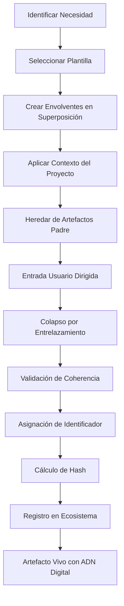
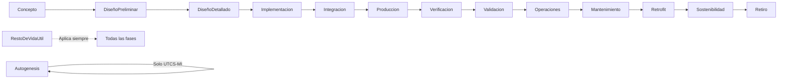

# **Especificación Técnica UTCS-MI v5.0 — Estándar Definitivo**
**Estándar Universal de Contenido Técnico - Interfaz Humano-Máquina**  
**Protocolo de Génesis para Aplicaciones Clásicas Quantum-Extensibles**

---

## **Identificador UTCS del Documento (Autogénesis)**

```yaml
EstándarUniversal:Especificacion-Autogenesis-UTCS-MI-00.00-EstandarTecnico-0001-v5.0-EstandarTransversal-GeneracionHumana-CROSS-AQUA-CORE-a0b1c2d3-RestoDeVidaUtil
```

**Este documento ES la autogénesis del ecosistema AQUA - el hash madre de todo lo generable**

---

**Documento normativo con anclajes canónicos (`§x.y.z`) y estructura ISO/IEC.**

_Generado_: 2025-08-14T00:00:00Z  
_Versión_: **5.0-definitiva**  
_Estado_: **NORMATIVO**  
_Naturaleza_: **AUTOGÉNESIS - El origen de todo artefacto en AQUA**

---

## **Definición Canónica Fundamental**

**UTCS-MI es una cadena de envolventes entendidos como conjunto de atributos admitidos en categorías o campos que se encuentran en estado de superposiciones entrelazadas y cuyo colapso es condicionado por ingeniería de instrucción.**

Esta definición establece que:
- Cada identificador existe inicialmente como un espacio de posibilidades
- Los campos mantienen relaciones de entrelazamiento
- El proceso de generación representa un colapso guiado
- La ingeniería de instrucción determina el resultado final

**UTCS-MI es el protocolo de génesis que da origen, estructura y gobierna cada instancia de una Classical Quantum-Extensible Application (CQEA).**

---

## **Prefacio**

El **Estándar Universal de Contenido Técnico - Interfaz Humano-Máquina (UTCS-MI) v5.0** representa el documento de **autogénesis** del ecosistema AQUA OS. Este documento no solo define un estándar; **ES** el acto primordial de creación del cual deriva todo lo demás.

Como artefacto de autogénesis:
- Es el único documento con fase "Autogenesis"
- Define el protocolo por el cual él mismo existe
- Establece las reglas para la génesis de todos los demás artefactos
- Es el hash madre del ecosistema AQUA

Principios fundamentales:
- **Cero acronimización**: Legibilidad humana absoluta
- **Envolventes entrelazadas**: Coherencia garantizada
- **Protocolo de génesis**: Todo artefacto nace, no se etiqueta
- **Open source**: Acepta contribuciones de cualquier fuente válida

---

## **Introducción**

La proliferación de sistemas complejos en aplicaciones aeroespaciales modernas, junto con la madurez alcanzada por los sistemas de IA generativa, requiere un marco unificado para la identificación, procedencia, trazabilidad y consumo automatizado de contenidos técnicos.

**UTCS-MI v5.0** no es simplemente un sistema de identificación. Es el **protocolo de génesis** que:
- **Da origen** a cada artefacto con identidad única
- **Codifica** el ADN digital inmutable
- **Habilita** la extensibilidad cuántica
- **Garantiza** la gobernanza desde el nacimiento

---

<a id='sec-0'></a>
# **§0 — Modelo Conceptual de Envolventes Entrelazadas**

## §0.1 — Definición de Envolvente

Una **envolvente** es una capa semántica que encapsula un conjunto de atributos posibles para un aspecto específico del artefacto. Cada envolvente:
- Contiene un catálogo de valores admitidos
- Mantiene relaciones de coherencia con otras envolventes
- Puede estar en superposición hasta su observación/definición
- Actúa como un gen en el ADN digital del artefacto

## §0.2 — Las 13 Envolventes Definitivas

```yaml
estructura_envolventes:
  posicion_1:
    nombre: "Clase de Artefacto"
    descripcion: "Naturaleza semántica del artefacto"
    valores: [Requisito, Especificacion, Procedimiento, Plan, Analisis, 
             Resultado, ModeloVisual, Codigo, CodigoCuantico, ConjuntoDeDatos,
             OrdenDeTrabajo, Contrato, Plantilla, Informe, Configuracion,
             Interfaz, Registro, Certificado, Leccion, Aplicacion]
    
  posicion_2:
    nombre: "Fase de Origen"
    descripcion: "Fase del ciclo de vida donde se origina"
    valores: [Autogenesis, Concepto, DiseñoPreliminar, DiseñoDetallado,
             Implementacion, Integracion, Produccion, Verificacion,
             Validacion, Operaciones, Mantenimiento, Retrofit,
             Sostenibilidad, Retiro, RestoDeVidaUtil]
    
  posicion_3:
    nombre: "Regulación de Referencia"
    descripcion: "Normativa o estándar base"
    valores: [ATA, CS25, FAR25, CS23, FAR23, DO178C, DO254, DO326A, DO356A,
             S1000D, ASD2000M, ISO9001, ISO27001, ISO26262, ISO31000, AS9100,
             MILSTD810, MILSTD461, MILSTD1553, STANAG, UTCS-MI, AQUA, CQEA,
             AMORES, WEE, ARP4754, ARP4761, API, IEEE, RTCA]
    
  posicion_4:
    nombre: "Capítulo-Sección"
    descripcion: "Ubicación específica en la regulación"
    formato: "Variable según regulación"
    
  posicion_5:
    nombre: "Categoría Descriptiva"
    descripcion: "Descripción funcional específica"
    formato: "CamelCase sin espacios ni acrónimos"
    
  posicion_6:
    nombre: "Secuencia de Unicidad"
    descripcion: "Identificador único secuencial"
    formato: "NNNN (0001-9999)"
    
  posicion_7:
    nombre: "Versión de Evolución"
    descripcion: "Versión evolutiva del artefacto"
    formato: "vX.Y"
    
  posicion_8:
    nombre: "Programa del Portfolio"
    descripcion: "Producto específico o estándar transversal"
    valores: [Ver catálogo completo en §7]
    
  posicion_9:
    nombre: "Método de Generación"
    descripcion: "Método de creación del artefacto"
    valores: [GeneracionHumana, GeneracionHybrida, GeneracionAuto]
    
  posicion_10:
    nombre: "Dominio de Aplicación"
    descripcion: "Dominio operacional principal"
    valores: [AIR, SPACE, DEFENSE, GROUND, CROSS]
    
  posicion_11:
    nombre: "Identificador Físico"
    descripcion: "Identificador del contribuyente (open source)"
    formato: "Variable según tipo de contribuyente"
    
  posicion_12:
    nombre: "Hash del Contenido"
    descripcion: "Hash SHA256 truncado del contenido"
    formato: "8 caracteres hexadecimales"
    
  posicion_13:
    nombre: "Periodo de Validez"
    descripcion: "Rango de fases donde aplica"
    formato: "FaseInicio-FaseFin o RestoDeVidaUtil"
```

## §0.3 — Matriz de Entrelazamiento

```yaml
entrelazamientos_principales:
  Autogenesis:
    restriccion: "Solo permitido para este documento"
    implica:
      - Clase: "Especificacion"
      - Regulacion: "UTCS-MI"
      - Capitulo: "00.00"
      - Periodo: "RestoDeVidaUtil"
  
  CodigoCuantico:
    fases_permitidas: [Implementacion, Integracion]
    metodos_prohibidos: [GeneracionHumana]
    nota: "Demasiado complejo para generación puramente humana"
  
  GeneracionAuto:
    clases_tipicas: [ConjuntoDeDatos, Resultado, Informe, Registro]
    clases_prohibidas: [OrdenDeTrabajo, Contrato]
    nota: "Contratos requieren intervención humana"
```

---

<a id='sec-1'></a>
# **§1 — Alcance**

## §1.1 — Objetivo

El **Estándar Universal de Contenido Técnico v5.0** establece:

1. El protocolo de génesis fundamental para el ecosistema AQUA
2. La estructura del identificador UTCS-MI de 13 campos
3. Los catálogos controlados sin acronimización
4. El proceso de génesis mediante colapso de envolventes
5. La integración con arquitectura CQEA
6. Los mecanismos de trazabilidad al hash madre

## §1.2 — Aplicabilidad

### En el alcance:
- Autogénesis del sistema (este documento)
- Protocolo de génesis de artefactos
- Identificación sin códigos ni acrónimos
- Arquitectura CQEA
- Filosofía open source

### Fuera del alcance:
- Contenido interno de los artefactos
- Algoritmos específicos de IA
- Implementación de sistemas cuánticos

---

<a id='sec-2'></a>
# **§2 — Referencias Normativas**

Las siguientes referencias son indispensables para la aplicación de este documento:

**Aeronáuticas:**
- ATA 100 - Specification for Manufacturers Technical Data
- EASA CS-25 - Certification Specifications for Large Aeroplanes
- FAA FAR Part 25 - Airworthiness Standards

**Software/Hardware:**
- RTCA DO-178C - Software Considerations in Airborne Systems
- RTCA DO-254 - Design Assurance Guidance for Airborne Electronic Hardware
- RTCA DO-326A - Airworthiness Security Process
- RTCA DO-356A - Cybersecurity Methods

**Gestión:**
- ISO 9001:2015 - Quality management systems
- ISO/IEC 27001:2022 - Information security management
- ISO 31000:2018 - Risk management

**Documentos AQUA (derivados de este):**
- CQEA Architecture Specification
- AMOReS Governance Framework
- WEE Learning Protocol

---

<a id='sec-3'></a>
# **§3 — Términos y Definiciones**

**Autogénesis**: El acto único e irrepetible de auto-creación del sistema UTCS-MI, representado exclusivamente por este documento.

**Hash Madre**: El identificador del documento de autogénesis del cual deriva la existencia de todos los demás artefactos.

**Artefacto**: Cualquier entidad técnica identificable mediante UTCS-MI.

**Envolvente**: Capa semántica que encapsula atributos posibles.

**Génesis**: Proceso mediante el cual un artefacto cobra existencia.

**Colapso**: Proceso de reducir una envolvente en superposición a un valor único.

**CQEA**: Classical Quantum-Extensible Application.

**Identificador Físico**: Identificador único del contribuyente en sistema open source.

**RestoDeVidaUtil**: Indicador de aplicabilidad perpetua desde creación.

---

<a id='sec-4'></a>
# **§4 — Símbolos y Abreviaturas**

## §4.1 — Nota Crítica

Este estándar **PROHÍBE** el uso de acrónimos en identificadores. Los símbolos aquí listados son solo para el texto del documento.

## §4.2 — Símbolos

- `§` : Símbolo de sección
- `:` : Separador después del prefijo
- `-` : Separador entre campos
- `.` : Separador en versiones y capítulos

## §4.3 — Convenciones

- **DEBE/SHALL**: Requisito obligatorio
- **NO DEBE/SHALL NOT**: Prohibición absoluta
- **DEBERÍA/SHOULD**: Recomendación fuerte
- **PUEDE/MAY**: Opción permitida

---

<a id='sec-5'></a>
# **§5 — Conformidad**

## §5.1 — Criterios de Conformidad

Una implementación conforme **DEBE**:

1. Reconocer este documento como autogénesis
2. Usar exactamente 13 campos obligatorios
3. Prohibir toda acronimización
4. Usar solo valores de catálogos definidos
5. Mantener trazabilidad al hash madre
6. Validar coherencia por entrelazamiento

## §5.2 — Niveles de Conformidad

**Nivel 1 - Básica**: Genera identificadores sintácticamente correctos

**Nivel 2 - Completa**: Nivel 1 + validación de entrelazamientos

**Nivel 3 - Extendida**: Nivel 2 + APIs + integración CQEA

---

<a id='sec-6'></a>
# **§6 — El Identificador como ADN Digital**

## §6.1 — Formato Canónico

### Sintaxis:
```
EstándarUniversal:<Campo1>-<Campo2>-<Campo3>-<Campo4>-<Campo5>-<Campo6>-<Campo7>-<Campo8>-<Campo9>-<Campo10>-<Campo11>-<Campo12>-<Campo13>
```

### Estructura de Campos:

| Pos | Campo | Descripción | Ejemplo |
|:----|:------|:------------|:--------|
| 0 | Prefijo | Siempre "EstándarUniversal:" | EstándarUniversal: |
| 1 | Clase | Tipo de artefacto | Especificacion |
| 2 | Fase | Fase de origen | Autogenesis |
| 3 | Regulación | Estándar base | UTCS-MI |
| 4 | Capítulo | Sección numérica | 00.00 |
| 5 | Categoría | Descripción funcional | EstandarTecnico |
| 6 | Secuencia | Número único | 0001 |
| 7 | Versión | Versión semántica | v5.0 |
| 8 | Programa | Producto del portfolio | EstandarTransversal |
| 9 | Método | Método generación | GeneracionHumana |
| 10 | Dominio | Dominio operacional | CROSS |
| 11 | ID Físico | Contribuyente | AQUA-CORE |
| 12 | Hash | Hash contenido | a0b1c2d3 |
| 13 | Periodo | Validez temporal | RestoDeVidaUtil |

## §6.2 — El Identificador de Autogénesis

Este documento tiene el ÚNICO identificador con fase "Autogenesis":

```
EstándarUniversal:Especificacion-Autogenesis-UTCS-MI-00.00-EstandarTecnico-0001-v5.0-EstandarTransversal-GeneracionHumana-CROSS-AQUA-CORE-a0b1c2d3-RestoDeVidaUtil
```

Este ES el hash madre del ecosistema.

---

<a id='sec-7'></a>
# **§7 — Catálogos Controlados**

## §7.1 — Catálogo de Clases de Artefacto

| Clase | Descripción | Fases Típicas |
|:------|:------------|:--------------|
| Requisito | Declaración de necesidad | Concepto, DiseñoPreliminar |
| Especificacion | Definición técnica | Todas excepto Autogenesis* |
| Procedimiento | Instrucciones paso a paso | Implementacion en adelante |
| Plan | Secuencia de actividades | Todas |
| Analisis | Estudio técnico | Todas |
| Resultado | Evidencia de ejecución | Verificacion, Validacion |
| ModeloVisual | Representación gráfica | DiseñoPreliminar en adelante |
| Codigo | Software ejecutable | Implementacion en adelante |
| CodigoCuantico | Software cuántico | Implementacion, Integracion |
| ConjuntoDeDatos | Datos estructurados | Todas |
| OrdenDeTrabajo | Contrato ejecutable | Todas |
| Contrato | Acuerdo marco | Concepto en adelante |
| Plantilla | Modelo para génesis | RestoDeVidaUtil |
| Informe | Documento síntesis | Todas |
| Configuracion | Parámetros sistema | Implementacion en adelante |
| Interfaz | Punto de conexión | DiseñoDetallado en adelante |
| Registro | Log de eventos | Operaciones en adelante |
| Certificado | Evidencia cumplimiento | Validacion en adelante |
| Leccion | Conocimiento capturado | Todas |
| Aplicacion | CQEA ensamblada | Produccion en adelante |

*Solo este documento puede tener Autogenesis

## §7.2 — Catálogo de Fases

| Fase | Descripción | Uso Especial |
|:-----|:------------|:-------------|
| **Autogenesis** | Auto-creación del sistema | **SOLO este documento** |
| Concepto | Exploración inicial | Requisitos iniciales |
| DiseñoPreliminar | Arquitectura 30% | Interfaces principales |
| DiseñoDetallado | Diseño 100% | Especificaciones finales |
| Implementacion | Construcción/codificación | Código y componentes |
| Integracion | Ensamblaje de partes | Pruebas de integración |
| Produccion | Manufactura/despliegue | Aplicaciones CQEA |
| Verificacion | Comprobación técnica | Evidencias técnicas |
| Validacion | Confirmación requisitos | Certificaciones |
| Operaciones | Uso operacional | Registros y logs |
| Mantenimiento | Soporte continuo | Actualizaciones |
| Retrofit | Modernización | Upgrades mayores |
| Sostenibilidad | Mejora continua | Optimizaciones |
| Retiro | Fin de vida | Documentación final |
| RestoDeVidaUtil | Aplicable siempre | Estándares, plantillas |

## §7.3 — Catálogo de Métodos de Generación

| Método | Descripción | Confianza | Validación |
|:-------|:------------|:----------|:-----------|
| GeneracionHumana | 100% creación humana | Máxima | Estándar |
| GeneracionHybrida | Colaboración humano-IA | Media-Alta | Aumentada |
| GeneracionAuto | Generación automática | Media-Baja | Exhaustiva |

## §7.4 — Catálogo de Regulaciones

### Aeronáuticas

| Código | Nombre Completo | Formato Capítulo |
|:-------|:----------------|:-----------------|
| ATA | ATA 100 Specification | CC-SS (ej: 27-00) |
| CS25 | EASA CS-25 Large Aeroplanes | 25.XXXX |
| FAR25 | FAA FAR Part 25 | 25.XXXX |
| CS23 | EASA CS-23 Normal Category | 23.XXXX |
| FAR23 | FAA FAR Part 23 | 23.XXXX |

### Software/Hardware

| Código | Nombre Completo | Formato Capítulo |
|:-------|:----------------|:-----------------|
| DO178C | Software Considerations | X.Y.Z |
| DO254 | Hardware Design Assurance | X.Y.Z |
| DO326A | Airworthiness Security | X.Y.Z |
| DO356A | Cybersecurity Methods | X.Y.Z |

### AQUA/Internos

| Código | Nombre Completo | Formato Capítulo |
|:-------|:----------------|:-----------------|
| UTCS-MI | Este estándar | XX.YY |
| AQUA | Estándares AQUA | XX.YY |
| CQEA | Arquitectura CQEA | XX.YY |
| AMORES | Sistema AMOReS | XX.YY |
| WEE | Wisdom Evolution Engine | XX.YY |

## §7.5 — Catálogo de Programas del Portfolio

### Productos Aeronáuticos

| Código | Descripción |
|:-------|:------------|
| TechnologyDemonstrator20 | Demostrador tecnológico 20 pasajeros |
| CityVerticalTakeOff360 | eVTOL urbano 4-6 pasajeros |
| HybridElectric120 | Avión regional híbrido eléctrico 120 pasajeros |
| HybridElectric180 | Avión mainstream híbrido eléctrico 180 pasajeros |
| BlendedWingBodyQuantum100 | BWB hidrógeno líquido 100 pasajeros |
| BlendedWingBodyQuantum250 | BWB hidrógeno líquido 250 pasajeros |
| SuborbitalTransport360 | Transporte suborbital 12 pasajeros |
| OrbitalTransport360Extended | Transporte orbital 12 pasajeros |

### Productos Espaciales

| Código | Descripción |
|:-------|:------------|
| GaiaCommunications | Satélites de comunicaciones |
| GaiaEarthObservation | Satélites observación terrestre |
| GaiaNavigation | Satélites de navegación |
| GaiaDataRelay | Satélites relay de datos |
| GaiaQuantumKeyDistribution | Satélites distribución claves cuánticas |
| GaiaSurveillance | Satélites de vigilancia |
| GaiaBroadcast | Satélites de broadcasting |
| GaiaLunarProbe | Sonda de exploración lunar |
| GaiaAsteroidProbe | Sonda de asteroides |
| GaiaMarsProbe | Sonda marciana |
| GaiaDeepSpaceProbe | Sonda espacio profundo |

### Sistemas No Tripulados

| Código | Descripción |
|:-------|:------------|
| GaiaTacticalSwift | UAV táctico 8 horas autonomía |
| GaiaSurveillanceHawk | UAV vigilancia 24 horas |
| GaiaStrikeEagle | UAV ataque 36 horas |
| GaiaHighAltitudeCondor | HALE 48+ horas |
| GaiaSolarPhoenix | HAPS solar 6 meses |
| GaiaSwarmSystem | Sistema enjambre distribuido |
| GaiaCargoTransport | UAV logística 500kg |
| GaiaRescueSystem | UAV emergencias médicas |

### Sistemas Robóticos

| Código | Descripción |
|:-------|:------------|
| AquaAssemblerRobot | Robot ensamblaje aeronaves |
| AquaInspectorRobot | Robot inspección con IA |
| AquaWelderRobot | Robot soldadura composites |
| AquaPainterRobot | Robot tratamiento superficies |
| AquaHandlerRobot | Robot manejo materiales |
| AquaMechanicRobot | Robot mantenimiento predictivo |
| AquaRefuelerRobot | Robot repostaje autónomo |
| AquaLoaderRobot | Robot manejo carga |
| AquaTowerRobot | Robot control movimiento tierra |
| AquaOrbitalRobot | Robot servicio satelital |
| AquaLunarRobot | Robot operaciones lunares |
| AquaMarsRobot | Robot exploración marciana |
| AquaHazmatRobot | Robot respuesta química |
| AquaRescueRobot | Robot búsqueda y rescate |
| AquaFireRobot | Robot extinción incendios |

### Productos Defensa/Ciberseguridad

| Código | Descripción |
|:-------|:------------|
| AquaQuantumCryption | Sistema encriptación post-cuántica |
| AquaQuantumShield | Firewall mejorado cuánticamente |
| AquaQuantumDetection | Detección anomalías con IA |
| AquaQuantumVault | Gestión claves cuánticas |

### Plataformas Digitales

| Código | Descripción |
|:-------|:------------|
| PlatformAmpel360 | Plataforma diseño generativo |
| PlatformDigitalIntelligence | Plataforma inteligencia digital flota |
| PlatformCertificationService | Plataforma certificación automatizada |
| PlatformRobotControl | Plataforma control robótico |
| PlatformGaiaMission | Plataforma gestión misiones |

### Artefactos Transversales

| Código | Descripción | Uso |
|:-------|:------------|:----|
| EstandarTransversal | Estándares y normativas | Como este documento |
| InfraestructuraCompartida | Sistemas compartidos | Infraestructura común |
| HerramientaDesarrollo | Herramientas de desarrollo | IDEs, compiladores |
| PlantillaGenerica | Plantillas reutilizables | Templates |
| ProcesoGenerico | Procesos multi-producto | Procesos comunes |

## §7.6 — Catálogo de Dominios

| Código | Dominio | Descripción |
|:-------|:--------|:------------|
| AIR | Aviación | Sistemas aeronáuticos |
| SPACE | Espacio | Sistemas espaciales |
| DEFENSE | Defensa | Aplicaciones militares |
| GROUND | Terrestre | Transporte terrestre |
| CROSS | Transversal | Múltiples dominios o no típicos |

## §7.7 — Catálogo de Identificadores Físicos

| Tipo | Formato | Ejemplos |
|:-----|:--------|:---------|
| Equipo AQUA | AQUA-XXX | AQUA-CORE, AQUA-ENG, AQUA-CERT |
| Individuo Identificado | IND-Nombre | IND-Maria, IND-JohnDoe |
| Individuo Anónimo | IND-hash | IND-a1b2c3d4 |
| Agente IA | AI-Sistema-ID | AI-GPT4-x7y8, AI-Claude-z9a0 |
| Bot Autónomo | BOT-AUTO-XXX | BOT-AUTO-001 |
| Organización Externa | ORG-Nombre | ORG-MIT, ORG-NASA, ORG-ESA |
| Colaboración | COLLAB-XXX | COLLAB-ABC |

---

<a id='sec-8'></a>
# **§8 — Validación**

## §8.1 — Algoritmo de Validación Sintáctica

```python
def validar_sintaxis_utcs(identificador: str) -> bool:
    """
    Valida la estructura sintáctica del identificador UTCS v5.0
    """
    # 1. Verificar prefijo
    if not identificador.startswith("EstándarUniversal:"):
        return False
    
    # 2. Separar y contar campos
    sin_prefijo = identificador[18:]
    campos = sin_prefijo.split("-")
    
    if len(campos) != 13:
        return False
    
    # 3. Validaciones específicas
    # Versión debe empezar con 'v'
    if not campos[6].startswith("v"):
        return False
    
    # Hash debe tener 8 caracteres
    if len(campos[11]) != 8:
        return False
    
    # No acrónimos prohibidos
    acronimos_prohibidos = ['BWB', 'HE', 'Q100', 'UAV', 'VTOL', 'QKD']
    for acronimo in acronimos_prohibidos:
        if acronimo in identificador:
            return False
    
    return True
```

## §8.2 — Validación Semántica por Entrelazamiento

```python
def validar_entrelazamiento(campos: dict) -> bool:
    """
    Valida coherencia entre campos entrelazados
    """
    # Autogenesis solo para este documento
    if campos['fase'] == 'Autogenesis':
        if campos['clase'] != 'Especificacion':
            return False
        if campos['regulacion'] != 'UTCS-MI':
            return False
        if campos['capitulo'] != '00.00':
            return False
            
    # CodigoCuantico restricciones
    if campos['clase'] == 'CodigoCuantico':
        if campos['fase'] not in ['Implementacion', 'Integracion']:
            return False
        if campos['metodo'] == 'GeneracionHumana':
            return False  # Demasiado complejo para humanos solos
            
    return True
```

---

<a id='sec-9'></a>
# **§9 — Proceso de Génesis**

## §9.1 — Flujo de Génesis



## §9.2 — Ejemplo de Génesis Paso a Paso

```yaml
paso_1_necesidad:
  descripcion: "Necesito documentar un requisito de autonomía"
  
paso_2_plantilla:
  plantilla: "PlantillaRequisitosAeronave"
  reduce_espacio: "90% de opciones eliminadas"
  
paso_3_superposicion:
  clase: [todas las 20 clases posibles]
  fase: [todas las 15 fases posibles]
  regulacion: [todas las 30 regulaciones posibles]
  
paso_4_contexto:
  proyecto: "BlendedWingBodyQuantum100"
  dominio: "AIR"
  efecto: "Reduce opciones a aeronáuticas"
  
paso_5_herencia:
  padre: "Especificacion de sistema"
  hereda: 
    - regulacion: "CS25"
    - dominio: "AIR"
    
paso_6_entrada_usuario:
  clase: "Requisito" # Usuario selecciona
  fase: "Concepto" # Usuario selecciona
  categoria: "AutonomiaMinimaCuatroMilKilometros" # Usuario escribe
  
paso_7_colapso:
  efecto: "Entrelazamiento determina valores restantes"
  automatico:
    - periodo: "Concepto-DiseñoPreliminar" # Por ser requisito en concepto
    - metodo: "GeneracionHumana" # Usuario lo está escribiendo
    
paso_8_validacion:
  sintaxis: "OK - 13 campos presentes"
  semantica: "OK - entrelazamientos coherentes"
  unicidad: "OK - secuencia 0042 disponible"
  
paso_9_identificador:
  resultado: "EstándarUniversal:Requisito-Concepto-CS25-25.1309-AutonomiaMinimaCuatroMilKilometros-0042-v1.0-BlendedWingBodyQuantum100-GeneracionHumana-AIR-IND-Maria-b2c3d4e5-Concepto-DiseñoPreliminar"
  
paso_10_registro:
  timestamp: "2025-08-14T10:30:00Z"
  blockchain: "aqua-chain:block:12345"
  estado: "ACTIVO"
```

---

<a id='sec-10'></a>
# **§10 — Guías de Usuario**

## §10.1 — Guía de Inicio Rápido

### Los 5 Pasos Esenciales

1. **Identifica qué estás creando** → Determina la Clase
2. **Ubica tu fase actual** → Selecciona la Fase
3. **Encuentra la regulación** → Elige el estándar que aplica
4. **Describe sin acrónimos** → Escribe la Categoría en CamelCase
5. **Completa los metadatos** → Rellena los campos restantes

### Ejemplo Mínimo

```yaml
Necesito: "Un procedimiento de mantenimiento"
Resultado: "EstándarUniversal:Procedimiento-Mantenimiento-ATA-32-00-InspeccionTrenAterrizaje-0001-v1.0-HybridElectric120-GeneracionHumana-AIR-AQUA-MNT-c3d4e5f6-Mantenimiento-Retiro"
```

## §10.2 — Guías por Rol

### §10.2.1 — Para Ingenieros

**Tus casos típicos:**

```yaml
especificacion_tecnica:
  clase: "Especificacion"
  fase: "DiseñoPreliminar" o "DiseñoDetallado"
  regulacion: "ATA", "CS25", "DO178C"
  tip: "Usa la sección exacta del estándar"
  
analisis_ingenieria:
  clase: "Analisis"
  fase: "La fase donde lo haces"
  categoria: "DescribeElAnalisisEnCamelCase"
  metodo: "GeneracionHybrida" si usas herramientas IA
```

### §10.2.2 — Para Desarrolladores de Software

**Tus identificadores típicos:**

```yaml
codigo_software:
  clase: "Codigo"
  fase: "Implementacion"
  regulacion: "DO178C"
  capitulo: "6.3.4" # Testing
  metodo:
    - "GeneracionHumana": Código manual
    - "GeneracionHybrida": Con Copilot/ChatGPT
    - "GeneracionAuto": Generado por herramienta
  hash: "Usa los 8 primeros del git commit"
  
codigo_cuantico:
  clase: "CodigoCuantico"
  fase: "Implementacion" # Nunca Concepto
  metodo: "GeneracionHybrida" # Nunca solo Humana
```

### §10.2.3 — Para Gestores de Certificación

**Documentación de cumplimiento:**

```yaml
evidencia_certificacion:
  clase: "Certificado"
  fase: "Validacion"
  regulacion: "CS25" o "FAR25"
  categoria: "EvidenciaCumplimientoSistemaX"
  identificador: "AQUA-CERT"
  periodo: "Validacion" # Solo válido en validación
```

### §10.2.4 — Para Contribuyentes Open Source

**Como individuo:**

```yaml
contribucion_individual:
  identificador_fisico:
    opcion_1: "IND-TuNombre" # Si quieres reconocimiento
    opcion_2: "IND-a1b2c3d4" # Si prefieres anonimato
  
contribucion_ia_asistida:
  metodo: "GeneracionHybrida"
  identificador_fisico: "AI-Claude-x7y8" # Si la IA es coautora
```

## §10.3 — Errores Comunes y Soluciones

### ❌ ERROR 1: Usar Acrónimos
```yaml
MALO:  "BWB-Q100"
MALO:  "HE-120"
MALO:  "UAV"
BUENO: "BlendedWingBodyQuantum100"
BUENO: "HybridElectric120"
BUENO: "GaiaTacticalSwift"
```

### ❌ ERROR 2: Fase Incorrecta para Clase
```yaml
MALO:  "CodigoCuantico" con fase "Concepto"
BUENO: "CodigoCuantico" con fase "Implementacion"

MALO:  "Certificado" con fase "DiseñoPreliminar"
BUENO: "Certificado" con fase "Validacion"
```

### ❌ ERROR 3: Formato de Versión
```yaml
MALO:  "1.0", "V1.0", "version1"
BUENO: "v1.0", "v2.3", "v10.5"
```

### ❌ ERROR 4: Formato de Capítulo ATA
```yaml
MALO:  "100.27.00" # No incluir el 100
MALO:  "ATA27"     # Falta el formato
BUENO: "27-00"     # Formato correcto
```

### ❌ ERROR 5: Hash Incorrecto
```yaml
MALO:  "abc"              # Muy corto
MALO:  "a1b2c3d4e5f6g7h8" # Muy largo
BUENO: "a1b2c3d4"         # Exactamente 8 caracteres
```

## §10.4 — Herramientas de Apoyo

### §10.4.1 — Generador de Hash Python

```python
import hashlib

def generar_hash_utcs(contenido: str) -> str:
    """
    Genera hash de 8 caracteres para UTCS
    """
    hash_completo = hashlib.sha256(contenido.encode()).hexdigest()
    return hash_completo[:8]

# Uso
contenido = "El contenido completo de tu artefacto..."
hash_utcs = generar_hash_utcs(contenido)
print(f"Hash UTCS: {hash_utcs}")
```

### §10.4.2 — Validador JavaScript

```javascript
function validarUTCS(identificador) {
    // Verificar estructura básica
    if (!identificador.startsWith("EstándarUniversal:")) {
        return false;
    }
    
    // Contar campos
    const campos = identificador.substring(18).split("-");
    if (campos.length !== 13) {
        return false;
    }
    
    // Verificar no acrónimos
    const acronimosProhibidos = ['BWB', 'HE', 'UAV', 'VTOL'];
    for (let acronimo of acronimosProhibidos) {
        if (identificador.includes(acronimo)) {
            console.error(`Acrónimo prohibido: ${acronimo}`);
            return false;
        }
    }
    
    return true;
}
```

### §10.4.3 — Plantilla Excel

| A | B | C | D | E | F | G | H | I | J | K | L | M |
|:--|:--|:--|:--|:--|:--|:--|:--|:--|:--|:--|:--|:--|
| Clase | Fase | Regulación | Capítulo | Categoría | Secuencia | Versión | Programa | Método | Dominio | ID Físico | Hash | Periodo |
| [Dropdown] | [Dropdown] | [Dropdown] | [Validado] | [CamelCase] | [Auto] | vX.Y | [Dropdown] | [Dropdown] | [Dropdown] | [Texto] | [8 car] | [Selector] |

**Fórmula para celda N1 (Identificador Completo):**
```excel
="EstándarUniversal:"&A2&"-"&B2&"-"&C2&"-"&D2&"-"&E2&"-"&F2&"-"&G2&"-"&H2&"-"&I2&"-"&J2&"-"&K2&"-"&L2&"-"&M2
```

---

<a id='sec-11'></a>
# **§11 — Ejemplos Completos**

## §11.1 — Ejemplo: Requisito Aeronáutico

```yaml
contexto: "Requisito de autonomía para el Blended Wing Body Quantum 100"

campos:
  1_clase: "Requisito"
  2_fase: "Concepto"
  3_regulacion: "CS25"
  4_capitulo: "25.1309"
  5_categoria: "AutonomiaMinimaCuatroMilKilometros"
  6_secuencia: "0042"
  7_version: "v1.0"
  8_programa: "BlendedWingBodyQuantum100"
  9_metodo: "GeneracionHumana"
  10_dominio: "AIR"
  11_identificador: "AQUA-REQ"
  12_hash: "b2c3d4e5"
  13_periodo: "Concepto-DiseñoPreliminar"

identificador_completo: "EstándarUniversal:Requisito-Concepto-CS25-25.1309-AutonomiaMinimaCuatroMilKilometros-0042-v1.0-BlendedWingBodyQuantum100-GeneracionHumana-AIR-AQUA-REQ-b2c3d4e5-Concepto-DiseñoPreliminar"
```

## §11.2 — Ejemplo: Código Cuántico

```yaml
contexto: "Algoritmo QAOA para optimización de rutas de vuelo"

campos:
  1_clase: "CodigoCuantico"
  2_fase: "Implementacion"
  3_regulacion: "CQEA"
  4_capitulo: "18.03"
  5_categoria: "AlgoritmoQAOAOptimizacionRutas"
  6_secuencia: "0234"
  7_version: "v2.3"
  8_programa: "PlatformDigitalIntelligence"
  9_metodo: "GeneracionHybrida"
  10_dominio: "CROSS"
  11_identificador: "AI-Claude-x7y8"
  12_hash: "f5g6h7i8"
  13_periodo: "Implementacion-RestoDeVidaUtil"

identificador_completo: "EstándarUniversal:CodigoCuantico-Implementacion-CQEA-18.03-AlgoritmoQAOAOptimizacionRutas-0234-v2.3-PlatformDigitalIntelligence-GeneracionHybrida-CROSS-AI-Claude-x7y8-f5g6h7i8-Implementacion-RestoDeVidaUtil"
```

## §11.3 — Ejemplo: Certificado de Validación

```yaml
contexto: "Certificado de cumplimiento DO-178C para software de control"

campos:
  1_clase: "Certificado"
  2_fase: "Validacion"
  3_regulacion: "DO178C"
  4_capitulo: "6.4.3"
  5_categoria: "CumplimientoNivelASoftwareControl"
  6_secuencia: "0567"
  7_version: "v1.0"
  8_programa: "HybridElectric120"
  9_metodo: "GeneracionHumana"
  10_dominio: "AIR"
  11_identificador: "AQUA-CERT"
  12_hash: "j9k0l1m2"
  13_periodo: "Validacion"

identificador_completo: "EstándarUniversal:Certificado-Validacion-DO178C-6.4.3-CumplimientoNivelASoftwareControl-0567-v1.0-HybridElectric120-GeneracionHumana-AIR-AQUA-CERT-j9k0l1m2-Validacion"
```

---

<a id='sec-12'></a>
# **§12 — APIs de Implementación**

## §12.1 — API REST

### Endpoints Principales

```yaml
base_url: "https://api.aqua.systems/utcs/v5"

endpoints:
  validacion:
    GET: "/validar/{identificador}"
    response: {valido: boolean, errores: array}
    
  generacion:
    POST: "/generar"
    body: {clase, fase, regulacion, ...}
    response: {identificador: string, hash: string}
    
  catalogos:
    GET: "/catalogos/{nombre}"
    response: {valores: array}
    
  trazabilidad:
    GET: "/trazabilidad/{identificador}"
    response: {padres: array, hijos: array}
```

### Ejemplo de Llamada

```bash
curl -X POST https://api.aqua.systems/utcs/v5/generar \
  -H "Content-Type: application/json" \
  -d '{
    "clase": "Requisito",
    "fase": "Concepto",
    "regulacion": "CS25",
    "capitulo": "25.1309",
    "categoria": "SistemasElectricos",
    "programa": "HybridElectric120",
    "metodo": "GeneracionHumana",
    "dominio": "AIR",
    "identificador_fisico": "IND-Maria",
    "periodo": "Concepto-DiseñoPreliminar"
  }'
```

## §12.2 — SDK Python

```python
from aqua_utcs import UTCSClient

# Inicializar cliente
client = UTCSClient(api_key="tu-api-key")

# Generar identificador
identificador = client.generar(
    clase="Especificacion",
    fase="DiseñoDetallado",
    regulacion="ATA",
    capitulo="27-00",
    categoria="ControlesVueloDigitales",
    programa="BlendedWingBodyQuantum100",
    metodo="GeneracionHybrida",
    dominio="AIR",
    identificador_fisico="AQUA-ENG",
    periodo="DiseñoDetallado-Produccion"
)

print(f"Identificador generado: {identificador}")

# Validar
es_valido = client.validar(identificador)
print(f"Válido: {es_valido}")
```

---

<a id='sec-13'></a>
# **§13 — Anexos**

## Anexo A — Tabla de Conversión de Acrónimos Prohibidos

| ❌ PROHIBIDO | ✅ CORRECTO |
|:-------------|:------------|
| BWB | BlendedWingBody |
| HE | HybridElectric |
| Q100, Q250 | Quantum100, Quantum250 |
| UAV | GaiaTacticalSwift (u otro nombre específico) |
| VTOL, eVTOL | VerticalTakeOff |
| HALE | HighAltitude |
| HAPS | HighAltitudePlatform |
| QKD | QuantumKeyDistribution |
| AI | AgentIA o InteligenciaArtificial |
| MRO | Mantenimiento |
| POC | PrototipoConcepto |
| MVP | ProductoMinimoViable |
| API | InterfazProgramacion |
| CEO, CTO, CFO | (usar nombres de rol completos) |

## Anexo B — Mapeo de Fases del Ciclo de Vida



## Anexo C — Checklist de Validación

- [ ] ¿El identificador empieza con "EstándarUniversal:"?
- [ ] ¿Tiene exactamente 13 campos separados por guiones?
- [ ] ¿La versión empieza con "v"?
- [ ] ¿El hash tiene exactamente 8 caracteres?
- [ ] ¿NO contiene acrónimos prohibidos?
- [ ] ¿La clase es válida según catálogo?
- [ ] ¿La fase es válida según catálogo?
- [ ] ¿El programa existe en el portfolio?
- [ ] ¿El método es uno de los tres permitidos?
- [ ] ¿El dominio es uno de los cinco permitidos?
- [ ] ¿La categoría está en CamelCase?
- [ ] ¿El capítulo tiene el formato correcto para la regulación?
- [ ] ¿El periodo es coherente con la fase?

---

**FIN DEL DOCUMENTO UTCS-MI v5.0 DEFINITIVO**

**Documento de Autogénesis del Ecosistema AQUA**

_Este documento ES el protocolo de génesis._  
_Sin este documento, no hay génesis._  
_Con este documento, todo cobra existencia._

---

_Versión_: **5.0-definitiva**  
_Estado_: **NORMATIVO**  
_Hash Madre_: **a0b1c2d3**  
_Entrada en vigor_: **2025-09-01**  
_Conformidad obligatoria_: **Inmediata**

**Soporte**: utcs-support@aqua.systems  
**Repositorio**: github.com/aqua-os/utcs-mi  
**Validador online**: aqua.systems/utcs-validator

---

**© 2025 AQUA OS - Open Source bajo licencia AQUA-OSL-2.0**
