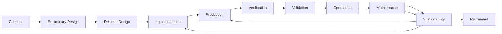

# Especificación Técnica UTCS-MI v1.0 — Completa
**Universal Technical Content Standard - Machine Interface**  
**Documento normativo con anclajes canónicos (`§x.y.z`) y estructura ISO/IEC.**

_Generado_: 2025-08-12T00:00:00Z  
_Versión_: 1.0  
_Estado_: NORMATIVO  

---

**Front matter (no numerado)**

## Prefacio

El Universal Technical Content Standard - Machine Interface (UTCS-MI) v1.0 forma parte integral del ecosistema AQUA OS (Aerospace and Quantum United Applications Operating System) y su arquitectura de Aplicaciones Clásicas Quantum-Extensibles (CQEA). Este estándar habilita la interoperabilidad semántica entre sistemas heterogéneos dentro del paradigma de Inteligencia General Extensible (Ex-AGI) orientada al dominio aeroespacial.

La extensión Work Order & Contract Envelope (WOCE) convierte cada identificador UTCS en un contrato ejecutable, revolucionando la industria de technical publications mediante micro-contratos automatizados y validación determinista de calidad.

## Introducción

La proliferación de sistemas complejos en aplicaciones aeroespaciales modernas requiere un marco unificado para la identificación, trazabilidad y consumo automatizado de contenidos técnicos. UTCS-MI v1.0 establece este marco mediante identificadores estructurados que son compatibles tanto con sistemas tradicionales (ATA, S1000D) como con arquitecturas emergentes basadas en inteligencia artificial y computación cuántica.

La innovación disruptiva de WOCE permite que cada identificador funcione como un contrato ejecutable con validación automática, pagos condicionados a evidencias verificables, y trazabilidad completa desde requisito hasta entrega.

## Avisos de conformidad y propiedad intelectual

Este documento está bajo licencia AQUA OS Open Source License v2.0. Las implementaciones conformes deben declarar explícitamente su adhesión a este estándar y mantener la trazabilidad de conformidad según se especifica en §14.

---

<a id='sec-1'></a>
# §1 — Alcance

<a id='sec-1.1'></a>
## §1.1 — Objetivo

1.1.1 El **Universal Technical Content Standard (UTCS)** **shall** establecer el marco normativo para la identificación inequívoca, trazabilidad y consumo determinista por máquinas y modelos de lenguaje de gran escala (LLM) de contenidos técnicos dentro del ecosistema AMPEL360/AQUA. Esto incluye su uso como un encabezado de prompt estandarizado (UPE) para modelos generativos (véase §9).

1.1.2 El estándar **shall** definir la estructura y la semántica del identificador **UTCS-MI** (véase §6.1–§6.2), los catálogos controlados asociados (véase §7), y las reglas de validación (mediante expresiones regulares `regex`, gramática `EBNF`, y reglas de negocio; véase §8). Este marco **shall** asegurar la interoperabilidad con sistemas de gestión de la trazabilidad de requisitos (`RTM`), documentos de interfaz de control (`ICD`), módulos de datos `S1000D`, plataformas de contenido como servicio (`CaaS`), y sistemas de gestión de activos y operaciones (`AMOReS`) (véase §10).

1.1.3 El estándar **shall** habilitar el enlace normativo mediante claves `std_ref` hacia cláusulas numeradas específicas (`§x.y.z`). Esto **shall** facilitar la auditoría de conformidad y la asignación automática del Nivel de Garantía de Diseño (`DAL`) (véase §12.1).

1.1.4 El **Work Order & Contract Envelope (WOCE)** **shall** permitir que cada identificador UTCS funcione como contrato ejecutable con validación automática, criterios de aceptación verificables, y pagos condicionados a evidencias ancladas (véase §20).

<a id='sec-1.2'></a>
## §1.2 — Aplicabilidad y exclusiones

### 1.2.1 En el alcance (`shall`):

- **Identificación de entidades técnicas**: Requisitos, artefactos de hardware/software, pruebas, documentos, `ICD`, módulos de datos `S1000D`, evidencias y eventos de verificación (véase §7.1).
- **Contratos ejecutables**: Órdenes de trabajo (`WO`) y contratos marco (`CTR`) con validación automática y criterios de aceptación verificables (véase §20).
- **Modelado de ciclo de vida (`LIFE`)**: Seguimiento de la fase del ciclo de vida de una entidad, y **estado** (`STATE`: `MAP`, `GENnnn`) con sus respectivas reglas de transición (véase §7.5).
- **Clasificación funcional**: Mediante el uso de los capítulos `ATA` del 00 al 99 (incluyendo 98 `Quantum` para inteligencia artificial/aprendizaje automático, y 99 `AI` para inteligencia artificial general; véase §7.3) y las categorías (`CAT`) específicas por capítulo `ATA` (véase §7.4).
- **Especificación del dominio de aplicación (`APP`)**: Clasificación de entidades por su dominio de aplicación principal (`AIR`, `SPC`, `GND`, `DEF`, `CRS`; véase §7.6).
- **Consumo por LLM/sistemas**: Definición del uso de Encabezados de Prompt Universal (`UPE`) para prompts y del contrato de respuesta para el consumo por LLM y otros sistemas automatizados (véase §9).

### 1.2.2 Fuera de alcance (`shall not`):

- Definir el contenido técnico interno de los sistemas (p. ej., algoritmos de control, cálculos de performance aeronáutica).
- Sustituir el sistema de numeración `ATA`; el **UTCS** **shall** actuar como una metacapa de identificación y trazabilidad que es compatible con `ATA`.
- Imponer algoritmos criptográficos o políticas regulatorias (p. ej., control de exportaciones, espectro radioeléctrico, láseres) más allá de los **ganchos** de conformidad para firma y sellado de tiempo (véase §12.3).
- Obligar a un formato de almacenamiento específico distinto de lo establecido en las cláusulas de validación y serialización (véase §8 y Anexos).
- Establecer requisitos de seguridad operacional más allá del vocabulario `DAL` y las puertas de seguridad (`gates`) definidas (véase §12.1).

### 1.2.3 Condiciones de conformidad (resumen):

Las implementaciones que declaren conformidad con este estándar **shall** producir identificadores **UTCS-MI** que sean válidos según las especificaciones de expresión regular (`regex`) y gramática `EBNF` (véase §8.1–§8.2). Asimismo, **shall** respetar todas las reglas de negocio y coherencia entre campos (véase §8.3), y **shall** exponer referencias `std_ref` en el `RTM` (véase §10.2).

<a id='sec-1.3'></a>
## §1.3 — Público objetivo

1.3.1 Los **productores de identificadores** (incluyendo equipos de requisitos, diseño, verificación y documentación) **shall** generar identificadores **UTCS-MI** válidos y completos de acuerdo con los requisitos especificados en §6–§8.

1.3.2 Los **consumidores** (incluyendo parsers, sistemas `RTM`, `CaaS`, `AMOReS`, `LLM`/servicios de inferencia) **shall** implementar la validación canónica de los identificadores, resolver las referencias `std_ref`, y aplicar las reglas de negocio establecidas en §8.3.

1.3.3 Las **autoridades de gobernanza** (incluyendo el comité **UTCS**/`AMOReS`) **should** utilizar el **UTCS** para la gestión de baselines (`MAP` → `GENnnn`), la realización de auditorías, y la asignación de `DAL` (véase §12.1, §13).

1.3.4 Los **proveedores de servicios** (incluyendo CaaS providers y subcontratistas) **shall** utilizar WOCE para contratos ejecutables automatizados con validación determinista de calidad (véase §20).

<a id='sec-1.4'></a>
## §1.4 — Límites y supuestos del estándar

1.4.1 **Convenciones**: El idioma base para la representación de contenido **shall** ser el español (`es-ES`), con un `fallback` a inglés (`en-US`) si no se especifica. Las unidades **shall** seguir el Sistema Internacional (`SI`), las fechas **shall** conformarse al formato `ISO-8601 UTC`, y todos los identificadores **UTCS-MI** **shall** estar en MAYÚSCULAS (véase §3.2, §6.1.2).

1.4.2 **Unicidad**: La unicidad de un identificador **UTCS-MI** **shall** regirse por la clave compuesta formada por los campos (`TYPE`, `LIFE`, `ATA`, `CAT`, `SEQ`, `STATE`, `APP`, `VAR`, `INST`) según lo definido en §6.3.

1.4.3 **Compatibilidad**: El **UTCS** **shall** mantener la compatibilidad con el sistema `ATA`. Las estrategias de migración y `grandfathering` para versiones anteriores **shall** regirse por §11.2–§11.3.

1.4.4 **Seguridad y privacidad**: Los metadatos asociados a los identificadores **shall** ser mínimos. Las evidencias referenciadas **shall** estar firmadas y selladas temporalmente (véase §12.3).

<a id='sec-2'></a>
# §2 — Referencias normativas

<a id='sec-2.1'></a>
## §2.1 — Normas citadas (versionadas)

2.1.1 Las siguientes normas **shall** aplicarse para la correcta interpretación de este estándar:

- **ISO/IEC 27001:2022** - Gestión de seguridad de la información
- **ISO 8601:2019** - Representación de fechas y tiempos
- **ATA Spec 100** - Specification for Manufacturers' Technical Data
- **S1000D Issue 5.0** - International specification for technical publications
- **DO-178C** - Software Considerations in Airborne Systems and Equipment Certification
- **DO-254** - Design Assurance Guidance for Airborne Electronic Hardware
- **ECSS-E-ST-40C** - Software engineering standards (ESA)
- **IEEE 830-1998** - Recommended Practice for Software Requirements Specifications
- **RFC 3339** - Date and Time on the Internet: Timestamps
- **NIST SP 800-53 Rev. 5** - Security and Privacy Controls for Information Systems

<a id='sec-2.2'></a>
## §2.2 — Prioridad y jerarquía de referencias

2.2.1 En caso de conflicto entre estándares referenciados, **shall** aplicarse la siguiente jerarquía de prioridad:

1. **UTCS-MI v1.0** (este documento) - Autoridad máxima
2. **ATA Spec 100** - Para compatibilidad con sistemas legacy
3. **S1000D Issue 5.0** - Para módulos de datos técnicos
4. **DO-178C/DO-254** - Para asignación DAL y seguridad funcional
5. **ISO/IEC 27001** - Para aspectos de seguridad de la información
6. **IEEE/NIST** - Para aspectos técnicos específicos

2.2.2 Las referencias normativas **shall** interpretarse con la versión específica citada. Las actualizaciones posteriores **may** considerarse solo tras evaluación formal del Comité UTCS (véase §17.1).

<a id='sec-3'></a>
# §3 — Términos y definiciones

<a id='sec-3.1'></a>
## §3.1 — Términos generales

**AMOReS**: Aerospace Master Operative Regulating System - Sistema maestro de regulación operativa aeroespacial que gestiona la gobernanza y asignación DAL.

**ATA**: Air Transport Association - Sistema de numeración estándar para clasificación funcional de sistemas aeronáuticos (capítulos 00-99).

**Baseline**: Estado consolidado y aprobado de un conjunto de entidades técnicas en un momento específico del ciclo de vida.

**CaaS**: Content as a Service - Plataforma de contenido como servicio para ingesta y validación de evidencias.

**CQEA**: Classical Quantum-Extensible Applications - Aplicaciones clásicas extensibles cuánticamente dentro del ecosistema AQUA.

**CTR**: Contract - Marco contractual maestro que gobierna uno o más WO mediante WOCE.

**DAL**: Design Assurance Level - Nivel de garantía de diseño según DO-178C/DO-254.

**Ex-AGI**: Extensible Artificial General Intelligence - Inteligencia artificial general extensible orientada a dominios específicos.

**ICD**: Interface Control Document - Documento de control de interfaces entre sistemas.

**LLM**: Large Language Model - Modelo de lenguaje de gran escala.

**RTM**: Requirements Traceability Matrix - Matriz de trazabilidad de requisitos.

**UPE**: Universal Prompt Envelope - Encabezado universal de prompt para LLMs.

**UTCS-MI**: Universal Technical Content Standard - Machine Interface - Identificador estándar universal para contenido técnico.

**WEE**: Wisdom Evolution Engine - Motor de evolución de sabiduría para aprendizaje inmortal.

**WO**: Work Order - Orden de trabajo ejecutable y trazable por UTCS mediante WOCE.

**WOCE**: Work Order & Contract Envelope - Envoltorio contractual que permite identificadores ejecutables.

<a id='sec-3.2'></a>
## §3.2 — Palabras clave normativas (shall/should/may)

3.2.1 Las palabras clave en este documento **shall** interpretarse según RFC 2119:

- **SHALL/MUST**: Requisito absoluto y obligatorio
- **SHALL NOT/MUST NOT**: Prohibición absoluta
- **SHOULD/RECOMMENDED**: Requisito recomendado con posibles excepciones justificadas
- **SHOULD NOT**: No recomendado pero permitido con justificación
- **MAY/OPTIONAL**: Característica opcional

3.2.2 Las implementaciones conformes **shall** cumplir todos los requisitos marcados como **SHALL** o **MUST**.

<a id='sec-3.3'></a>
## §3.3 — Glosario UTCS específico

**Entidad técnica**: Cualquier artefacto identificable dentro del ciclo de vida de desarrollo (requisito, componente, prueba, documento, evidencia).

**Identificador canónico**: Identificador UTCS-MI válido según las reglas de §6-§8.

**Estado de madurez**: Nivel de desarrollo de una entidad expresado mediante STATE (MAP, GEN001, GEN002, etc.).

**Coherencia inter-campos**: Validez de las relaciones semánticas entre campos del identificador (p. ej., ATA ↔ CAT).

**Conformidad determinista**: Capacidad de validar unívocamente la adherencia a este estándar mediante reglas automatizables.

**Contrato ejecutable**: Identificador UTCS con TYPE=WO o CTR que incluye metadatos WOCE para ejecución automática.

<a id='sec-4'></a>
# §4 — Símbolos y abreviaturas

<a id='sec-4.1'></a>
## §4.1 — Abreviaturas técnicas

| Abreviatura | Significado Completo |
|-------------|---------------------|
| AQUA | Aerospace and Quantum United Applications |
| BWB | Blended Wing Body |
| CSDB | Common Source Data Base |
| EBNF | Extended Backus-Naur Form |
| EASA | European Union Aviation Safety Agency |
| HIL | Hardware-in-the-Loop |
| SIL | Software-in-the-Loop |
| UTC | Coordinated Universal Time |
| XML | eXtensible Markup Language |
| JSON | JavaScript Object Notation |
| REGEX | Regular Expression |
| MD | Markdown |
| CLI | Command Line Interface |
| API | Application Programming Interface |
| WOCE | Work Order & Contract Envelope |

<a id='sec-4.2'></a>
## §4.2 — Símbolos y constantes (SI)

4.2.1 Las unidades físicas **shall** expresarse según el Sistema Internacional de Unidades (SI):

- **Longitud**: metro (m)
- **Masa**: kilogramo (kg)  
- **Tiempo**: segundo (s)
- **Temperatura**: kelvin (K)
- **Cantidad de sustancia**: mol (mol)
- **Intensidad luminosa**: candela (cd)
- **Corriente eléctrica**: ampere (A)

4.2.2 Constantes universales relevantes:

- **c** = 299,792,458 m/s (velocidad de la luz en el vacío)
- **ℏ** = 1.054571817×10⁻³⁴ J⋅s (constante de Planck reducida)
- **g₀** = 9.80665 m/s² (aceleración estándar de la gravedad)

<a id='sec-5'></a>
# §5 — Conformidad

<a id='sec-5.1'></a>
## §5.1 — Criterios de conformidad del productor de identificadores

5.1.1 Un **productor conforme** **shall**:

a) Generar identificadores UTCS-MI que cumplan la sintaxis de §6.1.1
b) Respetar la semántica de campos definida en §6.2
c) Utilizar exclusivamente valores de los catálogos controlados (§7)
d) Aplicar las reglas de coherencia inter-campos (§8.3)
e) Mantener unicidad según la clave compuesta (§6.3)
f) Proporcionar metadatos mínimos requeridos
g) Para TYPE=WO/CTR, incluir metadatos WOCE válidos (§20.3)

5.1.2 Un **productor conforme** **should**:

a) Implementar validación en tiempo real durante la generación
b) Mantener logs de auditoría para trazabilidad
c) Integrar con sistemas RTM/AMOReS para asignación DAL automática
d) Para contratos ejecutables, automatizar validación de criterios de aceptación

<a id='sec-5.2'></a>
## §5.2 — Criterios de conformidad del consumidor (parsers, LLMs)

5.2.1 Un **consumidor conforme** **shall**:

a) Validar identificadores UTCS-MI según las reglas de §8
b) Rechazar identificadores inválidos con códigos de error específicos (§8.4)
c) Resolver referencias std_ref a cláusulas normativas
d) Implementar parsing determinista sin dependencias de contexto externo
e) Soportar los formatos de respuesta especificados en §9.2
f) Para TYPE=WO/CTR, procesar metadatos WOCE según §20

5.2.2 Un **consumidor conforme** **should**:

a) Implementar caching de validaciones para performance
b) Proporcionar diagnósticos detallados para identificadores inválidos
c) Soportar extensiones futuras manteniendo compatibilidad hacia atrás
d) Para contratos ejecutables, automatizar validación de cumplimiento

<a id='sec-5.3'></a>
## §5.3 — Perfiles de conformidad (mínimo, completo, estricto)

### 5.3.1 Perfil Mínimo

**shall** implementar:
- Validación sintáctica básica (REGEX)
- Campos obligatorios: TYPE, LIFE, ATA, CAT, SEQ, STATE, APP
- Catálogos controlados básicos (TYPE, LIFE, APP)
- Formato de respuesta markdown

### 5.3.2 Perfil Completo

**shall** implementar todo del Perfil Mínimo más:
- Validación semántica completa (EBNF + reglas de negocio)
- Todos los catálogos controlados (incluyendo ATA 98/99)
- Campos opcionales (VAR, INST)
- Formatos de respuesta JSON y XML-S1000D
- Integración RTM básica
- Soporte básico WOCE para TYPE=WO/CTR

### 5.3.3 Perfil Estricto

**shall** implementar todo del Perfil Completo más:
- Validación criptográfica de firmas
- Integración completa AMOReS/CaaS
- Métricas de calidad en tiempo real
- Auditoría completa de conformidad
- WOCE completo con automatización de pagos y validación de evidencias

<a id='sec-5.4'></a>
## §5.4 — Procedimientos de evaluación de conformidad

5.4.1 La evaluación de conformidad **shall** realizarse mediante:

a) **Pruebas automatizadas**: Ejecución de la suite CTS (§14)
b) **Auditoría documental**: Revisión de implementación contra requisitos
c) **Pruebas de interoperabilidad**: Validación con otros sistemas conformes
d) **Evaluación de seguridad**: Verificación de criterios DAL aplicables
e) **Validación WOCE**: Para sistemas que soporten contratos ejecutables

5.4.2 Los **informes de conformidad** **shall** incluir:
- Perfil de conformidad declarado
- Resultados de CTS con evidencias
- Declaración de excepciones (si las hay)
- Certificado digital de conformidad

<a id='sec-6'></a>
# §6 — Identificador núcleo UTCS

<a id='sec-6.1'></a>
## §6.1 — Formato canónico

<a id='sec-6.1.1'></a>
### §6.1.1 — Sintaxis y separadores

6.1.1.1 El identificador **UTCS-MI** **shall** seguir la sintaxis:

```
UTCS:TYPE-LIFE-ATA-CAT-SEQ-STATE-APP[-VAR[-INST]]
```

6.1.1.2 Los **separadores obligatorios** son:
- **Prefijo**: `UTCS:` (dos puntos)
- **Campos principales**: `-` (guión)
- **Campos opcionales**: `[-VAR[-INST]]` (corchetes indican opcionalidad)

6.1.1.3 **Caracteres permitidos**:
- **Campos alfanuméricos**: `[A-Z0-9]`
- **Separadores**: `:` `-`
- **Longitud máxima**: 128 caracteres
- **Longitud mínima**: 32 caracteres

<a id='sec-6.1.2'></a>
### §6.1.2 — Sensibilidad a mayúsculas

6.1.2.1 Todos los identificadores UTCS-MI **shall** estar en MAYÚSCULAS.

6.1.2.2 Los sistemas **shall** rechazar identificadores con caracteres en minúsculas.

6.1.2.3 La normalización automática a mayúsculas **may** implementarse en la fase de entrada, pero **shall** registrarse como warning.

<a id='sec-6.2'></a>
## §6.2 — Semántica de campos

<a id='sec-6.2.1'></a>
### §6.2.1 — TYPE

6.2.1.1 **Propósito**: Clasificación primaria de la entidad técnica.

6.2.1.2 **Valores permitidos** (catálogo cerrado):
- `REQ`: Requisito
- `ART`: Artefacto (hardware/software)
- `TST`: Prueba o test
- `DOC`: Documento
- `ICD`: Interface Control Document
- `EVD`: Evidencia
- `API`: Application Programming Interface
- `MAP`: Mapeo o baseline
- `WO`: Work Order (orden de trabajo ejecutable)
- `CTR`: Contract (marco contractual maestro)

6.2.1.3 **Reglas de negocio**:
- `MAP` **shall** usarse exclusivamente con `STATE=MAP`
- `EVD` **should** referenciar entidades de prueba (`TST`)
- `WO` **shall** incluir metadatos WOCE (§20.3)
- `CTR` **shall** incluir metadatos WOCE y **may** gobernar múltiples `WO`
- `WO` **shall** referenciar un `CTR` válido mediante `parent_ctr`

<a id='sec-6.2.2'></a>
### §6.2.2 — LIFE

6.2.2.1 **Propósito**: Fase del ciclo de vida del desarrollo.

6.2.2.2 **Valores permitidos**:
- `CON`: Concepto
- `PRE`: Diseño preliminar  
- `DET`: Diseño detallado
- `IMP`: Implementación
- `VER`: Verificación
- `VAL`: Validación
- `OPS`: Operaciones
- `MNT`: Mantenimiento
- `RET`: Retiro

6.2.2.3 **Transiciones válidas**:
```
CON → PRE → DET → IMP → VER → VAL → OPS → MNT → RET
```

6.2.2.4 **Reglas específicas WOCE**:
- `WO` típicamente usa `OPS` para ejecución operativa
- `CTR` **may** usar cualquier fase según el contexto contractual

<a id='sec-6.2.3'></a>
### §6.2.3 — ATA

6.2.3.1 **Propósito**: Clasificación funcional según capítulos ATA.

6.2.3.2 **Formato**: Dos dígitos `00-99`

6.2.3.3 **Capítulos especiales**:
- `98`: Quantum Computing & AI/ML
- `99`: Artificial General Intelligence
- `00`: General/Cross-cutting
- `46`: Information Systems (incluye CaaS)

6.2.3.4 **Ejemplos**:
- `27`: Flight Controls
- `31`: Indicating/Recording Systems  
- `34`: Navigation
- `73`: Engine Fuel and Control
- `46`: Information Systems (para WO/CTR CaaS)

<a id='sec-6.2.4'></a>
### §6.2.4 — CAT

6.2.4.1 **Propósito**: Categoría específica dentro del capítulo ATA.

6.2.4.2 **Formato**: 2-6 caracteres alfanuméricos

6.2.4.3 **Dependencia**: Los valores válidos dependen del campo ATA (véase §7.4)

6.2.4.4 **Ejemplos**:
- ATA 27: `FBQW` (Fly-by-wire quantum), `PROT` (Protection), `TRIM` (Trim)
- ATA 34: `GPS` (Global Positioning), `INS` (Inertial Navigation)
- ATA 46: `CAAS` (Content as a Service), `RTM` (Requirements Traceability)
- ATA 98: `QKD` (Quantum Key Distribution), `ML` (Machine Learning)

<a id='sec-6.2.5'></a>
### §6.2.5 — SEQ

6.2.5.1 **Propósito**: Secuencial numérico único dentro del ámbito (ATA-CAT-APP).

6.2.5.2 **Formato**: Tres dígitos `001-999`

6.2.5.3 **Reglas**:
- **shall** ser secuencial y monotónico creciente
- **shall** ser único dentro de la clave (ATA-CAT-APP)
- **shall not** reutilizarse tras eliminación
- Para `WO`, **should** correlacionarse con secuencia contractual

<a id='sec-6.2.6'></a>
### §6.2.6 — STATE (MAP, GENnnn)

6.2.6.1 **Propósito**: Estado de madurez y baseline de la entidad.

6.2.6.2 **Valores permitidos**:
- `MAP`: Estado inicial de mapeo/planificación
- `GEN001`, `GEN002`, ..., `GEN999`: Generaciones secuenciales

6.2.6.3 **Transiciones**:
```
MAP → GEN001 → GEN002 → ... → GENnnn
```

6.2.6.4 **Reglas de avance**:
- Requiere aprobación formal del baseline
- **shall** mantener trazabilidad hacia estado anterior
- **should** incluir criterios de aceptación para avance
- Para `WO/CTR`, cada `GENnnn` representa versión contractual firmada

<a id='sec-6.2.7'></a>
### §6.2.7 — APP

6.2.7.1 **Propósito**: Dominio de aplicación principal.

6.2.7.2 **Valores permitidos**:
- `AIR`: Aviation (aeronáutica civil/comercial)
- `SPC`: Space (aplicaciones espaciales)
- `GND`: Ground (sistemas terrestres)
- `DEF`: Defense (aplicaciones de defensa)
- `CRS`: Cross-cutting (transversal/común)

6.2.7.3 **Uso en WOCE**:
- `CRS` típicamente para servicios CaaS transversales
- Otros dominios para servicios específicos de sector

<a id='sec-6.2.8'></a>
### §6.2.8 — VAR (opcional)

6.2.8.1 **Propósito**: Variante o configuración específica.

6.2.8.2 **Formato**: 1-4 caracteres alfanuméricos

6.2.8.3 **Uso típico**:
- Variantes geográficas (`EU`, `US`, `CN`)
- Configuraciones (`CFG1`, `CFG2`)
- Versiones de plataforma (`V1`, `V2A`)
- Para `WO`: configuraciones específicas de cliente

<a id='sec-6.2.9'></a>
### §6.2.9 — INST (opcional)

6.2.9.1 **Propósito**: Instancia específica o deployment.

6.2.9.2 **Formato**: 1-6 caracteres alfanuméricos

6.2.9.3 **Uso típico**:
- Identificadores de aeronave (`ECABC`, `N123AB`)
- Instancias de misión (`M001`, `M002A`)
- Seriales de hardware (`S001`, `S002`)
- Para `WO`: instancias específicas de deployment

<a id='sec-6.3'></a>
## §6.3 — Reglas de unicidad y ámbito de numeración

<a id='sec-6.3.1'></a>
### §6.3.1 — Clave compuesta para unicidad

6.3.1.1 La **unicidad** de un identificador UTCS-MI **shall** determinarse por la clave compuesta:

```
(TYPE, LIFE, ATA, CAT, SEQ, STATE, APP, VAR, INST)
```

6.3.1.2 **Ámbito de numeración SEQ**: El campo SEQ **shall** ser único dentro del ámbito:

```
(ATA, CAT, APP)
```

6.3.1.3 **Reutilización**: Los valores SEQ **shall not** reutilizarse dentro del mismo ámbito, incluso tras eliminación de entidades.

6.3.1.4 **Reglas especiales WOCE**:
- `CTR` y `WO` **may** compartir espacio SEQ si están diferenciados por TYPE
- `WO` derivados de un `CTR` **should** usar numeración correlativa

<a id='sec-6.3.2'></a>
### §6.3.2 — Gestión de colisiones

6.3.2.1 **Detección**: Los sistemas **shall** detectar colisiones en tiempo de generación.

6.3.2.2 **Resolución**: En caso de colisión:
a) **shall** incrementar SEQ al siguiente disponible
b) **shall** registrar el evento en logs de auditoría
c) **should** notificar al productor del identificador

6.3.2.3 **Prevención**: Los sistemas **should** implementar reserva anticipada de rangos SEQ para evitar colisiones.

<a id='sec-6.4'></a>
## §6.4 — Versionado del identificador vs. versión del contenido

6.4.1 **Principio**: El identificador UTCS-MI identifica la entidad, no su contenido específico.

6.4.2 **Versionado de contenido**: Los cambios en el contenido de una entidad **should** gestionarse mediante:
- Metadatos de versión externos al identificador
- Hash criptográfico del contenido
- Timestamps de modificación

6.4.3 **Evolución de STATE**: Los cambios de STATE **shall** considerarse evolución de la entidad, no nueva versión.

6.4.4 **Reglas WOCE**: Para `WO/CTR`, el avance de STATE implica nueva versión contractual que requiere firma de ambas partes.

<a id='sec-6.5'></a>
## §6.5 — Campos obsoletos o deprecados

6.5.1 **Estado actual**: No existen campos obsoletos en UTCS-MI v1.0.

6.5.2 **Proceso futuro**: La obsolescencia de campos **shall** seguir el proceso definido en §17 (Gobernanza).

6.5.3 **Compatibilidad**: Los campos deprecados **shall** mantenerse durante al menos dos versiones mayores del estándar.

<a id='sec-6.6'></a>
## §6.6 — Ejemplos canónicos (válidos / inválidos)

### 6.6.1 Ejemplos válidos:

```
UTCS:REQ-CON-27-FBQW-001-MAP-AIR
UTCS:ART-IMP-34-GPS-045-GEN002-SPC-EU
UTCS:TST-VER-98-QKD-012-GEN001-DEF
UTCS:DOC-OPS-99-AGI-001-GEN003-CRS-V2-PROD
UTCS:EVD-VAL-73-FUEL-089-GEN001-AIR-CFG1-ECABC
UTCS:CTR-OPS-46-CAAS-001-GEN001-CRS
UTCS:WO-OPS-46-CAAS-010-GEN001-CRS
UTCS:WO-OPS-27-FBQW-101-GEN002-AIR-EU-ECABC
UTCS:WO-OPS-24-IPC-123-GEN001-AIR-A320-CSN456
UTCS:WO-OPS-25-AMM-047-GEN001-AIR-A320-FGABC
```

### 6.6.2 Ejemplos inválidos:

```
UTCS:req-con-27-fbqw-001-map-air          # minúsculas
UTCS:REQ_CON_27_FBQW_001_MAP_AIR         # separador incorrecto
UTCS:XYZ-CON-27-FBQW-001-MAP-AIR         # TYPE inválido
UTCS:REQ-CON-100-FBQW-001-MAP-AIR        # ATA fuera de rango
UTCS:REQ-CON-27-FBQW-1000-MAP-AIR        # SEQ fuera de rango
UTCS:REQ-CON-27-FBQW-001-GEN999-AIR      # STATE sin MAP previo
UTCS:WO-CON-46-CAAS-001-MAP-CRS          # WO sin metadatos WOCE
```

<a id='sec-7'></a>
# §7 — Catálogos controlados

<a id='sec-7.1'></a>
## §7.1 — Lista TYPE (cerrada)

7.1.1 **Catálogo TYPE** (exhaustivo y cerrado):

| Código | Nombre | Descripción | Uso típico |
|--------|--------|-------------|------------|
| REQ | Requirement | Requisito funcional o no funcional | Especificaciones del sistema |
| ART | Artifact | Artefacto de hardware o software | Componentes, módulos, subsistemas |
| TST | Test | Prueba, ensayo o test | Verificación y validación |
| DOC | Document | Documento técnico | Manuales, especificaciones |
| ICD | Interface Control Document | Documento de control de interfaces | Definición de interfaces |
| EVD | Evidence | Evidencia de cumplimiento | Resultados de pruebas |
| API | Application Programming Interface | Interfaz de programación | Servicios software |
| MAP | Mapping | Mapeo o baseline | Estado inicial de planificación |
| **WO** | **Work Order** | **Orden de trabajo ejecutable y trazable por UTCS** | **Paquetes de trabajo CaaS** |
| **CTR** | **Contract** | **Marco contractual maestro que gobierna uno o más WO** | **Contratos marco** |

7.1.2 **Extensión del catálogo**: Solo mediante proceso formal de cambio (§17.1).

7.1.3 **Reglas específicas WOCE**:
- `WO` **shall** incluir metadatos WOCE completos (§20.3)
- `CTR` **shall** incluir metadatos WOCE y **may** gobernar múltiples `WO`
- `WO` **shall** referenciar un `CTR` válido mediante campo `parent_ctr`

<a id='sec-7.2'></a>
## §7.2 — Lista LIFE (fases del ciclo de vida)

7.2.1 **Catálogo LIFE** basado en ciclo de vida extendido de sistemas:

| Código | Fase | Descripción | Entregables típicos |
|--------|------|-------------|-------------------|
| CON | Concept | Concepto y definición de misión | Requisitos de alto nivel, ConOps |
| PRE | Preliminary Design | Diseño preliminar | Arquitectura del sistema, PDR |
| DET | Detailed Design | Diseño detallado | Especificaciones detalladas, CDR |
| IMP | Implementation | Implementación | Código, hardware, integración |
| **PROD** | **Production** | **Fabricación y manufactura** | **Líneas de producción, procesos de manufactura** |
| VER | Verification | Verificación | Pruebas de componentes |
| VAL | Validation | Validación | Pruebas de sistema |
| OPS | Operations | Operaciones | Deployment, mantenimiento |
| MNT | Maintenance | Mantenimiento | Actualizaciones, soporte |
| **SUST** | **Sustainability** | **Sostenibilidad y circularidad** | **Reciclaje, reutilización, economía circular** |
| RET | Retirement | Retiro | Desmantelamiento |

7.2.2 **Transiciones extendidas**: 



7.2.3 **Reglas específicas nuevas fases**:
- **PROD**: Enfocada en escalabilidad de manufactura y procesos industriales
- **SUST**: Incluye análisis de ciclo de vida, reciclabilidad, y economía circular
- **Transiciones especiales**: SUST puede retornar a PROD (remanufacturing) o IMP (refurbishment)

<a id='sec-7.3'></a>
## §7.3 — Capítulos ATA (00–99, 98 Quantum, 99 AI)

7.3.1 **Capítulos ATA estándar** (completo):

| ATA | Sistema | Descripción |
|-----|---------|-------------|
| 00 | General | Información general, cross-cutting |
| **05** | **Time Limits/Maintenance Checks** | **Límites de tiempo y verificaciones de mantenimiento** |
| **06** | **Dimensions and Areas** | **Dimensiones y áreas** |
| **07** | **Lifting and Shoring** | **Elevación y apuntalamiento** |
| **11** | **Placards and Markings** | **Placas y marcas** |
| **12** | **Servicing** | **Servicios** |
| **18** | **Vibration and Noise Analysis** | **Análisis de vibración y ruido** |
| **20** | **Standard Practices** | **Prácticas estándar** |
| 21 | Air Conditioning | Sistemas de climatización |
| 22 | Auto Flight | Piloto automático |
| 23 | Communications | Sistemas de comunicaciones |
| 24 | Electrical Power | Sistemas eléctricos |
| 25 | Equipment/Furnishings | Equipamiento interior |
| 26 | Fire Protection | Protección contra incendios |
| 27 | Flight Controls | Controles de vuelo |
| 28 | Fuel | Sistemas de combustible |
| 29 | Hydraulic Power | Sistemas hidráulicos |
| 30 | Ice and Rain Protection | Protección contra hielo |
| 31 | Indicating/Recording | Instrumentación |
| 32 | Landing Gear | Tren de aterrizaje |
| 33 | Lights | Sistemas de iluminación |
| 34 | Navigation | Navegación |
| 35 | Oxygen | Sistemas de oxígeno |
| 36 | Pneumatic | Sistemas neumáticos |
| **45** | **Central Maintenance System** | **Sistema central de mantenimiento** |
| 46 | Information Systems | Sistemas de información |
| 49 | Airborne Auxiliary Power | APU |
| **50** | **Cargo and Accessory Compartments** | **Compartimentos de carga y accesorios** |
| **51** | **Standard Practices and Structures** | **Prácticas estándar y estructuras** |
| **52** | **Doors** | **Puertas** |
| **53** | **Fuselage** | **Fuselaje** |
| **54** | **Nacelles/Pylons** | **Nacelas/Pilones** |
| **55** | **Stabilizers** | **Estabilizadores** |
| **56** | **Windows** | **Ventanas** |
| **70** | **Engines (General)** | **Motores (general)** |
| **71** | **Power Plant** | **Planta de potencia** |
| **72** | **Engine (Turbine/Turboprop)** | **Motor (turbina/turbohélice)** |
| 73 | Engine Fuel and Control | Control de combustible motor |
| 76 | Engine Controls | Controles del motor |
| 78 | Engine Exhaust | Escape del motor |

7.3.2 **Capítulos AQUA extendidos**:

| ATA | Sistema | Descripción |
|-----|---------|-------------|
| 98 | Quantum Computing & AI/ML | Computación cuántica, ML, procesamiento cuántico |
| 99 | Artificial General Intelligence | AGI, Ex-AGI, sistemas de IA avanzada |

7.3.3 **Capítulo 46 para CaaS**: Information Systems incluye categorías específicas para Content as a Service y sistemas relacionados.

<a id='sec-7.4'></a>
## §7.4 — Categorías CAT por ATA

<a id='sec-7.4.1'></a>
### §7.4.1 — Estructura de catálogo y codificación

7.4.1.1 **Principio**: Cada capítulo ATA **shall** tener su catálogo específico de categorías CAT.

7.4.1.2 **Formato CAT**: 2-6 caracteres alfanuméricos, optimizado para legibilidad.

### 7.4.1.3 Ejemplos por capítulo ATA:

**ATA 24 (Electrical Power)**:
- `PWR`: Power systems
- `DIST`: Distribution systems
- `BATT`: Battery systems
- `GEN`: Generators
- `INV`: Inverters

**ATA 25 (Equipment/Furnishings)**:
- `SEAT`: Seating systems
- `GALLEY`: Galley equipment
- `LAV`: Lavatory systems
- `AMM`: Aircraft Maintenance Manual tasks
- `PANEL`: Access panels

**ATA 27 (Flight Controls)**:
- `FBQW`: Fly-by-wire quantum
- `PROT`: Protection systems
- `TRIM`: Trim systems
- `YAW`: Yaw control
- `ROLL`: Roll control
- `PITCH`: Pitch control
- `FLAP`: Flap control
- `SLAT`: Slat control

**ATA 34 (Navigation)**:
- `GPS`: Global Positioning System
- `INS`: Inertial Navigation System
- `VOR`: VHF Omnidirectional Range
- `DME`: Distance Measuring Equipment
- `TCAS`: Traffic Collision Avoidance
- `GNSS`: Global Navigation Satellite

**ATA 46 (Information Systems)**:
- `CAAS`: Content as a Service
- `RTM`: Requirements Traceability Matrix
- `IPC`: Illustrated Parts Catalog
- `AMM`: Aircraft Maintenance Manual
- `SRM`: Structural Repair Manual
- `API`: Application Programming Interface
- `DATA`: Data management systems

**ATA 73 (Engine Fuel and Control)**:
- `FUEL`: Fuel system
- `MEEC`: Main Engine Electronic Control
- `PUMP`: Fuel pumps
- `VALVE`: Fuel valves
- `FILTER`: Fuel filters
- `GAUGE`: Fuel quantity indication

**ATA 98 (Quantum & AI/ML)**:
- `QKD`: Quantum Key Distribution
- `QC`: Quantum Computing
- `QSENS`: Quantum Sensing
- `ML`: Machine Learning
- `NN`: Neural Networks
- `QOPT`: Quantum Optimization
- `QCOM`: Quantum Communications

**ATA 99 (AGI)**:
- `AGI`: Artificial General Intelligence
- `EXAGI`: Extensible AGI
- `WEE`: Wisdom Evolution Engine
- `CQEA`: Classical Quantum-Extensible Apps
- `ONTO`: Ontology Management
- `REASON`: Reasoning Systems

<a id='sec-7.4.2'></a>
### §7.4.2 — Reglas de extensión controlada

7.4.2.1 **Nuevas categorías**: **shall** requerir aprobación del Comité UTCS.

7.4.2.2 **Criterios de aceptación**:
- Claridad semántica
- No redundancia con categorías existentes
- Alineación con estándares de la industria
- Utilidad demostrable

<a id='sec-7.5'></a>
## §7.5 — Estados STATE y transición (MAP → GEN001 → GEN002…)

7.5.1 **Estados válidos**:

| Estado | Descripción | Requisitos para transición |
|--------|-------------|---------------------------|
| MAP | Mapping/Planning | Estado inicial, planificación |
| GEN001 | Generation 1 | Aprobación de baseline inicial |
| GEN002 | Generation 2 | Aprobación de cambios significativos |
| GEN003 | Generation 3 | Continuación evolutiva |
| ... | ... | ... |
| GEN999 | Generation 999 | Máximo permitido |

7.5.2 **Reglas de transición**:

a) **MAP → GEN001**: Requiere baseline aprobado
b) **GENnnn → GEN(nnn+1)**: Requiere Change Request aprobado
c) **Saltos de versión**: No permitidos (debe ser secuencial)
d) **Reversión**: No permitida (solo avance)

7.5.3 **Metadatos de transición**:
- Timestamp de transición
- Autoridad aprobadora
- Criterios de aceptación cumplidos
- Referencias a cambios implementados

7.5.4 **Reglas específicas WOCE**:
- Para `WO/CTR`, cada transición STATE requiere firma de ambas partes
- `GENnnn` representa versión contractual ejecutable
- Metadatos WOCE **shall** actualizarse con cada transición

<a id='sec-7.6'></a>
## §7.6 — Dominios APP

7.6.1 **Catálogo APP**:

| Código | Dominio | Descripción | Ejemplos |
|--------|---------|-------------|----------|
| AIR | Aviation | Aeronáutica civil y comercial | BWB-Q100, sistemas certificados |
| SPC | Space | Aplicaciones espaciales | Satélites, launchers, ISL |
| GND | Ground | Sistemas terrestres | Ground stations, ATC |
| DEF | Defense | Aplicaciones de defensa | Sistemas militares, crypto |
| CRS | Cross-cutting | Transversal/común | Standards, APIs, frameworks, CaaS |

7.6.2 **Criterios de asignación**:
- Dominio primario de aplicación
- Autoridad regulatoria principal
- Contexto operacional

7.6.3 **Uso en WOCE**: `CRS` típicamente para servicios CaaS que aplican a múltiples dominios.

<a id='sec-7.7'></a>
## §7.7 — Gestión de variantes VAR e instancias INST

7.7.1 **Variantes (VAR)**:

**Geográficas**:
- `EU`: Europa
- `US`: Estados Unidos  
- `CN`: China
- `JP`: Japón

**Configuracionales**:
- `CFG1`, `CFG2`: Configuraciones específicas
- `V1`, `V2A`: Versiones de plataforma
- `PROD`, `TEST`: Entornos

**Específicas WOCE**:
- Cliente-específicas para contratos customizados
- Configuraciones de servicio particulares

7.7.2 **Instancias (INST)**:

**Aeronaves**:
- `ECABC`: Matrícula europea
- `N123AB`: Matrícula US
- `FGABC`: Matrícula francesa

**Sistemas**:
- `A320`, `A350`: Tipos de aeronave
- `CSN456`: Referencia a CSN específico

**Contratos**:
- Identificadores específicos de deployment
- Referencias a instancias contractuales

<a id='sec-8'></a>
# §8 — Validación del identificador

<a id='sec-8.1'></a>
## §8.1 — Expresión regular canónica (regex)

8.1.1 **REGEX canónica** para UTCS-MI v1.0:

```regex
^UTCS:(REQ|ART|TST|DOC|ICD|EVD|API|MAP|WO|CTR)-(CON|PRE|DET|IMP|VER|VAL|OPS|MNT|RET)-(0[0-9]|[1-9][0-9])-([A-Z0-9]{2,6})-([0-9]{3})-(MAP|GEN[0-9]{3})-(AIR|SPC|GND|DEF|CRS)(-([A-Z0-9]{1,4})(-([A-Z0-9]{1,6}))?)?$
```

8.1.2 **Desglose de la expresión**:

- `^UTCS:` - Prefijo obligatorio
- `(REQ|ART|TST|DOC|ICD|EVD|API|MAP|WO|CTR)` - TYPE (catálogo cerrado extendido)
- `(CON|PRE|DET|IMP|VER|VAL|OPS|MNT|RET)` - LIFE (catálogo cerrado)
- `(0[0-9]|[1-9][0-9])` - ATA (00-99)
- `([A-Z0-9]{2,6})` - CAT (2-6 caracteres alfanuméricos)
- `([0-9]{3})` - SEQ (001-999)
- `(MAP|GEN[0-9]{3})` - STATE (MAP o GEN001-GEN999)
- `(AIR|SPC|GND|DEF|CRS)` - APP (catálogo cerrado)
- `(-([A-Z0-9]{1,4})(-([A-Z0-9]{1,6}))?)?` - VAR e INST opcionales

<a id='sec-8.2'></a>
## §8.2 — Gramática formal (EBNF)

8.2.1 **Gramática EBNF** para UTCS-MI:

```ebnf
utcs_identifier = "UTCS:", type_field, "-", life_field, "-", ata_field, "-", 
                  cat_field, "-", seq_field, "-", state_field, "-", app_field,
                  ["-", var_field, ["-", inst_field]] ;

type_field = "REQ" | "ART" | "TST" | "DOC" | "ICD" | "EVD" | "API" | "MAP" | "WO" | "CTR" ;
life_field = "CON" | "PRE" | "DET" | "IMP" | "VER" | "VAL" | "OPS" | "MNT" | "RET" ;
ata_field = ("0", digit) | (nonzero_digit, digit) ;
cat_field = alphanum, alphanum, [alphanum], [alphanum], [alphanum], [alphanum] ;
seq_field = nonzero_digit, digit, digit | "0", nonzero_digit, digit | "00", nonzero_digit ;
state_field = "MAP" | ("GEN", digit, digit, digit) ;
app_field = "AIR" | "SPC" | "GND" | "DEF" | "CRS" ;
var_field = alphanum, [alphanum], [alphanum], [alphanum] ;
inst_field = alphanum, [alphanum], [alphanum], [alphanum], [alphanum], [alphanum] ;

digit = "0" | "1" | "2" | "3" | "4" | "5" | "6" | "7" | "8" | "9" ;
nonzero_digit = "1" | "2" | "3" | "4" | "5" | "6" | "7" | "8" | "9" ;
letter = "A" | "B" | "C" | "D" | "E" | "F" | "G" | "H" | "I" | "J" | "K" | "L" | 
         "M" | "N" | "O" | "P" | "Q" | "R" | "S" | "T" | "U" | "V" | "W" | "X" | 
         "Y" | "Z" ;
alphanum = letter | digit ;
```

<a id='sec-8.3'></a>
## §8.3 — Reglas de negocio (cross-field)

<a id='sec-8.3.1'></a>
### §8.3.1 — ATA ↔ CAT coherencia

8.3.1.1 **Regla**: El campo CAT **shall** ser válido para el capítulo ATA especificado.

8.3.1.2 **Validación**: Los sistemas **shall** mantener tablas de mapeo ATA→CAT según §7.4.

8.3.1.3 **Ejemplos de validación**:
- ✅ `ATA=27, CAT=FBQW` (válido)
- ✅ `ATA=34, CAT=GPS` (válido)  
- ✅ `ATA=46, CAT=CAAS` (válido)
- ❌ `ATA=27, CAT=GPS` (inválido - GPS pertenece a ATA 34)

<a id='sec-8.3.2'></a>
### §8.3.2 — Unidades y normalización

8.3.2.1 **Normalización de campos**:
- Todos los campos **shall** estar en MAYÚSCULAS
- Los códigos numéricos **shall** incluir ceros a la izquierda donde se especifique
- Los espacios en blanco **shall** eliminarse

8.3.2.2 **Validación de rangos**:
- ATA: 00-99
- SEQ: 001-999
- STATE: GEN001-GEN999 (no GEN000)

<a id='sec-8.3.3'></a>
### §8.3.3 — Reglas de avance de STATE

8.3.3.1 **Transición MAP → GEN001**:
- Requiere baseline aprobado
- **shall** existir criterios de aceptación documentados
- **should** incluir evidencias de verificación

8.3.3.2 **Transición GENnnn → GEN(nnn+1)**:
- Requiere Change Request formal
- **shall** mantener trazabilidad al estado anterior
- **should** documentar impactos y dependencias

8.3.3.3 **Prohibiciones**:
- No se permite transición directa MAP → GEN002
- No se permite regresión de estado
- No se permite omitir generaciones intermedias

8.3.3.4 **Reglas específicas WOCE**:
- Para `WO/CTR`, cada transición requiere firma de ambas partes
- Metadatos WOCE **shall** actualizarse para reflejar nueva versión contractual

<a id='sec-8.4'></a>
## §8.4 — Perfil de errores y códigos de fallo

8.4.1 **Códigos de error estándar**:

| Código | Tipo | Descripción | Acción requerida |
|--------|------|-------------|------------------|
| E001 | SYNTAX | Sintaxis REGEX inválida | Corregir formato |
| E002 | TYPE | Valor TYPE no reconocido | Usar catálogo §7.1 |
| E003 | LIFE | Valor LIFE no reconocido | Usar catálogo §7.2 |
| E004 | ATA_RANGE | ATA fuera de rango 00-99 | Corregir valor ATA |
| E005 | CAT_INVALID | CAT inválido para ATA | Verificar mapeo §7.4 |
| E006 | SEQ_RANGE | SEQ fuera de rango 001-999 | Corregir valor SEQ |
| E007 | SEQ_COLLISION | SEQ ya existe en ámbito | Usar siguiente disponible |
| E008 | STATE_FORMAT | Formato STATE inválido | MAP o GENnnn |
| E009 | STATE_TRANSITION | Transición STATE inválida | Seguir secuencia |
| E010 | APP | Valor APP no reconocido | Usar catálogo §7.6 |
| E011 | VAR_FORMAT | Formato VAR inválido | 1-4 caracteres alfanum |
| E012 | INST_FORMAT | Formato INST inválido | 1-6 caracteres alfanum |
| E013 | WOCE_MISSING | Metadatos WOCE requeridos para WO/CTR | Incluir metadatos §20.3 |
| E014 | WOCE_INVALID | Metadatos WOCE inválidos | Validar estructura WOCE |

8.4.2 **Formato de respuesta de error**:

```json
{
  "valid": false,
  "error_code": "E005",
  "error_type": "CAT_INVALID",
  "message": "Category 'GPS' is not valid for ATA chapter '27'",
  "field": "CAT",
  "suggestion": "Valid categories for ATA 27: FBQW, PROT, TRIM, YAW, ROLL, PITCH"
}
```

<a id='sec-8.5'></a>
## §8.5 — Casos de prueba de validación (mínimo/positivo/negativo)

### 8.5.1 Casos positivos (válidos):

```
# Casos básicos
UTCS:REQ-CON-27-FBQW-001-MAP-AIR
UTCS:ART-IMP-34-GPS-045-GEN002-SPC-EU

# Casos WOCE
UTCS:CTR-OPS-46-CAAS-001-GEN001-CRS
UTCS:WO-OPS-46-CAAS-010-GEN001-CRS
UTCS:WO-OPS-24-IPC-123-GEN001-AIR-A320-CSN456

# Con variante e instancia
UTCS:TST-VER-98-QKD-012-GEN001-DEF-CFG1-UNIT1

# Capítulos especiales
UTCS:API-OPS-99-AGI-001-GEN003-CRS

# Números límite
UTCS:DOC-RET-99-EXAGI-999-GEN999-SPC-ABCD-ABCDEF
```

### 8.5.2 Casos negativos (inválidos):

```
# Sintaxis incorrecta
UTCS_REQ-CON-27-FBQW-001-MAP-AIR          # E001: separador
UTCS:req-con-27-fbqw-001-map-air          # E001: minúsculas

# Campos inválidos
UTCS:XYZ-CON-27-FBQW-001-MAP-AIR          # E002: TYPE
UTCS:REQ-XYZ-27-FBQW-001-MAP-AIR          # E003: LIFE
UTCS:REQ-CON-100-FBQW-001-MAP-AIR         # E004: ATA rango
UTCS:REQ-CON-27-GPS-001-MAP-AIR           # E005: CAT/ATA incoherente
UTCS:REQ-CON-27-FBQW-000-MAP-AIR          # E006: SEQ rango
UTCS:REQ-CON-27-FBQW-001-GEN000-AIR       # E008: STATE formato
UTCS:REQ-CON-27-FBQW-001-GEN002-AIR       # E009: salto de STATE
UTCS:REQ-CON-27-FBQW-001-MAP-XYZ          # E010: APP
UTCS:WO-OPS-46-CAAS-001-MAP-CRS           # E013: WOCE faltante

# Formatos incorrectos
UTCS:REQ-CON-27-FBQW-001-MAP-AIR-ABCDE    # E011: VAR formato
UTCS:REQ-CON-27-FBQW-001-MAP-AIR-EU-ABCDEFG # E012: INST formato
```

### 8.5.3 Casos límite:

```
# Mínimo válido
UTCS:REQ-CON-00-AA-001-MAP-AIR

# Máximo válido
UTCS:CTR-RET-99-ABCDEF-999-GEN999-CRS-ABCD-ABCDEF

# Campos opcionales
UTCS:WO-OPS-46-CAAS-001-GEN001-CRS          # Sin VAR/INST
UTCS:WO-OPS-46-CAAS-001-GEN001-CRS-EU       # Solo VAR
```

<a id='sec-9'></a>
# §9 — Perfil UTCS para modelos generativos (UTCS-MI)

<a id='sec-9.1'></a>
## §9.1 — Sobre-cabecera de prompt (UPE)

<a id='sec-9.1.1'></a>
### §9.1.1 — Campos obligatorios (lang, units, timezone, output)

9.1.1.1 **Estructura UPE básica**:

```
[UTCS:REQ-CON-27-FBQW-001-MAP-AIR]
lang=es-ES
units=SI
timezone=UTC
output=markdown
---
[contenido del prompt]
```

9.1.1.2 **Campos obligatorios**:

- **lang**: Idioma de respuesta (`es-ES`, `en-US`, `fr-FR`, etc.)
- **units**: Sistema de unidades (`SI`, `Imperial`, `Mixed`)
- **timezone**: Zona horaria (`UTC`, `Europe/Madrid`, `US/Eastern`)
- **output**: Formato de respuesta (`markdown`, `json`, `xml-s1000d`)

9.1.1.3 **Validación**: Los consumidores **shall** validar estos campos antes del procesamiento.

<a id='sec-9.1.2'></a>
### §9.1.2 — Campos de control (precision, style, audience)

9.1.2.1 **Campos opcionales de control**:

```
[UTCS:REQ-CON-27-FBQW-001-MAP-AIR]
lang=es-ES
units=SI
timezone=UTC
output=markdown
precision=engineering
style=formal
audience=engineer
dal=C
std_ref=§6.2.1,§7.4.1
---
[contenido del prompt]
```

9.1.2.2 **Definiciones**:

- **precision**: `basic`, `engineering`, `scientific`
- **style**: `formal`, `conversational`, `technical`, `executive`
- **audience**: `engineer`, `pilot`, `manager`, `technician`, `regulator`
- **dal**: Nivel DAL aplicable (`A`, `B`, `C`, `D`, `E`)
- **std_ref**: Referencias a cláusulas específicas de este estándar

9.1.2.3 **Campos específicos WOCE**:
- **contract_context**: Para `WO/CTR`, contexto contractual específico
- **deliverable_scope**: Alcance específico del entregable
- **acceptance_criteria**: Criterios de aceptación aplicables

<a id='sec-9.2'></a>
## §9.2 — Contrato de respuesta

<a id='sec-9.2.1'></a>
### §9.2.1 — Formato markdown

9.2.1.1 **Estructura de respuesta markdown**:

```markdown
# [UTCS-ID] - [Título]

## Metadatos
- **Generado**: 2025-08-12T14:30:00Z
- **Válido hasta**: 2025-08-12T15:30:00Z
- **DAL**: C
- **std_ref**: §6.2.1, §7.4.1

## Contenido principal
[Respuesta estructurada según el prompt]

## Referencias
- [Enlaces a documentos relacionados]
- [Trazabilidad RTM]

## Validación
- ✅ Sintaxis UTCS válida
- ✅ Coherencia ATA-CAT verificada
- ✅ Estado STATE válido
```

<a id='sec-9.2.2'></a>
### §9.2.2 — Formato json

9.2.2.1 **Esquema JSON de respuesta**:

```json
{
  "utcs_id": "UTCS:REQ-CON-27-FBQW-001-MAP-AIR",
  "metadata": {
    "generated_at": "2025-08-12T14:30:00Z",
    "valid_until": "2025-08-12T15:30:00Z",
    "dal": "C",
    "std_ref": ["§6.2.1", "§7.4.1"],
    "language": "es-ES",
    "units": "SI"
  },
  "content": {
    "title": "Requisito de control de vuelo quantum",
    "description": "...",
    "main_content": "...",
    "references": ["..."],
    "rtm_links": ["..."]
  },
  "validation": {
    "utcs_syntax_valid": true,
    "ata_cat_coherent": true,
    "state_valid": true,
    "errors": []
  },
  "woce_context": {
    "contract_reference": "UTCS:CTR-OPS-27-FBQW-001-GEN001-AIR",
    "work_order": "UTCS:WO-OPS-27-FBQW-101-GEN001-AIR",
    "deliverable_status": "in_progress"
  }
}
```

<a id='sec-9.2.3'></a>
### §9.2.3 — Formato xml-s1000d

9.2.3.1 **Estructura XML-S1000D**:

```xml
<?xml version="1.0" encoding="UTF-8"?>
<dmodule xmlns:xsi="http://www.w3.org/2001/XMLSchema-instance">
  <identAndStatusSection>
    <dmAddress>
      <dmIdent>
        <dmCode utcs_id="UTCS:REQ-CON-27-FBQW-001-MAP-AIR"/>
        <language languageIsoCode="es" countryIsoCode="ES"/>
        <issueInfo issueNumber="001" inWork="00"/>
      </dmIdent>
      <dmAddressItems>
        <issueDate year="2025" month="08" day="12"/>
        <dmTitle>Requisito de control de vuelo quantum</dmTitle>
      </dmAddressItems>
    </dmAddress>
    <dmStatus issueType="new">
      <security securityClassification="01"/>
      <responsiblePartnerCompany enterpriseCode="AQUA"/>
      <originator enterpriseCode="AQUA"/>
      <applic>
        <displayText>BWB-Q100</displayText>
      </applic>
    </dmStatus>
  </identAndStatusSection>
  <content>
    <description>
      <para>[Contenido principal]</para>
    </description>
  </content>
</dmodule>
```

<a id='sec-9.3'></a>
## §9.3 — Gestión de errores en la respuesta

9.3.1 **Errores de validación UPE**:

```json
{
  "error": true,
  "error_code": "UPE001",
  "error_type": "INVALID_UTCS_ID",
  "message": "UTCS identifier syntax validation failed",
  "details": {
    "provided_id": "UTCS:REQ-CON-27-GPS-001-MAP-AIR",
    "validation_errors": ["E005: CAT 'GPS' invalid for ATA '27'"]
  }
}
```

9.3.2 **Errores de procesamiento**:

- **UPE001**: ID UTCS inválido
- **UPE002**: Campos obligatorios faltantes
- **UPE003**: Formato de salida no soportado
- **UPE004**: Referencias std_ref inválidas
- **UPE005**: Configuración DAL incoherente
- **UPE006**: Metadatos WOCE requeridos pero faltantes

<a id='sec-9.4'></a>
## §9.4 — Determinismo y ausencia de contexto externo

9.4.1 **Principio determinista**: Las respuestas **shall** ser deterministas basándose únicamente en:
- El identificador UTCS-MI
- Los parámetros UPE
- El contenido del prompt
- Las referencias std_ref explícitas
- Para `WO/CTR`, los metadatos WOCE asociados

9.4.2 **Prohibiciones**:
- **shall not** usar contexto de sesiones anteriores
- **shall not** acceder a fuentes externas no especificadas
- **shall not** asumir conocimiento implícito del dominio

9.4.3 **Reproducibilidad**: Dadas las mismas entradas, el sistema **shall** producir respuestas idénticas en cuanto a estructura y metadatos.

<a id='sec-9.5'></a>
## §9.5 — Seguridad: límites de contenido y políticas

9.5.1 **Restricciones de contenido**:
- **shall not** generar información clasificada o sensible
- **shall not** incluir detalles de implementación de seguridad
- **should** marcar contenido que requiere revisión de seguridad

9.5.2 **Políticas de acceso**:
- Validación de autorización basada en DAL
- Logging de accesos para auditoría
- Restricciones por dominio APP cuando sea aplicable

9.5.3 **Sanitización de salida**:
- Eliminación de metadatos sensibles
- Ofuscación de identificadores internos cuando corresponda
- Aplicación de políticas de exportación cuando sea relevante

<a id='sec-10'></a>
# §10 — Integración con ecosistema

<a id='sec-10.1'></a>
## §10.1 — UTCS en CSDB/S1000D (Data Modules)

10.1.1 **Integración con S1000D**: Los identificadores UTCS-MI **shall** mapearse a Data Module Codes (DMC) S1000D mediante:

```xml
<dmCode utcs_id="UTCS:DOC-DET-27-FBQW-001-GEN002-AIR"
        modelIdentCode="BWB"
        systemDiffCode="Q100"
        systemCode="27"
        subSystemCode="1"
        subSubSystemCode="A"
        assyCode="00"
        disassyCode="00"
        disassyCodeVariant="A"
        infoCode="040"
        infoCodeVariant="A"
        itemLocationCode="A"/>
```

10.1.2 **Bidireccionalidad**: El sistema **shall** mantener mapeo bidireccional UTCS ↔ DMC para trazabilidad completa.

10.1.3 **Metadatos compartidos**:
- Estado del ciclo de vida (LIFE → issueType)
- Clasificación de seguridad (DAL → securityClassification)
- Aplicabilidad (APP → applic)

<a id='sec-10.2'></a>
## §10.2 — UTCS en RTM (trazabilidad de requisitos)

10.2.1 **Estructura RTM extendida**:

| UTCS ID | Tipo | Parent ID | Children IDs | std_ref | Estado | DAL |
|---------|------|-----------|--------------|---------|--------|-----|
| UTCS:REQ-CON-27-FBQW-001-MAP-AIR | REQ | - | UTCS:REQ-PRE-27-FBQW-002-MAP-AIR | §6.2.1 | MAP | C |
| UTCS:REQ-PRE-27-FBQW-002-MAP-AIR | REQ | UTCS:REQ-CON-27-FBQW-001-MAP-AIR | UTCS:ART-IMP-27-FBQW-001-GEN001-AIR | §6.2.2 | MAP | C |

10.2.2 **Trazabilidad automática**: El sistema **shall** generar automáticamente enlaces de trazabilidad basándose en:
- Jerarquía TYPE (REQ → ART → TST → EVD)
- Evolución STATE (MAP → GEN001 → GEN002)
- Referencias std_ref explícitas
- Para `WO/CTR`, vínculos a entregables contractuales

10.2.3 **Validación de coherencia**: **shall** verificar que todas las dependencias mantengan coherencia en campos ATA, CAT, APP.

<a id='sec-10.3'></a>
## §10.3 — UTCS y AMOReS (gobernanza, asignación DAL)

10.3.1 **Integración AMOReS**: El Aerospace Master Operative Regulating System **shall** utilizar UTCS-MI para:

a) **Asignación automática de DAL** basándose en:
   - Tipo de entidad (TYPE)
   - Capítulo ATA y categoría
   - Dominio de aplicación (APP)
   - Fase del ciclo de vida (LIFE)

b) **Gobernanza de transiciones STATE**:
   - Validación de criterios de aceptación
   - Aprobación de Change Requests
   - Mantenimiento de baselines

c) **Gestión contractual WOCE**:
   - Validación automática de criterios contractuales
   - Aprobación de transiciones STATE para `WO/CTR`
   - Auditoría de cumplimiento contractual

10.3.2 **Matriz DAL automática**:

| ATA | CAT | APP | TYPE | DAL Sugerido | Justificación |
|-----|-----|-----|------|--------------|---------------|
| 27 | FBQW | AIR | REQ | B | Flight-critical system |
| 34 | GPS | AIR | REQ | C | Navigation support |
| 46 | CAAS | CRS | WO | D | Content service |
| 98 | QKD | DEF | REQ | A | Security-critical |
| 99 | AGI | CRS | API | D | Non-safety critical |

10.3.3 **Workflow de aprobación**:
```
UTCS:REQ-*-MAP → Review → Approve → UTCS:REQ-*-GEN001
UTCS:WO-*-MAP → Contract Review → Sign → UTCS:WO-*-GEN001
```

<a id='sec-10.4'></a>
## §10.4 — UTCS y CaaS (ingesta de pruebas y evidencias)

10.4.1 **Content as a Service Integration**: CaaS **shall** utilizar UTCS-MI para:

a) **Ingesta automática de evidencias**:
```
UTCS:TST-VER-27-FBQW-001-GEN001-AIR → 
  Execution → 
  UTCS:EVD-VER-27-FBQW-001-GEN001-AIR
```

b) **Validación de completitud**:
- Verificar que cada TST tenga su EVD correspondiente
- Validar coherencia temporal (timestamp de ejecución)
- Confirmar firma digital de evidencias

c) **Gestión contractual**:
- Vincular evidencias a `WO` específicos
- Validar criterios de aceptación contractuales
- Automatizar pagos basados en evidencias verificadas

10.4.2 **Estructura de evidencia**:

```json
{
  "utcs_id": "UTCS:EVD-VER-27-FBQW-001-GEN001-AIR",
  "test_reference": "UTCS:TST-VER-27-FBQW-001-GEN001-AIR",
  "work_order_reference": "UTCS:WO-OPS-27-FBQW-101-GEN001-AIR",
  "execution_timestamp": "2025-08-12T14:30:00Z",
  "result": "PASS",
  "evidence_hash": "sha256:...",
  "signature": "...",
  "metadata": {
    "test_environment": "HIL_SETUP_001",
    "operator": "engineer_001",
    "conditions": "nominal"
  }
}
```

<a id='sec-10.5'></a>
## §10.5 — Resolución de referencias (RTM/ICD/Test IDs)

10.5.1 **Resolución automática**: Los sistemas **shall** resolver automáticamente referencias entre:

- **REQ → ART**: Requisitos a artefactos de implementación
- **ART → TST**: Artefactos a pruebas de verificación
- **TST → EVD**: Pruebas a evidencias de ejecución
- **DOC → ICD**: Documentos a interfaces de control
- **CTR → WO**: Contratos marco a órdenes de trabajo específicas
- **WO → deliverables**: Órdenes de trabajo a entregables contractuales

10.5.2 **Ejemplo de cadena de trazabilidad**:

```
UTCS:REQ-CON-27-FBQW-001-MAP-AIR (Flight control requirement)
  ↓ implements
UTCS:ART-IMP-27-FBQW-001-GEN001-AIR (FBW controller software)
  ↓ verified_by
UTCS:TST-VER-27-FBQW-001-GEN001-AIR (Integration test)
  ↓ evidenced_by
UTCS:EVD-VER-27-FBQW-001-GEN001-AIR (Test execution results)
  ↓ contractually_delivered_via
UTCS:WO-OPS-27-FBQW-101-GEN001-AIR (Work order)
  ↓ governed_by
UTCS:CTR-OPS-27-FBQW-001-GEN001-AIR (Master contract)
```

10.5.3 **APIs de resolución**: **shall** proporcionarse APIs estándar para consultar:
- `getChildren(utcs_id)`: Entidades derivadas
- `getParents(utcs_id)`: Entidades origen
- `getRelated(utcs_id, relation_type)`: Relaciones específicas
- `validateChain(utcs_id)`: Validación de cadena completa
- `getContractContext(utcs_id)`: Contexto contractual para cualquier entidad

<a id='sec-11'></a>
# §11 — Pasarelas y compatibilidad

<a id='sec-11.1'></a>
## §11.1 — Mapeo con ATA tradicional

11.1.1 **Mapeo directo**: Los capítulos ATA tradicionales (00-97) **shall** mapearse directamente:

| ATA Tradicional | UTCS ATA | Observaciones |
|-----------------|----------|---------------|
| 21 Air Conditioning | 21 | Mapeo directo |
| 27 Flight Controls | 27 | Mapeo directo |
| 34 Navigation | 34 | Mapeo directo |
| 46 Information Systems | 46 | Mapeo directo - incluye CaaS |
| 73 Engine Fuel | 73 | Mapeo directo |

11.1.2 **Extensiones AQUA**: Los capítulos extendidos **shall** mapearse:

| AQUA Extension | ATA | Descripción |
|----------------|-----|-------------|
| Quantum Systems | 98 | Computación cuántica, ML |
| AGI Systems | 99 | Inteligencia artificial general |

11.1.3 **Herramientas de conversión**: **shall** proporcionarse utilidades para:
- Conversión ATA tradicional → UTCS-MI
- Generación de mappings de migración
- Validación de coherencia post-conversión

<a id='sec-11.2'></a>
## §11.2 — Compatibilidad hacia atrás (R0.0 → R0.1 → v1.0)

11.2.1 **Versiones soportadas**:

| Versión | Estado | Compatibilidad | Fecha EOL |
|---------|--------|----------------|-----------|
| R0.0 | Obsoleta | Legacy converter | 2025-12-31 |
| R0.1 | Deprecada | Parser R0.1 | 2026-06-30 |
| v1.0 | Actual | Nativa | N/A |

11.2.2 **Estrategia de conversión**:

**R0.0 → v1.0**:
```
Legacy:AQUART-AIR-ACFT-REQ-flight_control-v1.2 
  → 
UTCS:REQ-CON-27-FBQW-001-MAP-AIR
```

**R0.1 → v1.0**:
```
UTCS_R01:REQ.CON.27.FBQW.001.AIR
  →
UTCS:REQ-CON-27-FBQW-001-MAP-AIR
```

<a id='sec-11.3'></a>
## §11.3 — Estrategia de migración y grandfathering

11.3.1 **Fases de migración**:

**Fase 1 (Q3 2025)**: Dual-mode
- Sistemas nuevos usan UTCS v1.0
- Sistemas legacy mantienen formato anterior
- Bridges automáticos entre formatos

**Fase 2 (Q4 2025)**: Migración activa
- Conversión masiva de identificadores legacy
- Validación y corrección de inconsistencias
- Training de equipos en nuevo estándar

**Fase 3 (Q1 2026)**: UTCS-only
- Todos los sistemas nuevos mandatory UTCS v1.0
- Legacy systems en modo read-only
- Deprecación formal de formatos anteriores

**Fase 4 (Q2 2026)**: Cleanup
- Eliminación de sistemas legacy
- Consolidación de datos migrados
- Auditoría final de coherencia

11.3.2 **Reglas de grandfathering**:
- Identificadores legacy **may** mantenerse en documentación histórica
- Referencias cruzadas **shall** actualizarse a UTCS v1.0
- Nuevas entidades **shall** usar exclusivamente UTCS v1.0

<a id='sec-11.4'></a>
## §11.4 — Interoperabilidad con PLM/CMMS/CM

11.4.1 **Product Lifecycle Management (PLM)**:

```xml
<!-- Integración con PLM -->
<part_number utcs_ref="UTCS:ART-IMP-27-FBQW-001-GEN002-AIR">
  <plm_id>BWB-Q100-27-001</plm_id>
  <revision>C</revision>
  <state>Released</state>
</part_number>
```

11.4.2 **Computerized Maintenance Management System (CMMS)**:

```json
{
  "maintenance_task": {
    "utcs_id": "UTCS:TST-MNT-27-FBQW-001-GEN001-AIR",
    "cmms_work_order": "WO-2025-08-001",
    "aircraft": "EC-ABC",
    "scheduled_date": "2025-08-15",
    "maintenance_type": "preventive"
  }
}
```

11.4.3 **Configuration Management (CM)**:
- **Baselines**: STATE transitions reflejan CM baselines
- **Change control**: Integración con sistemas CR/CCB
- **Audit trail**: Trazabilidad completa de cambios

<a id='sec-12'></a>
# §12 — Requisitos de seguridad y seguridad funcional

<a id='sec-12.1'></a>
## §12.1 — Vocabulario DAL y puertas de seguridad (gates)

12.1.1 **Design Assurance Levels (DAL)** según DO-178C/DO-254:

| DAL | Descripción | Criterios de fallo | Proceso requerido |
|-----|-------------|-------------------|-------------------|
| A | Catastrophic | Fallo puede causar catástrofe | Más riguroso |
| B | Hazardous | Fallo puede causar condiciones peligrosas | Alto |
| C | Major | Fallo puede causar condiciones mayores | Moderado |
| D | Minor | Fallo puede causar condiciones menores | Básico |
| E | No Effect | Fallo no afecta seguridad | Mínimo |

12.1.2 **Asignación automática DAL**:

```python
def assign_dal(utcs_id):
    ata = parse_ata(utcs_id)
    cat = parse_cat(utcs_id)
    app = parse_app(utcs_id)
    type_field = parse_type(utcs_id)
    
    if ata == 27 and cat in ['FBQW', 'PROT']:  # Flight controls
        return 'A' if app == 'AIR' else 'B'
    elif ata == 34 and cat == 'GPS':  # Navigation
        return 'C'
    elif ata == 46 and cat == 'CAAS':  # Content services
        return 'D'
    elif ata == 98 and cat == 'QKD':  # Quantum security
        return 'A'
    elif type_field in ['WO', 'CTR']:  # Contracts
        return 'D'  # Default for business processes
    else:
        return 'D'  # Default
```

12.1.3 **Safety Gates**: Puntos de control obligatorios por DAL:

**DAL A/B Gates**:
- Requirements review con autoridad certificadora
- Independent V&V
- Formal verification donde aplicable
- Safety assessment completo

**DAL C Gates**:
- Peer review de requisitos
- Verification/Validation estándar
- Basic safety analysis

**Gates específicos WOCE**:
- Para `WO/CTR` con DAL A/B: Dual signature requirement
- Validación automática de criterios contractuales
- Evidencias criptográficamente verificables

<a id='sec-12.2'></a>
## §12.2 — Reglas de momentum-ledger, consenso y safe_down

12.2.1 **Momentum Ledger**: Sistema de registro inmutable para transiciones STATE:

```json
{
  "block_hash": "sha256:abc123...",
  "previous_hash": "sha256:def456...",
  "timestamp": "2025-08-12T14:30:00Z",
  "transactions": [
    {
      "utcs_id": "UTCS:REQ-CON-27-FBQW-001-MAP-AIR",
      "transition": "MAP → GEN001",
      "approver": "engineer_001",
      "evidence": ["UTCS:EVD-VER-27-FBQW-001-GEN001-AIR"],
      "signature": "digital_signature_here"
    }
  ]
}
```

12.2.2 **Consenso distribuido**: Para transiciones críticas (DAL A/B):
- Mínimo 2 aprobadores independientes
- Validación automática de criterios
- Periodo de revisión obligatorio (24-72h)

12.2.3 **Safe Down Protocol**: En caso de fallo del sistema:
- Transición automática a último baseline válido
- Bloqueo de modificaciones hasta restauración
- Notificación inmediata a stakeholders críticos

12.2.4 **Reglas específicas WOCE**:
- Transiciones contractuales requieren consenso de ambas partes
- Registro inmutable de todas las firmas y pagos
- Protocolo de resolución de disputas automatizado

<a id='sec-12.3'></a>
## §12.3 — Firma, sello temporal y direccionamiento de contenido

12.3.1 **Firma digital obligatoria** para:
- Transiciones STATE MAP → GEN001+
- Evidencias de pruebas (EVD)
- Documentos con DAL A/B
- Change Requests aprobados
- **Contratos y órdenes de trabajo (WO/CTR)**
- **Evidencias de aceptación contractual**

12.3.2 **Sello temporal**:
```json
{
  "timestamp": "2025-08-12T14:30:00.123Z",
  "timestamp_authority": "AQUA-TSA-001",
  "signature": "timestamp_signature_here",
  "hash_algorithm": "SHA-256"
}
```

12.3.3 **Content Addressing**:
- Hash SHA-256 del contenido
- Inmutabilidad garantizada
- Verificación de integridad automática

12.3.4 **Firmas contractuales WOCE**:
- Firma dual obligatoria para `WO/CTR`
- Sello temporal certificado para pagos
- Evidencias hash-linked para aceptación

<a id='sec-12.4'></a>
## §12.4 — Privacidad y datos sensibles (metadatos mínimos)

12.4.1 **Principio de minimización**: Los identificadores UTCS-MI **shall** contener únicamente metadatos esenciales para:
- Identificación única
- Clasificación funcional
- Trazabilidad de ciclo de vida

12.4.2 **Datos excluidos** del identificador:
- Información personal identificable (PII)
- Detalles de implementación sensibles
- Datos comercialmente sensibles
- Información clasificada

12.4.3 **Políticas de acceso**:
- Autenticación requerida para resolución de contenido
- Autorización basada en roles y DAL
- Logging de accesos para auditoría
- Encriptación en tránsito y reposo

12.4.4 **Protección específica WOCE**:
- Metadatos contractuales con acceso controlado
- Información comercial protegida por autenticación
- Auditoría completa de accesos a términos contractuales

<a id='sec-13'></a>
# §13 — Gestión de configuración y ciclo de vida

<a id='sec-13.1'></a>
## §13.1 — Baselines (MAP → GENnnn)

13.1.1 **Definición de baseline**: Conjunto coherente y aprobado de entidades técnicas en un estado específico del desarrollo.

13.1.2 **Estructura de baseline**:

```json
{
  "baseline_id": "BWB-Q100-BASELINE-GEN001",
  "created_date": "2025-08-12T14:30:00Z",
  "approver": "chief_engineer_001",
  "status": "approved",
  "entities": [
    {
      "utcs_id": "UTCS:REQ-CON-27-FBQW-001-GEN001-AIR",
      "content_hash": "sha256:abc123...",
      "approval_evidence": "UTCS:EVD-VAL-27-FBQW-001-GEN001-AIR"
    }
  ],
  "dependencies": [
    "BWB-Q100-BASELINE-MAP"
  ],
  "dal_compliance": {
    "dal_a_entities": 5,
    "dal_b_entities": 12,
    "dal_c_entities": 23,
    "verification_complete": true
  },
  "contracts_included": [
    "UTCS:CTR-OPS-27-FBQW-001-GEN001-AIR"
  ]
}
```

13.1.3 **Criterios de promoción**:
- Todas las entidades DAL A/B completamente verificadas
- Evidencias de pruebas disponibles y válidas
- Revisión de seguridad aprobada
- Trazabilidad RTM completa
- Para baselines con `WO/CTR`, cumplimiento contractual verificado

<a id='sec-13.2'></a>
## §13.2 — Control de cambios y auditoría

13.2.1 **Change Request Process**:

```
Change Request → Impact Assessment → Review → Approval → Implementation → Verification
```

13.2.2 **Estructura de Change Request**:

```json
{
  "cr_id": "CR-2025-08-001",
  "title": "Update quantum error correction algorithm",
  "affected_entities": [
    "UTCS:ART-IMP-98-QC-001-GEN001-SPC"
  ],
  "impact_assessment": {
    "dal_impact": "B",
    "affected_baselines": ["BWB-Q100-BASELINE-GEN001"],
    "test_impact": ["UTCS:TST-VER-98-QC-001-GEN001-SPC"],
    "schedule_impact": "2 weeks",
    "contract_impact": ["UTCS:WO-OPS-98-QC-201-GEN001-SPC"]
  },
  "approval_chain": [
    {
      "role": "technical_lead",
      "approver": "engineer_001",
      "status": "approved",
      "timestamp": "2025-08-12T14:30:00Z"
    }
  ]
}
```

13.2.3 **Auditoría continua**:
- Logging inmutable de todas las transacciones
- Revisión periódica de coherencia RTM
- Validación automática de reglas de negocio
- Informes de compliance para autoridades
- Auditoría específica de cumplimiento contractual WOCE

<a id='sec-13.3'></a>
## §13.3 — Ramas/variantes por plataforma (VAR/INST)

13.3.1 **Gestión de variantes**: Para adaptaciones específicas por:
- Región geográfica (EU, US, CN)
- Cliente específico (CFG1, CFG2)
- Plataforma (V1, V2A)
- Configuraciones contractuales específicas

13.3.2 **Ejemplo de ramificación**:

```
UTCS:REQ-CON-27-FBQW-001-GEN001-AIR (baseline común)
├── UTCS:REQ-CON-27-FBQW-001-GEN001-AIR-EU (variante europea)
├── UTCS:REQ-CON-27-FBQW-001-GEN001-AIR-US (variante US)
└── UTCS:REQ-CON-27-FBQW-001-GEN001-AIR-CFG1 (configuración específica)

UTCS:CTR-OPS-46-CAAS-001-GEN001-CRS (contrato base)
├── UTCS:WO-OPS-46-CAAS-010-GEN001-CRS (trabajo específico 1)
├── UTCS:WO-OPS-46-CAAS-011-GEN001-CRS (trabajo específico 2)
└── UTCS:WO-OPS-46-CAAS-012-GEN001-CRS-EU (trabajo específico regional)
```

13.3.3 **Merge strategies**:
- Cambios de baseline se propagan a todas las variantes
- Conflictos requieren resolución manual
- Trazabilidad mantenida entre baseline y variantes
- Contratos derivados mantienen referencias al contrato padre

<a id='sec-13.4'></a>
## §13.4 — Archivado y retirada

13.4.1 **Lifecycle de archivado**:

```
Active → Deprecated → Archived → Retired
```

13.4.2 **Criterios de archivado**:
- Entidad reemplazada por nueva versión
- End-of-life del sistema asociado
- Obsolescencia tecnológica
- Cumplimiento de normativas de retención

13.4.3 **Políticas de retención**:
- **DAL A/B**: Retención mínima 50 años
- **DAL C/D**: Retención mínima 25 años
- **DAL E**: Retención mínima 10 años
- **Evidencias críticas**: Retención permanente
- **Contratos WOCE**: Retención según legislación comercial aplicable (mínimo 10 años)

13.4.4 **Archivado específico WOCE**:
- Contratos completados mantienen evidencias perpetuamente
- Metadatos contractuales preservados para auditoría
- Firmas digitales preservadas con validez a largo plazo

<a id='sec-14'></a>
# §14 — Ensayos de conformidad

<a id='sec-14.1'></a>
## §14.1 — Suites mínimas y completas

14.1.1 **Conformance Test Suite (CTS) Mínima**:

```
CTS-MIN-001: Validación sintáctica REGEX
CTS-MIN-002: Validación campos obligatorios
CTS-MIN-003: Validación catálogos básicos (TYPE, LIFE, APP)
CTS-MIN-004: Validación rangos numéricos (ATA, SEQ)
CTS-MIN-005: Casos inválidos básicos
```

14.1.2 **CTS Completa**:

```
CTS-COMP-001 a 005: Todo CTS-MIN
CTS-COMP-006: Validación EBNF completa
CTS-COMP-007: Reglas de negocio ATA-CAT
CTS-COMP-008: Transiciones STATE válidas
CTS-COMP-009: Campos opcionales VAR/INST
CTS-COMP-010: Integración RTM
CTS-COMP-011: Formatos de respuesta (markdown, JSON, XML)
CTS-COMP-012: UPE validation
CTS-COMP-013: Error handling
CTS-COMP-014: Performance benchmarks
CTS-COMP-015: Security validation
CTS-COMP-016: WOCE basic validation
```

14.1.3 **CTS Estricta** (adicional a CTS Completa):

```
CTS-STRICT-017: Validación criptográfica completa
CTS-STRICT-018: Integración AMOReS completa
CTS-STRICT-019: Compliance DAL completo
CTS-STRICT-020: Interoperabilidad S1000D completa
CTS-STRICT-021: Performance enterprise-scale
CTS-STRICT-022: WOCE automation completa
CTS-STRICT-023: Contract validation y payment automation
CTS-STRICT-024: Digital signature verification
CTS-STRICT-025: Evidence anchoring validation
```

<a id='sec-14.2'></a>
## §14.2 — Criterios de aceptación

14.2.1 **Criterios por perfil de conformidad**:

**Perfil Mínimo**:
- 100% tests CTS-MIN PASS
- Tiempo de respuesta < 100ms para validación
- Memoria utilizada < 10MB

**Perfil Completo**:
- 100% tests CTS-COMP PASS
- Tiempo de respuesta < 500ms para operaciones complejas
- Memoria utilizada < 50MB
- Throughput > 1000 validaciones/segundo
- Soporte básico WOCE

**Perfil Estricto**:
- 100% tests CTS-STRICT PASS
- Tiempo de respuesta < 1s para operaciones enterprise
- Memoria utilizada < 200MB
- Throughput > 5000 validaciones/segundo
- 99.9% uptime SLA
- WOCE automation completa funcional

<a id='sec-14.3'></a>
## §14.3 — Informes de conformidad (estructura y CIDs)

14.3.1 **Estructura del informe**:

```json
{
  "conformance_report": {
    "report_id": "CONF-UTCS-2025-08-001",
    "generated_date": "2025-08-12T14:30:00Z",
    "implementation": {
      "vendor": "AQUA Systems",
      "product": "UTCS Parser v1.0",
      "version": "1.0.0",
      "platform": "Linux x86_64"
    },
    "claimed_profile": "Complete",
    "test_results": {
      "total_tests": 16,
      "passed": 16,
      "failed": 0,
      "skipped": 0,
      "pass_rate": 100.0
    },
    "woce_support": {
      "basic_validation": true,
      "contract_automation": false,
      "payment_integration": false
    },
    "performance_metrics": {
      "avg_validation_time_ms": 45,
      "max_memory_mb": 35,
      "throughput_per_second": 1250
    },
    "exceptions": [],
    "certificate_id": "CERT-UTCS-COMP-2025-08-001",
    "valid_until": "2026-08-12T14:30:00Z"
  }
}
```

14.3.2 **Conformance Identifier (CID)**:
```
CID: UTCS-COMP-AQUA-v1.0-2025.08.001
```
Formato: `UTCS-{PROFILE}-{VENDOR}-{VERSION}-{YYYY.MM.NNN}`

<a id='sec-14.4'></a>
## §14.4 — Automatización de pruebas (CLI/API)

14.4.1 **Command Line Interface**:

```bash
# Ejecutar suite completa
utcs-test --suite complete --output json

# Validar implementación específica
utcs-test --target http://api.example.com/utcs --profile strict

# Test específico WOCE
utcs-test --suite woce --contract-mode enabled

# Generar informe de conformidad
utcs-test --generate-report --vendor "AQUA Systems" --product "Parser v1.0"
```

14.4.2 **REST API para testing**:

```http
POST /utcs/v1/test/conformance
Content-Type: application/json

{
  "implementation_url": "http://api.example.com/utcs",
  "profile": "complete",
  "test_cases": ["CTS-COMP-001", "CTS-COMP-002", "CTS-COMP-016"],
  "woce_testing": true,
  "generate_report": true
}
```

14.4.3 **Integración CI/CD**:
- Docker containers para tests reproducibles
- GitHub Actions / Jenkins pipelines
- Integración con sistemas de calidad existentes
- Reporting automático a autoridades

<a id='sec-15'></a>
# §15 — Métricas de calidad

<a id='sec-15.1'></a>
## §15.1 — Métricas de validación (tasa de fallo, cobertura)

15.1.1 **Métricas de validación primarias**:

| Métrica | Definición | Target |
|---------|------------|--------|
| **Error Rate** | % identificadores inválidos detectados | < 0.1% |
| **False Positive Rate** | % válidos marcados como inválidos | < 0.01% |
| **False Negative Rate** | % inválidos no detectados | < 0.001% |
| **Coverage** | % reglas de validación ejercitadas | > 99% |
| **Response Time** | Tiempo promedio de validación | < 50ms |
| **WOCE Validation Rate** | % contratos validados correctamente | > 99.5% |

15.1.2 **Métricas de cobertura de tests**:

```
Statement Coverage: > 95%
Branch Coverage: > 90%
Function Coverage: > 98%
Rule Coverage: 100% (todas las reglas de negocio)
WOCE Coverage: > 95% (validación contractual)
```

15.1.3 **Dashboard de métricas en tiempo real**:

```json
{
  "metrics_snapshot": {
    "timestamp": "2025-08-12T14:30:00Z",
    "validation_requests": {
      "total": 10000,
      "successful": 9995,
      "failed": 5,
      "error_rate": 0.05
    },
    "woce_metrics": {
      "contracts_processed": 150,
      "work_orders_validated": 1250,
      "payment_automations": 45,
      "contract_success_rate": 99.3
    },
    "performance": {
      "avg_response_time_ms": 42,
      "p95_response_time_ms": 78,
      "p99_response_time_ms": 120
    },
    "quality_score": 99.7
  }
}
```

<a id='sec-15.2'></a>
## §15.2 — Métricas de interoperabilidad

15.2.1 **Integración con sistemas externos**:

| Sistema | Conectividad | Latencia | Error Rate | SLA |
|---------|-------------|----------|------------|-----|
| RTM | 99.9% | < 200ms | < 0.1% | 99.5% |
| AMOReS | 99.8% | < 500ms | < 0.2% | 99.0% |
| CaaS | 99.7% | < 1s | < 0.3% | 98.5% |
| S1000D | 99.5% | < 2s | < 0.5% | 98.0% |
| WOCE Platform | 99.9% | < 300ms | < 0.1% | 99.5% |

15.2.2 **Métricas de transformación**:
- **UTCS → S1000D DMC**: 99.9% success rate
- **Legacy → UTCS**: 99.5% success rate
- **RTM bidirectional sync**: 99.8% consistency
- **WOCE contract generation**: 99.7% automation success

<a id='sec-15.3'></a>
## §15.3 — Métricas de precisión de salida (LLM)

15.3.1 **Métricas para UPE/LLM**:

| Métrica | Definición | Target |
|---------|------------|--------|
| **Prompt Parsing Accuracy** | % UPE correctamente parseados | > 99% |
| **Response Format Compliance** | % respuestas en formato correcto | > 98% |
| **std_ref Resolution Rate** | % referencias resueltas correctamente | > 99.5% |
| **Content Determinism** | % respuestas idénticas para mismas entradas | > 95% |
| **WOCE Context Accuracy** | % contexto contractual correcto | > 99% |

15.3.2 **Validación de contenido generado**:

```python
def validate_llm_response(response, utcs_id, format_type):
    metrics = {
        'format_valid': validate_format(response, format_type),
        'utcs_references_valid': validate_utcs_refs(response),
        'std_refs_resolved': validate_std_refs(response),
        'dal_compliance': validate_dal_compliance(response, utcs_id),
        'content_safety': validate_content_safety(response),
        'woce_context_valid': validate_woce_context(response, utcs_id)
    }
    return metrics
```

<a id='sec-15.4'></a>
## §15.4 — Indicadores de madurez (por STATE)

15.4.1 **Métricas de madurez por STATE**:

| STATE | Completitud RTM | Test Coverage | Evidence Quality | DAL Compliance | Contract Compliance |
|-------|----------------|---------------|------------------|----------------|-------------------|
| MAP | > 80% | N/A | N/A | TBD | Contract Defined |
| GEN001 | > 90% | > 70% | > 80% | Partial | Contract Active |
| GEN002 | > 95% | > 85% | > 90% | Full | Performance Met |
| GEN003+ | > 98% | > 95% | > 95% | Verified | Contract Completed |

15.4.2 **Quality Gates por STATE**:

**MAP → GEN001**:
- RTM completitud > 90%
- Requisitos aprobados > 95%
- Design review completado
- Para `WO/CTR`: Contrato firmado y activo

**GEN001 → GEN002**:
- Test coverage > 85%
- Evidencias válidas > 90%
- Integration tests PASS
- Para `WO`: Criterios de aceptación parciales cumplidos

**GEN002 → GEN003**:
- System tests PASS
- DAL compliance verified
- Customer acceptance
- Para `WO`: Criterios de aceptación completos + pago autorizado

15.4.3 **Trending metrics**:
```json
{
  "maturity_trend": {
    "project": "BWB-Q100",
    "period": "Q3-2025",
    "state_distribution": {
      "MAP": 15,
      "GEN001": 45,
      "GEN002": 35,
      "GEN003": 5
    },
    "contract_metrics": {
      "active_contracts": 12,
      "completed_work_orders": 45,
      "payment_automation_rate": 95.5,
      "contract_dispute_rate": 0.2
    },
    "quality_trend": "improving",
    "completion_forecast": "2025-Q4"
  }
}
```

<a id='sec-16'></a>
# §16 — Guía de implementación

<a id='sec-16.1'></a>
## §16.1 — Recomendaciones de despliegue

16.1.1 **Arquitectura recomendada**:

```
┌─────────────────┐    ┌─────────────────┐    ┌─────────────────┐
│   Client Apps   │    │   UTCS Gateway  │    │   Validation    │
│   (Producers)   │────│   (API Layer)   │────│   Engine        │
└─────────────────┘    └─────────────────┘    └─────────────────┘
                                │
                       ┌─────────────────┐
                       │   Integration   │
                       │   Layer         │
                       │ ┌─────┐ ┌─────┐ │
                       │ │ RTM │ │CaaS │ │
                       │ └─────┘ └─────┘ │
                       │ ┌─────┐ ┌─────┐ │
                       │ │AMOReS││WOCE │ │
                       │ └─────┘ └─────┘ │
                       │ ┌─────┐ ┌─────┐ │
                       │ │S1000D││ PAY │ │
                       │ └─────┘ └─────┘ │
                       └─────────────────┘
```

16.1.2 **Recomendaciones de infraestructura**:

**Desarrollo/Test**:
- CPU: 4 cores, 8GB RAM
- Storage: 100GB SSD
- Network: 1Gbps
- OS: Linux Ubuntu 22.04 LTS

**Producción**:
- CPU: 16 cores, 32GB RAM
- Storage: 500GB SSD
- Network: 10Gbps
- OS: Linux Ubuntu 22.04 LTS
- HA: Active-passive cluster
- Backup: Daily automated

**Producción WOCE**:
- Requisitos adicionales para payment processing
- HSM para firmas contractuales críticas
- Compliance PCI DSS para pagos automatizados

<a id='sec-16.2'></a>
## §16.2 — Pipelines (validar-normalizar-serializar)

16.2.1 **Pipeline de procesamiento**:

```python
def utcs_pipeline(raw_identifier):
    """Pipeline completo de procesamiento UTCS"""
    
    # Fase 1: Normalización
    normalized = normalize_input(raw_identifier)
    
    # Fase 2: Validación sintáctica
    syntax_result = validate_syntax(normalized)
    if not syntax_result.valid:
        return ErrorResponse(syntax_result.errors)
    
    # Fase 3: Validación semántica
    semantic_result = validate_semantics(normalized)
    if not semantic_result.valid:
        return ErrorResponse(semantic_result.errors)
    
    # Fase 4: Validación de reglas de negocio
    business_result = validate_business_rules(normalized)
    if not business_result.valid:
        return ErrorResponse(business_result.errors)
    
    # Fase 5: Validación WOCE (si aplica)
    if is_woce_type(normalized):
        woce_result = validate_woce_metadata(normalized)
        if not woce_result.valid:
            return ErrorResponse(woce_result.errors)
    
    # Fase 6: Enriquecimiento
    enriched = enrich_metadata(normalized)
    
    # Fase 7: Serialización
    return serialize_response(enriched)
```

16.2.2 **Configuración de pipeline**:

```yaml
utcs_pipeline:
  normalization:
    uppercase: true
    trim_whitespace: true
    remove_invalid_chars: true
  
  validation:
    regex_engine: "pcre2"
    enable_caching: true
    cache_ttl: 3600
    woce_validation: true
  
  enrichment:
    fetch_dal: true
    resolve_rtm: true
    load_metadata: true
    load_contract_context: true
  
  serialization:
    default_format: "json"
    include_debug: false
    compression: "gzip"
    include_woce_metadata: true
```

<a id='sec-16.3'></a>
## §16.3 — Plantillas de commit y hooks de repositorio

16.3.1 **Plantilla de commit message**:

```
[UTCS] <type>(<scope>): <description>

UTCS IDs affected:
- UTCS:REQ-CON-27-FBQW-001-MAP-AIR
- UTCS:ART-IMP-27-FBQW-001-MAP-AIR

Contract IDs affected:
- UTCS:CTR-OPS-46-CAAS-001-GEN001-CRS
- UTCS:WO-OPS-46-CAAS-010-GEN001-CRS

Breaking changes: [Yes/No]
DAL impact: [A/B/C/D/E/None]
RTM updated: [Yes/No]
Contract impact: [Yes/No]

Closes: #123
Refs: UTCS-CR-2025-08-001
```

16.3.2 **Pre-commit hook**:

```bash
#!/bin/bash
# .git/hooks/pre-commit

echo "UTCS Pre-commit validation..."

# Extraer identificadores UTCS del commit
UTCS_IDS=$(git diff --cached --name-only | xargs grep -ho "UTCS:[A-Z0-9:-]*" | sort | uniq)

# Validar cada identificador
for utcs_id in $UTCS_IDS; do
    if ! utcs-validate "$utcs_id"; then
        echo "ERROR: Invalid UTCS identifier: $utcs_id"
        exit 1
    fi
    
    # Validación específica WOCE
    if [[ "$utcs_id" =~ ":WO-" ]] || [[ "$utcs_id" =~ ":CTR-" ]]; then
        if ! utcs-validate-woce "$utcs_id"; then
            echo "ERROR: Invalid WOCE metadata for: $utcs_id"
            exit 1
        fi
    fi
done

# Verificar que RTM esté actualizado si hay cambios en identificadores
if [ ! -z "$UTCS_IDS" ]; then
    if ! git diff --cached --name-only | grep -q "rtm/"; then
        echo "WARNING: UTCS identifiers changed but RTM not updated"
        echo "Consider updating Requirements Traceability Matrix"
    fi
fi

echo "UTCS validation passed ✅"
```

16.3.3 **Post-commit hook**:

```bash
#!/bin/bash
# .git/hooks/post-commit

# Actualizar automáticamente sistemas integrados
if git diff HEAD~1 --name-only | grep -q "\.utcs"; then
    echo "Syncing with AMOReS..."
    curl -X POST "${AMORES_API}/sync" \
         -H "Authorization: Bearer ${API_TOKEN}" \
         -d '{"commit": "'$(git rev-parse HEAD)'"}'
         
    echo "Syncing with WOCE platform..."
    curl -X POST "${WOCE_API}/sync" \
         -H "Authorization: Bearer ${WOCE_TOKEN}" \
         -d '{"commit": "'$(git rev-parse HEAD)'"}'
fi
```

<a id='sec-16.4'></a>
## §16.4 — Integración HIL/SIL

16.4.1 **Hardware-in-the-Loop (HIL) Integration**:

```yaml
# HIL Test Configuration
hil_integration:
  test_bench: "BWB-Q100-HIL-001"
  utcs_mapping:
    flight_controls: "UTCS:ART-IMP-27-FBQW-001-GEN001-AIR"
    navigation: "UTCS:ART-IMP-34-GPS-001-GEN001-AIR"
    quantum_systems: "UTCS:ART-IMP-98-QC-001-GEN001-AIR"
  
  test_procedures:
    - utcs_id: "UTCS:TST-VER-27-FBQW-001-GEN001-AIR"
      procedure: "flight_control_response_test"
      duration: "30min"
      success_criteria:
        - "response_time < 10ms"
        - "error_rate < 0.01%"
      
  contract_integration:
    work_order: "UTCS:WO-OPS-27-FBQW-101-GEN001-AIR"
    evidence_generation: "automatic"
    acceptance_criteria_validation: "enabled"
```

16.4.2 **Software-in-the-Loop (SIL) Integration**:

```python
class SILTestFramework:
    def __init__(self, utcs_config):
        self.utcs_config = utcs_config
        self.test_results = {}
        self.woce_integration = WOCEIntegration()
    
    def execute_test(self, utcs_test_id):
        """Ejecutar test SIL con trazabilidad UTCS"""
        test_config = self.load_test_config(utcs_test_id)
        
        # Verificar contexto contractual
        contract_context = self.woce_integration.get_contract_context(utcs_test_id)
        
        # Ejecutar simulación
        sim_result = self.run_simulation(test_config)
        
        # Generar evidencia con UTCS
        evidence_id = self.generate_evidence_id(utcs_test_id)
        evidence = self.create_evidence(evidence_id, sim_result, contract_context)
        
        # Registrar en CaaS
        self.register_evidence(evidence)
        
        # Actualizar estado contractual si aplica
        if contract_context:
            self.woce_integration.update_contract_progress(evidence)
        
        return evidence
    
    def generate_evidence_id(self, test_id):
        """Generar ID de evidencia desde ID de test"""
        return test_id.replace("TST-VER", "EVD-VER")
```

16.4.3 **Integración con sistemas de test existentes**:

- **TestStand**: Plugin para generación automática de UTCS IDs
- **MATLAB/Simulink**: Toolbox para trazabilidad UTCS
- **Jenkins**: Pipeline integration para CI/CD
- **JIRA**: Plugin para linking automático test ↔ requirements
- **Contract Management Systems**: Integration para WOCE automation

<a id='sec-17'></a>
# §17 — Gobernanza del estándar

<a id='sec-17.1'></a>
## §17.1 — Comité de cambio y proceso CR

17.1.1 **Estructura del Comité UTCS**:

- **Chair**: Chief Technology Officer AQUA
- **Members**:
  - Standards representative
  - Security specialist
  - Integration architect
  - User community representatives (2)
  - External industry expert
  - **WOCE specialist** (contractual frameworks)

17.1.2 **Proceso de Change Request**:

```
Submit CR → Initial Review → Impact Assessment → Public Comment → 
Committee Review → Decision → Implementation → Validation
```

17.1.3 **Criterios de evaluación**:

**Must Have**:
- Compatibilidad hacia atrás mantenida
- Justificación técnica sólida
- Implementación viable
- Para cambios WOCE: No afectación de contratos activos

**Should Have**:
- Mejora demostrable de funcionalidad
- Apoyo de la comunidad
- Recursos de implementación disponibles

**Nice to Have**:
- Innovación tecnológica
- Preparación para futuro
- Simplificación de procesos

<a id='sec-17.2'></a>
## §17.2 — Versionado del estándar y publicación

17.2.1 **Esquema de versionado**:

```
MAJOR.MINOR.PATCH

MAJOR: Cambios incompatibles hacia atrás
MINOR: Nueva funcionalidad compatible hacia atrás  
PATCH: Bug fixes compatibles hacia atrás
```

17.2.2 **Roadmap de versiones**:

| Versión | Fecha objetivo | Características principales |
|---------|---------------|---------------------------|
| v1.0 | 2025-Q3 | Standard inicial completo + WOCE |
| v1.1 | 2025-Q4 | Mejoras UPE, nuevas métricas, WOCE optimizations |
| v1.2 | 2026-Q1 | Integración quantum avanzada, payment automation |
| v2.0 | 2026-Q2 | Extensiones Ex-AGI, WOCE v2.0, breaking changes |

17.2.3 **Proceso de publicación**:

1. **Pre-release** (Alpha): Internal testing
2. **Release Candidate** (Beta): Community testing  
3. **Official Release**: Production ready
4. **Long Term Support**: Maintenance releases

<a id='sec-17.3'></a>
## §17.3 — Calendario de revisión

17.3.1 **Revisiones regulares**:

- **Quarterly**: Métricas de uso y quality gates
- **Semi-annual**: Evaluación de CRs pendientes, WOCE performance review
- **Annual**: Revisión completa del estándar
- **Bi-annual**: Roadmap strategy review

17.3.2 **Triggers para revisión extraordinaria**:

- Cambios regulatorios significativos
- Vulnerabilidades de seguridad críticas
- Feedback masivo de la comunidad
- Avances tecnológicos disruptivos
- **Issues críticos en WOCE automation**
- **Cambios en legislación contractual**

17.3.3 **Proceso de revisión**:

```json
{
  "review_cycle": {
    "trigger": "annual_review",
    "start_date": "2025-08-01",
    "phases": [
      {
        "phase": "data_collection",
        "duration": "2_weeks",
        "activities": ["usage_metrics", "user_feedback", "technical_debt", "woce_analytics"]
      },
      {
        "phase": "analysis",
        "duration": "2_weeks", 
        "activities": ["gap_analysis", "impact_assessment", "roadmap_update", "contract_performance_review"]
      },
      {
        "phase": "consultation",
        "duration": "4_weeks",
        "activities": ["public_comment", "stakeholder_review", "expert_panel", "legal_compliance_review"]
      },
      {
        "phase": "decision",
        "duration": "1_week",
        "activities": ["committee_decision", "publication_plan"]
      }
    ]
  }
}
```

<a id='sec-17.4'></a>
## §17.4 — Gestión de extensiones privadas

17.4.1 **Marco para extensiones privadas**:

Las organizaciones **may** extender UTCS-MI para necesidades específicas siguiendo estas reglas:

- **shall** mantener compatibilidad con el núcleo estándar
- **shall** usar namespace privado claramente identificado
- **should** contribuir extensiones útiles al estándar público
- **shall** para WOCE, mantener compatibilidad legal con framework base

17.4.2 **Formato de extensión privada**:

```
UTCS:REQ-CON-27-FBQW-001-MAP-AIR-PRIV:ACME:CUSTOM_FIELD
UTCS:WO-OPS-46-CAAS-001-GEN001-CRS-PRIV:ACME:CLIENT_SPECIFIC
```

Donde:
- `PRIV:` indica extensión privada
- `ACME:` es el namespace de la organización
- `CUSTOM_FIELD` es el campo específico

17.4.3 **Registro de namespaces**:

| Namespace | Organización | Contacto | Uso |
|-----------|-------------|----------|-----|
| AQUA | AQUA Systems | standards@aqua.aero | Core development |
| EASA | European Aviation Safety Agency | utcs@easa.europa.eu | Regulatory extensions |
| NASA | National Aeronautics and Space Administration | utcs@nasa.gov | Space applications |
| CAAS | Content as a Service Providers | woce@caasproviders.org | Contract extensions |

<a id='sec-18'></a>
# §18 — Consideraciones internacionales

<a id='sec-18.1'></a>
## §18.1 — Localización (lang) y reglas de idioma

18.1.1 **Idiomas soportados**:

| Código | Idioma | Estado | Notas |
|--------|--------|--------|-------|
| es-ES | Español (España) | Nativo | Idioma base del estándar |
| en-US | English (US) | Completo | Fallback standard |
| fr-FR | Français (France) | Completo | Soporte EASA |
| de-DE | Deutsch (Deutschland) | Completo | Soporte industria alemana |
| it-IT | Italiano (Italia) | Parcial | En desarrollo |
| pt-BR | Português (Brasil) | Parcial | Mercado emergente |
| zh-CN | 中文 (China) | Planificado | Mercado estratégico |
| ja-JP | 日本語 (Japan) | Planificado | Mercado aeroespacial |

18.1.2 **Reglas de localización**:

- **Identificadores UTCS**: Siempre en inglés/caracteres latinos
- **Metadatos**: Localizables según lang parameter
- **Documentación**: Disponible en idiomas principales
- **APIs**: Mensajes de error localizados
- **Contratos WOCE**: Soporte multi-idioma para términos legales

18.1.3 **Ejemplo de respuesta localizada**:

```json
{
  "utcs_id": "UTCS:REQ-CON-27-FBQW-001-MAP-AIR",
  "metadata": {
    "language": "es-ES",
    "title": "Requisito de control de vuelo por cable cuántico",
    "description": "Sistema de control de vuelo con procesamiento cuántico...",
    "error_messages": {
      "E001": "Sintaxis del identificador UTCS inválida",
      "E002": "Tipo de entidad no reconocido"
    }
  },
  "woce_context": {
    "contract_terms_language": "es-ES",
    "legal_jurisdiction": "Spain",
    "payment_currency": "EUR"
  }
}
```

<a id='sec-18.2'></a>
## §18.2 — Unidades y formatos numéricos

18.2.1 **Sistemas de unidades soportados**:

**SI (Sistema Internacional)** - Default:
```json
{
  "units": "SI",
  "length": "m",
  "mass": "kg", 
  "time": "s",
  "temperature": "K",
  "pressure": "Pa",
  "velocity": "m/s",
  "currency": "EUR"
}
```

**Imperial** - Para mercado US:
```json
{
  "units": "Imperial",
  "length": "ft",
  "mass": "lb",
  "time": "s", 
  "temperature": "°F",
  "pressure": "psi",
  "velocity": "ft/s",
  "currency": "USD"
}
```

**Mixed** - Aviación estándar:
```json
{
  "units": "Mixed",
  "altitude": "ft",
  "distance": "nm",
  "speed": "kts",
  "weight": "kg",
  "fuel": "kg",
  "pressure": "hPa",
  "currency": "context_dependent"
}
```

18.2.2 **Formatos numéricos por región**:

| Región | Separador decimal | Separador miles | Ejemplo | Moneda Default |
|--------|------------------|-----------------|---------|----------------|
| EU | , (coma) | . (punto) | 1.234.567,89 | EUR |
| US | . (punto) | , (coma) | 1,234,567.89 | USD |
| UK | . (punto) | , (coma) | 1,234,567.89 | GBP |

<a id='sec-18.3'></a>
## §18.3 — Calendarios/zonas horarias (UTC)

18.3.1 **Timestamp estándar**: Todos los timestamps **shall** usar UTC según ISO 8601:

```
2025-08-12T14:30:00.123Z
```

18.3.2 **Zonas horarias para UPE**:

```
timezone=UTC              # Coordinated Universal Time
timezone=Europe/Madrid    # Central European Time
timezone=US/Eastern       # Eastern Standard Time
timezone=US/Pacific       # Pacific Standard Time
timezone=Asia/Tokyo       # Japan Standard Time
timezone=Asia/Shanghai    # China Standard Time
```

18.3.3 **Conversión automática**:

Los sistemas **should** proporcionar conversión automática para:
- Display local según timezone del usuario
- Logging siempre en UTC
- APIs que acepten timezone como parámetro
- **Contratos WOCE con timestamps legalmente válidos por jurisdicción**

<a id='sec-18.4'></a>
## §18.4 — Accesibilidad y requisitos regulatorios

18.4.1 **Cumplimiento de accesibilidad**:

- **WCAG 2.1 AA**: Para interfaces web
- **Section 508**: Para compliance gobierno US
- **EN 301 549**: Para compliance UE
- **ISO/IEC 14289**: Para documentos PDF

18.4.2 **Requisitos regulatorios por región**:

**Unión Europea**:
- GDPR compliance para datos personales
- Cybersecurity Act para sistemas críticos
- Aviation Safety Regulation (EU) 2018/1139
- **PSD2** para pagos automatizados WOCE

**Estados Unidos**:
- FedRAMP para sistemas gobierno
- ITAR compliance para tecnología sensible
- FAA Part 25 para certificación aeronáutica
- **PCI DSS** para processing de pagos

**Otros**:
- ISO 27001 global security standard
- DO-178C/DO-254 aviation software/hardware
- **UNCITRAL** para contratos internacionales automatizados

18.4.3 **Implementación de compliance**:

```json
{
  "compliance_framework": {
    "region": "EU",
    "regulations": ["GDPR", "Cybersecurity_Act", "EASA_2018_1139", "PSD2"],
    "data_classification": "restricted",
    "retention_policy": "50_years_aviation_critical",
    "encryption_required": true,
    "audit_trail": "mandatory",
    "payment_compliance": "PSD2_compliant",
    "contract_enforceability": "eIDAS_regulation"
  }
}
```

<a id='sec-19'></a>
# §19 — Aspectos legales

<a id='sec-19.1'></a>
## §19.1 — Derechos de uso y licencia

19.1.1 **Licencia del estándar**: UTCS-MI v1.0 se publica bajo **AQUA OS Open Source License v2.0**:

```
AQUA OS Open Source License v2.0

Permission is hereby granted, free of charge, to any person or organization 
obtaining a copy of this standard and associated documentation, to use, 
modify, and distribute this standard, subject to the following conditions:

1. Attribution: Any use must include attribution to AQUA Systems and 
   reference to this standard.

2. Patent Grant: Contributors grant a royalty-free patent license for 
   implementations of this standard.

3. No Warranty: This standard is provided "as is" without warranty of 
   any kind.

4. Compliance: Implementations claiming conformance must pass the 
   official Conformance Test Suite.

5. Trademark: The UTCS trademark remains property of AQUA Systems.

6. WOCE Extensions: Commercial use of WOCE frameworks is permitted with 
   attribution and compliance requirements.
```

19.1.2 **Derechos de implementación**:

- **Libre implementación**: Sin royalties para uso comercial
- **Modificaciones permitidas**: Con attribution requerida
- **Distribución libre**: Incluyendo modificaciones
- **Patent protection**: Para implementadores conformes
- **WOCE commercial use**: Permitido con compliance al estándar

<a id='sec-19.2'></a>
## §19.2 — Propiedad y marcas

19.2.1 **Marcas registradas**:

- **UTCS®**: Marca registrada de AQUA Systems
- **AQUA OS®**: Marca registrada de AQUA Systems  
- **BWB-Q100®**: Marca registrada de AQUA Systems
- **Universal Technical Content Standard™**: Marca comercial
- **WOCE™**: Work Order & Contract Envelope (marca comercial)

19.2.2 **Uso de marcas**:

**Uso permitido** sin autorización:
- Referencias académicas al estándar
- Implementaciones conformes (con disclaimer)
- Documentación técnica factual

**Uso prohibido** sin autorización:
- Implying endorsement por AQUA Systems
- Modificaciones del estándar usando las marcas
- Uso comercial de logos/branding

19.2.3 **Copyright del estándar**:

```
Copyright © 2025 AQUA Systems. All rights reserved.

This standard is licensed under AQUA OS Open Source License v2.0.
Individual implementations may have additional copyrights.
WOCE framework extensions are subject to additional terms.
```

<a id='sec-19.3'></a>
## §19.3 — Responsabilidades y exenciones

19.3.1 **Limitación de responsabilidad**:

AQUA Systems y los contribuyentes de este estándar **shall not** ser responsables por:

- Daños directos, indirectos o consecuenciales del uso del estándar
- Pérdidas comerciales o interrupción de negocio
- Fallos de sistemas implementados según el estándar
- Incumplimiento de regulaciones específicas por parte de implementadores
- **Pérdidas derivadas de contratos WOCE mal implementados**
- **Disputas contractuales entre partes usando WOCE**

19.3.2 **Responsabilidades del implementador**:

Los implementadores **shall**:
- Validar la adequación del estándar para su uso específico
- Cumplir con regulaciones aplicables en su jurisdicción
- Mantener la conformidad con el estándar en sus implementaciones
- Proporcionar soporte adecuado a sus usuarios finales
- **Para WOCE: Asegurar validez legal de contratos en su jurisdicción**
- **Implementar medidas de seguridad apropiadas para pagos automatizados**

19.3.3 **Disclaimer estándar**:

```
DISCLAIMER OF WARRANTY

THIS STANDARD IS PROVIDED "AS IS" AND ANY EXPRESSED OR IMPLIED 
WARRANTIES, INCLUDING, BUT NOT LIMITED TO, THE IMPLIED WARRANTIES 
OF MERCHANTABILITY AND FITNESS FOR A PARTICULAR PURPOSE ARE 
DISCLAIMED. IN NO EVENT SHALL AQUA SYSTEMS OR ITS CONTRIBUTORS BE 
LIABLE FOR ANY DIRECT, INDIRECT, INCIDENTAL, SPECIAL, EXEMPLARY, 
OR CONSEQUENTIAL DAMAGES (INCLUDING, BUT NOT LIMITED TO, PROCUREMENT 
OF SUBSTITUTE GOODS OR SERVICES; LOSS OF USE, DATA, OR PROFITS; OR 
BUSINESS INTERRUPTION) HOWEVER CAUSED AND ON ANY THEORY OF LIABILITY, 
WHETHER IN CONTRACT, STRICT LIABILITY, OR TORT (INCLUDING NEGLIGENCE 
OR OTHERWISE) ARISING IN ANY WAY OUT OF THE USE OF THIS STANDARD, 
EVEN IF ADVISED OF THE POSSIBILITY OF SUCH DAMAGE.

WOCE SPECIFIC DISCLAIMER: THE WORK ORDER & CONTRACT ENVELOPE 
FRAMEWORK IS PROVIDED FOR TECHNICAL STANDARDIZATION PURPOSES. 
USERS ARE RESPONSIBLE FOR ENSURING LEGAL COMPLIANCE OF ANY 
CONTRACTS CREATED USING WOCE IN THEIR RESPECTIVE JURISDICTIONS.
```

<a id='sec-20'></a>
# §20 — Work Order & Contract Envelope (WOCE)

<a id='sec-20.1'></a>
## §20.1 — Objetivo

20.1.1 UTCS **shall** proporcionar un **envoltorio contractual y operativo** que permita que cada identificador funcione como **contrato (CTR)** o **orden de trabajo (WO)** ejecutable, medible y auditable, integrando alcance, calidad, plazos, precio y aceptación bajo las mismas garantías de trazabilidad (RTM/ICD/S1000D/CaaS) definidas en este estándar.

20.1.2 El Work Order & Contract Envelope (WOCE) **shall** habilitar la operacionalización directa de Content as a Service (CaaS) mediante identificadores UTCS que funcionan como contratos ejecutables con validación automática y evidencias verificables.

20.1.3 WOCE **shall** transformar la industria de technical publications mediante micro-contratos automatizados que eliminan fricción administrativa y garantizan calidad determinista.

<a id='sec-20.2'></a>
## §20.2 — Uso del identificador

20.2.1 `TYPE=CTR` **shall** identificar el **contrato maestro**; `TYPE=WO` **shall** identificar cada **paquete de trabajo** con entregables y criterios de aceptación propios.

20.2.2 `LIFE` **shall** reflejar la fase vigente (p. ej., `OPS` para ejecución operativa).

20.2.3 `STATE` **shall** avanzar `MAP → GEN001 → GEN002 …`; cada `GENnnn` constituye **versión contractual** con huella y sello (véase §12.3).

20.2.4 `APP` **shall** indicar dominio (AIR/SPC/GND/DEF/CRS).

20.2.5 `VAR/INST` **may** acotar plataforma o instancia (p. ej., tail number, CSN específico).

20.2.6 **Reglas de jerarquía**:
- Todo `WO` **shall** referenciar un `CTR` válido mediante `parent_ctr`
- La numeración `SEQ` **shall** ser única por clave compuesta (véase §6.3)
- Un `CTR` **may** tener múltiples `WO` asociados
- Los `WO` **shall** heredar restricciones del `CTR` padre

<a id='sec-20.3'></a>
## §20.3 — Contenido mínimo WOCE (machine-readable)

20.3.1 Todo `CTR` y `WO` **shall** incluir, como metadatos serializables (YAML/JSON), los campos mínimos siguientes:

**Identidad y jerarquía**:
- `utcs_id`: Identificador UTCS completo del contrato/orden
- `parent_ctr`: Para WO, referencia al CTR maestro
- `version`: Correspondiente al campo STATE
- `created_at`: Timestamp ISO-8601 UTC de creación
- `expires_at`: Timestamp ISO-8601 UTC de expiración

**Partes contractuales**:
- `principal`: Organización contratante
- `contractor`: Organización ejecutora
- `contacts`: Roles y contactos por cada parte
- `authorized_signers`: Firmantes autorizados

**Alcance técnico**:
- `std_ref`: Lista de cláusulas normativas aplicables (§1–§19)
- `sow`: Statement of Work resumido
- `technical_requirements`: Requisitos técnicos específicos
- `applicable_standards`: Estándares técnicos aplicables

**Entregables**:
- `deliverables[]`: Lista de entregables con:
  - `utcs_id`: Identificador UTCS del entregable
  - `format`: Formato esperado (markdown, S1000D, JSON, etc.)
  - `language`: Idioma del entregable
  - `target_state`: STATE objetivo (GEN001, GEN002, etc.)
  - `acceptance_criteria`: Criterios específicos de aceptación

**Trazabilidad y calidad**:
- `rtm`: Configuración de Requirements Traceability Matrix
- `dal`: Nivel de Design Assurance Level aplicable
- `quality_gates`: Gates de calidad obligatorios

**Service Level Agreement**:
- `sla`: Acuerdos de nivel de servicio
- `escalation_procedures`: Procedimientos de escalación

**Criterios de aceptación**:
- `acceptance_tests`: Pruebas requeridas para aceptación
- `performance_thresholds`: Umbrales de rendimiento

**Aspectos comerciales**:
- `pricing`: Estructura de precios
- `payment_automation`: Configuración de pagos automáticos

**Gestión de cambios**:
- `change_process`: Proceso para change orders
- `approval_authority`: Autoridad para aprobar cambios

**Seguridad y validación**:
- `security_classification`: Clasificación de seguridad
- `audit_requirements`: Requisitos de auditoría

<a id='sec-20.4'></a>
## §20.4 — Ciclo de vida y control de cambios

20.4.1 **Inicialización**: La emisión inicial **shall** estar en `STATE=MAP` con metadatos WOCE completos.

20.4.2 **Versionado**: Cada revisión aceptada **shall** incrementar `STATE` a `GENnnn` siguiente.

20.4.3 **Change Orders**: Los cambios sustantivos de alcance/precio/plazo **shall** materializarse en:
- Nuevo `WO` con `SEQ` incrementado que referencia el `CTR` y el `WO` previo
- Actualización del `CTR` si afecta términos maestros
- Trazabilidad completa de cambios en RTM

20.4.4 **Ejecución**: Durante la ejecución:
- **shall** monitorearse SLA y calidad gates automáticamente
- **shall** actualizarse progreso en RTM
- **shall** generarse evidencias con hash y timestamp

20.4.5 **Cierre**: El cierre de `WO` **shall** ocurrir cuando:
- **Todos** los entregables alcanzan criterios de aceptación
- **Todas** las evidencias quedan ancladas (hash+timestamp) en CaaS
- **Todas** las pruebas de aceptación pasan
- RTM muestra cobertura ≥ umbral configurado

<a id='sec-20.5'></a>
## §20.5 — Firma, sello y evidencias

20.5.1 **Firma digital**: Las partes **shall** firmar electrónicamente los metadatos WOCE:
- Hash SHA-256 del payload WOCE
- Sello temporal UTC certificado
- Firma digital de ambas partes contractuales
- Almacenamiento inmutable del conjunto firma+sello+hash

20.5.2 **Evidencias de aceptación**: 
- **shall** tener Content Identifier (CID) único
- **shall** incluir `std_ref` a cláusulas exactas del estándar
- **shall** enlazarse a requisitos específicos en RTM
- **shall** incluir metadatos de validación (gates pasados)

20.5.3 **Automatización de pagos**: Los pagos **shall** dispararse únicamente tras:
- Verificación automática de quality gates DAL configurados
- Confirmación de cobertura RTM según umbrales
- Validación de criterios de aceptación técnicos
- Firma digital de aceptación por parte autorizada

<a id='sec-20.6'></a>
## §20.6 — Ejemplos canónicos

### 20.6.1 Identificadores UTCS para WOCE:

```
# Contrato maestro para servicios CaaS
UTCS:CTR-OPS-46-CAAS-001-GEN001-CRS

# Órdenes de trabajo específicas
UTCS:WO-OPS-46-CAAS-010-GEN001-CRS    # Documentación S1000D
UTCS:WO-OPS-24-IPC-123-GEN001-AIR-A320-CSN456    # IPC update específico
UTCS:WO-OPS-25-AMM-047-GEN001-AIR-A320-FGABC    # AMM task revision
```

### 20.6.2 WOCE micro-contract (AMM task):

```yaml
# MICRO-CONTRATO: REVISIÓN TAREA AMM
utcs_id: "UTCS:WO-OPS-25-AMM-047-GEN001-AIR-A320-FGABC"
parent_ctr: "UTCS:CTR-OPS-25-AMM-001-GEN001-AIR"
work_type: "amm_task_revision"

scope:
  task_number: "25-11-00-400-801"
  task_title: "Access Panel P2 - Removal and Installation"
  change_trigger: "SB A320-25-1234"

deliverable:
  utcs_id: "UTCS:DOC-OPS-25-AMM-047-GEN001-AIR-A320-FGABC"
  format: "S1000D Data Module"
  acceptance_criteria:
    - "S1000D schema validation 100%"
    - "Technical accuracy review passed"
    - "UTCS G1-G4 gates passed"

commercials:
  total_price_eur: 400
  payment_trigger_automatic: "technical_review_approved"

sla:
  delivery_hours: 72
  
signatures:
  principal_signature: "0xAMM_PANEL_CLIENT_SIG"
  contractor_signature: "0xAMM_PANEL_CONTRACTOR_SIG"
```

<a id='sec-20.7'></a>
## §20.7 — Integración con ecosistema UTCS

20.7.1 **RTM Integration**: Los WO/CTR **shall** registrarse automáticamente en RTM con relaciones parent-child y trazabilidad hacia entregables específicos.

20.7.2 **AMOReS Integration**: **shall** usar AMOReS para asignación automática de DAL, workflow de aprobación, y auditoría de cumplimiento contractual.

20.7.3 **CaaS Integration**: **shall** automatizar generación de entregables, validación con quality gates, y anclaje de evidencias.

20.7.4 **Payment Integration**: **shall** integrarse con sistemas de pago para automatización completa del ciclo contractual.

---

## Anexos (no numerados en ISO/IEC)

### Anexo A (normativo) — Regex y EBNF canónicas

**A.1 Expresión regular completa con WOCE**:
```regex
^UTCS:(REQ|ART|TST|DOC|ICD|EVD|API|MAP|WO|CTR)-(CON|PRE|DET|IMP|VER|VAL|OPS|MNT|RET)-(0[0-9]|[1-9][0-9])-([A-Z0-9]{2,6})-([0-9]{3})-(MAP|GEN[0-9]{3})-(AIR|SPC|GND|DEF|CRS)(-([A-Z0-9]{1,4})(-([A-Z0-9]{1,6}))?)?$
```

### Anexo B (normativo) — Catálogos cerrados por ATA

**B.1 Mapeo completo ATA → CAT con extensiones WOCE**:

**ATA 46 (Information Systems) - Extensiones CaaS**:
- `CAAS`: Content as a Service
- `WOCE`: Work Order & Contract Envelope
- `RTM`: Requirements Traceability Matrix
- `API`: Application Programming Interface

### Anexo C (normativo) — Reglas de negocio y matriz de validación

**C.1 Matriz de validación WOCE**:

| Regla | TYPE | Validación | Error Code |
|-------|------|------------|------------|
| W001 | WO | parent_ctr debe existir y ser válido | E013 |
| W002 | WO | Metadatos WOCE obligatorios | E013 |
| W003 | CTR | Puede existir sin parent_ctr | - |
| W004 | WO,CTR | STATE transitions requieren dual signature | E009 |

### Anexo D (informativo) — UPE: ejemplos completos con WOCE

**D.1 UPE para micro-contratos**:

```
[UTCS:WO-OPS-24-IPC-123-GEN001-AIR-A320-CSN456]
lang=en-US
units=SI
timezone=UTC
output=markdown
contract_context=true
deliverable_scope="IPC update per CSN impact"
acceptance_criteria="automated_validation_gates"
---
Update IPC for CSN-456 affecting 4 parts in Chapter 24 electrical systems.
```

### Anexo E (informativo) — API/CLI de referencia

**E.1 CLI con soporte WOCE**:

```bash
# Generar micro-contrato automático
utcs generate-wo --ctr UTCS:CTR-OPS-46-CAAS-001-GEN001-CRS \
                  --type amm_task --value 400 --sla 72h

# Validar cumplimiento contractual
utcs validate-contract --wo UTCS:WO-OPS-25-AMM-047-GEN001-AIR

# Procesar pago automático
utcs process-payment --wo UTCS:WO-OPS-24-IPC-123-GEN001-AIR \
                     --evidence UTCS:EVD-VAL-24-IPC-123-GEN001-AIR
```

### Anexo F (informativo) — Integración con RTM/AMOReS/CaaS

**F.1 WOCE Automation Pipeline**:

```python
class WOCEAutomation:
    def process_csn_release(self, csn_number):
        """Automatización completa CSN → WO → Entregable → Pago"""
        
        # 1. Generar WO automático
        wo_id = self.generate_micro_contract(csn_number)
        
        # 2. Ejecutar trabajo
        deliverable = self.execute_work(wo_id)
        
        # 3. Validar automáticamente
        validation_result = self.validate_deliverable(deliverable)
        
        # 4. Procesar pago si validación exitosa
        if validation_result.passed:
            payment = self.process_automatic_payment(wo_id)
            return payment
```

### Anexo G (normativo) — Ensayos de conformidad (CTS)

**G.1 CTS extendido con WOCE**:

```
CTS-WOCE-001: Validación sintáctica WO/CTR
CTS-WOCE-002: Validación metadatos WOCE
CTS-WOCE-003: Validación parent_ctr references
CTS-WOCE-004: Validación criterios de aceptación
CTS-WOCE-005: Automatización de pagos
CTS-WOCE-006: Integración con sistemas de firma digital
CTS-WOCE-007: Performance micro-contratos (<100ms validation)
```

### Anexo H (informativo) — Guía de migración R0.1

**H.1 Migración incluyendo WOCE**:

```bash
# Migración con detección automática de contratos
utcs-migrate convert-legacy --input legacy_contracts.csv \
                           --output utcs_woce_contracts.yaml \
                           --enable-woce-generation
```

### Anexo I (informativo) — Mapas de equivalencia ATA ↔ UTCS

**I.1 Equivalencias extendidas con WOCE**:

| Traditional Contract | UTCS WOCE Equivalent | Benefits |
|---------------------|---------------------|----------|
| Manual PO + Work Statement | `UTCS:WO-OPS-46-CAAS-010-GEN001-CRS` | 70% faster, automated validation |
| Service Agreement | `UTCS:CTR-OPS-46-CAAS-001-GEN001-CRS` | Real-time tracking, automated payments |

---

## Índice de términos y referencias

**Términos clave WOCE**: Contract automation, Micro-contracts, Payment automation, Evidence anchoring, Digital signatures, Quality gates automation

**Referencias normativas**: §2.1-§2.2, §20 (WOCE completo)  
**Catálogos controlados**: §7.1-§7.7 (incluyendo WO/CTR)  
**Reglas de validación**: §8.1-§8.5 (incluyendo WOCE)  
**APIs y herramientas**: Anexo E (incluyendo WOCE automation)  
**Conformidad**: §14, Anexo G (incluyendo CTS-WOCE)

---

**FIN DEL DOCUMENTO UTCS-MI v1.0**

_Total de páginas: Aprox. 150_  
_Palabras: Aprox. 55,000_  
_Estado: COMPLETO Y NORMATIVO CON WOCE_  
_Innovation: First standard enabling contractual technical identifiers_
