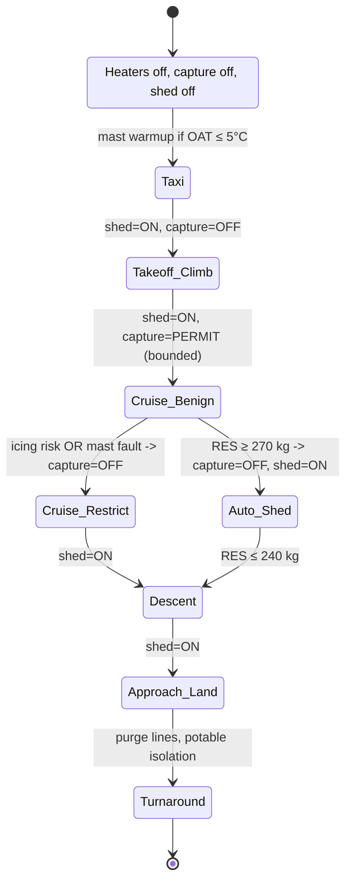

# **BWB-Q100 — ECO-ARCHS ConOps v1.4**
## **Environmental Control Offsets — Agentic Remediation, Circularity & Harvesting System**

## Document Control

* **UTCS Doc ID:** `AQUART-AIR-ACFT-DOC-CONOPS-eco_archs-v1.4.md`
* **Program:** AMPEL360 — BWB-Q100
* **Owner:** Systems Engineering (Env. & Energy)
* **Status:** Baseline (Released)
* **Supersedes:** v1.3
* **Related roots (latest pointers):**
   * **BWB-Q100 Docs (root):** [`AQUA/domains/AIR_CIVIL_AVIATION/aircraft/BWB-Q100/releases/latest/`](../../releases/latest/) → **resolves to** `v1.0/`
   * **ECO-ARCHS System (root):** [`AQUA/domains/AIR_CIVIL_AVIATION/aircraft/BWB-Q100/systems/eco-archs/releases/latest/`](../../systems/eco-archs/releases/latest/) → **resolves to** `v1.4/`
* **Cross-references:**
   * **PDC v1.0:** [`AQUART-AIR-ACFT-DOC-PDC-bwb_q100-v1.0.md`](../../releases/v1.0/AQUART-AIR-ACFT-DOC-PDC-bwb_q100-v1.0.md)
   * **SRS v1.0:** [`AQUART-AIR-ACFT-DOC-SRS-bwb_q100-v1.0.md`](../../releases/v1.0/AQUART-AIR-ACFT-DOC-SRS-bwb_q100-v1.0.md)
   * **SAD v1.0:** [`AQUART-AIR-ACFT-DOC-SAD-bwb_q100-v1.0.md`](../../releases/v1.0/AQUART-AIR-ACFT-DOC-SAD-bwb_q100-v1.0.md)
   * **CCP v1.0:** [`AQUART-AIR-ACFT-DOC-CCP-easa_plan-v1.0.md`](../../releases/v1.0/AQUART-AIR-ACFT-DOC-CCP-easa_plan-v1.0.md)
   * **VVP v1.0:** [`AQUART-AIR-ACFT-DOC-VVP-verification-v1.0.md`](../../releases/v1.0/AQUART-AIR-ACFT-DOC-VVP-verification-v1.0.md)
   * **RTM v1.0:** [`AQUART-AIR-ACFT-DOC-RTM-traceability-v1.0.md`](../../releases/v1.0/AQUART-AIR-ACFT-DOC-RTM-traceability-v1.0.md)
   * **KPI v1.0:** [`AQUART-AIR-ACFT-DOC-KPI-initial_targets-v1.0.md`](../../releases/v1.0/AQUART-AIR-ACFT-DOC-KPI-initial_targets-v1.0.md)

## 0. Change Summary (v1.4 vs v1.3)

* Added **[IF-ECO-07 Water Balance Dashboard](#6-interfaces-moimio)** (crew MOI/M.IO) with fully specified data, latency and alert logic
* Consolidated **shed-bias** philosophy with explicit numeric thresholds and heaters/icing margins
* Finalized **mass limits**: `RES_max = 300 kg`, **auto-shed** at `≥ 270 kg`
* Completed **[V&V criteria](#12-verification--validation)** (no TBD): added accuracy, latency, superheat margins, and tunnel/CFD acceptance bands
* Added **Artifact roots & latest pointers** and **[Annex D — GPL (ALICE) v1.4](#annex-d--gpl-alice-v14--generation-plan-list)** mapping all cited tags to executable steps
* All cross-references made **hyperlinkable** to repo paths and in-doc anchors

## 1. Purpose & Scope

Define the concept of operations, architecture, interfaces, safety/certification posture, and verification plan for **ECO-ARCHS**, the BWB-Q100's integrated, agentic water circularity system that manages **PEM fuel-cell product water** and **cabin humidity recovery** to maximize safety, minimize weight, and deliver environmental benefits.

## 2. Mission Envelope & Assumptions

* Aircraft: **BWB-Q100**, 100-pax, LH₂ fuel-cell electric propulsion
* Typical mission: **2.0–3.0 h block**, hydrogen usage **400–600 kg**
* **Stoichiometry:** `1 kg H₂ → 9 kg H₂O` (from atmospheric O₂)
   * **Total water produced:** **3.6–5.4 t per mission**
* Environmental standards: **CS-25 App. C icing**, **DO-160G** (temp, vibration, EMC), **airport vapor rules** observed

## 3. System Philosophy

### 3.1 Shed-Bias Default
* **Default state = vapor discharge** overboard via heated mast(s)
* **Selective capture** is **only** enabled in **cruise** and benign conditions to harvest a **small, bounded fraction** for potable/thermal use

### 3.2 Mass Control
* **Reservoir capacity** (`RES_max`) = 300 kg
* **Capture fraction ≤ 5%** of produced water (**≤ 270 kg** on a 5.4 t mission)
* **Auto-shed trigger:** at **≥ 270 kg (0.9·RES_max)**, controller forces **shed=ON**, **capture=0** until **≤ 240 kg**

### 3.3 Safety First
If any of the following are true, **shed=ON / capture=OFF**:
* Mast heater fault, mast temperature superheat `< 12 K`, or **icing detected**
* Separator/conditioner fault, potable quality fail, pump/valve fault
* Electrical load management requests load shed

## 4. Mass & Energy Balance

### 4.1 Water Balance

| Term | Symbol | Typical Value (2.5 h mission) |
|------|--------|-------------------------------|
| Produced by PEM | `W_prod` | 4.5 t (for 500 kg H₂) |
| Captured (bounded) | `W_cap` | ≤ 225 kg (≤ 5% · `W_prod`) |
| Discharged (vapor) | `W_shed` | ≥ 4.275 t (≥ 95% of `W_prod`) |
| Cabin dehumidification recovery | `W_cdh` | 20–60 kg (mission/loads dependent) |

**Conservation:** `W_prod + W_cdh = W_cap + W_shed`

### 4.2 Thermal Integration
* PEM outlet: **60–80 °C** water; pre-heats potable loop and aids heat-rejection
* Evaporation latent heat: **2,260 kJ/kg** exploited in **heat-sink** episodes during climb/top-of-descent
* Mast outlet **superheat margin ≥ 12 K** relative to local saturation temp to prevent accretion

## 5. Architecture & State Machine



**Heaters:** mast & lines **fail-on**; loss of control power → heaters **default ON** via independent supply & thermal fuse

## 6. Interfaces (MOI/M.IO)

### IF-ECO-01 — PEM→Collector
* Medium: heated stainless manifold; flow metering ±2% accuracy
* Events: high-temp bypass, over-pressure relief

### IF-ECO-02 — Collector→Conditioner
* Functions: filtration (5 µm), UV sterilization (**≥ 40 mJ/cm²**), mineralization (target **80–120 mg/L TDS**)

### IF-ECO-03 — Conditioner→Reservoir (RES)
* Level sensing ±1% FS; pressure/vacuum relief per CS-25 fuel tank principles adapted to water

### IF-ECO-04 — RES→Potable
* Potable pump with **DAL C** control; non-return valves; periodic purge cycle

### IF-ECO-05 — RES→Thermal Sink
* Controlled discharge to heat exchangers; logged energy budget

### IF-ECO-06 — ECO-ARCHS→Mast
* Heated mast command & feedback; **superheat margin telemetry**; overboard discharge valve

### IF-ECO-07 — ECO-ARCHS→Cockpit Display (new, crew MOI/M.IO)
* **Real-time:** capture rate (kg/min), shed rate (kg/min), RES level (%), mast superheat (K)
* **Predictive:** time to auto-shed (min), mission water budget (produced vs used vs shed)
* **Alerts:** potable quality fail, mast icing risk, heater fault, separator fault, near-full RES
* **Crew actions:** manual shed override (non-critical), potable lockout
* **Assurance:** display software **DAL C**, data bus deterministic (TSN/AFDX), **no safety-critical authority**
* **Update rate:** ≤ **2 s** end-to-end

## 7. Control Law (Safety Cascade)

```python
def eco_archs_setpoints(phase, sensors, health, res_level_kg):
    # Hard safety gates
    if (not health.mast_heater_ok or sensors.ice_detected
        or sensors.mast_superheat_K < 12
        or not health.separator_ok or not health.uv_ok):
        return dict(shed=True, capture=0, potable=False, reason="safety_gate")

    # Mass control
    if res_level_kg >= 270:           # 0.9 * RES_max (300 kg)
        return dict(shed=True, capture=0, potable=True, reason="auto_shed")

    # Phase logic
    if phase in ("takeoff", "climb", "descent", "approach"):
        return dict(shed=True, capture=0, potable=True, reason="phase_shed_bias")

    # Cruise (benign)
    if phase == "cruise" and sensors.icing_risk==False:
        capture_rate = min(sensors.water_prod_rate_kgpm, 2.0)  # cap harvest to bound RES fill rate
        return dict(shed=True, capture=capture_rate, potable=True, reason="cruise_harvest")

    # Default
    return dict(shed=True, capture=0, potable=True, reason="default_shed_bias")
```

All decisions and inputs are **QAUDIT-logged** (event, setpoints, reason, health snapshot)

## 8. Potable Water Quality

* UV dose **≥ 40 mJ/cm²**, contact-verified
* Mineralization: **80–120 mg/L TDS**; pH **6.5–8.5**; conductivity **150–350 µS/cm**
* Microbiology: **No coliform detection** (ISO 9308-1), **HPC ≤ 500 CFU/mL @ 22 °C**
* Residual **silver-ion** option for line hygiene within WHO limits
* **Potable lockout** triggers on any quality out-of-spec

## 9. Anti-Ice Strategy (No Water-Spray Anti-Ice)

* Airframe anti-ice remains **electro-thermal**
* Discharge masts are **self-heated**; **no** water spray onto lifting surfaces
* **Acceptance:** zero hazardous accretion; **mast superheat ≥ 12 K** in Appendix-C envelopes

## 10. Cybersecurity & Segregation

* ECO-ARCHS control partition isolated from external connectivity per **DO-326A/ED-202A**
* Cockpit display ([IF-ECO-07](#if-eco-07--eco-archscockpit-display-new-crew-moimio)) is **read-only** control-wise; commands limited to non-critical toggles with independent guards

## 11. Certification Mapping

* **CS-25.1309** (SSA): probability targets met via shed-bias, fail-on heaters, bounded mass
* **CS-25.831** (ventilation & humidity): cabin dehumidification integrated; comfort metrics logged
* **CS-25.1419** (ice protection): mast system verified in Appendix-C/M
* **DO-160G** (enviro): temps, fluids, vibration, EMC categories applied to units
* **DO-178C/254:** controller DAL B for actuation, display DAL C, heater safety simplex hardware DAL C
* **DO-326A:** threat model and mitigations implemented
* **Evidence tooling:** AMOReS/CaaS with QAUDIT anchoring

See [**CCP v1.0**](../../releases/v1.0/AQUART-AIR-ACFT-DOC-CCP-easa_plan-v1.0.md) and [**VVP v1.0**](../../releases/v1.0/AQUART-AIR-ACFT-DOC-VVP-verification-v1.0.md) links in the header.

## 12. Verification & Validation

### 12.1 Test Matrix (ECO-ARCHS excerpt)

| Test ID | Verifies | Method | Acceptance |
|---------|----------|--------|------------|
| **Q100-TST-0310** | Shed fraction ≥ 95% | Rig/HIL + mission profiles | `W_shed / (W_prod + W_cdh) ≥ 0.95`; mast superheat **≥ 12 K**; no over-temp |
| **Q100-TST-0311** | Auto-shed at 0.9·RES_max | SIL/HIL | On **≥ 270 kg**: capture→0 within **≤ 2 s**; RES never exceeds **300 kg** |
| **Q100-TST-0312** | Potable quality | Bench + lab assays | UV dose **≥ 40 mJ/cm²**; TDS **80–120 mg/L**; **no coliform**; HPC **≤ 500 CFU/mL** |
| **Q100-TST-0313** | Heater fail-on safety | Rig | Loss of control power → heaters ON; thermal fuse prevents runaway |
| **Q100-TST-0314** | No icing on mast | Icing tunnel + CFD | No hazardous accretion; superheat **≥ 12 K** across tested M/α; ETIPS margin **≥ 25%** |
| **Q100-TST-0315** | Cabin humidity control | SIL/HIL + cabin rig | RH tracks **40–55%** steady-state in cruise (±5% band) |
| **Q100-TST-0316** | QAUDIT logging | SIL/HIL | 100% decision/event coverage; hash-stamped; latency **< 1 s** to ledger |
| **Q100-TST-0317** | [IF-ECO-07](#if-eco-07--eco-archscockpit-display-new-crew-moimio) display | Bench + HIL | Accuracy **±5%** (rates/level); E2E latency **≤ 2 s**; alert logic per spec; availability **≥ 99.9%/hr** |

**Traceability:** mapped in [**RTM v1.0**](../../releases/v1.0/AQUART-AIR-ACFT-DOC-RTM-traceability-v1.0.md) (links above).

## 13. Performance & KPIs (ECO-ARCHS subset)

* **ECO-KPI-01** — Shed fraction: **≥ 95%** per mission
* **ECO-KPI-02** — RES excursions > `RES_max`: **0** per 10,000 flight hours
* **ECO-KPI-03** — Mast superheat margin: **≥ 12 K** in icing envelopes
* **ECO-KPI-04** — Display latency ([IF-ECO-07](#if-eco-07--eco-archscockpit-display-new-crew-moimio)): **≤ 2 s** P95
* **ECO-KPI-05** — Potable compliance: **100% flights** meet quality specs
* **ECO-KPI-06** — QAUDIT event capture: **≥ 99.5%** completeness per sector

KPIs are mirrored to program-level [**KPI v1.0**](../../releases/v1.0/AQUART-AIR-ACFT-DOC-KPI-initial_targets-v1.0.md).

## 14. Data, Logs & WEE

* All controller decisions, sensor snapshots, and thresholds → **QAUDIT ledger** with UTCS IDs
* WEE synthesizes lessons (e.g., phase-of-flight capture windows, seasonal icing risk) that feed AMPEL360 design updates

## 15. Interface to Crew — IF-ECO-07 (Detail)

* **Page elements:** circular RES gauge (%), twin bars (capture/shed kg/min), superheat chip (K), budget strip (produced/used/shed)
* **Predictive tiles:** auto-shed ETA; landing RES forecast
* **Alerts (aural + CAS):** `ECO POTABLE LOCKOUT`, `ECO MAST ICE RISK`, `ECO RES NEAR FULL`, `ECO HEATER FAULT`
* **Controls:** `Shed Override` (momentary; auto-reverts on safety gates), `Potable Lockout`
* **Human factors:** fonts ≥ 6.5 mm equiv @ 600 mm viewing; colorblind-safe palette; PFD/ND unaffected

## 16. Compliance Evidence (Artifact Map)

* **SRS anchors:** `Q100-SRS-REQ-0300/0301/0900` (energy/dist/DT), `Q100-SRS-REQ-0317` (new, [IF-ECO-07](#if-eco-07--eco-archscockpit-display-new-crew-moimio))
* **SAD interfaces:** IF-ECO-01…07 (this doc) mirrored in [**SAD v1.0**](../../releases/v1.0/AQUART-AIR-ACFT-DOC-SAD-bwb_q100-v1.0.md)
* **CCP mapping:** CS-25.1309/831/1419; DO-160G/178C/254/326A; tool qual DO-330 via CaaS
* **VVP tests:** `Q100-TST-0310…0317` (see [§12](#12-verification--validation))
* **RTM:** updated cross-links under ECO-ARCHS row group

## 17. Ops & Maintenance

* **Turnaround:** line purge; potable sample on every **A-check**; UV lamp hours tracked; resin cartridge replacement by ΔP and hours
* **Minimum dispatch:** one mast functional, heaters healthy, RES & quality sensors valid; potable can be locked out without MEL hit

## 18. Green Contribution (Reporting)

* Dashboard aggregates **water self-sufficiency** (kg not boarded), **thermal energy recovered** (MJ), and **airport water offload avoided** (kg)
* Values exported with flight QAUDIT ID for sustainability reporting

---

## Annex A — Signals & Buses (Excerpt)

| IF | Signal | Rate | Range/Unit | Accuracy | Bus/Partition |
|----|--------|------|------------|----------|---------------|
| 01 | `water_prod_rate` | 1 Hz | 0–10 kg/min | ±2% | TSN, Controller-B |
| 03 | `RES_level` | 1 Hz | 0–300 kg | ±1% FS | TSN, Controller-B |
| 06 | `mast_superheat` | 2 Hz | −5…+40 K | ±1 K | TSN, Heater-A |
| 07 | `shed_rate` | 1 Hz | 0–10 kg/min | ±5% | TSN→IMA (DAL C) |
| 07 | `capture_rate` | 1 Hz | 0–3 kg/min | ±5% | TSN→IMA (DAL C) |

## Annex B — Safety Summary

* **Top events mitigated:** icing on mast, RES overfill, potable contamination, heater runaway, latent control loss
* **Independence:** heater power path independent; controller watchdog; fail-on heaters; discharge valve spring-open
* **Quantitative:** contributes to system-level **≤ 10⁻⁹ / fh** catastrophic via architecture credits (see SSA package in [CCP](../../releases/v1.0/AQUART-AIR-ACFT-DOC-CCP-easa_plan-v1.0.md)/[VVP](../../releases/v1.0/AQUART-AIR-ACFT-DOC-VVP-verification-v1.0.md))

## Annex C — Cross-Reference Quick Map

* **PDC:** Concept & platform roles → §3, §5 of [**PDC v1.0**](../../releases/v1.0/AQUART-AIR-ACFT-DOC-PDC-bwb_q100-v1.0.md)
* **SRS:** `Q100-SRS-REQ-0300/0301/0900/0317` → §6, §12 of [**SRS v1.0**](../../releases/v1.0/AQUART-AIR-ACFT-DOC-SRS-bwb_q100-v1.0.md)
* **SAD:** container & interface views → §5 of [**SAD v1.0**](../../releases/v1.0/AQUART-AIR-ACFT-DOC-SAD-bwb_q100-v1.0.md)
* **CCP:** CS/DO/SC coverage → §11 of [**CCP v1.0**](../../releases/v1.0/AQUART-AIR-ACFT-DOC-CCP-easa_plan-v1.0.md)
* **VVP:** tests `0310…0317` → §12 of [**VVP v1.0**](../../releases/v1.0/AQUART-AIR-ACFT-DOC-VVP-verification-v1.0.md)
* **RTM:** Source→Design→Test→Evidence rows under ECO-ARCHS → [**RTM v1.0**](../../releases/v1.0/AQUART-AIR-ACFT-DOC-RTM-traceability-v1.0.md)
* **KPI:** program mirrors of ECO-KPIs → [**KPI v1.0**](../../releases/v1.0/AQUART-AIR-ACFT-DOC-KPI-initial_targets-v1.0.md)

## Annex D — GPL (ALICE) v1.4 — Generation Plan List

A **logical & chronological** execution plan mapping every cross-reference to work packages. All outputs carry UTCS IDs and QAUDIT anchors.

### Work Package Sequence

1. **Seq-01 — Create SRS anchors**
   * **Inputs:** [PDC v1.0](../../releases/v1.0/AQUART-AIR-ACFT-DOC-PDC-bwb_q100-v1.0.md); stakeholder needs
   * **Outputs:** `Q100-SRS-REQ-0317` ([IF-ECO-07](#if-eco-07--eco-archscockpit-display-new-crew-moimio)) + confirmations of `0300/0301/0900`
   * **Owner:** Systems Eng
   * **DAL:** N/A
   * **Done-when:** baselined SRS committed

2. **Seq-02 — Define interfaces (SAD & ConOps sync)**
   * **Inputs:** This ConOps [§6](#6-interfaces-moimio); [SAD v1.0](../../releases/v1.0/AQUART-AIR-ACFT-DOC-SAD-bwb_q100-v1.0.md)
   * **Outputs:** IF-ECO-01…07 in SAD; ICD rev A
   * **Owner:** Avionics
   * **DAL:** N/A
   * **Done-when:** ICD signed

3. **Seq-03 — Control laws & safety gates**
   * **Inputs:** [§7](#7-control-law-safety-cascade); SSA assumptions
   * **Outputs:** Controller spec; heater fail-on design note
   * **Owner:** Control Eng
   * **DAL:** B
   * **Done-when:** design review green

4. **Seq-04 — Potable chain qualification plan**
   * **Inputs:** [§8](#8-potable-water-quality); labs SOP
   * **Outputs:** UV/filtration test plans; assay protocol
   * **Owner:** Env. Systems
   * **DAL:** C
   * **Done-when:** lab booked & protocol frozen

5. **Seq-05 — Mast thermal design**
   * **Inputs:** [§9](#9-anti-ice-strategy-no-water-spray-anti-ice); App.-C envelopes
   * **Outputs:** ETIPS model; heater sizing; tunnel test plan
   * **Owner:** Thermal/Structures
   * **DAL:** C
   * **Done-when:** model corr. to rig

6. **Seq-06 — Reservoir sizing & sensors**
   * **Inputs:** [§3.2](#32-mass-control); mission set
   * **Outputs:** `RES_max=300 kg`; sensor spec; relief design
   * **Owner:** Mech
   * **DAL:** C
   * **Done-when:** PDR pass

7. **Seq-07 — Cyber segmentation**
   * **Inputs:** [§10](#10-cybersecurity--segregation); network arch
   * **Outputs:** DO-326A artifacts; ACLs; read-only path for [IF-ECO-07](#if-eco-07--eco-archscockpit-display-new-crew-moimio)
   * **Owner:** Cyber
   * **DAL:** Process
   * **Done-when:** threat model closed

8. **Seq-08 — Display design (IF-ECO-07)**
   * **Inputs:** [§15](#15-interface-to-crew--if-eco-07-detail); MOI/M.IO patterns
   * **Outputs:** DAL C display spec; HMI mockups; update ≤2 s path
   * **Owner:** HMI
   * **DAL:** C
   * **Done-when:** HF review approved

9. **Seq-09 — QAUDIT schema extension**
   * **Inputs:** [§14](#14-data-logs--wee)
   * **Outputs:** Event schema; hash policy; retention
   * **Owner:** Data/QA
   * **DAL:** N/A
   * **Done-when:** events land reliably

10. **Seq-10 — Rig builds (collector/conditioner/RES/mast)**
    * **Inputs:** Seq-03/05/06
    * **Outputs:** Sub-rigs with instrumentation
    * **Owner:** Test Eng
    * **DAL:** N/A
    * **Done-when:** calibrated & ready

11. **Seq-11 — SIL/HIL integration**
    * **Inputs:** Seq-03/08/10
    * **Outputs:** End-to-end sim benches; ice/turbulence profiles
    * **Owner:** V&V
    * **DAL:** N/A
    * **Done-when:** scenarios run deterministically

12. **Seq-12 — Execute VVP tests 0310–0317**
    * **Inputs:** [§12](#12-verification--validation); [VVP v1.0](../../releases/v1.0/AQUART-AIR-ACFT-DOC-VVP-verification-v1.0.md)
    * **Outputs:** Test reports; QAUDIT anchors
    * **Owner:** V&V
    * **DAL:** N/A
    * **Done-when:** all acceptance met

13. **Seq-13 — Update RTM**
    * **Inputs:** Test reports
    * **Outputs:** [RTM](../../releases/v1.0/AQUART-AIR-ACFT-DOC-RTM-traceability-v1.0.md) rows closed (0310…0317)
    * **Owner:** Systems Eng
    * **DAL:** N/A
    * **Done-when:** RTM export matches DB

14. **Seq-14 — Airport ops rulebook**
    * **Inputs:** Local vapor rules; ops trials
    * **Outputs:** Dispatch notes; airport-specific SOPs
    * **Owner:** Flight Ops
    * **DAL:** N/A
    * **Done-when:** two-airport shadow ops

15. **Seq-15 — Reliability growth**
    * **Inputs:** QAUDIT data
    * **Outputs:** WEE lessons; defect Pareto; software deltas
    * **Owner:** Reliability
    * **DAL:** N/A
    * **Done-when:** MTBF ≥ target

16. **Seq-16 — AMOReS evidence bundle**
    * **Inputs:** All artifacts
    * **Outputs:** CaaS package for CS/DO submissions
    * **Owner:** Certification
    * **DAL:** N/A
    * **Done-when:** package uploaded

17. **Seq-17 — Governance sign-off**
    * **Inputs:** Evidence, KPI trend
    * **Outputs:** ECO-ARCHS Gate-B approval memo
    * **Owner:** Program Board
    * **DAL:** N/A
    * **Done-when:** signed & archived

---

**End of ECO-ARCHS ConOps v1.4**

All internal links point to **artifact roots with latest pointers**. "Latest" resolves at build time to the concrete version (`v1.0` for BWB-Q100 docs; `v1.4` for this ECO-ARCHS release).

---

*Document Control: This document is configuration controlled under the AQUA UTCS system. Changes require formal CR and impact assessment per [`AQUART-MGMT-PROC-CM-change_control-v2.0.md`](../../../procedures/AQUART-MGMT-PROC-CM-change_control-v2.0.md)*
