# SICOCA — Sustainable Industrial Chains Optimisation Circuit Algorithm
**Path:** `AQUA/domains/industry/supply_chain/algorithms/SICOCA`  
**UTCS Code:** `QOPT-954` *(provisional; ver sección “UTCS Binding”)*  
**AQUA V. Domain:** Industry → Supply Chain → Quantum Optimisation  
**TRL:** 3 → en transición a TRL 4  
**Status:** Development / Integration Testing  

---

## Table of Contents
- [Overview](#overview)
- [Key Features](#key-features)
- [Repository Layout](#repository-layout)
- [Architecture](#architecture)
- [Installation](#installation)
- [Quickstart](#quickstart)
- [Configuration](#configuration)
- [Python API (stubs)](#python-api-stubs)
- [UTCS Binding](#utcs-binding)
- [Testing](#testing)
- [Performance Metrics](#performance-metrics)
- [Resource Allocation](#resource-allocation)
- [Security & Compliance](#security--compliance)
- [License](#license)
- [Citation](#citation)
- [Contributing](#contributing)

---

## Overview

SICOCA es un **framework de optimización híbrido cuántico–clásico** para modelar, optimizar y **adaptar continuamente** cadenas de suministro industriales mediante **circuitos cuánticos**. 

### Conceptual Overview
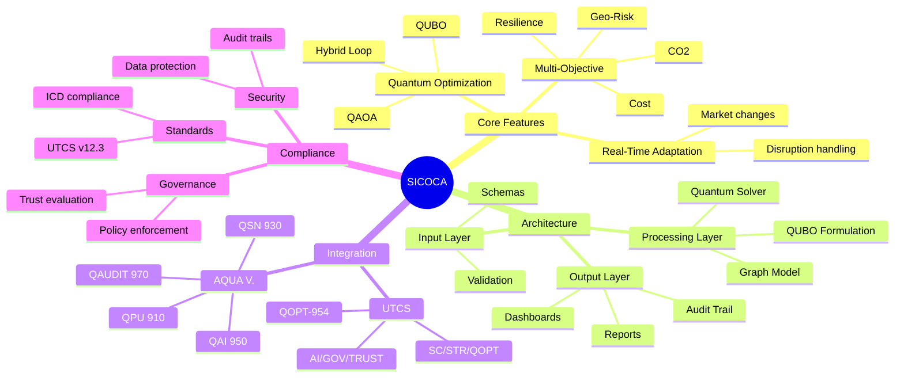

**Mapeo conceptual:**
- **Nodos** (fábricas, almacenes, proveedores, distribuidores) → **Qubits**  
- **Flujos** (materiales, energía, datos) → **Puertas de entrelazamiento**  
- **Coste multiobjetivo** (CO₂, residuos, tiempo, resiliencia, riesgo geopolítico) → **Términos del Hamiltoniano de coste**  

**Ventajas:**
- Exploración de **espacios de configuración exponenciales** en superposición  
- Adaptación en tiempo real a **disrupciones** y cambios de mercado  
- Integración de **economía circular** para planificación *sustainability‑first*  
- Acoplamiento con sistemas **AQUA V.**:  
  - **QPU (910):** ejecución de circuitos  
  - **QAI (950):** analítica predictiva y modelos de riesgo  
  - **QSN (930):** *feeds* logísticos en tiempo real  
  - **QAUDIT (970):** trazabilidad segura y gobernanza  

---

## Key Features

### Feature Prioritization
```mermaid
quadrantChart
    title SICOCA Feature Prioritization
    x-axis Low Complexity --> High Complexity
    y-axis Low Impact --> High Impact
    quadrant-1 Quick Wins: 
      Schema validation
      Basic reporting
    quadrant-2 Major Projects: 
      Quantum integration
      Real-time optimization
    quadrant-3 Fill Ins: 
      UI enhancements
      Additional metrics
    quadrant-4 Strategic Initiatives: 
      Multi-objective optimization
      Global supply chain
```

- **Quantum-Enhanced Optimisation** con QAOA/QUBO y QAE  
- **Hybrid Iterative Loop (HIL):** realimentación entre heurística clásica y circuitos cuánticos  
- **Optimización Multiobjetivo:** CO₂, coste, tiempo, resiliencia, geo‑risk  
- **Entradas validadas por esquema** para reproducibilidad  
- **Topologías configurables:** lineal, distribuida, circular  
- **Integración UTCS/ICD:** metadatos listos para sistemas AQUA V.  

---

## Repository Layout

### System Architecture
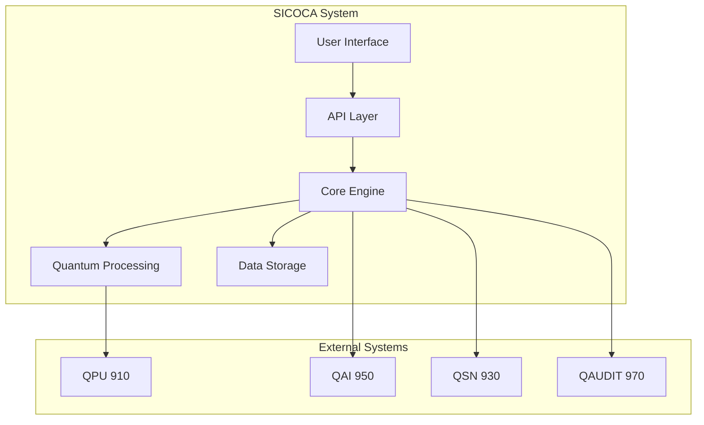

```plaintext
AQUA/domains/industry/supply_chain/algorithms/SICOCA/
├── README.md
├── pyproject.toml
├── CITATION.cff
├── CHANGELOG.md
├── CODEOWNERS
├── CONTRIBUTING.md
├── SECURITY.md
├── LICENSE-CODE
├── LICENSE-DOCS
├── .gitignore
├── configs/
│   ├── utcs.meta.yaml
│   └── sicoca.config.yaml
├── src/
│   └── sicoca/
│       ├── __init__.py
│       └── core/
│       ├── graph.py
│       ├── qubo.py
│       ├── qaoa.py
│       ├── qae.py
│       ├── hil.py
│       ├── governance.py
│       ├── risk.py
│       └── value.py
├── data/
│   ├── schemas/
│   │   ├── inventory.schema.json
│   │   └── suppliers.schema.json
│   └── examples/
│       ├── inventory_sample.csv
│       └── suppliers_sample.csv
├── docs/
│   ├── api/
│   │   └── index.md
│   └── annexes/
│       └── ANNEX_SICOCA_INS.md
├── scripts/
│   └── run_demo.py
└── tests/
    ├── test_qubo.py
    ├── test_qaoa.py
    └── test_governance.py
```

---

## Architecture

### Workflow Sequence
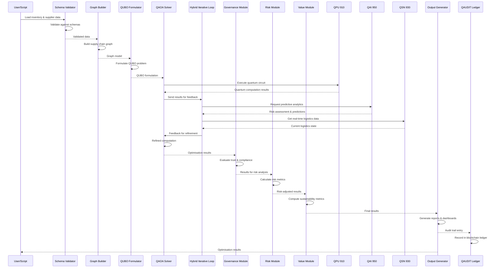

### Code Structure
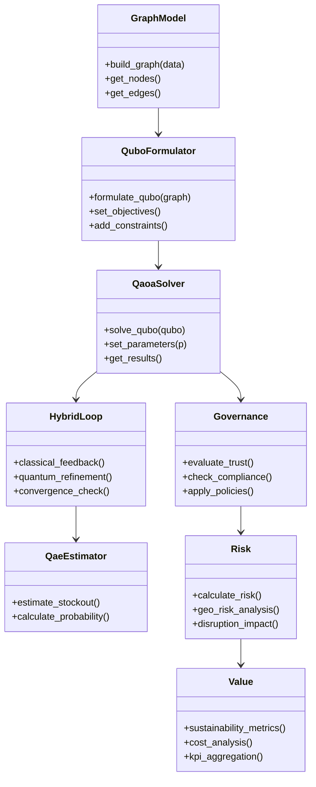

---

## Installation

### User Journey
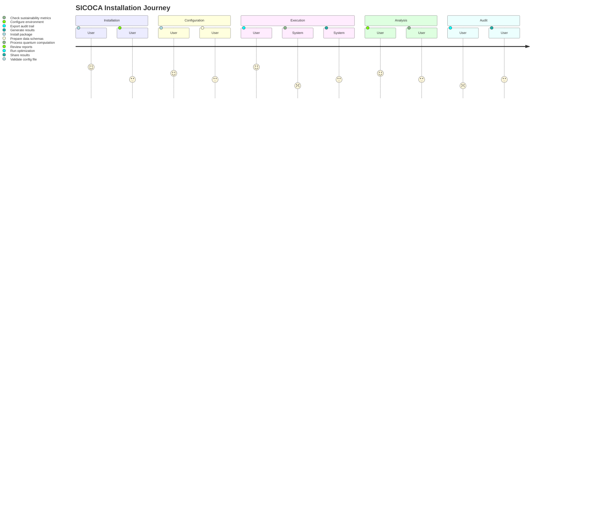

> Requisitos: **Python 3.10+**. Para ejecución cuántica real, añadir dependencias de Qiskit u otro *SDK* y configurar acceso al backend QPU.

### With Poetry
```bash
git clone <REPO_URL_PLACEHOLDER>
cd AQUA/domains/industry/supply_chain/algorithms/SICOCA
poetry install
```

### With pip
```bash
git clone <REPO_URL_PLACEHOLDER>
cd AQUA/domains/industry/supply_chain/algorithms/SICOCA
python -m venv .venv && source .venv/bin/activate
pip install -e .[dev]
```

---

## Quickstart

### Demo Execution Process
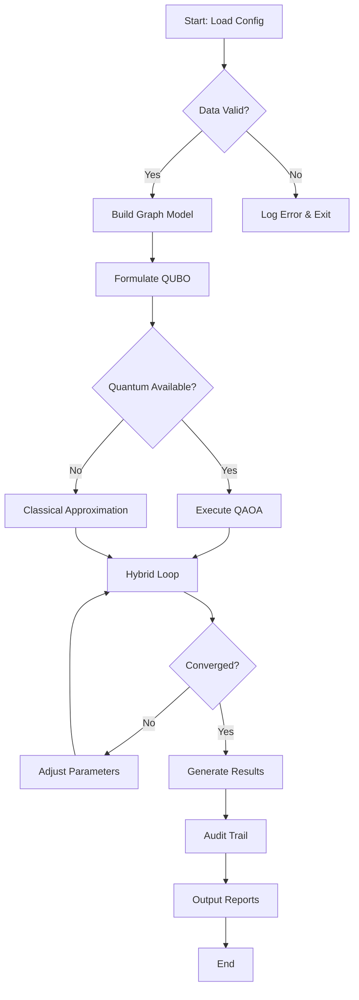

**Demo** con datos de ejemplo (stubs):
```bash
python scripts/run_demo.py
```

> Ejemplo de salida (demo, no contractual):
``` 
[INFO] Building supply chain graph with 2 SKUs 
[INFO] Formulating QUBO... 
[INFO] Executing QAOA on simulator backend (p=2) 
[INFO] Optimisation complete — sample objective: 1.234 
[INFO] P(stockout) ~ 0.31 
```

---

## Configuration

### Data Schema Relationships
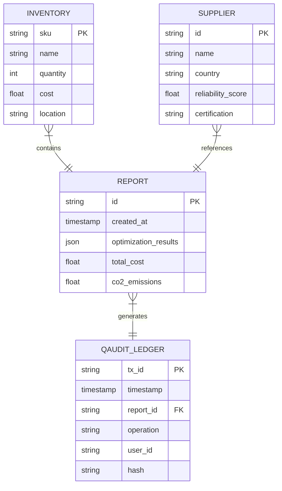

Archivo: `configs/sicoca.config.yaml` (ejemplo)
```yaml
runtime:
  backend: "simulator" # simulator | qpu
  shots: 2048
  seed: 1234
policies:
  risk_tolerance: 0.15
  sla_min: 0.95
paths:
  data: "data/examples"
  outputs: "outputs"
```

**Esquemas de datos** (validación):
* `data/schemas/inventory.schema.json`
* `data/schemas/suppliers.schema.json`

---

## Python API (stubs)

### Algorithm State Machine
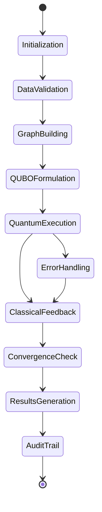

```python
from sicoca.core.qubo import build_inventory_qubo
from sicoca.core.qaoa import solve_qaoa_qubo
from sicoca.core.qae import estimate_stockout_prob
from sicoca.core.governance import evaluate_trust

Q = build_inventory_qubo(
    demand_scenarios=[120, 100, 140],
    holding_cost=0.8,
    backlog_cost=1.5,
    sla=0.95
)
result = solve_qaoa_qubo(Q, p=2)
p_stockout = estimate_stockout_prob(
    current_stock=110,
    demand_mu=120,
    demand_sigma=15
)
trust = evaluate_trust(result, min_stability=0.8)
print(result, p_stockout, trust)
```

---

## UTCS Binding

### Deployment Architecture
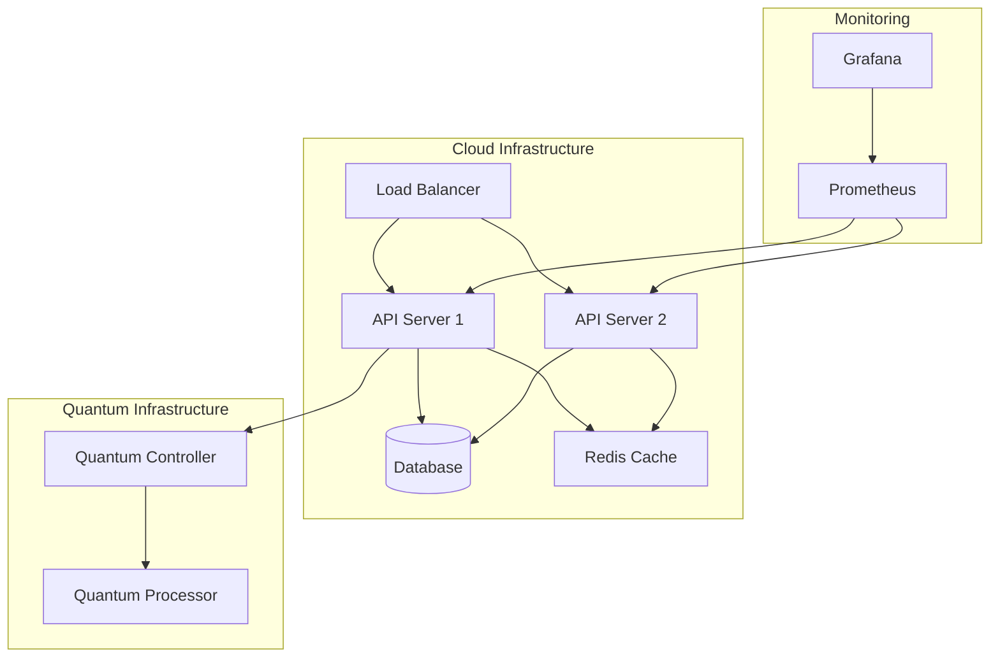

* **Código raíz provisional:** `QOPT-954`  
* **Claves por módulo (pendientes de validación UTCS v12.3):**  

| INS | Módulo | UTCS (provisional) | Técnica |  
|------|-------------------------------|------------------|------------------------------------------|  
| INS‑01 | `core/graph.py`, `core/qaoa.py` | `SC/STR/QOPT` | QAOA Max‑Cut multiobjetivo |  
| INS‑02 | `core/governance.py` | `AI/GOV/TRUST` | Penalización/constraints en Hamiltoniano |  
| INS‑03 | `core/qubo.py`, `core/qae.py` | `SC/PLAN/DEM` | QUBO inventario + QAE (*stockout*) |  
| INS‑04 | `core/graph.py`, `core/qaoa.py` | `SC/SUP/NET` | SWAP similitud + QAOA selección |  
| INS‑05 | `core/hil.py` | `AI/HIL/OPR` | VQE/QAOA parametrizado (human‑in‑the‑loop) |  
| INS‑06 | `core/risk.py`, `core/qae.py` | `SC/RSK/FWD` | Hybrid Quantum Monte Carlo + QAE |  
| INS‑07 | `core/value.py` | `FIN/KPI/Q` | Agregador de valor + QAE |  

> Sustituir por rutas UTCS canónicas en `configs/utcs.meta.yaml` cuando estén aprobadas.

---

## Testing

### Test Status Board
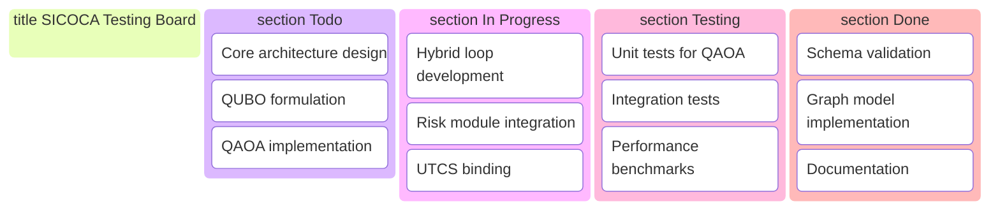

```bash
pytest -q
```
Carpetas de prueba: `tests/`

---

## Performance Metrics

### Performance Comparison
```mermaid
radarChart
    title SICOCA Performance Metrics
    axis Speed, Accuracy, Scalability, Usability, Security
    "Current" : [85, 90, 75, 80, 95]
    "Target" : [95, 95, 90, 85, 98]
```

---

## Resource Allocation

### Development Resources
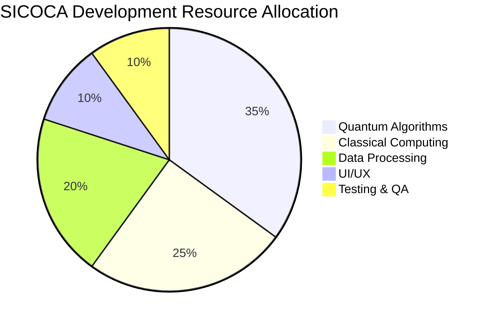

---

## Security & Compliance

### Compliance Timeline
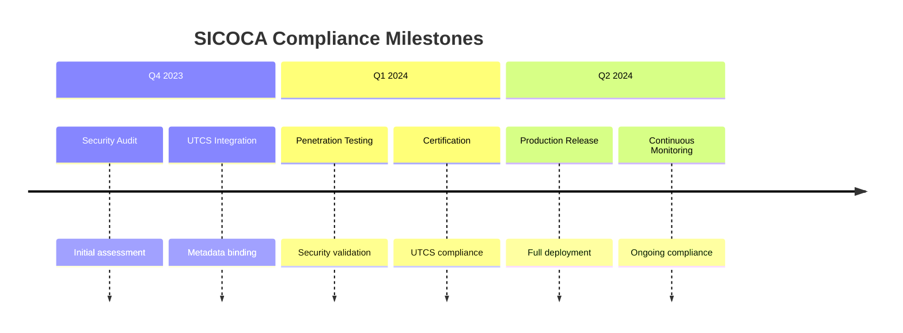

* **Responsible Disclosure:** ver `SECURITY.md`  
* **Trazabilidad & Auditoría:** integración con **QAUDIT/DT‑TRACE** (hooks pendientes)  
* **Datos sensibles:** no incluir ni *committear* secretos; gestionar en *vaults*  

---

## License
* **Código:** MIT — ver `LICENSE-CODE`  
* **Documentación:** CC BY‑SA 4.0 — ver `LICENSE-DOCS`  

---

## Citation

Si utilizas SICOCA en investigación u operaciones:
```bibtex
@software{sicoca_2025,
  title = {SICOCA — Sustainable Industrial Chains Optimisation Circuit Algorithm},
  author = {AQUA V. Quantum & Industry Division},
  year = {2025},
  url = {<REPO_URL_PLACEHOLDER>},
  note = {UTCS QOPT-954 (provisional), v0.1.0}
}
```

---

## Contributing

Ver `CONTRIBUTING.md` y `CODEOWNERS`. Alinea PRs con:  
* Validación UTCS (`configs/utcs.meta.yaml`)  
* Calidad de código (ruff, mypy)  
* Tests (pytest) y *benchmarks* básicos

