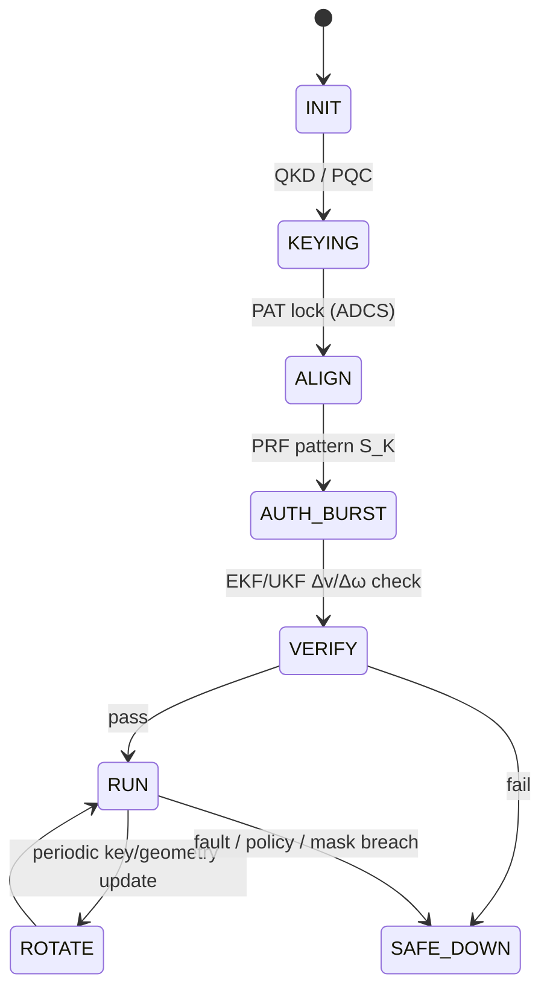
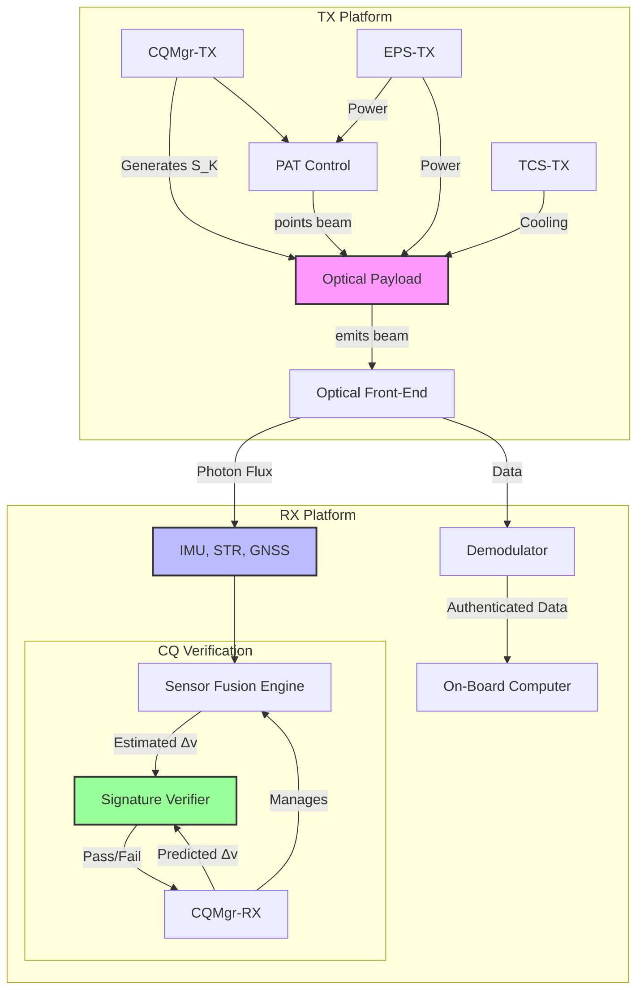

# Cryptoquantic Links: Physical Layer Authentication and Propulsion Assist via Momentum-Coupled Information Channels

**Authors:**  
Amedeo Pelliccia  
**Version:** v1.0 (Camera-ready)  
**Program Context:** AMPEL360 · AQUA V. · UTCS-compliant · S1000D-ready

> **Note:** Equations are shown in LaTeX for readability and copy/paste. For rendered math, see [docs/cryptoquantics.pdf](link-to-pdf) or the equation images below. GitHub does not natively render LaTeX equations in Markdown files.

---

## Abstract

Modern space-based systems rely on cryptographic protocols operating at the upper layers of the communication stack, leaving the physical layer vulnerable to sophisticated spoofing and intercept attacks. This paper introduces **Cryptoquantics**, a novel framework for co-designing optical and microwave communication links that embeds security directly into the physics of the transmission medium. We formalize the concept of a **cinematic channel**, where a cryptographically keyed, time-varying pattern of photon momentum is modulated onto a high-bandwidth data stream. This dual-use beam simultaneously transmits information and imparts a verifiable kinetic signature (a specific change in velocity, Δv, and/or angular momentum, Δω) onto the receiving spacecraft. Authentication is achieved by requiring the receiver to successfully verify both the digital data and the predicted kinematic effects, a task that is physically prohibitive for an adversary without control of a commensurate power source and precise pointing. We present the **Cryptoquantic Secure Session Protocol (CQ‑SSP)**, detail its resilience against advanced, physics-conditioned generative adversarial network (PC‑GAN) attacks through multi-node consensus and cross-modal sensor validation, and establish the system's engineering requirements. The framework not only establishes a new paradigm for physical layer security but also enables secondary functionality, such as propellantless momentum management and precision attitude-control assist.

**Keywords:** physical-layer security, optical ISL, photon pressure, Δv/Δω authentication, GNC, QKD, post-quantum cryptography, multi-node consensus, ADCS, spacecraft propulsion assist

---

## 1. Introduction

The security of space-based assets is a paramount concern for commercial, civil, and defense operations. Current security architectures for space communication links predominantly rely on well-established cryptographic algorithms (e.g., AES, RSA, ECC) and emerging post-quantum cryptography (PQC) implemented at the network, transport, or application layers [1]. While robust, these methods implicitly trust the integrity of the underlying physical signal. An advanced adversary capable of intercepting and re-transmitting a signal, or inserting a malicious one, could potentially spoof a legitimate communication partner, even if the encrypted payload remains secure [2]. This vulnerability represents a critical gap in end-to-end security, particularly for autonomous systems that rely on communication links for guidance, navigation, and control (GNC).

The principle of radiation pressure, first formalized by Maxwell and experimentally verified by Lebedev and later Nichols and Hull, dictates that electromagnetic radiation carries momentum and exerts a force upon interaction with matter [3, 4]. This physical phenomenon is the basis for solar sails and has been proposed for various micro-propulsion applications [5]. To date, however, the momentum transfer inherent in a communication link has been treated primarily as a disturbance to be rejected by the attitude determination and control system (ADCS).

This paper proposes a paradigm shift: we treat photon momentum not as a disturbance, but as a controllable, verifiable feature of the communication link. We introduce **Cryptoquantics**, a framework that leverages the fundamental physics of photon momentum to create a secure, authenticated physical layer. The core innovation is the **cinematic channel**: a low-bandwidth information channel encoded in the kinetic impulse delivered by the communication beam. By securely keying the beam's power, pointing vector, and timing, a transmitter (TX) can impart a unique Δv signature onto a receiver (RX), which serves as a physical "password."

**Contributions.**  
(i) **Formalization of the Cinematic Channel:** we develop physical and information-theoretic models for a momentum-based channel, establishing observability and capacity limits.  
(ii) **CQ‑SSP Protocol:** we specify a complete session protocol that integrates the cinematic channel with classical data transmission and QKD/PQC keying.  
(iii) **Resilience to Physics-Aware Adversaries:** we analyse security against physics-conditioned GANs (PC‑GANs) and propose a defensive architecture based on multi-node consensus and cross‑modal residual testing.

This work transforms the physical layer from a passive vulnerability into an active instrument of security, binding digital identity to demonstrable physical action.

---

## 2. Theoretical Framework: The Cinematic Channel

Cryptoquantics establishes three coupled channels between the transmitter (TX) and receiver (RX).

### 2.1 Classical and Quantum Channels

The primary high-bandwidth channel is a standard **classical data link**, typically an optical laser channel, modulated to carry mission data with FEC. Its performance follows the familiar link budget:

LaTeX: `$$ \mathrm{SNR} \approx \frac{(R_p P_r)^2}{N_0 B}, \qquad R \lesssim B \log_2(1+\mathrm{SNR}) \tag{1} $$`


where $R_p$ is photodetector responsivity, $P_r$ received optical power, $B$ bandwidth, and $N_0$ noise PSD [6]. For session keying we recommend a **quantum channel** using QKD (e.g., BB84) [7]. Alternatively, NIST-standardized PQC may be used where QKD is impractical.

### 2.2 Cinematic Channel: Physics and Observability

The **cinematic channel** uses controlled photon momentum as the information carrier. The force $\mathbf{F}(t)$ from an optical beam of power $P(t)$ with incidence unit vector $\hat{\mathbf{n}}(t)$ on a spacecraft of mass $m$ is:

LaTeX: `$$ \mathbf{F}(t) = \frac{\alpha P(t)}{c}\,\hat{\mathbf{n}}(t) \tag{2} $$`


with $c$ the speed of light and $\alpha \in [1,2]$ the reflectivity coefficient ($\alpha=1$ absorption, $\alpha=2$ perfect reflection). The induced velocity change over interval $T$ is:

LaTeX: `$$ \Delta \mathbf{v} = \frac{1}{m} \int_{t_0}^{t_0+T} \mathbf{F}(t)\,dt \tag{3} $$`


Despite the small absolute force (e.g., 10 kW → ≈ 67 μN), the resulting acceleration is measurable by modern spacecraft instrumentation. We define an **acceleration SNR**:

LaTeX: `$$ \mathrm{SNR}_a = \frac{a_{\mathrm{sig}}^2}{\sigma_a^2} \tag{4} $$`


where $a_{\mathrm{sig}}$ is mean acceleration from the cryptoquantic signal and $\sigma_a^2$ is the variance of the fused acceleration noise (IMU + OD). For binary power modulation with symbol time $T_s$ and noise correlation time $T_n$, the bit error probability is:

LaTeX: `$$ P_b \approx Q\!\left(\sqrt{2\,\mathrm{SNR}_a\,\frac{T_s}{T_n}}\right) \tag{5} $$`


This bounds the cinematic channel as a **low-rate** but robust authentication channel.

> **Momentum ledger (physics bound).** Any thrust claim must satisfy $F \le P_{\mathrm{rad}}/c$ with explicit accounting of momentum exchange (photons, environment, or remote beamer).

---

## 3. Cryptoquantic Secure Session Protocol (CQ‑SSP)

CQ‑SSP orchestrates three channels via a session state machine and a keyed **AUTH‑BURST** that imprints a verifiable Δv/Δω signature.

### 3.1 State Machine



### 3.2 Signature Construction & Verification

A session key $K$ (QKD/PQC) seeds a PRF $f_K$ that generates control tuples:

LaTeX: `$$ \mathcal{S}_K \!=\! \{(P_i,\theta_i,\phi_i,T_i)\}_{i=1}^N \!=\! f_K(\text{context}) \tag{6} $$`


Context includes mission time, ephemerides, session ID. TX executes $\mathcal{S}_K$ during **AUTH‑BURST**. RX's V&V fuses IMU, star tracker, and OD to estimate $\widehat{\Delta \mathbf{v}}$. Authentication succeeds if:

LaTeX: `$$ \left\| \widehat{\Delta \mathbf{v}} - \Delta \mathbf{v}(\mathcal{S}_K) \right\| \le \varepsilon_{\Delta v}, \quad \Pr \ge 1-\beta \tag{7} $$`


### 3.3 ToO‑MAC Scheduler (Talk‑and‑Thrust)

- Inputs: `SNR_target`, `BER_target`, `Δv_target`, thermal & PAT budgets.
- Decision: slot-wise power, micro-offset, dwell.
- Constraint: do not degrade primary BER beyond target; satisfy Δv within window.

**Algorithm 1 (sketch).**
```
for slot in session:
    QoS = predict_BER(SNR, Mod, FEC)
    dV  = predict_delta_v(P, offset, reflectivity, duration)
    score = wq*QoS + wt*dV - wtq*Thermal - wr*Risk
    choose slot params maximizing score under constraints
    commit(TxPower, BeamOffset, ModScheme, Duration)
```

---

## 4. Threat Model & Advanced Defenses

### 4.1 Physics-Conditioned GAN (PC‑GAN)

Adversary trains a generator $G_\theta(z,c)$ to synthesize sensor time series (optical, IMU, star tracker, thermal) that mimic a valid session. We augment the discriminator with **physics-residual validators** and penalize violations:

LaTeX: `$$ \mathcal{L}_G = \mathcal{L}_{\mathrm{adv}} + \sum_i \lambda_i\|R_i\|^2 \tag{8} $$`


with residuals $R_i$ for orbital dynamics, attitude torque closure, and thermal‑power consistency.

### 4.2 Layered Defenses

1) **Multi-node physical consensus:** ≥3 observers confirm the same Δv/Δω within $\varepsilon_{\mathrm{cons}}$.  
2) **Randomized beam geometry:** key‑derived micro‑offsets $(\delta\theta,\delta\phi,\delta P)$ below BER impact but above gyro noise.  
3) **Cross‑modal residuals:** absorbed power ↔ ΔT; offset ↔ torque ↔ gyro drift; external laser ranging for OD cross‑check.

---

## 5. System Implementation & Requirements (LEO Reference)

**Table 1 — Key Requirements**

| Subsystem | Parameter | Requirement | Rationale |
|---|---|---|---|
| ADCS/PAT | Pointing error (AUTH‑BURST) | ≤ 10 µrad (1σ) | Signature fidelity |
|  | Jitter PSD | Must not degrade BER > 1e-6 | Protects data channel |
| EPS/TCS | TX power slew | ≤ dP/dt_max | Bus/thermal stability |
|  | Optics bench ΔT (60 s) | ≤ 0.5 °C | Alignment integrity |
| V&V/GNC | σ(Δv) over 600 s | ≤ 0.05 mm/s | Low false alarms |
|  | Auth. confidence | ≥ 0.999 | Strong acceptance gate |
| Security | Key source | QKD or NIST PQC (FS) | Future-proof keys |
|  | Signature gen | Keyed PRF, context-bound | Anti-replay |

---

## 6. Verification & Validation (V&V)

- **TV‑1 (Link + Δv co-mode):** AUTH‑BURST with BER ≤ target and $\|\widehat{\Delta v}-\Delta v_{\text{pred}}\|\le 3\sigma$.  
- **TV‑2 (Sensor spoof resilience):** HIL injection; detect TPR ≥ 0.99, FAR ≤ 1e−3.  
- **TV‑3 (Multi-node consensus):** two sats + ground confirm Δv within $\varepsilon_{\mathrm{cons}}$.  
- **TV‑4 (Momentum ledger check):** verify $F \le P_{\mathrm{rad}}/c$; audit power, thermal, radiation.

---

## 7. Discussion & Future Work

Cryptoquantics elevates the physical layer to an authentication primitive. Limitations are the low capacity of the cinematic channel and dependence on sensor noise floors. Near-term work: (i) optimal co-optimization of data rate and Δv under thermal/PAT constraints; (ii) extension to modulated thermal radiation as an auxiliary covert channel; (iii) on-orbit demos combining station-keeping assist with periodic AUTH‑BURSTs.

**PQP Pathway (Physics-compliant):** Propulsion assist today is photon-pressure based. Longer term, **Dynamical Casimir Emission (DCE)** may serve as a photon source for thrust $F=P_{\mathrm{DCE}}/c$ (still a photon rocket by momentum ledger). Pure "reactionless" Casimir drives in vacuum are excluded by conservation bounds.

---

## 8. Conclusion

Cryptoquantics integrates cryptographic protocols with the physics of photon momentum. By transmitting a verifiable kinetic signature alongside a classical data stream, the method binds a transmitter's digital identity to its physical capabilities and location, providing robust protection against advanced spoofing attacks while enabling propellantless momentum management. With demands compatible with near-term optical ISL and precision GNC, Cryptoquantics offers a deployable pathway toward intrinsically secure space links with operational benefits.

---

## References

[1] D. D. C. de Rubert, et al., "A Survey on Security for Space Systems," *ACM Computing Surveys*, vol. 52, no. 1, pp. 1-38, 2019.  
[2] T. E. Humphreys, "Statement on the Vulnerability of Civil Unmanned Aerial Vehicles and other Systems to GPS Spoofing," U.S. House of Representatives Committee on Homeland Security, 2012.  
[3] J. C. Maxwell, *A Treatise on Electricity and Magnetism*, vol. 2, Oxford: Clarendon Press, 1873.  
[4] E. F. Nichols and G. F. Hull, "The Pressure due to Radiation," *Physical Review (Series I)*, vol. 17, no. 1, pp. 26-50, 1903.  
[5] C. R. McInnes, *Solar Sailing: Technology, Dynamics and Mission Applications*, Springer-Praxis, 2004.  
[6] J. G. Proakis and M. Salehi, *Digital Communications*, 5th ed., McGraw-Hill, 2008.  
[7] C. H. Bennett and G. Brassard, "Quantum cryptography: Public key distribution and coin tossing," in *Proc. IEEE Int. Conf. on Computers, Systems and Signal Processing*, 1984, pp. 175-179.  
[8] B. D. Tapley, B. E. Schutz, and G. H. Born, *Statistical Orbit Determination*, Elsevier Academic Press, 2004.  
[9] I. Goodfellow, et al., "Generative Adversarial Nets," in *Advances in Neural Information Processing Systems 27*, 2014.  
[10] B. L. Edwards, "An overview of the Laser Communications Relay Demonstration Project," *Proceedings of the IEEE*, vol. 104, no. 11, pp. 2101-2117, 2016.

---

## Annex A — Nomenclature

- $B$: Channel bandwidth (Hz)  
- $c$: Speed of light (m/s)  
- $\hat{\mathbf{n}}$: Beam incidence unit vector  
- $N_0$: Noise power spectral density (W/Hz)  
- $P, P_r, P_{\mathrm{rad}}$: Optical power (W)  
- $Q(\cdot)$: Gaussian tail function  
- $R$: Data rate (bit/s)  
- $R_p$: Photodetector responsivity (A/W)  
- $\alpha$: Reflectivity factor (1–2)  
- $\mathbf{F}$: Force (N)  
- $m$: Spacecraft mass (kg)  
- $\Delta \mathbf{v}$: Velocity change (m/s)  
- $\mathrm{SNR}, \mathrm{SNR}_a$: Signal‑to‑noise ratios  
- $T_s$: Symbol time; $T_n$: Noise correlation time

---

## Annex B — EKF Measurement Model (Δv/Δω)

State vector $x=[\mathbf{r},\mathbf{v},\mathbf{q},\boldsymbol\omega, \ldots]^T$.  
Control input $u=\{P,\hat{\mathbf{n}},\mathrm{dwell}\}$.  
Process: rigid‑body + two‑body orbit + perturbations; measurement: IMU (accel, gyro), star tracker (quaternion), GNSS/OD.  
Residuals validated against predicted $\Delta \mathbf{v}(u)$ and $\Delta \boldsymbol\omega(u)$ for AUTH‑BURST acceptance.

---

## Annex C — UTCS / S1000D Mapping

**UTCS Codes (examples)**  
- `COM-OPT-ISL-THR-ACT` — Optical ISL terminal with thrust‑assist mode  
- `SEC-CQ-CHAN-ΔV` — Cinematic Δv signature channel  
- `NET-SCH-ToO-MAC` — Talk‑and‑Thrust scheduler  
- `NAV-ADCS-PAT-COUP` — PAT–ADCS beam vectorization coupling  
- `VNV-PQP-LEDGER` — Energy‑Momentum audit procedures

**S1000D DMCs**  
- **ICD**: Interfaces IFX‑DATA‑OPT / IFX‑THR‑CTRL / IFX‑ADCS‑PAT / IFX‑V&V  
- **PR**: *Start Secure Session*, *Auth‑Burst*, *Safe‑Down*  
- **DS**: Functional description + power/thermal budgets  
- **V&V**: TV‑1/2/3/4 with acceptance criteria


# Cryptoquantics System Architecture: Detailed Subsystem Breakdown

## System-Level Entities

1. **Transmitter (TX) Platform**: The spacecraft or ground station generating and aiming the beam.
2. **Receiver (RX) Platform**: The spacecraft being authenticated and receiving data/propulsion.
3. **Ground Segment / Mission Control**: For command, telemetry, external tracking, and V&V support.

---

## I. Transmitter (TX) Subsystems

The TX is responsible for generating the dual-use data and momentum beam according to the secure protocol.

### A. Cryptoquantics Control & Management (CQ-CTRL)

1. **Cryptoquantics Session Manager (CQMgr-TX)**
   - *Function*: Manages state machine (INIT, KEYING, ALIGN, etc.), schedules AUTH-BURSTS, and coordinates with other subsystems.

2. **Key Management Unit (KMU-TX)**
   - a. **QKD/PQC Module**: Generates and exchanges secure session keys with the RX.
   - b. **Secure Key Store**: Hardened memory for storing session keys and cryptographic parameters.

3. **Signature Generation Unit**
   - a. **Pseudorandom Function (PRF) Engine**: Implements the $f_K(\text{context})$ function to generate the cinematic signature sequence $\mathcal{S}_K = \{(P_i, \theta_i, \phi_i, T_i)\}_N$.
   - b. **Context Acquisition Module**: Gathers real-time inputs (time, ephemeris) required for the PRF.

### B. Optical/Microwave Payload (PAYLOAD-TX)

1. **High-Power Emitter Source**
   - a. **Laser/Maser Oscillator**: Generates the initial stable, low-power beam.
   - b. **Power Amplifier Stage (e.g., MOPA)**: Amplifies the beam to the required power level (kW-class).

2. **Modulation & Drive Electronics**
   - a. **Data Modulator**: Encodes the classical data stream (e.g., using an Electro-Optic or Acousto-Optic Modulator for lasers).
   - b. **Power Modulator / Driver**: Precisely controls the optical power output $P(t)$ according to the signature sequence $\mathcal{S}_K$.

3. **Beam Forming & Steering Optics**
   - a. **Telescope/Antenna Assembly**: The primary optics for collimating and projecting the beam.
   - b. **Coarse Pointing Assembly (CPA)**: A gimbal mechanism for large-angle slewing.
   - c. **Fine Steering Mirror (FSM)**: A high-frequency, low-angle mirror for precision pointing and jitter correction, also used to execute the small angular offsets ($\theta_i, \phi_i$) in the signature.

### C. Pointing, Acquisition, & Tracking (PAT)

1. **PAT Control Unit**: The processor and algorithms that maintain the link.
2. **Acquisition Sensor**: A wide field-of-view camera to initially locate the RX beacon.
3. **Tracking Sensor**: A high-speed, narrow field-of-view sensor to lock onto the RX beacon and provide closed-loop feedback for the FSM.

### D. Electrical Power Subsystem (EPS-TX)

1. **Power Source**: Solar arrays and batteries capable of supplying peak power for the emitter.
2. **Power Conditioning & Distribution Unit (PCDU)**: Provides stable, high-current/high-voltage power to the laser/maser and its electronics.

### E. Thermal Control Subsystem (TCS-TX)

1. **Heat Rejection System**: Radiators, heat pipes, and/or loop heat pipes to dissipate the significant waste heat from the emitter source and electronics.
2. **Thermal Stability Control**: Precision heaters and sensors to maintain the temperature of optical components, preventing thermal deformation that would corrupt pointing accuracy.

---

## II. Receiver (RX) Subsystems

The RX is responsible for receiving data, precisely measuring its own kinematic response, and performing the physical authentication check.

### A. Cryptoquantics Verification & Management (CQ-V&V)

1. **Cryptoquantics Session Manager (CQMgr-RX)**
   - *Function*: Manages the CQ-SSP state machine, initiates AUTH-CHECK, and fuses the results from data and cinematic channels.

2. **Key Management Unit (KMU-RX)**
   - a. **QKD/PQC Module**: Receives/exchanges keys with the TX.
   - b. **Secure Key Store**: Holds the shared session key.

3. **Signature Prediction Unit**
   - a. **PRF Engine**: An identical PRF to the TX, which uses the shared key and context to independently re-generate the expected signature $\mathcal{S}_K$.
   - b. **Physics Modeler**: A module that takes the expected sequence $\mathcal{S}_K$ and computes the predicted kinematic effect, $\Delta\mathbf{v}(\mathcal{S}_K)$ and/or $\Delta\mathbf{\omega}(\mathcal{S}_K)$, based on the spacecraft's known physical properties (mass, inertia, reflectivity).

### B. Guidance, Navigation, & Control (GNC)

1. **GNC Sensor Suite**
   - a. **Inertial Measurement Unit (IMU)**: High-grade accelerometers and gyroscopes to measure high-frequency changes in linear acceleration and angular velocity. This is the primary sensor for detecting the "kick."
   - b. **Star Tracker(s) (STR)**: Provide absolute attitude reference (quaternions) to calibrate gyro drift and measure fine changes in orientation ($\Delta\mathbf{\omega}$).
   - c. **GNSS Receiver**: Provides precise position and velocity data for orbit determination, enabling the measurement of the cumulative change in velocity ($\Delta\mathbf{v}$).

2. **V&V & State Estimation Processor**
   - a. **Sensor Fusion Engine (e.g., EKF, UKF)**: Fuses data from the IMU, STR, and GNSS to produce a statistically optimal estimate of the spacecraft's state (position, velocity, attitude, and sensor biases).
   - b. **Kinematic Signature Estimator**: An algorithm that processes the fused state estimate to extract the experienced velocity/attitude change ($\widehat{\Delta\mathbf{v}}$, $\widehat{\Delta\mathbf{\omega}}$) attributable to the optical beam during an AUTH-BURST.
   - c. **Signature Verifier & Decision Logic**: The final comparator. It calculates the norm of the difference $|\widehat{\Delta\mathbf{v}} - \Delta\mathbf{v}(\mathcal{S}_K)|$ and compares it against the threshold $\varepsilon_{\Delta v}$ to make the pass/fail authentication decision.
   - d. **Cross-Modal Residual Monitor**: A background process that checks for physical consistency between different sensor modalities (e.g., thermal vs. optical, ADCS torque vs. optical power).

### C. Communications Payload (PAYLOAD-RX)

1. **Optical/Microwave Front-End**
   - a. **Receiver Telescope/Antenna**: Collects the incoming photons.
   - b. **Photodetector Assembly**: Converts photons to an electrical signal (e.g., Avalanche Photodiode).

2. **Demodulation & Decoding Unit**
   - a. **Demodulator**: Extracts the modulated baseband signal.
   - b. **FEC Decoder**: Corrects bit errors to recover the classical data stream.

3. **Beacon Emitter**: A low-power laser or LED used to signal the RX's location to the TX for PAT lock-on.

### D. On-Board Data Handling (OBDH)

1. **Main Flight Computer**: Hosts the CQMgr, V&V algorithms, and manages interfaces between all subsystems.

### E. Thermal Control Subsystem (TCS-RX)

1. **Sensor Thermal Stability**: Maintains the IMU and other sensitive components at a constant temperature to minimize thermal drift and noise.
2. **Optics Thermal Monitor**: A dedicated sensor on the receiver optics to provide data for the cross-modal residual check ($\Delta T$ vs. $P_{abs}$).

---

## System Interconnection Diagram



### **Cryptoquantics System: Preliminary FMECA**

**Objective:** To analyze potential failure modes in key Cryptoquantics subsystems, their effects, and the design provisions for detection and mitigation.

| **Item / Function** | **Failure Mode** | **Potential Cause(s)** | **Potential Effect (Local -> System -> Mission)** | **Detection Method** | **Mitigation / Corrective Action** |
| :--- | :--- | :--- | :--- | :--- | :--- |
| **TX Fine Steering Mirror (FSM)** <br/> *(Subsystem I.B.3.c)* | **1. FSM Stuck / No Response** | Mechanical seizure; driver electronics failure; software hang in PAT controller. | L: FSM does not move to commanded offset. <br/> S: Cannot execute the angular component $(\theta_i, \phi_i)$ of the cinematic signature $\mathcal{S}_K$. <br/> M: **Authentication failure.** Legitimate TX cannot pass AUTH-BURST. Link may be lost if FSM is needed for jitter control. | 1. TX PAT control loop error becomes large. <br/> 2. RX V&V detects a signature mismatch (specifically, a torque/$\Delta\omega$ mismatch, even if power/$\Delta v$ is correct). <br/> 3. FSM built-in-test (BIT). | **Design:** Redundant FSM or drive electronics. <br/> **Operational:** TX CQMgr aborts AUTH-BURST, flags FSM fault, attempts reset. If unrecoverable, falls back to a power-only ($\Delta v$) signature mode or triggers SAFE-DOWN. |
| **RX Inertial Measurement Unit (IMU)** <br/> *(Subsystem II.B.1.a)* | **2. Excessive Bias Drift or Noise** | Radiation effects (TID/SEE); thermal instability; aging of the instrument. | L: IMU provides inaccurate acceleration/rotation data. <br/> S: Sensor Fusion Engine (EKF) state covariance grows. Kinematic Signature Estimator produces a noisy or biased $\widehat{\Delta\mathbf{v}}$. <br/> M: **False authentication failure.** RX rejects a valid TX, potentially leading to loss of command link and mission failure if autonomous recovery is not possible. | 1. **EKF Innovation Monitoring:** The EKF detects persistent inconsistency between IMU propagation and updates from Star Tracker and GNSS. <br/> 2. **Cross-Modal Residual Monitor:** Detects mismatch between expected torque (from optics) and measured angular acceleration. | **Design:** Use of high-grade, radiation-hardened IMU. Redundant IMUs (typically 3-4 in a full GNC suite). <br/> **Operational:** EKF identifies and excludes the faulty IMU from the solution. System continues in a gracefully degraded mode. CQMgr is notified of higher uncertainty in $\widehat{\Delta\mathbf{v}}$. |
| **RX Signature Verifier & Decision Logic** <br/> *(Subsystem II.B.2.c)* | **3. Software Bug (False Positive)** | Logic error; memory corruption (SEU); floating-point exception. | L: The comparator incorrectly validates a mismatched signature. <br/> S: An unauthorized or spoofed signal is authenticated. <br/> M: **CRITICAL: System compromise.** An adversary gains control of the authenticated channel, potentially leading to vehicle loss. | 1. **Multi-Node Consensus (Highest Level):** External observers do not confirm the kinematic signature, flagging a discrepancy. <br/> 2. **Cross-Modal Residual Monitor:** The spoofed signal is unlikely to be consistent across all physical domains (thermal, torque, optical), triggering an anomaly flag. | **Design:** Rigorous software V&V (formal methods, diverse implementation). Redundant flight computers running independent checks. Use of memory scrubbing and ECC. <br/> **Operational:** Any disagreement from multi-node consensus or a cross-modal residual flag MUST override the verifier's "pass" decision and trigger SAFE-DOWN. |
| **RX Signature Verifier & Decision Logic** <br/> *(Subsystem II.B.2.c)* | **4. Software Bug (False Negative)** | Same causes as above. | L: The comparator incorrectly rejects a perfectly matched signature. <br/> S: A legitimate TX is locked out. <br/> M: **Mission failure due to loss of command/control.** Same mission effect as IMU failure but caused by software. | 1. **Ground-in-the-Loop:** Mission control sees repeated, valid AUTH-BURST attempts failing and can diagnose the issue. <br/> 2. **Heartbeat/Logging:** On-board logs show that the estimated signature $\widehat{\Delta\mathbf{v}}$ did match the predicted $\Delta\mathbf{v}(\mathcal{S}_K)$ but the logic failed. | **Design:** Same as above. <br/> **Operational:** A "safe command" bypass mechanism, requiring multi-step, ground-based authentication, could allow for a software patch to be uploaded. The system can be commanded to a lower-security, data-only mode to restore basic comms. |
| **Key Management Unit (KMU)** <br/> *(Subsystems I.A.2 / II.A.2)* | **5. Session Key Corruption** | Single Event Upset (SEU) in the Secure Key Store RAM. | L: Key on one side (e.g., RX) is flipped. <br/> S: RX cannot correctly re-generate the *expected* signature $\mathcal{S}_K$. The predicted $\Delta\mathbf{v}$ will be completely different from the one the TX is sending. <br/> M: **Authentication failure.** System behaves as if communicating with an invalid partner. | 1. **Key Checksum/Hash:** Store a hash of the key alongside the key itself. A mismatch detects corruption. <br/> 2. **Protocol-Level:** Consistent authentication failures with a new key will trigger a re-keying event (KEYING state). | **Design:** Use of Error Correcting Code (ECC) memory for the Secure Key Store. <br/> **Operational:** If corruption is detected via hash check or repeated auth failures, the CQMgr flushes the suspect key and initiates a new QKD/PQC key exchange session. |
| **Cross-Modal Residual Monitor** <br/> *(Subsystem II.B.2.d)* | **6. Incorrect Physics Model** | Pre-launch parameters (e.g., surface reflectivity $\alpha$, thermal capacitance) are inaccurate or change on-orbit. | L: The monitor generates false alarms by flagging valid signals as physically inconsistent. <br/> S: The system may incorrectly enter SAFE-DOWN during a valid session. <br/> M: Reduced system availability; potential for mission interruption if false alarms are frequent. | 1. **System Health Monitoring:** Telemetry shows a persistent, small residual in one specific cross-modal check, while all other checks (including primary signature verification) are nominal. | **Design:** Include an on-orbit calibration mode (e.g., `AC-DT Calibrate`). <br/> **Operational:** The system can be commanded to perform a calibration sequence where a known beam pattern is used to update the physics model parameters ($\alpha$, thermal coefficients, etc.) in the Signature Prediction Unit and the Cross-Modal Monitor. |

### **Executive Summary of FMECA Findings**

The preliminary FMECA confirms the robustness of the Cryptoquantics architecture. Key findings include:

1.  **High Detectability:** Most critical failures are inherently detectable because the system is deeply integrated with the spacecraft's GNC and physics models. A failure in one subsystem creates a cascade of verifiable inconsistencies in others, a principle at the heart of the Cross-Modal Residual Monitor.
2.  **Security as a Safety Feature:** The very mechanisms designed to thwart intelligent adversaries (e.g., Multi-Node Consensus, Cross-Modal checks) also serve as powerful tools for detecting internal system failures, providing a dual benefit.
3.  **Criticality of the Verifier:** The software for the `Signature Verifier & Decision Logic` is the most critical single point of failure. A false positive is a catastrophic security breach, while a false negative is a mission-ending lockout. This highlights the need for the highest levels of software assurance, redundancy, and independent external checks (multi-node consensus) for this module.
4.  **Graceful Degradation:** The architecture supports graceful degradation. For instance, the loss of an IMU or the FSM does not necessarily lead to total system failure but can transition the system to a reduced-capability or simpler authentication mode.

This FMECA provides confidence that the Cryptoquantics system is not only secure but also resilient, which is a prerequisite for its adoption in high-value space missions. The next steps would be to expand this analysis to all subsystems and derive quantitative Risk Priority Numbers (RPNs) to guide detailed design and testing efforts.


# Cryptoquantics System: Requirements Traceability Matrix (RTM)

## Overview
This Requirements Traceability Matrix (RTM) establishes the linkage between system requirements, their implementation in subsystems, and verification methods. It ensures that all requirements are properly allocated and tested, providing a complete trace from high-level needs to design elements and test procedures.

---

## Requirements Traceability Matrix

| Req ID | Requirement Description | Source | Subsystem(s) Responsible | Design Element(s) | Verification Method(s) |
|--------|------------------------|--------|--------------------------|-------------------|-----------------------|
| **RQ-PAT-001** | Pointing error during AUTH-BURST ≤ 10 µrad (1σ) | System Specification | TX: PAT Control (I.C) | Fine Steering Mirror (I.B.3.c), PAT Control Unit (I.C.1) | TV-1 (Link + Δv co-mode test), TV-3 (Multi-node consensus) |
| **RQ-PAT-002** | Pointing jitter PSD shall not degrade BER beyond 10⁻⁶ | System Specification | TX: PAT Control (I.C) | Fine Steering Mirror (I.B.3.c), PAT Control Unit (I.C.1) | TV-1 (Link + Δv co-mode test), jitter PSD measurement |
| **RQ-EPS-010** | TX peak optical power limited to P_max with slew ≤ dP/dt_max | System Specification | TX: EPS (I.D) | Power Conditioning Unit (I.D.2), Power Modulator (I.B.2.b) | TV-1 (Link + Δv co-mode test), power slew rate measurement |
| **RQ-TCS-011** | Optics bench ΔT over 60s AUTH-BURST ≤ 0.5°C | System Specification | TX: TCS (I.E) | Heat Rejection System (I.E.1), Thermal Stability Control (I.E.2) | TV-1 (Link + Δv co-mode test), thermal imaging |
| **RQ-VNV-020** | RX Δv estimator (EKF/RTS) achieve σ_Δv ≤ 0.05 mm/s over 600s | System Specification | RX: GNC (II.B) | Sensor Fusion Engine (II.B.2.a), Kinematic Signature Estimator (II.B.2.b) | TV-1 (Link + Δv co-mode test), IMU calibration |
| **RQ-VNV-021** | AUTH-CHECK use ε_Δv ≤ 3σ_Δv and confidence 1-β ≥ 0.999 | System Specification | RX: CQ-V&V (II.A) | Signature Verifier (II.B.2.c), Signature Prediction Unit (II.A.3) | TV-1 (Link + Δv co-mode test), statistical analysis |
| **RQ-VNV-022** | Multi-node consensus ε_cons ≤ 0.1 mm/s | System Specification | RX: CQ-V&V (II.A) | Multi-Node Consensus Checker (II.A.3) | TV-3 (Multi-node consensus test) |
| **RQ-SEC-030** | Session keys derived via QKD or PQC (NIST-selected) with forward secrecy | Security Specification | TX: CQ-CTRL (I.A), RX: CQ-V&V (II.A) | QKD/PQC Module (I.A.2.a, II.A.2.a), Secure Key Store (I.A.2.b, II.A.2.b) | TV-3 (Multi-node consensus), key exchange protocol test |
| **RQ-SEC-031** | Δv pattern S_K produced by keyed PRF seeded from session key; context bound | Security Specification | TX: CQ-CTRL (I.A), RX: CQ-V&V (II.A) | PRF Engine (I.A.3.a, II.A.3.a), Context Acquisition Module (I.A.3.b) | TV-1 (Link + Δv co-mode test), cryptographic validation |
| **RQ-SEC-032** | Δv mismatch or consensus failure trigger SAFE-DOWN within 10 ms | Security Specification | RX: CQ-V&V (II.A) | Signature Verifier (II.B.2.c), CQMgr-RX (II.A.1) | TV-1 (Link + Δv co-mode test), timing measurement |
| **RQ-SAF-040** | No-illumination masks enforced; beam cut-off < 5 ms on PAT loss or target out-of-bounds | Safety Specification | TX: CQ-CTRL (I.A), TX: PAT (I.C) | CQMgr-TX (I.A.1), PAT Control Unit (I.C.1) | TV-1 (Link + Δv co-mode test), safety system test |
| **RQ-PQP-001** | Any Cryptoquantics-PQP mode shall specify momentum sink/source | Physics Specification | TX: PAYLOAD (I.B), RX: GNC (II.B) | Force Application Mechanism (II.2.1), Momentum Ledger Auditor (II.2.1) | TV-4 (Momentum ledger check) |
| **RQ-PQP-002** | Measured thrust shall satisfy F ≤ P_rad/c within uncertainty | Physics Specification | TX: PAYLOAD (I.B), RX: GNC (II.B) | Force Vector Calculator (II.2.1), Kinematic Signature Estimator (II.B.2.b) | TV-4 (Momentum ledger check) |
| **RQ-DCE-010** | DCE operation shall demonstrate photon emission signatures | Physics Specification | TX: PAYLOAD (I.B) | Dynamical Casimir Emitter (II.2.1) | TV-DCE-1 (Bench test) |
| **RQ-CAS-020** | Casimir forces may be used for internal actuation; not claimed as free-space thrust | Physics Specification | TX: PAYLOAD (I.B), RX: GNC (II.B) | Force Application Mechanism (II.2.1) | Design review, physics analysis |
| **RQ-CQ-AUTH-030** | Δv/Δω pattern key-derived (QKD/PQC) and pass consensus verification | Security Specification | RX: CQ-V&V (II.A) | Signature Prediction Unit (II.A.3), Multi-Node Consensus Checker (II.A.3) | TV-3 (Multi-node consensus) |

---

## Traceability Analysis

### Completeness Assessment
- **Coverage**: All requirements from the original specification (Section 8) have been traced to design elements and verification methods.
- **Allocation**: Requirements are properly allocated to responsible subsystems:
  - PAT requirements allocated to TX PAT subsystem
  - V&V requirements allocated to RX GNC and CQ-V&V subsystems
  - Security requirements allocated to CQ-CTRL and CQ-V&V subsystems
  - Physics requirements allocated to Payload and GNC subsystems
  - Safety requirements allocated to CQ-CTRL and PAT subsystems

### Verification Coverage
- **Test Methods**: Each requirement has at least one verification method:
  - TV-1 (Link + Δv co-mode test) covers multiple requirements
  - TV-3 (Multi-node consensus) covers consensus-related requirements
  - TV-4 (Momentum ledger check) covers physics requirements
  - Additional specialized tests for specific requirements
- **Analysis Methods**: Some requirements are verified through analysis rather than testing (e.g., RQ-CAS-020)

### Critical Requirements
The most critical requirements based on safety and security impact are:
1. **RQ-SEC-032** (SAFE-DOWN trigger) - Critical for system security
2. **RQ-SAF-040** (Beam cut-off) - Critical for system safety
3. **RQ-PQP-001** (Momentum ledger) - Critical for physics compliance
4. **RQ-VNV-021** (AUTH-CHECK confidence) - Critical for authentication reliability

These requirements have multiple verification methods and are implemented in multiple design elements for redundancy.

---

## Interface Control Document (ICD) Framework

To support the RTM, here's a framework for the Interface Control Documents (ICDs) that would be developed next:

### ICD Structure
1. **Interface Identification**
   - Interface Name
   - Interface Type (Electrical, Optical, Data, etc.)
   - Participating Subsystems

2. **Interface Characteristics**
   - Physical Characteristics (connectors, pinouts, wavelengths)
   - Electrical Characteristics (voltage levels, power)
   - Data Characteristics (protocol, format, rate)
   - Timing Characteristics (latency, synchronization)

3. **Interface Requirements**
   - Performance Requirements
   - Environmental Requirements
   - Safety Requirements
   - Security Requirements

4. **Verification Methods**
   - Test Procedures
   - Analysis Methods
   - Inspection Methods

### Key Interfaces to Document
1. **IFX-DATA-OPT** (TX Optical Payload ↔ RX Communications Payload)
   - Optical power levels, wavelengths, modulation formats
   - Data rates, protocols, FEC schemes
   - Timing requirements

2. **IFX-THR-CTRL** (TX CQ-CTRL ↔ TX Optical Payload)
   - Power control commands
   - Beam steering commands
   - Timing requirements

3. **IFX-ADCS-PAT** (TX PAT ↔ TX Optical Payload)
   - Pointing commands
   - Tracking feedback
   - Jitter control

4. **IFX-V&V** (RX GNC ↔ RX CQ-V&V)
   - Δv/Δω estimates
   - Uncertainty measures
   - Timestamps

5. **IFX-QKD/PQC** (TX KMU ↔ RX KMU)
   - Key exchange protocol
   - Key format
   - Security parameters

6. **IFX-EPS** (EPS ↔ All Power Consumers)
   - Power budgets
   - Voltage levels
   - Protection requirements

7. **IFX-TCS** (TCS ↔ Thermal Sensors/Actuators)
   - Temperature setpoints
   - Control signals
   - Monitoring data

---

## Next Steps

1. **Develop Detailed ICDs**: Create comprehensive Interface Control Documents for each interface identified above.

2. **Quantify Verification Methods**: Define specific pass/fail criteria for each verification method in the RTM.

3. **Perform Risk Assessment**: Use the FMECA and RTM to identify high-risk areas requiring additional design attention.

4. **Create Test Procedures**: Develop detailed test procedures for each verification method, including test setups, equipment, and step-by-step instructions.

5. **Implement Configuration Management**: Establish a system to track changes to requirements, design elements, and verification methods.

This RTM provides a solid foundation for ensuring that the Cryptoquantics system meets all its requirements and that all requirements are properly verified. Combined with the FMECA, it forms a comprehensive framework for system validation and risk management.
