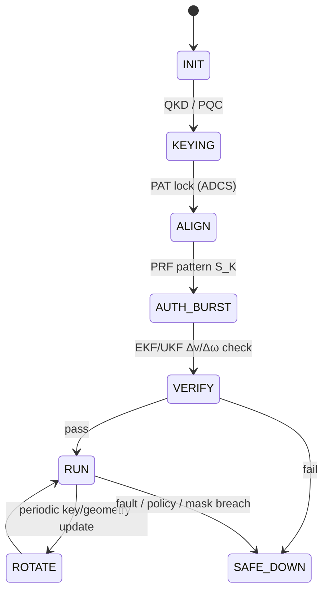

# Cryptoquantic Links: Physical Layer Authentication and Propulsion Assist via Momentum-Coupled Information Channels

**Authors:**  
Amedeo Pelliccia  
**Version:** v1.0 (Camera-ready)  
**Program Context:** AMPEL360 · AQUA V. · UTCS-compliant · S1000D-ready

> **Note:** Equations are shown in LaTeX for readability and copy/paste. For rendered math, see [docs/cryptoquantics.pdf](link-to-pdf) or the equation images below. GitHub does not natively render LaTeX equations in Markdown files.

---

## Abstract

Modern space-based systems rely on cryptographic protocols operating at the upper layers of the communication stack, leaving the physical layer vulnerable to sophisticated spoofing and intercept attacks. This paper introduces **Cryptoquantics**, a novel framework for co-designing optical and microwave communication links that embeds security directly into the physics of the transmission medium. We formalize the concept of a **cinematic channel**, where a cryptographically keyed, time-varying pattern of photon momentum is modulated onto a high-bandwidth data stream. This dual-use beam simultaneously transmits information and imparts a verifiable kinetic signature (a specific change in velocity, Δv, and/or angular momentum, Δω) onto the receiving spacecraft. Authentication is achieved by requiring the receiver to successfully verify both the digital data and the predicted kinematic effects, a task that is physically prohibitive for an adversary without control of a commensurate power source and precise pointing. We present the **Cryptoquantic Secure Session Protocol (CQ‑SSP)**, detail its resilience against advanced, physics-conditioned generative adversarial network (PC‑GAN) attacks through multi-node consensus and cross-modal sensor validation, and establish the system's engineering requirements. The framework not only establishes a new paradigm for physical layer security but also enables secondary functionality, such as propellantless momentum management and precision attitude-control assist.

**Keywords:** physical-layer security, optical ISL, photon pressure, Δv/Δω authentication, GNC, QKD, post-quantum cryptography, multi-node consensus, ADCS, spacecraft propulsion assist

---

## 1. Introduction

The security of space-based assets is a paramount concern for commercial, civil, and defense operations. Current security architectures for space communication links predominantly rely on well-established cryptographic algorithms (e.g., AES, RSA, ECC) and emerging post-quantum cryptography (PQC) implemented at the network, transport, or application layers [1]. While robust, these methods implicitly trust the integrity of the underlying physical signal. An advanced adversary capable of intercepting and re-transmitting a signal, or inserting a malicious one, could potentially spoof a legitimate communication partner, even if the encrypted payload remains secure [2]. This vulnerability represents a critical gap in end-to-end security, particularly for autonomous systems that rely on communication links for guidance, navigation, and control (GNC).

The principle of radiation pressure, first formalized by Maxwell and experimentally verified by Lebedev and later Nichols and Hull, dictates that electromagnetic radiation carries momentum and exerts a force upon interaction with matter [3, 4]. This physical phenomenon is the basis for solar sails and has been proposed for various micro-propulsion applications [5]. To date, however, the momentum transfer inherent in a communication link has been treated primarily as a disturbance to be rejected by the attitude determination and control system (ADCS).

This paper proposes a paradigm shift: we treat photon momentum not as a disturbance, but as a controllable, verifiable feature of the communication link. We introduce **Cryptoquantics**, a framework that leverages the fundamental physics of photon momentum to create a secure, authenticated physical layer. The core innovation is the **cinematic channel**: a low-bandwidth information channel encoded in the kinetic impulse delivered by the communication beam. By securely keying the beam's power, pointing vector, and timing, a transmitter (TX) can impart a unique Δv signature onto a receiver (RX), which serves as a physical "password."

**Contributions.**  
(i) **Formalization of the Cinematic Channel:** we develop physical and information-theoretic models for a momentum-based channel, establishing observability and capacity limits.  
(ii) **CQ‑SSP Protocol:** we specify a complete session protocol that integrates the cinematic channel with classical data transmission and QKD/PQC keying.  
(iii) **Resilience to Physics-Aware Adversaries:** we analyse security against physics-conditioned GANs (PC‑GANs) and propose a defensive architecture based on multi-node consensus and cross‑modal residual testing.

This work transforms the physical layer from a passive vulnerability into an active instrument of security, binding digital identity to demonstrable physical action.

---

## 2. Theoretical Framework: The Cinematic Channel

Cryptoquantics establishes three coupled channels between the transmitter (TX) and receiver (RX).

### 2.1 Classical and Quantum Channels

The primary high-bandwidth channel is a standard **classical data link**, typically an optical laser channel, modulated to carry mission data with FEC. Its performance follows the familiar link budget:

LaTeX: `$$ \mathrm{SNR} \approx \frac{(R_p P_r)^2}{N_0 B}, \qquad R \lesssim B \log_2(1+\mathrm{SNR}) \tag{1} $$`


where $R_p$ is photodetector responsivity, $P_r$ received optical power, $B$ bandwidth, and $N_0$ noise PSD [6]. For session keying we recommend a **quantum channel** using QKD (e.g., BB84) [7]. Alternatively, NIST-standardized PQC may be used where QKD is impractical.

### 2.2 Cinematic Channel: Physics and Observability

The **cinematic channel** uses controlled photon momentum as the information carrier. The force $\mathbf{F}(t)$ from an optical beam of power $P(t)$ with incidence unit vector $\hat{\mathbf{n}}(t)$ on a spacecraft of mass $m$ is:

LaTeX: `$$ \mathbf{F}(t) = \frac{\alpha P(t)}{c}\,\hat{\mathbf{n}}(t) \tag{2} $$`


with $c$ the speed of light and $\alpha \in [1,2]$ the reflectivity coefficient ($\alpha=1$ absorption, $\alpha=2$ perfect reflection). The induced velocity change over interval $T$ is:

LaTeX: `$$ \Delta \mathbf{v} = \frac{1}{m} \int_{t_0}^{t_0+T} \mathbf{F}(t)\,dt \tag{3} $$`


Despite the small absolute force (e.g., 10 kW → ≈ 67 μN), the resulting acceleration is measurable by modern spacecraft instrumentation. We define an **acceleration SNR**:

LaTeX: `$$ \mathrm{SNR}_a = \frac{a_{\mathrm{sig}}^2}{\sigma_a^2} \tag{4} $$`


where $a_{\mathrm{sig}}$ is mean acceleration from the cryptoquantic signal and $\sigma_a^2$ is the variance of the fused acceleration noise (IMU + OD). For binary power modulation with symbol time $T_s$ and noise correlation time $T_n$, the bit error probability is:

LaTeX: `$$ P_b \approx Q\!\left(\sqrt{2\,\mathrm{SNR}_a\,\frac{T_s}{T_n}}\right) \tag{5} $$`


This bounds the cinematic channel as a **low-rate** but robust authentication channel.

> **Momentum ledger (physics bound).** Any thrust claim must satisfy $F \le P_{\mathrm{rad}}/c$ with explicit accounting of momentum exchange (photons, environment, or remote beamer).

---

## 3. Cryptoquantic Secure Session Protocol (CQ‑SSP)

CQ‑SSP orchestrates three channels via a session state machine and a keyed **AUTH‑BURST** that imprints a verifiable Δv/Δω signature.

### 3.1 State Machine



### 3.2 Signature Construction & Verification

A session key $K$ (QKD/PQC) seeds a PRF $f_K$ that generates control tuples:

LaTeX: `$$ \mathcal{S}_K \!=\! \{(P_i,\theta_i,\phi_i,T_i)\}_{i=1}^N \!=\! f_K(\text{context}) \tag{6} $$`


Context includes mission time, ephemerides, session ID. TX executes $\mathcal{S}_K$ during **AUTH‑BURST**. RX's V&V fuses IMU, star tracker, and OD to estimate $\widehat{\Delta \mathbf{v}}$. Authentication succeeds if:

LaTeX: `$$ \left\| \widehat{\Delta \mathbf{v}} - \Delta \mathbf{v}(\mathcal{S}_K) \right\| \le \varepsilon_{\Delta v}, \quad \Pr \ge 1-\beta \tag{7} $$`


### 3.3 ToO‑MAC Scheduler (Talk‑and‑Thrust)

- Inputs: `SNR_target`, `BER_target`, `Δv_target`, thermal & PAT budgets.
- Decision: slot-wise power, micro-offset, dwell.
- Constraint: do not degrade primary BER beyond target; satisfy Δv within window.

**Algorithm 1 (sketch).**
```
for slot in session:
    QoS = predict_BER(SNR, Mod, FEC)
    dV  = predict_delta_v(P, offset, reflectivity, duration)
    score = wq*QoS + wt*dV - wtq*Thermal - wr*Risk
    choose slot params maximizing score under constraints
    commit(TxPower, BeamOffset, ModScheme, Duration)
```

---

## 4. Threat Model & Advanced Defenses

### 4.1 Physics-Conditioned GAN (PC‑GAN)

Adversary trains a generator $G_\theta(z,c)$ to synthesize sensor time series (optical, IMU, star tracker, thermal) that mimic a valid session. We augment the discriminator with **physics-residual validators** and penalize violations:

LaTeX: `$$ \mathcal{L}_G = \mathcal{L}_{\mathrm{adv}} + \sum_i \lambda_i\|R_i\|^2 \tag{8} $$`


with residuals $R_i$ for orbital dynamics, attitude torque closure, and thermal‑power consistency.

### 4.2 Layered Defenses

1) **Multi-node physical consensus:** ≥3 observers confirm the same Δv/Δω within $\varepsilon_{\mathrm{cons}}$.  
2) **Randomized beam geometry:** key‑derived micro‑offsets $(\delta\theta,\delta\phi,\delta P)$ below BER impact but above gyro noise.  
3) **Cross‑modal residuals:** absorbed power ↔ ΔT; offset ↔ torque ↔ gyro drift; external laser ranging for OD cross‑check.

---

## 5. System Implementation & Requirements (LEO Reference)

**Table 1 — Key Requirements**

| Subsystem | Parameter | Requirement | Rationale |
|---|---|---|---|
| ADCS/PAT | Pointing error (AUTH‑BURST) | ≤ 10 µrad (1σ) | Signature fidelity |
|  | Jitter PSD | Must not degrade BER > 1e-6 | Protects data channel |
| EPS/TCS | TX power slew | ≤ dP/dt_max | Bus/thermal stability |
|  | Optics bench ΔT (60 s) | ≤ 0.5 °C | Alignment integrity |
| V&V/GNC | σ(Δv) over 600 s | ≤ 0.05 mm/s | Low false alarms |
|  | Auth. confidence | ≥ 0.999 | Strong acceptance gate |
| Security | Key source | QKD or NIST PQC (FS) | Future-proof keys |
|  | Signature gen | Keyed PRF, context-bound | Anti-replay |

---

## 6. Verification & Validation (V&V)

- **TV‑1 (Link + Δv co-mode):** AUTH‑BURST with BER ≤ target and $\|\widehat{\Delta v}-\Delta v_{\text{pred}}\|\le 3\sigma$.  
- **TV‑2 (Sensor spoof resilience):** HIL injection; detect TPR ≥ 0.99, FAR ≤ 1e−3.  
- **TV‑3 (Multi-node consensus):** two sats + ground confirm Δv within $\varepsilon_{\mathrm{cons}}$.  
- **TV‑4 (Momentum ledger check):** verify $F \le P_{\mathrm{rad}}/c$; audit power, thermal, radiation.

---

## 7. Discussion & Future Work

Cryptoquantics elevates the physical layer to an authentication primitive. Limitations are the low capacity of the cinematic channel and dependence on sensor noise floors. Near-term work: (i) optimal co-optimization of data rate and Δv under thermal/PAT constraints; (ii) extension to modulated thermal radiation as an auxiliary covert channel; (iii) on-orbit demos combining station-keeping assist with periodic AUTH‑BURSTs.

**PQP Pathway (Physics-compliant):** Propulsion assist today is photon-pressure based. Longer term, **Dynamical Casimir Emission (DCE)** may serve as a photon source for thrust $F=P_{\mathrm{DCE}}/c$ (still a photon rocket by momentum ledger). Pure "reactionless" Casimir drives in vacuum are excluded by conservation bounds.

---

## 8. Conclusion

Cryptoquantics integrates cryptographic protocols with the physics of photon momentum. By transmitting a verifiable kinetic signature alongside a classical data stream, the method binds a transmitter's digital identity to its physical capabilities and location, providing robust protection against advanced spoofing attacks while enabling propellantless momentum management. With demands compatible with near-term optical ISL and precision GNC, Cryptoquantics offers a deployable pathway toward intrinsically secure space links with operational benefits.

---

## References

[1] D. D. C. de Rubert, et al., "A Survey on Security for Space Systems," *ACM Computing Surveys*, vol. 52, no. 1, pp. 1-38, 2019.  
[2] T. E. Humphreys, "Statement on the Vulnerability of Civil Unmanned Aerial Vehicles and other Systems to GPS Spoofing," U.S. House of Representatives Committee on Homeland Security, 2012.  
[3] J. C. Maxwell, *A Treatise on Electricity and Magnetism*, vol. 2, Oxford: Clarendon Press, 1873.  
[4] E. F. Nichols and G. F. Hull, "The Pressure due to Radiation," *Physical Review (Series I)*, vol. 17, no. 1, pp. 26-50, 1903.  
[5] C. R. McInnes, *Solar Sailing: Technology, Dynamics and Mission Applications*, Springer-Praxis, 2004.  
[6] J. G. Proakis and M. Salehi, *Digital Communications*, 5th ed., McGraw-Hill, 2008.  
[7] C. H. Bennett and G. Brassard, "Quantum cryptography: Public key distribution and coin tossing," in *Proc. IEEE Int. Conf. on Computers, Systems and Signal Processing*, 1984, pp. 175-179.  
[8] B. D. Tapley, B. E. Schutz, and G. H. Born, *Statistical Orbit Determination*, Elsevier Academic Press, 2004.  
[9] I. Goodfellow, et al., "Generative Adversarial Nets," in *Advances in Neural Information Processing Systems 27*, 2014.  
[10] B. L. Edwards, "An overview of the Laser Communications Relay Demonstration Project," *Proceedings of the IEEE*, vol. 104, no. 11, pp. 2101-2117, 2016.

---

## Annex A — Nomenclature

- $B$: Channel bandwidth (Hz)  
- $c$: Speed of light (m/s)  
- $\hat{\mathbf{n}}$: Beam incidence unit vector  
- $N_0$: Noise power spectral density (W/Hz)  
- $P, P_r, P_{\mathrm{rad}}$: Optical power (W)  
- $Q(\cdot)$: Gaussian tail function  
- $R$: Data rate (bit/s)  
- $R_p$: Photodetector responsivity (A/W)  
- $\alpha$: Reflectivity factor (1–2)  
- $\mathbf{F}$: Force (N)  
- $m$: Spacecraft mass (kg)  
- $\Delta \mathbf{v}$: Velocity change (m/s)  
- $\mathrm{SNR}, \mathrm{SNR}_a$: Signal‑to‑noise ratios  
- $T_s$: Symbol time; $T_n$: Noise correlation time

---

## Annex B — EKF Measurement Model (Δv/Δω)

State vector $x=[\mathbf{r},\mathbf{v},\mathbf{q},\boldsymbol\omega, \ldots]^T$.  
Control input $u=\{P,\hat{\mathbf{n}},\mathrm{dwell}\}$.  
Process: rigid‑body + two‑body orbit + perturbations; measurement: IMU (accel, gyro), star tracker (quaternion), GNSS/OD.  
Residuals validated against predicted $\Delta \mathbf{v}(u)$ and $\Delta \boldsymbol\omega(u)$ for AUTH‑BURST acceptance.

---

## Annex C — UTCS / S1000D Mapping

**UTCS Codes (examples)**  
- `COM-OPT-ISL-THR-ACT` — Optical ISL terminal with thrust‑assist mode  
- `SEC-CQ-CHAN-ΔV` — Cinematic Δv signature channel  
- `NET-SCH-ToO-MAC` — Talk‑and‑Thrust scheduler  
- `NAV-ADCS-PAT-COUP` — PAT–ADCS beam vectorization coupling  
- `VNV-PQP-LEDGER` — Energy‑Momentum audit procedures

**S1000D DMCs**  
- **ICD**: Interfaces IFX‑DATA‑OPT / IFX‑THR‑CTRL / IFX‑ADCS‑PAT / IFX‑V&V  
- **PR**: *Start Secure Session*, *Auth‑Burst*, *Safe‑Down*  
- **DS**: Functional description + power/thermal budgets  
- **V&V**: TV‑1/2/3/4 with acceptance criteria
